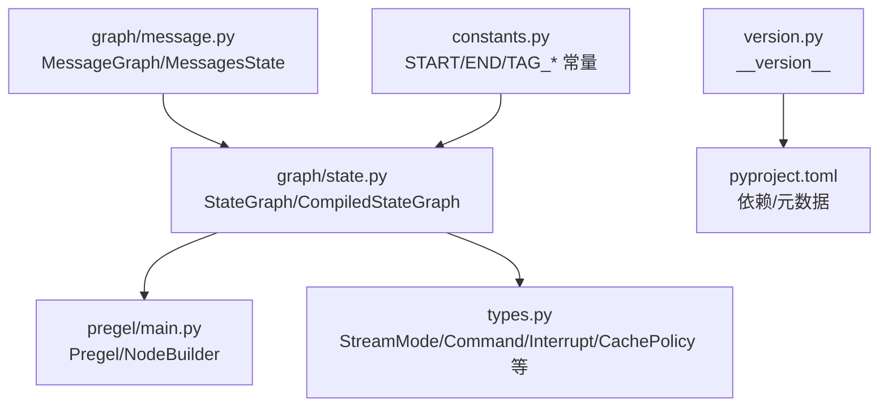
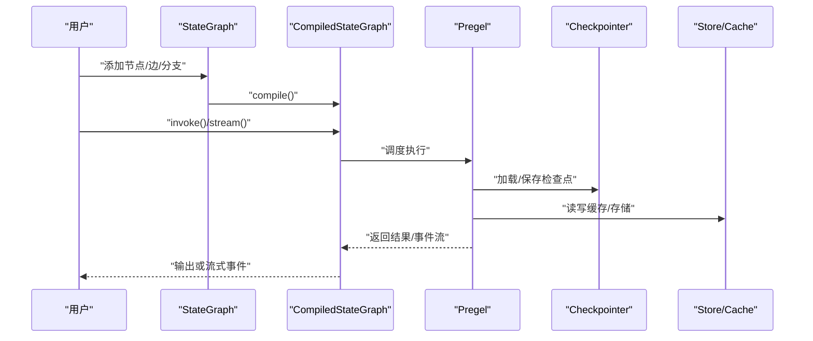
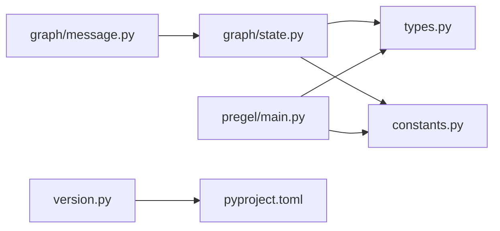

# API 参考

<cite>
**本文引用的文件**
- [README.md](file://README.md)
- [libs/langgraph/pyproject.toml](file://libs/langgraph/pyproject.toml)
- [libs/langgraph/langgraph/version.py](file://libs/langgraph/langgraph/version.py)
- [libs/langgraph/langgraph/constants.py](file://libs/langgraph/langgraph/constants.py)
- [libs/langgraph/langgraph/graph/state.py](file://libs/langgraph/langgraph/graph/state.py)
- [libs/langgraph/langgraph/graph/message.py](file://libs/langgraph/langgraph/graph/message.py)
- [libs/langgraph/langgraph/pregel/main.py](file://libs/langgraph/langgraph/pregel/main.py)
- [libs/langgraph/langgraph/types.py](file://libs/langgraph/langgraph/types.py)
</cite>

## 目录
1. [简介](#简介)
2. [项目结构](#项目结构)
3. [核心组件](#核心组件)
4. [架构总览](#架构总览)
5. [详细组件分析](#详细组件分析)
6. [依赖关系分析](#依赖关系分析)
7. [性能与并发特性](#性能与并发特性)
8. [故障排查指南](#故障排查指南)
9. [结论](#结论)
10. [附录：版本兼容与弃用迁移](#附录版本兼容与弃用迁移)

## 简介
本文件为 LangGraph 的完整 API 参考，覆盖公共接口（类、方法、函数、属性）的参数类型、返回值、异常说明与使用示例，并按模块与功能进行分类组织。内容基于仓库中的核心实现文件整理而成，确保与实际源码一致。

LangGraph 是一个面向长时序、有状态工作流与智能体的低层编排框架，支持持久化执行、人类在环、内存与调试可观测性等能力。其核心由“图式状态机”与“Pregel 并行算法”驱动，提供多种 API 形态（图式 API、函数式 API、底层 Pregel API），满足从入门到高级的广泛场景。

章节来源
- [README.md:1-83](file://README.md#L1-L83)

## 项目结构
LangGraph 位于 libs/langgraph 目录下，核心模块包括：
- graph/state.py：StateGraph 与编译后的可执行图
- graph/message.py：消息状态与消息图（已弃用）
- pregel/main.py：Pregel 运行时与节点构建器
- types.py：流模式、命令、中断、缓存策略等核心类型
- constants.py：公共常量与弃用提示
- version.py：包版本导出
- pyproject.toml：依赖与元数据

图表来源
- [libs/langgraph/langgraph/graph/state.py:115-184](file://libs/langgraph/langgraph/graph/state.py#L115-L184)
- [libs/langgraph/langgraph/pregel/main.py:337-590](file://libs/langgraph/langgraph/pregel/main.py#L337-L590)
- [libs/langgraph/langgraph/types.py:51-83](file://libs/langgraph/langgraph/types.py#L51-L83)
- [libs/langgraph/langgraph/graph/message.py:29-34](file://libs/langgraph/langgraph/graph/message.py#L29-L34)
- [libs/langgraph/langgraph/constants.py:12-31](file://libs/langgraph/langgraph/constants.py#L12-L31)
- [libs/langgraph/langgraph/version.py:1-13](file://libs/langgraph/langgraph/version.py#L1-L13)
- [libs/langgraph/pyproject.toml:5-33](file://libs/langgraph/pyproject.toml#L5-L33)

章节来源
- [libs/langgraph/pyproject.toml:1-129](file://libs/langgraph/pyproject.toml#L1-L129)

## 核心组件
本节概述 LangGraph 的关键公共 API 组件及其职责。

- 图式 API
  - StateGraph：用于声明状态、节点、分支与边的构建器；需调用 compile() 生成可执行图
  - CompiledStateGraph：由 StateGraph.compile() 返回，提供 invoke()/stream()/astream()/ainvoke() 等执行方法
  - MessageGraph：消息图（已弃用），建议改用带 messages 键的 StateGraph
  - MessagesState：消息状态的 TypedDict 包装
  - add_messages：消息合并与去重的 reducer 函数

- Pregel 运行时 API
  - Pregel：底层运行时，支持直接构建节点与通道，管理执行步骤、检查点、缓存与重试
  - NodeBuilder：声明式构建 Pregel 节点，支持订阅通道、写入通道、元数据与重试策略

- 类型与流式输出
  - StreamMode：values/updates/messages/custom/checkpoints/tasks/debug
  - Command/Interrupt/CachePolicy/RetryPolicy：控制流程、中断与缓存/重试行为
  - GraphOutput：v2 版本的统一输出容器

- 常量
  - START/END：图的起止虚拟节点名
  - TAG_NOSTREAM/TAG_HIDDEN：标签常量

章节来源
- [libs/langgraph/langgraph/graph/state.py:115-184](file://libs/langgraph/langgraph/graph/state.py#L115-L184)
- [libs/langgraph/langgraph/graph/message.py:29-34](file://libs/langgraph/langgraph/graph/message.py#L29-L34)
- [libs/langgraph/langgraph/pregel/main.py:337-590](file://libs/langgraph/langgraph/pregel/main.py#L337-L590)
- [libs/langgraph/langgraph/types.py:51-83](file://libs/langgraph/langgraph/types.py#L51-L83)
- [libs/langgraph/langgraph/constants.py:12-31](file://libs/langgraph/langgraph/constants.py#L12-L31)

## 架构总览
LangGraph 的执行路径通常为：用户通过 StateGraph 或函数式 API 构建图，编译后得到可执行图；执行时由 Pregel 算法驱动节点并管理通道与状态；支持检查点、缓存、重试与流式输出。

图表来源
- [libs/langgraph/langgraph/graph/state.py:115-184](file://libs/langgraph/langgraph/graph/state.py#L115-L184)
- [libs/langgraph/langgraph/pregel/main.py:337-590](file://libs/langgraph/langgraph/pregel/main.py#L337-L590)
- [libs/langgraph/langgraph/types.py:105-115](file://libs/langgraph/langgraph/types.py#L105-L115)

## 详细组件分析

### StateGraph 与编译图
- 角色与职责
  - 构建状态图：定义 state_schema/context_schema/input_schema/output_schema
  - 注册节点：add_node() 支持多种签名与输入 schema 推断
  - 添加边与条件分支：add_edge()/add_conditional_edges()
  - 编译：compile() 生成 CompiledStateGraph，具备 invoke/stream/astream/ainvoke 等方法
- 关键参数
  - state_schema：状态模型（如 TypedDict/Annotated 列表）
  - context_schema：运行时上下文（只读）
  - input_schema/output_schema：输入/输出类型（默认与 state_schema 相同）
- 返回值
  - compile() 返回 CompiledStateGraph 实例
- 异常
  - 重复节点名、保留节点名（START/END）、非法字符、未编译即添加节点的警告
- 使用示例（参考）
  - [示例：基础 StateGraph 与节点:143-183](file://libs/langgraph/langgraph/graph/state.py#L143-L183)
  - [示例：add_node 多种签名与输入推断:330-565](file://libs/langgraph/langgraph/graph/state.py#L330-L565)
  - [示例：add_edge 条件与多起点汇聚:788-800](file://libs/langgraph/langgraph/graph/state.py#L788-L800)

章节来源
- [libs/langgraph/langgraph/graph/state.py:115-184](file://libs/langgraph/langgraph/graph/state.py#L115-L184)
- [libs/langgraph/langgraph/graph/state.py:292-786](file://libs/langgraph/langgraph/graph/state.py#L292-L786)
- [libs/langgraph/langgraph/graph/state.py:788-800](file://libs/langgraph/langgraph/graph/state.py#L788-L800)

### MessageGraph 与消息状态
- 角色与职责
  - MessageGraph：以消息列表为唯一状态的图（已弃用）
  - MessagesState：消息状态的 TypedDict 包装
  - add_messages：消息合并与去重的 reducer
- 弃用提示
  - MessageGraph 在 v1.0.0 弃用，建议使用带 messages 键的 StateGraph
- 使用示例（参考）
  - [示例：add_messages 基本用法与覆盖:91-127](file://libs/langgraph/langgraph/graph/message.py#L91-L127)
  - [示例：OpenAI 消息格式转换:129-184](file://libs/langgraph/langgraph/graph/message.py#L129-L184)
  - [示例：MessageGraph（弃用）:259-295](file://libs/langgraph/langgraph/graph/message.py#L259-L295)

章节来源
- [libs/langgraph/langgraph/graph/message.py:29-34](file://libs/langgraph/langgraph/graph/message.py#L29-L34)
- [libs/langgraph/langgraph/graph/message.py:60-186](file://libs/langgraph/langgraph/graph/message.py#L60-L186)
- [libs/langgraph/langgraph/graph/message.py:247-309](file://libs/langgraph/langgraph/graph/message.py#L247-L309)

### Pregel 与 NodeBuilder
- 角色与职责
  - Pregel：底层运行时，管理节点、通道、检查点、缓存、重试与流式输出
  - NodeBuilder：声明式构建节点，支持订阅通道、写入通道、元数据、重试策略与缓存策略
- 关键参数
  - nodes：节点映射（PregelNode 或 NodeBuilder）
  - channels：通道映射（含受保护通道 TASKS）
  - stream_mode：values/updates/messages/custom/checkpoints/tasks/debug
  - checkpointer/store/cache：持久化与缓存
  - retry_policy/cache_policy：全局重试与缓存策略
- 返回值
  - Pregel 构造成功后即可执行（invoke/stream/astream/ainvoke）
- 使用示例（参考）
  - [示例：单节点应用:414-440](file://libs/langgraph/langgraph/pregel/main.py#L414-L440)
  - [示例：多节点与多输出通道:442-476](file://libs/langgraph/langgraph/pregel/main.py#L442-L476)
  - [示例：Topic 通道累积:478-512](file://libs/langgraph/langgraph/pregel/main.py#L478-L512)
  - [示例：BinaryOperatorAggregate 聚合:514-556](file://libs/langgraph/langgraph/pregel/main.py#L514-L556)
  - [示例：引入循环与 None 结束:558-589](file://libs/langgraph/langgraph/pregel/main.py#L558-L589)

章节来源
- [libs/langgraph/langgraph/pregel/main.py:337-590](file://libs/langgraph/langgraph/pregel/main.py#L337-L590)
- [libs/langgraph/langgraph/pregel/main.py:173-335](file://libs/langgraph/langgraph/pregel/main.py#L173-L335)

### 流式输出与事件类型
- StreamMode
  - values：每步输出完整状态
  - updates：每步输出节点更新
  - messages：逐 token 输出消息及元数据
  - custom：自定义数据（需要 StreamWriter）
  - checkpoints：检查点事件
  - tasks：任务开始/结束事件
  - debug：同时输出 checkpoints 与 tasks
- 事件类型
  - ValuesStreamPart/UpdatesStreamPart/MessagesStreamPart/CustomStreamPart/CheckpointStreamPart/TasksStreamPart/DebugStreamPart
- 使用示例（参考）
  - [示例：values/updates/messages/custom/checkpoints/tasks/debug:250-353](file://libs/langgraph/langgraph/types.py#L250-L353)

章节来源
- [libs/langgraph/langgraph/types.py:118-132](file://libs/langgraph/langgraph/types.py#L118-L132)
- [libs/langgraph/langgraph/types.py:250-353](file://libs/langgraph/langgraph/types.py#L250-L353)

### 中断、命令与缓存/重试策略
- 中断 Interrupt
  - 用于在节点中暂停执行并返回客户端携带的值
  - 支持通过 id 标识与恢复
- 命令 Command
  - 控制图的状态更新、跳转与发送消息
  - 支持 goto、resume、update 等字段
- 缓存策略 CachePolicy
  - key_func：缓存键生成函数
  - ttl：过期时间
- 重试策略 RetryPolicy
  - initial_interval/backoff_factor/max_interval/max_attempts/jitter/retry_on
- 使用示例（参考）
  - [示例：interrupt 与 Command 恢复:705-794](file://libs/langgraph/langgraph/types.py#L705-L794)
  - [示例：CachePolicy/RetryPolicy 定义:429-440](file://libs/langgraph/langgraph/types.py#L429-L440)
  - [示例：RetryPolicy 字段:404-424](file://libs/langgraph/langgraph/types.py#L404-L424)

章节来源
- [libs/langgraph/langgraph/types.py:444-500](file://libs/langgraph/langgraph/types.py#L444-L500)
- [libs/langgraph/langgraph/types.py:574-647](file://libs/langgraph/langgraph/types.py#L574-L647)
- [libs/langgraph/langgraph/types.py:429-440](file://libs/langgraph/langgraph/types.py#L429-L440)
- [libs/langgraph/langgraph/types.py:404-424](file://libs/langgraph/langgraph/types.py#L404-L424)
- [libs/langgraph/langgraph/types.py:705-794](file://libs/langgraph/langgraph/types.py#L705-L794)

### 常量与弃用提示
- 常量
  - START/END：图的起止节点
  - TAG_NOSTREAM/TAG_HIDDEN：标签
- 弃用提示
  - constants 中对 Send/Interrupt 与部分内部常量的导入提示
- 使用示例（参考）
  - [示例：常量定义与弃用提示:12-64](file://libs/langgraph/langgraph/constants.py#L12-64)

章节来源
- [libs/langgraph/langgraph/constants.py:12-64](file://libs/langgraph/langgraph/constants.py#L12-L64)

## 依赖关系分析
LangGraph 的公共 API 依赖关系如下：

图表来源
- [libs/langgraph/langgraph/graph/state.py:77-87](file://libs/langgraph/langgraph/graph/state.py#L77-L87)
- [libs/langgraph/langgraph/graph/message.py:25-27](file://libs/langgraph/langgraph/graph/message.py#L25-L27)
- [libs/langgraph/langgraph/pregel/main.py:145-161](file://libs/langgraph/langgraph/pregel/main.py#L145-L161)
- [libs/langgraph/langgraph/version.py:3-12](file://libs/langgraph/langgraph/version.py#L3-L12)
- [libs/langgraph/pyproject.toml:26-33](file://libs/langgraph/pyproject.toml#L26-L33)

章节来源
- [libs/langgraph/pyproject.toml:26-33](file://libs/langgraph/pyproject.toml#L26-L33)

## 性能与并发特性
- 并发模型
  - Pregel 算法采用“批量同步并行”模型，分步执行节点，避免竞态
- 缓存与重试
  - 支持节点级与全局缓存策略（CachePolicy），减少重复计算
  - 支持节点级与全局重试策略（RetryPolicy），提升鲁棒性
- 流式输出
  - 多种 stream_mode 适配不同观测与消费场景
- 检查点
  - 支持持久化检查点，保障长时间运行的可恢复性
- 并发与线程安全
  - 运行时内部使用队列与锁保证通道更新的原子性
  - 用户自定义节点应避免共享可变状态，或自行加锁

章节来源
- [libs/langgraph/langgraph/pregel/main.py:614-634](file://libs/langgraph/langgraph/pregel/main.py#L614-L634)
- [libs/langgraph/langgraph/types.py:429-440](file://libs/langgraph/langgraph/types.py#L429-L440)
- [libs/langgraph/langgraph/types.py:404-424](file://libs/langgraph/langgraph/types.py#L404-L424)

## 故障排查指南
- 常见错误与处理
  - 非法节点名：包含保留字符（如命名空间分隔符）会抛出错误
  - 重复节点名：添加已有节点名会抛出错误
  - 保留节点名：不能使用 START/END 作为节点名
  - 通道冲突：同一键存在不同类型的通道会抛出错误
  - 未编译即添加节点：会记录警告，变更不会反映到已编译图
- 中断相关
  - 使用 interrupt() 必须启用检查点，否则无法恢复
  - 恢复时需使用 Command 指定 resume 值
- 流式输出
  - 若未设置正确的 stream_mode，可能无法获得预期事件
- 版本与弃用
  - MessageGraph 已弃用，请使用带 messages 键的 StateGraph
  - constants 中对 Send/Interrupt 的导入已迁移到 types

章节来源
- [libs/langgraph/langgraph/graph/state.py:694-699](file://libs/langgraph/langgraph/graph/state.py#L694-L699)
- [libs/langgraph/langgraph/graph/state.py:692-693](file://libs/langgraph/langgraph/graph/state.py#L692-L693)
- [libs/langgraph/langgraph/graph/state.py:690-691](file://libs/langgraph/langgraph/graph/state.py#L690-L691)
- [libs/langgraph/langgraph/graph/state.py:676-680](file://libs/langgraph/langgraph/graph/state.py#L676-L680)
- [libs/langgraph/langgraph/graph/message.py:298-303](file://libs/langgraph/langgraph/graph/message.py#L298-L303)
- [libs/langgraph/langgraph/constants.py:34-64](file://libs/langgraph/langgraph/constants.py#L34-L64)

## 结论
LangGraph 提供了从高层图式 API 到底层 Pregel 运行时的完整能力集，兼顾易用性与可扩展性。通过明确的类型系统、丰富的流式输出与完善的中断/检查点机制，能够支撑复杂、长时序、有状态的工作流与智能体。建议优先使用 StateGraph/MessageGraph（推荐）与 Pregel 的 NodeBuilder 进行声明式开发，并结合缓存/重试策略与检查点提升稳定性与性能。

## 附录：版本兼容与弃用迁移
- 版本与兼容
  - Python 版本要求：>=3.10
  - 包版本：来自版本元数据导出
- 弃用与迁移
  - MessageGraph：请改用带 messages 键的 StateGraph
  - constants 中的 Send/Interrupt 导入：请改从 types 导入
  - 旧参数名：config_schema/input/output 等已弃用，请使用 context_schema/input_schema/output_schema
- 迁移要点
  - 将 MessageGraph 替换为 StateGraph，并在状态中使用 messages 键
  - 将从 constants 导入的 Send/Interrupt 改为从 types 导入
  - 将旧参数替换为新参数名，保持向后兼容的过渡期警告

章节来源
- [libs/langgraph/pyproject.toml:10-25](file://libs/langgraph/pyproject.toml#L10-L25)
- [libs/langgraph/langgraph/version.py:1-13](file://libs/langgraph/langgraph/version.py#L1-L13)
- [libs/langgraph/langgraph/graph/message.py:247-309](file://libs/langgraph/langgraph/graph/message.py#L247-L309)
- [libs/langgraph/langgraph/constants.py:34-64](file://libs/langgraph/langgraph/constants.py#L34-L64)
- [libs/langgraph/langgraph/graph/state.py:209-235](file://libs/langgraph/langgraph/graph/state.py#L209-L235)