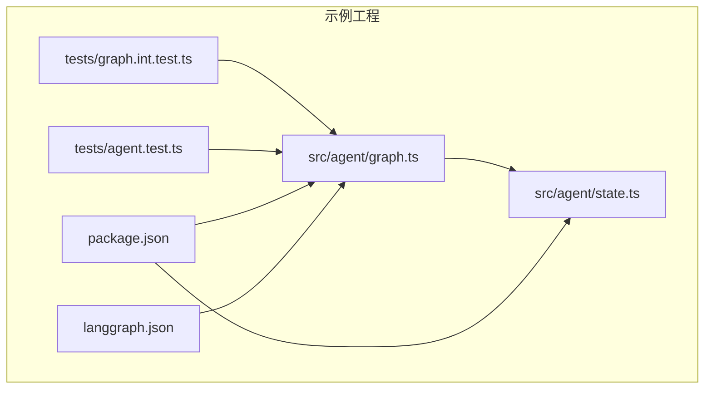
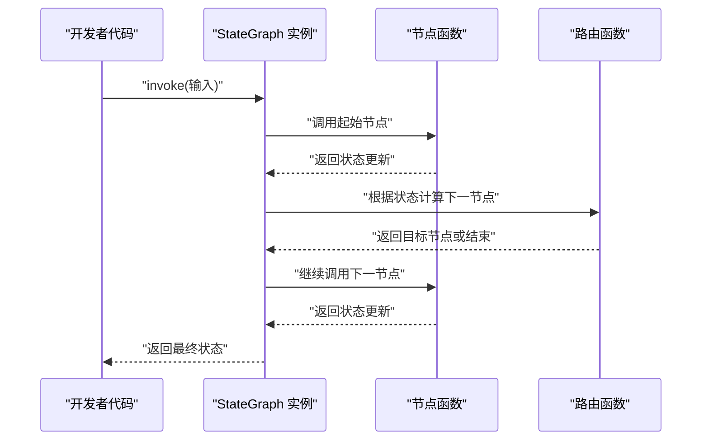
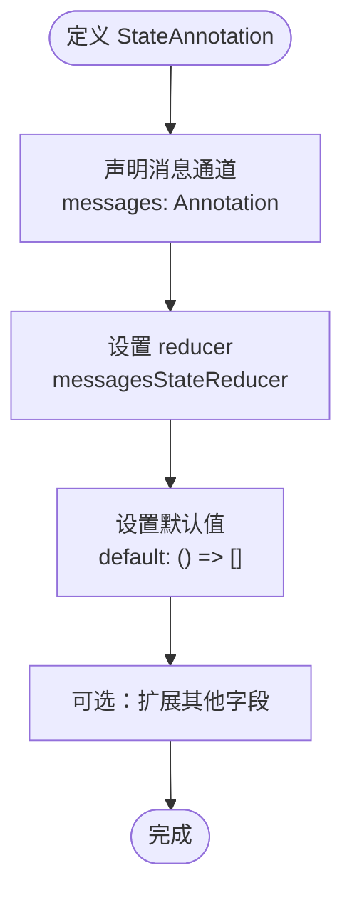
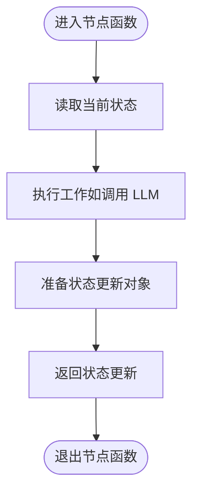
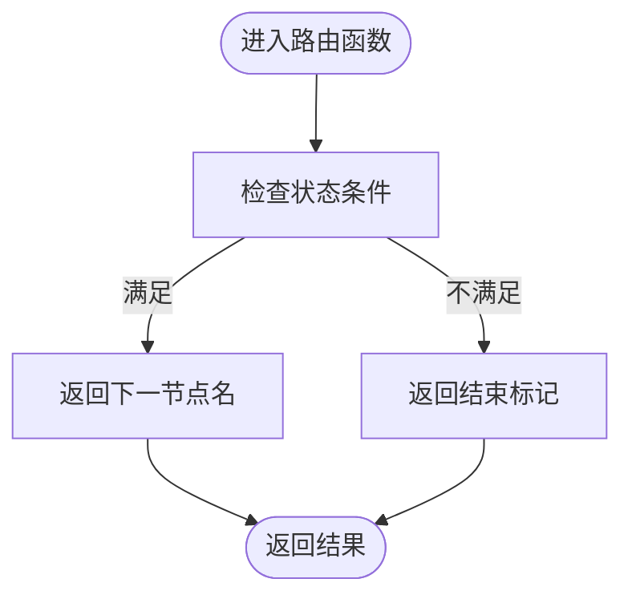
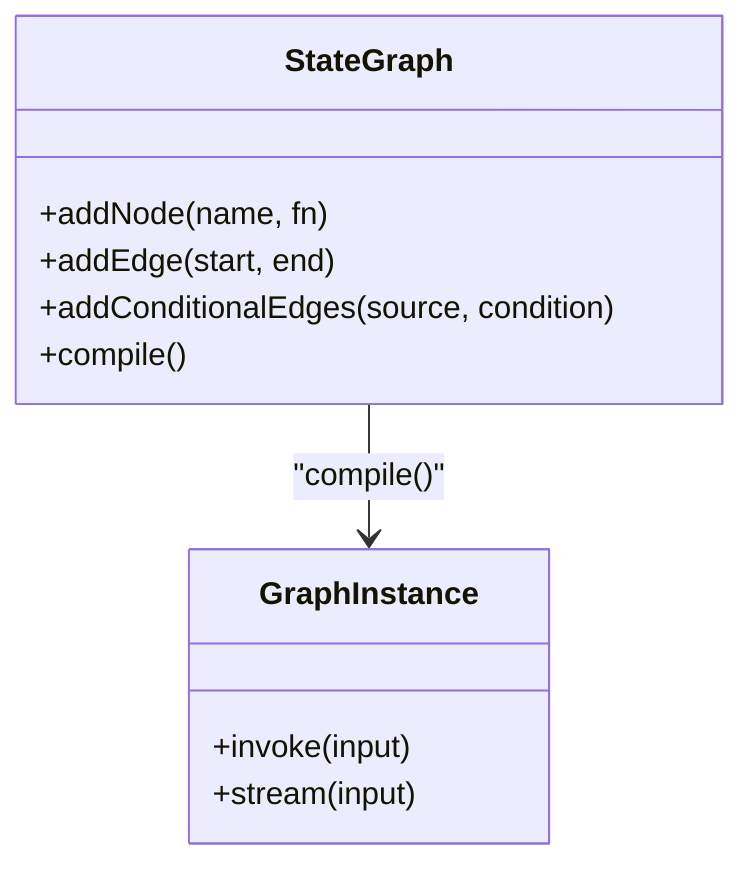
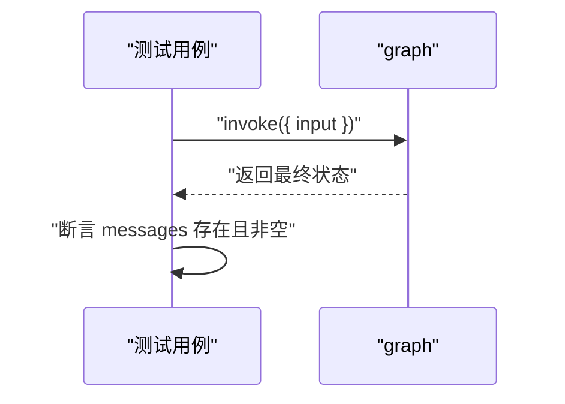
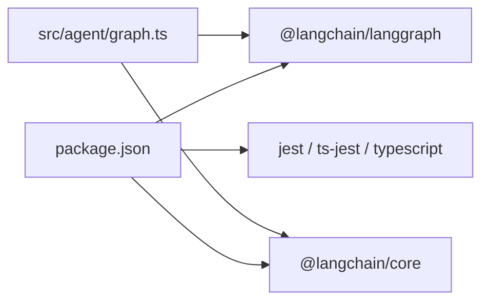

# JavaScript SDK

<cite>
**本文引用的文件**
- [libs/sdk-js/README.md](file://libs/sdk-js/README.md)
- [libs/cli/js-examples/src/agent/graph.ts](file://libs/cli/js-examples/src/agent/graph.ts)
- [libs/cli/js-examples/src/agent/state.ts](file://libs/cli/js-examples/src/agent/state.ts)
- [libs/cli/js-examples/tests/agent.test.ts](file://libs/cli/js-examples/tests/agent.test.ts)
- [libs/cli/js-examples/tests/graph.int.test.ts](file://libs/cli/js-examples/tests/graph.int.test.ts)
- [libs/cli/js-examples/package.json](file://libs/cli/js-examples/package.json)
- [libs/cli/js-examples/langgraph.json](file://libs/cli/js-examples/langgraph.json)
- [README.md](file://README.md)
</cite>

## 目录
1. [简介](#简介)
2. [项目结构](#项目结构)
3. [核心组件](#核心组件)
4. [架构总览](#架构总览)
5. [详细组件分析](#详细组件分析)
6. [依赖分析](#依赖分析)
7. [性能考虑](#性能考虑)
8. [故障排查指南](#故障排查指南)
9. [结论](#结论)
10. [附录](#附录)

## 简介
本文件为 LangGraph JavaScript SDK 的完整 API 文档与使用指南。LangGraph 是一个用于构建有状态、可持久化、可中断的智能体工作流的低层编排框架。在 JavaScript 生态中，LangGraph.js 提供了与 TypeScript 完美契合的类型系统支持，便于在浏览器与 Node.js 环境下进行开发与部署。

根据仓库信息，当前仓库中的 JavaScript SDK 已迁移至独立仓库 langchain-ai/langgraphjs。本文档基于现有仓库中的示例与依赖，给出在浏览器与 Node.js 环境下的使用要点、类型安全特性、IDE 支持、Promise 与 async/await 使用方式、错误处理、超时配置与连接管理的最佳实践。

章节来源
- [libs/sdk-js/README.md:1-1](file://libs/sdk-js/README.md#L1-L1)
- [README.md:32-34](file://README.md#L32-L34)

## 项目结构
本仓库包含多个子模块与示例，其中与 JavaScript SDK 直接相关的是 js-examples 示例工程，展示了如何使用 @langchain/langgraph 与 @langchain/core 构建状态图（StateGraph）与节点逻辑，并通过 Jest 进行单元与集成测试。

- 核心示例位于 libs/cli/js-examples
  - src/agent/graph.ts：定义 StateGraph、节点函数与路由逻辑，并导出已编译的 graph 实例
  - src/agent/state.ts：定义 StateAnnotation，描述消息通道与默认值
  - tests/agent.test.ts：对路由函数进行单元测试
  - tests/graph.int.test.ts：对 graph.invoke 的集成测试
  - package.json：声明运行时依赖（@langchain/langgraph、@langchain/core）与脚本
  - langgraph.json：定义图入口、环境变量与依赖路径

图表来源
- [libs/cli/js-examples/src/agent/graph.ts:1-105](file://libs/cli/js-examples/src/agent/graph.ts#L1-L105)
- [libs/cli/js-examples/src/agent/state.ts:1-60](file://libs/cli/js-examples/src/agent/state.ts#L1-L60)
- [libs/cli/js-examples/tests/agent.test.ts:1-9](file://libs/cli/js-examples/tests/agent.test.ts#L1-L9)
- [libs/cli/js-examples/tests/graph.int.test.ts:1-19](file://libs/cli/js-examples/tests/graph.int.test.ts#L1-L19)
- [libs/cli/js-examples/package.json:1-46](file://libs/cli/js-examples/package.json#L1-L46)
- [libs/cli/js-examples/langgraph.json:1-10](file://libs/cli/js-examples/langgraph.json#L1-L10)

章节来源
- [libs/cli/js-examples/src/agent/graph.ts:1-105](file://libs/cli/js-examples/src/agent/graph.ts#L1-L105)
- [libs/cli/js-examples/src/agent/state.ts:1-60](file://libs/cli/js-examples/src/agent/state.ts#L1-L60)
- [libs/cli/js-examples/tests/agent.test.ts:1-9](file://libs/cli/js-examples/tests/agent.test.ts#L1-L9)
- [libs/cli/js-examples/tests/graph.int.test.ts:1-19](file://libs/cli/js-examples/tests/graph.int.test.ts#L1-L19)
- [libs/cli/js-examples/package.json:1-46](file://libs/cli/js-examples/package.json#L1-L46)
- [libs/cli/js-examples/langgraph.json:1-10](file://libs/cli/js-examples/langgraph.json#L1-L10)

## 核心组件
本节聚焦于在 JavaScript 中使用 LangGraph 的核心组件与接口模式，包括：
- 状态注解（StateAnnotation）：定义消息通道与默认值
- 图构建器（StateGraph）：添加节点、边与条件边
- 节点函数：执行具体工作并返回状态更新
- 路由函数：决定下一步执行的节点或结束
- 编译后的图实例：提供 invoke/stream 等运行时方法

这些组件均来自 @langchain/langgraph 与 @langchain/core 的类型与运行时能力，配合 TypeScript 可获得强类型检查与 IDE 智能提示。

章节来源
- [libs/cli/js-examples/src/agent/state.ts:12-60](file://libs/cli/js-examples/src/agent/state.ts#L12-L60)
- [libs/cli/js-examples/src/agent/graph.ts:87-105](file://libs/cli/js-examples/src/agent/graph.ts#L87-L105)

## 架构总览
LangGraph 在 JS 中的典型运行时流程如下：
- 定义 StateAnnotation，声明消息通道与默认值
- 使用 StateGraph 添加节点与边，形成有向无环或含条件边的图
- 编译得到可运行的 graph 实例
- 通过 graph.invoke 或 stream 执行，传入初始输入，返回最终状态

图表来源
- [libs/cli/js-examples/src/agent/graph.ts:17-105](file://libs/cli/js-examples/src/agent/graph.ts#L17-L105)
- [libs/cli/js-examples/tests/graph.int.test.ts:5-17](file://libs/cli/js-examples/tests/graph.int.test.ts#L5-L17)

章节来源
- [libs/cli/js-examples/src/agent/graph.ts:17-105](file://libs/cli/js-examples/src/agent/graph.ts#L17-L105)
- [libs/cli/js-examples/tests/graph.int.test.ts:5-17](file://libs/cli/js-examples/tests/graph.int.test.ts#L5-L17)

## 详细组件分析

### 组件一：状态注解（StateAnnotation）
- 作用：定义图的状态结构、默认值与合并规则（reducer）
- 关键点：
  - 声明消息通道（messages），使用 messagesStateReducer 合并消息列表
  - 默认值为空数组
  - 可扩展其他字段（如 additionalField）

图表来源
- [libs/cli/js-examples/src/agent/state.ts:47-59](file://libs/cli/js-examples/src/agent/state.ts#L47-L59)

章节来源
- [libs/cli/js-examples/src/agent/state.ts:12-60](file://libs/cli/js-examples/src/agent/state.ts#L12-L60)

### 组件二：节点函数（callModel）
- 作用：执行具体工作（例如调用 LLM），返回对状态的更新
- 关键点：
  - 接收当前状态与可选配置
  - 返回状态更新对象，仅包含需要更新的字段
  - 可结合 LangChain 的模型调用或直接调用第三方 SDK

图表来源
- [libs/cli/js-examples/src/agent/graph.ts:17-68](file://libs/cli/js-examples/src/agent/graph.ts#L17-L68)

章节来源
- [libs/cli/js-examples/src/agent/graph.ts:17-68](file://libs/cli/js-examples/src/agent/graph.ts#L17-L68)

### 组件三：路由函数（route）
- 作用：根据当前状态决定下一步执行的节点或结束
- 关键点：
  - 输入为当前状态
  - 输出为节点名或结束标记
  - 用于条件边的分支逻辑

图表来源
- [libs/cli/js-examples/src/agent/graph.ts:77-85](file://libs/cli/js-examples/src/agent/graph.ts#L77-L85)

章节来源
- [libs/cli/js-examples/src/agent/graph.ts:77-85](file://libs/cli/js-examples/src/agent/graph.ts#L77-L85)

### 组件四：图构建与编译（StateGraph）
- 作用：将节点与边组合成可运行的图，并提供运行时方法
- 关键点：
  - addNode 添加节点
  - addEdge 添加常规边
  - addConditionalEdges 添加条件边
  - compile 得到可运行的 graph 实例

图表来源
- [libs/cli/js-examples/src/agent/graph.ts:87-105](file://libs/cli/js-examples/src/agent/graph.ts#L87-L105)

章节来源
- [libs/cli/js-examples/src/agent/graph.ts:87-105](file://libs/cli/js-examples/src/agent/graph.ts#L87-L105)

### 组件五：运行时管理（graph.invoke/stream）
- 作用：执行图并返回最终状态
- 关键点：
  - invoke 返回 Promise，适合一次性执行
  - stream 支持流式输出（如需）
  - 集成测试展示了如何断言返回的消息数量与内容

图表来源
- [libs/cli/js-examples/tests/graph.int.test.ts:5-17](file://libs/cli/js-examples/tests/graph.int.test.ts#L5-L17)

章节来源
- [libs/cli/js-examples/tests/graph.int.test.ts:5-17](file://libs/cli/js-examples/tests/graph.int.test.ts#L5-L17)

## 依赖分析
- 运行时依赖
  - @langchain/langgraph：提供 StateGraph、编译与运行时能力
  - @langchain/core：提供 RunnableConfig、BaseMessage 等基础类型
- 开发与测试依赖
  - jest、typescript、ts-jest 等用于测试与类型检查
- 包脚本
  - build、test、test:int、lint、format 等

图表来源
- [libs/cli/js-examples/package.json:23-44](file://libs/cli/js-examples/package.json#L23-L44)
- [libs/cli/js-examples/src/agent/graph.ts:5-7](file://libs/cli/js-examples/src/agent/graph.ts#L5-L7)

章节来源
- [libs/cli/js-examples/package.json:1-46](file://libs/cli/js-examples/package.json#L1-L46)
- [libs/cli/js-examples/src/agent/graph.ts:5-7](file://libs/cli/js-examples/src/agent/graph.ts#L5-L7)

## 性能考虑
- 流式执行：若需要实时反馈，优先使用 stream 并按需消费数据块
- 节点内并发：在节点函数内部谨慎并发调用外部服务，避免阻塞
- 状态合并：合理使用 reducer，避免在消息通道中累积过多冗余数据
- 超时控制：在调用外部服务时设置合理的超时时间，防止长时间阻塞
- 内存管理：在长会话或多轮对话中定期清理不需要的历史消息

## 故障排查指南
- 单元测试失败
  - 检查路由函数的返回值是否符合预期
  - 参考路由测试用例的断言方式
- 集成测试失败
  - 确认 graph.invoke 的输入格式正确
  - 检查 messages 是否被正确填充
- 类型错误
  - 确保状态更新对象仅包含 StateAnnotation 中定义的字段
  - 使用 TypeScript 的严格模式与 noImplicitAny
- 超时问题
  - 为外部调用设置超时
  - 在 CI 或生产环境中适当增加测试超时时间
- 环境变量
  - 通过 langgraph.json 指定 env 文件位置
  - 确保密钥与端点在运行环境中可用

章节来源
- [libs/cli/js-examples/tests/agent.test.ts:4-8](file://libs/cli/js-examples/tests/agent.test.ts#L4-L8)
- [libs/cli/js-examples/tests/graph.int.test.ts:5-17](file://libs/cli/js-examples/tests/graph.int.test.ts#L5-L17)
- [libs/cli/js-examples/langgraph.json:7-8](file://libs/cli/js-examples/langgraph.json#L7-L8)

## 结论
LangGraph.js 在 JavaScript/TypeScript 中提供了强大的类型安全与运行时能力，结合 @langchain/langgraph 与 @langchain/core，可以快速构建复杂、可调试、可扩展的有状态工作流。通过示例工程中的状态注解、节点函数、路由函数与图编译流程，开发者可以在浏览器与 Node.js 环境下高效地实现从简单到复杂的智能体应用。

## 附录

### 浏览器与 Node.js 使用差异
- 运行时环境
  - Node.js：可直接使用 @langchain/langgraph 与 @langchain/core；适合后端服务与本地开发
  - 浏览器：需确保打包工具（如 Vite、Webpack）正确解析 ES Module；注意网络请求与跨域策略
- 认证与密钥
  - 建议通过环境变量或安全存储传递密钥
  - 在浏览器中避免暴露敏感信息，优先使用后端代理
- 超时与重试
  - 浏览器网络不稳定，建议增加超时与指数退避重试
- 调试与可观测性
  - 使用 LangSmith 进行追踪与评估（参考根 README 中的链接）

章节来源
- [README.md:32-34](file://README.md#L32-L34)

### Promise 与 async/await 使用示例
- 使用 graph.invoke
  - 入口：tests/graph.int.test.ts 展示了如何 await graph.invoke 并断言返回值
- 使用节点函数
  - 入口：src/agent/graph.ts 中的 callModel 为异步函数，返回 Promise
- 使用路由函数
  - 入口：src/agent/graph.ts 中的 route 为同步函数，但可结合异步逻辑

章节来源
- [libs/cli/js-examples/tests/graph.int.test.ts:5-17](file://libs/cli/js-examples/tests/graph.int.test.ts#L5-L17)
- [libs/cli/js-examples/src/agent/graph.ts:17-68](file://libs/cli/js-examples/src/agent/graph.ts#L17-L68)
- [libs/cli/js-examples/src/agent/graph.ts:77-85](file://libs/cli/js-examples/src/agent/graph.ts#L77-L85)

### 类型安全特性与 IDE 支持
- 强类型状态：StateAnnotation 明确字段类型与默认值，IDE 可提供自动补全与错误提示
- 节点返回约束：节点函数返回值必须是状态更新的子集，减少运行时错误
- 条件边类型：路由函数返回值受控，保证图的可达性与安全性

章节来源
- [libs/cli/js-examples/src/agent/state.ts:12-60](file://libs/cli/js-examples/src/agent/state.ts#L12-L60)
- [libs/cli/js-examples/src/agent/graph.ts:17-68](file://libs/cli/js-examples/src/agent/graph.ts#L17-L68)

### 错误处理、超时配置与连接管理最佳实践
- 错误处理
  - 在节点函数中捕获并记录异常，必要时返回错误状态或抛出异常
  - 在路由函数中对异常输入进行防御性判断
- 超时配置
  - 对外部 LLM 或 API 调用设置超时，避免阻塞
  - 在集成测试中适当放宽超时时间
- 连接管理
  - 复用连接池或客户端实例，避免频繁创建销毁
  - 在浏览器中注意 CORS 与证书问题

章节来源
- [libs/cli/js-examples/tests/graph.int.test.ts:17-17](file://libs/cli/js-examples/tests/graph.int.test.ts#L17-L17)