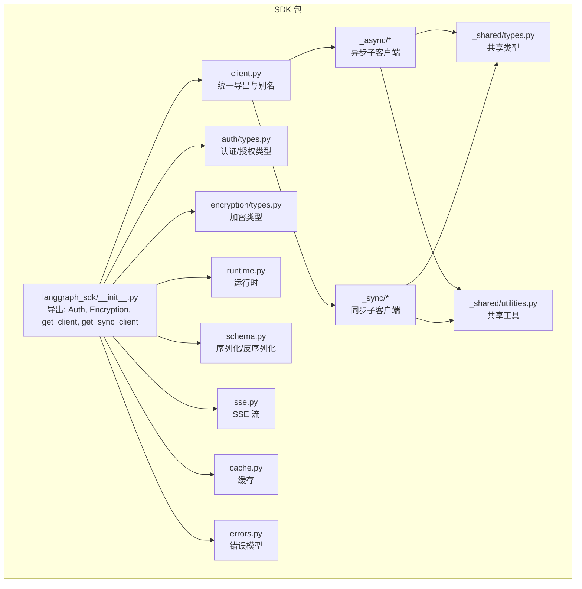
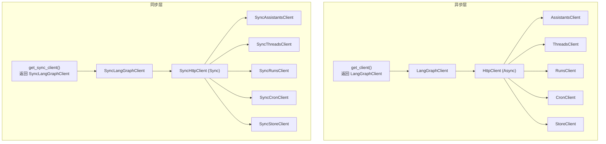
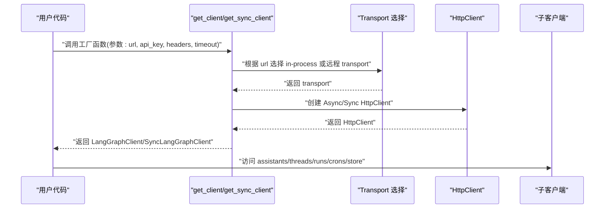
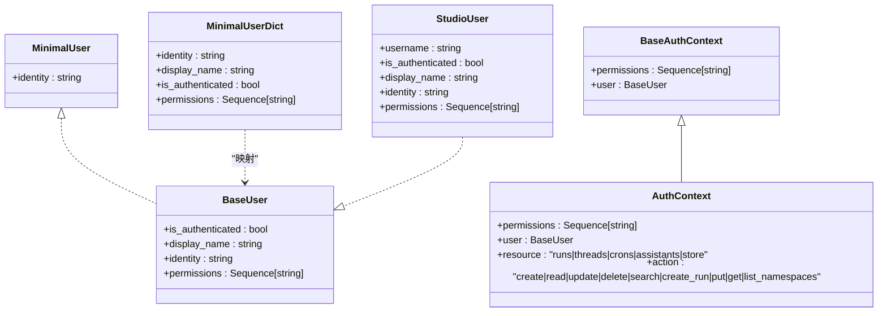
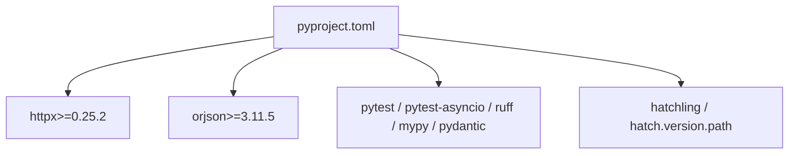

# Python SDK

<cite>
**本文引用的文件**
- [libs/sdk-py/README.md](file://libs/sdk-py/README.md)
- [libs/sdk-py/pyproject.toml](file://libs/sdk-py/pyproject.toml)
- [libs/sdk-py/langgraph_sdk/__init__.py](file://libs/sdk-py/langgraph_sdk/__init__.py)
- [libs/sdk-py/langgraph_sdk/client.py](file://libs/sdk-py/langgraph_sdk/client.py)
- [libs/sdk-py/langgraph_sdk/_async/client.py](file://libs/sdk-py/langgraph_sdk/_async/client.py)
- [libs/sdk-py/langgraph_sdk/_sync/client.py](file://libs/sdk-py/langgraph_sdk/_sync/client.py)
- [libs/sdk-py/langgraph_sdk/auth/types.py](file://libs/sdk-py/langgraph_sdk/auth/types.py)
- [libs/sdk-py/langgraph_sdk/encryption/types.py](file://libs/sdk-py/langgraph_sdk/encryption/types.py)
- [libs/sdk-py/langgraph_sdk/runtime.py](file://libs/sdk-py/langgraph_sdk/runtime.py)
- [libs/sdk-py/langgraph_sdk/schema.py](file://libs/sdk-py/langgraph_sdk/schema.py)
- [libs/sdk-py/langgraph_sdk/sse.py](file://libs/sdk-py/langgraph_sdk/sse.py)
- [libs/sdk-py/langgraph_sdk/cache.py](file://libs/sdk-py/langgraph_sdk/cache.py)
- [libs/sdk-py/langgraph_sdk/errors.py](file://libs/sdk-py/langgraph_sdk/errors.py)
</cite>

## 目录
1. [简介](#简介)
2. [项目结构](#项目结构)
3. [核心组件](#核心组件)
4. [架构总览](#架构总览)
5. [详细组件分析](#详细组件分析)
6. [依赖分析](#依赖分析)
7. [性能考虑](#性能考虑)
8. [故障排查指南](#故障排查指南)
9. [结论](#结论)
10. [附录](#附录)

## 简介
本文件为 LangGraph Python SDK 的详细 API 文档，覆盖同步与异步客户端的完整接口，重点说明以下方面：
- 客户端工厂函数：get_client 与 get_sync_client 的使用方式与参数语义
- 认证（Auth）与加密（Encryption）类型定义与上下文
- 运行时（Runtime）管理与 SSE 流式传输支持
- 连接配置、超时设置、头信息注入与环境变量加载策略
- 错误处理与异常模型
- 异步操作模式与流式输出
- 常见使用场景：代理调用、线程与运行管理、状态查询、检查点相关能力
- 版本兼容性与最佳实践

## 项目结构
LangGraph Python SDK 位于 libs/sdk-py 目录，采用分层组织：
- 根级导出与版本：通过 langgraph_sdk/__init__.py 暴露 Auth、Encryption、get_client、get_sync_client 等入口
- 同步与异步实现：分别在 _sync 与 _async 子包中提供各资源子客户端（Assistants、Threads、Runs、Cron、Store）
- 共享工具与类型：_shared 提供通用类型与工具；runtime.py 提供运行时辅助；schema.py 定义序列化/反序列化约定；sse.py 支持服务端事件流
- 配置与构建：pyproject.toml 定义依赖、测试与开发组、版本来源；README.md 提供快速开始与示例

**图表来源**
- [libs/sdk-py/langgraph_sdk/__init__.py:1-9](file://libs/sdk-py/langgraph_sdk/__init__.py#L1-L9)
- [libs/sdk-py/langgraph_sdk/client.py:1-56](file://libs/sdk-py/langgraph_sdk/client.py#L1-L56)
- [libs/sdk-py/langgraph_sdk/_async/client.py:1-179](file://libs/sdk-py/langgraph_sdk/_async/client.py#L1-L179)
- [libs/sdk-py/langgraph_sdk/_sync/client.py:1-128](file://libs/sdk-py/langgraph_sdk/_sync/client.py#L1-L128)
- [libs/sdk-py/langgraph_sdk/auth/types.py:1-1163](file://libs/sdk-py/langgraph_sdk/auth/types.py#L1-L1163)
- [libs/sdk-py/langgraph_sdk/encryption/types.py](file://libs/sdk-py/langgraph_sdk/encryption/types.py)
- [libs/sdk-py/langgraph_sdk/runtime.py](file://libs/sdk-py/langgraph_sdk/runtime.py)
- [libs/sdk-py/langgraph_sdk/schema.py](file://libs/sdk-py/langgraph_sdk/schema.py)
- [libs/sdk-py/langgraph_sdk/sse.py](file://libs/sdk-py/langgraph_sdk/sse.py)
- [libs/sdk-py/langgraph_sdk/cache.py](file://libs/sdk-py/langgraph_sdk/cache.py)
- [libs/sdk-py/langgraph_sdk/errors.py](file://libs/sdk-py/langgraph_sdk/errors.py)

**章节来源**
- [libs/sdk-py/README.md:1-36](file://libs/sdk-py/README.md#L1-L36)
- [libs/sdk-py/pyproject.toml:1-86](file://libs/sdk-py/pyproject.toml#L1-L86)
- [libs/sdk-py/langgraph_sdk/__init__.py:1-9](file://libs/sdk-py/langgraph_sdk/__init__.py#L1-L9)

## 核心组件
- 客户端工厂与顶层客户端
  - 异步：get_client(...) 返回 LangGraphClient，内部封装 httpx.AsyncClient，并按需选择 in-process 或远程 transport
  - 同步：get_sync_client(...) 返回 SyncLangGraphClient，内部封装 httpx.Client
- 子客户端
  - AssistantsClient / SyncAssistantsClient：管理助手（代理）配置与版本
  - ThreadsClient / SyncThreadsClient：管理对话线程、状态与运行
  - RunsClient / SyncRunsClient：控制单次图执行（运行）
  - CronClient / SyncCronClient：管理定时任务
  - StoreClient / SyncStoreClient：持久化文档存储
- 认证与授权
  - Auth 类型与上下文：定义用户协议、最小用户、认证上下文、过滤器类型等
- 加密
  - Encryption 类型：提供加密上下文等类型定义
- 运行时与流式
  - runtime.py：运行时辅助
  - sse.py：服务端事件流支持
- 序列化与反序列化
  - schema.py：序列化/反序列化约定
- 缓存与错误
  - cache.py：缓存策略
  - errors.py：错误模型

**章节来源**
- [libs/sdk-py/langgraph_sdk/client.py:1-56](file://libs/sdk-py/langgraph_sdk/client.py#L1-L56)
- [libs/sdk-py/langgraph_sdk/_async/client.py:1-179](file://libs/sdk-py/langgraph_sdk/_async/client.py#L1-L179)
- [libs/sdk-py/langgraph_sdk/_sync/client.py:1-128](file://libs/sdk-py/langgraph_sdk/_sync/client.py#L1-L128)
- [libs/sdk-py/langgraph_sdk/auth/types.py:1-1163](file://libs/sdk-py/langgraph_sdk/auth/types.py#L1-L1163)
- [libs/sdk-py/langgraph_sdk/encryption/types.py](file://libs/sdk-py/langgraph_sdk/encryption/types.py)
- [libs/sdk-py/langgraph_sdk/runtime.py](file://libs/sdk-py/langgraph_sdk/runtime.py)
- [libs/sdk-py/langgraph_sdk/schema.py](file://libs/sdk-py/langgraph_sdk/schema.py)
- [libs/sdk-py/langgraph_sdk/sse.py](file://libs/sdk-py/langgraph_sdk/sse.py)
- [libs/sdk-py/langgraph_sdk/cache.py](file://libs/sdk-py/langgraph_sdk/cache.py)
- [libs/sdk-py/langgraph_sdk/errors.py](file://libs/sdk-py/langgraph_sdk/errors.py)

## 架构总览
SDK 以“顶层客户端 + 子客户端”的分层架构组织，异步与同步实现分别封装在 _async 与 _sync 子包中，共享类型与工具由 _shared 提供。

**图表来源**
- [libs/sdk-py/langgraph_sdk/_async/client.py:29-140](file://libs/sdk-py/langgraph_sdk/_async/client.py#L29-L140)
- [libs/sdk-py/langgraph_sdk/_sync/client.py:20-86](file://libs/sdk-py/langgraph_sdk/_sync/client.py#L20-L86)
- [libs/sdk-py/langgraph_sdk/client.py:12-31](file://libs/sdk-py/langgraph_sdk/client.py#L12-L31)

## 详细组件分析

### 客户端工厂与连接配置
- get_client(url, api_key, headers, timeout)
  - 自动装载 API Key：默认从环境变量 LANGGRAPH_API_KEY、LANGSMITH_API_KEY、LANGCHAIN_API_KEY 顺序加载；显式传入 None 可跳过自动装载
  - Transport 选择：url 为 None 时优先尝试 in-process ASGI transport；失败则回退到远程 httpx.AsyncHTTPTransport
  - 超时：支持 httpx.Timeout 实例、秒数或四元组 (connect, read, write, pool)，默认值为 5/300/300/5
  - 上下文管理：LangGraphClient 支持 async with，内部自动关闭底层 httpx.AsyncClient
- get_sync_client(url, api_key, headers, timeout)
  - 行为与 get_client 对应，但使用 httpx.Client 与同步子客户端
  - 支持 with 语法，内部调用 close 关闭底层 httpx.Client

**图表来源**
- [libs/sdk-py/langgraph_sdk/_async/client.py:29-140](file://libs/sdk-py/langgraph_sdk/_async/client.py#L29-L140)
- [libs/sdk-py/langgraph_sdk/_sync/client.py:20-86](file://libs/sdk-py/langgraph_sdk/_sync/client.py#L20-L86)

**章节来源**
- [libs/sdk-py/langgraph_sdk/_async/client.py:29-140](file://libs/sdk-py/langgraph_sdk/_async/client.py#L29-L140)
- [libs/sdk-py/langgraph_sdk/_sync/client.py:20-86](file://libs/sdk-py/langgraph_sdk/_sync/client.py#L20-L86)

### 认证与授权类型
- 用户协议与最小用户
  - MinimalUser 协议要求 identity 属性
  - MinimalUserDict TypedDict 定义最小用户字典结构
- BaseUser 协议扩展了 is_authenticated、display_name、identity、permissions 等属性
- StudioUser：来自 LangGraph Studio 的用户对象，可用于授权逻辑
- Authenticator：认证函数类型，可接受多种参数并返回用户对象或字符串
- BaseAuthContext 与 AuthContext：认证上下文，包含 permissions、user、resource、action 等
- HandlerResult 与 FilterType：授权处理器返回结果类型，支持 None/True 接受、False 拒绝、FilterType 过滤器
- 其他枚举与类型：RunStatus、ThreadStatus、MultitaskStrategy、OnConflictBehavior、IfNotExists 等

**图表来源**
- [libs/sdk-py/langgraph_sdk/auth/types.py:150-426](file://libs/sdk-py/langgraph_sdk/auth/types.py#L150-L426)

**章节来源**
- [libs/sdk-py/langgraph_sdk/auth/types.py:1-1163](file://libs/sdk-py/langgraph_sdk/auth/types.py#L1-L1163)

### 加密类型
- EncryptionContext：加密上下文类型定义，用于加密/解密相关操作的上下文传递

**章节来源**
- [libs/sdk-py/langgraph_sdk/encryption/types.py](file://libs/sdk-py/langgraph_sdk/encryption/types.py)

### 运行时与流式
- runtime.py：提供运行时辅助能力
- sse.py：提供服务端事件（Server-Sent Events）流式传输支持，便于实时接收增量输出
- schema.py：定义序列化/反序列化约定，确保数据在客户端与服务端之间一致

**章节来源**
- [libs/sdk-py/langgraph_sdk/runtime.py](file://libs/sdk-py/langgraph_sdk/runtime.py)
- [libs/sdk-py/langgraph_sdk/sse.py](file://libs/sdk-py/langgraph_sdk/sse.py)
- [libs/sdk-py/langgraph_sdk/schema.py](file://libs/sdk-py/langgraph_sdk/schema.py)

### 错误处理
- errors.py：定义 SDK 内部使用的错误模型，便于捕获与区分不同类型的异常

**章节来源**
- [libs/sdk-py/langgraph_sdk/errors.py](file://libs/sdk-py/langgraph_sdk/errors.py)

### 常见使用场景与最佳实践
- 快速开始与远程服务器
  - 使用 get_client(url=REMOTE_URL) 初始化客户端
  - 列举助手、创建线程、启动流式运行
  - 示例参考：[libs/sdk-py/README.md:16-35](file://libs/sdk-py/README.md#L16-L35)
- 连接本地服务器
  - 在本地运行时，SDK 默认指向 http://localhost:8123；也可通过 get_client(url=None) 尝试 in-process 连接
  - 参考：[libs/sdk-py/README.md:13-14](file://libs/sdk-py/README.md#L13-L14)
- 跳过自动加载 API Key
  - 显式传入 api_key=None 可避免从环境变量加载
  - 参考：[libs/sdk-py/langgraph_sdk/_async/client.py:96-106](file://libs/sdk-py/langgraph_sdk/_async/client.py#L96-L106)、[libs/sdk-py/langgraph_sdk/_sync/client.py:59-69](file://libs/sdk-py/langgraph_sdk/_sync/client.py#L59-L69)
- 设置超时
  - 支持 httpx.Timeout、秒数或四元组；默认值为 5/300/300/5
  - 参考：[libs/sdk-py/langgraph_sdk/_async/client.py:57-62](file://libs/sdk-py/langgraph_sdk/_async/client.py#L57-L62)、[libs/sdk-py/langgraph_sdk/_sync/client.py:39-42](file://libs/sdk-py/langgraph_sdk/_sync/client.py#L39-L42)
- 流式运行
  - 使用 client.runs.stream(...) 获取增量输出
  - 参考：[libs/sdk-py/README.md:31-34](file://libs/sdk-py/README.md#L31-L34)
- 线程与运行管理
  - 创建线程、查询状态、中断/回滚、删除等
  - 参考：[libs/sdk-py/langgraph_sdk/auth/types.py:429-541](file://libs/sdk-py/langgraph_sdk/auth/types.py#L429-L541)、[libs/sdk-py/langgraph_sdk/auth/types.py:543-597](file://libs/sdk-py/langgraph_sdk/auth/types.py#L543-L597)
- 助手与版本
  - 创建、读取、更新、搜索助手
  - 参考：[libs/sdk-py/langgraph_sdk/auth/types.py:599-740](file://libs/sdk-py/langgraph_sdk/auth/types.py#L599-L740)
- 定时任务
  - 创建、读取、删除定时任务
  - 参考：[libs/sdk-py/langgraph_sdk/auth/types.py:742-800](file://libs/sdk-py/langgraph_sdk/auth/types.py#L742-L800)

**章节来源**
- [libs/sdk-py/README.md:1-36](file://libs/sdk-py/README.md#L1-L36)
- [libs/sdk-py/langgraph_sdk/_async/client.py:29-140](file://libs/sdk-py/langgraph_sdk/_async/client.py#L29-L140)
- [libs/sdk-py/langgraph_sdk/_sync/client.py:20-86](file://libs/sdk-py/langgraph_sdk/_sync/client.py#L20-L86)
- [libs/sdk-py/langgraph_sdk/auth/types.py:429-800](file://libs/sdk-py/langgraph_sdk/auth/types.py#L429-L800)

## 依赖分析
- 语言与运行时要求：Python >= 3.10
- 核心依赖：httpx (>=0.25.2)、orjson (>=3.11.5)
- 开发与测试：pytest、pytest-asyncio、pytest-mock、ruff、mypy、pydantic>=2.12.4 等
- 版本来源：通过 hatchling 从 langgraph_sdk/__init__.py 中动态读取

**图表来源**
- [libs/sdk-py/pyproject.toml:1-86](file://libs/sdk-py/pyproject.toml#L1-L86)

**章节来源**
- [libs/sdk-py/pyproject.toml:1-86](file://libs/sdk-py/pyproject.toml#L1-L86)

## 性能考虑
- 传输与重试
  - 异步与同步客户端均使用 httpx 的 HTTPTransport/AsyncHTTPTransport，并启用重试机制
- 超时配置
  - 合理设置 connect/read/write/pool 超时，避免长时间阻塞；默认读超时较长，适合长运行流式任务
- 流式传输
  - 使用 SSE 流式传输减少等待时间，提升交互体验
- 缓存
  - cache.py 提供缓存策略，建议在合适场景使用以降低重复请求开销

**章节来源**
- [libs/sdk-py/langgraph_sdk/_async/client.py:128-140](file://libs/sdk-py/langgraph_sdk/_async/client.py#L128-L140)
- [libs/sdk-py/langgraph_sdk/_sync/client.py:75-86](file://libs/sdk-py/langgraph_sdk/_sync/client.py#L75-L86)
- [libs/sdk-py/langgraph_sdk/sse.py](file://libs/sdk-py/langgraph_sdk/sse.py)
- [libs/sdk-py/langgraph_sdk/cache.py](file://libs/sdk-py/langgraph_sdk/cache.py)

## 故障排查指南
- API Key 未加载
  - 若未设置环境变量且未显式传入 api_key，可能导致认证失败
  - 解决：显式传入 api_key=None 或设置 LANGGRAPH_API_KEY/LANGSMITH_API_KEY/LANGCHAIN_API_KEY
  - 参考：[libs/sdk-py/langgraph_sdk/_async/client.py:47-56](file://libs/sdk-py/langgraph_sdk/_async/client.py#L47-L56)、[libs/sdk-py/langgraph_sdk/_sync/client.py:29-38](file://libs/sdk-py/langgraph_sdk/_sync/client.py#L29-L38)
- 连接失败
  - url 为 None 时尝试 in-process 连接失败会回退至远程连接
  - 解决：明确指定 url 或确保本地服务可用
  - 参考：[libs/sdk-py/langgraph_sdk/_async/client.py:110-127](file://libs/sdk-py/langgraph_sdk/_async/client.py#L110-L127)
- 超时问题
  - 调整 timeout 参数或四元组，避免读超时过短导致流式任务中断
  - 参考：[libs/sdk-py/langgraph_sdk/_async/client.py:57-62](file://libs/sdk-py/langgraph_sdk/_async/client.py#L57-L62)、[libs/sdk-py/langgraph_sdk/_sync/client.py:39-42](file://libs/sdk-py/langgraph_sdk/_sync/client.py#L39-L42)
- 异常捕获
  - 使用 errors.py 中的错误模型进行异常捕获与分类处理
  - 参考：[libs/sdk-py/langgraph_sdk/errors.py](file://libs/sdk-py/langgraph_sdk/errors.py)

**章节来源**
- [libs/sdk-py/langgraph_sdk/_async/client.py:47-62](file://libs/sdk-py/langgraph_sdk/_async/client.py#L47-L62)
- [libs/sdk-py/langgraph_sdk/_sync/client.py:29-42](file://libs/sdk-py/langgraph_sdk/_sync/client.py#L29-L42)
- [libs/sdk-py/langgraph_sdk/errors.py](file://libs/sdk-py/langgraph_sdk/errors.py)

## 结论
LangGraph Python SDK 提供了完善的同步与异步客户端接口，覆盖认证、运行时、流式传输、序列化/反序列化、缓存与错误处理等核心能力。通过 get_client 与 get_sync_client，开发者可以灵活地连接本地或远程 LangGraph 服务，并以一致的方式管理助手、线程、运行与定时任务。建议在生产环境中合理配置超时与重试、显式管理 API Key，并结合 SSE 流式传输优化用户体验。

## 附录
- 版本与发布
  - 版本号通过 hatchling 从 langgraph_sdk/__init__.py 动态读取
  - 参考：[libs/sdk-py/pyproject.toml:16-17](file://libs/sdk-py/pyproject.toml#L16-L17)、[libs/sdk-py/langgraph_sdk/__init__.py](file://libs/sdk-py/langgraph_sdk/__init__.py#L6)
- 快速开始示例
  - 参考：[libs/sdk-py/README.md:16-35](file://libs/sdk-py/README.md#L16-L35)