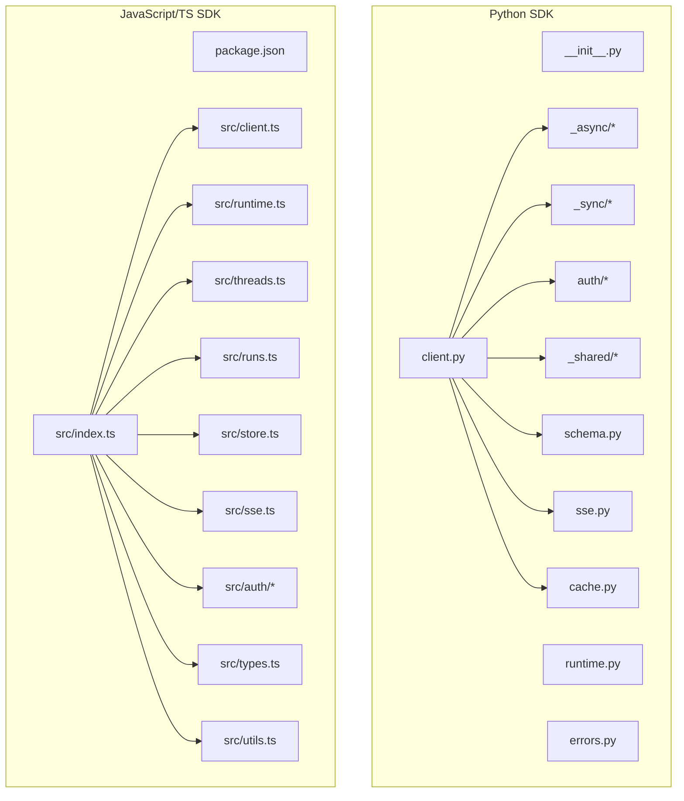
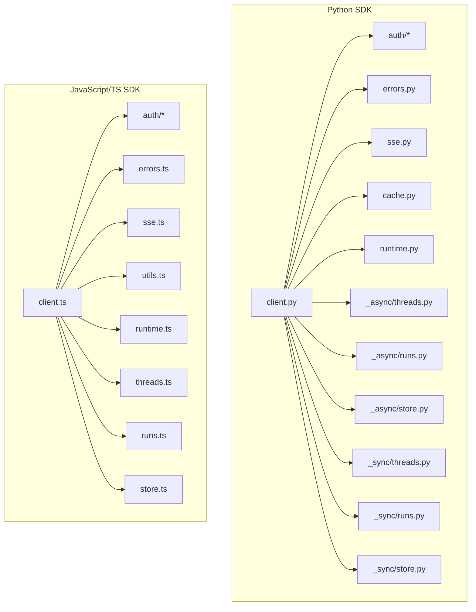
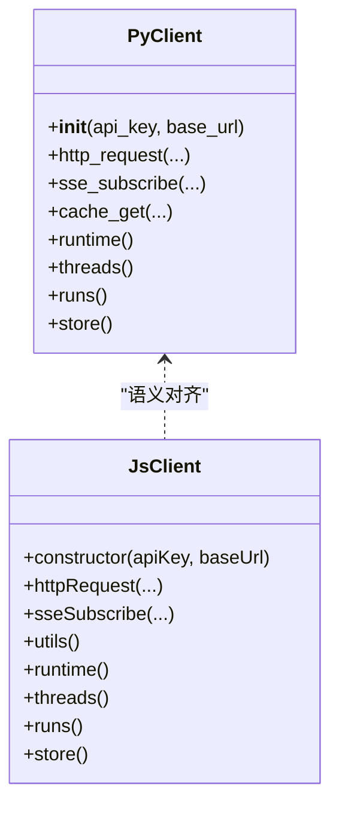
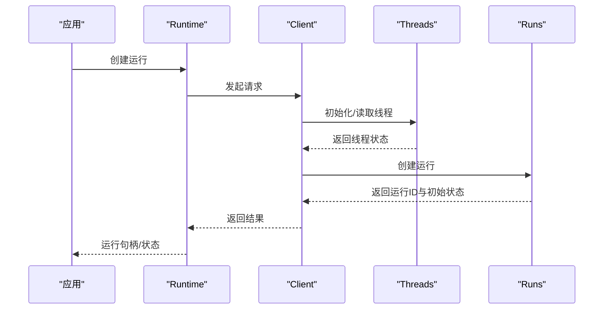
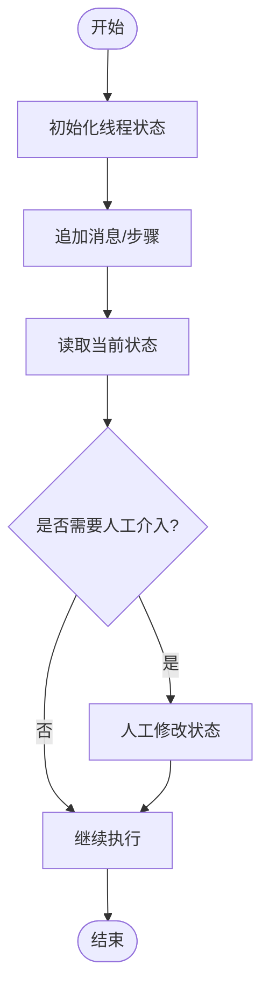
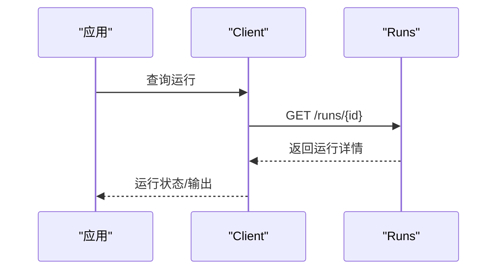
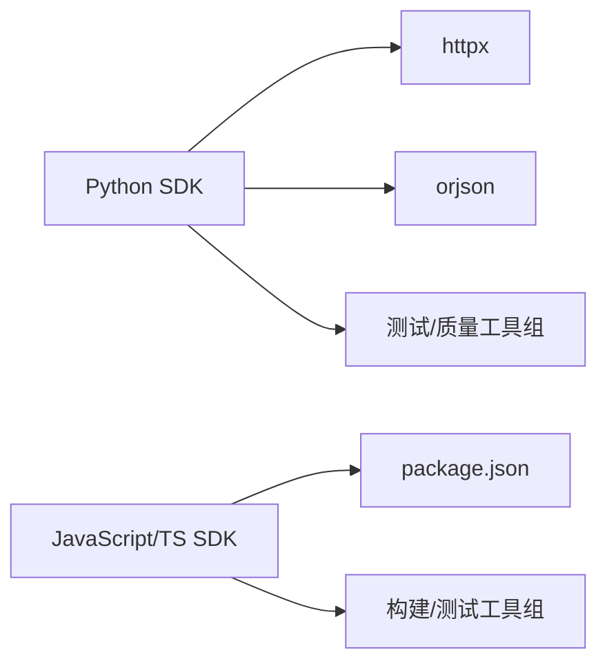

# SDK API

<cite>
**本文引用的文件**
- [README.md](file://README.md)
- [libs/sdk-py/pyproject.toml](file://libs/sdk-py/pyproject.toml)
- [libs/sdk-py/README.md](file://libs/sdk-py/README.md)
- [libs/sdk-py/langgraph_sdk/__init__.py](file://libs/sdk-py/langgraph_sdk/__init__.py)
- [libs/sdk-py/langgraph_sdk/client.py](file://libs/sdk-py/langgraph_sdk/client.py)
- [libs/sdk-py/langgraph_sdk/runtime.py](file://libs/sdk-py/langgraph_sdk/runtime.py)
- [libs/sdk-py/langgraph_sdk/schema.py](file://libs/sdk-py/langgraph_sdk/schema.py)
- [libs/sdk-py/langgraph_sdk/errors.py](file://libs/sdk-py/langgraph_sdk/errors.py)
- [libs/sdk-py/langgraph_sdk/sse.py](file://libs/sdk-py/langgraph_sdk/sse.py)
- [libs/sdk-py/langgraph_sdk/cache.py](file://libs/sdk-py/langgraph_sdk/cache.py)
- [libs/sdk-py/langgraph_sdk/auth/types.py](file://libs/sdk-py/langgraph_sdk/auth/types.py)
- [libs/sdk-py/langgraph_sdk/auth/exceptions.py](file://libs/sdk-py/langgraph_sdk/auth/exceptions.py)
- [libs/sdk-py/langgraph_sdk/_shared/types.py](file://libs/sdk-py/langgraph_sdk/_shared/types.py)
- [libs/sdk-py/langgraph_sdk/_shared/utilities.py](file://libs/sdk-py/langgraph_sdk/_shared/utilities.py)
- [libs/sdk-py/langgraph_sdk/_async/client.py](file://libs/sdk-py/langgraph_sdk/_async/client.py)
- [libs/sdk-py/langgraph_sdk/_async/threads.py](file://libs/sdk-py/langgraph_sdk/_async/threads.py)
- [libs/sdk-py/langgraph_sdk/_async/runs.py](file://libs/sdk-py/langgraph_sdk/_async/runs.py)
- [libs/sdk-py/langgraph_sdk/_async/store.py](file://libs/sdk-py/langgraph_sdk/_async/store.py)
- [libs/sdk-py/langgraph_sdk/_async/http.py](file://libs/sdk-py/langgraph_sdk/_async/http.py)
- [libs/sdk-py/langgraph_sdk/_sync/client.py](file://libs/sdk-py/langgraph_sdk/_sync/client.py)
- [libs/sdk-py/langgraph_sdk/_sync/threads.py](file://libs/sdk-py/langgraph_sdk/_sync/threads.py)
- [libs/sdk-py/langgraph_sdk/_sync/runs.py](file://libs/sdk-py/langgraph_sdk/_sync/runs.py)
- [libs/sdk-py/langgraph_sdk/_sync/store.py](file://libs/sdk-py/langgraph_sdk/_sync/store.py)
- [libs/sdk-py/langgraph_sdk/_sync/http.py](file://libs/sdk-py/langgraph_sdk/_sync/http.py)
- [libs/sdk-js/package.json](file://libs/sdk-js/package.json)
- [libs/sdk-js/src/index.ts](file://libs/sdk-js/src/index.ts)
- [libs/sdk-js/src/client.ts](file://libs/sdk-js/src/client.ts)
- [libs/sdk-js/src/types.ts](file://libs/sdk-js/src/types.ts)
- [libs/sdk-js/src/errors.ts](file://libs/sdk-js/src/errors.ts)
- [libs/sdk-js/src/runtime.ts](file://libs/sdk-js/src/runtime.ts)
- [libs/sdk-js/src/threads.ts](file://libs/sdk-js/src/threads.ts)
- [libs/sdk-js/src/runs.ts](file://libs/sdk-js/src/runs.ts)
- [libs/sdk-js/src/store.ts](file://libs/sdk-js/src/store.ts)
- [libs/sdk-js/src/sse.ts](file://libs/sdk-js/src/sse.ts)
- [libs/sdk-js/src/auth/types.ts](file://libs/sdk-js/src/auth/types.ts)
- [libs/sdk-js/src/auth/exceptions.ts](file://libs/sdk-js/src/auth/exceptions.ts)
- [libs/sdk-js/src/utils.ts](file://libs/sdk-js/src/utils.ts)
</cite>

## 目录
1. [简介](#简介)
2. [项目结构](#项目结构)
3. [核心组件](#核心组件)
4. [架构总览](#架构总览)
5. [详细组件分析](#详细组件分析)
6. [依赖关系分析](#依赖关系分析)
7. [性能考量](#性能考量)
8. [故障排查指南](#故障排查指南)
9. [结论](#结论)
10. [附录](#附录)

## 简介
本文件为 LangGraph SDK 的完整 API 文档，覆盖 Python SDK 与 JavaScript/TypeScript SDK 的公共接口，重点围绕以下主题展开：
- 客户端连接与认证配置
- 运行时管理（Runtime）
- 异步与同步 API 使用模式
- 会话线程（Threads）、运行（Runs）、存储（Store）等核心资源管理
- 错误处理与 SSE 流式事件
- 连接池与缓存策略
- 跨语言对比与迁移建议
- 实际使用示例与最佳实践

LangGraph 提供低层编排能力，支持状态化代理的持久执行、人类介入、内存与调试可观测性，并可与 LangSmith 等生态工具集成。

章节来源
- [README.md:1-83](file://README.md#L1-L83)

## 项目结构
仓库采用多包结构，核心 SDK 位于 libs/sdk-py 与 libs/sdk-js，分别对应 Python 与 JavaScript/TS。Python SDK 内部进一步区分同步与异步实现，以及共享类型与工具模块；JavaScript SDK 同样提供清晰的模块划分。

图表来源
- [libs/sdk-py/langgraph_sdk/__init__.py](file://libs/sdk-py/langgraph_sdk/__init__.py)
- [libs/sdk-py/langgraph_sdk/client.py](file://libs/sdk-py/langgraph_sdk/client.py)
- [libs/sdk-py/langgraph_sdk/runtime.py](file://libs/sdk-py/langgraph_sdk/runtime.py)
- [libs/sdk-py/langgraph_sdk/sse.py](file://libs/sdk-py/langgraph_sdk/sse.py)
- [libs/sdk-py/langgraph_sdk/cache.py](file://libs/sdk-py/langgraph_sdk/cache.py)
- [libs/sdk-py/langgraph_sdk/auth/types.py](file://libs/sdk-py/langgraph_sdk/auth/types.py)
- [libs/sdk-py/langgraph_sdk/_shared/types.py](file://libs/sdk-py/langgraph_sdk/_shared/types.py)
- [libs/sdk-py/langgraph_sdk/_async/client.py](file://libs/sdk-py/langgraph_sdk/_async/client.py)
- [libs/sdk-py/langgraph_sdk/_sync/client.py](file://libs/sdk-py/langgraph_sdk/_sync/client.py)
- [libs/sdk-js/package.json](file://libs/sdk-js/package.json)
- [libs/sdk-js/src/index.ts](file://libs/sdk-js/src/index.ts)
- [libs/sdk-js/src/client.ts](file://libs/sdk-js/src/client.ts)
- [libs/sdk-js/src/runtime.ts](file://libs/sdk-js/src/runtime.ts)
- [libs/sdk-js/src/threads.ts](file://libs/sdk-js/src/threads.ts)
- [libs/sdk-js/src/runs.ts](file://libs/sdk-js/src/runs.ts)
- [libs/sdk-js/src/store.ts](file://libs/sdk-js/src/store.ts)
- [libs/sdk-js/src/sse.ts](file://libs/sdk-js/src/sse.ts)
- [libs/sdk-js/src/auth/types.ts](file://libs/sdk-js/src/auth/types.ts)
- [libs/sdk-js/src/types.ts](file://libs/sdk-js/src/types.ts)
- [libs/sdk-js/src/utils.ts](file://libs/sdk-js/src/utils.ts)

章节来源
- [libs/sdk-py/pyproject.toml:1-86](file://libs/sdk-py/pyproject.toml#L1-L86)
- [libs/sdk-py/README.md](file://libs/sdk-py/README.md)
- [libs/sdk-js/package.json](file://libs/sdk-js/package.json)

## 核心组件
本节概述两大 SDK 的公共接口与职责边界：

- 客户端（Client）
  - 负责与 LangGraph API 建立连接、发送请求、处理响应与错误、管理认证与密钥。
  - Python SDK 提供同步与异步双实现，统一通过 client 模块导出。
  - JavaScript/TS SDK 提供同名模块，职责一致。

- 运行时（Runtime）
  - 封装对“运行”（Runs）生命周期的管理，包括启动、中断、恢复、查询状态等。
  - 支持与 Threads、Store 等资源协同工作。

- 会话线程（Threads）
  - 代表一次或多轮交互的状态容器，支持读取、更新、中断与恢复。

- 运行（Runs）
  - 表示一次具体执行实例，包含输入、输出、状态、事件流等。

- 存储（Store）
  - 提供键值存储能力，用于跨运行持久化数据。

- 认证与错误
  - 认证类型与异常定义在各自 SDK 的 auth 子模块中。
  - 错误类型在 SDK 中集中定义，便于统一捕获与处理。

- SSE 与缓存
  - SSE 用于订阅事件流；缓存用于优化访问性能。

章节来源
- [libs/sdk-py/langgraph_sdk/client.py](file://libs/sdk-py/langgraph_sdk/client.py)
- [libs/sdk-py/langgraph_sdk/runtime.py](file://libs/sdk-py/langgraph_sdk/runtime.py)
- [libs/sdk-py/langgraph_sdk/_async/threads.py](file://libs/sdk-py/langgraph_sdk/_async/threads.py)
- [libs/sdk-py/langgraph_sdk/_async/runs.py](file://libs/sdk-py/langgraph_sdk/_async/runs.py)
- [libs/sdk-py/langgraph_sdk/_async/store.py](file://libs/sdk-py/langgraph_sdk/_async/store.py)
- [libs/sdk-py/langgraph_sdk/sse.py](file://libs/sdk-py/langgraph_sdk/sse.py)
- [libs/sdk-py/langgraph_sdk/cache.py](file://libs/sdk-py/langgraph_sdk/cache.py)
- [libs/sdk-js/src/client.ts](file://libs/sdk-js/src/client.ts)
- [libs/sdk-js/src/runtime.ts](file://libs/sdk-js/src/runtime.ts)
- [libs/sdk-js/src/threads.ts](file://libs/sdk-js/src/threads.ts)
- [libs/sdk-js/src/runs.ts](file://libs/sdk-js/src/runs.ts)
- [libs/sdk-js/src/store.ts](file://libs/sdk-js/src/store.ts)
- [libs/sdk-js/src/sse.ts](file://libs/sdk-js/src/sse.ts)

## 架构总览
下图展示 Python 与 JavaScript SDK 的高层架构与模块关系，以及与认证、错误、SSE、缓存等基础设施的交互。

图表来源
- [libs/sdk-py/langgraph_sdk/client.py](file://libs/sdk-py/langgraph_sdk/client.py)
- [libs/sdk-py/langgraph_sdk/runtime.py](file://libs/sdk-py/langgraph_sdk/runtime.py)
- [libs/sdk-py/langgraph_sdk/_async/threads.py](file://libs/sdk-py/langgraph_sdk/_async/threads.py)
- [libs/sdk-py/langgraph_sdk/_async/runs.py](file://libs/sdk-py/langgraph_sdk/_async/runs.py)
- [libs/sdk-py/langgraph_sdk/_async/store.py](file://libs/sdk-py/langgraph_sdk/_async/store.py)
- [libs/sdk-py/langgraph_sdk/_sync/threads.py](file://libs/sdk-py/langgraph_sdk/_sync/threads.py)
- [libs/sdk-py/langgraph_sdk/_sync/runs.py](file://libs/sdk-py/langgraph_sdk/_sync/runs.py)
- [libs/sdk-py/langgraph_sdk/_sync/store.py](file://libs/sdk-py/langgraph_sdk/_sync/store.py)
- [libs/sdk-py/langgraph_sdk/auth/types.py](file://libs/sdk-py/langgraph_sdk/auth/types.py)
- [libs/sdk-py/langgraph_sdk/errors.py](file://libs/sdk-py/langgraph_sdk/errors.py)
- [libs/sdk-py/langgraph_sdk/sse.py](file://libs/sdk-py/langgraph_sdk/sse.py)
- [libs/sdk-py/langgraph_sdk/cache.py](file://libs/sdk-py/langgraph_sdk/cache.py)
- [libs/sdk-js/src/client.ts](file://libs/sdk-js/src/client.ts)
- [libs/sdk-js/src/runtime.ts](file://libs/sdk-js/src/runtime.ts)
- [libs/sdk-js/src/threads.ts](file://libs/sdk-js/src/threads.ts)
- [libs/sdk-js/src/runs.ts](file://libs/sdk-js/src/runs.ts)
- [libs/sdk-js/src/store.ts](file://libs/sdk-js/src/store.ts)
- [libs/sdk-js/src/auth/types.ts](file://libs/sdk-js/src/auth/types.ts)
- [libs/sdk-js/src/errors.ts](file://libs/sdk-js/src/errors.ts)
- [libs/sdk-js/src/sse.ts](file://libs/sdk-js/src/sse.ts)
- [libs/sdk-js/src/utils.ts](file://libs/sdk-js/src/utils.ts)

## 详细组件分析

### 客户端（Client）
- 职责
  - 维护基础 URL、认证信息（如 API Key），封装 HTTP 请求与响应处理。
  - 提供对 Runtime、Threads、Runs、Store 等子资源的访问入口。
  - 处理重试、超时、SSE 订阅、缓存等横切关注点。
- Python 同步/异步
  - 同步实现位于 _sync/client.py；异步实现位于 _async/client.py。
  - 两者共享公共类型与工具，确保行为一致性。
- JavaScript/TS
  - client.ts 提供与 Python 双端一致的 API 设计，包含认证、HTTP 工具与资源入口。

图表来源
- [libs/sdk-py/langgraph_sdk/_sync/client.py](file://libs/sdk-py/langgraph_sdk/_sync/client.py)
- [libs/sdk-py/langgraph_sdk/_async/client.py](file://libs/sdk-py/langgraph_sdk/_async/client.py)
- [libs/sdk-js/src/client.ts](file://libs/sdk-js/src/client.ts)

章节来源
- [libs/sdk-py/langgraph_sdk/_sync/client.py](file://libs/sdk-py/langgraph_sdk/_sync/client.py)
- [libs/sdk-py/langgraph_sdk/_async/client.py](file://libs/sdk-py/langgraph_sdk/_async/client.py)
- [libs/sdk-js/src/client.ts](file://libs/sdk-js/src/client.ts)

### 运行时（Runtime）
- 职责
  - 管理 Runs 生命周期：创建、查询、中断、恢复、删除。
  - 与 Threads 协作以驱动状态流转。
  - 提供与后端服务的统一入口。
- Python
  - runtime.py 提供运行时封装，内部调用 client 与各子资源模块。
- JavaScript/TS
  - runtime.ts 提供同等能力，方法命名与参数风格保持一致。

图表来源
- [libs/sdk-py/langgraph_sdk/runtime.py](file://libs/sdk-py/langgraph_sdk/runtime.py)
- [libs/sdk-py/langgraph_sdk/_async/threads.py](file://libs/sdk-py/langgraph_sdk/_async/threads.py)
- [libs/sdk-py/langgraph_sdk/_async/runs.py](file://libs/sdk-py/langgraph_sdk/_async/runs.py)
- [libs/sdk-js/src/runtime.ts](file://libs/sdk-js/src/runtime.ts)
- [libs/sdk-js/src/threads.ts](file://libs/sdk-js/src/threads.ts)
- [libs/sdk-js/src/runs.ts](file://libs/sdk-js/src/runs.ts)

章节来源
- [libs/sdk-py/langgraph_sdk/runtime.py](file://libs/sdk-py/langgraph_sdk/runtime.py)
- [libs/sdk-js/src/runtime.ts](file://libs/sdk-js/src/runtime.ts)

### 会话线程（Threads）
- 职责
  - 作为状态容器，支持写入新轮次、读取历史、中断与恢复。
  - 与 Run 协同，驱动状态机推进。
- Python
  - _async/threads.py 与 _sync/threads.py 提供异步/同步接口。
- JavaScript/TS
  - threads.ts 提供等价 API。

图表来源
- [libs/sdk-py/langgraph_sdk/_async/threads.py](file://libs/sdk-py/langgraph_sdk/_async/threads.py)
- [libs/sdk-py/langgraph_sdk/_sync/threads.py](file://libs/sdk-py/langgraph_sdk/_sync/threads.py)
- [libs/sdk-js/src/threads.ts](file://libs/sdk-js/src/threads.ts)

章节来源
- [libs/sdk-py/langgraph_sdk/_async/threads.py](file://libs/sdk-py/langgraph_sdk/_async/threads.py)
- [libs/sdk-py/langgraph_sdk/_sync/threads.py](file://libs/sdk-py/langgraph_sdk/_sync/threads.py)
- [libs/sdk-js/src/threads.ts](file://libs/sdk-js/src/threads.ts)

### 运行（Runs）
- 职责
  - 表示一次具体执行，包含输入、输出、中间事件与最终状态。
  - 支持查询、中断、恢复与删除。
- Python
  - _async/runs.py 与 _sync/runs.py。
- JavaScript/TS
  - runs.ts。

图表来源
- [libs/sdk-py/langgraph_sdk/_async/runs.py](file://libs/sdk-py/langgraph_sdk/_async/runs.py)
- [libs/sdk-py/langgraph_sdk/_sync/runs.py](file://libs/sdk-py/langgraph_sdk/_sync/runs.py)
- [libs/sdk-js/src/runs.ts](file://libs/sdk-js/src/runs.ts)

章节来源
- [libs/sdk-py/langgraph_sdk/_async/runs.py](file://libs/sdk-py/langgraph_sdk/_async/runs.py)
- [libs/sdk-py/langgraph_sdk/_sync/runs.py](file://libs/sdk-py/langgraph_sdk/_sync/runs.py)
- [libs/sdk-js/src/runs.ts](file://libs/sdk-js/src/runs.ts)

### 存储（Store）
- 职责
  - 提供键值存储能力，支持跨运行持久化数据。
- Python
  - _async/store.py 与 _sync/store.py。
- JavaScript/TS
  - store.ts。

章节来源
- [libs/sdk-py/langgraph_sdk/_async/store.py](file://libs/sdk-py/langgraph_sdk/_async/store.py)
- [libs/sdk-py/langgraph_sdk/_sync/store.py](file://libs/sdk-py/langgraph_sdk/_sync/store.py)
- [libs/sdk-js/src/store.ts](file://libs/sdk-js/src/store.ts)

### 认证与错误
- 认证
  - Python：auth/types.py 定义认证相关类型；auth/exceptions.py 定义认证异常。
  - JavaScript/TS：auth/types.ts 与 auth/exceptions.ts。
- 错误
  - Python：errors.py 集中定义错误类型。
  - JavaScript/TS：errors.ts。

章节来源
- [libs/sdk-py/langgraph_sdk/auth/types.py](file://libs/sdk-py/langgraph_sdk/auth/types.py)
- [libs/sdk-py/langgraph_sdk/auth/exceptions.py](file://libs/sdk-py/langgraph_sdk/auth/exceptions.py)
- [libs/sdk-py/langgraph_sdk/errors.py](file://libs/sdk-py/langgraph_sdk/errors.py)
- [libs/sdk-js/src/auth/types.ts](file://libs/sdk-js/src/auth/types.ts)
- [libs/sdk-js/src/auth/exceptions.ts](file://libs/sdk-js/src/auth/exceptions.ts)
- [libs/sdk-js/src/errors.ts](file://libs/sdk-js/src/errors.ts)

### SSE 与缓存
- SSE
  - Python：sse.py 提供事件订阅与解析。
  - JavaScript/TS：sse.ts。
- 缓存
  - Python：cache.py 提供缓存策略与接口。
  - JavaScript/TS：utils.ts 中可能包含缓存或重试逻辑。

章节来源
- [libs/sdk-py/langgraph_sdk/sse.py](file://libs/sdk-py/langgraph_sdk/sse.py)
- [libs/sdk-js/src/sse.ts](file://libs/sdk-js/src/sse.ts)
- [libs/sdk-py/langgraph_sdk/cache.py](file://libs/sdk-py/langgraph_sdk/cache.py)
- [libs/sdk-js/src/utils.ts](file://libs/sdk-js/src/utils.ts)

## 依赖关系分析
- Python SDK
  - 依赖 httpx 与 orjson，用于 HTTP 通信与序列化。
  - 开发依赖包括 pytest、ruff、mypy 等，保证质量与一致性。
- JavaScript/TS SDK
  - package.json 描述了依赖与脚本，index.ts 作为统一入口导出各模块。

图表来源
- [libs/sdk-py/pyproject.toml:14](file://libs/sdk-py/pyproject.toml#L14)
- [libs/sdk-py/pyproject.toml:25-44](file://libs/sdk-py/pyproject.toml#L25-L44)
- [libs/sdk-js/package.json](file://libs/sdk-js/package.json)

章节来源
- [libs/sdk-py/pyproject.toml:1-86](file://libs/sdk-py/pyproject.toml#L1-L86)
- [libs/sdk-js/package.json](file://libs/sdk-js/package.json)

## 性能考量
- 连接与请求
  - 使用连接池减少握手开销；合理设置超时与重试策略。
- 序列化
  - 优先使用二进制序列化（如 orjson）以降低延迟。
- SSE
  - 在高并发场景下注意事件订阅的背压与缓冲区大小。
- 缓存
  - 对热点数据进行缓存，避免重复请求；注意缓存失效策略与一致性。

[本节为通用指导，无需列出章节来源]

## 故障排查指南
- 常见错误类型
  - 认证失败：检查 API Key 是否正确、权限是否足够。
  - 网络错误：确认网络连通性、代理设置与超时配置。
  - 业务错误：根据错误码与消息定位问题，必要时开启调试日志。
- 建议流程
  - 打印请求与响应摘要（不泄露敏感信息）。
  - 分阶段验证：先验证认证，再验证资源访问，最后验证业务逻辑。
  - 使用 SSE 订阅事件流辅助定位执行卡点。

章节来源
- [libs/sdk-py/langgraph_sdk/errors.py](file://libs/sdk-py/langgraph_sdk/errors.py)
- [libs/sdk-js/src/errors.ts](file://libs/sdk-js/src/errors.ts)

## 结论
LangGraph SDK 为构建状态化代理提供了统一且可扩展的 API 抽象。通过清晰的模块划分与一致的跨语言设计，开发者可以在 Python 与 JavaScript/TS 生态中复用相同的建模思路与最佳实践。建议在生产环境中结合缓存、SSE 与完善的错误处理机制，以获得稳定与可观测的执行体验。

[本节为总结性内容，无需列出章节来源]

## 附录

### 跨语言对比与迁移指南
- 接口命名与职责
  - Python 与 JavaScript/TS 的核心模块（client、runtime、threads、runs、store、sse、auth）一一对应，职责一致。
- 认证方式
  - 两端均通过 API Key 进行认证，异常类型与错误码风格保持一致。
- 异步模型
  - Python 提供 _async 与 _sync 两套实现；JavaScript/TS 默认基于 Promise/异步模型。
- 数据模型
  - 类型定义在各自 SDK 的 types 模块中，字段与枚举尽量对齐。
- 迁移建议
  - 先在目标语言中完成最小可用原型，再逐步替换为生产实现。
  - 注意默认参数差异与错误处理差异，必要时增加适配层。

章节来源
- [libs/sdk-py/langgraph_sdk/_async/client.py](file://libs/sdk-py/langgraph_sdk/_async/client.py)
- [libs/sdk-py/langgraph_sdk/_sync/client.py](file://libs/sdk-py/langgraph_sdk/_sync/client.py)
- [libs/sdk-js/src/client.ts](file://libs/sdk-js/src/client.ts)

### 实际使用示例与最佳实践
- 示例路径参考
  - Python 客户端初始化与基本调用：[libs/sdk-py/langgraph_sdk/_sync/client.py](file://libs/sdk-py/langgraph_sdk/_sync/client.py)
  - Python 运行时管理：[libs/sdk-py/langgraph_sdk/runtime.py](file://libs/sdk-py/langgraph_sdk/runtime.py)
  - Python SSE 订阅：[libs/sdk-py/langgraph_sdk/sse.py](file://libs/sdk-py/langgraph_sdk/sse.py)
  - Python 缓存使用：[libs/sdk-py/langgraph_sdk/cache.py](file://libs/sdk-py/langgraph_sdk/cache.py)
  - JavaScript/TS 客户端与资源模块：[libs/sdk-js/src/index.ts](file://libs/sdk-js/src/index.ts)
- 最佳实践
  - 明确区分同步与异步场景，避免阻塞主线程。
  - 对外暴露的 API 参数尽量标准化，便于跨语言维护。
  - 在 SDK 内部统一错误类型与日志格式，提升可观测性。
  - 对高频调用的接口进行缓存与批量处理优化。

章节来源
- [libs/sdk-py/langgraph_sdk/_sync/client.py](file://libs/sdk-py/langgraph_sdk/_sync/client.py)
- [libs/sdk-py/langgraph_sdk/runtime.py](file://libs/sdk-py/langgraph_sdk/runtime.py)
- [libs/sdk-py/langgraph_sdk/sse.py](file://libs/sdk-py/langgraph_sdk/sse.py)
- [libs/sdk-py/langgraph_sdk/cache.py](file://libs/sdk-py/langgraph_sdk/cache.py)
- [libs/sdk-js/src/index.ts](file://libs/sdk-js/src/index.ts)