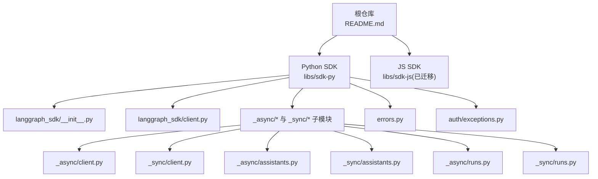
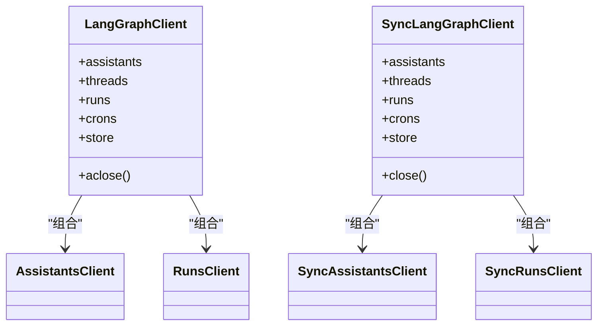
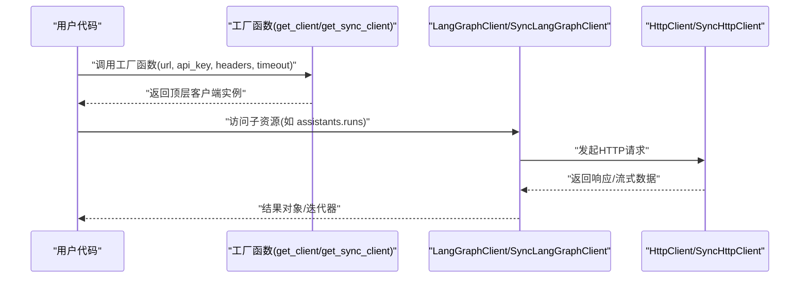
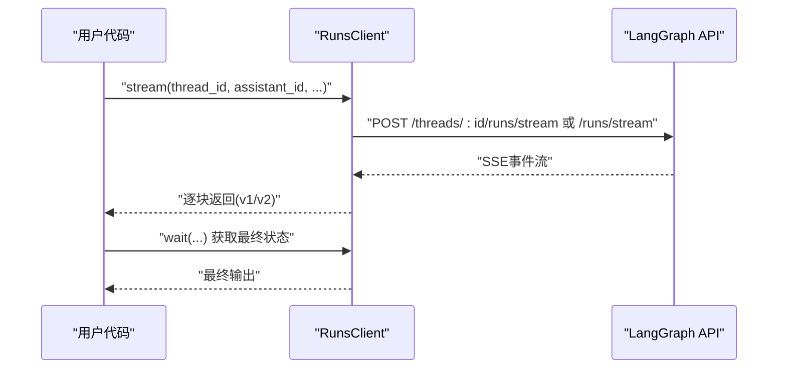
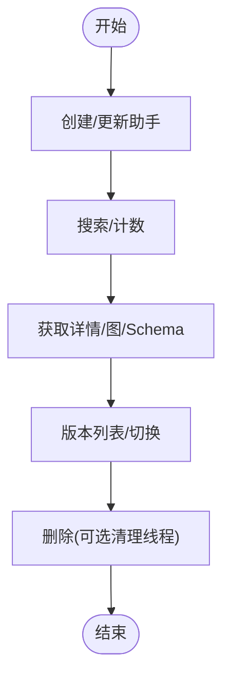
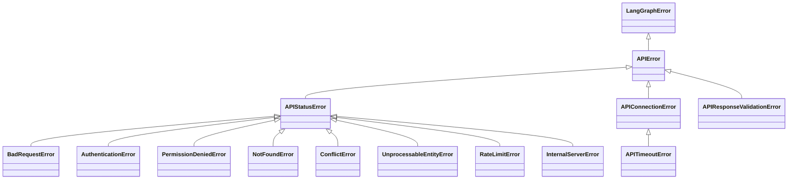
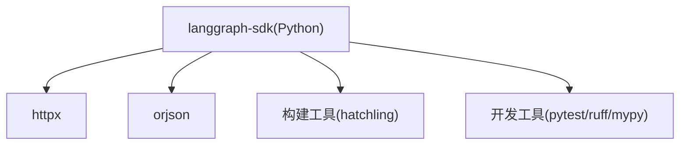

# 跨语言对比

<cite>
**本文引用的文件**
- [README.md](file://README.md)
- [libs/sdk-js/README.md](file://libs/sdk-js/README.md)
- [libs/sdk-py/README.md](file://libs/sdk-py/README.md)
- [libs/sdk-py/pyproject.toml](file://libs/sdk-py/pyproject.toml)
- [libs/sdk-py/langgraph_sdk/__init__.py](file://libs/sdk-py/langgraph_sdk/__init__.py)
- [libs/sdk-py/langgraph_sdk/client.py](file://libs/sdk-py/langgraph_sdk/client.py)
- [libs/sdk-py/langgraph_sdk/_async/client.py](file://libs/sdk-py/langgraph_sdk/_async/client.py)
- [libs/sdk-py/langgraph_sdk/_sync/client.py](file://libs/sdk-py/langgraph_sdk/_sync/client.py)
- [libs/sdk-py/langgraph_sdk/_async/assistants.py](file://libs/sdk-py/langgraph_sdk/_async/assistants.py)
- [libs/sdk-py/langgraph_sdk/_sync/assistants.py](file://libs/sdk-py/langgraph_sdk/_sync/assistants.py)
- [libs/sdk-py/langgraph_sdk/_async/runs.py](file://libs/sdk-py/langgraph_sdk/_async/runs.py)
- [libs/sdk-py/langgraph_sdk/_sync/runs.py](file://libs/sdk-py/langgraph_sdk/_sync/runs.py)
- [libs/sdk-py/langgraph_sdk/errors.py](file://libs/sdk-py/langgraph_sdk/errors.py)
- [libs/sdk-py/langgraph_sdk/auth/exceptions.py](file://libs/sdk-py/langgraph_sdk/auth/exceptions.py)
</cite>

## 目录
1. [简介](#简介)
2. [项目结构](#项目结构)
3. [核心组件](#核心组件)
4. [架构总览](#架构总览)
5. [详细组件分析](#详细组件分析)
6. [依赖关系分析](#依赖关系分析)
7. [性能考量](#性能考量)
8. [故障排查指南](#故障排查指南)
9. [结论](#结论)
10. [附录](#附录)

## 简介
本文件对 LangGraph 的 Python 与 JavaScript SDK 进行系统性对比分析，覆盖 API 设计、使用模式、错误处理、异步与同步实现、性能特征与适用场景，并提供迁移指南与最佳实践建议。当前仓库中 Python SDK 已完整实现，JavaScript SDK 已迁移至独立仓库；本文在不展示具体代码的前提下，基于仓库中的实现文件进行结构化对比与可视化说明。

## 项目结构
- Python SDK 位于 libs/sdk-py，提供异步与同步两类客户端，统一通过工厂函数创建，内部按资源模块拆分（助手、线程、运行、定时任务、存储）。
- JavaScript SDK 位于 libs/sdk-js，当前已迁移至独立仓库，README 指向新地址。
- 根 README 提供生态概览与外部链接，明确 JS/TS 库的独立位置。

图表来源
- [README.md](file://README.md)
- [libs/sdk-js/README.md](file://libs/sdk-js/README.md)
- [libs/sdk-py/langgraph_sdk/__init__.py](file://libs/sdk-py/langgraph_sdk/__init__.py)
- [libs/sdk-py/langgraph_sdk/client.py](file://libs/sdk-py/langgraph_sdk/client.py)
- [libs/sdk-py/langgraph_sdk/_async/client.py](file://libs/sdk-py/langgraph_sdk/_async/client.py)
- [libs/sdk-py/langgraph_sdk/_sync/client.py](file://libs/sdk-py/langgraph_sdk/_sync/client.py)
- [libs/sdk-py/langgraph_sdk/_async/assistants.py](file://libs/sdk-py/langgraph_sdk/_async/assistants.py)
- [libs/sdk-py/langgraph_sdk/_sync/assistants.py](file://libs/sdk-py/langgraph_sdk/_sync/assistants.py)
- [libs/sdk-py/langgraph_sdk/_async/runs.py](file://libs/sdk-py/langgraph_sdk/_async/runs.py)
- [libs/sdk-py/langgraph_sdk/_sync/runs.py](file://libs/sdk-py/langgraph_sdk/_sync/runs.py)
- [libs/sdk-py/langgraph_sdk/errors.py](file://libs/sdk-py/langgraph_sdk/errors.py)
- [libs/sdk-py/langgraph_sdk/auth/exceptions.py](file://libs/sdk-py/langgraph_sdk/auth/exceptions.py)

章节来源
- [README.md](file://README.md)
- [libs/sdk-js/README.md](file://libs/sdk-js/README.md)
- [libs/sdk-py/README.md](file://libs/sdk-py/README.md)

## 核心组件
- 客户端工厂与入口
  - Python：通过顶层导出的工厂函数创建异步或同步客户端，内部封装 HTTP 客户端与子资源客户端。
  - JavaScript：已迁移至独立仓库，不在本仓库内维护。
- 资源客户端
  - 助手（Assistants）：管理图配置版本、查询、计数、版本切换等。
  - 运行（Runs）：创建、等待、批量创建、流式输出等。
  - 线程（Threads）、定时（Cron）、存储（Store）：按模块划分，职责清晰。
- 错误体系
  - 统一继承自通用错误基类，区分连接、超时、状态码映射等类型，便于上层捕获与处理。
- 认证异常
  - 提供可抛出的 HTTP 异常类型，支持状态码、详情与响应头。

章节来源
- [libs/sdk-py/langgraph_sdk/__init__.py](file://libs/sdk-py/langgraph_sdk/__init__.py)
- [libs/sdk-py/langgraph_sdk/client.py](file://libs/sdk-py/langgraph_sdk/client.py)
- [libs/sdk-py/langgraph_sdk/_async/client.py](file://libs/sdk-py/langgraph_sdk/_async/client.py)
- [libs/sdk-py/langgraph_sdk/_sync/client.py](file://libs/sdk-py/langgraph_sdk/_sync/client.py)
- [libs/sdk-py/langgraph_sdk/_async/assistants.py](file://libs/sdk-py/langgraph_sdk/_async/assistants.py)
- [libs/sdk-py/langgraph_sdk/_sync/assistants.py](file://libs/sdk-py/langgraph_sdk/_sync/assistants.py)
- [libs/sdk-py/langgraph_sdk/_async/runs.py](file://libs/sdk-py/langgraph_sdk/_async/runs.py)
- [libs/sdk-py/langgraph_sdk/_sync/runs.py](file://libs/sdk-py/langgraph_sdk/_sync/runs.py)
- [libs/sdk-py/langgraph_sdk/errors.py](file://libs/sdk-py/langgraph_sdk/errors.py)
- [libs/sdk-py/langgraph_sdk/auth/exceptions.py](file://libs/sdk-py/langgraph_sdk/auth/exceptions.py)

## 架构总览
Python SDK 采用“顶层客户端 + 子资源客户端”的组合架构，异步与同步版本共享接口设计，仅在 I/O 层面采用不同的 HTTP 客户端实现。JavaScript SDK 当前独立于本仓库，需参考其独立仓库的实现。

图表来源
- [libs/sdk-py/langgraph_sdk/_async/client.py](file://libs/sdk-py/langgraph_sdk/_async/client.py)
- [libs/sdk-py/langgraph_sdk/_sync/client.py](file://libs/sdk-py/langgraph_sdk/_sync/client.py)
- [libs/sdk-py/langgraph_sdk/_async/assistants.py](file://libs/sdk-py/langgraph_sdk/_async/assistants.py)
- [libs/sdk-py/langgraph_sdk/_sync/assistants.py](file://libs/sdk-py/langgraph_sdk/_sync/assistants.py)
- [libs/sdk-py/langgraph_sdk/_async/runs.py](file://libs/sdk-py/langgraph_sdk/_async/runs.py)
- [libs/sdk-py/langgraph_sdk/_sync/runs.py](file://libs/sdk-py/langgraph_sdk/_sync/runs.py)

## 详细组件分析

### 客户端初始化与使用模式对比
- Python 异步客户端
  - 通过工厂函数创建，支持自动探测本地进程回环传输、环境变量加载 API Key、超时配置等。
  - 支持上下文管理器自动关闭底层 HTTP 客户端。
- Python 同步客户端
  - 通过工厂函数创建，行为与异步版本一致，但使用同步 HTTP 客户端。
- JavaScript SDK
  - 已迁移至独立仓库，不在本仓库维护；请参考其独立仓库的初始化与使用方式。

图表来源
- [libs/sdk-py/langgraph_sdk/_async/client.py](file://libs/sdk-py/langgraph_sdk/_async/client.py)
- [libs/sdk-py/langgraph_sdk/_sync/client.py](file://libs/sdk-py/langgraph_sdk/_sync/client.py)
- [libs/sdk-py/langgraph_sdk/client.py](file://libs/sdk-py/langgraph_sdk/client.py)

章节来源
- [libs/sdk-py/langgraph_sdk/_async/client.py](file://libs/sdk-py/langgraph_sdk/_async/client.py)
- [libs/sdk-py/langgraph_sdk/_sync/client.py](file://libs/sdk-py/langgraph_sdk/_sync/client.py)
- [libs/sdk-js/README.md](file://libs/sdk-js/README.md)

### 异步处理与流式输出
- Python 异步运行（Runs）
  - 支持多种流式版本（v1/v2），可选择是否包含调试信息、子图输出、可恢复重放等。
  - 提供回调钩子在运行创建时获取元数据。
- Python 同步运行（Runs）
  - 行为与异步版本一致，但返回同步迭代器或最终结果。
- JavaScript SDK
  - 已迁移至独立仓库，不在本仓库维护；请参考其独立仓库的流式实现。

图表来源
- [libs/sdk-py/langgraph_sdk/_async/runs.py](file://libs/sdk-py/langgraph_sdk/_async/runs.py)
- [libs/sdk-py/langgraph_sdk/_sync/runs.py](file://libs/sdk-py/langgraph_sdk/_sync/runs.py)

章节来源
- [libs/sdk-py/langgraph_sdk/_async/runs.py](file://libs/sdk-py/langgraph_sdk/_async/runs.py)
- [libs/sdk-py/langgraph_sdk/_sync/runs.py](file://libs/sdk-py/langgraph_sdk/_sync/runs.py)

### 助手管理（Assistants）
- Python 异步/同步助手客户端
  - 支持获取、创建、更新、删除、搜索、计数、版本列表与版本切换等。
  - 支持查询图结构、Schema、子图等。
- JavaScript SDK
  - 已迁移至独立仓库，不在本仓库维护；请参考其独立仓库的助手 API。

图表来源
- [libs/sdk-py/langgraph_sdk/_async/assistants.py](file://libs/sdk-py/langgraph_sdk/_async/assistants.py)
- [libs/sdk-py/langgraph_sdk/_sync/assistants.py](file://libs/sdk-py/langgraph_sdk/_sync/assistants.py)

章节来源
- [libs/sdk-py/langgraph_sdk/_async/assistants.py](file://libs/sdk-py/langgraph_sdk/_async/assistants.py)
- [libs/sdk-py/langgraph_sdk/_sync/assistants.py](file://libs/sdk-py/langgraph_sdk/_sync/assistants.py)

### 错误处理
- Python SDK
  - 统一的错误基类，细分连接错误、超时、状态码映射（400/401/403/404/409/422/429 及 5xx）等。
  - 自动解析响应体，提取消息、类型、参数等字段，便于定位问题。
- JavaScript SDK
  - 已迁移至独立仓库，不在本仓库维护；请参考其独立仓库的错误模型。

图表来源
- [libs/sdk-py/langgraph_sdk/errors.py](file://libs/sdk-py/langgraph_sdk/errors.py)

章节来源
- [libs/sdk-py/langgraph_sdk/errors.py](file://libs/sdk-py/langgraph_sdk/errors.py)
- [libs/sdk-py/langgraph_sdk/auth/exceptions.py](file://libs/sdk-py/langgraph_sdk/auth/exceptions.py)

## 依赖关系分析
- Python SDK 依赖
  - HTTP 客户端：httpx（异步与同步）
  - JSON 编解码：orjson
  - 版本与构建：hatchling（构建工具）
  - 开发与测试：pytest、ruff、mypy 等
- 依赖关系图

图表来源
- [libs/sdk-py/pyproject.toml](file://libs/sdk-py/pyproject.toml)

章节来源
- [libs/sdk-py/pyproject.toml](file://libs/sdk-py/pyproject.toml)

## 性能考量
- I/O 模型
  - 异步客户端适合高并发、长连接与流式场景；同步客户端适合简单脚本与单次调用。
- 流式输出
  - v2 格式提供更稳定的结构化事件，便于上层解析与重连恢复。
- 超时与重试
  - 建议根据业务延迟与吞吐量调整超时参数与重试策略，避免阻塞主线程。
- 错误快速失败
  - 使用状态码映射错误类型，尽早暴露问题，减少无效重试。

## 故障排查指南
- 常见问题
  - 连接失败：检查服务地址、网络与代理设置。
  - 认证失败：确认 API Key 来源与权限范围。
  - 超时：增大超时时间或优化上游性能。
  - 响应格式不符：关注响应体解析与错误字段提取逻辑。
- 建议流程
  - 打印请求 ID（若可用）与状态码，结合日志定位。
  - 在异步环境中确保正确关闭客户端，避免资源泄漏。
  - 在同步环境中避免长时间阻塞操作，必要时拆分为多线程或异步任务。

章节来源
- [libs/sdk-py/langgraph_sdk/errors.py](file://libs/sdk-py/langgraph_sdk/errors.py)
- [libs/sdk-py/langgraph_sdk/_async/client.py](file://libs/sdk-py/langgraph_sdk/_async/client.py)
- [libs/sdk-py/langgraph_sdk/_sync/client.py](file://libs/sdk-py/langgraph_sdk/_sync/client.py)

## 结论
- Python SDK 提供完善的异步与同步客户端，接口一致、职责清晰，适合复杂生产场景与高并发需求。
- JavaScript SDK 已迁移至独立仓库，不在本仓库维护；迁移时请以独立仓库为准。
- 迁移建议：优先复用相同资源模型（助手、运行、线程等），对照各自语言的异步/流式能力与错误模型进行适配。

## 附录
- 快速开始与示例路径
  - Python SDK 快速开始与基本用法：[libs/sdk-py/README.md](file://libs/sdk-py/README.md)
  - JS SDK 说明与迁移提示：[libs/sdk-js/README.md](file://libs/sdk-js/README.md)
  - 根 README 生态与外部链接：[README.md](file://README.md)