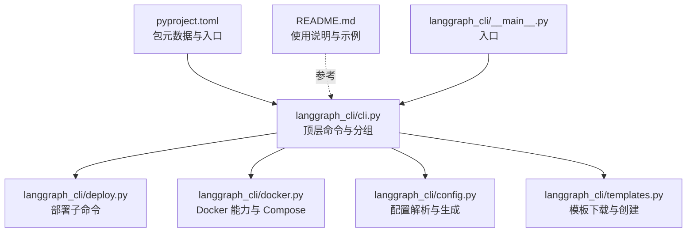
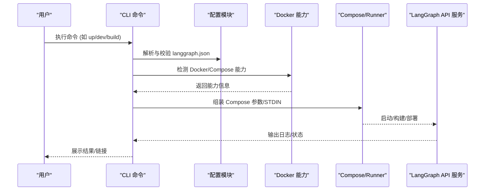
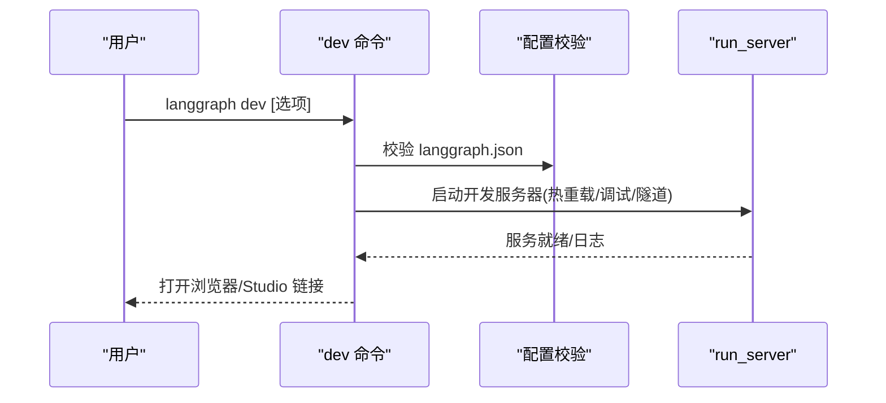
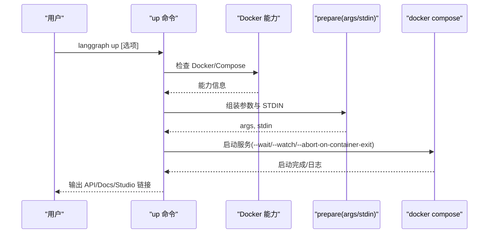
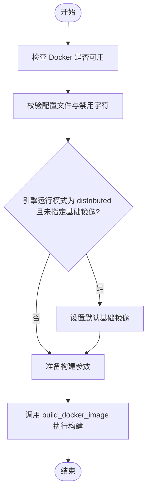
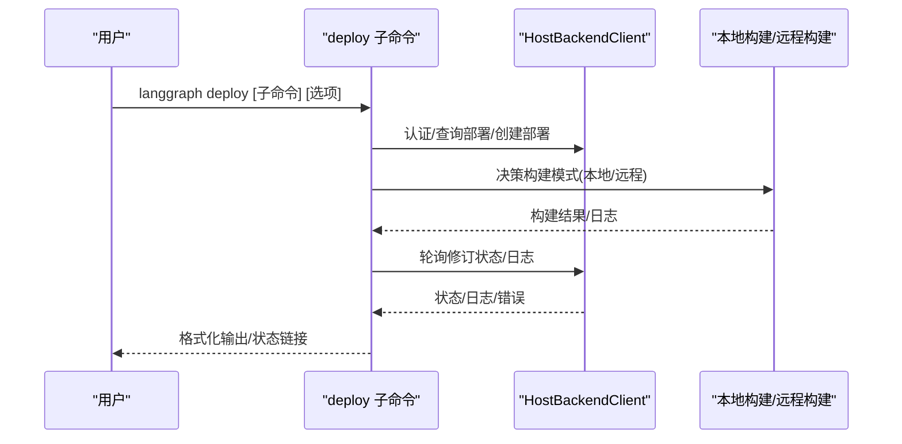
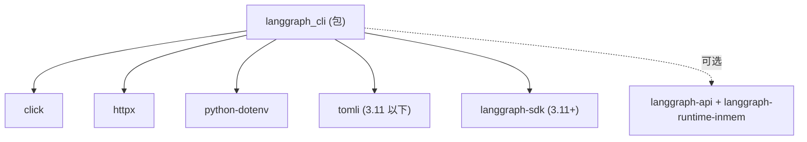

# 命令行工具 API

<cite>
**本文引用的文件**
- [libs/cli/langgraph_cli/cli.py](file://libs/cli/langgraph_cli/cli.py)
- [libs/cli/langgraph_cli/deploy.py](file://libs/cli/langgraph_cli/deploy.py)
- [libs/cli/langgraph_cli/docker.py](file://libs/cli/langgraph_cli/docker.py)
- [libs/cli/langgraph_cli/config.py](file://libs/cli/langgraph_cli/config.py)
- [libs/cli/langgraph_cli/templates.py](file://libs/cli/langgraph_cli/templates.py)
- [libs/cli/pyproject.toml](file://libs/cli/pyproject.toml)
- [libs/cli/README.md](file://libs/cli/README.md)
- [libs/cli/langgraph_cli/__main__.py](file://libs/cli/langgraph_cli/__main__.py)
</cite>

## 目录
1. [简介](#简介)
2. [项目结构](#项目结构)
3. [核心组件](#核心组件)
4. [架构总览](#架构总览)
5. [详细组件分析](#详细组件分析)
6. [依赖关系分析](#依赖关系分析)
7. [性能考虑](#性能考虑)
8. [故障排除指南](#故障排除指南)
9. [结论](#结论)
10. [附录](#附录)

## 简介
本文件为 LangGraph CLI 的完整 API 文档，覆盖命令行工具的所有命令与选项，包括开发模式、本地运行、构建镜像、生成 Dockerfile、模板创建、配置校验以及部署（含远程构建）等能力。文档提供每个命令的参数说明、使用示例与输出格式，并涵盖 Docker 集成与自动化部署的配置要点，同时给出常见问题与故障排除建议。

## 项目结构
LangGraph CLI 位于仓库的 libs/cli 目录中，核心入口通过 Python 包脚本注册为 langgraph 命令。CLI 使用 Click 构建命令体系，主要模块职责如下：
- cli.py：顶层命令定义与分组，包含 up、build、dockerfile、dev、validate、new 等命令
- deploy.py：部署子命令与流程编排，支持远程构建、密钥管理、状态轮询等
- docker.py：Docker 能力检测、Compose 字典生成、调试器服务拼装等
- config.py：配置解析与校验、Dockerfile 生成、版本与安装器选择等
- templates.py：模板下载与解压，支持多语言模板
- pyproject.toml：包元数据、可选依赖与脚本入口
- README.md：CLI 使用说明与示例
- __main__.py：包入口调用

**图表来源**
- [libs/cli/langgraph_cli/cli.py:223-231](file://libs/cli/langgraph_cli/cli.py#L223-L231)
- [libs/cli/langgraph_cli/deploy.py:1-20](file://libs/cli/langgraph_cli/deploy.py#L1-L20)
- [libs/cli/langgraph_cli/docker.py:1-200](file://libs/cli/langgraph_cli/docker.py#L1-L200)
- [libs/cli/langgraph_cli/config.py:1-200](file://libs/cli/langgraph_cli/config.py#L1-L200)
- [libs/cli/langgraph_cli/templates.py:1-187](file://libs/cli/langgraph_cli/templates.py#L1-L187)
- [libs/cli/pyproject.toml:36-37](file://libs/cli/pyproject.toml#L36-L37)
- [libs/cli/README.md:1-106](file://libs/cli/README.md#L1-L106)
- [libs/cli/langgraph_cli/__main__.py:1-5](file://libs/cli/langgraph_cli/__main__.py#L1-L5)

**章节来源**
- [libs/cli/README.md:1-106](file://libs/cli/README.md#L1-L106)
- [libs/cli/pyproject.toml:1-79](file://libs/cli/pyproject.toml#L1-L79)

## 核心组件
- 顶层命令组与帮助系统：使用自定义 NestedHelpGroup 展示扁平化帮助，便于在顶级帮助中看到嵌套子命令
- 开发模式命令 dev：本地热重载、调试端口、浏览器打开、隧道暴露、日志级别等
- 本地运行命令 up：基于 Docker Compose 启动 API 服务，支持镜像拉取、重建、监听变更、等待启动、调试器集成等
- 构建命令 build：构建 Docker 镜像，支持自定义安装/构建命令、平台、基础镜像、引擎运行模式等
- Dockerfile 生成命令 dockerfile：生成 Dockerfile 并可选生成 docker-compose.yml、.dockerignore、.env
- 配置校验命令 validate：校验 langgraph.json 的结构与键值
- 新项目模板命令 new：从模板仓库下载并解压到目标路径
- 部署命令组 deploy：包含部署创建、更新、删除、列表、日志、状态轮询等子命令，支持远程构建与密钥管理

**章节来源**
- [libs/cli/langgraph_cli/cli.py:178-231](file://libs/cli/langgraph_cli/cli.py#L178-L231)
- [libs/cli/langgraph_cli/cli.py:652-817](file://libs/cli/langgraph_cli/cli.py#L652-L817)
- [libs/cli/langgraph_cli/cli.py:234-366](file://libs/cli/langgraph_cli/cli.py#L234-L366)
- [libs/cli/langgraph_cli/cli.py:369-458](file://libs/cli/langgraph_cli/cli.py#L369-L458)
- [libs/cli/langgraph_cli/cli.py:461-649](file://libs/cli/langgraph_cli/cli.py#L461-L649)
- [libs/cli/langgraph_cli/cli.py:820-860](file://libs/cli/langgraph_cli/cli.py#L820-L860)
- [libs/cli/langgraph_cli/cli.py:863-877](file://libs/cli/langgraph_cli/cli.py#L863-L877)
- [libs/cli/langgraph_cli/deploy.py:1-200](file://libs/cli/langgraph_cli/deploy.py#L1-L200)

## 架构总览
CLI 的整体工作流围绕“配置 → Docker 能力检测 → Compose 组装 → 运行/构建/部署”展开。开发模式与本地运行通过 Docker Compose 启动服务；构建与生成 Dockerfile 则直接调用 Docker；部署命令组通过 Host Backend 客户端与云端交互。

**图表来源**
- [libs/cli/langgraph_cli/cli.py:937-998](file://libs/cli/langgraph_cli/cli.py#L937-L998)
- [libs/cli/langgraph_cli/config.py:152-200](file://libs/cli/langgraph_cli/config.py#L152-L200)
- [libs/cli/langgraph_cli/docker.py:100-142](file://libs/cli/langgraph_cli/docker.py#L100-L142)

**章节来源**
- [libs/cli/langgraph_cli/cli.py:885-998](file://libs/cli/langgraph_cli/cli.py#L885-L998)
- [libs/cli/langgraph_cli/docker.py:1-200](file://libs/cli/langgraph_cli/docker.py#L1-L200)
- [libs/cli/langgraph_cli/config.py:1-200](file://libs/cli/langgraph_cli/config.py#L1-L200)

## 详细组件分析

### 命令：dev（开发模式）
- 功能：在本地以开发模式运行 LangGraph API 服务器，支持热重载、调试端口、浏览器打开、隧道、日志级别等
- 关键选项
  - 主机绑定：--host，默认 127.0.0.1
  - 端口：--port，默认 2024
  - 禁用自动重载：--no-reload
  - 调试端口：--debug-port（需安装 debugpy）
  - 等待客户端连接：--wait-for-client
  - 跳过浏览器：--no-browser
  - 配置文件：--config，默认 langgraph.json
  - 每 worker 最大并发作业：--n-jobs-per-worker
  - Studio 地址：--studio-url，默认 https://smith.langchain.com
  - 允许同步阻塞 I/O：--allow-blocking
  - 隧道暴露：--tunnel（Cloudflare Tunnel）
  - 服务器日志级别：--server-log-level，默认 WARNING
- 行为说明
  - 校验配置文件，注入依赖路径，调用内部 run_server
  - 支持本地隧道以解决浏览器或网络对 localhost 的限制
  - 不支持 JS 图的内联内存服务器（会提示使用 npx @langchain/langgraph-cli）

**图表来源**
- [libs/cli/langgraph_cli/cli.py:656-745](file://libs/cli/langgraph_cli/cli.py#L656-L745)
- [libs/cli/langgraph_cli/cli.py:746-817](file://libs/cli/langgraph_cli/cli.py#L746-L817)

**章节来源**
- [libs/cli/langgraph_cli/cli.py:652-817](file://libs/cli/langgraph_cli/cli.py#L652-L817)

### 命令：up（本地运行）
- 功能：使用 Docker Compose 启动 LangGraph API 服务，支持镜像拉取、重建、监听变更、等待启动、调试器集成等
- 关键选项
  - 端口：--port，默认 8123
  - 等待启动：--wait（隐式启用 --detach）
  - 监听变更：--watch（重启）
  - 详细日志：--verbose
  - 配置文件：--config，默认 langgraph.json
  - Docker Compose 文件：--docker-compose
  - 重建容器：--recreate/--no-recreate
  - 拉取镜像：--pull/--no-pull
  - 调试器端口：--debugger-port
  - 调试器基础 URL：--debugger-base-url
  - Postgres 连接串：--postgres-uri
  - API 版本：--api-version
  - 引擎运行模式：--engine-runtime-mode（combined_queue_worker 或 distributed）
  - 自定义镜像：--image（跳过构建）
  - 基础镜像：--base-image
- 行为说明
  - 检测 Docker/Compose 能力，组装 Compose 参数与 STDIN
  - 拉取所需镜像（含分布式模式下的执行器镜像）
  - 启动服务并在启动完成时输出 API、文档与 Studio 链接

**图表来源**
- [libs/cli/langgraph_cli/cli.py:234-366](file://libs/cli/langgraph_cli/cli.py#L234-L366)
- [libs/cli/langgraph_cli/cli.py:885-998](file://libs/cli/langgraph_cli/cli.py#L885-L998)
- [libs/cli/langgraph_cli/docker.py:100-142](file://libs/cli/langgraph_cli/docker.py#L100-L142)

**章节来源**
- [libs/cli/langgraph_cli/cli.py:234-366](file://libs/cli/langgraph_cli/cli.py#L234-L366)
- [libs/cli/langgraph_cli/cli.py:885-998](file://libs/cli/langgraph_cli/cli.py#L885-L998)

### 命令：build（构建镜像）
- 功能：构建 LangGraph API 服务器的 Docker 镜像
- 必选参数
  - --tag/-t：镜像标签（必填）
- 关键选项
  - 配置文件：--config
  - 拉取镜像：--pull/--no-pull
  - 基础镜像：--base-image
  - API 版本：--api-version
  - 引擎运行模式：--engine-runtime-mode
  - 自定义安装命令：--install-command
  - 自定义构建命令：--build-command
  - Docker 构建参数：docker_build_args（透传）
- 行为说明
  - 校验配置文件与禁用字符，检查 Docker 可用性
  - 在分布式模式下若未指定基础镜像则设置默认值
  - 调用 build_docker_image 执行构建

**图表来源**
- [libs/cli/langgraph_cli/cli.py:369-458](file://libs/cli/langgraph_cli/cli.py#L369-L458)
- [libs/cli/langgraph_cli/config.py:40-46](file://libs/cli/langgraph_cli/config.py#L40-L46)

**章节来源**
- [libs/cli/langgraph_cli/cli.py:369-458](file://libs/cli/langgraph_cli/cli.py#L369-L458)
- [libs/cli/langgraph_cli/config.py:19-46](file://libs/cli/langgraph_cli/config.py#L19-L46)

### 命令：dockerfile（生成 Dockerfile）
- 功能：生成 Dockerfile，并可选生成 docker-compose.yml、.dockerignore、.env
- 关键选项
  - 保存路径：SAVE_PATH（位置参数）
  - 配置文件：--config
  - 添加 Compose：--add-docker-compose
  - 基础镜像：--base-image
  - API 版本：--api-version
  - 引擎运行模式：--engine-runtime-mode
- 行为说明
  - 校验配置并生成 Dockerfile
  - 若添加 Compose，则生成 .dockerignore、docker-compose.yml，并在必要时生成 .env
  - 输出额外构建上下文提示

**章节来源**
- [libs/cli/langgraph_cli/cli.py:461-649](file://libs/cli/langgraph_cli/cli.py#L461-L649)

### 命令：validate（配置校验）
- 功能：校验 langgraph.json 的 JSON 结构与未知键值
- 关键选项
  - --config：配置文件路径（默认 langgraph.json）
- 行为说明
  - 读取并解析 JSON，报告未知键警告
  - 输出有效图形数量统计

**章节来源**
- [libs/cli/langgraph_cli/cli.py:820-860](file://libs/cli/langgraph_cli/cli.py#L820-L860)

### 命令：new（新项目模板）
- 功能：从模板仓库下载并解压到指定路径
- 关键选项
  - 位置参数：PATH（可选）
  - --template：模板名称（自动列出可用模板）
- 行为说明
  - 交互式选择模板或由命令行指定
  - 下载 ZIP 并解压，移动内容至目标目录
  - 防止覆盖非空目录

**章节来源**
- [libs/cli/langgraph_cli/cli.py:863-877](file://libs/cli/langgraph_cli/cli.py#L863-L877)
- [libs/cli/langgraph_cli/templates.py:1-187](file://libs/cli/langgraph_cli/templates.py#L1-L187)

### 命令组：deploy（部署）
- 子命令概览
  - 创建/更新部署：支持本地/远程构建、镜像标签、部署类型、等待状态等
  - 删除部署：交互确认后删除
  - 列表部署：格式化输出部署 ID、名称与自定义 URL
  - 查看修订：格式化输出修订 ID、状态与时间
  - 日志与状态：轮询状态、格式化日志条目、颜色区分日志级别
- 关键选项（节选）
  - --host-api-key：主机 API 密钥
  - --host-url：主机地址
  - --deployment-id：现有部署 ID（更新时使用）
  - --name：部署名称（用于查找或创建）
  - --deployment-type：dev/prod
  - --no-wait：不等待状态
  - --tag/-t：镜像标签
  - --config/-c：配置文件路径
  - --remote/--no-remote：远程/本地构建
  - --verbose：详细日志
- 行为说明
  - 解析环境变量，过滤保留变量
  - 自动/强制远程构建决策
  - 轮询修订状态，打印状态页面链接
  - 支持自定义安装/构建命令的安全校验

**图表来源**
- [libs/cli/langgraph_cli/deploy.py:1-200](file://libs/cli/langgraph_cli/deploy.py#L1-L200)
- [libs/cli/langgraph_cli/deploy.py:355-500](file://libs/cli/langgraph_cli/deploy.py#L355-L500)

**章节来源**
- [libs/cli/langgraph_cli/deploy.py:1-200](file://libs/cli/langgraph_cli/deploy.py#L1-L200)
- [libs/cli/langgraph_cli/deploy.py:355-500](file://libs/cli/langgraph_cli/deploy.py#L355-L500)

## 依赖关系分析
- CLI 作为独立包通过脚本入口注册为 langgraph 命令
- CLI 依赖 Click、httpx、python-dotenv、tomli（3.11 以下）、langgraph-sdk（3.11+）
- 可选依赖：inmem（langgraph-api、langgraph-runtime-inmem），用于开发模式的内联内存服务器
- CLI 通过 Runner 与子进程交互，统一处理 docker/docker-compose 调用

**图表来源**
- [libs/cli/pyproject.toml:14-28](file://libs/cli/pyproject.toml#L14-L28)

**章节来源**
- [libs/cli/pyproject.toml:1-79](file://libs/cli/pyproject.toml#L1-L79)

## 性能考虑
- 本地构建能力检测：跨平台（尤其是非 x86_64）需要 Docker Buildx，否则自动切换为远程构建
- 分布式引擎模式：需要拉取执行器镜像，首次启动可能更耗时
- 镜像拉取策略：--pull/--no-pull 控制是否使用最新镜像
- 等待启动与日志：--wait 与 --verbose 影响启动时延与日志体量
- 热重载与监听：--watch 与 --no-reload 影响开发体验与资源占用

[本节为通用指导，无需特定文件来源]

## 故障排除指南
- Docker 未安装或未运行
  - 现象：命令报错提示 Docker 未安装或未运行
  - 处理：安装并启动 Docker Desktop，确保 docker info 可用
- 无法构建本地镜像（非 x86_64 架构）
  - 现象：提示需要 Docker Buildx
  - 处理：安装 Docker Buildx 或使用 --remote 强制远程构建
- 配置文件无效或包含禁用字符
  - 现象：校验失败或构建命令被拒绝
  - 处理：修正 langgraph.json；避免在自定义安装/构建命令中使用禁用字符与单个 & 符号
- 开发模式导入异常
  - 现象：缺少 langgraph-api 或 inmem 依赖
  - 处理：安装 "langgraph-cli[inmem]"，确保 Python 版本满足要求
- JS 图不支持内联内存服务器
  - 现象：提示使用 npx @langchain/langgraph-cli
  - 处理：按提示使用 JS 版本 CLI
- 部署密钥与保留变量
  - 现象：部署时忽略保留环境变量
  - 处理：移除或改用允许的变量名，确认 API Key 设置正确

**章节来源**
- [libs/cli/langgraph_cli/docker.py:52-97](file://libs/cli/langgraph_cli/docker.py#L52-L97)
- [libs/cli/langgraph_cli/config.py:19-46](file://libs/cli/langgraph_cli/config.py#L19-L46)
- [libs/cli/langgraph_cli/cli.py:747-777](file://libs/cli/langgraph_cli/cli.py#L747-L777)
- [libs/cli/langgraph_cli/deploy.py:33-78](file://libs/cli/langgraph_cli/deploy.py#L33-L78)

## 结论
LangGraph CLI 提供了从开发到生产的全链路命令行工具集，结合 Docker 与部署子命令，能够快速搭建、验证与发布 LangGraph 应用。通过合理的配置与选项组合，开发者可以高效地进行本地开发、镜像构建与云端部署。

[本节为总结，无需特定文件来源]

## 附录

### 常用命令速查
- 开发模式：langgraph dev [选项]
- 本地运行：langgraph up [选项]
- 构建镜像：langgraph build -t TAG [选项]
- 生成 Dockerfile：langgraph dockerfile SAVE_PATH [选项]
- 配置校验：langgraph validate -c PATH
- 新项目模板：langgraph new [PATH] --template NAME
- 部署：langgraph deploy [子命令] [选项]

**章节来源**
- [libs/cli/README.md:17-82](file://libs/cli/README.md#L17-L82)