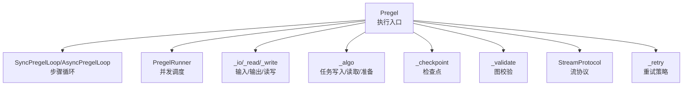
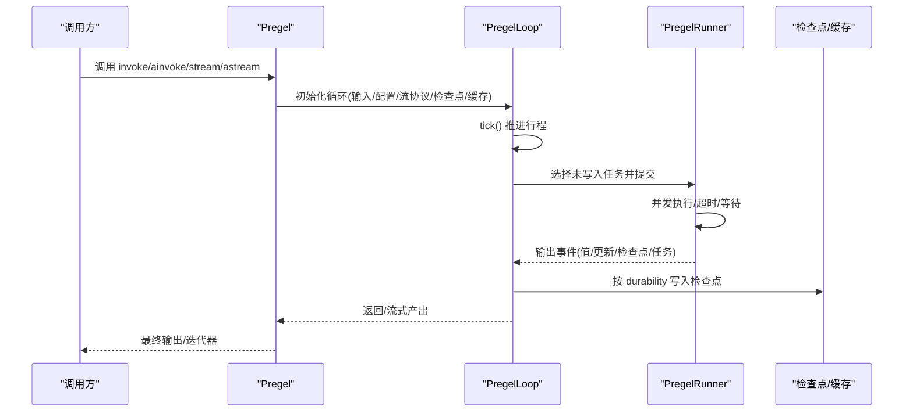
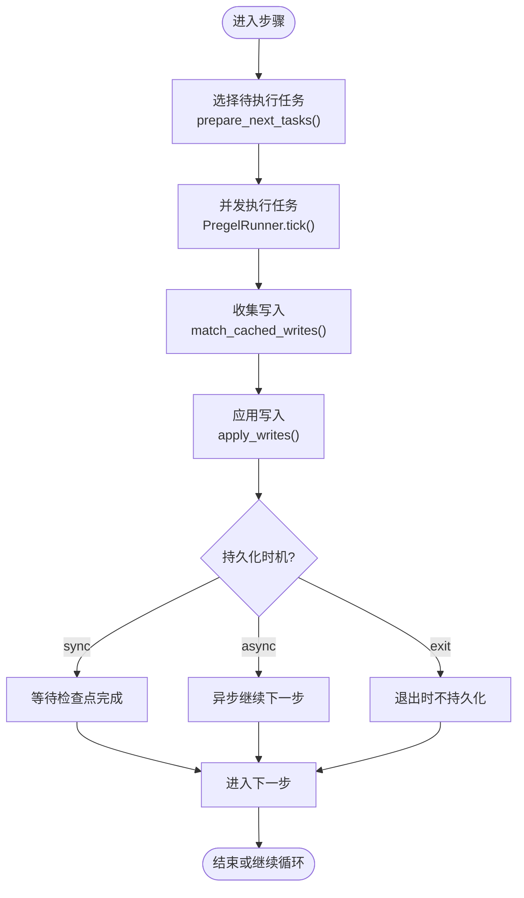
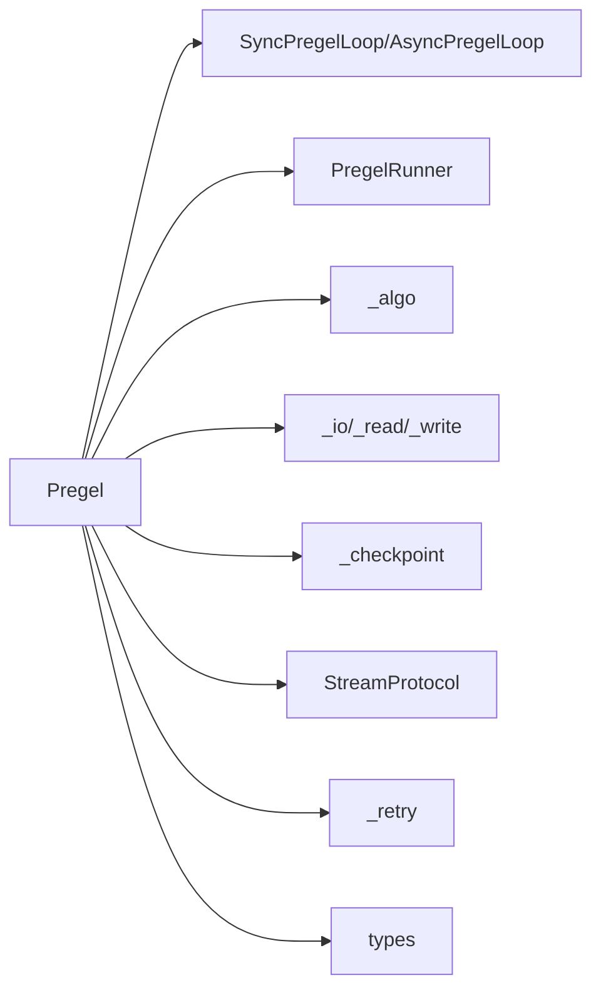

# Pregel 引擎 API

<cite>
**本文引用的文件**
- [main.py](file://libs/langgraph/langgraph/pregel/main.py)
- [_loop.py](file://libs/langgraph/langgraph/pregel/_loop.py)
- [_runner.py](file://libs/langgraph/langgraph/pregel/_runner.py)
- [_algo.py](file://libs/langgraph/langgraph/pregel/_algo.py)
- [_checkpoint.py](file://libs/langgraph/langgraph/pregel/_checkpoint.py)
- [_io.py](file://libs/langgraph/langgraph/pregel/_io.py)
- [_read.py](file://libs/langgraph/langgraph/pregel/_read.py)
- [_write.py](file://libs/langgraph/langgraph/pregel/_write.py)
- [_retry.py](file://libs/langgraph/langgraph/pregel/_retry.py)
- [_utils.py](file://libs/langgraph/langgraph/pregel/_utils.py)
- [_validate.py](file://libs/langgraph/langgraph/pregel/_validate.py)
- [types.py](file://libs/langgraph/langgraph/pregel/types.py)
</cite>

## 目录
1. [简介](#简介)
2. [项目结构](#项目结构)
3. [核心组件](#核心组件)
4. [架构总览](#架构总览)
5. [详细组件分析](#详细组件分析)
6. [依赖分析](#依赖分析)
7. [性能考虑](#性能考虑)
8. [故障排查指南](#故障排查指南)
9. [结论](#结论)
10. [附录](#附录)

## 简介
本文件系统性梳理 LangGraph Pregel 执行引擎的 API 设计与运行机制，重点覆盖以下方面：
- Pregel 类的公共方法：invoke、ainvoke、stream、astream、update_state、aupdate_state、bulk_update_state、abulk_update_state、get_state、aget_state、get_state_history、clear_cache、aclear_cache 等。
- 每个方法的参数类型、返回值与执行行为说明。
- 并行执行机制、任务调度算法、状态更新协调等内部工作原理。
- 完整的异步与流式处理示例路径（以源码路径代替具体代码）。
- 错误处理、重试机制与性能优化建议。

## 项目结构
Pregel 引擎位于 langgraph/pregel 子模块中，采用“协议接口 + 运行时循环 + 调度器 + 算法”的分层设计：
- 协议与入口：PregelProtocol 与 Pregel 实现类，定义可运行图的统一接口与执行流程。
- 循环与调度：SyncPregelLoop/AsyncPregelLoop 提供步骤推进、事件流与持久化控制；PregelRunner 负责并发调度节点任务。
- 算法与通道：_algo 负责任务写入应用、读取与准备；_io/_read/_write 处理输入输出与通道读写；_checkpoint 提供检查点管理；_validate 校验图结构。
- 流与消息：StreamProtocol、StreamMessagesHandler 支持多模式流输出与消息令牌级流。
- 重试与缓存：_retry 提供重试策略；NodeBuilder 可为节点配置缓存策略。

图表来源
- [main.py](file://libs/langgraph/langgraph/pregel/main.py)
- [_loop.py](file://libs/langgraph/langgraph/pregel/_loop.py)
- [_runner.py](file://libs/langgraph/langgraph/pregel/_runner.py)
- [_algo.py](file://libs/langgraph/langgraph/pregel/_algo.py)
- [_checkpoint.py](file://libs/langgraph/langgraph/pregel/_checkpoint.py)
- [_io.py](file://libs/langgraph/langgraph/pregel/_io.py)
- [_read.py](file://libs/langgraph/langgraph/pregel/_read.py)
- [_write.py](file://libs/langgraph/langgraph/pregel/_write.py)
- [_validate.py](file://libs/langgraph/langgraph/pregel/_validate.py)
- [_retry.py](file://libs/langgraph/langgraph/pregel/_retry.py)

章节来源
- [main.py](file://libs/langgraph/langgraph/pregel/main.py)

## 核心组件
- Pregel：LangGraph 运行时核心，封装节点、通道、流模式、中断点、检查点、缓存与重试策略，并提供同步/异步执行与流式输出能力。
- NodeBuilder：构建节点的链式 DSL，支持订阅通道、绑定可运行体、写入通道、元数据与重试/缓存策略。
- SyncPregelLoop/AsyncPregelLoop：基于 Bulk Synchronous Parallel（BSP）模型的步骤循环，负责 tick 推进、事件收集与持久化时机控制。
- PregelRunner：在每步内并发提交与调度任务，支持超时、等待器与回调清理。
- 算法与通道：_algo 提供 prepare_next_tasks、apply_writes、local_read 等；_io 提供 map_input/read_channels；_write 提供 ChannelWriteEntry；_checkpoint 提供 create_checkpoint/copy_checkpoint 等。
- 流与消息：StreamProtocol 统一流输出协议；StreamMessagesHandler 支持消息令牌级流。
- 重试与缓存：RetryPolicy 配置于节点或全局；NodeBuilder 支持为节点添加缓存策略；Pregel 提供 clear_cache/aclear_cache。

章节来源
- [main.py](file://libs/langgraph/langgraph/pregel/main.py)
- [_loop.py](file://libs/langgraph/langgraph/pregel/_loop.py)
- [_runner.py](file://libs/langgraph/langgraph/pregel/_runner.py)
- [_algo.py](file://libs/langgraph/langgraph/pregel/_algo.py)
- [_io.py](file://libs/langgraph/langgraph/pregel/_io.py)
- [_read.py](file://libs/langgraph/langgraph/pregel/_read.py)
- [_write.py](file://libs/langgraph/langgraph/pregel/_write.py)
- [_checkpoint.py](file://libs/langgraph/langgraph/pregel/_checkpoint.py)
- [_retry.py](file://libs/langgraph/langgraph/pregel/_retry.py)
- [types.py](file://libs/langgraph/langgraph/pregel/types.py)

## 架构总览
Pregel 的执行遵循 BSP 模型：每步分为 Plan（选择待执行节点）、Execute（并行执行）、Update（应用写入）。通道在步骤间保持不可变，写入仅在步骤切换时批量应用。

图表来源
- [main.py](file://libs/langgraph/langgraph/pregel/main.py)
- [_loop.py](file://libs/langgraph/langgraph/pregel/_loop.py)
- [_runner.py](file://libs/langgraph/langgraph/pregel/_runner.py)

## 详细组件分析

### Pregel 类公共方法详解

#### invoke(input, config, ..., version="v1")
- 功能：同步执行一次输入，返回最终输出或按流模式聚合的片段。
- 参数要点：
  - input：输入数据，可为字典或任意类型。
  - config：RunnableConfig，包含线程/命名空间/可配置键等。
  - stream_mode：默认 "values"，可选 "updates"、"custom"、"messages"、"checkpoints"、"tasks"、"debug" 或列表组合。
  - print_mode：调试打印模式，不影响实际输出。
  - output_keys：输出键过滤，默认使用输出通道。
  - interrupt_before/after：在节点前/后插入中断。
  - durability：持久化时机，"sync"/"async"/"exit"。
  - version：v1/v2 流格式版本。
- 返回值：
  - 当 stream_mode="values" 且 version="v2"：GraphOutput(value, interrupts)。
  - 当 stream_mode="values" 且 version="v1"：字典或标量，若存在中断则附加中断键。
  - 其他模式：返回片段列表。
- 行为说明：内部委托 stream，按版本收集最新值与中断信息，最终组装输出。

章节来源
- [main.py](file://libs/langgraph/langgraph/pregel/main.py)

#### ainvoke(input, config, ..., version="v1")
- 功能：异步执行一次输入，返回最终输出或按流模式聚合的片段。
- 参数与返回值同 invoke，但为异步实现，内部委托 astream。
- 注意：当启用消息流时，会自动设置流写入器以支持令牌级输出。

章节来源
- [main.py](file://libs/langgraph/langgraph/pregel/main.py)

#### stream(input, config, ..., version="v1")
- 功能：同步流式执行，逐步产出多种模式的事件。
- 关键参数：
  - stream_mode/print_mode/output_keys/interrupt_before/after/durability/subgraphs/debug/version 同上。
- 返回：迭代器，产出不同模式的数据块。
- 内部流程：
  - 解析默认配置（_defaults），建立回调管理器与运行期上下文。
  - 创建 SyncPregelLoop，构造 PregelRunner。
  - 在循环中按步骤推进：匹配缓存写入、并发执行任务、输出事件、按 durability 等待检查点。
  - 收尾输出与异常处理。

章节来源
- [main.py](file://libs/langgraph/langgraph/pregel/main.py)

#### astream(input, config, ..., version="v1")
- 功能：异步流式执行，逐步产出多种模式的事件。
- 内部流程：
  - 解析默认配置，建立异步回调管理器与运行期上下文。
  - 创建 AsyncPregelLoop，构造 PregelRunner(use_astream)。
  - 在循环中按步骤推进：异步匹配缓存写入、并发执行任务、输出事件、按 durability 等待检查点。
  - 收尾输出与异常处理（含等待器清理）。

章节来源
- [main.py](file://libs/langgraph/langgraph/pregel/main.py)

#### update_state(config, values, as_node=None, task_id=None)
- 功能：将外部值作为来自指定节点的写入，更新图状态。
- 返回：更新后的配置。
- 本质：委托 bulk_update_state 单条更新。

章节来源
- [main.py](file://libs/langgraph/langgraph/pregel/main.py)

#### aupdate_state(config, values, as_node=None, task_id=None)
- 功能：异步更新状态。
- 本质：委托 abulk_update_state 单条更新。

章节来源
- [main.py](file://libs/langgraph/langgraph/pregel/main.py)

#### bulk_update_state(config, supersteps)
- 功能：批量更新状态，支持多步超步（superstep）顺序应用。
- 参数：
  - supersteps：序列化的超步列表，每个超步为 StateUpdate 序列。
  - StateUpdate：(values, as_node, task_id)，其中 as_node 可为 INPUT、END、__copy__ 或节点名。
- 行为：
  - 若 as_node==INPUT：将输入映射为通道写入并保存检查点。
  - 若 as_node==END：清空当前任务并保存检查点。
  - 若 as_node=="__copy__"：复制检查点并可叠加后续更新。
  - 其他：为指定节点生成任务，执行其写入器，应用写入并保存检查点。
- 返回：更新后的配置。

章节来源
- [main.py](file://libs/langgraph/langgraph/pregel/main.py)

#### abulk_update_state(config, supersteps)
- 功能：异步批量更新状态。
- 本质：委托 abulk_update_state 实现。

章节来源
- [main.py](file://libs/langgraph/langgraph/pregel/main.py)

#### get_state(config, subgraphs=False)
- 功能：获取当前状态快照（StateSnapshot）。
- 返回：StateSnapshot，包含 values、next、config、metadata、created_at、parent_config、tasks、interrupts。
- 行为：从检查点加载并组装任务、中断与子图状态。

章节来源
- [main.py](file://libs/langgraph/langgraph/pregel/main.py)

#### aget_state(config, subgraphs=False)
- 功能：异步获取当前状态快照。
- 本质：委托 aget_state 实现。

章节来源
- [main.py](file://libs/langgraph/langgraph/pregel/main.py)

#### get_state_history(config, limit=None)
- 功能：获取历史状态序列。
- 返回：历史记录列表。
- 行为：通过检查点存储器查询历史。

章节来源
- [main.py](file://libs/langgraph/langgraph/pregel/main.py)

#### aget_state_history(config, limit=None)
- 功能：异步获取历史状态序列。
- 本质：委托 aget_state_history 实现。

章节来源
- [main.py](file://libs/langgraph/langgraph/pregel/main.py)

#### clear_cache(nodes=None)
- 功能：清理指定节点的缓存。
- 行为：遍历节点，收集命名空间并调用缓存清理。

章节来源
- [main.py](file://libs/langgraph/langgraph/pregel/main.py)

#### aclear_cache(nodes=None)
- 功能：异步清理指定节点的缓存。
- 本质：委托 aclear_cache 实现。

章节来源
- [main.py](file://libs/langgraph/langgraph/pregel/main.py)

### 并行执行机制与任务调度
- 步骤推进：循环 tick()，直到无新写入或达到递归限制。
- 任务选择：每步选择未写入的任务集合（prepare_next_tasks）。
- 并发执行：PregelRunner.tick() 并发提交任务，支持超时与等待器。
- 写入应用：apply_writes 将任务写入合并到通道，按触发映射传播。
- 持久化时机：由 durability 控制（"sync"/"async"/"exit"）。

图表来源
- [main.py](file://libs/langgraph/langgraph/pregel/main.py)
- [_algo.py](file://libs/langgraph/langgraph/pregel/_algo.py)
- [_runner.py](file://libs/langgraph/langgraph/pregel/_runner.py)

章节来源
- [main.py](file://libs/langgraph/langgraph/pregel/main.py)
- [_runner.py](file://libs/langgraph/langgraph/pregel/_runner.py)
- [_algo.py](file://libs/langgraph/langgraph/pregel/_algo.py)

### 输入/输出与通道读写
- 输入映射：map_input 将用户输入转换为通道写入。
- 通道读取：read_channels 按通道键读取当前值。
- 写入条目：ChannelWriteEntry 支持按通道写入或映射写入。
- 触发映射：_trigger_to_nodes 建立触发到节点的索引，用于任务选择。

章节来源
- [main.py](file://libs/langgraph/langgraph/pregel/main.py)
- [_io.py](file://libs/langgraph/langgraph/pregel/_io.py)
- [_read.py](file://libs/langgraph/langgraph/pregel/_read.py)
- [_write.py](file://libs/langgraph/langgraph/pregel/_write.py)

### 检查点与状态迁移
- 检查点创建/复制：create_checkpoint/copy_checkpoint。
- 版本迁移：_migrate_checkpoint 适配旧布局。
- 状态快照：_prepare_state_snapshot/_aprepare_state_snapshot 组装 values、next、tasks、interrupts 等。

章节来源
- [main.py](file://libs/langgraph/langgraph/pregel/main.py)
- [_checkpoint.py](file://libs/langgraph/langgraph/pregel/_checkpoint.py)

### 流式处理与消息令牌流
- 流协议：StreamProtocol 统一流输出；StreamMessagesHandler 支持消息令牌级流。
- 模式支持："values"、"updates"、"custom"、"messages"、"checkpoints"、"tasks"、"debug"。
- v1/v2：v2 使用 StreamPart 类型化输出，便于强类型消费。

章节来源
- [main.py](file://libs/langgraph/langgraph/pregel/main.py)

### 错误处理与重试机制
- 递归限制：超过 recursion_limit 抛出 GraphRecursionError。
- 重试策略：RetryPolicy 可在节点或全局配置；PregelRunner 在执行阶段根据策略重试。
- 缓存清理：clear_cache/aclear_cache 清理失败或过期结果。

章节来源
- [main.py](file://libs/langgraph/langgraph/pregel/main.py)
- [_retry.py](file://libs/langgraph/langgraph/pregel/_retry.py)

## 依赖分析
- Pregel 对外依赖：langchain_core Runnable 接口、回调管理器、检查点/存储/缓存抽象。
- 内部耦合：Pregel 与 _loop、_runner、_algo、_checkpoint、_io、_read、_write、_retry 紧密协作。
- 可能的循环依赖：通过弱引用与延迟初始化避免；各模块职责清晰，耦合度合理。

图表来源
- [main.py](file://libs/langgraph/langgraph/pregel/main.py)
- [types.py](file://libs/langgraph/langgraph/pregel/types.py)

章节来源
- [main.py](file://libs/langgraph/langgraph/pregel/main.py)
- [types.py](file://libs/langgraph/langgraph/pregel/types.py)

## 性能考虑
- 并发度：PregelRunner.tick() 支持并发执行任务，建议合理设置 step_timeout 与线程池大小。
- 持久化时机：durability="sync" 保证一致性但可能阻塞；"async" 提升吞吐；"exit" 适合一次性任务。
- 缓存：为热点节点配置 CachePolicy，结合 clear_cache/aclear_cache 清理失效数据。
- 流模式：消息/自定义流会增加开销，按需启用。
- 图校验：validate() 在构建时尽早发现配置问题，减少运行时错误。

## 故障排查指南
- 递归限制：检查 recursion_limit 配置，确认图是否存在无终止条件的循环。
- 检查点缺失：确保配置包含 thread_id、checkpoint_ns、checkpoint_id 等必要键。
- 通道冲突：确认保留通道（如 TASKS）未被用户自定义覆盖。
- 中断与状态：使用 get_state/get_state_history 获取中间状态，定位写入异常。
- 重试与缓存：调整 RetryPolicy 与 CachePolicy，必要时清理缓存。

章节来源
- [main.py](file://libs/langgraph/langgraph/pregel/main.py)

## 结论
Pregel 引擎以 BSP 模型为核心，通过循环、调度、算法与通道的协同，提供了高并发、可流式、可检查点的执行框架。其 API 设计兼顾易用性与灵活性，适用于复杂状态机与多节点协作场景。通过合理配置 durability、重试与缓存策略，可在一致性与性能之间取得平衡。

## 附录
- 示例路径（以源码路径代替具体代码）：
  - 同步流式执行：[stream 方法实现](file://libs/langgraph/langgraph/pregel/main.py)
  - 异步流式执行：[astream 方法实现](file://libs/langgraph/langgraph/pregel/main.py)
  - 同步一次性执行：[invoke 方法实现](file://libs/langgraph/langgraph/pregel/main.py)
  - 异步一次性执行：[ainvoke 方法实现](file://libs/langgraph/langgraph/pregel/main.py)
  - 更新状态（单条）：[update_state 方法实现](file://libs/langgraph/langgraph/pregel/main.py)
  - 更新状态（批量）：[bulk_update_state 方法实现](file://libs/langgraph/langgraph/pregel/main.py)
  - 获取状态：[get_state 方法实现](file://libs/langgraph/langgraph/pregel/main.py)
  - 获取历史：[get_state_history 方法实现](file://libs/langgraph/langgraph/pregel/main.py)
  - 清理缓存：[clear_cache 方法实现](file://libs/langgraph/langgraph/pregel/main.py)