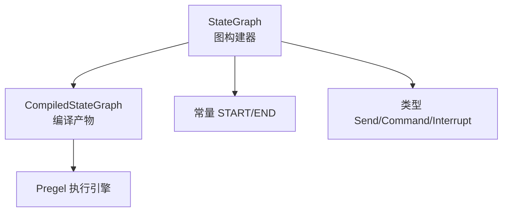
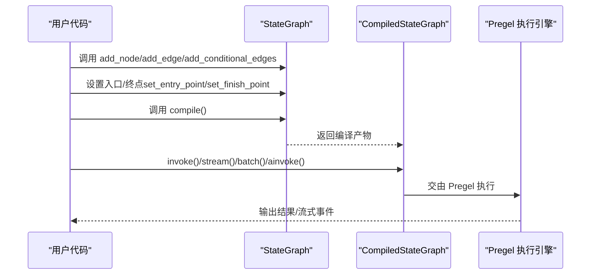
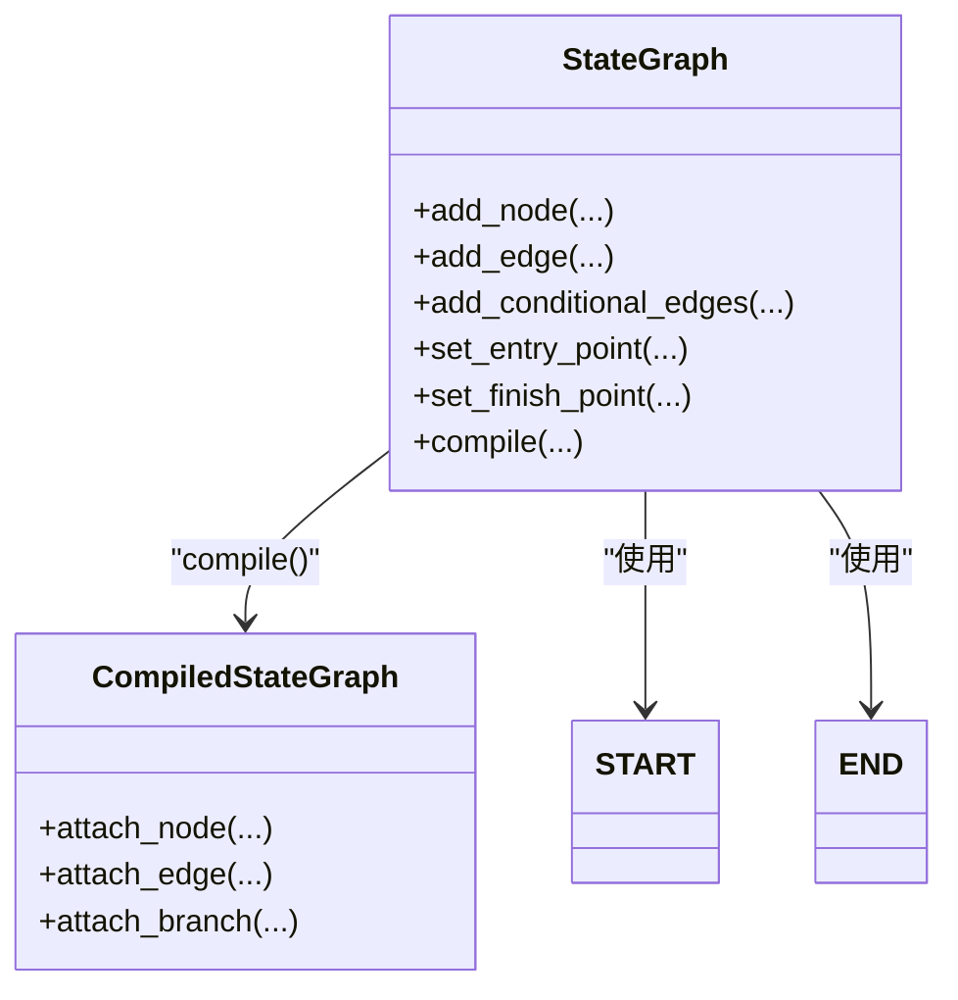

# StateGraph API

<cite>
**本文引用的文件**
- [libs/langgraph/langgraph/graph/state.py](file://libs/langgraph/langgraph/graph/state.py)
- [libs/langgraph/langgraph/constants.py](file://libs/langgraph/langgraph/constants.py)
- [libs/langgraph/langgraph/types.py](file://libs/langgraph/langgraph/types.py)
- [libs/langgraph/tests/test_pregel.py](file://libs/langgraph/tests/test_pregel.py)
- [libs/langgraph/tests/test_large_cases.py](file://libs/langgraph/tests/test_large_cases.py)
</cite>

## 目录
1. [简介](#简介)
2. [项目结构](#项目结构)
3. [核心组件](#核心组件)
4. [架构总览](#架构总览)
5. [详细组件分析](#详细组件分析)
6. [依赖关系分析](#依赖关系分析)
7. [性能考量](#性能考量)
8. [故障排查指南](#故障排查指南)
9. [结论](#结论)
10. [附录](#附录)

## 简介
本文件系统性地梳理 StateGraph API 的设计与用法，聚焦以下目标：
- 全面说明 StateGraph 类的公共方法：add_node()、add_edge()、add_conditional_edges()、set_entry_point()、set_finish_point() 等
- 给出每个方法的参数类型、返回值、典型使用场景与注意事项
- 解释节点与边的添加规则、条件分支的定义方式、以及图的编译过程
- 提供常见错误处理与最佳实践建议

StateGraph 是一个“状态图”构建器，节点通过读写共享状态进行通信；它本身不可直接执行，需先调用 compile() 编译为可运行的 CompiledStateGraph。

## 项目结构
围绕 StateGraph 的关键模块与职责如下：
- 图构建与编译：libs/langgraph/langgraph/graph/state.py
- 常量（START/END）：libs/langgraph/langgraph/constants.py
- 类型与命令模型：libs/langgraph/langgraph/types.py
- 示例与回归测试：libs/langgraph/tests/*.py

图表来源
- [libs/langgraph/langgraph/graph/state.py:115-1199](file://libs/langgraph/langgraph/graph/state.py#L115-L1199)
- [libs/langgraph/langgraph/constants.py:23-31](file://libs/langgraph/langgraph/constants.py#L23-L31)
- [libs/langgraph/langgraph/types.py:574-703](file://libs/langgraph/langgraph/types.py#L574-L703)

章节来源
- [libs/langgraph/langgraph/graph/state.py:115-1199](file://libs/langgraph/langgraph/graph/state.py#L115-L1199)
- [libs/langgraph/langgraph/constants.py:23-31](file://libs/langgraph/langgraph/constants.py#L23-L31)
- [libs/langgraph/langgraph/types.py:574-703](file://libs/langgraph/langgraph/types.py#L574-L703)

## 核心组件
- StateGraph：图构建器，负责注册节点、定义边与分支、设置入口/终点，并最终编译为可执行图
- CompiledStateGraph：编译后的可执行图，继承自 Pregel，支持 invoke()/stream()/batch()/ainvoke() 等
- 常量 START/END：分别代表“开始”和“结束”虚拟节点
- 类型 Send/Command/Interrupt：用于动态路由、状态更新与中断控制

章节来源
- [libs/langgraph/langgraph/graph/state.py:115-1199](file://libs/langgraph/langgraph/graph/state.py#L115-L1199)
- [libs/langgraph/langgraph/constants.py:23-31](file://libs/langgraph/langgraph/constants.py#L23-L31)
- [libs/langgraph/langgraph/types.py:574-703](file://libs/langgraph/langgraph/types.py#L574-L703)

## 架构总览
下图展示从构建到编译再到执行的关键流程：

图表来源
- [libs/langgraph/langgraph/graph/state.py:1038-1193](file://libs/langgraph/langgraph/graph/state.py#L1038-L1193)

章节来源
- [libs/langgraph/langgraph/graph/state.py:1038-1193](file://libs/langgraph/langgraph/graph/state.py#L1038-L1193)

## 详细组件分析

### StateGraph.add_node(node, action=None, ..., destinations=None)
- 功能：向图中添加一个节点
- 参数要点
  - node：字符串或可调用对象/Runnable；若为可调用对象则自动推断名称
  - action：当 node 为字符串时必填，指定节点逻辑
  - input_schema：可选，显式指定节点输入模式；未提供时可从函数签名推断
  - defer/retry_policy/cache_policy/metadata：控制执行时机、重试策略、缓存策略与元数据
  - destinations：仅用于渲染目的，指示节点可能的路由目标（对执行无影响）
- 返回值：Self（支持链式调用）
- 使用场景
  - 注册纯函数/Runnable作为节点
  - 为节点显式声明输入模式（如 TypedDict/Pydantic 模型）
  - 为无边图且节点返回 Command 的场景声明静态路由
- 注意事项
  - 节点名不能与保留字 START/END 冲突
  - 节点名中不允许包含命名分隔符等保留字符
  - 若在已编译图上再次添加节点，将被警告但不会反映到已编译版本
- 可参考示例路径
  - [libs/langgraph/tests/test_pregel.py:7017-7026](file://libs/langgraph/tests/test_pregel.py#L7017-L7026)
  - [libs/langgraph/tests/test_large_cases.py:6971-6975](file://libs/langgraph/tests/test_large_cases.py#L6971-L6975)

章节来源
- [libs/langgraph/langgraph/graph/state.py:572-786](file://libs/langgraph/langgraph/graph/state.py#L572-L786)

### StateGraph.add_edge(start_key, end_key)
- 功能：添加一条有向边
- 参数要点
  - start_key：起始节点名，或节点名列表（并行汇聚）
  - end_key：终止节点名；可为 END 表示结束
- 返回值：Self（支持链式调用）
- 规则与限制
  - 不允许以 END 作为起点
  - 不允许以 START 作为终点
  - 单一起点时，等待该节点完成后才进入下一节点
  - 多起点时，等待所有起点完成后才进入下一节点
  - 若在已编译图上添加边，会发出警告但不更新已编译版本
- 可参考示例路径
  - [libs/langgraph/tests/test_pregel.py:7017-7018](file://libs/langgraph/tests/test_pregel.py#L7017-L7018)

章节来源
- [libs/langgraph/langgraph/graph/state.py:788-840](file://libs/langgraph/langgraph/graph/state.py#L788-L840)

### StateGraph.add_conditional_edges(source, path, path_map=None)
- 功能：为某节点退出时添加条件分支
- 参数要点
  - source：源节点名
  - path：判定下一个节点的可调用对象（可同步/异步/Runnable），返回单个或多个目标
  - path_map：可选映射表，将返回值映射到节点名；未提供时要求返回值即为节点名
- 返回值：Self（支持链式调用）
- 规则与限制
  - 分支名冲突将报错
  - 若未提供类型提示或 path_map，可视化时会假设可通向任意节点
  - 若在已编译图上添加条件边，会发出警告但不更新已编译版本
- 可参考示例路径
  - [libs/langgraph/tests/test_pregel.py:7017-7034](file://libs/langgraph/tests/test_pregel.py#L7017-L7034)

章节来源
- [libs/langgraph/langgraph/graph/state.py:842-890](file://libs/langgraph/langgraph/graph/state.py#L842-L890)

### StateGraph.set_entry_point(key)
- 功能：设置图的入口节点（等价于 add_edge(START, key)）
- 参数要点
  - key：节点名
- 返回值：Self（支持链式调用）

章节来源
- [libs/langgraph/langgraph/graph/state.py:939-950](file://libs/langgraph/langgraph/graph/state.py#L939-L950)

### StateGraph.set_finish_point(key)
- 功能：将某节点标记为完成点（等价于 add_edge(key, END)）
- 参数要点
  - key：节点名
- 返回值：Self（支持链式调用）

章节来源
- [libs/langgraph/langgraph/graph/state.py:976-987](file://libs/langgraph/langgraph/graph/state.py#L976-L987)

### 条件入口点：set_conditional_entry_point(path, path_map=None)
- 功能：为 START 设置条件分支，决定首个节点的选择
- 参数要点
  - path/path_map：同 add_conditional_edges
- 返回值：Self（支持链式调用）

章节来源
- [libs/langgraph/langgraph/graph/state.py:952-974](file://libs/langgraph/langgraph/graph/state.py#L952-L974)

### 图的编译：compile(...)
- 功能：将 StateGraph 编译为 CompiledStateGraph，使其具备执行能力
- 关键步骤
  - 校验图结构（入口、节点、边、分支目标等）
  - 准备通道与输出通道
  - 将节点/边/分支附加到编译产物
  - 返回校验后的可执行图
- 关键参数
  - checkpointer：检查点保存器或开关
  - interrupt_before/interrupt_after：在特定节点前/后中断
  - debug/name：调试与命名
- 可参考示例路径
  - [libs/langgraph/tests/test_large_cases.py:6978-6982](file://libs/langgraph/tests/test_large_cases.py#L6978-L6982)

章节来源
- [libs/langgraph/langgraph/graph/state.py:1038-1193](file://libs/langgraph/langgraph/graph/state.py#L1038-L1193)

### 类型与命令模型
- Send：用于条件分支中向特定节点发送消息（可携带独立状态）
- Command：用于更新状态、跳转到节点、恢复中断、或返回父图
- Interrupt：在节点中触发可恢复的中断，配合检查点使用

章节来源
- [libs/langgraph/langgraph/types.py:574-703](file://libs/langgraph/langgraph/types.py#L574-L703)

## 依赖关系分析
- StateGraph 依赖常量 START/END 定义图的边界
- StateGraph 在编译阶段将节点/边/分支转换为 CompiledStateGraph 的内部结构
- CompiledStateGraph 继承 Pregel，借助通道与写入器实现状态传播与并发汇聚

图表来源
- [libs/langgraph/langgraph/graph/state.py:115-1199](file://libs/langgraph/langgraph/graph/state.py#L115-L1199)
- [libs/langgraph/langgraph/constants.py:23-31](file://libs/langgraph/langgraph/constants.py#L23-L31)

章节来源
- [libs/langgraph/langgraph/graph/state.py:115-1199](file://libs/langgraph/langgraph/graph/state.py#L115-L1199)
- [libs/langgraph/langgraph/constants.py:23-31](file://libs/langgraph/langgraph/constants.py#L23-L31)

## 性能考量
- 并发汇聚：多起点汇聚使用命名屏障通道，确保所有上游完成后再进入下游
- 节点延迟执行：通过 defer 控制节点在运行末尾执行，有助于减少中间态写入
- 缓存策略：可通过 cache_policy 对节点输入进行缓存，避免重复计算
- 重试策略：通过 retry_policy 配置指数退避等重试机制，提升鲁棒性

章节来源
- [libs/langgraph/langgraph/graph/state.py:1339-1364](file://libs/langgraph/langgraph/graph/state.py#L1339-L1364)
- [libs/langgraph/langgraph/types.py:404-424](file://libs/langgraph/langgraph/types.py#L404-L424)
- [libs/langgraph/langgraph/types.py:429-440](file://libs/langgraph/langgraph/types.py#L429-L440)

## 故障排查指南
- 添加节点/边/条件边后无法生效
  - 已编译图上再修改会被忽略并发出警告；请在 compile() 前完成全部配置
- 节点名冲突或非法
  - 节点名不得与 START/END 冲突，且不得包含保留字符
- 边的起点/终点非法
  - 起点不能为 END；终点不能为 START
- 条件分支返回值与 path_map 不匹配
  - 未提供 path_map 时，返回值应为节点名；否则需提供 path_map 映射
- 无入口或未知目标
  - 必须至少有一条从 START 出发的边；所有边的目标必须存在于图中（除 END）

章节来源
- [libs/langgraph/langgraph/graph/state.py:788-840](file://libs/langgraph/langgraph/graph/state.py#L788-L840)
- [libs/langgraph/langgraph/graph/state.py:842-890](file://libs/langgraph/langgraph/graph/state.py#L842-L890)
- [libs/langgraph/langgraph/graph/state.py:989-1036](file://libs/langgraph/langgraph/graph/state.py#L989-L1036)

## 结论
StateGraph 提供了清晰的 DSL 式图构建体验：通过 add_node/add_edge/add_conditional_edges 定义结构，set_entry_point/set_finish_point 标注入口与出口，最后 compile() 得到高性能可执行图。结合 Send/Command/Interrupt 等类型，可覆盖从简单串行到复杂条件分支与并行汇聚的多种工作流场景。

## 附录

### 方法速查与类型注解要点
- add_node(node, action=None, ..., destinations=None) -> Self
  - 输入模式：可从函数签名推断或显式指定
  - 影响：注册节点、可选声明静态路由
- add_edge(start_key: str | list[str], end_key: str) -> Self
  - 影响：单起点串行、多起点汇聚
- add_conditional_edges(source: str, path, path_map=None) -> Self
  - 影响：为节点退出时动态选择下一节点
- set_entry_point(key: str) -> Self
- set_finish_point(key: str) -> Self
- set_conditional_entry_point(path, path_map=None) -> Self
- compile(..., checkpointer=None, interrupt_before=None, interrupt_after=None, debug=False, name=None) -> CompiledStateGraph

章节来源
- [libs/langgraph/langgraph/graph/state.py:572-786](file://libs/langgraph/langgraph/graph/state.py#L572-L786)
- [libs/langgraph/langgraph/graph/state.py:788-840](file://libs/langgraph/langgraph/graph/state.py#L788-L840)
- [libs/langgraph/langgraph/graph/state.py:842-890](file://libs/langgraph/langgraph/graph/state.py#L842-L890)
- [libs/langgraph/langgraph/graph/state.py:939-987](file://libs/langgraph/langgraph/graph/state.py#L939-L987)
- [libs/langgraph/langgraph/graph/state.py:1038-1193](file://libs/langgraph/langgraph/graph/state.py#L1038-L1193)