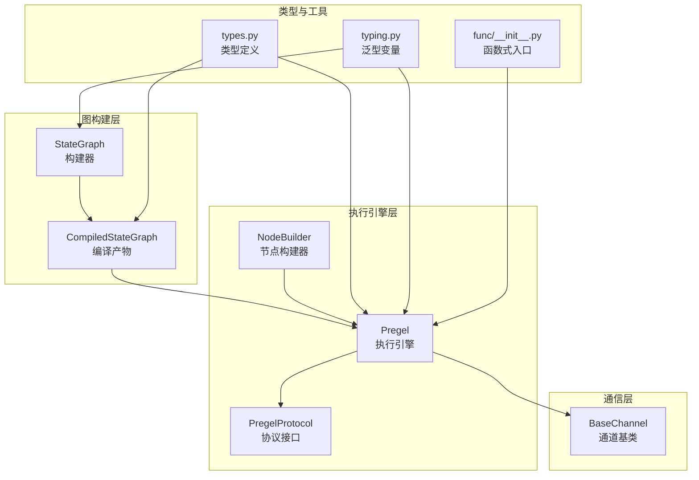
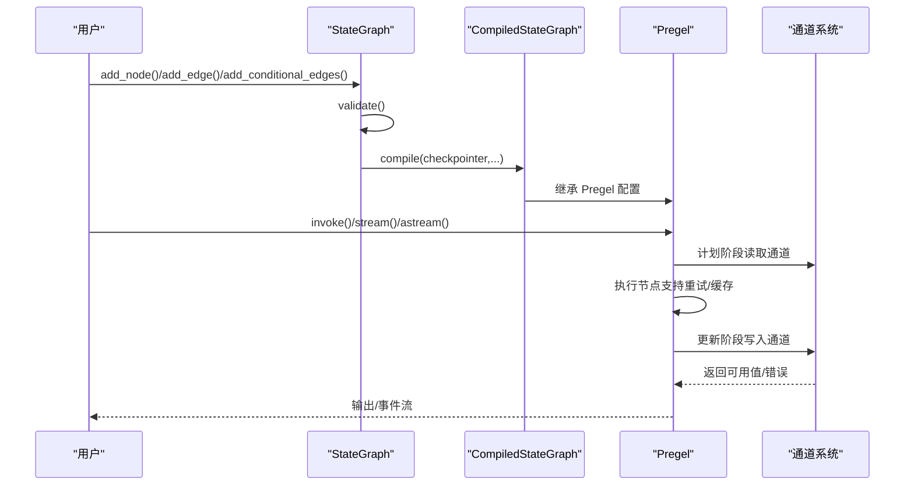
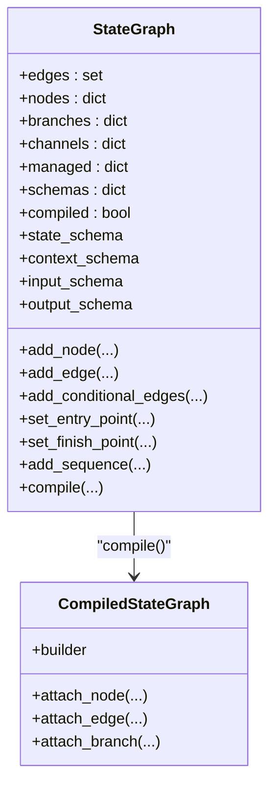
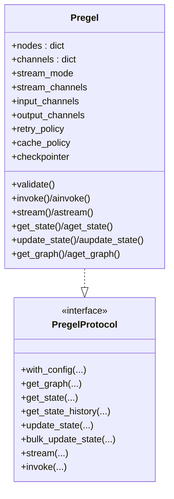
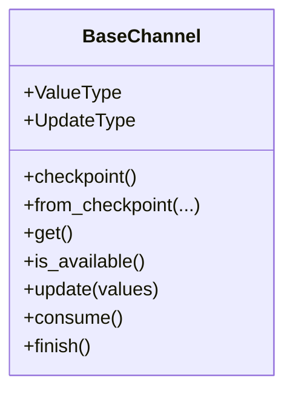
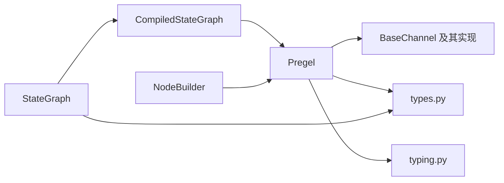

# 核心框架 API

<cite>
**本文引用的文件**
- [libs/langgraph/langgraph/graph/state.py](file://libs/langgraph/langgraph/graph/state.py)
- [libs/langgraph/langgraph/pregel/main.py](file://libs/langgraph/langgraph/pregel/main.py)
- [libs/langgraph/langgraph/channels/base.py](file://libs/langgraph/langgraph/channels/base.py)
- [libs/langgraph/langgraph/pregel/protocol.py](file://libs/langgraph/langgraph/pregel/protocol.py)
- [libs/langgraph/langgraph/types.py](file://libs/langgraph/langgraph/types.py)
- [libs/langgraph/langgraph/typing.py](file://libs/langgraph/langgraph/typing.py)
- [libs/langgraph/langgraph/func/__init__.py](file://libs/langgraph/langgraph/func/__init__.py)
</cite>

## 目录
1. [简介](#简介)
2. [项目结构](#项目结构)
3. [核心组件](#核心组件)
4. [架构总览](#架构总览)
5. [详细组件分析](#详细组件分析)
6. [依赖分析](#依赖分析)
7. [性能考虑](#性能考虑)
8. [故障排查指南](#故障排查指南)
9. [结论](#结论)
10. [附录](#附录)

## 简介
本文件面向 LangGraph 核心框架 API 的使用者与维护者，系统化梳理 StateGraph 构建器、Pregel 执行引擎与通道系统等关键组件的公共接口、类型注解、异常处理与调用顺序，并给出最佳实践与可视化图示，帮助读者在不深入源码细节的前提下高效掌握 API 使用。

## 项目结构
LangGraph 的核心位于 libs/langgraph 下，主要模块包括：
- graph/state.py：StateGraph 构建器与编译产物 CompiledStateGraph
- pregel/main.py：Pregel 执行引擎（同步/异步）、节点构建器 NodeBuilder、协议实现
- channels/base.py：通道抽象 BaseChannel 及其子类接口
- pregel/protocol.py：PregelProtocol 抽象协议（invoke/stream/状态管理等）
- types.py：通用类型定义（StreamMode、RetryPolicy、CachePolicy、Command、Send 等）
- typing.py：泛型类型变量（StateT/InputT/OutputT/ContextT 等）
- func/__init__.py：函数式入口（基于 Pregel 的轻量封装）

图表来源
- [libs/langgraph/langgraph/graph/state.py](file://libs/langgraph/langgraph/graph/state.py)
- [libs/langgraph/langgraph/pregel/main.py](file://libs/langgraph/langgraph/pregel/main.py)
- [libs/langgraph/langgraph/channels/base.py](file://libs/langgraph/langgraph/channels/base.py)
- [libs/langgraph/langgraph/pregel/protocol.py](file://libs/langgraph/langgraph/pregel/protocol.py)
- [libs/langgraph/langgraph/types.py](file://libs/langgraph/langgraph/types.py)
- [libs/langgraph/langgraph/typing.py](file://libs/langgraph/langgraph/typing.py)
- [libs/langgraph/langgraph/func/__init__.py](file://libs/langgraph/langgraph/func/__init__.py)

章节来源
- [libs/langgraph/langgraph/graph/state.py](file://libs/langgraph/langgraph/graph/state.py)
- [libs/langgraph/langgraph/pregel/main.py](file://libs/langgraph/langgraph/pregel/main.py)
- [libs/langgraph/langgraph/channels/base.py](file://libs/langgraph/langgraph/channels/base.py)
- [libs/langgraph/langgraph/pregel/protocol.py](file://libs/langgraph/langgraph/pregel/protocol.py)
- [libs/langgraph/langgraph/types.py](file://libs/langgraph/langgraph/types.py)
- [libs/langgraph/langgraph/typing.py](file://libs/langgraph/langgraph/typing.py)
- [libs/langgraph/langgraph/func/__init__.py](file://libs/langgraph/langgraph/func/__init__.py)

## 核心组件
- StateGraph：以“共享状态”为核心的图构建器，负责声明节点、边、条件分支、入口/结束点以及编译为可执行图。
- CompiledStateGraph：由 StateGraph.compile() 生成，继承自 Pregel，承载最终可运行的图。
- Pregel：底层执行引擎，实现 Bulk Synchronous Parallel（BSP）模型，调度节点、更新通道、处理检查点与流式输出。
- NodeBuilder：用于快速组合订阅通道、写入通道、重试策略与缓存策略，最终构建 PregelNode。
- BaseChannel：通道抽象，定义读写、序列化、消费与收尾生命周期钩子。
- PregelProtocol：统一的可运行协议，定义 invoke/ainvoke、stream/astream、状态查询与批量更新等接口。
- types.py：StreamMode、RetryPolicy、CachePolicy、Command、Send、StateSnapshot 等核心类型。
- typing.py：StateT/InputT/OutputT/ContextT 等泛型类型变量。

章节来源
- [libs/langgraph/langgraph/graph/state.py](file://libs/langgraph/langgraph/graph/state.py)
- [libs/langgraph/langgraph/pregel/main.py](file://libs/langgraph/langgraph/pregel/main.py)
- [libs/langgraph/langgraph/channels/base.py](file://libs/langgraph/langgraph/channels/base.py)
- [libs/langgraph/langgraph/pregel/protocol.py](file://libs/langgraph/langgraph/pregel/protocol.py)
- [libs/langgraph/langgraph/types.py](file://libs/langgraph/langgraph/types.py)
- [libs/langgraph/langgraph/typing.py](file://libs/langgraph/langgraph/typing.py)

## 架构总览
LangGraph 的执行遵循“图构建 → 编译 → 执行”的路径。StateGraph 负责构建静态图，CompiledStateGraph/Pregel 负责动态执行。通道作为节点间通信介质，贯穿计划、执行、更新三个阶段。

图表来源
- [libs/langgraph/langgraph/graph/state.py](file://libs/langgraph/langgraph/graph/state.py)
- [libs/langgraph/langgraph/pregel/main.py](file://libs/langgraph/langgraph/pregel/main.py)
- [libs/langgraph/langgraph/channels/base.py](file://libs/langgraph/langgraph/channels/base.py)

## 详细组件分析

### StateGraph 构建器
- 角色定位：声明式构建“共享状态”图，定义节点、边、条件分支、入口/结束点，最终编译为可执行图。
- 关键方法与行为
  - add_node(node|name, action, ...)：注册节点，支持推断输入模式、命令路由、延迟执行、重试策略、缓存策略与目的地标注。
  - add_edge(start_key, end_key)：添加有向边；单起点等待完成再触发，多起点需全部完成后触发。
  - add_conditional_edges(source, path, path_map?)：条件边，根据返回值或 path_map 决定下一跳。
  - set_entry_point/set_finish_point：快捷设置 START/END 边。
  - add_sequence：按序注册多个节点并自动连接。
  - compile(...): 校验图、准备输出/流通道、构建 CompiledStateGraph。
- 类型与异常
  - 输入/输出/上下文/状态类型通过泛型 StateT/ContextT/InputT/OutputT 约束。
  - 非法节点名、重复节点、保留关键字、未添加节点即连线等会抛出异常。
- 使用示例（路径）
  - [StateGraph.add_node 示例路径](file://libs/langgraph/langgraph/graph/state.py)
  - [StateGraph.add_edge 示例路径](file://libs/langgraph/langgraph/graph/state.py)
  - [StateGraph.compile 流程路径](file://libs/langgraph/langgraph/graph/state.py)

图表来源
- [libs/langgraph/langgraph/graph/state.py](file://libs/langgraph/langgraph/graph/state.py)

章节来源
- [libs/langgraph/langgraph/graph/state.py](file://libs/langgraph/langgraph/graph/state.py)

### Pregel 执行引擎
- 角色定位：实现 BSP 模型的执行器，负责计划、并发执行、更新通道、持久化与流式输出。
- 关键方法与行为
  - invoke/ainvoke：同步/异步执行，支持版本 v1/v2 输出与中断控制。
  - stream/astream：按模式流式输出，支持 values/updates/messages/custom/checkpoints/tasks/debug。
  - get_state/aget_state、get_state_history/aget_state_history：查询当前/历史状态快照。
  - update_state/aupdate_state、bulk_update_state/abulk_update_state：批量更新状态（需要检查点）。
  - get_graph/aget_graph：导出可绘制的计算图。
  - with_config/copy：配置复制与合并。
- 生命周期钩子
  - 节点执行前/后中断、超时、重试策略、缓存策略、调试开关等。
- 异常与校验
  - validate() 校验节点/通道/流通道/中断配置；非法检查点布局迁移；空检查点错误等。
- 使用示例（路径）
  - [Pregel.invoke/ainvoke/流式接口路径](file://libs/langgraph/langgraph/pregel/main.py)
  - [Pregel 状态查询与历史路径](file://libs/langgraph/langgraph/pregel/main.py)
  - [Pregel 协议接口路径](file://libs/langgraph/langgraph/pregel/protocol.py)

图表来源
- [libs/langgraph/langgraph/pregel/protocol.py](file://libs/langgraph/langgraph/pregel/protocol.py)
- [libs/langgraph/langgraph/pregel/main.py](file://libs/langgraph/langgraph/pregel/main.py)

章节来源
- [libs/langgraph/langgraph/pregel/main.py](file://libs/langgraph/langgraph/pregel/main.py)
- [libs/langgraph/langgraph/pregel/protocol.py](file://libs/langgraph/langgraph/pregel/protocol.py)

### 通道系统（Channels）
- 角色定位：节点间通信介质，定义值类型、更新类型、序列化/反序列化、更新聚合与生命周期钩子。
- 基类与关键方法
  - BaseChannel：ValueType/UpdateType、checkpoint/from_checkpoint、get/is_available、update(...)、consume()/finish()。
- 典型通道
  - LastValue、Topic、BinaryOperatorAggregate、EphemeralValue、NamedBarrierValue 等（在 graph/state.py 中解析状态 Schema 时自动注入）。
- 错误与边界
  - EmptyChannelError：通道为空时读取抛错；InvalidUpdateError：无效更新序列。
- 使用示例（路径）
  - [BaseChannel 接口路径](file://libs/langgraph/langgraph/channels/base.py)
  - [状态 Schema 通道解析路径](file://libs/langgraph/langgraph/graph/state.py)

图表来源
- [libs/langgraph/langgraph/channels/base.py](file://libs/langgraph/langgraph/channels/base.py)

章节来源
- [libs/langgraph/langgraph/channels/base.py](file://libs/langgraph/langgraph/channels/base.py)
- [libs/langgraph/langgraph/graph/state.py](file://libs/langgraph/langgraph/graph/state.py)

### NodeBuilder 与 PregelNode
- NodeBuilder：链式配置订阅通道、读取通道、写入通道、元数据/标签、重试策略、缓存策略，最终 build() 产出 PregelNode。
- PregelNode：绑定 Runnable，携带触发器、通道选择、写入器、元数据、重试/缓存策略等。
- 使用场景：无需 StateGraph 时直接使用 Pregel + NodeBuilder 快速搭建图。
- 使用示例（路径）
  - [NodeBuilder 接口路径](file://libs/langgraph/langgraph/pregel/main.py)
  - [函数式入口中使用 Pregel/NodeBuilder 路径](file://libs/langgraph/langgraph/func/__init__.py)

章节来源
- [libs/langgraph/langgraph/pregel/main.py](file://libs/langgraph/langgraph/pregel/main.py)
- [libs/langgraph/langgraph/func/__init__.py](file://libs/langgraph/langgraph/func/__init__.py)

### 类型系统与最佳实践
- 泛型类型变量
  - StateT：图状态类型；InputT/OutputT：输入/输出类型；ContextT：运行时上下文类型。
- 核心类型
  - StreamMode：values/updates/checkpoints/tasks/debug/messages/custom。
  - RetryPolicy/CachePolicy：重试与缓存策略。
  - Command/Send：命令式控制图状态与动态发送消息。
  - StateSnapshot/StateUpdate：状态快照与更新单元。
- 最佳实践
  - 明确 state_schema 的字段与 reducer，避免歧义。
  - 使用 START/END 保留节点，配合 set_entry_point/set_finish_point。
  - 条件边建议提供 path_map 或明确返回字面量，便于可视化与调试。
  - 开启检查点以支持中断与回放，配合 thread_id 管理不同会话。
  - 合理设置 stream_mode 与 stream_channels，减少不必要的事件开销。
  - 对易失败节点配置 RetryPolicy，对昂贵计算配置 CachePolicy。

章节来源
- [libs/langgraph/langgraph/types.py](file://libs/langgraph/langgraph/types.py)
- [libs/langgraph/langgraph/typing.py](file://libs/langgraph/langgraph/typing.py)

## 依赖分析
- StateGraph 依赖 graph/state.py 中的状态 Schema 解析、通道注入与分支规格。
- CompiledStateGraph 继承 Pregel，复用其执行循环、任务调度、检查点与流式输出逻辑。
- Pregel 依赖 channels/* 通道实现、types.py 类型定义、typing.py 泛型变量。
- NodeBuilder 产出 PregelNode，后者被 Pregel.nodes 管理。
- PregelProtocol 定义统一接口，Pregel/CompiledStateGraph 实现之。

图表来源
- [libs/langgraph/langgraph/graph/state.py](file://libs/langgraph/langgraph/graph/state.py)
- [libs/langgraph/langgraph/pregel/main.py](file://libs/langgraph/langgraph/pregel/main.py)
- [libs/langgraph/langgraph/channels/base.py](file://libs/langgraph/langgraph/channels/base.py)
- [libs/langgraph/langgraph/types.py](file://libs/langgraph/langgraph/types.py)
- [libs/langgraph/langgraph/typing.py](file://libs/langgraph/langgraph/typing.py)

章节来源
- [libs/langgraph/langgraph/graph/state.py](file://libs/langgraph/langgraph/graph/state.py)
- [libs/langgraph/langgraph/pregel/main.py](file://libs/langgraph/langgraph/pregel/main.py)
- [libs/langgraph/langgraph/channels/base.py](file://libs/langgraph/langgraph/channels/base.py)
- [libs/langgraph/langgraph/types.py](file://libs/langgraph/langgraph/types.py)
- [libs/langgraph/langgraph/typing.py](file://libs/langgraph/langgraph/typing.py)

## 性能考虑
- 并发执行：Pregel 在每步内并行执行可选节点，合理设计边与条件边可提升吞吐。
- 通道更新：尽量使用 LastValue/Topic 等高效通道；聚合型通道（如 BinaryOperatorAggregate）应谨慎使用，避免 O(n) 聚合成本。
- 流式输出：按需开启 stream_mode，避免过多事件导致带宽压力。
- 检查点：启用检查点会带来持久化开销，但换来可观的可恢复性与调试能力。
- 缓存与重试：对昂贵节点配置 CachePolicy 与 RetryPolicy，减少重复计算与失败重试成本。

## 故障排查指南
- 常见异常
  - InvalidUpdateError：通道更新序列无效、状态歧义更新、未设置检查点却进行状态更新等。
  - EmptyChannelError：读取未初始化通道。
  - GraphRecursionError：图递归深度超限。
- 排查步骤
  - 使用 get_graph()/aget_graph 导出图，确认节点/边/分支是否符合预期。
  - 使用 get_state()/get_state_history 获取快照，核对版本与 pending_writes。
  - 开启 debug 模式观察每步任务与检查点事件。
  - 对易失败节点增加重试策略，必要时降低并发或拆分子图。
- 相关实现参考
  - [Pregel.validate 与错误处理路径](file://libs/langgraph/langgraph/pregel/main.py)
  - [BaseChannel.update/异常路径](file://libs/langgraph/langgraph/channels/base.py)

章节来源
- [libs/langgraph/langgraph/pregel/main.py](file://libs/langgraph/langgraph/pregel/main.py)
- [libs/langgraph/langgraph/channels/base.py](file://libs/langgraph/langgraph/channels/base.py)

## 结论
LangGraph 通过 StateGraph 的声明式构建与 Pregel 的执行引擎，提供了高扩展、可调试、可持久化的状态图执行框架。结合丰富的通道类型与类型系统，开发者可以快速搭建从简单到复杂的多节点协作流程，并在生产环境中获得可观的稳定性与可观测性。

## 附录

### API 方法清单与要点（摘要）
- StateGraph
  - add_node：注册节点，支持输入模式推断、命令路由、延迟执行、重试/缓存策略。
  - add_edge：添加边，支持单/多起点汇聚。
  - add_conditional_edges：条件边，支持 path_map。
  - set_entry_point/set_finish_point：快捷设置入口/结束。
  - add_sequence：按序注册节点。
  - compile：校验并编译为可执行图。
- Pregel/CompiledStateGraph
  - invoke/ainvoke：执行图，支持 v1/v2 输出与中断。
  - stream/astream：按模式流式输出。
  - get_state/aget_state、get_state_history/aget_state_history：查询状态。
  - update_state/aupdate_state、bulk_update_state/abulk_update_state：批量更新状态。
  - get_graph/aget_graph：导出可绘制图。
  - with_config/copy：配置复制与合并。
- BaseChannel
  - checkpoint/from_checkpoint：序列化/反序列化。
  - get/is_available/update：读写与可用性。
  - consume/finish：生命周期钩子。
- NodeBuilder
  - subscribe_only/read_from/do/write_to/meta/add_retry_policies/add_cache_policy/build：构建 PregelNode。
- types.py
  - StreamMode、RetryPolicy、CachePolicy、Command、Send、StateSnapshot、StateUpdate、GraphOutput 等。
- typing.py
  - StateT/InputT/OutputT/ContextT 等泛型变量。

章节来源
- [libs/langgraph/langgraph/graph/state.py](file://libs/langgraph/langgraph/graph/state.py)
- [libs/langgraph/langgraph/pregel/main.py](file://libs/langgraph/langgraph/pregel/main.py)
- [libs/langgraph/langgraph/channels/base.py](file://libs/langgraph/langgraph/channels/base.py)
- [libs/langgraph/langgraph/pregel/protocol.py](file://libs/langgraph/langgraph/pregel/protocol.py)
- [libs/langgraph/langgraph/types.py](file://libs/langgraph/langgraph/types.py)
- [libs/langgraph/langgraph/typing.py](file://libs/langgraph/langgraph/typing.py)
- [libs/langgraph/langgraph/func/__init__.py](file://libs/langgraph/langgraph/func/__init__.py)