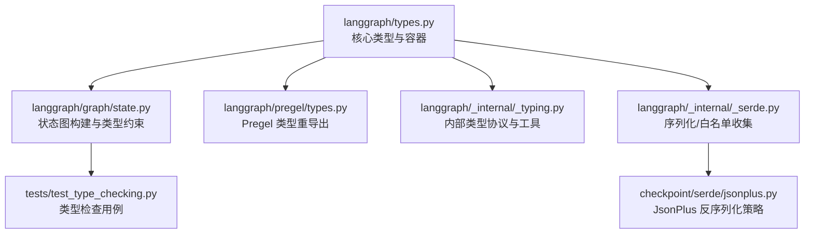
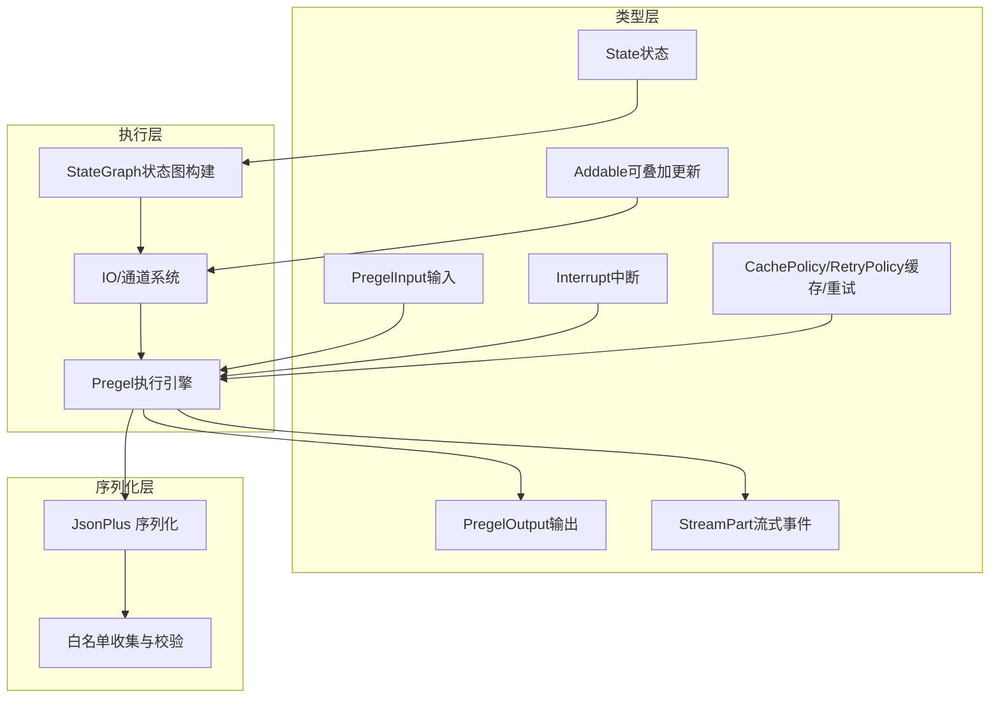
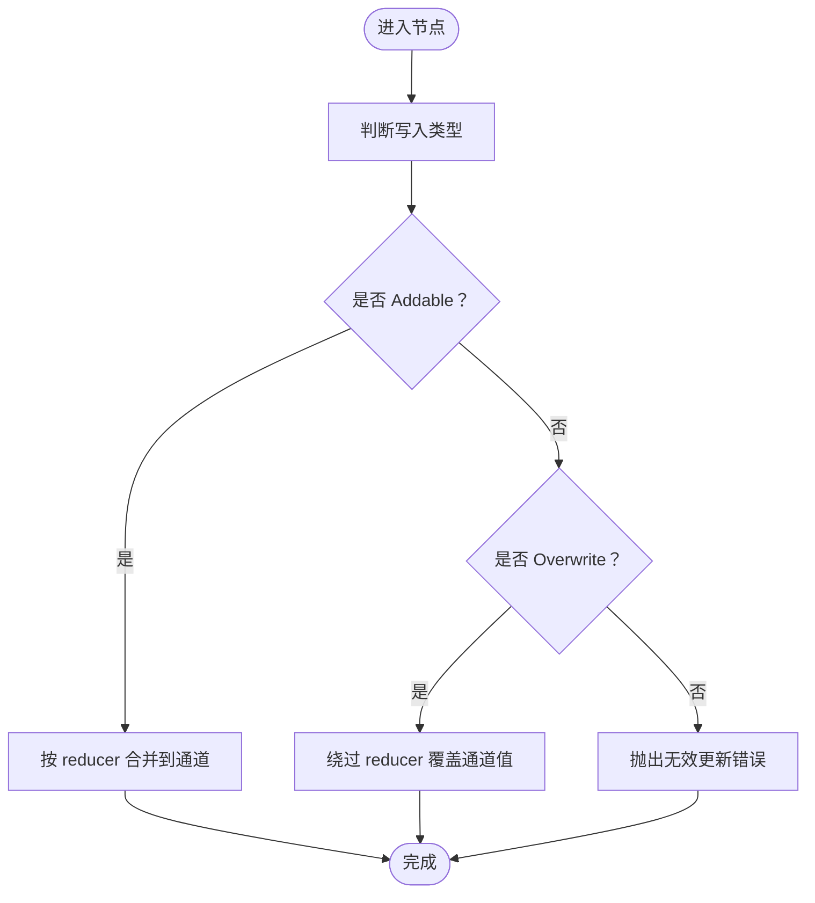
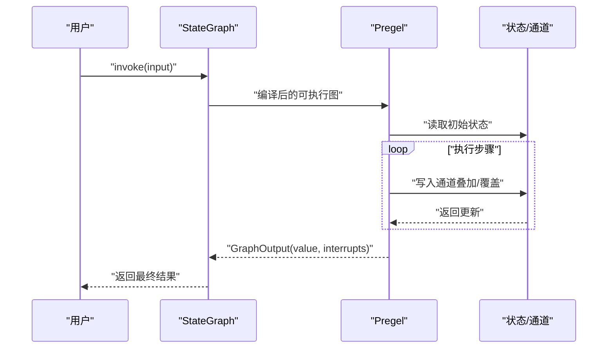
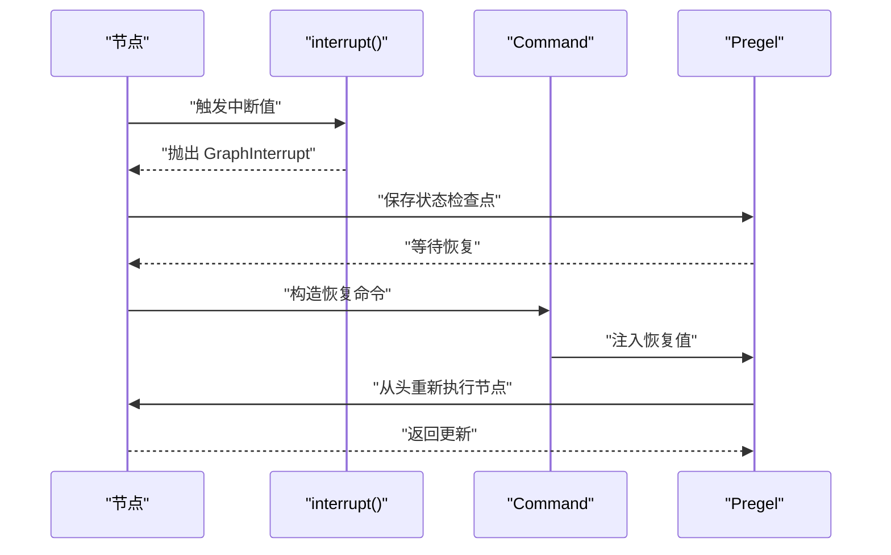
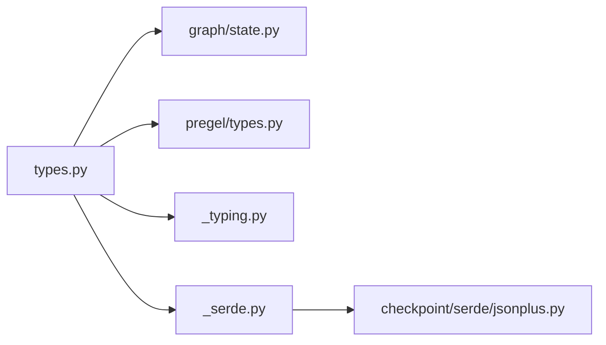

# 类型定义 API

<cite>
**本文引用的文件**
- [libs/langgraph/langgraph/types.py](file://libs/langgraph/langgraph/types.py)
- [libs/langgraph/langgraph/_internal/_typing.py](file://libs/langgraph/langgraph/_internal/_typing.py)
- [libs/langgraph/langgraph/pregel/types.py](file://libs/langgraph/langgraph/pregel/types.py)
- [libs/langgraph/langgraph/graph/state.py](file://libs/langgraph/langgraph/graph/state.py)
- [libs/langgraph/langgraph/_internal/_serde.py](file://libs/langgraph/langgraph/_internal/_serde.py)
- [libs/checkpoint/langgraph/checkpoint/serde/jsonplus.py](file://libs/checkpoint/langgraph/checkpoint/serde/jsonplus.py)
- [libs/langgraph/tests/test_type_checking.py](file://libs/langgraph/tests/test_type_checking.py)
</cite>

## 目录
1. [简介](#简介)
2. [项目结构](#项目结构)
3. [核心组件](#核心组件)
4. [架构总览](#架构总览)
5. [详细组件分析](#详细组件分析)
6. [依赖分析](#依赖分析)
7. [性能考量](#性能考量)
8. [故障排查指南](#故障排查指南)
9. [结论](#结论)
10. [附录](#附录)

## 简介
本文件系统性梳理 LangGraph 中与“类型定义”相关的核心 API，重点覆盖状态与执行流的关键类型：State（状态）、Addable（可叠加更新）、PregelInput（Pregel 输入）、PregelOutput（Pregel 输出）等。我们将从类型定义、字段约束、使用场景、最佳实践、错误处理、验证与序列化/反序列化流程，以及自定义扩展与兼容性等方面进行深入说明。

## 项目结构
LangGraph 的类型定义主要分布在以下模块：
- 核心类型定义：langgraph/types.py
- 内部类型工具：langgraph/_internal/_typing.py
- Pregel 类型重导出：langgraph/pregel/types.py
- 状态图构建与类型约束：langgraph/graph/state.py
- 序列化/反序列化与白名单：langgraph/_internal/_serde.py、checkpoint/serde/jsonplus.py
- 类型检查测试：tests/test_type_checking.py



图表来源
- [libs/langgraph/langgraph/types.py:1-873](file://libs/langgraph/langgraph/types.py#L1-L873)
- [libs/langgraph/langgraph/graph/state.py:115-800](file://libs/langgraph/langgraph/graph/state.py#L115-L800)
- [libs/langgraph/langgraph/pregel/types.py:1-39](file://libs/langgraph/langgraph/pregel/types.py#L1-L39)
- [libs/langgraph/langgraph/_internal/_typing.py:1-55](file://libs/langgraph/langgraph/_internal/_typing.py#L1-L55)
- [libs/langgraph/langgraph/_internal/_serde.py:1-254](file://libs/langgraph/langgraph/_internal/_serde.py#L1-L254)
- [libs/checkpoint/langgraph/checkpoint/serde/jsonplus.py:112-241](file://libs/checkpoint/langgraph/checkpoint/serde/jsonplus.py#L112-L241)
- [libs/langgraph/tests/test_type_checking.py:1-162](file://libs/langgraph/tests/test_type_checking.py#L1-L162)

章节来源
- [libs/langgraph/langgraph/types.py:1-873](file://libs/langgraph/langgraph/types.py#L1-L873)
- [libs/langgraph/langgraph/graph/state.py:115-800](file://libs/langgraph/langgraph/graph/state.py#L115-L800)
- [libs/langgraph/langgraph/pregel/types.py:1-39](file://libs/langgraph/langgraph/pregel/types.py#L1-L39)
- [libs/langgraph/langgraph/_internal/_typing.py:1-55](file://libs/langgraph/langgraph/_internal/_typing.py#L1-L55)
- [libs/langgraph/langgraph/_internal/_serde.py:1-254](file://libs/langgraph/langgraph/_internal/_serde.py#L1-L254)
- [libs/checkpoint/langgraph/checkpoint/serde/jsonplus.py:112-241](file://libs/checkpoint/langgraph/checkpoint/serde/jsonplus.py#L112-L241)
- [libs/langgraph/tests/test_type_checking.py:1-162](file://libs/langgraph/tests/test_type_checking.py#L1-L162)

## 核心组件
本节聚焦 LangGraph 中与“类型定义”直接相关的核心类型与容器，涵盖状态、输入输出、流式事件、任务与中断等。

- State（状态）
  - 定义：State 是状态图中节点间共享的数据结构，支持 TypedDict、dataclass、Pydantic BaseModel 三种形态。
  - 约束与验证：通过内部协议与工具类对状态形态进行识别与校验；在构建状态图时会对输入/输出 schema 进行约束检查。
  - 使用场景：作为节点函数签名的第一个参数，用于读写共享状态；也可作为输入/输出 schema 指定更严格的类型边界。
  - 复杂度：状态读写通常为 O(k)，k 为状态键数量；聚合器（reducer）在多节点写入时按通道维度进行合并。
  - 兼容性：支持 Annotated 形式的字段与 reducer 函数；支持只读字段标记（ReadOnly）等高级注解。

- Addable（可叠加更新）
  - 定义：用于在通道上以“叠加/合并”的方式更新状态值，典型场景是列表、集合等可合并类型。
  - 约束：当同一超步（super-step）内对同一通道出现多个 Overwrite 写入时会触发错误；避免重复覆盖导致的不确定性。
  - 使用场景：在需要累积结果（如消息列表、计数器）时使用；若需完全替换则使用 Overwrite。
  - 最佳实践：优先使用 Annotated[...] 指定 reducer，确保并发写入的一致性与可预测性。

- PregelInput（Pregel 输入）
  - 定义：Pregel 执行的输入类型，支持多种形式：普通字典、命令对象（Command）、空值等。
  - 约束：当传入命令对象时，内部会解析其 update/resume/goto 等字段并应用到当前任务或子图。
  - 使用场景：在流式执行与异步调用中，作为 invoke/astream 的输入；支持人类中断恢复（resume）与动态路由（goto）。
  - 错误处理：若命令格式不合法或与当前上下文不匹配，将抛出相应异常并记录日志。

- PregelOutput（Pregel 输出）
  - 定义：Pregel 执行的输出类型，v2 版本返回 GraphOutput，包含最终值与可能发生的中断列表。
  - 约束：输出值可以是任意类型（字典、Pydantic 模型、dataclass 等），但必须与声明的输出 schema 兼容。
  - 使用场景：在同步调用（invoke）后获取最终结果；在流式调用（stream/astream）中，输出以流式事件的形式逐步返回。
  - 兼容性：提供向后兼容访问方式（如通过键访问中断），但建议使用显式属性访问。

- 流式事件与任务
  - StreamMode：values/updates/messages/custom/checkpoints/tasks/debug 等模式，分别对应不同粒度的输出。
  - StreamPart：流式事件的判别联合类型，通过 type 字段区分具体事件类型。
  - TaskPayload/TaskResultPayload：任务开始与结果事件的数据载体。
  - CheckpointPayload/StateSnapshot：检查点与状态快照，包含配置、元数据、下一节点、任务列表等。
  - Interrupt：中断信息，携带可恢复的值与唯一标识符。

- 缓存与重试
  - CachePolicy：缓存键生成函数与 TTL 配置。
  - RetryPolicy：重试间隔、退避因子、最大间隔、最大尝试次数与异常过滤策略。

章节来源
- [libs/langgraph/langgraph/types.py:118-132](file://libs/langgraph/langgraph/types.py#L118-L132)
- [libs/langgraph/langgraph/types.py:356-400](file://libs/langgraph/langgraph/types.py#L356-L400)
- [libs/langgraph/langgraph/types.py:502-572](file://libs/langgraph/langgraph/types.py#L502-L572)
- [libs/langgraph/langgraph/types.py:574-647](file://libs/langgraph/langgraph/types.py#L574-L647)
- [libs/langgraph/langgraph/types.py:652-703](file://libs/langgraph/langgraph/types.py#L652-L703)
- [libs/langgraph/langgraph/types.py:705-828](file://libs/langgraph/langgraph/types.py#L705-L828)
- [libs/langgraph/langgraph/types.py:831-873](file://libs/langgraph/langgraph/types.py#L831-L873)

## 架构总览
下图展示类型定义在 LangGraph 中的高层交互关系：状态图构建器（StateGraph）基于状态类型推导通道与管理值；Pregel 执行引擎消费输入（PregelInput）并产生输出（PregelOutput）；流式事件通过 StreamPart 分发；序列化/反序列化通过 JsonPlus 与白名单机制保障安全。



图表来源
- [libs/langgraph/langgraph/types.py:115-873](file://libs/langgraph/langgraph/types.py#L115-L873)
- [libs/langgraph/langgraph/graph/state.py:115-800](file://libs/langgraph/langgraph/graph/state.py#L115-L800)
- [libs/langgraph/langgraph/_internal/_serde.py:87-254](file://libs/langgraph/langgraph/_internal/_serde.py#L87-L254)
- [libs/checkpoint/langgraph/checkpoint/serde/jsonplus.py:112-241](file://libs/checkpoint/langgraph/checkpoint/serde/jsonplus.py#L112-L241)

## 详细组件分析

### 状态类型（State）与形态
- 支持形态
  - TypedDict（含 Required/NotRequired/ReadOnly 注解）
  - dataclass
  - Pydantic BaseModel
- 关键工具
  - StateLike 协议：统一识别状态形态，便于在类型检查与运行时进行一致性处理。
  - 字段默认值与只读检测：根据注解与默认值确定字段行为，保证更新语义清晰。
- 使用建议
  - 明确指定 reducer（Annotated[T, operator.add] 等）以确保并发写入的可预测性。
  - 对于输入/输出 schema，遵循协变/逆变原则，避免类型不兼容。

```mermaid
classDiagram
class StateLike {
<<TypeAlias>>
"统一状态形态：TypedDict/V2 | TypedDict/V1 | Dataclass | BaseModel"
}
class TypedDictLikeV1 {
"__required_keys__ : ClassVar[frozenset]"
"__optional_keys__ : ClassVar[frozenset]"
}
class TypedDictLikeV2 {
"__required_keys__ : frozenset"
"__optional_keys__ : frozenset"
}
class DataclassLike {
"__dataclass_fields__ : ClassVar[dict]"
}
class BaseModel {
<<Pydantic>>
}
StateLike <|.. TypedDictLikeV1
StateLike <|.. TypedDictLikeV2
StateLike <|.. DataclassLike
StateLike <|.. BaseModel
```

图表来源
- [libs/langgraph/langgraph/_internal/_typing.py:12-43](file://libs/langgraph/langgraph/_internal/_typing.py#L12-L43)

章节来源
- [libs/langgraph/langgraph/_internal/_typing.py:12-43](file://libs/langgraph/langgraph/_internal/_typing.py#L12-L43)
- [libs/langgraph/langgraph/_internal/_fields.py:40-193](file://libs/langgraph/langgraph/_internal/_fields.py#L40-L193)
- [libs/langgraph/tests/test_type_checking.py:14-162](file://libs/langgraph/tests/test_type_checking.py#L14-L162)

### 可叠加更新（Addable）与覆盖写入（Overwrite）
- Addable
  - 用于在通道上进行“叠加/合并”，适合列表、集合等可合并类型。
  - 在同一超步内对同一通道多次叠加写入会被拒绝，防止竞态与不可预期结果。
- Overwrite
  - 用于绕过 reducer，直接覆盖通道值，适用于需要完全替换的场景。
  - 提供明确的错误提示，避免重复覆盖导致的状态不一致。



图表来源
- [libs/langgraph/langgraph/types.py:831-873](file://libs/langgraph/langgraph/types.py#L831-L873)

章节来源
- [libs/langgraph/langgraph/types.py:831-873](file://libs/langgraph/langgraph/types.py#L831-L873)

### Pregel 输入与输出（PregelInput/PregelOutput）
- PregelInput
  - 支持：普通字典、命令对象（Command）、空值等。
  - 命令对象包含 update/resume/goto 等字段，用于动态更新状态、恢复中断与路由到目标节点。
- PregelOutput（v2）
  - 返回 GraphOutput，包含最终值与可能发生的中断列表。
  - 提供向后兼容访问方式，但建议使用显式属性访问。



图表来源
- [libs/langgraph/langgraph/types.py:356-400](file://libs/langgraph/langgraph/types.py#L356-L400)
- [libs/langgraph/langgraph/graph/state.py:115-800](file://libs/langgraph/langgraph/graph/state.py#L115-L800)

章节来源
- [libs/langgraph/langgraph/types.py:356-400](file://libs/langgraph/langgraph/types.py#L356-L400)
- [libs/langgraph/langgraph/graph/state.py:115-800](file://libs/langgraph/langgraph/graph/state.py#L115-L800)

### 流式事件与调试（StreamMode/StreamPart/Debug）
- StreamMode
  - values：每次步骤后返回完整状态。
  - updates：仅返回节点名与输出映射。
  - messages：逐令牌返回 LLM 消息与元数据。
  - custom：由节点通过 StreamWriter 自定义输出。
  - checkpoints：返回检查点事件。
  - tasks：返回任务开始与结果事件。
  - debug：同时包含 checkpoints 与 tasks。
- StreamPart
  - 通过 type 字段判别事件类型，data 字段承载具体数据。
- DebugPayload
  - 包装检查点与任务事件，便于调试与可观测性。

```mermaid
classDiagram
class StreamMode {
<<Literal>>
"values | updates | messages | custom | checkpoints | tasks | debug"
}
class StreamPart {
<<TypeAlias>>
"ValuesStreamPart | UpdatesStreamPart | MessagesStreamPart | CustomStreamPart | CheckpointStreamPart | TasksStreamPart | DebugStreamPart"
}
class ValuesStreamPart {
"type : Literal['values']"
"ns : tuple[str, ...]"
"data : OutputT"
"interrupts : tuple[Interrupt, ...]"
}
class UpdatesStreamPart {
"type : Literal['updates']"
"ns : tuple[str, ...]"
"data : dict[str, Any]"
}
class MessagesStreamPart {
"type : Literal['messages']"
"ns : tuple[str, ...]"
"data : tuple[AnyMessage, dict[str, Any]]"
}
class CustomStreamPart {
"type : Literal['custom']"
"ns : tuple[str, ...]"
"data : Any"
}
class CheckpointStreamPart {
"type : Literal['checkpoints']"
"ns : tuple[str, ...]"
"data : CheckpointPayload[StateT]"
}
class TasksStreamPart {
"type : Literal['tasks']"
"data : TaskPayload | TaskResultPayload"
}
class DebugStreamPart {
"type : Literal['debug']"
"ns : tuple[str, ...]"
"data : DebugPayload[StateT]"
}
StreamPart <|.. ValuesStreamPart
StreamPart <|.. UpdatesStreamPart
StreamPart <|.. MessagesStreamPart
StreamPart <|.. CustomStreamPart
StreamPart <|.. CheckpointStreamPart
StreamPart <|.. TasksStreamPart
StreamPart <|.. DebugStreamPart
```

图表来源
- [libs/langgraph/langgraph/types.py:118-132](file://libs/langgraph/langgraph/types.py#L118-L132)
- [libs/langgraph/langgraph/types.py:250-354](file://libs/langgraph/langgraph/types.py#L250-L354)

章节来源
- [libs/langgraph/langgraph/types.py:118-132](file://libs/langgraph/langgraph/types.py#L118-L132)
- [libs/langgraph/langgraph/types.py:250-354](file://libs/langgraph/langgraph/types.py#L250-L354)

### 中断与命令（Interrupt/Command）
- Interrupt
  - 表示节点执行期间产生的可恢复中断，包含值与唯一标识符。
  - 支持从命名空间派生 ID，便于精确恢复。
- Command
  - 用于在运行时动态更新状态、恢复中断或跳转到目标节点。
  - 支持 update、resume、goto 等字段，满足复杂控制流需求。
- interrupt() 函数
  - 在节点内抛出 GraphInterrupt 异常，暂停执行并将中断值传递给客户端。
  - 客户端通过 Command 恢复执行，图会从节点起始处重新执行。



图表来源
- [libs/langgraph/langgraph/types.py:444-500](file://libs/langgraph/langgraph/types.py#L444-L500)
- [libs/langgraph/langgraph/types.py:652-703](file://libs/langgraph/langgraph/types.py#L652-L703)
- [libs/langgraph/langgraph/types.py:705-828](file://libs/langgraph/langgraph/types.py#L705-L828)

章节来源
- [libs/langgraph/langgraph/types.py:444-500](file://libs/langgraph/langgraph/types.py#L444-L500)
- [libs/langgraph/langgraph/types.py:652-703](file://libs/langgraph/langgraph/types.py#L652-L703)
- [libs/langgraph/langgraph/types.py:705-828](file://libs/langgraph/langgraph/types.py#L705-L828)

### 缓存与重试（CachePolicy/RetryPolicy）
- CachePolicy
  - key_func：默认使用哈希函数生成缓存键。
  - ttl：缓存项过期时间（秒），None 表示永不过期。
- RetryPolicy
  - 初始间隔、退避因子、最大间隔、最大尝试次数、抖动开关与异常过滤策略。
  - 默认异常过滤策略可按需覆盖。

```mermaid
classDiagram
class CachePolicy {
"+key_func : Callable[..., str|bytes]"
"+ttl : int | None"
}
class RetryPolicy {
"+initial_interval : float"
"+backoff_factor : float"
"+max_interval : float"
"+max_attempts : int"
"+jitter : bool"
"+retry_on : type|Sequence|Callable"
}
```

图表来源
- [libs/langgraph/langgraph/types.py:404-424](file://libs/langgraph/langgraph/types.py#L404-L424)
- [libs/langgraph/langgraph/types.py:429-440](file://libs/langgraph/langgraph/types.py#L429-L440)

章节来源
- [libs/langgraph/langgraph/types.py:404-424](file://libs/langgraph/langgraph/types.py#L404-L424)
- [libs/langgraph/langgraph/types.py:429-440](file://libs/langgraph/langgraph/types.py#L429-L440)

## 依赖分析
- 类型层依赖
  - StateGraph 依赖状态类型（TypedDict/dataclass/BaseModel）与通道系统，确保节点间共享状态的类型安全。
  - PregelInput/PregelOutput 依赖命令对象（Command）与流式事件（StreamPart）实现灵活的执行与输出。
- 序列化依赖
  - JsonPlusSerializer 通过白名单机制限制可反序列化的构造器，避免任意代码执行风险。
  - 白名单收集器遍历类型定义、通道值类型与更新类型，自动汇总允许的符号集合。



图表来源
- [libs/langgraph/langgraph/types.py:1-873](file://libs/langgraph/langgraph/types.py#L1-L873)
- [libs/langgraph/langgraph/graph/state.py:115-800](file://libs/langgraph/langgraph/graph/state.py#L115-L800)
- [libs/langgraph/langgraph/pregel/types.py:1-39](file://libs/langgraph/langgraph/pregel/types.py#L1-L39)
- [libs/langgraph/langgraph/_internal/_typing.py:1-55](file://libs/langgraph/langgraph/_internal/_typing.py#L1-L55)
- [libs/langgraph/langgraph/_internal/_serde.py:87-254](file://libs/langgraph/langgraph/_internal/_serde.py#L87-L254)
- [libs/checkpoint/langgraph/checkpoint/serde/jsonplus.py:112-241](file://libs/checkpoint/langgraph/checkpoint/serde/jsonplus.py#L112-L241)

章节来源
- [libs/langgraph/langgraph/types.py:1-873](file://libs/langgraph/langgraph/types.py#L1-L873)
- [libs/langgraph/langgraph/_internal/_serde.py:87-254](file://libs/langgraph/langgraph/_internal/_serde.py#L87-L254)
- [libs/checkpoint/langgraph/checkpoint/serde/jsonplus.py:112-241](file://libs/checkpoint/langgraph/checkpoint/serde/jsonplus.py#L112-L241)

## 性能考量
- 类型检查与推导
  - 使用协议与弱引用缓存减少重复计算；对 Pydantic/Basemodel 的字段类型提取采用安全回退策略。
- 序列化性能
  - 优先使用 msgpack，失败时再回退到 pickle；通过白名单避免不必要的导入开销。
- 并发写入
  - 通过 reducer 与覆盖写入的严格约束，避免锁竞争与竞态条件，提升吞吐量。

## 故障排查指南
- 类型不兼容
  - 当输入/输出 schema 与节点签名不匹配时，构建阶段会报错；请遵循协变/逆变原则，确保类型兼容。
- 重复覆盖错误
  - 同一超步内对同一通道多次 Overwrite 会触发错误；请使用 Addable 或调整写入策略。
- 中断恢复
  - 若中断值未正确注入，检查 Command 的 resume 字段与中断顺序；确认检查点已启用。
- 反序列化受限
  - 若反序列化失败，请检查 JsonPlusSerializer 的 allowed_json_modules 白名单配置，确保所需符号被显式允许。

章节来源
- [libs/langgraph/tests/test_type_checking.py:14-162](file://libs/langgraph/tests/test_type_checking.py#L14-L162)
- [libs/checkpoint/langgraph/checkpoint/serde/jsonplus.py:192-226](file://libs/checkpoint/langgraph/checkpoint/serde/jsonplus.py#L192-L226)

## 结论
LangGraph 的类型定义 API 通过统一的状态形态、严格的更新约束与灵活的流式输出，为构建复杂、可观测且可维护的状态机提供了坚实基础。配合序列化白名单与命令式控制（中断/恢复/路由），开发者可以在保证安全性的同时实现高度动态的工作流。

## 附录
- 最佳实践清单
  - 明确标注 reducer，避免隐式状态合并。
  - 使用 Command 精细控制状态更新与节点路由。
  - 启用检查点以支持中断与恢复。
  - 为序列化配置白名单，确保安全与可维护性。
- 常见错误与修复
  - 类型不匹配：修正输入/输出 schema 或节点签名。
  - 重复覆盖：改为 Addable 或在单一步骤内合并写入。
  - 反序列化失败：添加所需符号到白名单。