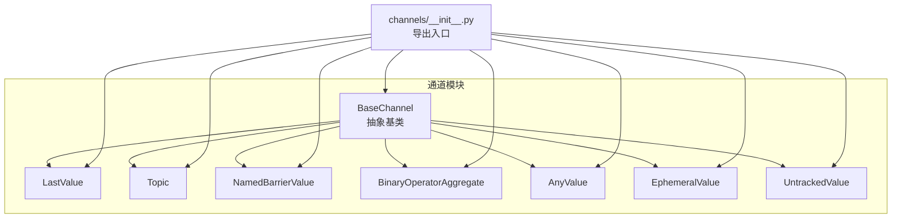
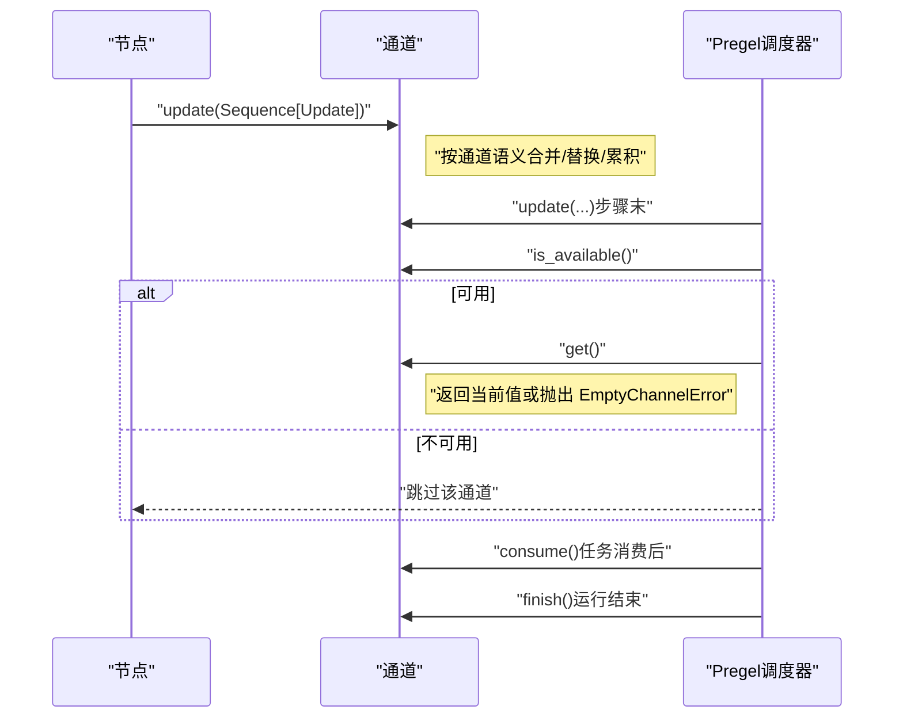
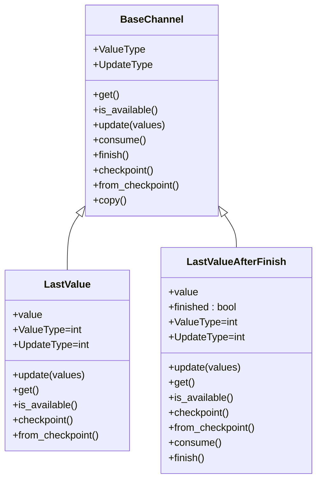
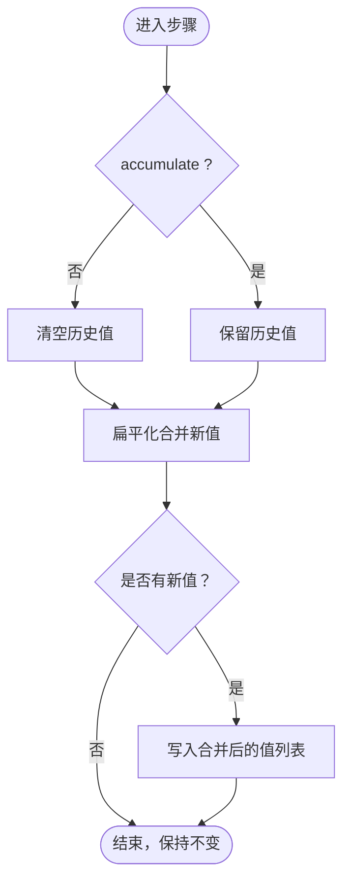
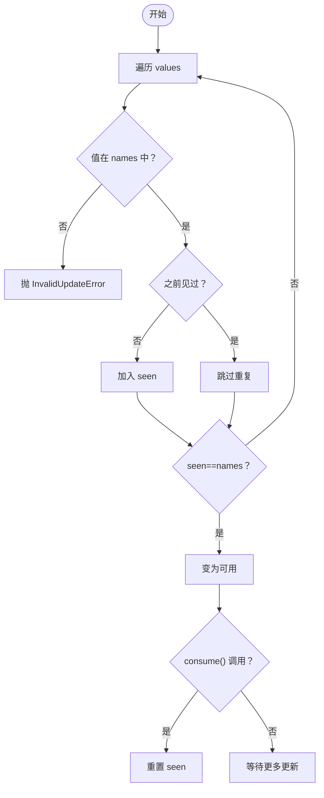
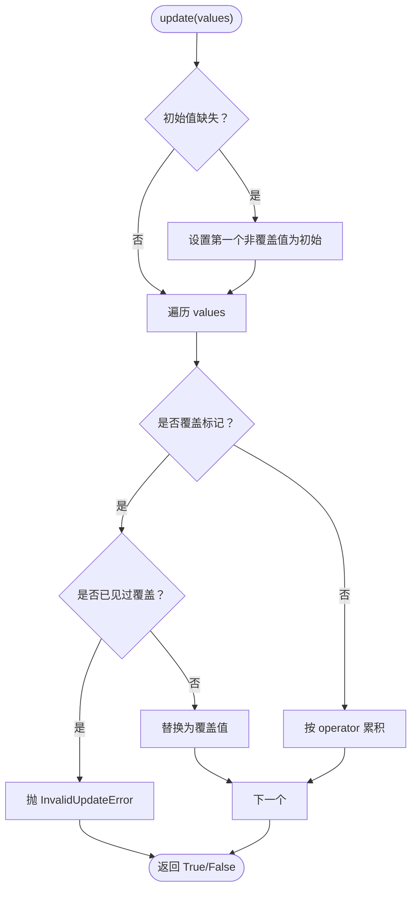
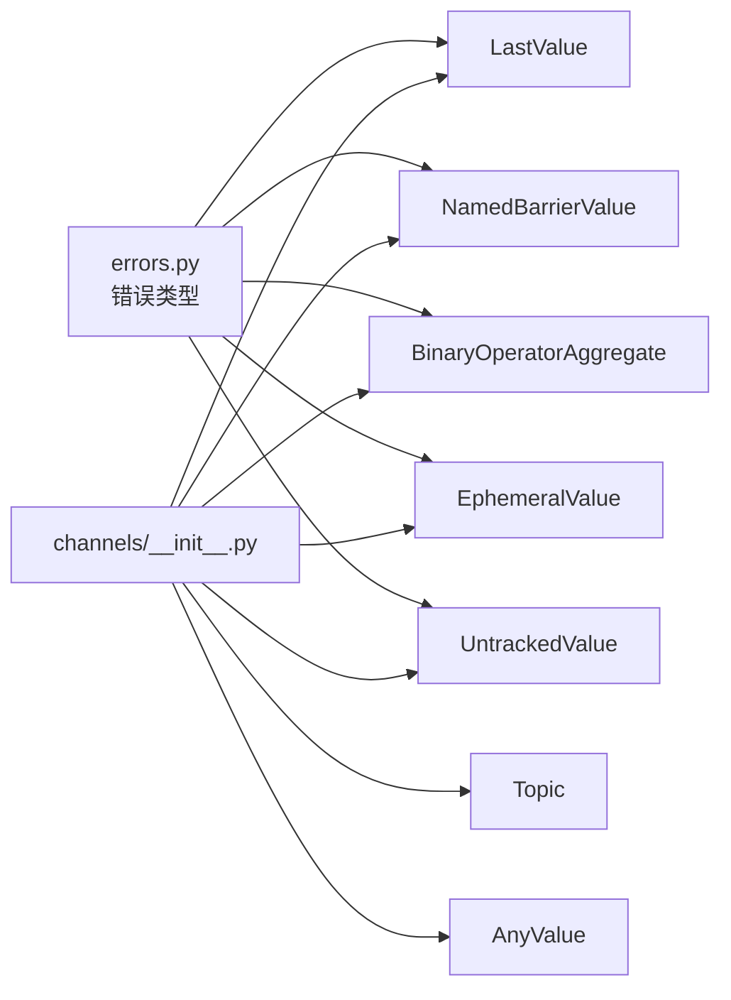

# 通道系统 API

<cite>
**本文引用的文件**
- [channels/base.py](file://libs/langgraph/langgraph/channels/base.py)
- [channels/last_value.py](file://libs/langgraph/langgraph/channels/last_value.py)
- [channels/topic.py](file://libs/langgraph/langgraph/channels/topic.py)
- [channels/named_barrier_value.py](file://libs/langgraph/langgraph/channels/named_barrier_value.py)
- [channels/binop.py](file://libs/langgraph/langgraph/channels/binop.py)
- [channels/any_value.py](file://libs/langgraph/langgraph/channels/any_value.py)
- [channels/ephemeral_value.py](file://libs/langgraph/langgraph/channels/ephemeral_value.py)
- [channels/untracked_value.py](file://libs/langgraph/langgraph/channels/untracked_value.py)
- [channels/__init__.py](file://libs/langgraph/langgraph/channels/__init__.py)
- [errors.py](file://libs/langgraph/langgraph/errors.py)
- [test_channels.py](file://libs/langgraph/tests/test_channels.py)
</cite>

## 目录
1. [简介](#简介)
2. [项目结构](#项目结构)
3. [核心组件](#核心组件)
4. [架构总览](#架构总览)
5. [详细组件分析](#详细组件分析)
6. [依赖关系分析](#依赖关系分析)
7. [性能考量](#性能考量)
8. [故障排查指南](#故障排查指南)
9. [结论](#结论)
10. [附录：自定义通道实现与最佳实践](#附录自定义通道实现与最佳实践)

## 简介
本文件系统性梳理通道（Channel）子系统的公共 API，覆盖基础抽象与多种具体通道类型：LastValue、Topic、NamedBarrierValue、BinaryOperatorAggregate、AnyValue、EphemeralValue、UntrackedValue，并给出方法语义、数据处理逻辑、使用场景、组合与并发安全注意事项、注册与配置建议以及调试要点。目标是帮助开发者在 LangGraph 的 Pregel 执行模型中正确选择与扩展通道。

## 项目结构
通道相关代码集中在 langgraph/channels 目录，统一通过 channels/__init__.py 暴露给上层使用；错误类型由 langgraph/errors 提供。

图表来源
- [channels/__init__.py:1-28](file://libs/langgraph/langgraph/channels/__init__.py#L1-L28)
- [channels/base.py:19-122](file://libs/langgraph/langgraph/channels/base.py#L19-L122)
- [channels/last_value.py:20-152](file://libs/langgraph/langgraph/channels/last_value.py#L20-L152)
- [channels/topic.py:23-95](file://libs/langgraph/langgraph/channels/topic.py#L23-L95)
- [channels/named_barrier_value.py:13-168](file://libs/langgraph/langgraph/channels/named_barrier_value.py#L13-L168)
- [channels/binop.py:41-135](file://libs/langgraph/langgraph/channels/binop.py#L41-L135)
- [channels/any_value.py:15-73](file://libs/langgraph/langgraph/channels/any_value.py#L15-L73)
- [channels/ephemeral_value.py:15-80](file://libs/langgraph/langgraph/channels/ephemeral_value.py#L15-L80)
- [channels/untracked_value.py:15-74](file://libs/langgraph/langgraph/channels/untracked_value.py#L15-L74)

章节来源
- [channels/__init__.py:1-28](file://libs/langgraph/langgraph/channels/__init__.py#L1-L28)

## 核心组件
- BaseChannel 抽象基类：定义通道的通用契约，包括类型参数（值类型、更新类型、检查点类型）、序列化/反序列化、读写接口、可用性判断、消费与结束通知等。
- 具体通道：围绕不同数据流语义实现 BaseChannel，如仅保留最新值、主题订阅式收集、命名屏障汇聚、二元运算聚合、易失值、未跟踪值等。

章节来源
- [channels/base.py:19-122](file://libs/langgraph/langgraph/channels/base.py#L19-L122)

## 架构总览
通道在 Pregel 执行周期中的角色：节点在每步将更新写入通道，Pregel 在步骤末调用各通道的 update 聚合；读取时通过 get/is_available 获取当前可用值；finish/consume 可用于生命周期控制（如仅在运行结束才暴露值）。

图表来源
- [channels/base.py:69-122](file://libs/langgraph/langgraph/channels/base.py#L69-L122)
- [channels/last_value.py:56-152](file://libs/langgraph/langgraph/channels/last_value.py#L56-L152)
- [channels/topic.py:77-95](file://libs/langgraph/langgraph/channels/topic.py#L77-L95)
- [channels/named_barrier_value.py:56-168](file://libs/langgraph/langgraph/channels/named_barrier_value.py#L56-L168)
- [channels/binop.py:102-135](file://libs/langgraph/langgraph/channels/binop.py#L102-L135)

## 详细组件分析

### BaseChannel 抽象基类
- 类型参数
  - ValueType：通道存储的值类型
  - UpdateType：通道接收的更新类型
  - Checkpoint：可序列化的检查点状态
- 关键方法
  - get()：读取当前值，空通道抛 EmptyChannelError
  - is_available()：高效判断是否可用，默认基于 get 封装
  - update(values)：以无序序列合并更新，返回是否变更
  - consume()：订阅任务执行后的副作用（默认无）
  - finish()：运行结束通知（默认无）
  - checkpoint()/from_checkpoint()：序列化/恢复状态
  - copy()：默认委托 checkpoint/from_checkpoint
- 并发与一致性
  - update 接收的更新序列顺序任意，通道内部需保证幂等与一致性
  - is_available 建议子类重写以避免昂贵的 get+异常路径

章节来源
- [channels/base.py:19-122](file://libs/langgraph/langgraph/channels/base.py#L19-L122)

### LastValue 与 LastValueAfterFinish
- LastValue
  - 语义：每步最多接收一个更新，保留最近一次值
  - update 约束：多于一个更新会触发 InvalidUpdateError
  - checkpoint 返回当前值；空通道返回 MISSING
- LastValueAfterFinish
  - 语义：值仅在 finish() 后可用，消费后清空
  - finish() 将 finished 置位；consume() 清理并允许再次消费
  - get() 仅在 finished 且有值时可用

图表来源
- [channels/base.py:19-122](file://libs/langgraph/langgraph/channels/base.py#L19-L122)
- [channels/last_value.py:20-152](file://libs/langgraph/langgraph/channels/last_value.py#L20-L152)

章节来源
- [channels/last_value.py:20-152](file://libs/langgraph/langgraph/channels/last_value.py#L20-L152)
- [errors.py:68-77](file://libs/langgraph/langgraph/errors.py#L68-L77)

### Topic（主题/发布订阅）
- 语义：收集多源推送的值，支持“累积”或“每步清空”
- 关键行为
  - update(values)：扁平化处理列表与标量；若非累积，先清空再追加
  - get()：返回当前值列表，空则抛 EmptyChannelError
  - is_available()：存在值即可用
- 使用场景：广播消息、多分支汇聚、事件队列

图表来源
- [channels/topic.py:15-95](file://libs/langgraph/langgraph/channels/topic.py#L15-L95)

章节来源
- [channels/topic.py:23-95](file://libs/langgraph/langgraph/channels/topic.py#L23-L95)

### NamedBarrierValue 与 NamedBarrierValueAfterFinish
- 语义：等待一组命名值全部到达后才可用；AfterFinish 版本需在 finish() 后才可用
- 关键行为
  - update(values)：仅接受在构造时声明的 names 集合内的值，否则抛 InvalidUpdateError
  - get()：未齐备时抛 EmptyChannelError
  - consume()：齐备后可消费并重置 seen
  - finish()：齐备后标记完成，AfterFinish 版本在 finish() 后才可用

图表来源
- [channels/named_barrier_value.py:56-168](file://libs/langgraph/langgraph/channels/named_barrier_value.py#L56-L168)

章节来源
- [channels/named_barrier_value.py:13-168](file://libs/langgraph/langgraph/channels/named_barrier_value.py#L13-L168)
- [errors.py:68-77](file://libs/langgraph/langgraph/errors.py#L68-L77)

### BinaryOperatorAggregate
- 语义：对当前值与新值序列应用二元运算进行累积；支持“覆盖”语义（Overwrite）
- 关键行为
  - 初始化：根据类型参数构造初始值（特殊类型映射为具体容器）
  - update(values)：遇到覆盖标记只允许出现一次；否则按 operator 累积
  - get()：空通道抛 EmptyChannelError
  - checkpoint：返回当前累积值
- 使用场景：计数、拼接、集合运算、字典合并等

图表来源
- [channels/binop.py:102-135](file://libs/langgraph/langgraph/channels/binop.py#L102-L135)

章节来源
- [channels/binop.py:41-135](file://libs/langgraph/langgraph/channels/binop.py#L41-L135)
- [errors.py:68-77](file://libs/langgraph/langgraph/errors.py#L68-L77)

### AnyValue
- 语义：保留最后一次收到的值；假设同一步内多个值相等
- 行为特点：update([]) 可清空值；checkpoint 返回当前值；空通道 get 抛错

章节来源
- [channels/any_value.py:15-73](file://libs/langgraph/langgraph/channels/any_value.py#L15-L73)

### EphemeralValue
- 语义：仅保留“上一步”的值，一旦被读取即清空
- 行为特点：guard=True 时每步仅允许一个更新；否则抛 InvalidUpdateError；checkpoint 返回当前值

章节来源
- [channels/ephemeral_value.py:15-80](file://libs/langgraph/langgraph/channels/ephemeral_value.py#L15-L80)
- [errors.py:68-77](file://libs/langgraph/langgraph/errors.py#L68-L77)

### UntrackedValue
- 语义：保留最后一次收到的值，但不参与检查点（checkpoint 返回 MISSING）
- 行为特点：guard=True 时每步仅允许一个更新；否则抛 InvalidUpdateError；checkpoint 不持久化

章节来源
- [channels/untracked_value.py:15-74](file://libs/langgraph/langgraph/channels/untracked_value.py#L15-L74)
- [errors.py:68-77](file://libs/langgraph/langgraph/errors.py#L68-L77)

## 依赖关系分析
- 导出入口：channels/__init__.py 统一导出所有通道类型，便于上层按需导入
- 错误体系：InvalidUpdateError、EmptyChannelError 等由 errors.py 定义并在通道实现中抛出
- 类继承关系：所有具体通道均继承 BaseChannel，遵循统一的生命周期与契约

图表来源
- [channels/__init__.py:1-28](file://libs/langgraph/langgraph/channels/__init__.py#L1-L28)
- [errors.py:68-77](file://libs/langgraph/langgraph/errors.py#L68-L77)

章节来源
- [channels/__init__.py:1-28](file://libs/langgraph/langgraph/channels/__init__.py#L1-L28)
- [errors.py:15-27](file://libs/langgraph/langgraph/errors.py#L15-L27)

## 性能考量
- 读写复杂度
  - LastValue/AnyValue/UntrackedValue/EphemeralValue：单次更新与读取近似 O(1)
  - Topic：每次更新需扁平化与追加，整体 O(n)，n 为新增元素数
  - NamedBarrierValue：每次更新需集合操作，平均 O(k)，k 为传入值数量
  - BinaryOperatorAggregate：每次更新 O(m)，m 为传入值数量，受 operator 复杂度影响
- 内存占用
  - Topic 在 accumulate=True 时会累积历史值，注意配额与清理策略
  - NamedBarrierValue 维护 seen 集合，值域越大内存越高
  - BinaryOperatorAggregate 保存当前累积值，可能随输入增长
- 并发安全
  - BaseChannel.update 接收的更新序列顺序任意，实现应保证幂等与无竞态
  - consume/finish 生命周期回调应在单线程或受控并发下使用，避免竞态条件
- 序列化开销
  - checkpoint 仅适用于可序列化状态；UntrackedValue 显式不持久化

## 故障排查指南
- EmptyChannelError
  - 触发场景：通道为空却调用 get() 或 is_available() 误判
  - 排查要点：确认 update 是否被调用、是否被 Topic/EphemeralValue 清空、是否使用了 AfterFinish 语义
- InvalidUpdateError
  - 触发场景：LastValue 收到多个更新、NamedBarrierValue 收到不在 names 的值、EphemeralValue/UntrackedValue 在 guard=True 下收到多个值
  - 排查要点：检查节点返回值、Annotated 键的使用、通道构造参数
- 测试参考
  - 单元测试覆盖了典型行为与边界条件，可作为回归与验证的参考

章节来源
- [errors.py:68-77](file://libs/langgraph/langgraph/errors.py#L68-L77)
- [test_channels.py:16-120](file://libs/langgraph/tests/test_channels.py#L16-L120)

## 结论
通道系统通过统一的 BaseChannel 抽象，提供了从“最后值”、“主题汇聚”、“命名屏障”到“二元运算聚合”等多样化的数据流语义。合理选择与组合通道，可有效支撑复杂的多节点协作与状态管理。在生产环境中，建议关注并发安全、内存与序列化成本，并结合测试用例确保行为符合预期。

## 附录：自定义通道实现与最佳实践

### 自定义通道实现步骤
- 继承 BaseChannel 并指定类型参数
- 实现必需方法：ValueType、UpdateType、get、update、checkpoint、from_checkpoint
- 如需生命周期控制，实现 consume/finish
- 如需高效可用性判断，重写 is_available
- 保证幂等与线程安全；必要时引入锁或不可变数据结构

### 通道组合模式
- Topic + NamedBarrierValue：先广播汇聚，再等待齐备
- BinaryOperatorAggregate + LastValue：先累积，再暴露最终值
- EphemeralValue + Topic：仅保留上一步输入，避免状态泄漏

### 数据聚合策略
- 最后值覆盖：LastValue、AnyValue
- 列表累积：Topic（accumulate 可选）
- 集合/字典合并：BinaryOperatorAggregate（配合 operator）
- 屏障汇聚：NamedBarrierValue（命名集合）

### 并发安全性
- 更新序列顺序任意，实现必须可交换/幂等
- consume/finish 仅在单步或受控环境下调用
- 避免在 get/update 中进行阻塞操作

### 注册与配置
- 通过 channels/__init__.py 导出，便于统一导入
- 构造参数（如 Topic.accumulate、NamedBarrierValue.names、EphemeralValue.guard）决定行为
- 检查点：仅持久化支持 checkpoint 的通道；UntrackedValue 显式不持久化

### 调试建议
- 使用单元测试覆盖边界：空通道、多更新、屏障未齐备、覆盖冲突
- 记录关键事件：update/get/checkpoint/finsih/consume 的调用轨迹
- 对复杂通道（Topic/NamedBarrierValue/BinaryOperatorAggregate）打印中间状态