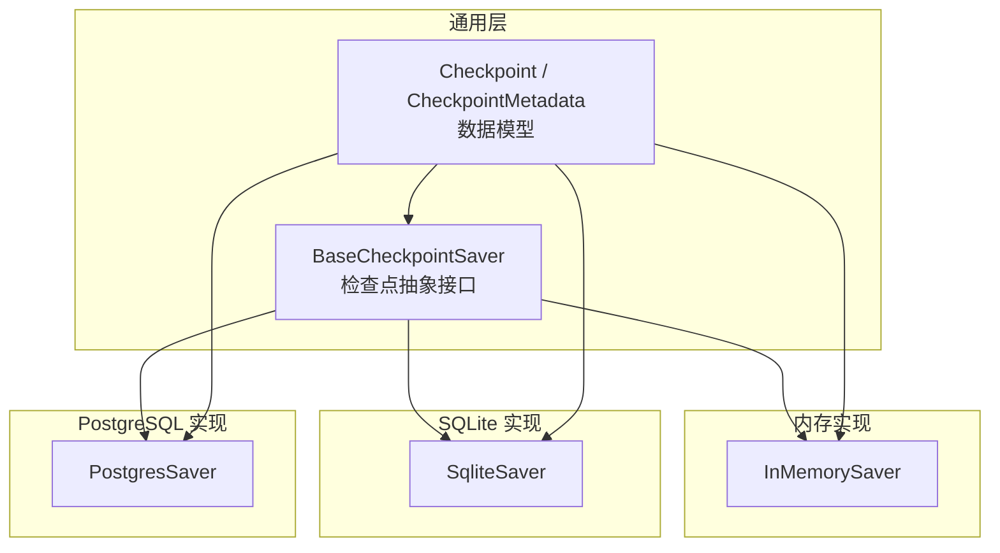
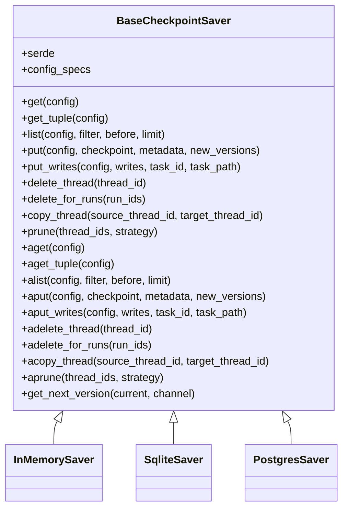
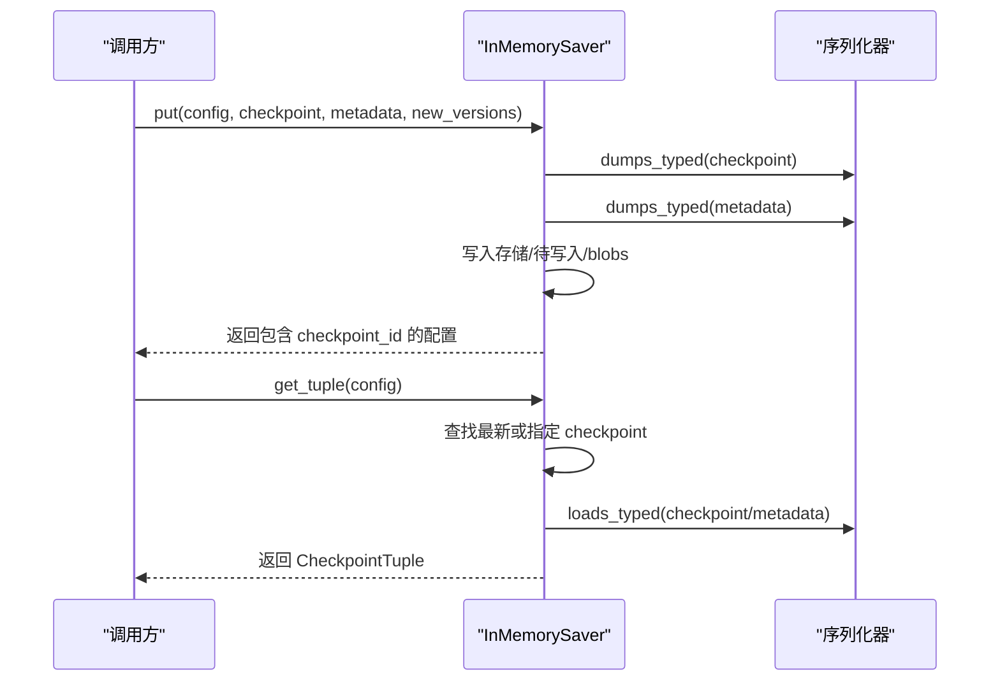
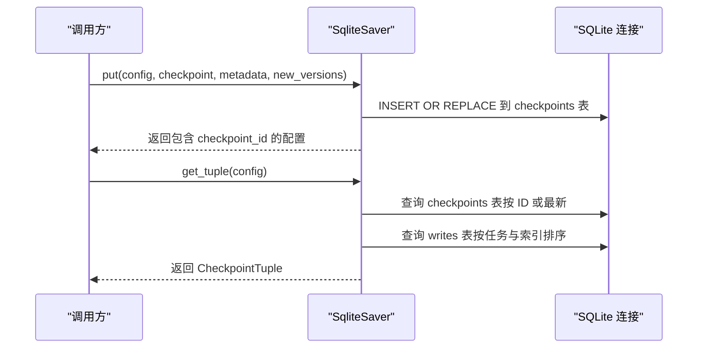
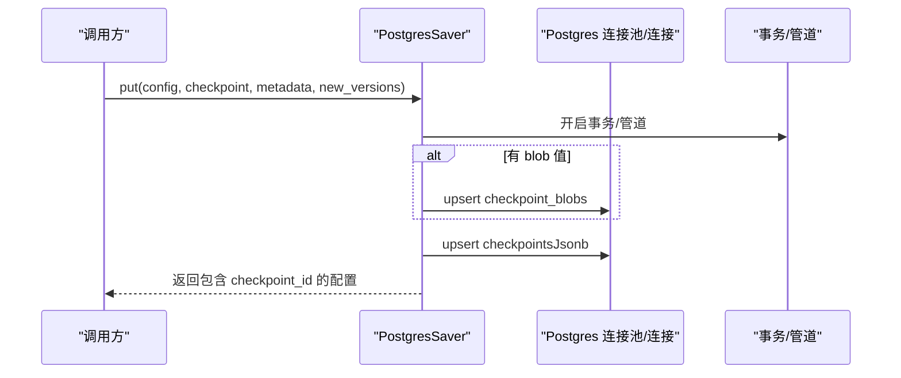
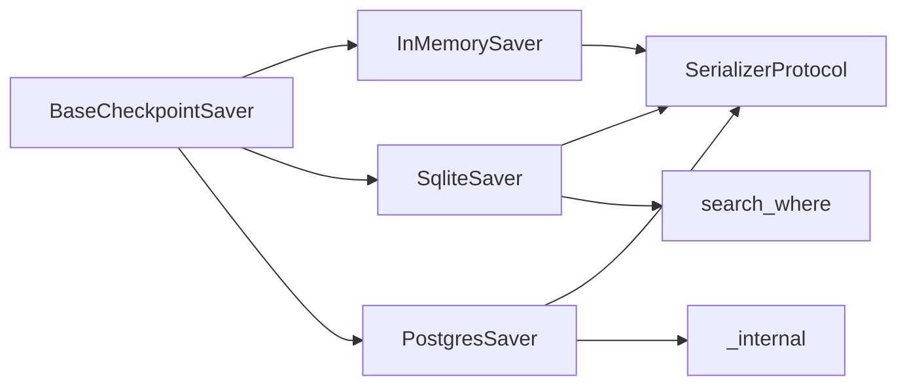

# 检查点 API

<cite>
**本文引用的文件**
- [libs/checkpoint/langgraph/checkpoint/base/__init__.py](file://libs/checkpoint/langgraph/checkpoint/base/__init__.py)
- [libs/checkpoint/langgraph/checkpoint/memory/__init__.py](file://libs/checkpoint/langgraph/checkpoint/memory/__init__.py)
- [libs/checkpoint-sqlite/langgraph/checkpoint/sqlite/__init__.py](file://libs/checkpoint-sqlite/langgraph/checkpoint/sqlite/__init__.py)
- [libs/checkpoint-postgres/langgraph/checkpoint/postgres/__init__.py](file://libs/checkpoint-postgres/langgraph/checkpoint/postgres/__init__.py)
- [libs/checkpoint-conformance/langgraph/checkpoint/conformance/__init__.py](file://libs/checkpoint-conformance/langgraph/checkpoint/conformance/__init__.py)
</cite>

## 目录
1. [简介](#简介)
2. [项目结构](#项目结构)
3. [核心组件](#核心组件)
4. [架构总览](#架构总览)
5. [详细组件分析](#详细组件分析)
6. [依赖分析](#依赖分析)
7. [性能考虑](#性能考虑)
8. [故障排查指南](#故障排查指南)
9. [结论](#结论)
10. [附录](#附录)

## 简介
本文件为 LangGraph 检查点系统的完整 API 文档，覆盖以下内容：
- 检查点接口设计与基类 BaseCheckpointSaver 的职责与扩展方式
- 内存、SQLite、PostgreSQL 三种存储后端的实现与差异
- 检查点的保存、加载、列出、删除、复制、修剪等操作的 API 语义与行为
- SQLite 与 PostgreSQL 的特定配置、使用方法与注意事项
- 持久化策略与性能优化建议

## 项目结构
检查点系统由“通用基类 + 多种存储后端”组成，核心位于 libs/checkpoint，并在独立包中提供 SQLite 与 PostgreSQL 后端实现。

图表来源
- [libs/checkpoint/langgraph/checkpoint/base/__init__.py:122-490](file://libs/checkpoint/langgraph/checkpoint/base/__init__.py#L122-L490)
- [libs/checkpoint/langgraph/checkpoint/memory/__init__.py:31-120](file://libs/checkpoint/langgraph/checkpoint/memory/__init__.py#L31-L120)
- [libs/checkpoint-sqlite/langgraph/checkpoint/sqlite/__init__.py:38-120](file://libs/checkpoint-sqlite/langgraph/checkpoint/sqlite/__init__.py#L38-L120)
- [libs/checkpoint-postgres/langgraph/checkpoint/postgres/__init__.py:32-76](file://libs/checkpoint-postgres/langgraph/checkpoint/postgres/__init__.py#L32-L76)

章节来源
- [libs/checkpoint/langgraph/checkpoint/base/__init__.py:122-490](file://libs/checkpoint/langgraph/checkpoint/base/__init__.py#L122-L490)
- [libs/checkpoint/langgraph/checkpoint/memory/__init__.py:31-120](file://libs/checkpoint/langgraph/checkpoint/memory/__init__.py#L31-L120)
- [libs/checkpoint-sqlite/langgraph/checkpoint/sqlite/__init__.py:38-120](file://libs/checkpoint-sqlite/langgraph/checkpoint/sqlite/__init__.py#L38-L120)
- [libs/checkpoint-postgres/langgraph/checkpoint/postgres/__init__.py:32-76](file://libs/checkpoint-postgres/langgraph/checkpoint/postgres/__init__.py#L32-L76)

## 核心组件
- BaseCheckpointSaver：定义检查点的统一接口，包括同步与异步方法族（get/put/list/delete/copy/prune 及其异步版本），以及序列化器、版本号生成等能力。
- 数据模型：
  - Checkpoint：检查点快照，包含版本号、ID、时间戳、通道值、通道版本、节点版本追踪、更新通道列表等字段。
  - CheckpointMetadata：附加元数据，如来源、步骤、父检查点映射、运行 ID 等。
  - CheckpointTuple：封装配置、检查点、元数据、父配置与待写入项的结构化对象。
- 版本管理：默认整数递增版本；内存与 SQLite 后端支持字符串版本并提供单调递增策略。

章节来源
- [libs/checkpoint/langgraph/checkpoint/base/__init__.py:35-120](file://libs/checkpoint/langgraph/checkpoint/base/__init__.py#L35-L120)
- [libs/checkpoint/langgraph/checkpoint/base/__init__.py:460-490](file://libs/checkpoint/langgraph/checkpoint/base/__init__.py#L460-L490)

## 架构总览
检查点系统通过统一的 BaseCheckpointSaver 抽象，屏蔽不同存储后端的差异。上层图执行引擎仅依赖该抽象接口进行状态保存与恢复。

图表来源
- [libs/checkpoint/langgraph/checkpoint/base/__init__.py:122-490](file://libs/checkpoint/langgraph/checkpoint/base/__init__.py#L122-L490)
- [libs/checkpoint/langgraph/checkpoint/memory/__init__.py:31-120](file://libs/checkpoint/langgraph/checkpoint/memory/__init__.py#L31-L120)
- [libs/checkpoint-sqlite/langgraph/checkpoint/sqlite/__init__.py:38-120](file://libs/checkpoint-sqlite/langgraph/checkpoint/sqlite/__init__.py#L38-L120)
- [libs/checkpoint-postgres/langgraph/checkpoint/postgres/__init__.py:32-76](file://libs/checkpoint-postgres/langgraph/checkpoint/postgres/__init__.py#L32-L76)

## 详细组件分析

### BaseCheckpointSaver 抽象接口
- 职责：定义检查点的 CRUD 与管理操作，提供序列化器注入、过滤查询、异步适配、版本号生成等通用能力。
- 关键方法族：
  - get/get_tuple/list：读取单个或批量检查点
  - put/put_writes：保存检查点与中间写入
  - delete_thread/delete_for_runs/copy_thread/prune：线程级清理、复制与修剪
  - 异步版本：aget/aget_tuple/alist/aput/aput_writes/adelete_* 等
- 版本号策略：默认整数递增；可重写以支持字符串版本（内存/SQLite 后端示例）。

章节来源
- [libs/checkpoint/langgraph/checkpoint/base/__init__.py:122-490](file://libs/checkpoint/langgraph/checkpoint/base/__init__.py#L122-L490)

### 内存实现 InMemorySaver
- 存储结构：三层嵌套字典 + 待写入映射 + 二进制 blob 缓存，键空间为 (thread_id, checkpoint_ns, checkpoint_id)。
- 特性：
  - 支持上下文管理，便于测试与调试
  - get_tuple/list 支持按 checkpoint_id 或最新记录检索
  - put_writes 使用 WRITES_IDX_MAP 区分常规写入与特殊写入（错误/中断/调度/恢复）
  - get_next_version 生成单调递增的字符串版本
- 适用场景：本地开发、单元测试、小规模演示

图表来源
- [libs/checkpoint/langgraph/checkpoint/memory/__init__.py:135-215](file://libs/checkpoint/langgraph/checkpoint/memory/__init__.py#L135-L215)
- [libs/checkpoint/langgraph/checkpoint/memory/__init__.py:326-370](file://libs/checkpoint/langgraph/checkpoint/memory/__init__.py#L326-L370)

章节来源
- [libs/checkpoint/langgraph/checkpoint/memory/__init__.py:31-120](file://libs/checkpoint/langgraph/checkpoint/memory/__init__.py#L31-L120)
- [libs/checkpoint/langgraph/checkpoint/memory/__init__.py:135-215](file://libs/checkpoint/langgraph/checkpoint/memory/__init__.py#L135-L215)
- [libs/checkpoint/langgraph/checkpoint/memory/__init__.py:326-370](file://libs/checkpoint/langgraph/checkpoint/memory/__init__.py#L326-L370)
- [libs/checkpoint/langgraph/checkpoint/memory/__init__.py:518-528](file://libs/checkpoint/langgraph/checkpoint/memory/__init__.py#L518-L528)

### SQLite 实现 SqliteSaver
- 存储结构：两表模型（checkpoints、writes），主键为 (thread_id, checkpoint_ns, checkpoint_id)，支持 WAL 模式提升并发。
- 特性：
  - setup 自动建表与迁移；cursor 上下文保证事务提交与连接安全
  - get_tuple/list 支持按 checkpoint_id 或最新记录检索，支持 filter/before/limit
  - put_writes 使用 INSERT OR REPLACE（当全部为特殊写入类型时）或 INSERT OR IGNORE（混合写入）
  - get_next_version 生成字符串版本，确保单调递增
  - 不支持异步方法（提示使用 AsyncSqliteSaver）
- 适用场景：轻量级同步应用、单机演示、小规模生产（需注意多线程限制）

图表来源
- [libs/checkpoint-sqlite/langgraph/checkpoint/sqlite/__init__.py:184-286](file://libs/checkpoint-sqlite/langgraph/checkpoint/sqlite/__init__.py#L184-L286)
- [libs/checkpoint-sqlite/langgraph/checkpoint/sqlite/__init__.py:380-436](file://libs/checkpoint-sqlite/langgraph/checkpoint/sqlite/__init__.py#L380-L436)

章节来源
- [libs/checkpoint-sqlite/langgraph/checkpoint/sqlite/__init__.py:38-120](file://libs/checkpoint-sqlite/langgraph/checkpoint/sqlite/__init__.py#L38-L120)
- [libs/checkpoint-sqlite/langgraph/checkpoint/sqlite/__init__.py:184-286](file://libs/checkpoint-sqlite/langgraph/checkpoint/sqlite/__init__.py#L184-L286)
- [libs/checkpoint-sqlite/langgraph/checkpoint/sqlite/__init__.py:380-436](file://libs/checkpoint-sqlite/langgraph/checkpoint/sqlite/__init__.py#L380-L436)
- [libs/checkpoint-sqlite/langgraph/checkpoint/sqlite/__init__.py:537-557](file://libs/checkpoint-sqlite/langgraph/checkpoint/sqlite/__init__.py#L537-L557)

### PostgreSQL 实现 PostgresSaver
- 存储结构：三表模型（checkpoints、checkpoint_blobs、checkpoint_writes），采用 JSONB 存储检查点主体与元数据，支持大对象拆分存储。
- 特性：
  - setup 执行迁移脚本，维护迁移版本表
  - list/get_tuple 支持 filter/before/limit，内部处理 pending_sends 兼容迁移
  - put 将简单类型内联到 checkpoints 表，复杂类型写入 checkpoint_blobs 表
  - put_writes 支持 UPSERT（特殊写入）与 INSERT（混合写入）
  - _cursor 提供锁保护与管道模式（pipeline）支持，提升吞吐
  - get_next_version 生成字符串版本，确保单调递增
- 适用场景：生产级高并发、需要强一致与复杂查询的场景

图表来源
- [libs/checkpoint-postgres/langgraph/checkpoint/postgres/__init__.py:255-334](file://libs/checkpoint-postgres/langgraph/checkpoint/postgres/__init__.py#L255-L334)
- [libs/checkpoint-postgres/langgraph/checkpoint/postgres/__init__.py:336-368](file://libs/checkpoint-postgres/langgraph/checkpoint/postgres/__init__.py#L336-L368)

章节来源
- [libs/checkpoint-postgres/langgraph/checkpoint/postgres/__init__.py:32-76](file://libs/checkpoint-postgres/langgraph/checkpoint/postgres/__init__.py#L32-L76)
- [libs/checkpoint-postgres/langgraph/checkpoint/postgres/__init__.py:184-253](file://libs/checkpoint-postgres/langgraph/checkpoint/postgres/__init__.py#L184-L253)
- [libs/checkpoint-postgres/langgraph/checkpoint/postgres/__init__.py:255-334](file://libs/checkpoint-postgres/langgraph/checkpoint/postgres/__init__.py#L255-L334)
- [libs/checkpoint-postgres/langgraph/checkpoint/postgres/__init__.py:336-368](file://libs/checkpoint-postgres/langgraph/checkpoint/postgres/__init__.py#L336-L368)

### 数据模型与序列化
- Checkpoint：包含版本号、ID、时间戳、通道值、通道版本、节点版本追踪、更新通道列表等。
- CheckpointMetadata：来源、步骤、父检查点映射、运行 ID 等。
- 序列化器：默认 JsonPlusSerializer，支持 typed dumps/loads；内存/SQLite 后端可结合 msgpack allowlist 严格反序列化。

章节来源
- [libs/checkpoint/langgraph/checkpoint/base/__init__.py:35-120](file://libs/checkpoint/langgraph/checkpoint/base/__init__.py#L35-L120)
- [libs/checkpoint/langgraph/checkpoint/base/__init__.py:520-554](file://libs/checkpoint/langgraph/checkpoint/base/__init__.py#L520-L554)

## 依赖分析
- 组件耦合：
  - 各后端均继承 BaseCheckpointSaver，保持统一接口
  - SQLite/PG 后端依赖序列化协议与查询工具（如 SQLite 的 search_where）
- 外部依赖：
  - SQLite：sqlite3（含 WAL、事务）
  - PostgreSQL：psycopg/psycopg_pool（JSONB、Pipeline、ConnectionPool）
  - 内存：collections.defaultdict、pickle（用于持久化字典示例）

图表来源
- [libs/checkpoint-sqlite/langgraph/checkpoint/sqlite/__init__.py:25](file://libs/checkpoint-sqlite/langgraph/checkpoint/sqlite/__init__.py#L25)
- [libs/checkpoint-postgres/langgraph/checkpoint/postgres/__init__.py:25](file://libs/checkpoint-postgres/langgraph/checkpoint/postgres/__init__.py#L25)

章节来源
- [libs/checkpoint-sqlite/langgraph/checkpoint/sqlite/__init__.py:25](file://libs/checkpoint-sqlite/langgraph/checkpoint/sqlite/__init__.py#L25)
- [libs/checkpoint-postgres/langgraph/checkpoint/postgres/__init__.py:25](file://libs/checkpoint-postgres/langgraph/checkpoint/postgres/__init__.py#L25)

## 性能考虑
- 版本号策略
  - 默认整数递增，开销低；字符串版本（内存/SQLite）通过高位递增+随机后缀确保单调且可排序
- 序列化与存储
  - PostgreSQL 将简单类型内联至 checkpoints，复杂类型写入 checkpoint_blobs，减少单行膨胀
  - SQLite/内存对大对象直接序列化，注意 Blob 空值处理
- 并发与事务
  - SQLite 使用全局锁与 WAL 模式；不支持异步方法（推荐 AsyncSqliteSaver）
  - PostgreSQL 使用连接池与可选 Pipeline，提升吞吐；必要时使用事务上下文
- 查询与过滤
  - list 支持 before/limit，避免全表扫描；filter 在元数据层面匹配
- I/O 优化
  - 批量写入：put_writes 使用 executemany/批量插入
  - 管道模式：PostgreSQL 在支持时启用 pipeline，减少往返

## 故障排查指南
- 异步方法不可用（SQLite）
  - 现象：调用 aget_tuple/alist/aput 抛出异常
  - 处理：改用同步方法，或使用 AsyncSqliteSaver（需安装 aiosqlite）
- 版本冲突或类型不匹配
  - 现象：反序列化失败或版本号非单调
  - 处理：确认 serde 配置与版本生成策略一致；必要时重写 get_next_version
- 元数据写入异常
  - 现象：metadata 中包含非法字符或键被排除
  - 处理：使用 get_checkpoint_metadata 规范化元数据，避免保留字键
- PostgreSQL 迁移问题
  - 现象：首次使用报错或历史数据格式不兼容
  - 处理：调用 setup 执行迁移；确认迁移版本表存在且顺序正确

章节来源
- [libs/checkpoint-sqlite/langgraph/checkpoint/sqlite/__init__.py:27-35](file://libs/checkpoint-sqlite/langgraph/checkpoint/sqlite/__init__.py#L27-L35)
- [libs/checkpoint/langgraph/checkpoint/base/__init__.py:525-554](file://libs/checkpoint/langgraph/checkpoint/base/__init__.py#L525-L554)
- [libs/checkpoint-postgres/langgraph/checkpoint/postgres/__init__.py:77-103](file://libs/checkpoint-postgres/langgraph/checkpoint/postgres/__init__.py#L77-L103)

## 结论
- BaseCheckpointSaver 提供了统一的检查点抽象，屏蔽了存储细节
- InMemorySaver 适合开发与测试；SqliteSaver 适合轻量级应用；PostgresSaver 适合生产级高并发场景
- 正确选择序列化器、版本号策略与并发控制是保障性能与稳定性的关键

## 附录

### API 一览（按功能分组）
- 读取
  - get(config)：返回 Checkpoint 或 None
  - get_tuple(config)：返回 CheckpointTuple 或 None
  - list(config, filter, before, limit)：迭代 CheckpointTuple
- 写入
  - put(config, checkpoint, metadata, new_versions)：保存检查点并返回新配置
  - put_writes(config, writes, task_id, task_path)：保存中间写入
- 删除与复制
  - delete_thread(thread_id)：删除线程所有检查点与写入
  - delete_for_runs(run_ids)：按运行 ID 删除
  - copy_thread(source_thread_id, target_thread_id)：复制线程
- 修剪
  - prune(thread_ids, strategy="keep_latest"|="delete")：按策略修剪
- 异步（部分后端支持）
  - aget, aget_tuple, alist, aput, aput_writes, adelete_thread, adelete_for_runs, acopy_thread, aprune

章节来源
- [libs/checkpoint/langgraph/checkpoint/base/__init__.py:173-314](file://libs/checkpoint/langgraph/checkpoint/base/__init__.py#L173-L314)
- [libs/checkpoint/langgraph/checkpoint/base/__init__.py:316-458](file://libs/checkpoint/langgraph/checkpoint/base/__init__.py#L316-L458)

### SQLite 使用要点
- 连接参数：check_same_thread=False，但实现内部使用锁保证线程安全
- 建议：仅用于轻量级与单线程场景；多线程/异步请使用 AsyncSqliteSaver
- 版本号：get_next_version 生成字符串版本，确保单调递增

章节来源
- [libs/checkpoint-sqlite/langgraph/checkpoint/sqlite/__init__.py:63-72](file://libs/checkpoint-sqlite/langgraph/checkpoint/sqlite/__init__.py#L63-L72)
- [libs/checkpoint-sqlite/langgraph/checkpoint/sqlite/__init__.py:537-557](file://libs/checkpoint-sqlite/langgraph/checkpoint/sqlite/__init__.py#L537-L557)

### PostgreSQL 使用要点
- 连接：支持 Connection/ConnectionPool；可选启用 Pipeline
- 迁移：首次使用需调用 setup 完成表结构与迁移
- 存储：简单类型内联，复杂类型写入 blobs 表；支持 JSONB 与二进制行工厂
- 并发：使用锁与管道模式提升吞吐；必要时使用事务上下文

章节来源
- [libs/checkpoint-postgres/langgraph/checkpoint/postgres/__init__.py:37-76](file://libs/checkpoint-postgres/langgraph/checkpoint/postgres/__init__.py#L37-L76)
- [libs/checkpoint-postgres/langgraph/checkpoint/postgres/__init__.py:77-103](file://libs/checkpoint-postgres/langgraph/checkpoint/postgres/__init__.py#L77-L103)
- [libs/checkpoint-postgres/langgraph/checkpoint/postgres/__init__.py:393-432](file://libs/checkpoint-postgres/langgraph/checkpoint/postgres/__init__.py#L393-L432)

### 检查点一致性与验证
- conformance 包提供检查点实现的合规性测试入口，可用于验证自定义后端是否满足规范要求

章节来源
- [libs/checkpoint-conformance/langgraph/checkpoint/conformance/__init__.py:1-10](file://libs/checkpoint-conformance/langgraph/checkpoint/conformance/__init__.py#L1-L10)