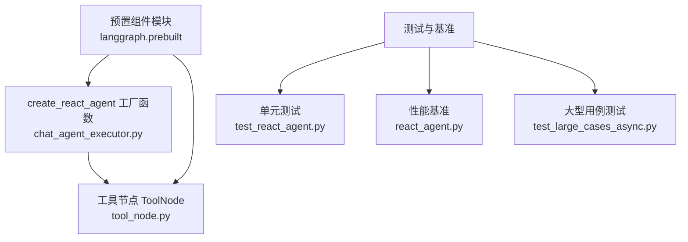
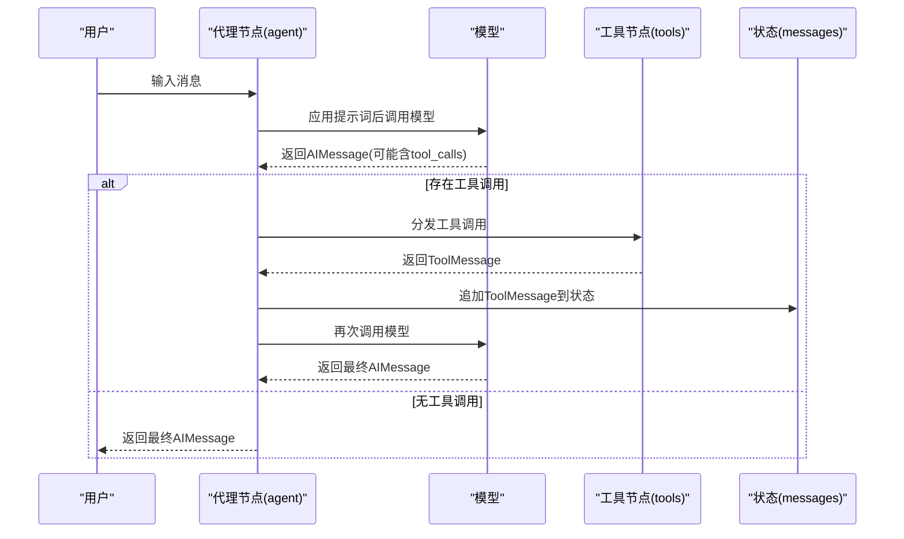
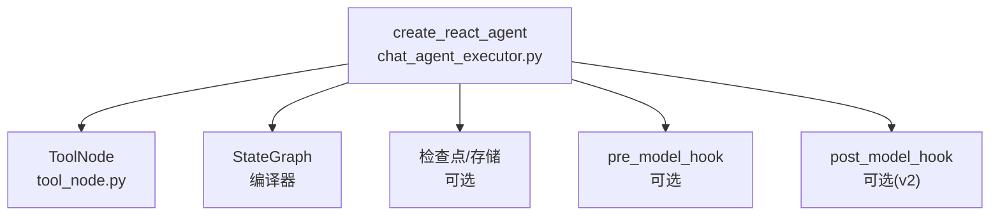

# React 代理 API

<cite>
**本文引用的文件**
- [chat_agent_executor.py](file://libs/prebuilt/langgraph/prebuilt/chat_agent_executor.py)
- [tool_node.py](file://libs/prebuilt/langgraph/prebuilt/tool_node.py)
- [test_react_agent.py](file://libs/prebuilt/tests/test_react_agent.py)
- [react_agent.py](file://libs/langgraph/bench/react_agent.py)
- [test_large_cases_async.py](file://libs/langgraph/tests/test_large_cases_async.py)
</cite>

## 目录
1. [简介](#简介)
2. [项目结构](#项目结构)
3. [核心组件](#核心组件)
4. [架构总览](#架构总览)
5. [详细组件分析](#详细组件分析)
6. [依赖分析](#依赖分析)
7. [性能考虑](#性能考虑)
8. [故障排查指南](#故障排查指南)
9. [结论](#结论)
10. [附录：完整 API 参考与示例路径](#附录完整-api-参考与示例路径)

## 简介
本文件为 React 代理（ReAct Agent）的详细 API 文档，聚焦于 create_react_agent 的使用方法、参数配置、返回值以及工作原理。React 代理通过“思考-行动-观察”循环，结合语言模型的工具调用能力，在多轮交互中逐步完成复杂任务。文档同时覆盖输入输出格式、状态管理机制、工具调用集成方式，并给出常见配置项（如提示词模板、版本选择、结构化输出等）的使用说明与最佳实践。

## 项目结构
React 代理相关实现位于预置组件模块中，核心入口为 create_react_agent 工厂函数，配套工具节点用于执行工具调用。测试与基准脚本提供了丰富的使用示例与行为验证。

图表来源
- [chat_agent_executor.py:278-1002](file://libs/prebuilt/langgraph/prebuilt/chat_agent_executor.py#L278-L1002)
- [tool_node.py:619-1200](file://libs/prebuilt/langgraph/prebuilt/tool_node.py#L619-L1200)
- [test_react_agent.py:1-200](file://libs/prebuilt/tests/test_react_agent.py#L1-L200)
- [react_agent.py:43-80](file://libs/langgraph/bench/react_agent.py#L43-L80)
- [test_large_cases_async.py:1022-1060](file://libs/langgraph/tests/test_large_cases_async.py#L1022-L1060)

章节来源
- [chat_agent_executor.py:278-1002](file://libs/prebuilt/langgraph/prebuilt/chat_agent_executor.py#L278-L1002)
- [tool_node.py:619-1200](file://libs/prebuilt/langgraph/prebuilt/tool_node.py#L619-L1200)

## 核心组件
- create_react_agent：创建 ReAct 代理图，支持静态/动态模型、工具绑定、提示词模板、结构化响应生成、钩子节点、检查点与中断等。
- ToolNode：执行工具调用，支持并行执行、错误处理、状态注入、存储注入、命令式控制流等。
- StateGraph：基于状态的有向无环图（或含循环）编排器，负责节点连接与条件路由。
- 检查点与存储：可选的持久化与跨线程数据存储，用于恢复与共享状态。

章节来源
- [chat_agent_executor.py:278-1002](file://libs/prebuilt/langgraph/prebuilt/chat_agent_executor.py#L278-L1002)
- [tool_node.py:619-1200](file://libs/prebuilt/langgraph/prebuilt/tool_node.py#L619-L1200)

## 架构总览
React 代理采用“思考-行动-观察”的循环机制：
- 思考：模型根据消息历史与提示词生成回复，可能包含工具调用。
- 行动：工具节点执行工具调用，产生工具结果消息。
- 观察：将工具结果加入消息历史，再次调用模型，直至不再需要工具调用或达到终止条件。

图表来源
- [chat_agent_executor.py:830-1002](file://libs/prebuilt/langgraph/prebuilt/chat_agent_executor.py#L830-L1002)

## 详细组件分析

### create_react_agent API 详解
- 功能概述
  - 创建一个 ReAct 代理图，支持工具调用循环、结构化输出、动态模型、钩子节点、检查点与中断等。
- 入口与返回
  - 入口：create_react_agent(...)
  - 返回：CompiledStateGraph（可直接 invoke/astream/stream）
- 关键参数
  - model：语言模型实例或字符串标识；支持动态模型选择（同步/异步），动态模型需返回 BaseChatModel 或可调用的 Runnable。
  - tools：工具列表或 ToolNode 实例；为空时仅执行 LLM 节点。
  - prompt：可选提示词，支持字符串、SystemMessage、可调用、Runnable。
  - response_format：可选最终输出结构化格式（支持 OpenAI 函数模式、JSON Schema、TypedDict、Pydantic 类、或 (prompt, schema) 元组）。
  - pre_model_hook/post_model_hook：可选钩子节点，分别在模型调用前/后执行。
  - state_schema/context_schema：自定义状态与运行上下文的类型约束。
  - checkpointer/store：检查点与跨线程存储。
  - interrupt_before/interrupt_after：在 agent/tools 节点前/后设置中断。
  - debug/version/name：调试开关、版本选择（v1/v2）、图名称。
  - 兼容性参数：config_schema 已弃用，建议使用 context_schema。
- 版本差异（version）
  - v1：工具节点一次性处理整条消息中的所有工具调用，内部并行执行。
  - v2：工具节点逐个工具调用分发，使用 Send API 并行调度，支持更灵活的人机交互与中断。
- 结构化输出
  - 当提供 response_format 时，代理会在循环结束后单独调用模型生成符合 schema 的结构化响应，并写入 state 的 structured_response 键。
- 动态模型
  - 支持根据 graph state 与 runtime 上下文动态选择模型；动态模型返回的 Runnable 必须绑定所需工具。
- 钩子节点
  - pre_model_hook：可用于裁剪消息历史、摘要化、注入上下文等；必须至少提供 messages 或 llm_input_messages。
  - post_model_hook：可用于人机确认、守卫规则、后处理等；仅在 version="v2" 下可用。
- 中断与检查点
  - 支持在 agent/tools 前后设置中断；检查点保存状态以便恢复与重放。
- 输入输出格式
  - 输入：state 字典，至少包含 messages 键（序列的消息列表）。
  - 输出：state 字典，包含 messages 列表与（可选）structured_response。
- 状态管理
  - 默认状态包含 messages 与 remaining_steps；remaining_steps 用于限制最大步数，避免无限循环。
  - 若 remaining_steps 小于阈值且存在工具调用，将返回“需要更多步数”的提示而非抛出异常。
- 工具调用集成
  - 模型返回 AIMessage 含 tool_calls 时，工具节点执行对应工具，生成 ToolMessage 并追加至状态。
  - 支持 return_direct 工具，命中后可直接结束循环。
- 错误处理
  - 提供严格的聊天历史校验，确保每个工具调用都有对应的 ToolMessage。
  - 工具调用失败时，可通过 handle_tool_errors 参数配置错误处理策略。

章节来源
- [chat_agent_executor.py:278-516](file://libs/prebuilt/langgraph/prebuilt/chat_agent_executor.py#L278-L516)
- [chat_agent_executor.py:517-1002](file://libs/prebuilt/langgraph/prebuilt/chat_agent_executor.py#L517-L1002)

### ToolNode 组件详解
- 功能概述
  - 执行工具调用，支持并行执行、错误处理、状态注入、存储注入、命令式控制流。
- 输入输出
  - 输入：支持三种形式（图状态、消息列表、直接工具调用）。
  - 输出：ToolMessage 列表或字典（按 messages_key 聚合），或 Command（用于控制流）。
- 错误处理
  - 支持多种策略：捕获并返回错误消息、仅捕获特定异常类型、回调函数定制、完全不处理等。
- 状态/存储注入
  - 可通过注解将 state、store、runtime 注入工具参数，便于工具访问上下文。
- 包装器（wrap_tool_call/awrap_tool_call）
  - 支持拦截工具调用，实现重试、缓存、请求修改、条件路由等高级控制。

章节来源
- [tool_node.py:619-1200](file://libs/prebuilt/langgraph/prebuilt/tool_node.py#L619-L1200)

### 思考-行动-观察循环机制
- 循环逻辑
  - 代理节点调用模型，若返回 AIMessage 且包含 tool_calls，则进入工具节点执行；否则结束循环。
  - 工具节点返回 ToolMessage 后，代理再次调用模型，直到无工具调用或满足终止条件。
- 版本差异
  - v1：工具节点一次性并行执行所有工具调用。
  - v2：使用 Send API 将每个工具调用分发到独立实例，支持更细粒度的并发与中断。
- 终止条件
  - 无工具调用；或 remaining_steps 不足且存在工具调用；或 post_model_hook/router 决定结束。

章节来源
- [chat_agent_executor.py:830-1002](file://libs/prebuilt/langgraph/prebuilt/chat_agent_executor.py#L830-L1002)

### 结构化输出生成
- 触发时机
  - 在工具调用循环结束后，若配置了 response_format，则单独调用模型生成结构化响应。
- 使用方式
  - 可传入 schema（OpenAI 函数、JSON Schema、TypedDict、Pydantic 类）或 (prompt, schema) 元组。
- 注意事项
  - 模型需支持 with_structured_output；该步骤为额外一次模型调用。

章节来源
- [chat_agent_executor.py:744-785](file://libs/prebuilt/langgraph/prebuilt/chat_agent_executor.py#L744-L785)

### 动态模型与上下文
- 动态模型
  - 接收 (state, runtime) 作为参数，返回 BaseChatModel 或可调用的 Runnable。
  - 支持同步/异步；异步动态模型在同步调用时会报错，需使用 ainvoke/astream。
- 上下文
  - 通过 context_schema 定义运行时上下文类型；动态模型可据此选择不同模型或工具集。

章节来源
- [chat_agent_executor.py:599-618](file://libs/prebuilt/langgraph/prebuilt/chat_agent_executor.py#L599-L618)

### 钩子节点与中间处理
- pre_model_hook
  - 在每次 agent 调用前执行，可裁剪/摘要消息历史，或提供 llm_input_messages 作为模型输入。
  - 必须至少提供 messages 或 llm_input_messages。
- post_model_hook（仅 v2）
  - 在 agent 调用后执行，可实现人机确认、守卫规则、后处理等。
  - 支持根据 pending_tool_calls 决定后续路由。

章节来源
- [chat_agent_executor.py:396-430](file://libs/prebuilt/langgraph/prebuilt/chat_agent_executor.py#L396-L430)
- [chat_agent_executor.py:919-962](file://libs/prebuilt/langgraph/prebuilt/chat_agent_executor.py#L919-L962)

### 中断与检查点
- 中断
  - 支持在 agent/tools 前后设置中断，便于人工干预或外部处理。
- 检查点
  - 可选的 checkpointer 保存状态，支持按 thread_id 多会话管理；异步/同步均可使用。

章节来源
- [chat_agent_executor.py:447-454](file://libs/prebuilt/langgraph/prebuilt/chat_agent_executor.py#L447-L454)
- [test_react_agent.py:90-146](file://libs/prebuilt/tests/test_react_agent.py#L90-L146)

## 依赖分析
- 组件耦合
  - create_react_agent 依赖 ToolNode 执行工具调用；可选 pre_model_hook/post_model_hook 作为中间层。
  - StateGraph 负责节点编排与条件路由；检查点与存储由外部提供。
- 外部依赖
  - LangChain 核心消息类型（HumanMessage、AIMessage、ToolMessage）、工具接口、运行时配置等。
- 潜在循环依赖
  - 未发现直接循环依赖；各模块职责清晰。

图表来源
- [chat_agent_executor.py:787-1002](file://libs/prebuilt/langgraph/prebuilt/chat_agent_executor.py#L787-L1002)
- [tool_node.py:619-1200](file://libs/prebuilt/langgraph/prebuilt/tool_node.py#L619-L1200)

## 性能考虑
- 工具并行执行
  - v2 使用 Send API 将工具调用分发到多个实例，提升吞吐；v1 在单节点内并行执行。
- 消息历史管理
  - 使用 pre_model_hook 对长历史进行裁剪或摘要，减少上下文长度，提高推理效率。
- 结构化输出
  - 结构化输出为额外一次模型调用，应谨慎使用；必要时可结合其他策略降低开销。
- 异步执行
  - 动态模型与工具节点均支持异步；在高并发场景优先使用异步接口。

[本节为通用指导，无需列出章节来源]

## 故障排查指南
- 工具调用未得到结果
  - 确保每个 AIMessage 的 tool_calls 都有对应的 ToolMessage；否则会触发校验错误。
- 动态模型同步调用异步模型
  - 异步动态模型在同步调用时会报错，请改用 ainvoke/astream。
- 工具绑定不匹配
  - 动态模型返回的 Runnable 必须绑定 tools 且与 tools 参数一致；否则会抛出参数不匹配错误。
- 结构化输出失败
  - 确保模型支持 with_structured_output；response_format 与模型能力匹配。
- 中断与恢复
  - 设置中断后，可使用检查点恢复到指定状态；注意中断位置与状态一致性。

章节来源
- [chat_agent_executor.py:243-272](file://libs/prebuilt/langgraph/prebuilt/chat_agent_executor.py#L243-L272)
- [chat_agent_executor.py:660-721](file://libs/prebuilt/langgraph/prebuilt/chat_agent_executor.py#L660-L721)
- [chat_agent_executor.py:173-217](file://libs/prebuilt/langgraph/prebuilt/chat_agent_executor.py#L173-L217)

## 结论
create_react_agent 提供了高度可配置的 ReAct 代理实现，支持从简单 LLM 调用到复杂的工具调用循环与结构化输出。通过版本选择、钩子节点、动态模型与检查点等特性，可在不同场景下平衡灵活性与性能。建议在生产环境中结合消息历史管理、结构化输出策略与中断机制，构建稳健的智能体系统。

[本节为总结性内容，无需列出章节来源]

## 附录：完整 API 参考与示例路径

### API 定义与参数说明
- 函数签名与参数
  - 参见：[create_react_agent 定义:278-516](file://libs/prebuilt/langgraph/prebuilt/chat_agent_executor.py#L278-L516)
- 返回值
  - 返回 CompiledStateGraph，支持 invoke/astream/stream 等调用方式。
  - 参见：[返回值与编译:821-828](file://libs/prebuilt/langgraph/prebuilt/chat_agent_executor.py#L821-L828)

章节来源
- [chat_agent_executor.py:278-516](file://libs/prebuilt/langgraph/prebuilt/chat_agent_executor.py#L278-L516)
- [chat_agent_executor.py:821-828](file://libs/prebuilt/langgraph/prebuilt/chat_agent_executor.py#L821-L828)

### 输入输出格式
- 输入
  - state 字典，至少包含 messages 键（消息列表）。
  - 参见：[输入校验与消息提取:636-658](file://libs/prebuilt/langgraph/prebuilt/chat_agent_executor.py#L636-L658)
- 输出
  - state 字典，包含 messages 列表与（可选）structured_response。
  - 参见：[输出构造:694-721](file://libs/prebuilt/langgraph/prebuilt/chat_agent_executor.py#L694-L721)

章节来源
- [chat_agent_executor.py:636-721](file://libs/prebuilt/langgraph/prebuilt/chat_agent_executor.py#L636-L721)

### 状态管理机制
- 默认状态
  - messages：消息列表；remaining_steps：剩余步数（用于限制循环次数）。
  - 参见：[默认状态与步数限制:431-440](file://libs/prebuilt/langgraph/prebuilt/chat_agent_executor.py#L431-L440)
- 自定义状态
  - 通过 state_schema 定义自定义状态；必须包含 required keys。
  - 参见：[状态校验:538-552](file://libs/prebuilt/langgraph/prebuilt/chat_agent_executor.py#L538-L552)

章节来源
- [chat_agent_executor.py:431-440](file://libs/prebuilt/langgraph/prebuilt/chat_agent_executor.py#L431-L440)
- [chat_agent_executor.py:538-552](file://libs/prebuilt/langgraph/prebuilt/chat_agent_executor.py#L538-L552)

### 工具调用集成方式
- 工具节点
  - ToolNode 支持并行执行、错误处理、状态/存储注入、命令式控制流。
  - 参见：[ToolNode 实现:619-1200](file://libs/prebuilt/langgraph/prebuilt/tool_node.py#L619-L1200)
- 调用流程
  - AIMessage 含 tool_calls → 工具节点执行 → ToolMessage → 再次调用模型。
  - 参见：[循环与路由:830-1002](file://libs/prebuilt/langgraph/prebuilt/chat_agent_executor.py#L830-L1002)

章节来源
- [tool_node.py:619-1200](file://libs/prebuilt/langgraph/prebuilt/tool_node.py#L619-L1200)
- [chat_agent_executor.py:830-1002](file://libs/prebuilt/langgraph/prebuilt/chat_agent_executor.py#L830-L1002)

### 常见配置选项与使用方法
- 温度参数
  - 通过模型绑定或运行时配置传递；具体取决于所用模型与动态模型实现。
  - 参见：[动态模型与模型解析:599-618](file://libs/prebuilt/langgraph/prebuilt/chat_agent_executor.py#L599-L618)
- 工具列表
  - 支持 BaseTool 实例、普通函数、字典（内置工具）；ToolNode 内部统一处理。
  - 参见：[工具解析与绑定:554-561](file://libs/prebuilt/langgraph/prebuilt/chat_agent_executor.py#L554-L561)
- 提示词模板
  - 支持字符串、SystemMessage、可调用、Runnable；可作为 pre_model_hook 的输入。
  - 参见：[提示词可选类型:366-372](file://libs/prebuilt/langgraph/prebuilt/chat_agent_executor.py#L366-L372)
- 结构化输出
  - 通过 response_format 指定 schema；模型需支持 with_structured_output。
  - 参见：[结构化输出生成:744-785](file://libs/prebuilt/langgraph/prebuilt/chat_agent_executor.py#L744-L785)

章节来源
- [chat_agent_executor.py:599-618](file://libs/prebuilt/langgraph/prebuilt/chat_agent_executor.py#L599-L618)
- [chat_agent_executor.py:554-561](file://libs/prebuilt/langgraph/prebuilt/chat_agent_executor.py#L554-L561)
- [chat_agent_executor.py:366-372](file://libs/prebuilt/langgraph/prebuilt/chat_agent_executor.py#L366-L372)
- [chat_agent_executor.py:744-785](file://libs/prebuilt/langgraph/prebuilt/chat_agent_executor.py#L744-L785)

### 完整代码示例（路径）
- 基础 ReAct 代理（字符串模型、工具、提示词）
  - 示例路径：[基础示例（测试文件）:159-167](file://libs/prebuilt/tests/test_react_agent.py#L159-L167)
- 动态模型（根据上下文选择模型）
  - 示例路径：[动态模型示例（测试文件）:1623-1656](file://libs/prebuilt/tests/test_react_agent.py#L1623-L1656)
- 结构化输出（with_structured_output）
  - 示例路径：[结构化输出示例（测试文件）:1253-1258](file://libs/prebuilt/tests/test_react_agent.py#L1253-L1258)
- 流式输出与子图集成
  - 示例路径：[流式输出与子图（测试文件）:1260-1286](file://libs/prebuilt/tests/test_react_agent.py#L1260-L1286)
- 性能基准（大量工具调用）
  - 示例路径：[基准脚本（bench）:43-80](file://libs/langgraph/bench/react_agent.py#L43-L80)
- 大型用例（多工具调用与中断）
  - 示例路径：[大型用例（测试文件）:1022-1060](file://libs/langgraph/tests/test_large_cases_async.py#L1022-L1060)

章节来源
- [test_react_agent.py:159-167](file://libs/prebuilt/tests/test_react_agent.py#L159-L167)
- [test_react_agent.py:1623-1656](file://libs/prebuilt/tests/test_react_agent.py#L1623-L1656)
- [test_react_agent.py:1253-1258](file://libs/prebuilt/tests/test_react_agent.py#L1253-L1258)
- [test_react_agent.py:1260-1286](file://libs/prebuilt/tests/test_react_agent.py#L1260-L1286)
- [react_agent.py:43-80](file://libs/langgraph/bench/react_agent.py#L43-L80)
- [test_large_cases_async.py:1022-1060](file://libs/langgraph/tests/test_large_cases_async.py#L1022-L1060)