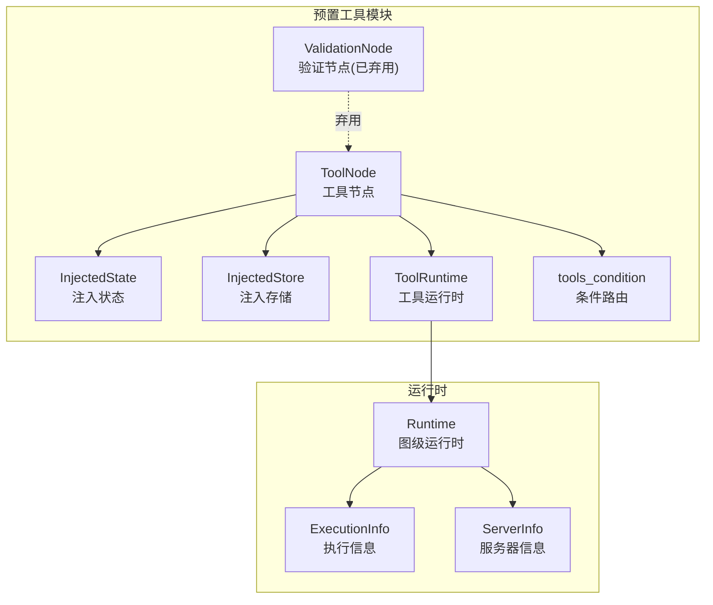
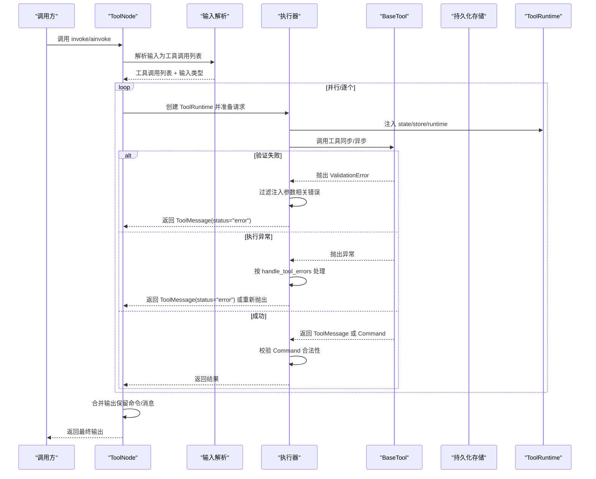
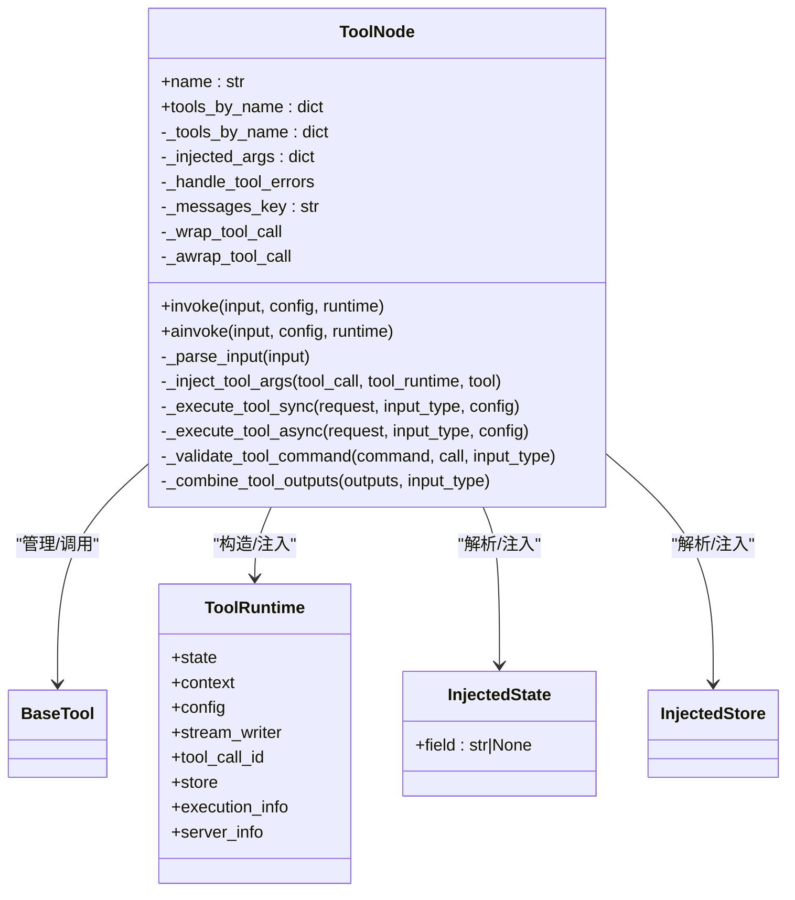
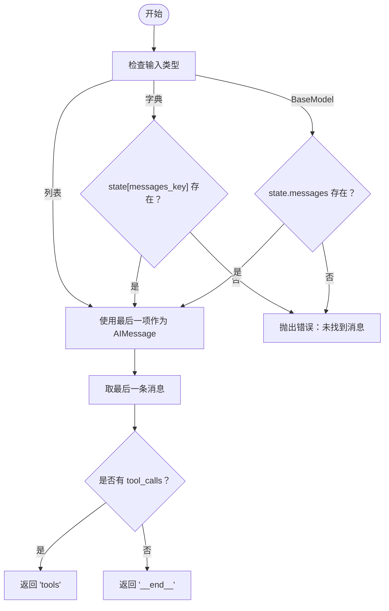
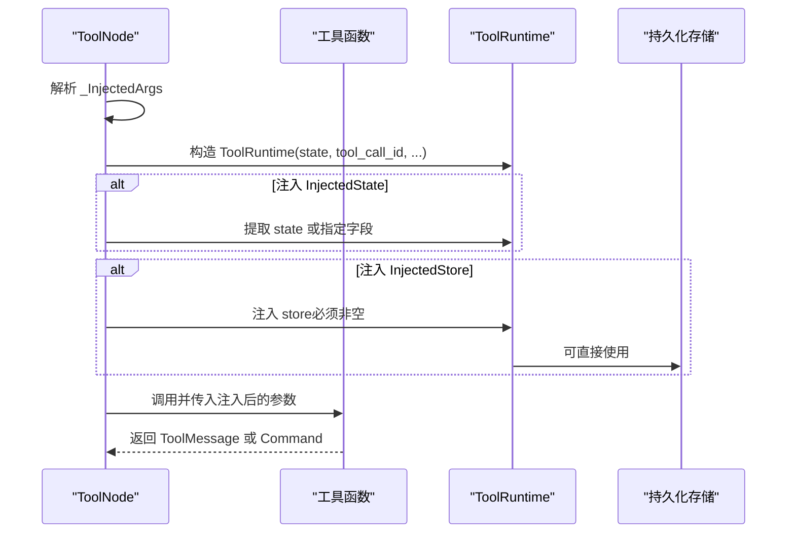
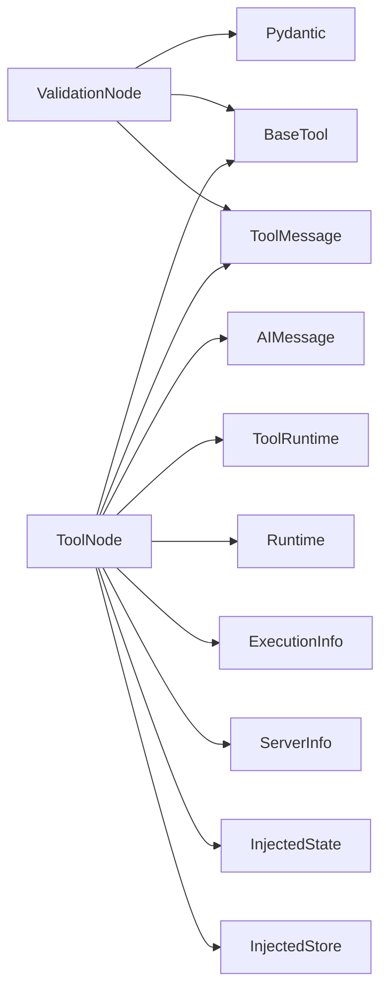

# 工具节点 API

<cite>
**本文引用的文件**
- [tool_node.py](file://libs/prebuilt/langgraph/prebuilt/tool_node.py)
- [tool_validator.py](file://libs/prebuilt/langgraph/prebuilt/tool_validator.py)
- [test_tool_node.py](file://libs/prebuilt/tests/test_tool_node.py)
- [test_tool_node_validation_error_filtering.py](file://libs/prebuilt/tests/test_tool_node_validation_error_filtering.py)
- [test_validation_node.py](file://libs/prebuilt/tests/test_validation_node.py)
- [runtime.py](file://libs/langgraph/langgraph/runtime.py)
</cite>

## 目录
1. [简介](#简介)
2. [项目结构](#项目结构)
3. [核心组件](#核心组件)
4. [架构总览](#架构总览)
5. [详细组件分析](#详细组件分析)
6. [依赖分析](#依赖分析)
7. [性能考虑](#性能考虑)
8. [故障排查指南](#故障排查指南)
9. [结论](#结论)
10. [附录：使用示例与最佳实践](#附录使用示例与最佳实践)

## 简介
本文件系统性地梳理并说明 LangGraph 预置工具节点与工具验证器的完整 API，重点覆盖：
- ToolNode 类的初始化、工具注册与执行机制
- tools_condition 条件函数的使用与路由逻辑
- InjectedState 与 InjectedStore 的注入机制与使用场景
- ToolRuntime 运行时的配置与管理
- ValidationNode 验证节点的数据验证能力
- 结合测试用例给出可直接参考的集成与使用范式

## 项目结构
与工具节点和验证器相关的核心模块与测试如下：
- 工具节点与运行时：libs/prebuilt/langgraph/prebuilt/tool_node.py
- 工具验证器（已弃用）：libs/prebuilt/langgraph/prebuilt/tool_validator.py
- 运行时（图级 Runtime）：libs/langgraph/langgraph/runtime.py
- 测试用例（工具节点）：libs/prebuilt/tests/test_tool_node.py
- 测试用例（工具节点错误过滤）：libs/prebuilt/tests/test_tool_node_validation_error_filtering.py
- 测试用例（验证节点）：libs/prebuilt/tests/test_validation_node.py

图表来源
- [tool_node.py:1471-1548](file://libs/prebuilt/langgraph/prebuilt/tool_node.py#L1471-L1548)
- [tool_node.py:1551-1618](file://libs/prebuilt/langgraph/prebuilt/tool_node.py#L1551-L1618)
- [tool_node.py:1620-1689](file://libs/prebuilt/langgraph/prebuilt/tool_node.py#L1620-L1689)
- [tool_node.py:1696-1768](file://libs/prebuilt/langgraph/prebuilt/tool_node.py#L1696-L1768)
- [tool_validator.py:47-114](file://libs/prebuilt/langgraph/prebuilt/tool_validator.py#L47-L114)
- [runtime.py:89-227](file://libs/langgraph/langgraph/runtime.py#L89-L227)

章节来源
- [tool_node.py:1-120](file://libs/prebuilt/langgraph/prebuilt/tool_node.py#L1-L120)
- [tool_validator.py:1-31](file://libs/prebuilt/langgraph/prebuilt/tool_validator.py#L1-L31)
- [runtime.py:1-245](file://libs/langgraph/langgraph/runtime.py#L1-L245)

## 核心组件
- ToolNode：在 LangGraph 工作流中执行工具调用，支持并行执行、状态注入、持久化存储注入、控制流命令返回、错误处理策略等。
- InjectedState：将图状态注入到工具参数，允许工具按需访问完整状态或特定字段。
- InjectedStore：将持久化存储实例注入到工具参数，用于跨会话数据持久化。
- ToolRuntime：工具专用运行时上下文，包含 state、tool_call_id、config、context、store、stream_writer 等。
- tools_condition：基于最后一条 AIMessage 是否包含 tool_calls 实现“是否进入工具节点”的标准条件路由。
- ValidationNode：对模型输出中的工具调用进行模式校验，返回 ToolMessage 或错误消息；该节点已标记为弃用。

章节来源
- [tool_node.py:619-789](file://libs/prebuilt/langgraph/prebuilt/tool_node.py#L619-L789)
- [tool_node.py:1471-1548](file://libs/prebuilt/langgraph/prebuilt/tool_node.py#L1471-L1548)
- [tool_node.py:1551-1618](file://libs/prebuilt/langgraph/prebuilt/tool_node.py#L1551-L1618)
- [tool_node.py:1620-1689](file://libs/prebuilt/langgraph/prebuilt/tool_node.py#L1620-L1689)
- [tool_node.py:1696-1768](file://libs/prebuilt/langgraph/prebuilt/tool_node.py#L1696-L1768)
- [tool_validator.py:47-114](file://libs/prebuilt/langgraph/prebuilt/tool_validator.py#L47-L114)

## 架构总览
下图展示了 ToolNode 在一次执行中的关键流程：输入解析、工具查找与校验、参数注入、执行与错误处理、输出合并与命令校验。

图表来源
- [tool_node.py:790-855](file://libs/prebuilt/langgraph/prebuilt/tool_node.py#L790-L855)
- [tool_node.py:901-998](file://libs/prebuilt/langgraph/prebuilt/tool_node.py#L901-L998)
- [tool_node.py:1054-1150](file://libs/prebuilt/langgraph/prebuilt/tool_node.py#L1054-L1150)
- [tool_node.py:1287-1396](file://libs/prebuilt/langgraph/prebuilt/tool_node.py#L1287-L1396)
- [tool_node.py:1398-1468](file://libs/prebuilt/langgraph/prebuilt/tool_node.py#L1398-L1468)

## 详细组件分析

### ToolNode 类 API
- 初始化
  - 接收工具序列（BaseTool 实例或普通函数），自动转换为工具；构建名称到工具映射与注入参数映射。
  - 支持 handle_tool_errors 错误处理策略（布尔、字符串、异常类型、元组、可调用）、messages_key（消息键名）、wrap_tool_call/awrap_tool_call 包装器。
- 输入/输出
  - 支持多种输入格式：字典状态（含 messages 键）、消息列表、直接工具调用列表；输出根据输入类型返回消息列表或字典。
- 执行机制
  - 并行执行多个工具调用（通过线程池/异步并发）；每个调用前进行工具存在性校验与参数注入；捕获并按策略处理异常；支持返回 Command 进行状态更新与路由。
- 关键内部方法
  - _parse_input：从不同输入格式提取工具调用。
  - _inject_tool_args：注入 InjectedState、InjectedStore、ToolRuntime。
  - _execute_tool_sync/_execute_tool_async：统一的同步/异步执行与错误处理。
  - _validate_tool_command：校验 Command 的 update 与 ToolMessage 匹配关系。
  - _combine_tool_outputs：合并输出，处理混合消息与命令。

图表来源
- [tool_node.py:619-789](file://libs/prebuilt/langgraph/prebuilt/tool_node.py#L619-L789)
- [tool_node.py:1551-1618](file://libs/prebuilt/langgraph/prebuilt/tool_node.py#L1551-L1618)
- [tool_node.py:1620-1689](file://libs/prebuilt/langgraph/prebuilt/tool_node.py#L1620-L1689)
- [tool_node.py:1696-1768](file://libs/prebuilt/langgraph/prebuilt/tool_node.py#L1696-L1768)

章节来源
- [tool_node.py:740-784](file://libs/prebuilt/langgraph/prebuilt/tool_node.py#L740-L784)
- [tool_node.py:790-855](file://libs/prebuilt/langgraph/prebuilt/tool_node.py#L790-L855)
- [tool_node.py:901-998](file://libs/prebuilt/langgraph/prebuilt/tool_node.py#L901-L998)
- [tool_node.py:1054-1150](file://libs/prebuilt/langgraph/prebuilt/tool_node.py#L1054-L1150)
- [tool_node.py:1287-1396](file://libs/prebuilt/langgraph/prebuilt/tool_node.py#L1287-L1396)
- [tool_node.py:1398-1468](file://libs/prebuilt/langgraph/prebuilt/tool_node.py#L1398-L1468)

### tools_condition 条件函数
- 功能：判断是否应路由到工具节点。若最后一条 AIMessage 含有 tool_calls，则返回 "tools"，否则返回 "__end__"。
- 支持输入格式：字典（含 messages 键）、BaseModel（含 messages 属性）、消息列表。
- 可自定义 messages_key 以适配不同状态结构。

图表来源
- [tool_node.py:1471-1548](file://libs/prebuilt/langgraph/prebuilt/tool_node.py#L1471-L1548)

章节来源
- [tool_node.py:1471-1548](file://libs/prebuilt/langgraph/prebuilt/tool_node.py#L1471-L1548)

### InjectedState 与 InjectedStore 注入机制
- InjectedState
  - 将图状态注入工具参数，支持注入整个状态或指定字段；在工具 schema 中自动排除，不暴露给模型。
  - 注入时机：工具调用前，依据 _InjectedArgs 映射提取对应字段或整体状态。
- InjectedStore
  - 将持久化存储实例注入工具参数；要求图编译时提供 store，否则抛错。
  - 使用场景：跨会话持久化用户偏好、中间结果等。
- ToolRuntime
  - 工具专用运行时上下文，包含 state、tool_call_id、config、context、store、stream_writer、execution_info、server_info。

图表来源
- [tool_node.py:1287-1396](file://libs/prebuilt/langgraph/prebuilt/tool_node.py#L1287-L1396)
- [tool_node.py:1551-1618](file://libs/prebuilt/langgraph/prebuilt/tool_node.py#L1551-L1618)
- [tool_node.py:1620-1689](file://libs/prebuilt/langgraph/prebuilt/tool_node.py#L1620-L1689)
- [tool_node.py:1696-1768](file://libs/prebuilt/langgraph/prebuilt/tool_node.py#L1696-L1768)

章节来源
- [tool_node.py:1287-1396](file://libs/prebuilt/langgraph/prebuilt/tool_node.py#L1287-L1396)
- [tool_node.py:1551-1618](file://libs/prebuilt/langgraph/prebuilt/tool_node.py#L1551-L1618)
- [tool_node.py:1620-1689](file://libs/prebuilt/langgraph/prebuilt/tool_node.py#L1620-L1689)
- [tool_node.py:1696-1768](file://libs/prebuilt/langgraph/prebuilt/tool_node.py#L1696-L1768)

### ToolRuntime 运行时配置与管理
- 图级 Runtime（供节点/中间件使用）：包含 context、store、stream_writer、previous、execution_info、server_info。
- 工具专用 ToolRuntime：在 ToolNode 内部为每次工具调用构造，包含 state、tool_call_id、config、context、store、stream_writer、execution_info、server_info。
- 获取方式：通过配置注入（configurable 中的 __pregel_runtime）或运行时工具函数。

章节来源
- [runtime.py:89-227](file://libs/langgraph/langgraph/runtime.py#L89-L227)
- [tool_node.py:803-812](file://libs/prebuilt/langgraph/prebuilt/tool_node.py#L803-L812)
- [tool_node.py:837-846](file://libs/prebuilt/langgraph/prebuilt/tool_node.py#L837-L846)

### ValidationNode 验证节点（已弃用）
- 功能：对 AIMessage 中的工具调用应用 Pydantic 模式进行验证，返回 ToolMessage（成功）或带错误标记的 ToolMessage（失败）。
- 支持输入：BaseModel、BaseTool（args_schema）、函数（自动推断 schema）。
- 注意：该节点已标记为弃用，建议使用 create_agent 并自定义工具错误处理替代。

章节来源
- [tool_validator.py:47-114](file://libs/prebuilt/langgraph/prebuilt/tool_validator.py#L47-L114)
- [tool_validator.py:116-166](file://libs/prebuilt/langgraph/prebuilt/tool_validator.py#L116-L166)
- [tool_validator.py:184-221](file://libs/prebuilt/langgraph/prebuilt/tool_validator.py#L184-L221)
- [test_validation_node.py:1-89](file://libs/prebuilt/tests/test_validation_node.py#L1-L89)

## 依赖分析
- ToolNode 依赖
  - 工具系统：BaseTool、工具装饰器 create_tool、工具异常类型 ToolException、InjectedToolArg。
  - 消息系统：AIMessage、ToolMessage、ToolCall、消息转换工具 convert_to_messages。
  - 运行时：ToolRuntime（工具专用）、Runtime（图级）、ExecutionInfo、ServerInfo。
  - 并发：线程池/异步并发执行工具调用。
- ValidationNode 依赖
  - Pydantic（v1/v2）模式校验、工具 schema 提取工具 create_schema_from_function。
- 测试依赖
  - StateGraph、MessagesState、InMemoryStore、Command、Send 等。

图表来源
- [tool_node.py:40-92](file://libs/prebuilt/langgraph/prebuilt/tool_node.py#L40-L92)
- [tool_validator.py:8-31](file://libs/prebuilt/langgraph/prebuilt/tool_validator.py#L8-L31)
- [runtime.py:1-245](file://libs/langgraph/langgraph/runtime.py#L1-L245)

章节来源
- [tool_node.py:40-92](file://libs/prebuilt/langgraph/prebuilt/tool_node.py#L40-L92)
- [tool_validator.py:8-31](file://libs/prebuilt/langgraph/prebuilt/tool_validator.py#L8-L31)
- [runtime.py:1-245](file://libs/langgraph/langgraph/runtime.py#L1-L245)

## 性能考虑
- 并行执行：ToolNode 对多个工具调用采用并行执行（线程池或异步 gather），提升吞吐量。
- 注入缓存：_InjectedArgs 在初始化时一次性分析工具签名与 schema，后续执行复用，避免重复反射开销。
- 输出合并：对包含 Command 的输出进行合并与去重，减少下游处理复杂度。
- 错误处理短路：包装器（wrap_tool_call/awrap_tool_call）支持重试、缓存与提前短路，降低无效调用成本。

## 故障排查指南
- 工具名不存在
  - 现象：返回 ToolMessage(status="error")，内容包含可用工具列表。
  - 定位：_validate_tool_call。
- 参数校验失败（ValidationError）
  - 现象：抛出 ToolInvocationError，错误信息仅包含模型可控参数的错误，并过滤注入参数相关错误。
  - 定位：_execute_tool_sync/_execute_tool_async 中的 _filter_validation_errors。
- 注入 Store 缺失
  - 现象：抛出 ValueError，提示需在编译图时提供 store。
  - 定位：_inject_tool_args 中对 store 的检查。
- Command 不合法
  - 现象：抛出 ValueError，提示 Command.update 与 ToolMessage 匹配规则。
  - 定位：_validate_tool_command。
- 自定义错误处理
  - 支持 True/False/字符串/异常类型/元组/可调用；可通过 _infer_handled_types 推断可处理的异常类型。
  - 定位：_handle_tool_error、_infer_handled_types。

章节来源
- [tool_node.py:1259-1270](file://libs/prebuilt/langgraph/prebuilt/tool_node.py#L1259-L1270)
- [tool_node.py:938-945](file://libs/prebuilt/langgraph/prebuilt/tool_node.py#L938-L945)
- [tool_node.py:1374-1381](file://libs/prebuilt/langgraph/prebuilt/tool_node.py#L1374-L1381)
- [tool_node.py:1398-1468](file://libs/prebuilt/langgraph/prebuilt/tool_node.py#L1398-L1468)
- [tool_node.py:392-439](file://libs/prebuilt/langgraph/prebuilt/tool_node.py#L392-L439)
- [tool_node.py:442-505](file://libs/prebuilt/langgraph/prebuilt/tool_node.py#L442-L505)

## 结论
ToolNode 提供了在 LangGraph 中执行工具调用的完整能力：从工具注册、参数注入、并发执行到错误处理与命令式控制流。InjectedState/InjectedStore/ToolRuntime 使工具既能与模型交互，又能安全地访问图状态与持久化存储。tools_condition 则提供了 ReAct 风格的标准路由逻辑。ValidationNode 虽已弃用，但其模式校验思路仍可用于自定义验证流程。

## 附录：使用示例与最佳实践
以下示例路径来自测试文件，展示了常见用法与集成方式（请参见相应测试文件获取完整示例）：
- 基础工具节点使用与多工具调用
  - 示例路径：[test_tool_node.py:125-220](file://libs/prebuilt/tests/test_tool_node.py#L125-L220)
- 工具调用输入（直接工具调用列表）
  - 示例路径：[test_tool_node.py:222-266](file://libs/prebuilt/tests/test_tool_node.py#L222-L266)
- 错误处理策略（默认、捕获全部、按异常类型、自定义可调用）
  - 示例路径：[test_tool_node.py:297-378](file://libs/prebuilt/tests/test_tool_node.py#L297-L378)
  - 示例路径：[test_tool_node.py:380-470](file://libs/prebuilt/tests/test_tool_node.py#L380-L470)
- 禁用错误处理与验证错误抛出
  - 示例路径：[test_tool_node.py:472-534](file://libs/prebuilt/tests/test_tool_node.py#L472-L534)
- 单独工具错误处理覆盖全局策略
  - 示例路径：[test_tool_node.py:536-562](file://libs/prebuilt/tests/test_tool_node.py#L536-L562)
- 未知工具名错误
  - 示例路径：[test_tool_node.py:565-591](file://libs/prebuilt/tests/test_tool_node.py#L565-L591)
- 中断（GraphBubbleUp）处理
  - 示例路径：[test_tool_node.py:594-624](file://libs/prebuilt/tests/test_tool_node.py#L594-L624)
- 返回 Command 的工具（转移/更新/跳转）
  - 示例路径：[test_tool_node.py:626-797](file://libs/prebuilt/tests/test_tool_node.py#L626-L797)
- 注入所有类型（全状态、字段、Store、Runtime）的异步工具
  - 示例路径：[test_tool_node.py:1684-1801](file://libs/prebuilt/tests/test_tool_node.py#L1684-L1801)
  - 示例路径：[test_tool_node.py:1803-1858](file://libs/prebuilt/tests/test_tool_node.py#L1803-L1858)
- 注入参数导致的验证错误被过滤（仅显示模型可控参数）
  - 示例路径：[test_tool_node_validation_error_filtering.py:41-61](file://libs/prebuilt/tests/test_tool_node_validation_error_filtering.py#L41-L61)
  - 示例路径：[test_tool_node_validation_error_filtering.py:103-141](file://libs/prebuilt/tests/test_tool_node_validation_error_filtering.py#L103-L141)
- ValidationNode（已弃用）的使用与行为
  - 示例路径：[test_validation_node.py:50-88](file://libs/prebuilt/tests/test_validation_node.py#L50-L88)