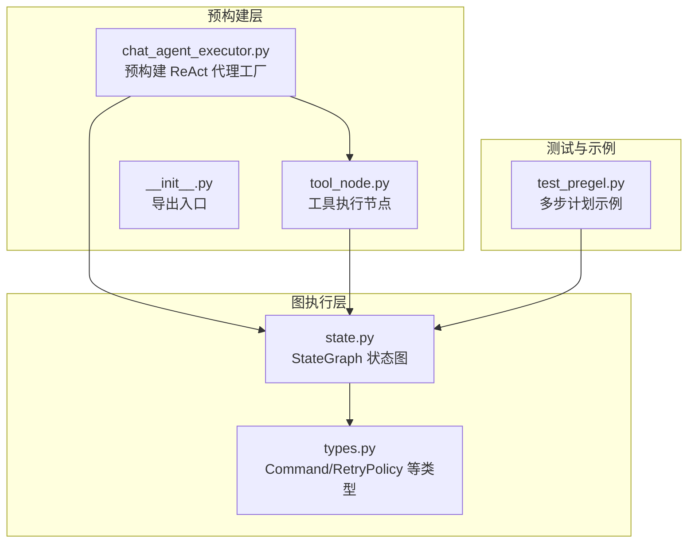
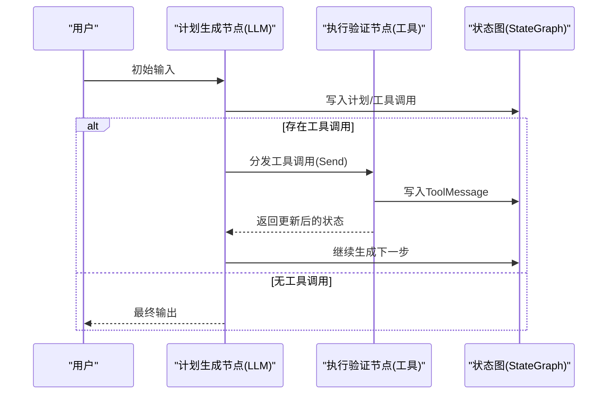
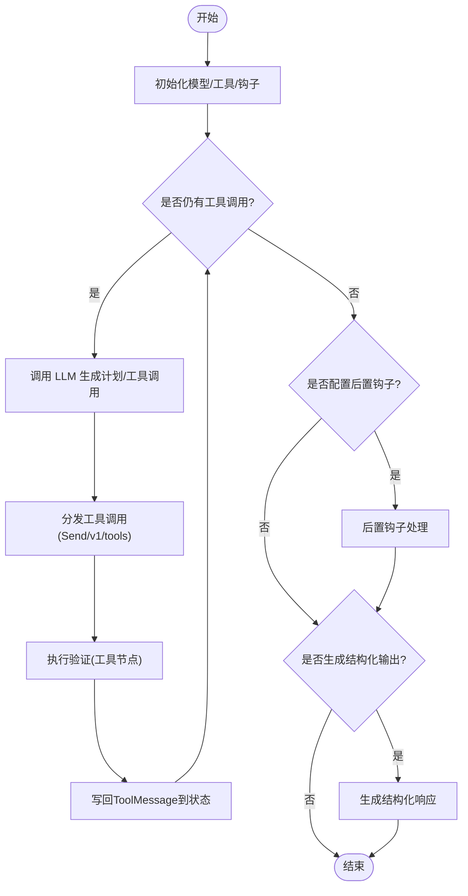
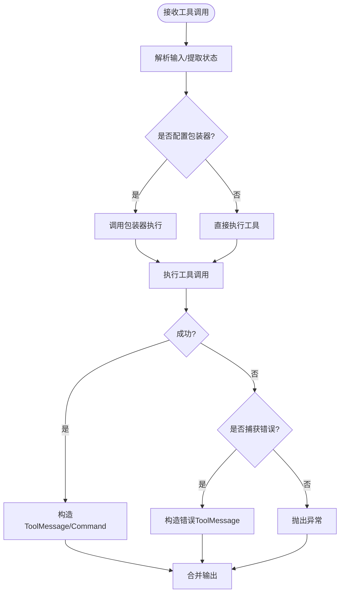
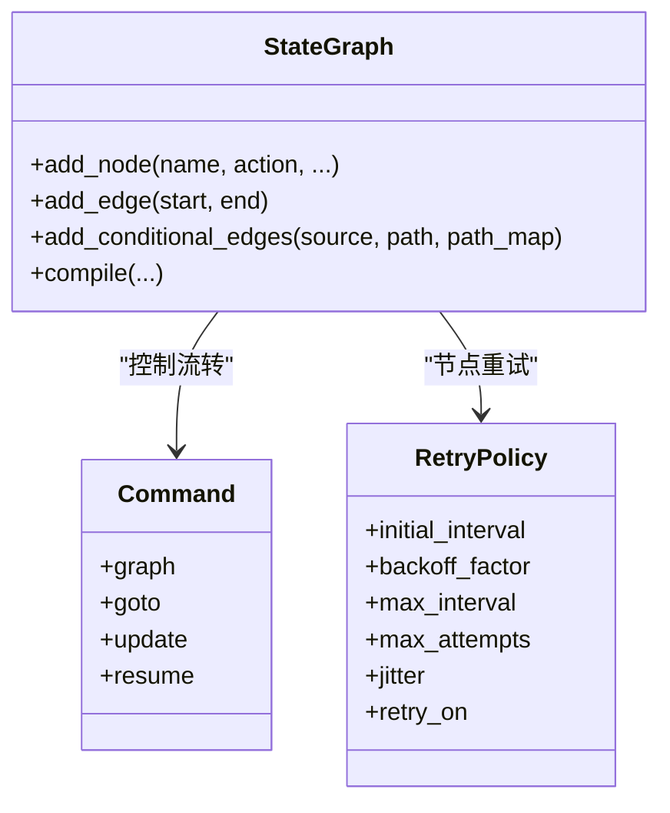
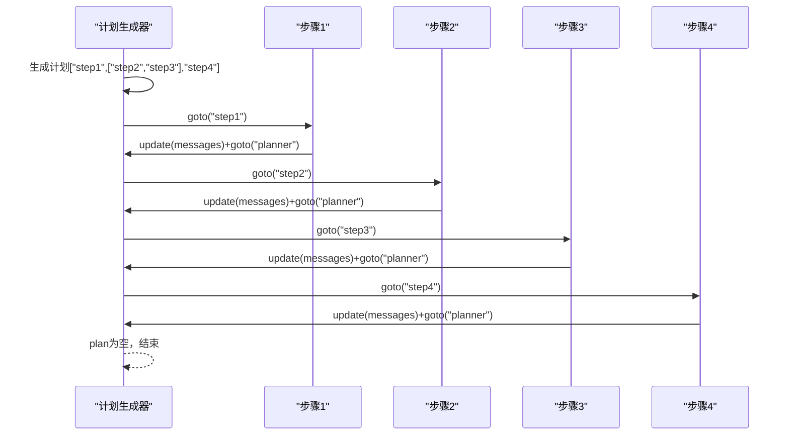
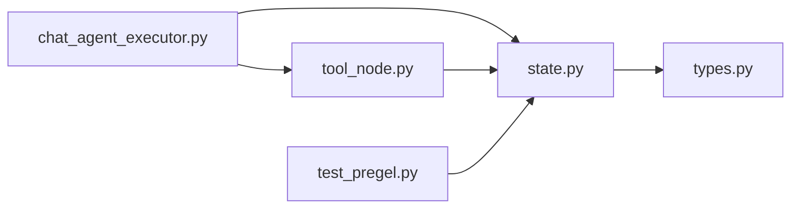

# 计划-执行代理 API

<cite>
**本文引用的文件**
- [chat_agent_executor.py](file://libs/prebuilt/langgraph/prebuilt/chat_agent_executor.py)
- [tool_node.py](file://libs/prebuilt/langgraph/prebuilt/tool_node.py)
- [state.py](file://libs/langgraph/langgraph/graph/state.py)
- [types.py](file://libs/langgraph/langgraph/types.py)
- [test_pregel.py](file://libs/langgraph/tests/test_pregel.py)
- [__init__.py](file://libs/prebuilt/langgraph/prebuilt/__init__.py)
</cite>

## 目录
1. [简介](#简介)
2. [项目结构](#项目结构)
3. [核心组件](#核心组件)
4. [架构总览](#架构总览)
5. [详细组件分析](#详细组件分析)
6. [依赖关系分析](#依赖关系分析)
7. [性能考虑](#性能考虑)
8. [故障排查指南](#故障排查指南)
9. [结论](#结论)
10. [附录](#附录)

## 简介
本文件面向“计划-执行代理”的 API 设计与使用，重点阐述其双阶段工作机制：计划生成（Plan Generation）与执行验证（Execution Validation）。该代理通过状态图（StateGraph）将“计划生成”与“执行验证”两个阶段解耦，并以可中断、可重试、可恢复的方式驱动复杂任务的分解与执行。本文同时覆盖：
- 初始化参数与配置项
- 状态管理与控制流
- 计划生成器与执行验证器的职责边界
- 错误处理、重试与状态恢复
- 实战示例路径（以代码片段路径代替具体代码）

## 项目结构
围绕计划-执行代理，相关实现主要分布在以下模块：
- 预构建代理工厂：负责编排 ReAct 风格的代理循环（含工具调用），可作为“计划-执行代理”的高层封装
- 工具节点：负责执行验证器（工具调用）与结果回写消息
- 状态图：提供通用的状态共享与节点间控制流编排能力
- 类型与策略：提供命令、重试策略等基础类型

**图表来源**
- [chat_agent_executor.py:1-1016](file://libs/prebuilt/langgraph/prebuilt/chat_agent_executor.py#L1-L1016)
- [tool_node.py:1-1893](file://libs/prebuilt/langgraph/prebuilt/tool_node.py#L1-L1893)
- [state.py:115-1193](file://libs/langgraph/langgraph/graph/state.py#L115-L1193)
- [types.py:404-423](file://libs/langgraph/langgraph/types.py#L404-L423)
- [test_pregel.py:5151-5206](file://libs/langgraph/tests/test_pregel.py#L5151-L5206)

**章节来源**
- [chat_agent_executor.py:1-1016](file://libs/prebuilt/langgraph/prebuilt/chat_agent_executor.py#L1-L1016)
- [tool_node.py:1-1893](file://libs/prebuilt/langgraph/prebuilt/tool_node.py#L1-L1893)
- [state.py:115-1193](file://libs/langgraph/langgraph/graph/state.py#L115-L1193)
- [types.py:404-423](file://libs/langgraph/langgraph/types.py#L404-L423)
- [test_pregel.py:5151-5206](file://libs/langgraph/tests/test_pregel.py#L5151-L5206)

## 核心组件
- 计划-执行代理（高层封装）
  - 通过预构建工厂创建 ReAct 风格的代理，内部包含“计划生成”（LLM 节点）与“执行验证”（工具节点）两阶段循环
  - 支持前置/后置钩子、结构化输出、动态模型选择、中断与检查点
- 工具节点（执行验证器）
  - 并行执行多个工具调用，支持错误拦截、过滤注入参数后的校验错误、返回 ToolMessage 或 Command
  - 提供包装器（同步/异步）以实现重试、缓存、请求修改等高级控制
- 状态图（控制流与状态）
  - 以 TypedDict/Pydantic 模式定义状态键，节点通过写入状态推进流程
  - 支持条件边、并行发送（Send）、命令式控制（Command）与重试策略

**章节来源**
- [chat_agent_executor.py:278-1002](file://libs/prebuilt/langgraph/prebuilt/chat_agent_executor.py#L278-L1002)
- [tool_node.py:619-1200](file://libs/prebuilt/langgraph/prebuilt/tool_node.py#L619-L1200)
- [state.py:292-786](file://libs/langgraph/langgraph/graph/state.py#L292-L786)

## 架构总览
计划-执行代理采用“计划生成 + 执行验证”的双阶段流水线：
- 计划生成：由 LLM 节点根据当前状态生成下一步计划或直接给出工具调用
- 执行验证：工具节点执行工具调用，将结果以 ToolMessage 写回状态；若仍有工具调用则继续循环
- 控制流：通过条件边与命令式路由（Command）实现可中断、可恢复的复杂流程

**图表来源**
- [chat_agent_executor.py:830-991](file://libs/prebuilt/langgraph/prebuilt/chat_agent_executor.py#L830-L991)
- [tool_node.py:790-855](file://libs/prebuilt/langgraph/prebuilt/tool_node.py#L790-L855)
- [state.py:842-871](file://libs/langgraph/langgraph/graph/state.py#L842-L871)

## 详细组件分析

### 组件一：计划-执行代理工厂（ReAct 风格）
- 职责
  - 将 LLM 节点与工具节点组合为可循环的代理
  - 支持前置/后置钩子、结构化响应生成、动态模型选择、中断与检查点
- 关键配置
  - model：静态或动态模型（支持字符串标识、可调用函数、绑定工具的模型）
  - tools：工具列表或 ToolNode 实例
  - prompt/response_format：提示词与结构化输出模式
  - pre_model_hook/post_model_hook：前后置钩子
  - state_schema/context_schema：状态与运行时上下文模式
  - checkpointer/store/interrupt_before/after/debug/name：持久化、存储、中断、调试与命名
  - version：v1（单消息并行工具）/v2（Send 并行与人类中断）
- 双阶段机制
  - 计划生成：调用 LLM，生成工具调用或最终输出
  - 执行验证：工具节点执行工具调用，写回 ToolMessage，继续循环直至无工具调用
- 结构化输出
  - 在 v2 中，可在循环结束后生成结构化响应

**图表来源**
- [chat_agent_executor.py:278-1002](file://libs/prebuilt/langgraph/prebuilt/chat_agent_executor.py#L278-L1002)
- [chat_agent_executor.py:830-991](file://libs/prebuilt/langgraph/prebuilt/chat_agent_executor.py#L830-L991)

**章节来源**
- [chat_agent_executor.py:278-1002](file://libs/prebuilt/langgraph/prebuilt/chat_agent_executor.py#L278-L1002)

### 组件二：工具节点（执行验证器）
- 职责
  - 接收工具调用，执行工具，返回 ToolMessage 或 Command
  - 支持并行执行、错误拦截、注入参数过滤后的校验错误、包装器重试/缓存/修改请求
- 关键配置
  - tools：工具列表或函数
  - handle_tool_errors：错误处理策略（布尔/字符串/异常类型/元组/可调用）
  - wrap_tool_call/awrap_tool_call：同步/异步包装器，用于重试、缓存、请求修改
  - messages_key：状态中消息键名
- 错误处理与校验
  - 对校验错误进行过滤，仅保留 LLM 可控参数的错误信息
  - 将异常转换为 ToolMessage（status="error"），或按策略抛出

**图表来源**
- [tool_node.py:790-1200](file://libs/prebuilt/langgraph/prebuilt/tool_node.py#L790-L1200)

**章节来源**
- [tool_node.py:619-1200](file://libs/prebuilt/langgraph/prebuilt/tool_node.py#L619-L1200)

### 组件三：状态图（控制流与状态）
- 职责
  - 定义状态键与聚合器，节点通过写入状态推进流程
  - 支持条件边、并行发送（Send）、命令式控制（Command）、重试策略
- 关键能力
  - add_node：支持 retry_policy/cache_policy/destinations 等
  - add_edge/add_conditional_edges：定义控制流
  - Command：支持 goto/update/resume，实现导航、状态更新与中断恢复

**图表来源**
- [state.py:292-786](file://libs/langgraph/langgraph/graph/state.py#L292-L786)
- [types.py:404-423](file://libs/langgraph/langgraph/types.py#L404-L423)
- [types.py:653-702](file://libs/langgraph/langgraph/types.py#L653-L702)

**章节来源**
- [state.py:115-1193](file://libs/langgraph/langgraph/graph/state.py#L115-L1193)
- [types.py:404-423](file://libs/langgraph/langgraph/types.py#L404-L423)
- [types.py:653-702](file://libs/langgraph/langgraph/types.py#L653-L702)

### 组件四：多步计划示例（复杂任务分解）
- 示例展示了“计划生成器”与“执行验证器”的协作：先生成计划，再逐个执行步骤，最后汇总输出
- 关键点
  - 使用 Command.goto/Command.update 实现计划推进与状态更新
  - 通过状态键（如 messages/plan）承载任务分解与执行进度

**图表来源**
- [test_pregel.py:5151-5206](file://libs/langgraph/tests/test_pregel.py#L5151-L5206)

**章节来源**
- [test_pregel.py:5151-5206](file://libs/langgraph/tests/test_pregel.py#L5151-L5206)

## 依赖关系分析
- 预构建代理工厂依赖状态图与工具节点，形成“计划生成 + 执行验证”的闭环
- 工具节点依赖错误处理与包装器机制，实现健壮的执行验证
- 状态图提供统一的控制流与状态管理，Command/RetryPolicy 为其关键支撑

**图表来源**
- [chat_agent_executor.py:1-1016](file://libs/prebuilt/langgraph/prebuilt/chat_agent_executor.py#L1-L1016)
- [tool_node.py:1-1893](file://libs/prebuilt/langgraph/prebuilt/tool_node.py#L1-L1893)
- [state.py:115-1193](file://libs/langgraph/langgraph/graph/state.py#L115-L1193)
- [types.py:404-423](file://libs/langgraph/langgraph/types.py#L404-L423)
- [test_pregel.py:5151-5206](file://libs/langgraph/tests/test_pregel.py#L5151-L5206)

**章节来源**
- [chat_agent_executor.py:1-1016](file://libs/prebuilt/langgraph/prebuilt/chat_agent_executor.py#L1-L1016)
- [tool_node.py:1-1893](file://libs/prebuilt/langgraph/prebuilt/tool_node.py#L1-L1893)
- [state.py:115-1193](file://libs/langgraph/langgraph/graph/state.py#L115-L1193)
- [types.py:404-423](file://libs/langgraph/langgraph/types.py#L404-L423)
- [test_pregel.py:5151-5206](file://libs/langgraph/tests/test_pregel.py#L5151-L5206)

## 性能考虑
- 并行执行：工具节点支持并行执行多个工具调用，提升吞吐
- 异步执行：提供异步工具执行路径，适合高延迟外部系统
- 缓存与重试：通过包装器实现缓存与重试，减少重复调用与失败重试成本
- 状态聚合：合理设计状态键与聚合器，避免频繁写入导致的性能瓶颈

## 故障排查指南
- 常见问题
  - 工具调用参数校验失败：工具节点会过滤注入参数后的错误，仅显示 LLM 可控参数的错误信息
  - 工具执行异常：可通过 handle_tool_errors 配置策略，将异常转换为 ToolMessage 或抛出
  - 循环未终止：确认 LLM 是否正确返回最终输出或无工具调用
- 重试与恢复
  - 使用节点级重试策略（RetryPolicy）配置初始间隔、退避因子、最大间隔与最大尝试次数
  - 使用 Command.resume 实现中断后的状态恢复
- 检查点与存储
  - 使用 checkpointer/store 实现状态持久化与跨线程数据共享

**章节来源**
- [tool_node.py:935-997](file://libs/prebuilt/langgraph/prebuilt/tool_node.py#L935-L997)
- [tool_node.py:1054-1150](file://libs/prebuilt/langgraph/prebuilt/tool_node.py#L1054-L1150)
- [types.py:404-423](file://libs/langgraph/langgraph/types.py#L404-L423)
- [types.py:653-702](file://libs/langgraph/langgraph/types.py#L653-L702)

## 结论
计划-执行代理通过“计划生成 + 执行验证”的双阶段机制，结合状态图的命令式控制与工具节点的健壮执行验证，实现了复杂任务的可分解、可中断、可重试与可恢复。预构建工厂提供了开箱即用的 ReAct 风格代理，而底层的工具节点与状态图则为扩展与定制提供了灵活的基础设施。

## 附录
- 快速上手（示例路径）
  - 创建 ReAct 代理：[chat_agent_executor.py:278-1002](file://libs/prebuilt/langgraph/prebuilt/chat_agent_executor.py#L278-L1002)
  - 自定义工具节点与错误处理：[tool_node.py:619-1200](file://libs/prebuilt/langgraph/prebuilt/tool_node.py#L619-L1200)
  - 多步计划示例（复杂任务分解）：[test_pregel.py:5151-5206](file://libs/langgraph/tests/test_pregel.py#L5151-L5206)
  - 状态图与命令式控制：[state.py:292-786](file://libs/langgraph/langgraph/graph/state.py#L292-L786)，[types.py:653-702](file://libs/langgraph/langgraph/types.py#L653-L702)
  - 重试策略配置：[types.py:404-423](file://libs/langgraph/langgraph/types.py#L404-L423)