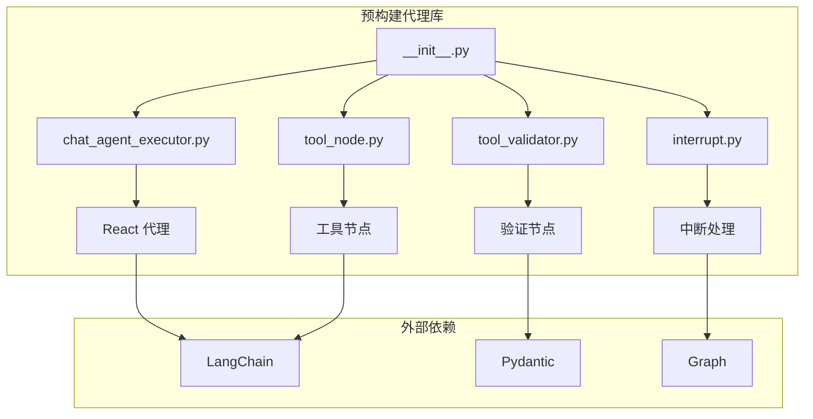
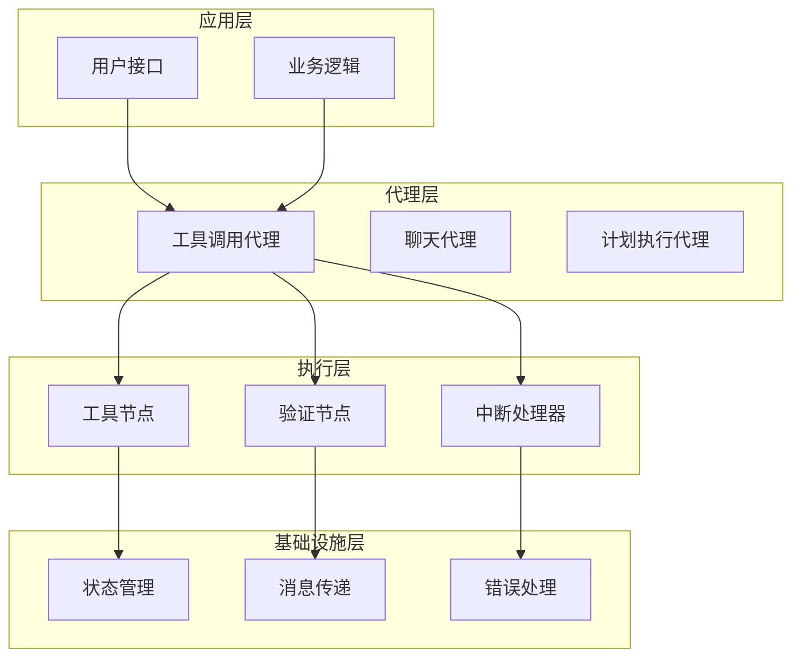
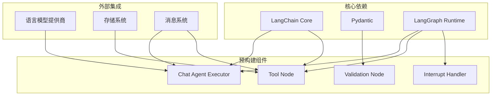

# 预构建代理 API

<cite>
**本文档引用的文件**
- [libs/prebuilt/langgraph/prebuilt/__init__.py](file://libs/prebuilt/langgraph/prebuilt/__init__.py)
- [libs/prebuilt/langgraph/prebuilt/chat_agent_executor.py](file://libs/prebuilt/langgraph/prebuilt/chat_agent_executor.py)
- [libs/prebuilt/langgraph/prebuilt/tool_node.py](file://libs/prebuilt/langgraph/prebuilt/tool_node.py)
- [libs/prebuilt/langgraph/prebuilt/tool_validator.py](file://libs/prebuilt/langgraph/prebuilt/tool_validator.py)
- [libs/prebuilt/langgraph/prebuilt/interrupt.py](file://libs/prebuilt/langgraph/prebuilt/interrupt.py)
- [libs/prebuilt/README.md](file://libs/prebuilt/README.md)
</cite>

## 目录
1. [简介](#简介)
2. [项目结构](#项目结构)
3. [核心组件](#核心组件)
4. [架构概览](#架构概览)
5. [详细组件分析](#详细组件分析)
6. [依赖关系分析](#依赖关系分析)
7. [性能考虑](#性能考虑)
8. [故障排除指南](#故障排除指南)
9. [结论](#结论)

## 简介

LangGraph 预构建库提供了高级 API 来创建和执行智能代理以及工具。该库专注于简化常见代理模式的实现，包括工具调用代理、聊天代理和计划-执行代理。

该库的主要目标是为开发者提供即用型的代理解决方案，同时保持高度的可定制性和扩展性。通过预构建的组件，开发者可以快速搭建复杂的智能代理系统，而无需从头开始实现所有功能。

## 项目结构

预构建代理库采用模块化设计，将不同功能的组件分离到独立的模块中：



**图表来源**
- [libs/prebuilt/langgraph/prebuilt/__init__.py:1-22](file://libs/prebuilt/langgraph/prebuilt/__init__.py#L1-L22)
- [libs/prebuilt/langgraph/prebuilt/chat_agent_executor.py:1-50](file://libs/prebuilt/langgraph/prebuilt/chat_agent_executor.py#L1-L50)

**章节来源**
- [libs/prebuilt/langgraph/prebuilt/__init__.py:1-22](file://libs/prebuilt/langgraph/prebuilt/__init__.py#L1-L22)
- [libs/prebuilt/README.md:1-117](file://libs/prebuilt/README.md#L1-L117)

## 核心组件

预构建代理库提供了四个核心组件，每个都针对特定的代理模式进行了优化：

### 工具调用代理 (Tool Calling Agent)

工具调用代理是最复杂的代理类型，支持循环工具调用、状态管理和人类中断。它实现了 ReAct（推理-行动）范式，允许代理在思考和行动之间进行切换。

### 工具节点 (Tool Node)

工具节点负责执行实际的工具调用，支持并行执行、错误处理和状态注入。它提供了灵活的工具执行框架，支持各种工具类型和参数注入方式。

### 验证节点 (Validation Node)

验证节点专门用于验证工具调用的有效性，不实际执行工具，而是返回验证结果。这对于需要生成符合复杂模式的结构化输出的场景非常有用。

### 中断处理 (Interrupt Handler)

中断处理机制允许在代理执行过程中暂停执行，等待人类输入或外部决策。这为需要人工干预的代理系统提供了基础支持。

**章节来源**
- [libs/prebuilt/langgraph/prebuilt/chat_agent_executor.py:278-516](file://libs/prebuilt/langgraph/prebuilt/chat_agent_executor.py#L278-L516)
- [libs/prebuilt/langgraph/prebuilt/tool_node.py:619-736](file://libs/prebuilt/langgraph/prebuilt/tool_node.py#L619-L736)
- [libs/prebuilt/langgraph/prebuilt/tool_validator.py:47-114](file://libs/prebuilt/langgraph/prebuilt/tool_validator.py#L47-L114)

## 架构概览

预构建代理库采用分层架构设计，每层都有明确的职责分工：



**图表来源**
- [libs/prebuilt/langgraph/prebuilt/chat_agent_executor.py:862-1002](file://libs/prebuilt/langgraph/prebuilt/chat_agent_executor.py#L862-L1002)
- [libs/prebuilt/langgraph/prebuilt/tool_node.py:619-736](file://libs/prebuilt/langgraph/prebuilt/tool_node.py#L619-L736)

## 详细组件分析

### 工具调用代理 (create_react_agent)

工具调用代理是预构建库中最复杂的组件，实现了完整的 ReAct 代理模式。

#### 初始化参数

| 参数名 | 类型 | 默认值 | 描述 |
|--------|------|--------|------|
| model | LanguageModelLike | 必需 | 语言模型实例或字符串标识符 |
| tools | Sequence[BaseTool] | 必需 | 工具列表或ToolNode实例 |
| prompt | Prompt | None | 可选提示词 |
| response_format | StructuredResponseSchema | None | 可选响应格式 |
| pre_model_hook | RunnableLike | None | 模型前钩子函数 |
| post_model_hook | RunnableLike | None | 模型后钩子函数 |
| state_schema | StateSchemaType | None | 自定义状态模式 |
| context_schema | type[Any] | None | 运行时上下文模式 |
| checkpointer | Checkpointer | None | 状态检查点保存器 |
| store | BaseStore | None | 持久化存储 |
| interrupt_before | list[str] | None | 执行前中断点 |
| interrupt_after | list[str] | None | 执行后中断点 |
| debug | bool | False | 调试模式开关 |
| version | Literal["v1","v2"] | "v2" | 版本选择 |

#### 使用示例

```python
from langgraph.prebuilt import create_react_agent

def check_weather(location: str) -> str:
    """返回指定位置的天气预报"""
    return f"天气总是晴朗的在 {location}"

graph = create_react_agent(
    "anthropic:claude-3-7-sonnet-latest",
    tools=[check_weather],
    prompt="你是一个有用的助手",
)

inputs = {"messages": [{"role": "user", "content": "旧金山的天气如何"}]}
for chunk in graph.stream(inputs, stream_mode="updates"):
    print(chunk)
```

#### 关键特性

1. **动态模型选择**：支持运行时动态选择不同的语言模型
2. **版本兼容**：支持 v1 和 v2 两种工具执行模式
3. **钩子系统**：提供模型前后钩子函数进行自定义处理
4. **人类中断**：支持在关键节点暂停等待人工确认
5. **状态管理**：内置状态检查点和持久化机制

**章节来源**
- [libs/prebuilt/langgraph/prebuilt/chat_agent_executor.py:278-516](file://libs/prebuilt/langgraph/prebuilt/chat_agent_executor.py#L278-L516)
- [libs/prebuilt/README.md:16-36](file://libs/prebuilt/README.md#L16-L36)

### 工具节点 (ToolNode)

工具节点提供了灵活的工具执行框架，支持多种工具类型和参数注入方式。

#### 初始化参数

| 参数名 | 类型 | 默认值 | 描述 |
|--------|------|--------|------|
| tools | Sequence[BaseTool | Callable] | 必需 | 工具序列 |
| name | str | "tools" | 节点名称 |
| tags | list[str] | None | 元数据标签 |
| handle_tool_errors | 多种类型 | _default_handle_tool_errors | 错误处理配置 |
| messages_key | str | "messages" | 状态消息键名 |
| wrap_tool_call | ToolCallWrapper | None | 同步工具调用包装器 |
| awrap_tool_call | AsyncToolCallWrapper | None | 异步工具调用包装器 |

#### 工具参数注入

工具节点支持三种类型的参数注入：

1. **状态注入**：使用 `InjectedState` 注解注入图状态
2. **存储注入**：使用 `InjectedStore` 注解注入持久化存储
3. **运行时注入**：使用 `ToolRuntime` 注入运行时上下文

#### 错误处理策略

工具节点提供了灵活的错误处理机制：

- **布尔值配置**：捕获所有异常并返回错误消息
- **字符串配置**：捕获所有异常并返回自定义错误消息
- **类型配置**：仅捕获指定类型的异常
- **元组配置**：捕获多个指定类型的异常
- **回调函数**：自定义错误处理逻辑
- **禁用配置**：不进行错误处理，直接抛出异常

**章节来源**
- [libs/prebuilt/langgraph/prebuilt/tool_node.py:740-789](file://libs/prebuilt/langgraph/prebuilt/tool_node.py#L740-L789)
- [libs/prebuilt/langgraph/prebuilt/tool_node.py:1471-1548](file://libs/prebuilt/langgraph/prebuilt/tool_node.py#L1471-L1548)

### 验证节点 (ValidationNode)

验证节点专门用于验证工具调用的有效性，不实际执行工具。

#### 初始化参数

| 参数名 | 类型 | 默认值 | 描述 |
|--------|------|--------|------|
| schemas | Sequence[BaseTool | type[BaseModel] | Callable] | 必需 | 验证模式序列 |
| format_error | Callable | _default_format_error | 错误格式化函数 |
| name | str | "validation" | 节点名称 |
| tags | list[str] | None | 元数据标签 |

#### 验证模式支持

验证节点支持以下类型的验证模式：

1. **Pydantic 模式**：直接使用 Pydantic BaseModel 类
2. **工具模式**：使用具有 args_schema 的 BaseTool 实例
3. **函数模式**：从函数签名自动创建模式

#### 使用示例

```python
from pydantic import BaseModel, field_validator
from langgraph.prebuilt import ValidationNode
from langchain_core.messages import AIMessage

class SelectNumber(BaseModel):
    a: int

    @field_validator("a")
    def a_must_be_meaningful(cls, v):
        if v != 37:
            raise ValueError("只允许 37")

validation_node = ValidationNode([SelectNumber])
result = validation_node.invoke({
    "messages": [AIMessage("", tool_calls=[{"name": "SelectNumber", "args": {"a": 42}, "id": "1"}])]
})
```

**章节来源**
- [libs/prebuilt/langgraph/prebuilt/tool_validator.py:116-166](file://libs/prebuilt/langgraph/prebuilt/tool_validator.py#L116-L166)
- [libs/prebuilt/README.md:62-85](file://libs/prebuilt/README.md#L62-L85)

### 中断处理 (HumanInterrupt)

中断处理机制允许在代理执行过程中暂停执行，等待人类输入或外部决策。

#### 中断配置

| 参数名 | 类型 | 描述 |
|--------|------|------|
| allow_ignore | bool | 是否允许忽略当前步骤 |
| allow_respond | bool | 是否允许提供文本响应/反馈 |
| allow_edit | bool | 是否允许编辑提供的内容/状态 |
| allow_accept | bool | 是否允许接受/批准当前状态 |

#### 中断请求

| 参数名 | 类型 | 描述 |
|--------|------|------|
| action | str | 请求的操作类型或名称 |
| args | dict | 操作所需的参数键值对 |

#### 响应类型

| 类型 | 描述 | 参数 |
|------|------|------|
| accept | 接受当前状态无更改 | None |
| ignore | 忽略/跳过当前步骤 | None |
| response | 提供文本反馈或指令 | str |
| edit | 修改当前状态/内容 | ActionRequest |

**章节来源**
- [libs/prebuilt/langgraph/prebuilt/interrupt.py:11-26](file://libs/prebuilt/langgraph/prebuilt/interrupt.py#L11-L26)
- [libs/prebuilt/langgraph/prebuilt/interrupt.py:87-105](file://libs/prebuilt/langgraph/prebuilt/interrupt.py#L87-L105)

## 依赖关系分析

预构建代理库的依赖关系体现了清晰的分层架构：



**图表来源**
- [libs/prebuilt/langgraph/prebuilt/chat_agent_executor.py:13-45](file://libs/prebuilt/langgraph/prebuilt/chat_agent_executor.py#L13-L45)
- [libs/prebuilt/langgraph/prebuilt/tool_node.py:63-91](file://libs/prebuilt/langgraph/prebuilt/tool_node.py#L63-L91)

**章节来源**
- [libs/prebuilt/langgraph/prebuilt/chat_agent_executor.py:1-50](file://libs/prebuilt/langgraph/prebuilt/chat_agent_executor.py#L1-L50)
- [libs/prebuilt/langgraph/prebuilt/tool_node.py:1-50](file://libs/prebuilt/langgraph/prebuilt/tool_node.py#L1-L50)

## 性能考虑

预构建代理库在设计时充分考虑了性能优化：

### 并行执行优化

工具节点支持并行执行多个工具调用，显著提高了执行效率。通过使用线程池和异步执行机制，可以充分利用系统资源。

### 内存管理

- **状态压缩**：定期清理不需要的消息历史
- **增量更新**：只更新必要的状态字段
- **内存池**：重用对象避免频繁分配

### 缓存机制

- **工具调用缓存**：缓存重复的工具调用结果
- **模型响应缓存**：缓存相似的模型响应
- **状态快照**：定期保存状态快照用于快速恢复

### 扩展性设计

- **插件架构**：支持自定义工具和中间件
- **钩子系统**：提供丰富的扩展点
- **配置驱动**：通过配置文件实现灵活定制

## 故障排除指南

### 常见问题及解决方案

#### 工具调用失败

**问题**：工具调用返回错误或异常
**解决方案**：
1. 检查工具参数是否正确
2. 验证工具权限设置
3. 查看错误日志获取详细信息

#### 代理循环卡死

**问题**：代理陷入无限循环
**解决方案**：
1. 检查 `remaining_steps` 配置
2. 验证工具调用条件判断逻辑
3. 设置适当的超时限制

#### 状态同步问题

**问题**：多线程环境下状态不一致
**解决方案**：
1. 使用检查点保存器
2. 实现适当的锁机制
3. 避免共享可变状态

#### 内存泄漏

**问题**：长时间运行后内存占用持续增长
**解决方案**：
1. 定期清理消息历史
2. 使用弱引用避免循环引用
3. 实施内存监控和告警

**章节来源**
- [libs/prebuilt/langgraph/prebuilt/tool_node.py:337-379](file://libs/prebuilt/langgraph/prebuilt/tool_node.py#L337-L379)
- [libs/prebuilt/langgraph/prebuilt/chat_agent_executor.py:243-272](file://libs/prebuilt/langgraph/prebuilt/chat_agent_executor.py#L243-L272)

## 结论

LangGraph 预构建代理库为开发者提供了一套完整、灵活且高性能的代理解决方案。通过模块化的架构设计和丰富的配置选项，该库能够满足各种复杂的代理应用场景。

### 主要优势

1. **易用性**：提供简化的 API 接口，降低学习成本
2. **灵活性**：支持多种代理模式和自定义扩展
3. **性能**：优化的执行引擎和内存管理
4. **可靠性**：完善的错误处理和状态管理机制
5. **可扩展性**：插件架构支持功能扩展

### 适用场景

- **聊天机器人**：基于工具调用的智能对话系统
- **工作流自动化**：复杂的业务流程自动化
- **数据分析**：多步骤的数据处理和分析任务
- **客户服务**：智能客服和问题解决系统
- **内容创作**：辅助内容生成和编辑的智能系统

通过合理选择和组合预构建组件，开发者可以快速构建出功能强大、性能优异的智能代理系统，为用户提供卓越的智能化体验。