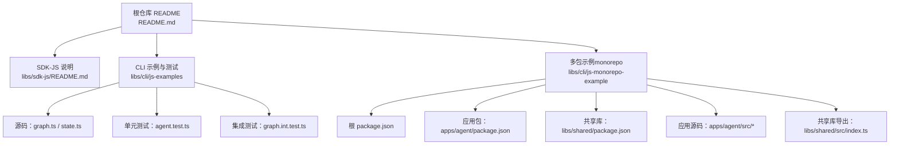
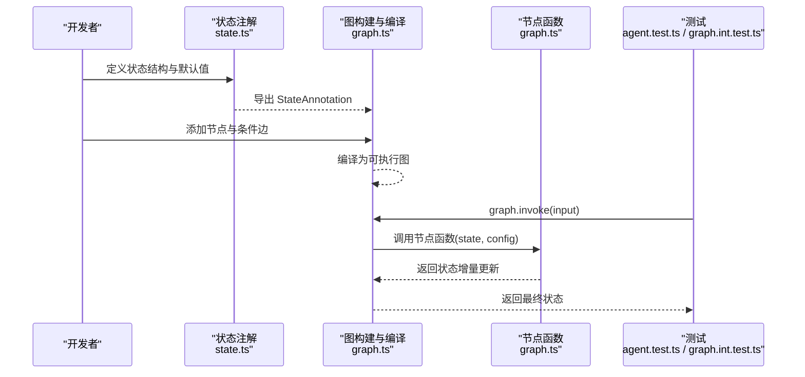
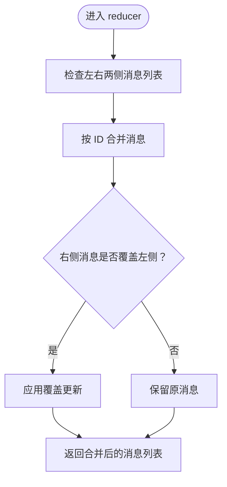
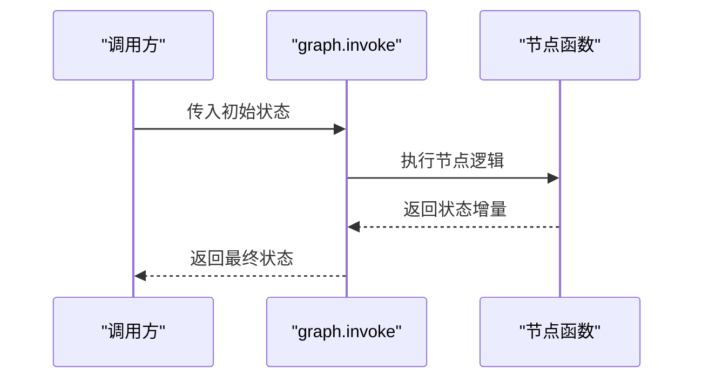
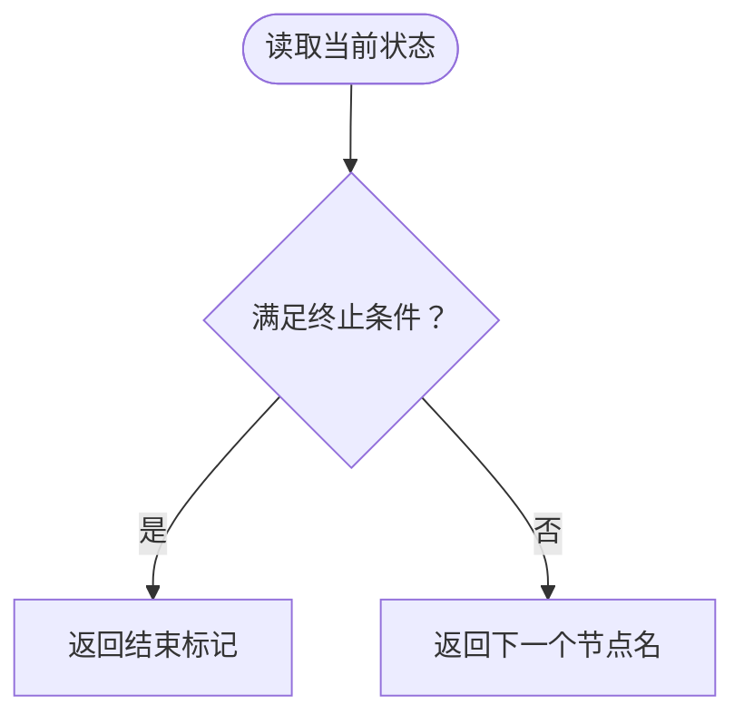
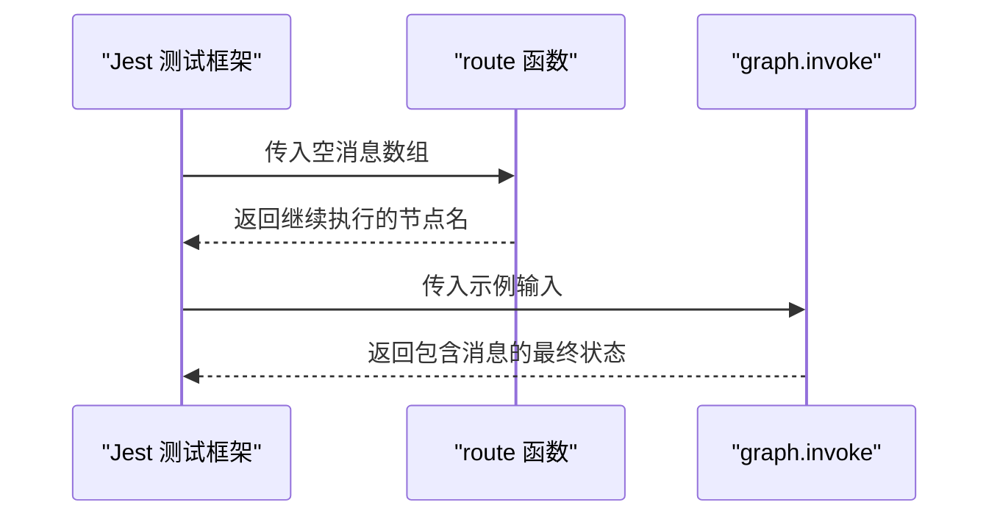
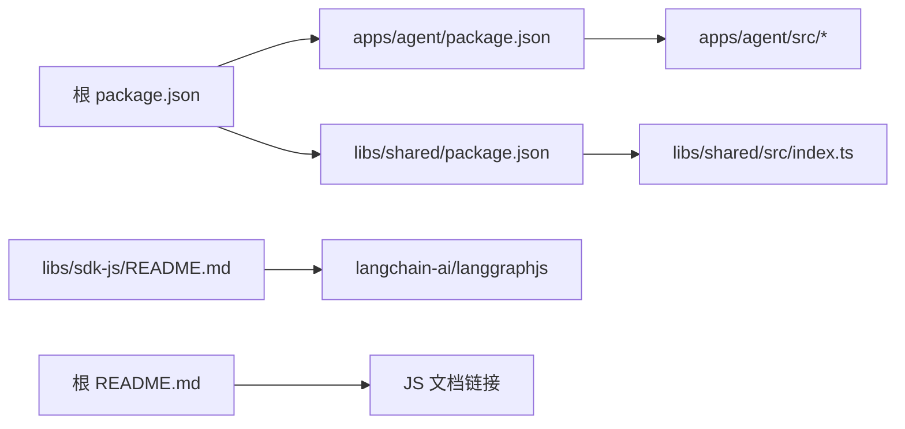

# JavaScript SDK

<cite>
**本文引用的文件**
- [README.md](file://README.md)
- [libs/sdk-js/README.md](file://libs/sdk-js/README.md)
- [libs/cli/js-examples/src/agent/graph.ts](file://libs/cli/js-examples/src/agent/graph.ts)
- [libs/cli/js-examples/src/agent/state.ts](file://libs/cli/js-examples/src/agent/state.ts)
- [libs/cli/js-examples/tests/agent.test.ts](file://libs/cli/js-examples/tests/agent.test.ts)
- [libs/cli/js-examples/tests/graph.int.test.ts](file://libs/cli/js-examples/tests/graph.int.test.ts)
- [libs/cli/js-monorepo-example/package.json](file://libs/cli/js-monorepo-example/package.json)
- [libs/cli/js-monorepo-example/apps/agent/package.json](file://libs/cli/js-monorepo-example/apps/agent/package.json)
- [libs/cli/js-monorepo-example/libs/shared/package.json](file://libs/cli/js-monorepo-example/libs/shared/package.json)
- [libs/cli/js-monorepo-example/apps/agent/src/graph.ts](file://libs/cli/js-monorepo-example/apps/agent/src/graph.ts)
- [libs/cli/js-monorepo-example/apps/agent/src/state.ts](file://libs/cli/js-monorepo-example/apps/agent/src/state.ts)
- [libs/cli/js-monorepo-example/libs/shared/src/index.ts](file://libs/cli/js-monorepo-example/libs/shared/src/index.ts)
</cite>

## 目录
1. [简介](#简介)
2. [项目结构](#项目结构)
3. [核心组件](#核心组件)
4. [架构总览](#架构总览)
5. [详细组件分析](#详细组件分析)
6. [依赖分析](#依赖分析)
7. [性能考虑](#性能考虑)
8. [故障排查指南](#故障排查指南)
9. [结论](#结论)
10. [附录](#附录)

## 简介
本文件面向 LangGraph JavaScript SDK 的使用者与集成者，系统性梳理安装与导入、浏览器与 Node.js 差异、客户端初始化与配置、连接建立流程、API 使用（Promise 与 async/await）、TypeScript 类型与接口、典型使用场景（前端集成、后端服务调用）、错误处理与重连策略、以及性能优化建议。  
根据仓库信息，官方 JavaScript SDK 已迁移至独立仓库 langchain-ai/langgraphjs，本文在不直接复述外部仓库内容的前提下，基于当前仓库中可验证的示例与配置进行说明，并给出与官方文档的对应关系指引。

章节来源
- [README.md:32-34](file://README.md#L32-L34)
- [libs/sdk-js/README.md:1](file://libs/sdk-js/README.md#L1)

## 项目结构
本仓库中与 JavaScript/TypeScript 相关的关键位置如下：
- 示例与测试：libs/cli/js-examples
- 多包示例（monorepo）：libs/cli/js-monorepo-example
- SDK-JS 说明：libs/sdk-js/README.md 指向官方迁移地址

图表来源
- [README.md:1-83](file://README.md#L1-L83)
- [libs/sdk-js/README.md:1](file://libs/sdk-js/README.md#L1)
- [libs/cli/js-examples/src/agent/graph.ts:1-105](file://libs/cli/js-examples/src/agent/graph.ts#L1-L105)
- [libs/cli/js-examples/src/agent/state.ts:1-60](file://libs/cli/js-examples/src/agent/state.ts#L1-L60)
- [libs/cli/js-examples/tests/agent.test.ts:1-9](file://libs/cli/js-examples/tests/agent.test.ts#L1-L9)
- [libs/cli/js-examples/tests/graph.int.test.ts:1-19](file://libs/cli/js-examples/tests/graph.int.test.ts#L1-L19)
- [libs/cli/js-monorepo-example/package.json:1-35](file://libs/cli/js-monorepo-example/package.json#L1-L35)
- [libs/cli/js-monorepo-example/apps/agent/package.json](file://libs/cli/js-monorepo-example/apps/agent/package.json)
- [libs/cli/js-monorepo-example/libs/shared/package.json](file://libs/cli/js-monorepo-example/libs/shared/package.json)
- [libs/cli/js-monorepo-example/apps/agent/src/graph.ts](file://libs/cli/js-monorepo-example/apps/agent/src/graph.ts)
- [libs/cli/js-monorepo-example/apps/agent/src/state.ts](file://libs/cli/js-monorepo-example/apps/agent/src/state.ts)
- [libs/cli/js-monorepo-example/libs/shared/src/index.ts:1-7](file://libs/cli/js-monorepo-example/libs/shared/src/index.ts#L1-L7)

章节来源
- [libs/cli/js-examples/src/agent/graph.ts:1-105](file://libs/cli/js-examples/src/agent/graph.ts#L1-L105)
- [libs/cli/js-examples/src/agent/state.ts:1-60](file://libs/cli/js-examples/src/agent/state.ts#L1-L60)
- [libs/cli/js-examples/tests/agent.test.ts:1-9](file://libs/cli/js-examples/tests/agent.test.ts#L1-L9)
- [libs/cli/js-examples/tests/graph.int.test.ts:1-19](file://libs/cli/js-examples/tests/graph.int.test.ts#L1-L19)
- [libs/cli/js-monorepo-example/package.json:1-35](file://libs/cli/js-monorepo-example/package.json#L1-L35)
- [libs/cli/js-monorepo-example/apps/agent/package.json](file://libs/cli/js-monorepo-example/apps/agent/package.json)
- [libs/cli/js-monorepo-example/libs/shared/package.json](file://libs/cli/js-monorepo-example/libs/shared/package.json)
- [libs/cli/js-monorepo-example/apps/agent/src/graph.ts](file://libs/cli/js-monorepo-example/apps/agent/src/graph.ts)
- [libs/cli/js-monorepo-example/apps/agent/src/state.ts](file://libs/cli/js-monorepo-example/apps/agent/src/state.ts)
- [libs/cli/js-monorepo-example/libs/shared/src/index.ts:1-7](file://libs/cli/js-monorepo-example/libs/shared/src/index.ts#L1-L7)

## 核心组件
- 状态注解与消息归并器：通过 Annotation.Root 定义图的状态结构、默认值与 reducer，确保消息通道按约定合并与更新。
- 图构建与编译：使用 StateGraph 构建节点与条件边，最终 compile 得到可执行的 graph。
- 节点函数：异步节点函数接收当前状态与可选配置，返回对状态的增量更新；路由函数决定下一步执行的节点或结束。
- 测试：单元测试验证路由逻辑，集成测试验证 graph.invoke 的行为与输出格式。

章节来源
- [libs/cli/js-examples/src/agent/state.ts:11-60](file://libs/cli/js-examples/src/agent/state.ts#L11-L60)
- [libs/cli/js-examples/src/agent/graph.ts:17-105](file://libs/cli/js-examples/src/agent/graph.ts#L17-L105)
- [libs/cli/js-examples/tests/agent.test.ts:1-9](file://libs/cli/js-examples/tests/agent.test.ts#L1-L9)
- [libs/cli/js-examples/tests/graph.int.test.ts:1-19](file://libs/cli/js-examples/tests/graph.int.test.ts#L1-L19)

## 架构总览
下图展示了从“状态注解”到“节点函数”再到“图编译”的端到端流程，以及测试如何驱动该流程：

图表来源
- [libs/cli/js-examples/src/agent/state.ts:11-60](file://libs/cli/js-examples/src/agent/state.ts#L11-L60)
- [libs/cli/js-examples/src/agent/graph.ts:87-105](file://libs/cli/js-examples/src/agent/graph.ts#L87-L105)
- [libs/cli/js-examples/tests/graph.int.test.ts:5-17](file://libs/cli/js-examples/tests/graph.int.test.ts#L5-L17)

## 详细组件分析

### 组件一：状态注解与消息通道
- 关键点
  - 使用 Annotation.Root 声明状态字段与默认值。
  - 使用 messagesStateReducer 对消息列表进行合并与去重。
  - 支持扩展其他自定义字段（如检索结果、提取实体等）。
- 复杂度与性能
  - 消息合并的时间复杂度与消息数量线性相关；合理控制消息长度可降低开销。
- 错误处理
  - 若传入的消息类型不符合预期，需在节点函数中进行校验与转换，避免 reducer 异常。

图表来源
- [libs/cli/js-examples/src/agent/state.ts:47-50](file://libs/cli/js-examples/src/agent/state.ts#L47-L50)

章节来源
- [libs/cli/js-examples/src/agent/state.ts:11-60](file://libs/cli/js-examples/src/agent/state.ts#L11-L60)

### 组件二：图构建与节点函数
- 关键点
  - 通过 StateGraph.addNode 注册节点函数。
  - 使用 addEdge 与 addConditionalEdges 定义执行路径。
  - graph.compile() 生成可执行实例；graph.invoke() 作为主入口。
- 并发与顺序
  - 节点函数应保持幂等与无副作用，避免并发写入导致状态不一致。
- 错误处理
  - 在节点函数内部捕获异常并返回安全的错误状态或提示消息。

图表来源
- [libs/cli/js-examples/src/agent/graph.ts:87-105](file://libs/cli/js-examples/src/agent/graph.ts#L87-L105)
- [libs/cli/js-examples/src/agent/graph.ts:17-68](file://libs/cli/js-examples/src/agent/graph.ts#L17-L68)

章节来源
- [libs/cli/js-examples/src/agent/graph.ts:17-105](file://libs/cli/js-examples/src/agent/graph.ts#L17-L105)

### 组件三：路由与条件边
- 关键点
  - 路由函数根据当前状态返回下一节点名称或结束标记。
  - 条件边用于动态分支，提升图的灵活性。
- 性能与可维护性
  - 将路由逻辑拆分为纯函数，便于单元测试与复用。

图表来源
- [libs/cli/js-examples/src/agent/graph.ts:77-85](file://libs/cli/js-examples/src/agent/graph.ts#L77-L85)

章节来源
- [libs/cli/js-examples/src/agent/graph.ts:77-85](file://libs/cli/js-examples/src/agent/graph.ts#L77-L85)

### 组件四：测试与验证
- 单元测试：验证路由函数在不同输入下的返回值。
- 集成测试：验证 graph.invoke 的整体行为与输出格式。

图表来源
- [libs/cli/js-examples/tests/agent.test.ts:4-7](file://libs/cli/js-examples/tests/agent.test.ts#L4-L7)
- [libs/cli/js-examples/tests/graph.int.test.ts:5-17](file://libs/cli/js-examples/tests/graph.int.test.ts#L5-L17)

章节来源
- [libs/cli/js-examples/tests/agent.test.ts:1-9](file://libs/cli/js-examples/tests/agent.test.ts#L1-L9)
- [libs/cli/js-examples/tests/graph.int.test.ts:1-19](file://libs/cli/js-examples/tests/graph.int.test.ts#L1-L19)

## 依赖分析
- 包管理与工作区
  - 根 package.json 使用工作区配置，统一管理 apps 与 libs。
  - 应用包与共享库各自拥有独立的 package.json，便于模块化复用。
- 示例与测试
  - js-examples 提供最小可运行示例与测试，便于理解 SDK 的基本用法。
- 与官方 SDK 的关系
  - libs/sdk-js/README.md 明确指出 JS SDK 已迁移至 langchain-ai/langgraphjs。
  - 根 README.md 提供了 JS 文档与快速开始的链接。

图表来源
- [libs/cli/js-monorepo-example/package.json:7-10](file://libs/cli/js-monorepo-example/package.json#L7-L10)
- [libs/cli/js-monorepo-example/apps/agent/package.json](file://libs/cli/js-monorepo-example/apps/agent/package.json)
- [libs/cli/js-monorepo-example/libs/shared/package.json](file://libs/cli/js-monorepo-example/libs/shared/package.json)
- [libs/cli/js-monorepo-example/apps/agent/src/graph.ts](file://libs/cli/js-monorepo-example/apps/agent/src/graph.ts)
- [libs/cli/js-monorepo-example/apps/agent/src/state.ts](file://libs/cli/js-monorepo-example/apps/agent/src/state.ts)
- [libs/cli/js-monorepo-example/libs/shared/src/index.ts:1-7](file://libs/cli/js-monorepo-example/libs/shared/src/index.ts#L1-L7)
- [libs/sdk-js/README.md:1](file://libs/sdk-js/README.md#L1)
- [README.md:32-34](file://README.md#L32-L34)

章节来源
- [libs/cli/js-monorepo-example/package.json:1-35](file://libs/cli/js-monorepo-example/package.json#L1-L35)
- [libs/cli/js-monorepo-example/apps/agent/package.json](file://libs/cli/js-monorepo-example/apps/agent/package.json)
- [libs/cli/js-monorepo-example/libs/shared/package.json](file://libs/cli/js-monorepo-example/libs/shared/package.json)
- [libs/cli/js-monorepo-example/apps/agent/src/graph.ts](file://libs/cli/js-monorepo-example/apps/agent/src/graph.ts)
- [libs/cli/js-monorepo-example/apps/agent/src/state.ts](file://libs/cli/js-monorepo-example/apps/agent/src/state.ts)
- [libs/cli/js-monorepo-example/libs/shared/src/index.ts:1-7](file://libs/cli/js-monorepo-example/libs/shared/src/index.ts#L1-L7)
- [libs/sdk-js/README.md:1](file://libs/sdk-js/README.md#L1)
- [README.md:32-34](file://README.md#L32-L34)

## 性能考虑
- 控制消息规模：减少不必要的消息条目，避免 reducer 合并成本过高。
- 并行与串行：仅在节点间无共享状态依赖时考虑并行执行，否则保持串行以保证一致性。
- 超时与重试：在远程调用场景下，合理设置超时与重试策略，避免阻塞主线程。
- 内存与持久化：对于长会话或多轮交互，结合持久化存储与检查点机制，减少重复计算。

## 故障排查指南
- 路由错误
  - 现象：graph.invoke 返回意外的节点名或未触发结束。
  - 排查：检查路由函数的判定条件与边界输入，优先通过单元测试覆盖。
- 状态不一致
  - 现象：消息列表出现重复或覆盖异常。
  - 排查：确认 reducer 的合并逻辑与消息 ID 规范，必要时在节点函数中显式规范化消息。
- 集成测试失败
  - 现象：集成测试断言失败或超时。
  - 排查：逐步缩小输入范围，验证 graph.invoke 的中间状态，关注最后一条消息的内容与格式。

章节来源
- [libs/cli/js-examples/tests/agent.test.ts:4-7](file://libs/cli/js-examples/tests/agent.test.ts#L4-L7)
- [libs/cli/js-examples/tests/graph.int.test.ts:5-17](file://libs/cli/js-examples/tests/graph.int.test.ts#L5-L17)

## 结论
本仓库提供了 LangGraph JavaScript 示例与测试，展示了状态注解、节点函数、路由与图编译的基本用法。对于更完整的 JavaScript SDK 功能与 API，建议参考官方迁移后的仓库与文档链接。在实际项目中，建议结合 monorepo 结构进行模块化组织，并通过单元与集成测试保障行为正确性。

## 附录

### 安装与导入（基于仓库示例）
- 仓库示例采用模块化与工作区管理，具体依赖声明位于各包的 package.json 中。
- 如需在浏览器与 Node.js 环境中使用，请参考官方 JS 文档与 SDK 迁移说明。

章节来源
- [libs/cli/js-monorepo-example/package.json:1-35](file://libs/cli/js-monorepo-example/package.json#L1-L35)
- [libs/cli/js-monorepo-example/apps/agent/package.json](file://libs/cli/js-monorepo-example/apps/agent/package.json)
- [libs/cli/js-monorepo-example/libs/shared/package.json](file://libs/cli/js-monorepo-example/libs/shared/package.json)
- [libs/sdk-js/README.md:1](file://libs/sdk-js/README.md#L1)
- [README.md:32-34](file://README.md#L32-L34)

### 浏览器与 Node.js 使用差异
- 本仓库未提供浏览器专用示例；官方 JS 文档与 SDK 迁移说明可作为参考。
- 在浏览器中使用时，注意跨域、凭据传递与 CSP 策略；在 Node.js 中可利用环境变量与本地网络访问。

章节来源
- [libs/sdk-js/README.md:1](file://libs/sdk-js/README.md#L1)
- [README.md:32-34](file://README.md#L32-L34)

### 客户端初始化、配置与连接
- 本仓库示例聚焦于“图”层面的使用；远程客户端初始化与配置可参考官方 JS 文档与 SDK 迁移说明。
- 建议在应用启动阶段完成客户端初始化，并在需要时注入认证头与超时参数。

章节来源
- [libs/sdk-js/README.md:1](file://libs/sdk-js/README.md#L1)
- [README.md:32-34](file://README.md#L32-L34)

### API 参考（Promise 与 async/await）
- 图的主入口为 graph.invoke，返回 Promise；在测试中以 async/await 方式调用。
- 节点函数与路由函数遵循异步模式，便于与外部服务交互。

章节来源
- [libs/cli/js-examples/tests/graph.int.test.ts:7](file://libs/cli/js-examples/tests/graph.int.test.ts#L7)
- [libs/cli/js-examples/src/agent/graph.ts:17-68](file://libs/cli/js-examples/src/agent/graph.ts#L17-L68)

### TypeScript 类型与接口
- 状态注解通过 Annotation.Root 定义字段类型与默认值；消息通道使用消息类型与 reducer。
- 节点函数与路由函数的签名体现了 TypeScript 的静态类型约束。

章节来源
- [libs/cli/js-examples/src/agent/state.ts:11-60](file://libs/cli/js-examples/src/agent/state.ts#L11-L60)
- [libs/cli/js-examples/src/agent/graph.ts:17-85](file://libs/cli/js-examples/src/agent/graph.ts#L17-L85)

### 实际使用示例（前端与后端）
- 前端集成：可参考官方 JS 文档与 SDK 迁移说明，在浏览器中加载 SDK 并调用 graph.invoke。
- 后端服务：可在 Node.js 环境中通过工作区与包管理组织代码，结合测试验证行为。

章节来源
- [libs/sdk-js/README.md:1](file://libs/sdk-js/README.md#L1)
- [README.md:32-34](file://README.md#L32-L34)
- [libs/cli/js-monorepo-example/package.json:1-35](file://libs/cli/js-monorepo-example/package.json#L1-L35)

### 错误处理、重连与性能优化
- 错误处理：在节点函数内捕获异常并返回安全状态；在路由函数中明确终止条件。
- 重连机制：远程调用场景建议在客户端层实现指数退避与最大重试次数。
- 性能优化：控制消息规模、避免不必要的并发、合理设置超时与重试。

章节来源
- [libs/cli/js-examples/src/agent/graph.ts:17-68](file://libs/cli/js-examples/src/agent/graph.ts#L17-L68)
- [libs/cli/js-examples/tests/agent.test.ts:4-7](file://libs/cli/js-examples/tests/agent.test.ts#L4-L7)
- [libs/cli/js-examples/tests/graph.int.test.ts:5-17](file://libs/cli/js-examples/tests/graph.int.test.ts#L5-L17)