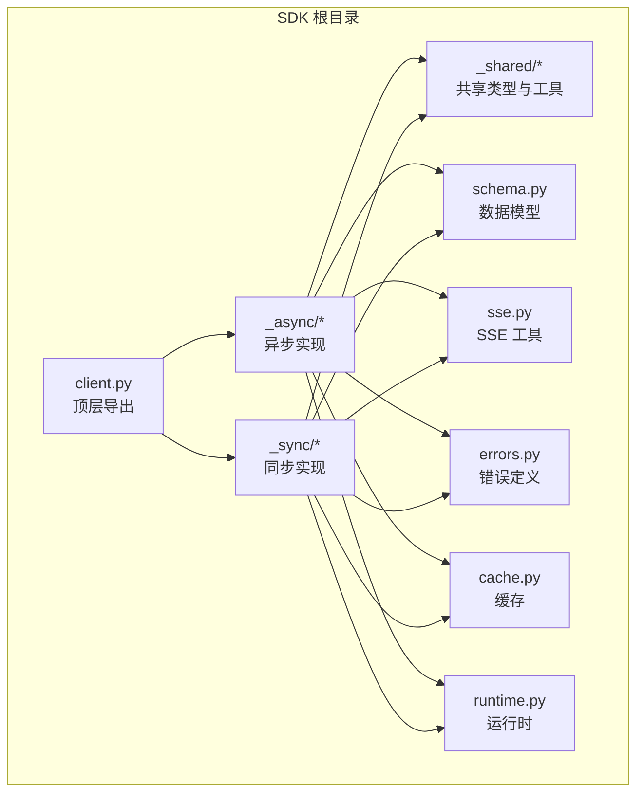
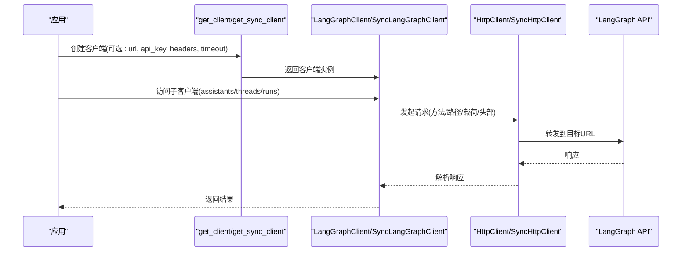
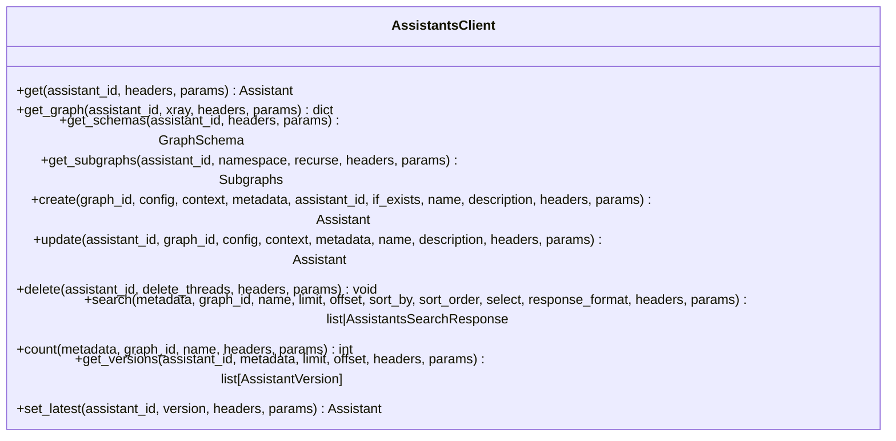
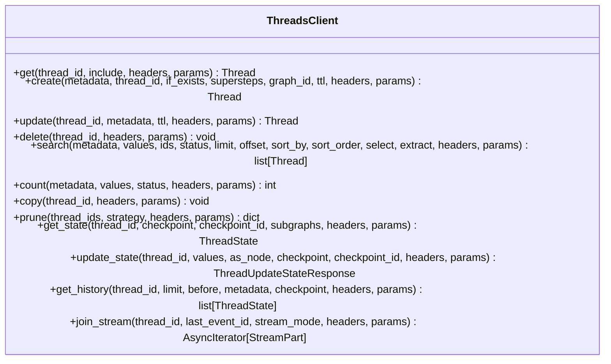
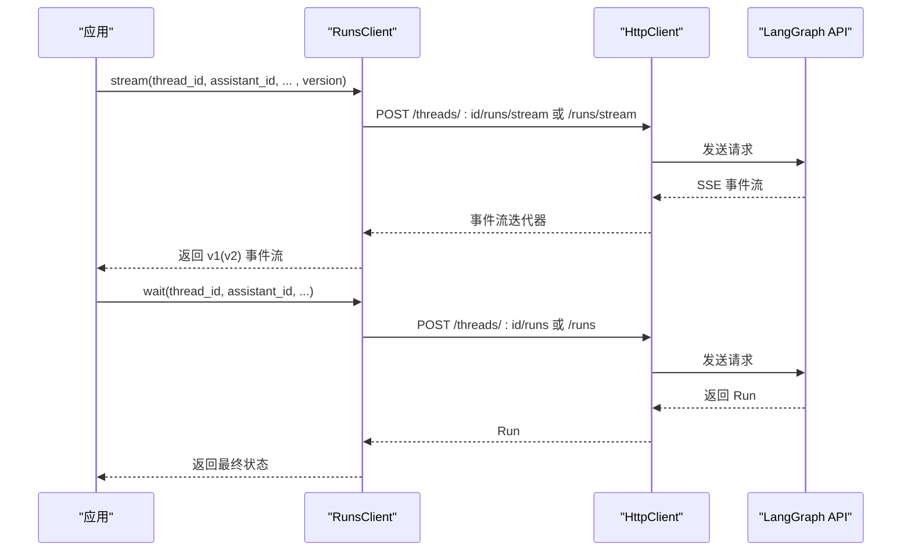
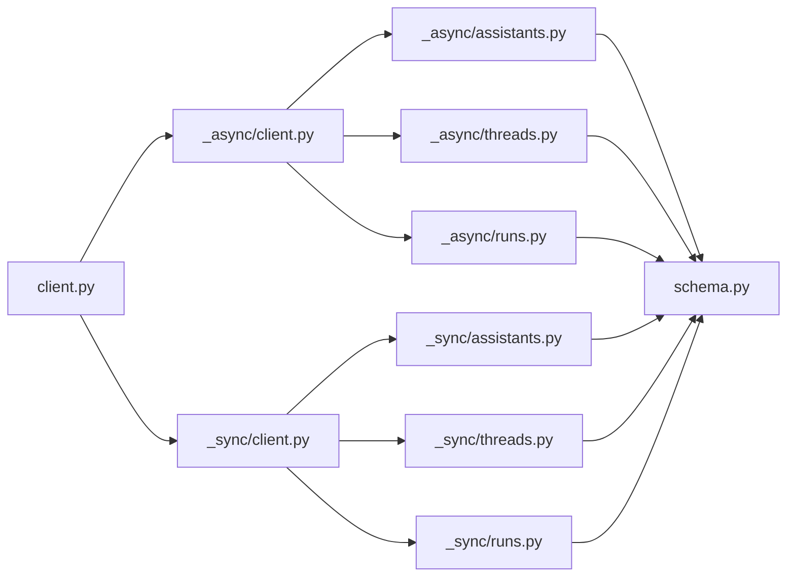

# Python SDK

<cite>
**本文引用的文件**
- [libs/sdk-py/README.md](file://libs/sdk-py/README.md)
- [libs/sdk-py/pyproject.toml](file://libs/sdk-py/pyproject.toml)
- [libs/sdk-py/langgraph_sdk/client.py](file://libs/sdk-py/langgraph_sdk/client.py)
- [libs/sdk-py/langgraph_sdk/_async/client.py](file://libs/sdk-py/langgraph_sdk/_async/client.py)
- [libs/sdk-py/langgraph_sdk/_sync/client.py](file://libs/sdk-py/langgraph_sdk/_sync/client.py)
- [libs/sdk-py/langgraph_sdk/_async/assistants.py](file://libs/sdk-py/langgraph_sdk/_async/assistants.py)
- [libs/sdk-py/langgraph_sdk/_sync/assistants.py](file://libs/sdk-py/langgraph_sdk/_sync/assistants.py)
- [libs/sdk-py/langgraph_sdk/_async/threads.py](file://libs/sdk-py/langgraph_sdk/_async/threads.py)
- [libs/sdk-py/langgraph_sdk/_sync/threads.py](file://libs/sdk-py/langgraph_sdk/_sync/threads.py)
- [libs/sdk-py/langgraph_sdk/_async/runs.py](file://libs/sdk-py/langgraph_sdk/_async/runs.py)
- [libs/sdk-py/langgraph_sdk/_sync/runs.py](file://libs/sdk-py/langgraph_sdk/_sync/runs.py)
</cite>

## 目录
1. [简介](#简介)
2. [项目结构](#项目结构)
3. [核心组件](#核心组件)
4. [架构总览](#架构总览)
5. [详细组件分析](#详细组件分析)
6. [依赖分析](#依赖分析)
7. [性能考虑](#性能考虑)
8. [故障排查指南](#故障排查指南)
9. [结论](#结论)
10. [附录](#附录)

## 简介
本文件为 LangGraph Python SDK 的系统化技术文档，覆盖安装与配置、同步与异步客户端使用、核心组件 API 参考（AssistantsClient、ThreadsClient、RunsClient 等）、连接管理与认证、错误处理策略，并提供性能优化建议与最佳实践。SDK 提供对 LangGraph API 的统一访问层，支持远程服务器与本地进程内连接两种模式。

## 项目结构
SDK 位于仓库的 libs/sdk-py 目录，采用分层设计：
- 入口导出：顶层 client.py 汇聚异步与同步客户端及工具函数
- 异步实现：langgraph_sdk/_async/* 提供异步客户端与 HTTP 封装
- 同步实现：langgraph_sdk/_sync/* 提供同步客户端与 HTTP 封装
- 共享类型与工具：langgraph_sdk/_shared/* 提供通用类型定义与工具函数
- Schema 定义：langgraph_sdk/schema.py 提供数据模型
- SSE 工具：langgraph_sdk/sse.py 提供事件流辅助
- 错误与加密：langgraph_sdk/errors.py、langgraph_sdk/encryption/types.py
- 运行时与缓存：langgraph_sdk/runtime.py、langgraph_sdk/cache.py

图表来源
- [libs/sdk-py/langgraph_sdk/client.py](file://libs/sdk-py/langgraph_sdk/client.py)
- [libs/sdk-py/langgraph_sdk/_async/client.py](file://libs/sdk-py/langgraph_sdk/_async/client.py)
- [libs/sdk-py/langgraph_sdk/_sync/client.py](file://libs/sdk-py/langgraph_sdk/_sync/client.py)

章节来源
- [libs/sdk-py/README.md](file://libs/sdk-py/README.md)
- [libs/sdk-py/pyproject.toml](file://libs/sdk-py/pyproject.toml)

## 核心组件
- LangGraphClient（异步）与 SyncLangGraphClient（同步）
  - 负责持有底层 HTTP 客户端，暴露子资源客户端：assistants、threads、runs、crons、store
  - 支持上下文管理（异步：aclose；同步：close）
- AssistantsClient / SyncAssistantsClient
  - 助手管理：创建、更新、删除、查询、版本管理、图与模式信息获取
- ThreadsClient / SyncThreadsClient
  - 线程管理：创建、更新、删除、搜索、计数、复制、修剪、状态读写、历史查询、事件流
- RunsClient / SyncRunsClient
  - 运行管理：创建后台运行、等待完成、批量创建、流式输出（支持 v1/v2）

章节来源
- [libs/sdk-py/langgraph_sdk/client.py](file://libs/sdk-py/langgraph_sdk/client.py)
- [libs/sdk-py/langgraph_sdk/_async/client.py](file://libs/sdk-py/langgraph_sdk/_async/client.py)
- [libs/sdk-py/langgraph_sdk/_sync/client.py](file://libs/sdk-py/langgraph_sdk/_sync/client.py)

## 架构总览
SDK 通过工厂函数创建客户端实例，内部以 httpx 客户端封装 HTTP 请求，按需选择本地进程内传输或远程 HTTP 传输。各子客户端（Assistants/Threads/Runs）基于统一的 HttpClient/SyncHttpClient 封装具体 API 调用。

图表来源
- [libs/sdk-py/langgraph_sdk/_async/client.py](file://libs/sdk-py/langgraph_sdk/_async/client.py)
- [libs/sdk-py/langgraph_sdk/_sync/client.py](file://libs/sdk-py/langgraph_sdk/_sync/client.py)

## 详细组件分析

### 安装与配置
- 安装包名与来源
  - 包名：langgraph-sdk
  - PyPI 地址：https://pypi.org/project/langgraph-sdk/
- 默认服务端点
  - 若未指定 url，默认指向本地进程内地址（用于与 LangGraph 服务同进程运行）
  - 如使用远程服务器，需显式传入 url
- 认证与头部
  - 支持通过 api_key 参数或环境变量注入认证头
  - 支持自定义 headers 并与认证头合并
- 超时设置
  - 支持 httpx.Timeout 实例、秒数或四元组 (connect, read, write, pool)
  - 默认超时：connect=5s, read=300s, write=300s, pool=5s

章节来源
- [libs/sdk-py/README.md](file://libs/sdk-py/README.md)
- [libs/sdk-py/pyproject.toml](file://libs/sdk-py/pyproject.toml)
- [libs/sdk-py/langgraph_sdk/_async/client.py](file://libs/sdk-py/langgraph_sdk/_async/client.py)
- [libs/sdk-py/langgraph_sdk/_sync/client.py](file://libs/sdk-py/langgraph_sdk/_sync/client.py)

### 同步客户端（SyncLangGraphClient）
- 使用场景
  - 非异步环境或需要阻塞式调用的场景
- 关键能力
  - 上下文管理：with 语句自动 close
  - 子客户端：assistants、threads、runs、crons、store
- 连接与传输
  - 使用 httpx.Client 与 httpx.HTTPTransport
  - 支持本地进程内 ASGI 传输注册（当 url 为 None 且满足条件时）

章节来源
- [libs/sdk-py/langgraph_sdk/_sync/client.py](file://libs/sdk-py/langgraph_sdk/_sync/client.py)

### 异步客户端（LangGraphClient）
- 使用场景
  - 异步应用、高并发、流式处理
- 关键能力
  - 上下文管理：async with 自动 aclose
  - 子客户端：assistants、threads、runs、crons、store
- 连接与传输
  - 使用 httpx.AsyncClient 与 httpx.AsyncHTTPTransport
  - 支持本地进程内 ASGI 传输（优先尝试在进程内连接，失败则回退）

章节来源
- [libs/sdk-py/langgraph_sdk/_async/client.py](file://libs/sdk-py/langgraph_sdk/_async/client.py)

### AssistantsClient（异步）
- 主要方法
  - get / get_graph / get_schemas / get_subgraphs
  - create / update / delete
  - search（支持“数组”或“对象”两种响应格式）
  - count
  - get_versions / set_latest
- 关键参数
  - graph_id、config、context、metadata、name、description、if_exists
  - 查询过滤：metadata、graph_id、name、limit、offset、sort_by、sort_order、select
  - 版本控制：version、metadata 过滤
- 返回值
  - Assistant、GraphSchema、Subgraphs、列表或带游标对象、版本列表、最新版本助手

图表来源
- [libs/sdk-py/langgraph_sdk/_async/assistants.py](file://libs/sdk-py/langgraph_sdk/_async/assistants.py)

章节来源
- [libs/sdk-py/langgraph_sdk/_async/assistants.py](file://libs/sdk-py/langgraph_sdk/_async/assistants.py)

### AssistantsClient（同步）
- 方法与参数同上，返回值为同步对象
- 适用场景：非异步环境下的助手管理

章节来源
- [libs/sdk-py/langgraph_sdk/_sync/assistants.py](file://libs/sdk-py/langgraph_sdk/_sync/assistants.py)

### ThreadsClient（异步）
- 主要方法
  - get / create / update / delete
  - search / count
  - copy / prune
  - get_state / update_state / get_history
  - join_stream（事件流）
- 关键参数
  - metadata、ttl、ids、status、sort_by、sort_order、select、extract
  - 状态：values、checkpoint、checkpoint_id、subgraphs
  - 流：stream_mode、last_event_id
- 返回值
  - Thread、ThreadState、ThreadUpdateStateResponse、历史列表、流迭代器

图表来源
- [libs/sdk-py/langgraph_sdk/_async/threads.py](file://libs/sdk-py/langgraph_sdk/_async/threads.py)

章节来源
- [libs/sdk-py/langgraph_sdk/_async/threads.py](file://libs/sdk-py/langgraph_sdk/_async/threads.py)

### ThreadsClient（同步）
- 方法与参数同上，返回值为同步对象
- 适用场景：非异步环境下的线程管理

章节来源
- [libs/sdk-py/langgraph_sdk/_sync/threads.py](file://libs/sdk-py/langgraph_sdk/_sync/threads.py)

### RunsClient（异步）
- 主要方法
  - stream（支持 v1/v2 事件流）
  - create（后台运行）
  - create_batch（批量后台运行）
  - wait（等待完成并返回最终状态）
- 关键参数
  - thread_id、assistant_id、input、command、stream_mode、metadata、config、context、checkpoint、interrupt_*、webhook、multitask_strategy、if_not_exists、after_seconds、langsmith_tracing、durability、version
- 返回值
  - 流迭代器（StreamPart 或 StreamPartV2）、Run、最终状态（列表或字典）

图表来源
- [libs/sdk-py/langgraph_sdk/_async/runs.py](file://libs/sdk-py/langgraph_sdk/_async/runs.py)

章节来源
- [libs/sdk-py/langgraph_sdk/_async/runs.py](file://libs/sdk-py/langgraph_sdk/_async/runs.py)

### RunsClient（同步）
- 方法与参数同上，返回值为同步对象
- 适用场景：非异步环境下的运行管理

章节来源
- [libs/sdk-py/langgraph_sdk/_sync/runs.py](file://libs/sdk-py/langgraph_sdk/_sync/runs.py)

## 依赖分析
- 外部依赖
  - httpx：HTTP 客户端（同步/异步）
  - orjson：高性能 JSON 编解码
- 内部模块耦合
  - 顶层 client.py 导出异步与同步客户端、工具函数
  - 各子客户端依赖共享的 HttpClient/SyncHttpClient
  - schema.py 提供统一的数据模型
- 循环依赖
  - 未发现循环导入；模块职责清晰，按层组织

图表来源
- [libs/sdk-py/langgraph_sdk/client.py](file://libs/sdk-py/langgraph_sdk/client.py)
- [libs/sdk-py/langgraph_sdk/_async/client.py](file://libs/sdk-py/langgraph_sdk/_async/client.py)
- [libs/sdk-py/langgraph_sdk/_sync/client.py](file://libs/sdk-py/langgraph_sdk/_sync/client.py)
- [libs/sdk-py/langgraph_sdk/_async/assistants.py](file://libs/sdk-py/langgraph_sdk/_async/assistants.py)
- [libs/sdk-py/langgraph_sdk/_async/threads.py](file://libs/sdk-py/langgraph_sdk/_async/threads.py)
- [libs/sdk-py/langgraph_sdk/_async/runs.py](file://libs/sdk-py/langgraph_sdk/_async/runs.py)
- [libs/sdk-py/langgraph_sdk/_sync/assistants.py](file://libs/sdk-py/langgraph_sdk/_sync/assistants.py)
- [libs/sdk-py/langgraph_sdk/_sync/threads.py](file://libs/sdk-py/langgraph_sdk/_sync/threads.py)
- [libs/sdk-py/langgraph_sdk/_sync/runs.py](file://libs/sdk-py/langgraph_sdk/_sync/runs.py)

章节来源
- [libs/sdk-py/pyproject.toml](file://libs/sdk-py/pyproject.toml)

## 性能考虑
- 传输与连接
  - 异步客户端默认启用重试传输，适合高并发与网络波动场景
  - 本地进程内连接优先尝试，避免跨进程开销
- 流式输出
  - 使用 stream 接口进行增量消费，降低内存峰值
  - v2 事件格式提供更稳定的结构化事件
- 超时与重试
  - 合理设置 read/write 超时，避免长时间阻塞
  - 对于批量操作（如 create_batch），减少往返次数
- 状态与历史
  - 使用 get_state 的 subgraphs 参数按需加载子图状态
  - 历史查询限制 limit，避免大范围扫描

## 故障排查指南
- 认证失败
  - 确认 api_key 设置或环境变量 LANGGRAPH_API_KEY/LANGSMITH_API_KEY/LANGCHAIN_API_KEY 是否正确
  - 自定义 headers 与认证头会合并，注意重复键覆盖
- 连接问题
  - 远程服务器：明确传入 url
  - 本地进程内：确保与 LangGraph 服务在同一进程中或允许延迟注册
- 超时与重试
  - 调整 timeout 参数或增加重试次数
- 事件流断连
  - 使用 last_event_id 恢复流
  - 检查 on_disconnect 与中断策略
- 错误处理
  - 使用 raise_error 控制 wait 行为
  - 捕获底层 HTTP 异常并结合响应头定位问题

章节来源
- [libs/sdk-py/langgraph_sdk/_async/client.py](file://libs/sdk-py/langgraph_sdk/_async/client.py)
- [libs/sdk-py/langgraph_sdk/_sync/client.py](file://libs/sdk-py/langgraph_sdk/_sync/client.py)
- [libs/sdk-py/langgraph_sdk/_async/runs.py](file://libs/sdk-py/langgraph_sdk/_async/runs.py)
- [libs/sdk-py/langgraph_sdk/_sync/runs.py](file://libs/sdk-py/langgraph_sdk/_sync/runs.py)

## 结论
LangGraph Python SDK 提供了统一、可扩展的客户端抽象，覆盖助手、线程、运行三大核心领域，并支持同步与异步两种编程范式。通过灵活的连接与认证机制、完善的流式接口与版本化事件格式，能够满足从开发测试到生产部署的多样化需求。建议在生产中结合超时与重试策略、合理使用流式接口与分页查询，以获得更优的稳定性与性能。

## 附录
- 快速开始参考
  - 安装与初始化、远程/本地连接、基本 CRUD 示例
- 常见用法清单
  - 创建助手、管理线程、执行运行（含流式与等待完成）、批量运行、事件流恢复

章节来源
- [libs/sdk-py/README.md](file://libs/sdk-py/README.md)