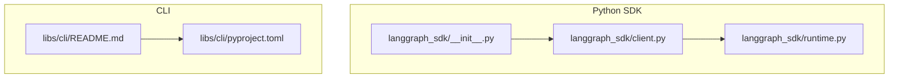
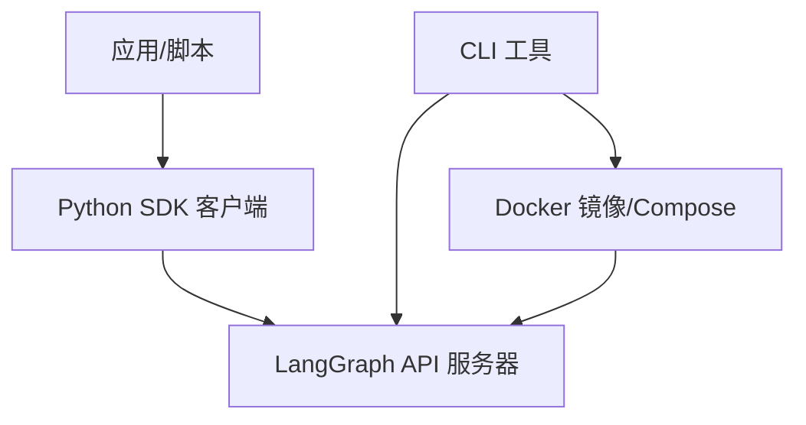
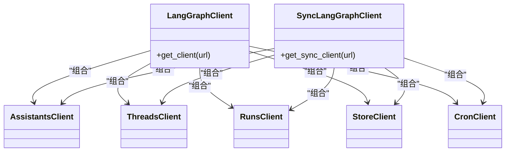
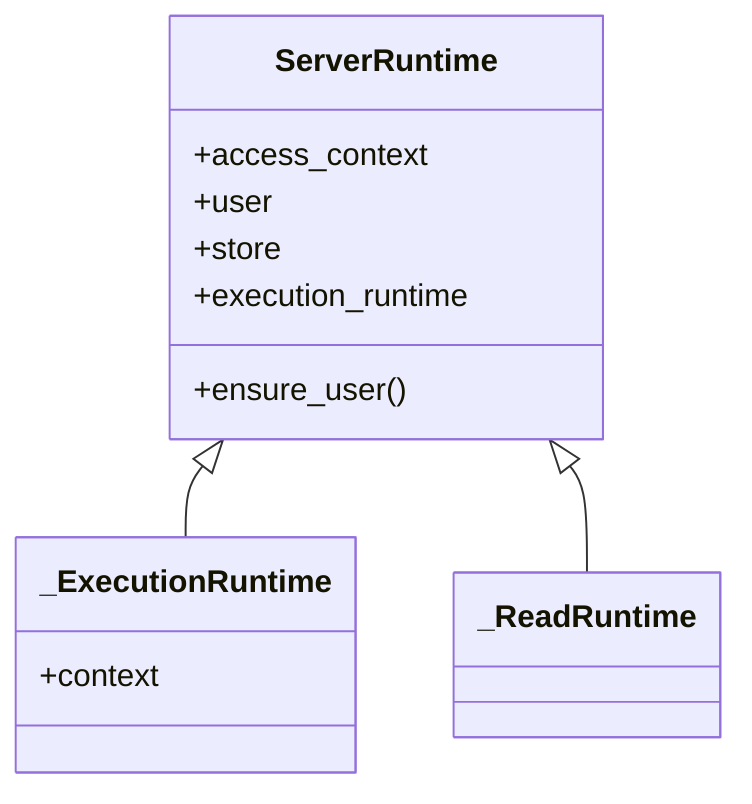
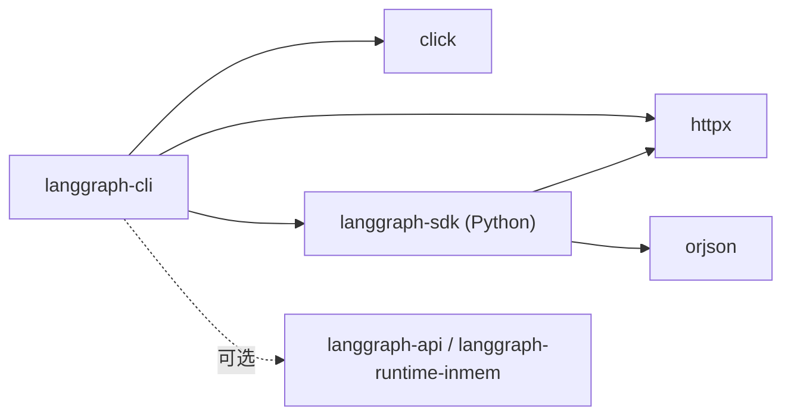
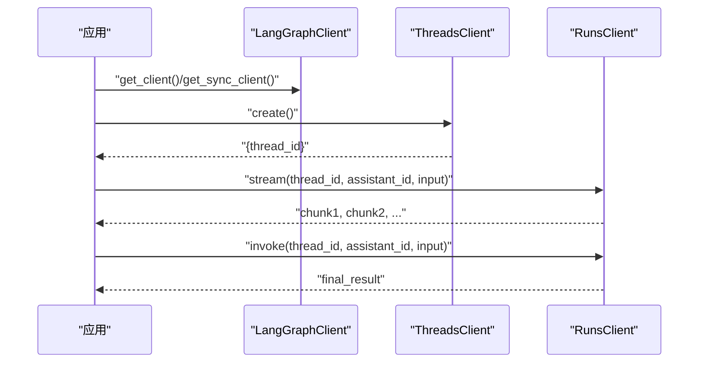

# SDK 和客户端

<cite>
**本文引用的文件**
- [README.md](file://README.md)
- [libs/sdk-py/README.md](file://libs/sdk-py/README.md)
- [libs/sdk-py/pyproject.toml](file://libs/sdk-py/pyproject.toml)
- [libs/sdk-py/langgraph_sdk/__init__.py](file://libs/sdk-py/langgraph_sdk/__init__.py)
- [libs/sdk-py/langgraph_sdk/client.py](file://libs/sdk-py/langgraph_sdk/client.py)
- [libs/sdk-py/langgraph_sdk/runtime.py](file://libs/sdk-py/langgraph_sdk/runtime.py)
- [libs/cli/README.md](file://libs/cli/README.md)
- [libs/cli/pyproject.toml](file://libs/cli/pyproject.toml)
</cite>

## 目录
1. [简介](#简介)
2. [项目结构](#项目结构)
3. [核心组件](#核心组件)
4. [架构总览](#架构总览)
5. [详细组件分析](#详细组件分析)
6. [依赖关系分析](#依赖关系分析)
7. [性能与并发特性](#性能与并发特性)
8. [安装与配置指南](#安装与配置指南)
9. [API 参考（Python SDK）](#api-参考python-sdk)
10. [使用示例与工作流](#使用示例与工作流)
11. [CLI 工具功能与用法](#cli-工具功能与用法)
12. [部署与 Docker 集成](#部署与-docker-集成)
13. [故障排除与调试](#故障排除与调试)
14. [版本兼容性与升级路径](#版本兼容性与升级路径)
15. [结论](#结论)

## 简介
本文件为 LangGraph SDK 与客户端的综合文档，覆盖 Python SDK 与 JavaScript SDK 的安装、配置与使用；客户端连接、认证与会话管理；完整的 API 参考与同步/异步示例；CLI 工具的功能与使用场景；以及部署配置与 Docker 集成指南。同时提供故障排除与调试技巧，并说明版本兼容性与升级路径。

LangGraph 是面向构建“有状态、持久化、可中断”的长运行代理与工作流的低层编排框架。其生态系统包含 Python SDK、JS/TS SDK、CLI、服务端与部署平台等组件，支持从开发到生产的全链路能力。

章节来源
- [README.md:1-83](file://README.md#L1-L83)

## 项目结构
仓库采用多库（libs）组织方式，核心与客户端相关的关键目录如下：
- libs/sdk-py：Python SDK，提供异步/同步客户端、认证、加密、运行时上下文等能力
- libs/cli：官方 CLI，用于本地开发、热重载、Docker 构建与启动
- libs/sdk-js：JavaScript/TypeScript SDK（由上游仓库维护，此处不展开）
- libs/langgraph、libs/prebuilt、libs/checkpoint 等：运行时与检查点相关库

下图展示与本文相关的模块关系与职责：

图表来源
- [libs/sdk-py/langgraph_sdk/__init__.py:1-9](file://libs/sdk-py/langgraph_sdk/__init__.py#L1-L9)
- [libs/sdk-py/langgraph_sdk/client.py:1-56](file://libs/sdk-py/langgraph_sdk/client.py#L1-L56)
- [libs/sdk-py/langgraph_sdk/runtime.py:1-239](file://libs/sdk-py/langgraph_sdk/runtime.py#L1-L239)
- [libs/cli/README.md:1-106](file://libs/cli/README.md#L1-L106)
- [libs/cli/pyproject.toml:1-79](file://libs/cli/pyproject.toml#L1-L79)

章节来源
- [README.md:1-83](file://README.md#L1-L83)
- [libs/sdk-py/README.md:1-36](file://libs/sdk-py/README.md#L1-L36)
- [libs/cli/README.md:1-106](file://libs/cli/README.md#L1-L106)

## 核心组件
- Python SDK 客户端：提供异步与同步两类客户端，分别通过工厂函数创建，统一访问 Asssitants、Threads、Runs、Store、Cron 等资源
- 认证与加密：导出认证与加密类型，支持在服务端/运行时进行用户与数据安全控制
- 运行时上下文：ServerRuntime 提供不同访问上下文（执行/只读/状态读写/图结构读取），并可按需初始化昂贵资源
- CLI：提供项目新建、本地开发、Docker 构建与启动、生成 Dockerfile 等命令

章节来源
- [libs/sdk-py/langgraph_sdk/__init__.py:1-9](file://libs/sdk-py/langgraph_sdk/__init__.py#L1-L9)
- [libs/sdk-py/langgraph_sdk/client.py:1-56](file://libs/sdk-py/langgraph_sdk/client.py#L1-L56)
- [libs/sdk-py/langgraph_sdk/runtime.py:1-239](file://libs/sdk-py/langgraph_sdk/runtime.py#L1-L239)

## 架构总览
下图展示 Python SDK 与 CLI 在整体生态中的位置与交互关系：

图表来源
- [libs/sdk-py/README.md:13-35](file://libs/sdk-py/README.md#L13-L35)
- [libs/cli/README.md:37-63](file://libs/cli/README.md#L37-L63)

## 详细组件分析

### Python SDK 客户端与工厂
- 异步与同步客户端均通过工厂函数创建，统一暴露 Assistants、Threads、Runs、Store、Cron 等子客户端
- 支持配置本地回环传输（便于本地开发与测试）
- 导出认证与加密类型，便于扩展自定义鉴权与数据保护

图表来源
- [libs/sdk-py/langgraph_sdk/client.py:12-31](file://libs/sdk-py/langgraph_sdk/client.py#L12-L31)

章节来源
- [libs/sdk-py/langgraph_sdk/client.py:1-56](file://libs/sdk-py/langgraph_sdk/client.py#L1-L56)

### 运行时上下文（ServerRuntime）
- 提供多种访问上下文：执行运行、只读（图/状态）、更新状态、读取状态
- 支持按需初始化昂贵资源（如外部工具/数据库连接），仅在执行上下文中生效
- 提供用户信息校验与错误提示，确保在启用自定义认证时可用

图表来源
- [libs/sdk-py/langgraph_sdk/runtime.py:36-183](file://libs/sdk-py/langgraph_sdk/runtime.py#L36-L183)

章节来源
- [libs/sdk-py/langgraph_sdk/runtime.py:1-239](file://libs/sdk-py/langgraph_sdk/runtime.py#L1-L239)

### 认证与加密（导出）
- SDK 包导出认证与加密类型，便于在应用侧或服务端实现自定义鉴权与数据保护策略

章节来源
- [libs/sdk-py/langgraph_sdk/__init__.py:1-9](file://libs/sdk-py/langgraph_sdk/__init__.py#L1-L9)

## 依赖关系分析
- Python SDK 依赖 httpx 与 orjson，用于 HTTP 通信与 JSON 编解码
- CLI 依赖 click、httpx、langgraph-sdk（可选 inmem 组件），并提供脚本入口
- 开发与测试依赖包括 pytest、ruff、mypy 等工具组

图表来源
- [libs/sdk-py/pyproject.toml:14-14](file://libs/sdk-py/pyproject.toml#L14-L14)
- [libs/sdk-py/pyproject.toml:25-44](file://libs/sdk-py/pyproject.toml#L25-L44)
- [libs/cli/pyproject.toml:14-21](file://libs/cli/pyproject.toml#L14-L21)
- [libs/cli/pyproject.toml:24-28](file://libs/cli/pyproject.toml#L24-L28)

章节来源
- [libs/sdk-py/pyproject.toml:1-86](file://libs/sdk-py/pyproject.toml#L1-L86)
- [libs/cli/pyproject.toml:1-79](file://libs/cli/pyproject.toml#L1-L79)

## 性能与并发特性
- 异步客户端优先，适合高并发与流式处理场景
- 同步客户端提供阻塞式调用，便于简单脚本与快速原型
- 运行时上下文区分执行与只读场景，避免在非必要路径上加载昂贵资源
- 本地回环传输配置可用于开发环境，降低网络开销

章节来源
- [libs/sdk-py/langgraph_sdk/client.py:1-56](file://libs/sdk-py/langgraph_sdk/client.py#L1-L56)
- [libs/sdk-py/langgraph_sdk/runtime.py:148-183](file://libs/sdk-py/langgraph_sdk/runtime.py#L148-L183)

## 安装与配置指南

### Python SDK 安装与基础配置
- 通过包管理器安装 Python SDK
- 若未本地运行 API 服务器，需显式传入远程服务器地址
- 基础使用流程：创建客户端 → 列举助手 → 创建线程 → 流式运行

章节来源
- [libs/sdk-py/README.md:7-35](file://libs/sdk-py/README.md#L7-L35)

### CLI 安装与开发模式
- 通过包管理器安装 CLI
- 开发模式支持热重载与远程调试
- 提供 inmem 可选依赖以在本地直接运行 API 服务

章节来源
- [libs/cli/README.md:5-16](file://libs/cli/README.md#L5-L16)
- [libs/cli/README.md:25-35](file://libs/cli/README.md#L25-L35)
- [libs/cli/pyproject.toml:24-28](file://libs/cli/pyproject.toml#L24-L28)

## API 参考（Python SDK）

### 客户端工厂
- 异步客户端工厂：用于创建异步客户端实例
- 同步客户端工厂：用于创建同步客户端实例
- 本地回环传输配置：便于本地开发与测试

章节来源
- [libs/sdk-py/langgraph_sdk/client.py:16-22](file://libs/sdk-py/langgraph_sdk/client.py#L16-L22)
- [libs/sdk-py/langgraph_sdk/client.py:22-22](file://libs/sdk-py/langgraph_sdk/client.py#L22-L22)

### 资源客户端
- Assistants：管理助手（Agent）定义与元数据
- Threads：管理对话线程与状态
- Runs：管理运行（单次/流式）生命周期
- Store：持久化文档存储
- Cron：定时任务管理

章节来源
- [libs/sdk-py/langgraph_sdk/client.py:12-31](file://libs/sdk-py/langgraph_sdk/client.py#L12-L31)

### 认证与加密
- 认证类型：用于服务端鉴权上下文
- 加密类型：用于数据保护与上下文封装

章节来源
- [libs/sdk-py/langgraph_sdk/__init__.py:1-9](file://libs/sdk-py/langgraph_sdk/__init__.py#L1-L9)

### 运行时上下文
- ServerRuntime：统一的运行时上下文，区分执行与只读场景
- ensure_user：在启用自定义认证时校验用户身份
- execution_runtime：窄化到执行上下文，访问运行期上下文

章节来源
- [libs/sdk-py/langgraph_sdk/runtime.py:36-183](file://libs/sdk-py/langgraph_sdk/runtime.py#L36-L183)

## 使用示例与工作流

### 同步与异步运行流程
- 异步流式运行：创建线程 → 发起流式运行 → 持续消费分片
- 同步运行：创建线程 → 发起同步运行 → 获取完整结果

图表来源
- [libs/sdk-py/README.md:28-35](file://libs/sdk-py/README.md#L28-L35)
- [libs/sdk-py/langgraph_sdk/client.py:16-31](file://libs/sdk-py/langgraph_sdk/client.py#L16-L31)

章节来源
- [libs/sdk-py/README.md:13-35](file://libs/sdk-py/README.md#L13-L35)

## CLI 工具功能与用法

### 命令概览
- 新建项目：基于模板创建新工程
- 本地开发：带热重载与浏览器打开
- 启动服务：Docker 启动 API 服务
- 构建镜像：打包应用为 Docker 镜像
- 生成 Dockerfile：输出自定义部署所需的 Dockerfile

章节来源
- [libs/cli/README.md:17-63](file://libs/cli/README.md#L17-L63)

### 配置文件
- 关键字段：依赖项、图定义、环境变量、Python 版本、pip 配置、额外 Dockerfile 行
- 通过配置文件集中管理依赖与部署参数

章节来源
- [libs/cli/README.md:65-82](file://libs/cli/README.md#L65-L82)

## 部署与 Docker 集成
- CLI 提供 Docker 启动与镜像构建命令，支持等待服务、监听文件变更、显示详细日志
- 支持生成自定义 Dockerfile，便于二次定制
- 与本地开发模式配合，实现从本地到容器的一致体验

章节来源
- [libs/cli/README.md:37-63](file://libs/cli/README.md#L37-L63)
- [libs/cli/README.md:58-63](file://libs/cli/README.md#L58-L63)

## 故障排除与调试
- 确认 SDK 与 CLI 的版本范围与 Python 版本要求
- 在启用自定义认证时，确保服务端已正确注入用户上下文，否则运行时会抛出权限错误
- 本地开发时可启用回环传输与热重载，减少网络与重启成本
- Docker 启动时关注服务健康与端口占用，必要时开启详细日志

章节来源
- [libs/sdk-py/pyproject.toml:10-10](file://libs/sdk-py/pyproject.toml#L10-L10)
- [libs/sdk-py/langgraph_sdk/runtime.py:129-145](file://libs/sdk-py/langgraph_sdk/runtime.py#L129-L145)
- [libs/cli/pyproject.toml:14-21](file://libs/cli/pyproject.toml#L14-L21)

## 版本兼容性与升级路径
- Python SDK 与 CLI 均声明最低 Python 版本要求
- CLI 可选 inmem 组件与服务端版本存在范围约束
- 建议在升级前核对依赖版本范围与运行时上下文 API 的稳定性

章节来源
- [libs/sdk-py/pyproject.toml:10-10](file://libs/sdk-py/pyproject.toml#L10-L10)
- [libs/cli/pyproject.toml:14-21](file://libs/cli/pyproject.toml#L14-L21)
- [libs/cli/pyproject.toml:26-28](file://libs/cli/pyproject.toml#L26-L28)

## 结论
本文档系统梳理了 LangGraph 生态中 Python SDK 与 CLI 的安装、配置、使用与部署要点。通过异步/同步客户端、运行时上下文与本地回环传输，开发者可在本地与生产环境中高效地构建、调试与部署有状态代理与工作流。建议结合 CLI 的本地开发与 Docker 部署能力，形成从开发到上线的闭环。