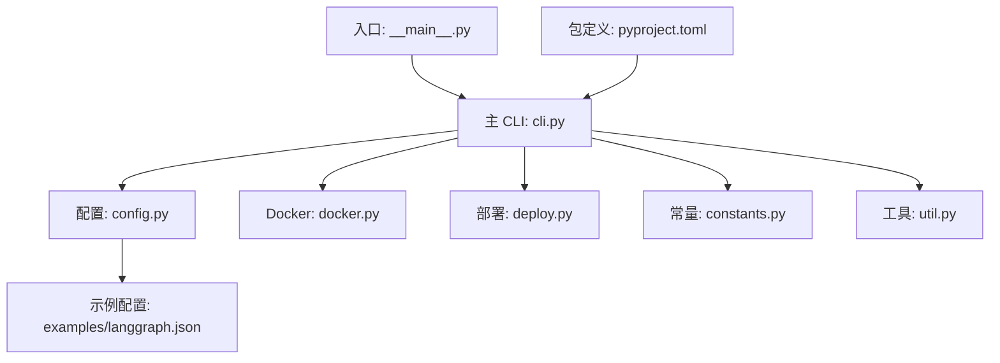
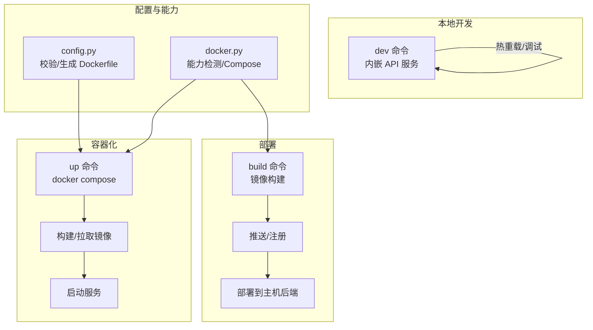
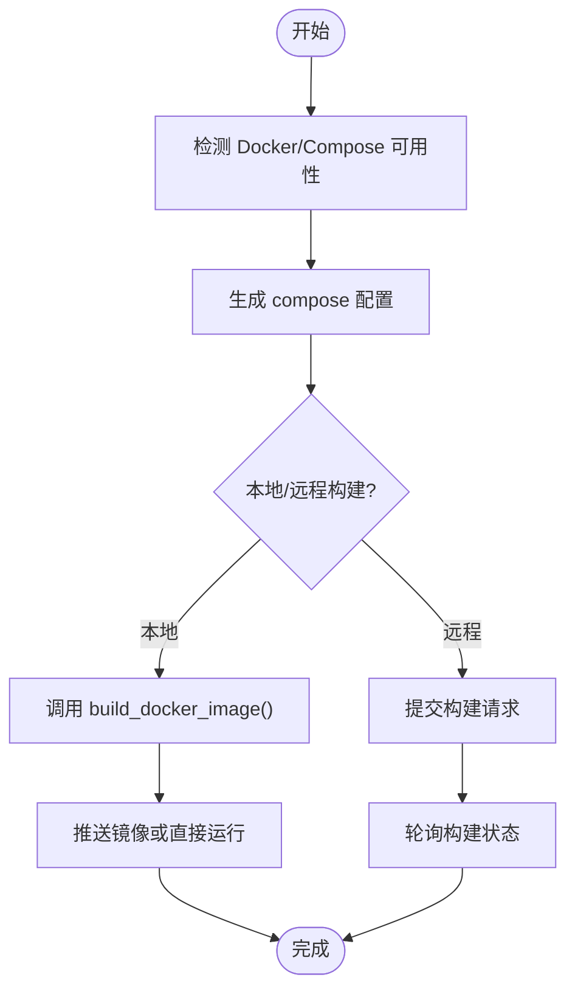
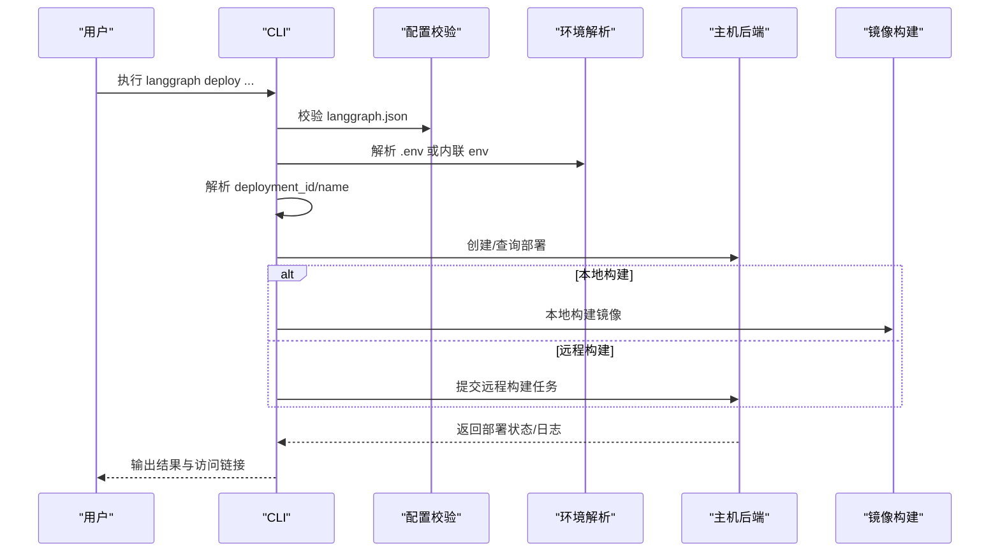
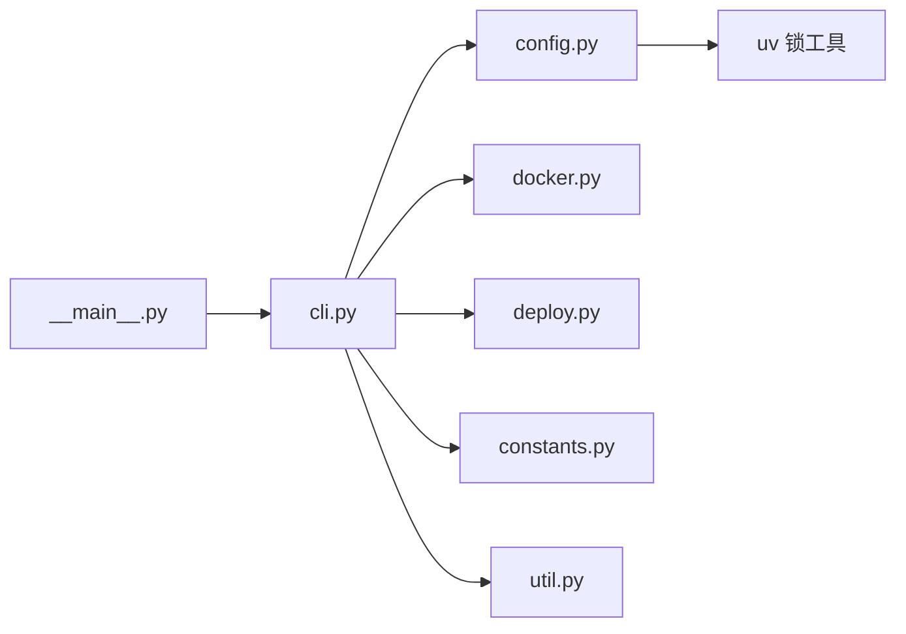

# 命令行工具

<cite>
**本文引用的文件**
- [README.md](file://README.md)
- [libs/cli/README.md](file://libs/cli/README.md)
- [libs/cli/pyproject.toml](file://libs/cli/pyproject.toml)
- [libs/cli/langgraph_cli/__main__.py](file://libs/cli/langgraph_cli/__main__.py)
- [libs/cli/langgraph_cli/cli.py](file://libs/cli/langgraph_cli/cli.py)
- [libs/cli/langgraph_cli/config.py](file://libs/cli/langgraph_cli/config.py)
- [libs/cli/langgraph_cli/deploy.py](file://libs/cli/langgraph_cli/deploy.py)
- [libs/cli/langgraph_cli/docker.py](file://libs/cli/langgraph_cli/docker.py)
- [libs/cli/langgraph_cli/constants.py](file://libs/cli/langgraph_cli/constants.py)
- [libs/cli/langgraph_cli/util.py](file://libs/cli/langgraph_cli/util.py)
- [libs/cli/examples/langgraph.json](file://libs/cli/examples/langgraph.json)
- [libs/cli/examples/pyproject.toml](file://libs/cli/examples/pyproject.toml)
</cite>

## 目录
1. [简介](#简介)
2. [项目结构](#项目结构)
3. [核心组件](#核心组件)
4. [架构总览](#架构总览)
5. [详细组件分析](#详细组件分析)
6. [依赖关系分析](#依赖关系分析)
7. [性能考虑](#性能考虑)
8. [故障排除指南](#故障排除指南)
9. [结论](#结论)
10. [附录](#附录)

## 简介
本文件为 LangGraph CLI 工具的综合文档，覆盖安装与配置、命令行选项与参数、开发/部署/生产使用指南、配置文件与环境变量、Docker 集成与容器化部署、常见使用场景示例、故障排除与调试技巧、以及版本管理与升级流程。目标是帮助不同技术背景的用户快速上手并高效使用该 CLI。

## 项目结构
LangGraph CLI 位于仓库的 libs/cli 目录中，核心入口为命令行接口，围绕配置解析、Docker 能力检测与镜像构建、部署流程与主机后端交互展开。典型目录组织如下：
- 入口模块：langgraph_cli/__main__.py
- 主 CLI 定义：langgraph_cli/cli.py
- 配置校验与生成：langgraph_cli/config.py
- 部署子命令与主机后端交互：langgraph_cli/deploy.py
- Docker 能力检测与 compose 生成：langgraph_cli/docker.py
- 常量与通用工具：langgraph_cli/constants.py、langgraph_cli/util.py
- 示例配置与项目：examples/langgraph.json、examples/pyproject.toml
- 包元数据与脚本注册：pyproject.toml
- CLI 使用说明：libs/cli/README.md

图表来源
- [libs/cli/langgraph_cli/__main__.py](file://libs/cli/langgraph_cli/__main__.py)
- [libs/cli/langgraph_cli/cli.py](file://libs/cli/langgraph_cli/cli.py)
- [libs/cli/langgraph_cli/config.py](file://libs/cli/langgraph_cli/config.py)
- [libs/cli/langgraph_cli/docker.py](file://libs/cli/langgraph_cli/docker.py)
- [libs/cli/langgraph_cli/deploy.py](file://libs/cli/langgraph_cli/deploy.py)
- [libs/cli/langgraph_cli/constants.py](file://libs/cli/langgraph_cli/constants.py)
- [libs/cli/langgraph_cli/util.py](file://libs/cli/langgraph_cli/util.py)
- [libs/cli/examples/langgraph.json](file://libs/cli/examples/langgraph.json)
- [libs/cli/pyproject.toml](file://libs/cli/pyproject.toml)

章节来源
- [libs/cli/README.md](file://libs/cli/README.md)
- [libs/cli/pyproject.toml](file://libs/cli/pyproject.toml)

## 核心组件
- CLI 入口与命令分组：通过 Click 构建命令树，包含 dev/up/build/dockerfile 等子命令，并挂载部署相关子命令。
- 配置系统：校验 langgraph.json，支持依赖声明、图定义、环境变量、Python/Node 版本、镜像发行版、源管理（uv）等。
- Docker 能力检测：自动识别 docker/docker-compose 可用性与版本，生成 compose 配置。
- 部署流程：本地或远程构建、部署创建/更新、等待状态、日志与进度提示。
- 开发模式：内嵌 API 服务（可选 inmem 组件），支持热重载、远程调试、隧道暴露等。

章节来源
- [libs/cli/langgraph_cli/cli.py](file://libs/cli/langgraph_cli/cli.py)
- [libs/cli/langgraph_cli/config.py](file://libs/cli/langgraph_cli/config.py)
- [libs/cli/langgraph_cli/docker.py](file://libs/cli/langgraph_cli/docker.py)
- [libs/cli/langgraph_cli/deploy.py](file://libs/cli/langgraph_cli/deploy.py)

## 架构总览
下图展示了 CLI 在不同模式下的工作流：开发模式直接运行内嵌服务；容器模式通过 docker compose 启动；部署模式连接主机后端进行构建与发布。

图表来源
- [libs/cli/langgraph_cli/cli.py](file://libs/cli/langgraph_cli/cli.py)
- [libs/cli/langgraph_cli/config.py](file://libs/cli/langgraph_cli/config.py)
- [libs/cli/langgraph_cli/docker.py](file://libs/cli/langgraph_cli/docker.py)
- [libs/cli/langgraph_cli/deploy.py](file://libs/cli/langgraph_cli/deploy.py)

## 详细组件分析

### CLI 命令与选项
- 新建项目：langgraph new [路径] --template 模板名
- 开发模式：langgraph dev
  - 关键选项：--host、--port、--no-reload、--debug-port、--no-browser、--config、--n-jobs-per-worker、--wait-for-client、--studio-url、--allow-blocking、--tunnel、--server-log-level
- 容器启动：langgraph up
  - 关键选项：--port、--docker-compose、--pull、--recreate、--wait、--verbose、--watch、--debugger-port、--debugger-base-url、--postgres-uri、--api-version、--engine-runtime-mode、--image、--base-image
- 构建镜像：langgraph build
  - 关键选项：--tag、--base-image、--install-command、--build-command、--pull、--api-version、--engine-runtime-mode、额外 docker build 参数
- 生成 Dockerfile：langgraph dockerfile 保存路径
  - 关键选项：--config、--base-image、--api-version、--engine-runtime-mode、--add-docker-compose
- 部署（主机后端）：langgraph deploy 子命令族
  - 关键选项：--host-url、--api-key、--deployment-id、--name、--deployment-type、--no-wait、--verbose、--image-name、--tag、--config、--base-image、--install-command、--build-command、--remote-build、--docker-build-args

章节来源
- [libs/cli/README.md](file://libs/cli/README.md)
- [libs/cli/langgraph_cli/cli.py](file://libs/cli/langgraph_cli/cli.py)
- [libs/cli/langgraph_cli/deploy.py](file://libs/cli/langgraph_cli/deploy.py)

### 配置文件与环境变量
- 配置文件：langgraph.json
  - 必填字段：dependencies（依赖列表）、graphs（图定义映射）
  - 可选字段：env（.env 文件路径或内联字典）、python_version（3.11/3.12/3.13）、pip_config_file、dockerfile_lines、node_version、api_version、base_image、image_distro、source（uv 源管理）、keep_pkg_tools、auth/http/webhooks/ui/ui_config/checkpointer/encryption/store 等
- 环境变量：
  - 运行时：LANGSMITH_API_KEY、LANGGRAPH_CLOUD_LICENSE_KEY、POSTGRES_URI、REDIS_URI 等
  - 部署时：LANGGRAPH_HOST_API_KEY、LANGSMITH_DEPLOYMENT_NAME 等
  - 保留/受限变量：CLI 会拒绝部分保留键注入到部署环境
- 校验规则：
  - Python 版本必须为“主版本.次版本”，且不指定补丁版本
  - 不支持旧版 Debian bullseye 发行版
  - 当启用 uv 源管理时，需提供 python_version，且移除 dependencies 字段
  - graphs 必须存在
  - package.json 中的 engines.node 仅支持主版本号

章节来源
- [libs/cli/langgraph_cli/config.py](file://libs/cli/langgraph_cli/config.py)
- [libs/cli/examples/langgraph.json](file://libs/cli/examples/langgraph.json)
- [libs/cli/langgraph_cli/deploy.py](file://libs/cli/langgraph_cli/deploy.py)

### Docker 集成与容器化
- 能力检测：自动判断 docker/docker-compose 是否可用、版本信息、健康检查起始间隔、compose 类型（插件/独立）
- compose 生成：根据端口、调试器、数据库等参数生成服务配置
- 构建流程：支持本地构建与远程构建选择；支持自定义安装/构建命令；支持多平台与基础镜像选择
- 生成 Dockerfile：从配置转换为 Dockerfile 内容，必要时输出附加构建上下文参数

图表来源
- [libs/cli/langgraph_cli/docker.py](file://libs/cli/langgraph_cli/docker.py)
- [libs/cli/langgraph_cli/cli.py](file://libs/cli/langgraph_cli/cli.py)
- [libs/cli/langgraph_cli/deploy.py](file://libs/cli/langgraph_cli/deploy.py)

章节来源
- [libs/cli/langgraph_cli/docker.py](file://libs/cli/langgraph_cli/docker.py)
- [libs/cli/langgraph_cli/cli.py](file://libs/cli/langgraph_cli/cli.py)

### 部署流程（主机后端）
- 预检：校验部署命令内容合法性、配置有效性、发行版建议
- 解析环境：从 langgraph.json env 字段或 .env 解析密钥
- 名称解析：若未提供 deployment_id/name，则尝试从环境变量读取或交互式输入
- 构建模式：自动判断本地/远程构建，必要时回退到远程构建
- 创建/更新部署：根据类型创建新部署或更新既有部署
- 等待与日志：可选择等待部署完成，显示进度与日志

图表来源
- [libs/cli/langgraph_cli/deploy.py](file://libs/cli/langgraph_cli/deploy.py)
- [libs/cli/langgraph_cli/config.py](file://libs/cli/langgraph_cli/config.py)

章节来源
- [libs/cli/langgraph_cli/deploy.py](file://libs/cli/langgraph_cli/deploy.py)

### 开发模式（内嵌服务）
- 依赖要求：需要安装带 inmem 可选依赖的包以启用内嵌 API 服务
- 功能特性：热重载、远程调试、浏览器打开、日志级别控制、隧道暴露、Studio URL 指定
- 注意事项：JS 图不支持在内存模式下运行（需使用 npx @langchain/langgraph-cli）

章节来源
- [libs/cli/README.md](file://libs/cli/README.md)
- [libs/cli/langgraph_cli/cli.py](file://libs/cli/langgraph_cli/cli.py)

## 依赖关系分析
- CLI 入口依赖各子模块：config、docker、deploy、exec、progress、templates、util、version 等
- 配置模块依赖 schemas 与 uv 锁文件工具
- Docker 模块依赖系统 docker/docker-compose 可用性
- 部署模块依赖主机后端客户端与环境变量解析

图表来源
- [libs/cli/langgraph_cli/__main__.py](file://libs/cli/langgraph_cli/__main__.py)
- [libs/cli/langgraph_cli/cli.py](file://libs/cli/langgraph_cli/cli.py)
- [libs/cli/langgraph_cli/config.py](file://libs/cli/langgraph_cli/config.py)
- [libs/cli/langgraph_cli/docker.py](file://libs/cli/langgraph_cli/docker.py)
- [libs/cli/langgraph_cli/deploy.py](file://libs/cli/langgraph_cli/deploy.py)
- [libs/cli/langgraph_cli/constants.py](file://libs/cli/langgraph_cli/constants.py)
- [libs/cli/langgraph_cli/util.py](file://libs/cli/langgraph_cli/util.py)

章节来源
- [libs/cli/pyproject.toml](file://libs/cli/pyproject.toml)
- [libs/cli/langgraph_cli/__main__.py](file://libs/cli/langgraph_cli/__main__.py)

## 性能考虑
- 发布模式优先使用 Wolfi 发行版以提升安全性与镜像体积优化（CLI 会在非 wolfi 时给出安全建议）
- 本地构建在非 x86_64 平台需要安装 Docker Buildx 以支持跨平台编译
- 大型依赖安装建议使用 uv 源管理（source.kind=uv），减少安装时间与镜像体积
- 镜像层缓存策略：避免将 .env/.git 等无关文件加入构建上下文，减少构建时间

章节来源
- [libs/cli/langgraph_cli/util.py](file://libs/cli/langgraph_cli/util.py)
- [libs/cli/langgraph_cli/docker.py](file://libs/cli/langgraph_cli/docker.py)
- [libs/cli/langgraph_cli/config.py](file://libs/cli/langgraph_cli/config.py)

## 故障排除指南
- Docker/Compose 缺失或未运行
  - 症状：提示未安装或未运行
  - 处理：安装 Docker Desktop 并启动；确保 docker info 可用；如使用独立 docker-compose，确认版本
- 本地构建失败（非 x86_64）
  - 症状：提示缺少 Buildx
  - 处理：安装 Docker Buildx
- 配置错误
  - 症状：Python 版本格式错误、bullseye 发行版不被支持、graphs 缺失、uv 源管理与 dependencies 冲突
  - 处理：按错误提示修正 langgraph.json；使用推荐的 image_distro（wolfi）
- 部署失败/权限问题
  - 症状：部署创建/更新失败、保留变量被拒绝
  - 处理：检查 HOST API Key、许可证密钥、环境变量是否合规；确认部署名称与 ID
- 端口占用/网络问题
  - 处理：更换 --port；使用 --tunnel 暴露本地服务；确保防火墙允许访问

章节来源
- [libs/cli/langgraph_cli/docker.py](file://libs/cli/langgraph_cli/docker.py)
- [libs/cli/langgraph_cli/config.py](file://libs/cli/langgraph_cli/config.py)
- [libs/cli/langgraph_cli/deploy.py](file://libs/cli/langgraph_cli/deploy.py)

## 结论
LangGraph CLI 提供了从开发到部署的一体化工具链：通过简洁的命令与严格的配置校验，结合 Docker 能力检测与主机后端部署，满足本地开发、容器化与生产部署的多样化需求。遵循本文档的安装、配置与最佳实践，可显著提升开发效率与部署稳定性。

## 附录

### 安装与初始化
- 安装 CLI：pip install langgraph-cli
- 开发模式（含内嵌服务）：pip install "langgraph-cli[inmem]"
- 初始化项目：langgraph new [路径] --template 模板名
- 示例项目：examples/pyproject.toml 展示了如何在示例工程中引用本地 CLI 与 SDK

章节来源
- [libs/cli/README.md](file://libs/cli/README.md)
- [libs/cli/examples/pyproject.toml](file://libs/cli/examples/pyproject.toml)

### 常见使用场景
- 启动本地开发服务器：langgraph dev --host 127.0.0.1 --port 2024 --no-reload
- 启动容器化服务：langgraph up --port 8123 --pull --watch
- 构建镜像：langgraph build -t my-app --base-image langchain/langgraph-api:latest
- 生成 Dockerfile：langgraph dockerfile ./Dockerfile --add-docker-compose
- 部署到主机后端：langgraph deploy --host-url https://api.example.com --api-key YOUR_KEY --name my-deploy

章节来源
- [libs/cli/README.md](file://libs/cli/README.md)
- [libs/cli/langgraph_cli/cli.py](file://libs/cli/langgraph_cli/cli.py)
- [libs/cli/langgraph_cli/deploy.py](file://libs/cli/langgraph_cli/deploy.py)

### 配置文件示例与要点
- 示例配置：dependencies、graphs、env、python_version、keep_pkg_tools 等字段
- 要点：graphs 必须存在；当启用 uv 源管理时，移除 dependencies；不支持 bullseye 发行版

章节来源
- [libs/cli/examples/langgraph.json](file://libs/cli/examples/langgraph.json)
- [libs/cli/langgraph_cli/config.py](file://libs/cli/langgraph_cli/config.py)

### 环境变量清单（摘要）
- 运行时：LANGSMITH_API_KEY、LANGGRAPH_CLOUD_LICENSE_KEY、POSTGRES_URI、REDIS_URI 等
- 部署：LANGGRAPH_HOST_API_KEY、LANGSMITH_DEPLOYMENT_NAME 等
- 保留键：CLI 会拒绝注入部分保留变量（如 LANGCHAIN_*、LANGSMITH_* 控制平面相关键等）

章节来源
- [libs/cli/langgraph_cli/deploy.py](file://libs/cli/langgraph_cli/deploy.py)

### 版本管理与升级
- 包定义：pyproject.toml 中定义了脚本入口 langgraph 与可选 inmem 依赖
- 升级方式：pip install -U langgraph-cli；如需内嵌服务，pip install -U "langgraph-cli[inmem]"
- 版本来源：版本由 hatchling 从 langgraph_cli/__init__.py 动态读取

章节来源
- [libs/cli/pyproject.toml](file://libs/cli/pyproject.toml)
- [libs/cli/langgraph_cli/__main__.py](file://libs/cli/langgraph_cli/__main__.py)