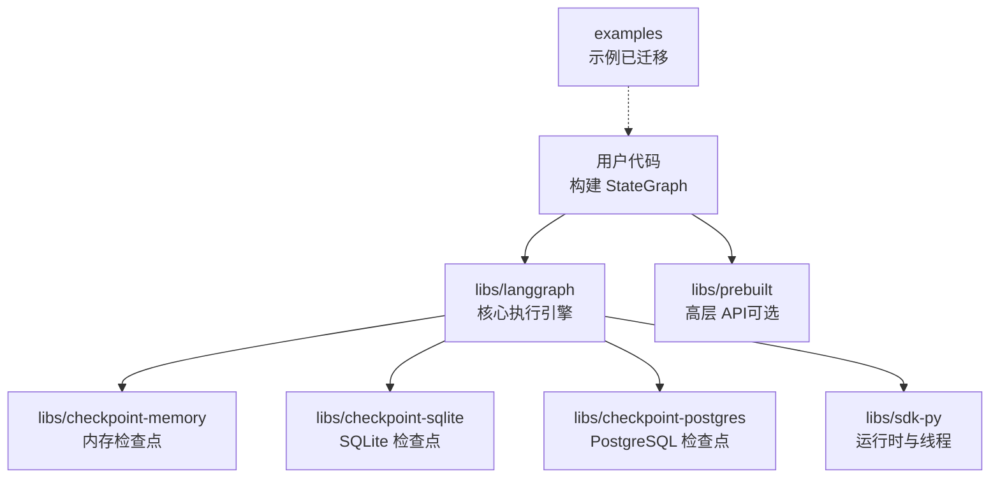
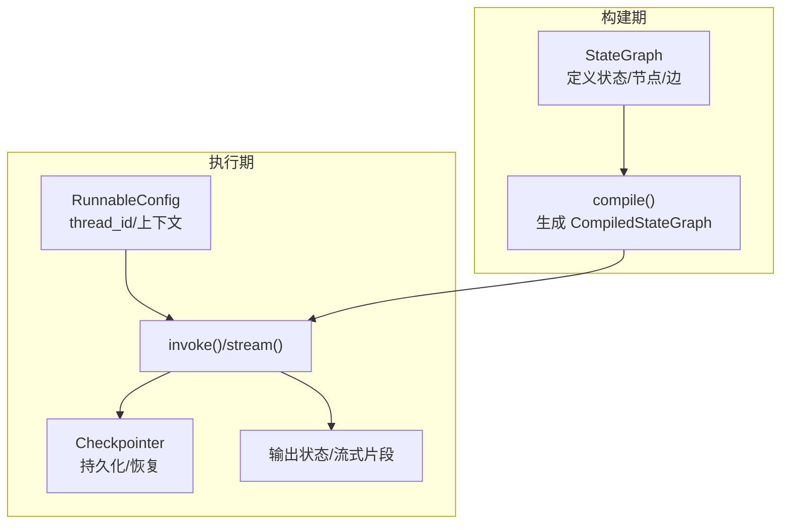
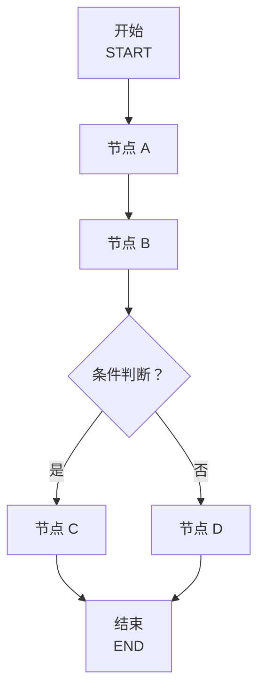
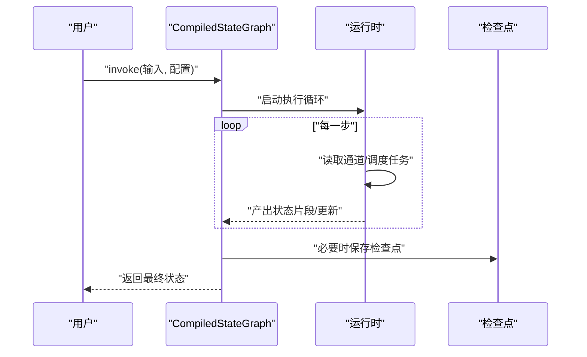
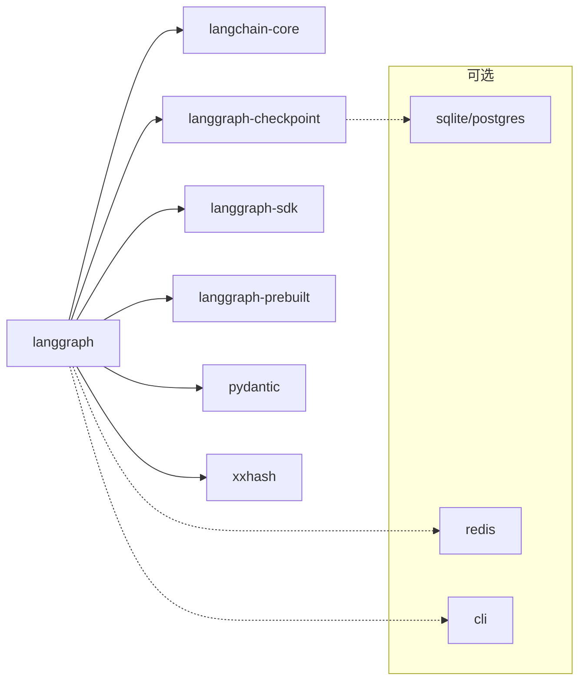

# 快速开始

<cite>
**本文引用的文件**
- [README.md](file://README.md)
- [libs/langgraph/pyproject.toml](file://libs/langgraph/pyproject.toml)
- [libs/prebuilt/pyproject.toml](file://libs/prebuilt/pyproject.toml)
- [libs/langgraph/langgraph/graph/state.py](file://libs/langgraph/langgraph/graph/state.py)
- [libs/langgraph/langgraph/pregel/_draw.py](file://libs/langgraph/langgraph/pregel/_draw.py)
- [libs/langgraph/langgraph/constants.py](file://libs/langgraph/langgraph/constants.py)
- [libs/langgraph/langgraph/_internal/_constants.py](file://libs/langgraph/langgraph/_internal/_constants.py)
- [libs/langgraph/langgraph/pregel/main.py](file://libs/langgraph/langgraph/pregel/main.py)
- [libs/sdk-py/langgraph_sdk/runtime.py](file://libs/sdk-py/langgraph_sdk/runtime.py)
- [examples/README.md](file://examples/README.md)
</cite>

## 目录
1. [简介](#简介)
2. [项目结构](#项目结构)
3. [核心组件](#核心组件)
4. [架构总览](#架构总览)
5. [详细组件分析](#详细组件分析)
6. [依赖分析](#依赖分析)
7. [性能考虑](#性能考虑)
8. [故障排查指南](#故障排查指南)
9. [结论](#结论)
10. [附录](#附录)

## 简介
本指南面向初学者，帮助你在最短时间内使用 LangGraph 构建第一个“状态化代理”。你将学到：
- 如何安装与环境准备（含 pip 安装与可选依赖）
- 从零到一搭建一个 StateGraph，理解节点与边的基本用法
- 运行与调试你的第一个状态化代理
- 常见问题与调试技巧
- 与 LangChain 生态系统的集成入门

LangGraph 是一个低层编排框架，用于构建、管理与部署长期运行、具备状态的记忆体代理。它支持持久化执行、人机协同、内存与调试可观测性，并可与 LangChain 生态无缝集成。

**章节来源**
- [README.md:1-83](file://README.md#L1-L83)

## 项目结构
仓库采用多库（monorepo）组织方式，核心与周边能力分布在不同子包中：
- libs/langgraph：核心图执行引擎与 StateGraph 实现
- libs/prebuilt：高层 API（如预置工具与代理），便于快速上手
- libs/checkpoint-*：检查点存储实现（内存、SQLite、PostgreSQL）
- libs/sdk-py：Python SDK，提供运行时与线程管理等能力
- libs/cli：命令行工具
- examples：示例已迁移至 LangChain 文档，本仓库保留归档说明

**章节来源**
- [examples/README.md:1-4](file://examples/README.md#L1-L4)
- [libs/langgraph/pyproject.toml:1-129](file://libs/langgraph/pyproject.toml#L1-L129)
- [libs/prebuilt/pyproject.toml:1-97](file://libs/prebuilt/pyproject.toml#L1-L97)

## 核心组件
- StateGraph：声明式构建状态化图的构建器，定义状态模式、节点、边与分支
- CompiledStateGraph：由 StateGraph 编译得到的可执行图，支持 invoke/stream/astream/ainvoke 等
- 节点（Node）：读取状态并返回对状态的部分更新
- 边（Edge）：连接节点，控制执行顺序；支持条件分支
- 检查点（Checkpointer）：持久化状态，支持断点续跑与重放
- 运行时（Runtime）：在节点中访问上下文（如 user_id、db_conn 等）

**章节来源**
- [libs/langgraph/langgraph/graph/state.py:115-200](file://libs/langgraph/langgraph/graph/state.py#L115-L200)
- [libs/langgraph/langgraph/graph/state.py:788-876](file://libs/langgraph/langgraph/graph/state.py#L788-L876)
- [libs/langgraph/langgraph/graph/state.py:1038-1167](file://libs/langgraph/langgraph/graph/state.py#L1038-L1167)

## 架构总览
LangGraph 的执行基于 Pregel 引擎，StateGraph 作为构建器，最终编译为可执行的 CompiledStateGraph。下图展示了从构建到执行的关键路径：

**图表来源**
- [libs/langgraph/langgraph/graph/state.py:1038-1167](file://libs/langgraph/langgraph/graph/state.py#L1038-L1167)
- [libs/langgraph/langgraph/pregel/main.py:3119-3144](file://libs/langgraph/langgraph/pregel/main.py#L3119-L3144)

**章节来源**
- [libs/langgraph/langgraph/graph/state.py:1038-1167](file://libs/langgraph/langgraph/graph/state.py#L1038-L1167)
- [libs/langgraph/langgraph/pregel/main.py:3119-3144](file://libs/langgraph/langgraph/pregel/main.py#L3119-L3144)

## 详细组件分析

### 安装与环境准备
- 使用 pip 安装 LangGraph（推荐最新版本）
- 可选依赖：根据需要选择检查点后端（内存、SQLite、PostgreSQL）、SDK、CLI 等
- Python 版本要求：>=3.10

提示：
- 若你希望快速上手高层 API（如预置工具与代理），可同时安装 prebuilt 包
- 若需要生产级持久化，建议使用 SQLite 或 PostgreSQL 检查点后端

**章节来源**
- [README.md:26-28](file://README.md#L26-L28)
- [libs/langgraph/pyproject.toml:26-33](file://libs/langgraph/pyproject.toml#L26-L33)
- [libs/prebuilt/pyproject.toml:26-29](file://libs/prebuilt/pyproject.toml#L26-L29)

### 第一个状态化代理：从概念到实现
以下流程带你完成从零到一的最小可用示例（步骤说明，不直接展示代码内容）：

1. 定义状态模式
   - 使用 TypedDict 或 Pydantic Model 定义状态键与类型
   - 可选：为某些键提供 reducer 函数以合并来自多个节点的更新

2. 编写节点函数
   - 输入：当前状态与可选的运行时上下文
   - 输出：对状态的部分更新（字典形式）
   - 节点签名通常为 node(state: State) -> dict[str, Any]

3. 构建 StateGraph
   - 创建 StateGraph 并注册节点
   - 添加边：指定执行顺序（串行/汇聚）
   - 设置入口与结束点（或使用 START/END 常量）

4. 编译与运行
   - 调用 compile() 得到可执行图
   - 传入输入状态与可选配置（如 thread_id）
   - 使用 invoke() 获取最终状态，或使用 stream() 获取流式片段

5. 可选：启用检查点
   - 传入 checkpointer 参数以开启持久化
   - 在配置中提供 thread_id 以区分不同会话

6. 可选：条件分支
   - 使用条件边在节点退出时动态决定下一个目标

7. 可选：子图
   - 将子 StateGraph 注册为节点，形成嵌套执行

8. 可选：人机协同与中断
   - 在编译时设置 interrupt_before/interrupt_after
   - 在运行时暂停/恢复，修改状态后再继续

9. 可选：SDK 集成
   - 使用 SDK 的线程与运行时接口进行远程执行与状态更新

**章节来源**
- [libs/langgraph/langgraph/graph/state.py:143-184](file://libs/langgraph/langgraph/graph/state.py#L143-L184)
- [libs/langgraph/langgraph/graph/state.py:788-876](file://libs/langgraph/langgraph/graph/state.py#L788-L876)
- [libs/langgraph/langgraph/graph/state.py:1038-1167](file://libs/langgraph/langgraph/graph/state.py#L1038-L1167)
- [libs/sdk-py/langgraph_sdk/runtime.py:52-74](file://libs/sdk-py/langgraph_sdk/runtime.py#L52-L74)

### 核心概念：StateGraph、节点与边
- StateGraph：构建器，负责声明状态、节点、边与分支
- 节点：无副作用的状态转换函数，返回对状态的部分更新
- 边：控制执行顺序；支持汇聚（等待多个源节点完成）与条件分支
- 条件分支：在节点退出时根据返回值或自定义逻辑选择下一节点
- 子图：将另一个 StateGraph 作为节点复用与组合

**图表来源**
- [libs/langgraph/langgraph/graph/state.py:788-876](file://libs/langgraph/langgraph/graph/state.py#L788-L876)

**章节来源**
- [libs/langgraph/langgraph/graph/state.py:788-876](file://libs/langgraph/langgraph/graph/state.py#L788-L876)

### 执行与调试：invoke、stream、astream
- invoke：一次性执行，返回最终状态
- stream：增量输出，按步骤返回状态片段或更新
- astream：异步流式执行
- 支持多流模式（如 values/updates）与 v1/v2 版本差异

**图表来源**
- [libs/langgraph/langgraph/pregel/main.py:3119-3144](file://libs/langgraph/langgraph/pregel/main.py#L3119-L3144)

**章节来源**
- [libs/langgraph/langgraph/pregel/main.py:3119-3144](file://libs/langgraph/langgraph/pregel/main.py#L3119-L3144)

### 常见问题与调试技巧
- 无法导入模块或常量
  - 某些常量已迁移到内部模块，请避免直接从 langgraph.constants 导入
  - 参考常量定义位置与弃用提示

- 检查点未生效
  - 启用检查点后需在配置中提供 thread_id
  - 确认传入的 checkpointer 类型与后端一致

- 条件分支不生效
  - 确保节点返回值与分支映射匹配
  - 为分支函数添加明确类型提示，有助于可视化与调试

- 子图调试
  - 使用 stream_mode="debug" 与 subgraphs=True 查看子图事件
  - 注意 START/END 在子图中的处理

- 与 LangChain 集成
  - 可将 LangChain 的 LCEL 组件接入节点
  - 使用 SDK 的线程与运行时接口进行远程执行与状态更新

**章节来源**
- [libs/langgraph/langgraph/constants.py:45-64](file://libs/langgraph/langgraph/constants.py#L45-L64)
- [libs/langgraph/langgraph/_internal/_constants.py:1-27](file://libs/langgraph/langgraph/_internal/_constants.py#L1-L27)
- [libs/langgraph/langgraph/pregel/_draw.py:253-294](file://libs/langgraph/langgraph/pregel/_draw.py#L253-L294)

## 依赖分析
LangGraph 的核心依赖与可选依赖如下：
- 核心依赖：langchain-core、langgraph-checkpoint、langgraph-sdk、langgraph-prebuilt、pydantic、xxhash
- 可选依赖：SQLite/PostgreSQL 检查点后端、Redis 缓存、CLI 工具等

**图表来源**
- [libs/langgraph/pyproject.toml:26-33](file://libs/langgraph/pyproject.toml#L26-L33)
- [libs/prebuilt/pyproject.toml:26-29](file://libs/prebuilt/pyproject.toml#L26-L29)

**章节来源**
- [libs/langgraph/pyproject.toml:26-33](file://libs/langgraph/pyproject.toml#L26-L33)
- [libs/prebuilt/pyproject.toml:26-29](file://libs/prebuilt/pyproject.toml#L26-L29)

## 性能考虑
- 使用合适的检查点后端：内存适合开发，SQLite/PostgreSQL 适合生产
- 控制流模式与输出粒度：在高吞吐场景下减少不必要的状态片段输出
- 合理拆分子图：将复杂流程拆分为子图，提升可维护性与可测试性
- 利用缓存与并发：结合 SDK 与外部缓存（如 Redis）优化热点数据访问

## 故障排查指南
- 报错：END 不能作为起点
  - 检查边定义，确保 START 作为起点，END 仅作为终点

- 报错：START 不能作为终点
  - 检查边定义，确保没有将 START 指定为任何边的终点

- 检查点相关
  - thread_id 缺失：在启用检查点时必须提供
  - 检查点后端不可用：确认驱动与连接参数正确

- 分支与可视化
  - 未提供类型提示：可能导致可视化误判所有可能的分支
  - 使用 path_map 明确分支映射

- 子图事件
  - 使用调试流模式与子图开关查看事件序列

**章节来源**
- [libs/langgraph/langgraph/graph/state.py:805-810](file://libs/langgraph/langgraph/graph/state.py#L805-L810)
- [libs/langgraph/langgraph/graph/state.py:811-815](file://libs/langgraph/langgraph/graph/state.py#L811-L815)
- [libs/langgraph/langgraph/pregel/_draw.py:253-294](file://libs/langgraph/langgraph/pregel/_draw.py#L253-L294)

## 结论
通过本指南，你已经完成了：
- 安装与环境准备
- 从零构建一个 StateGraph 并运行
- 理解节点、边与条件分支的基本用法
- 掌握检查点、调试与子图等进阶能力
- 了解与 LangChain 生态的集成路径

下一步建议：
- 在本地环境中尝试更复杂的流程（如人机协同、多分支、子图）
- 结合 LangChain 的 LCEL 组件与 SDK，构建可部署的代理服务

## 附录

### 术语表
- StateGraph：状态化图的构建器
- CompiledStateGraph：可执行的图实例
- 检查点（Checkpointer）：持久化状态的组件
- 运行时（Runtime）：在节点中访问上下文的能力
- 流式输出（stream_mode）：控制输出粒度与格式

### 参考资源
- LangGraph 官方文档与 API 参考
- LangChain 生态（LangChain、LangSmith、LangGraph 预置工具）
- 示例已迁移至 LangChain 文档，可在官方指南中查找最新示例

**章节来源**
- [README.md:61-76](file://README.md#L61-L76)
- [examples/README.md:1-4](file://examples/README.md#L1-L4)