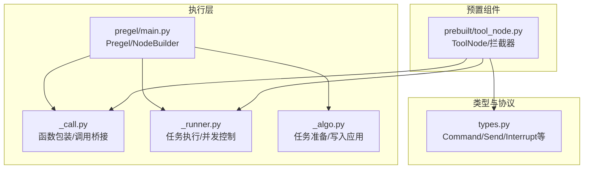
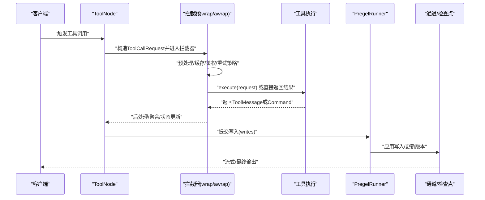
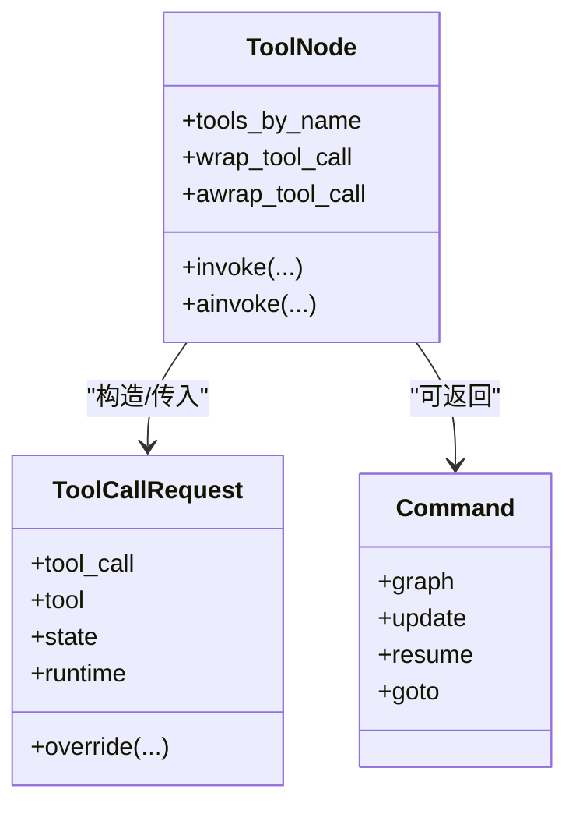
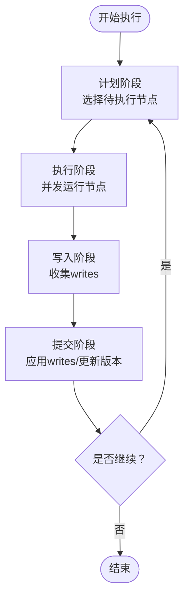
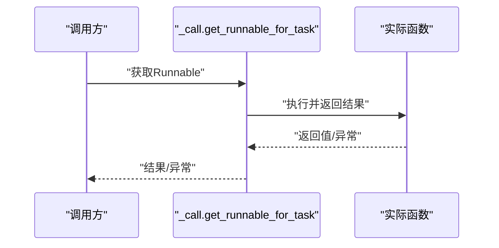
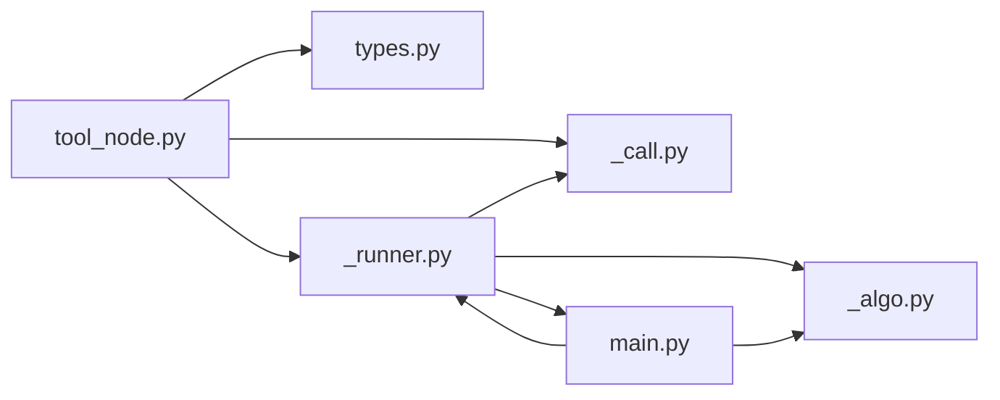

# 中间件开发

<cite>
**本文档引用的文件**
- [main.py](file://libs/langgraph/langgraph/pregel/main.py)
- [_call.py](file://libs/langgraph/langgraph/pregel/_call.py)
- [_runner.py](file://libs/langgraph/langgraph/pregel/_runner.py)
- [_algo.py](file://libs/langgraph/langgraph/pregel/_algo.py)
- [tool_node.py](file://libs/prebuilt/langgraph/prebuilt/tool_node.py)
- [types.py](file://libs/langgraph/langgraph/types.py)
- [test_tool_node_interceptor_unregistered.py](file://libs/prebuilt/tests/test_tool_node_interceptor_unregistered.py)
</cite>

## 目录
1. [简介](#简介)
2. [项目结构](#项目结构)
3. [核心组件](#核心组件)
4. [架构总览](#架构总览)
5. [详细组件分析](#详细组件分析)
6. [依赖分析](#依赖分析)
7. [性能考虑](#性能考虑)
8. [故障排查指南](#故障排查指南)
9. [结论](#结论)
10. [附录](#附录)

## 简介
本指南面向希望在 LangGraph 中开发中间件（或称拦截器）的工程师，系统阐述中间件体系的架构设计、注册与配置方式、生命周期管理、执行拦截点与处理机制，并提供从请求预处理、响应后处理到异常处理的完整实现思路。同时覆盖中间件间的执行顺序与优先级、数据传递与上下文管理、状态保持、性能监控、日志记录与调试等主题，并给出与通道系统、检查点机制的交互关系说明。

LangGraph 的中间件能力主要体现在“拦截器”模式：以 ToolNode 为例，通过 wrap_tool_call/awrap_tool_call 提供对工具调用的拦截，允许在执行前修改请求、在执行后处理结果、在异常时统一处理。该模式同样可类比扩展到节点执行、任务调度、写入提交等关键阶段。

## 项目结构
LangGraph 的中间件相关代码主要分布在以下模块：
- pregel 执行层：负责任务调度、并发执行、写入应用、检查点与流式输出
- prebuilt 工具节点：提供工具调用拦截器（wrap_tool_call/awrap_tool_call）
- 类型与协议：定义中间件可操作的关键类型（如 Command、Send、Interrupt 等）

图示来源
- [main.py](file://libs/langgraph/langgraph/pregel/main.py)
- [_call.py](file://libs/langgraph/langgraph/pregel/_call.py)
- [_runner.py](file://libs/langgraph/langgraph/pregel/_runner.py)
- [_algo.py](file://libs/langgraph/langgraph/pregel/_algo.py)
- [tool_node.py](file://libs/prebuilt/langgraph/prebuilt/tool_node.py)
- [types.py](file://libs/langgraph/langgraph/types.py)

章节来源
- [main.py](file://libs/langgraph/langgraph/pregel/main.py)
- [_call.py](file://libs/langgraph/langgraph/pregel/_call.py)
- [_runner.py](file://libs/langgraph/langgraph/pregel/_runner.py)
- [_algo.py](file://libs/langgraph/langgraph/pregel/_algo.py)
- [tool_node.py](file://libs/prebuilt/langgraph/prebuilt/tool_node.py)
- [types.py](file://libs/langgraph/langgraph/types.py)

## 核心组件
- Pregel：LangGraph 运行时核心，组织节点与通道，按“计划-执行-更新”的 Bulk Synchronous Parallel 模型推进
- NodeBuilder：构建节点，支持订阅通道、写回通道、重试策略、缓存策略
- PregelRunner：并发执行任务，统一提交写入、中断与其他异常处理
- ToolNode：工具节点，提供 wrap_tool_call/awrap_tool_call 拦截器，支持请求预处理、响应后处理、异常处理与命令式控制流
- 类型系统：Command、Send、Interrupt、PregelExecutableTask 等，支撑中间件在不同阶段的控制与数据传递

章节来源
- [main.py](file://libs/langgraph/langgraph/pregel/main.py)
- [_runner.py](file://libs/langgraph/langgraph/pregel/_runner.py)
- [tool_node.py](file://libs/prebuilt/langgraph/prebuilt/tool_node.py)
- [types.py](file://libs/langgraph/langgraph/types.py)

## 架构总览
LangGraph 中间件的核心思想是“在关键执行点注入处理逻辑”，典型拦截点包括：
- 工具调用前：预处理请求（参数校验、改写、鉴权、缓存命中）
- 工具调用后：后处理响应（格式化、聚合、状态更新）
- 异常处理：捕获并转换为标准错误消息或命令式中断
- 节点执行：在节点输入读取、输出写回前后插入中间件
- 任务提交：在写入提交到通道前进行统一处理

图示来源
- [tool_node.py](file://libs/prebuilt/langgraph/prebuilt/tool_node.py)
- [_runner.py](file://libs/langgraph/langgraph/pregel/_runner.py)
- [_algo.py](file://libs/langgraph/langgraph/pregel/_algo.py)

## 详细组件分析

### 工具调用拦截器（ToolNode）
ToolNode 通过 wrap_tool_call/awrap_tool_call 提供拦截器能力，拦截器接收 ToolCallRequest 和 execute 回调，可在以下场景使用：
- 请求预处理：修改 tool_call 参数、注入上下文、鉴权
- 响应后处理：格式化输出、聚合多工具结果、写入外部存储
- 异常处理：将异常转换为 ToolMessage 或抛出 GraphBubbleUp
- 命令式控制：返回 Command 实现状态更新、路由跳转、中断恢复

图示来源
- [tool_node.py](file://libs/prebuilt/langgraph/prebuilt/tool_node.py)
- [types.py](file://libs/langgraph/langgraph/types.py)

章节来源
- [tool_node.py](file://libs/prebuilt/langgraph/prebuilt/tool_node.py)
- [test_tool_node_interceptor_unregistered.py](file://libs/prebuilt/tests/test_tool_node_interceptor_unregistered.py)

### 节点执行与任务调度（Pregel/Runner）
Pregel 将节点封装为 PregelNode，Runner 负责并发执行任务、提交写入、处理中断与异常。中间件可在此阶段进行：
- 输入读取前的上下文注入（通过 CONFIG_KEY_READ 注入本地读取视图）
- 写入提交前的统一处理（如合并写入、去重、限流）
- 异常冒泡与中断传播（GraphInterrupt/GraphBubbleUp）

图示来源
- [main.py](file://libs/langgraph/langgraph/pregel/main.py)
- [_runner.py](file://libs/langgraph/langgraph/pregel/_runner.py)
- [_algo.py](file://libs/langgraph/langgraph/pregel/_algo.py)

章节来源
- [main.py](file://libs/langgraph/langgraph/pregel/main.py)
- [_runner.py](file://libs/langgraph/langgraph/pregel/_runner.py)
- [_algo.py](file://libs/langgraph/langgraph/pregel/_algo.py)

### 函数调用桥接（_call.py）
_call 提供函数到 Runnable 的桥接，支持同步/异步调用、重试策略、缓存策略注入。中间件可通过此桥接在调用前后插入处理逻辑（例如缓存命中短路、回调统计、超时控制）。

图示来源
- [_call.py](file://libs/langgraph/langgraph/pregel/_call.py)

章节来源
- [_call.py](file://libs/langgraph/langgraph/pregel/_call.py)

### 中间件注册与配置
- 工具拦截器注册：ToolNode 构造时传入 wrap_tool_call/awrap_tool_call
- 节点级中间件：通过 NodeBuilder 的 do(...) 组合 RunnableSeq，在节点内部串联中间件
- 全局中间件：通过 Pregel 的 retry_policy/cache_policy/global 配置影响所有节点
- 上下文注入：通过 CONFIG_KEY_READ/CONFIG_KEY_CHECKPOINTER/CONFIG_KEY_RUNTIME 注入中间件可用的运行时信息

章节来源
- [tool_node.py](file://libs/prebuilt/langgraph/prebuilt/tool_node.py)
- [main.py](file://libs/langgraph/langgraph/pregel/main.py)
- [_algo.py](file://libs/langgraph/langgraph/pregel/_algo.py)

### 中间件生命周期管理
- 初始化：在构建阶段完成注册（如 ToolNode 构造、NodeBuilder.build）
- 执行期：在拦截点被调用（工具调用前/后、节点执行前后、写入提交前后）
- 清理：通过检查点与通道版本管理，确保状态一致性；异常时由 Runner 统一处理

章节来源
- [tool_node.py](file://libs/prebuilt/langgraph/prebuilt/tool_node.py)
- [_runner.py](file://libs/langgraph/langgraph/pregel/_runner.py)
- [_algo.py](file://libs/langgraph/langgraph/pregel/_algo.py)

### 中间件执行顺序与优先级
- 工具拦截器：wrap_tool_call/awrap_tool_call 作为最外层拦截器，内部可多次调用 execute 实现重试
- 节点内部：NodeBuilder.do(...) 串联多个 Runnable，顺序即为执行顺序
- 全局策略：retry_policy/cache_policy 在任务级别生效，影响整体吞吐与一致性

章节来源
- [tool_node.py](file://libs/prebuilt/langgraph/prebuilt/tool_node.py)
- [main.py](file://libs/langgraph/langgraph/pregel/main.py)

### 数据传递、上下文管理与状态保持
- 上下文注入：通过 CONFIG_KEY_READ 提供本地读取视图（含当前任务写入），便于条件边与路由判断
- 状态保持：通过检查点与通道版本管理，确保中间件在中断/重试后仍能正确恢复
- 命令式控制：通过 Command.update/goto/resume 实现状态更新与流程控制

章节来源
- [_algo.py](file://libs/langgraph/langgraph/pregel/_algo.py)
- [types.py](file://libs/langgraph/langgraph/types.py)

### 性能监控、日志记录与调试中间件
- 性能监控：在 _call 桥接处统计耗时、缓存命中率、重试次数；在 Runner 提交阶段统计写入延迟
- 日志记录：利用 CONFIG_KEY_RUNTIME 注入的执行信息（run_id/thread_id/checkpoint_ns）进行结构化日志
- 调试中间件：结合 stream_mode="debug" 输出任务/检查点事件，辅助定位中间件问题

章节来源
- [_call.py](file://libs/langgraph/langgraph/pregel/_call.py)
- [_runner.py](file://libs/langgraph/langgraph/pregel/_runner.py)
- [types.py](file://libs/langgraph/langgraph/types.py)

### 与通道系统、检查点机制的交互
- 通道：中间件在写入阶段通过 ChannelWrite/ChannelWriteEntry 影响通道值；Runner 负责应用写入并更新版本
- 检查点：中间件可通过 CONFIG_KEY_CHECKPOINTER 访问检查点保存器；在中断/异常时持久化状态
- 版本管理：apply_writes 根据通道版本决定哪些节点被触发，避免不必要的重复执行

章节来源
- [_algo.py](file://libs/langgraph/langgraph/pregel/_algo.py)
- [_runner.py](file://libs/langgraph/langgraph/pregel/_runner.py)

## 依赖分析
中间件相关模块之间的依赖关系如下：

图示来源
- [tool_node.py](file://libs/prebuilt/langgraph/prebuilt/tool_node.py)
- [types.py](file://libs/langgraph/langgraph/types.py)
- [_runner.py](file://libs/langgraph/langgraph/pregel/_runner.py)
- [_call.py](file://libs/langgraph/langgraph/pregel/_call.py)
- [_algo.py](file://libs/langgraph/langgraph/pregel/_algo.py)
- [main.py](file://libs/langgraph/langgraph/pregel/main.py)

章节来源
- [tool_node.py](file://libs/prebuilt/langgraph/prebuilt/tool_node.py)
- [_runner.py](file://libs/langgraph/langgraph/pregel/_runner.py)
- [_call.py](file://libs/langgraph/langgraph/pregel/_call.py)
- [_algo.py](file://libs/langgraph/langgraph/pregel/_algo.py)
- [main.py](file://libs/langgraph/langgraph/pregel/main.py)

## 性能考虑
- 缓存策略：通过 CachePolicy.key_func/ttl 控制节点结果缓存，减少重复计算
- 重试策略：通过 RetryPolicy 控制异常重试间隔与上限，避免抖动放大
- 并发控制：Runner 使用 FuturesDict 管理任务完成回调，及时停止其他任务以降低尾延迟
- 写入优化：apply_writes 对写入进行分组与版本更新，避免无效触发

章节来源
- [types.py](file://libs/langgraph/langgraph/types.py)
- [_runner.py](file://libs/langgraph/langgraph/pregel/_runner.py)
- [_algo.py](file://libs/langgraph/langgraph/pregel/_algo.py)

## 故障排查指南
- 工具调用异常：通过 handle_tool_errors 将异常转换为 ToolMessage；若未处理则抛出 GraphBubbleUp
- 中断与恢复：使用 interrupt 与 Command.resume 实现人类介入与状态恢复
- 调试输出：启用 stream_mode="debug" 获取任务/检查点事件，定位中间件问题
- 超时与取消：Runner 在 panic_or_proceed 中统一处理超时与取消，确保一致性

章节来源
- [tool_node.py](file://libs/prebuilt/langgraph/prebuilt/tool_node.py)
- [types.py](file://libs/langgraph/langgraph/types.py)
- [_runner.py](file://libs/langgraph/langgraph/pregel/_runner.py)

## 结论
LangGraph 的中间件体系以“拦截器”为核心，贯穿工具调用、节点执行、写入提交等多个关键阶段。通过 ToolNode 的 wrap_tool_call/awrap_tool_call、Pregel 的节点组合与 Runner 的并发控制，以及类型系统与检查点机制的支持，开发者可以构建高可扩展、可观测、可恢复的中间件生态。建议在实践中遵循“最小职责、明确边界、可测试性”的原则，配合缓存、重试与调试工具，持续优化中间件的性能与稳定性。

## 附录
- 测试参考：工具拦截器的单元测试展示了拦截器如何处理已注册/未注册工具、返回 ToolMessage/Command、异常捕获等场景
- 最佳实践清单
  - 明确拦截点：仅在必要位置注入中间件，避免过度耦合
  - 可观测性：为中间件添加结构化日志与指标采集
  - 容错性：为中间件实现重试、降级与熔断策略
  - 可测试性：提供 mock 工具与可控的检查点，便于单元/集成测试

章节来源
- [test_tool_node_interceptor_unregistered.py](file://libs/prebuilt/tests/test_tool_node_interceptor_unregistered.py)