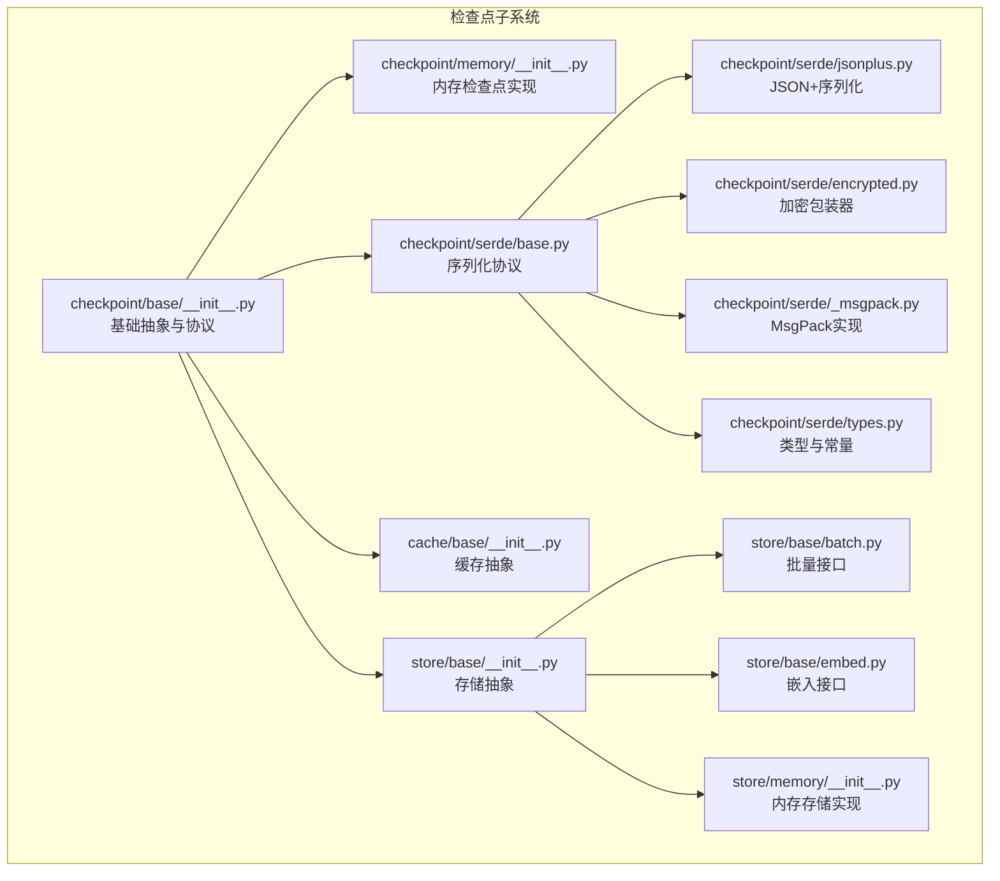
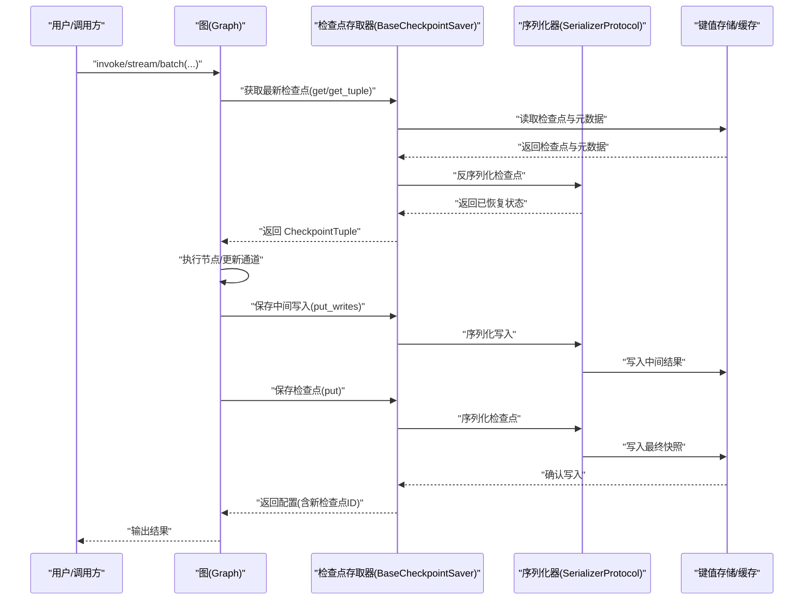
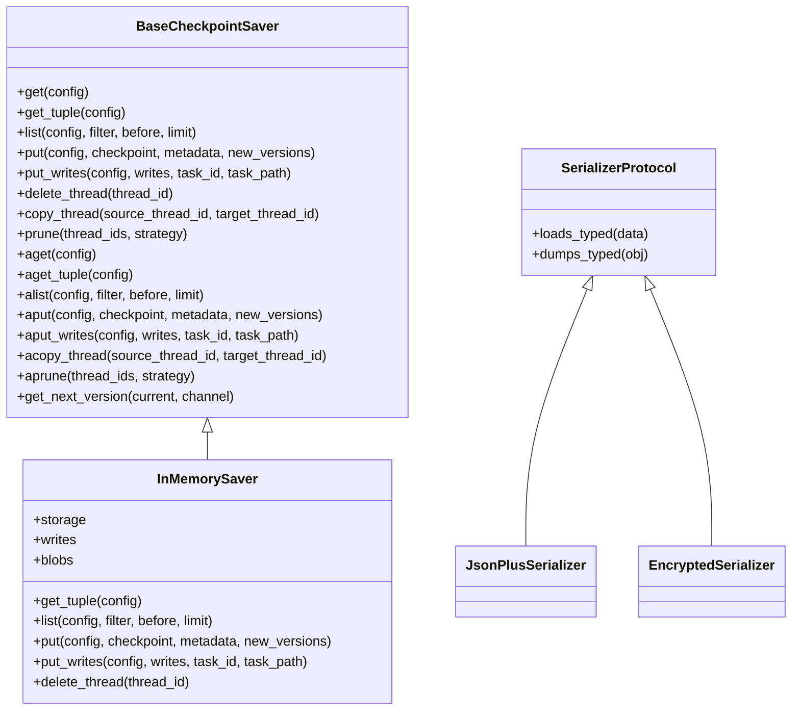
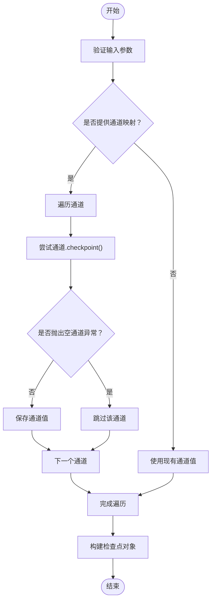
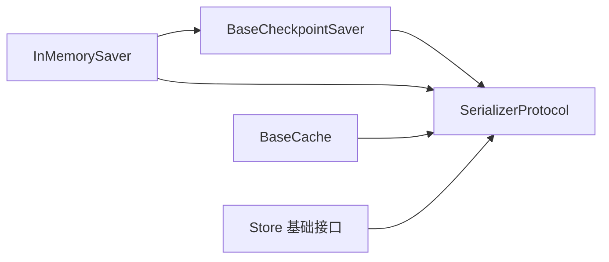

# 扩展和定制

<cite>
**本文引用的文件**
- [README.md](file://README.md)
- [libs/checkpoint/langgraph/checkpoint/base/__init__.py](file://libs/checkpoint/langgraph/checkpoint/base/__init__.py)
- [libs/checkpoint/langgraph/checkpoint/memory/__init__.py](file://libs/checkpoint/langgraph/checkpoint/memory/__init__.py)
- [libs/checkpoint/langgraph/cache/base/__init__.py](file://libs/checkpoint/langgraph/cache/base/__init__.py)
- [libs/checkpoint/langgraph/checkpoint/serde/base.py](file://libs/checkpoint/langgraph/checkpoint/serde/base.py)
- [libs/checkpoint/langgraph/checkpoint/serde/jsonplus.py](file://libs/checkpoint/langgraph/checkpoint/serde/jsonplus.py)
- [libs/checkpoint/langgraph/checkpoint/serde/encrypted.py](file://libs/checkpoint/langgraph/checkpoint/serde/encrypted.py)
- [libs/checkpoint/langgraph/checkpoint/serde/_msgpack.py](file://libs/checkpoint/langgraph/checkpoint/serde/_msgpack.py)
- [libs/checkpoint/langgraph/checkpoint/serde/types.py](file://libs/checkpoint/langgraph/checkpoint/serde/types.py)
- [libs/checkpoint/langgraph/store/base/__init__.py](file://libs/checkpoint/langgraph/store/base/__init__.py)
- [libs/checkpoint/langgraph/store/base/batch.py](file://libs/checkpoint/langgraph/store/base/batch.py)
- [libs/checkpoint/langgraph/store/base/embed.py](file://libs/checkpoint/langgraph/store/base/embed.py)
- [libs/checkpoint/langgraph/store/memory/__init__.py](file://libs/checkpoint/langgraph/store/memory/__init__.py)
</cite>

## 目录
1. [简介](#简介)
2. [项目结构](#项目结构)
3. [核心组件](#核心组件)
4. [架构总览](#架构总览)
5. [详细组件分析](#详细组件分析)
6. [依赖分析](#依赖分析)
7. [性能考虑](#性能考虑)
8. [故障排查指南](#故障排查指南)
9. [结论](#结论)
10. [附录](#附录)

## 简介
本指南面向希望在 LangGraph 中进行扩展与定制的开发者，重点覆盖以下主题：
- 自定义通道与检查点实现：如何扩展通道协议、实现检查点存取接口、选择序列化器与加密策略。
- 中间件系统：如何利用中间件机制对图执行进行拦截、增强与扩展。
- 插件开发最佳实践与设计模式：模块化、可插拔、可测试性与可维护性。
- 第三方工具与服务集成：如何将外部服务（如数据库、缓存、消息队列）无缝接入 LangGraph。
- 扩展点识别与接口实现指南：基于现有抽象类与协议，给出实现清单与注意事项。
- 性能优化与资源管理：序列化开销、并发写入、内存与磁盘占用控制。
- 向后兼容性与版本管理策略：版本字段、元数据兼容、迁移路径。
- 社区贡献与开源协作：行为准则、提交流程、问题模板与讨论渠道。

LangGraph 是一个低层的状态机编排框架，支持持久化、人类中断、调试与生产部署等能力。其扩展点主要集中在“通道”“检查点”“序列化”“缓存/存储”“中间件”等层面。

章节来源
- [README.md:1-83](file://README.md#L1-L83)

## 项目结构
仓库采用多库（libs）组织方式，其中与扩展和定制直接相关的核心模块包括：
- 检查点子系统：基础抽象、内存实现、序列化与类型系统、缓存与存储基类。
- 预置组件与示例：用于理解典型用法与集成模式。
- CLI、SDK 等周边工具：便于本地开发与部署。

下图展示与扩展相关的目录与文件关系：

图表来源
- [libs/checkpoint/langgraph/checkpoint/base/__init__.py:1-629](file://libs/checkpoint/langgraph/checkpoint/base/__init__.py#L1-L629)
- [libs/checkpoint/langgraph/checkpoint/memory/__init__.py:1-604](file://libs/checkpoint/langgraph/checkpoint/memory/__init__.py#L1-L604)
- [libs/checkpoint/langgraph/cache/base/__init__.py:1-49](file://libs/checkpoint/langgraph/cache/base/__init__.py#L1-L49)
- [libs/checkpoint/langgraph/checkpoint/serde/base.py](file://libs/checkpoint/langgraph/checkpoint/serde/base.py)
- [libs/checkpoint/langgraph/checkpoint/serde/jsonplus.py](file://libs/checkpoint/langgraph/checkpoint/serde/jsonplus.py)
- [libs/checkpoint/langgraph/checkpoint/serde/encrypted.py](file://libs/checkpoint/langgraph/checkpoint/serde/encrypted.py)
- [libs/checkpoint/langgraph/checkpoint/serde/_msgpack.py](file://libs/checkpoint/langgraph/checkpoint/serde/_msgpack.py)
- [libs/checkpoint/langgraph/checkpoint/serde/types.py](file://libs/checkpoint/langgraph/checkpoint/serde/types.py)
- [libs/checkpoint/langgraph/store/base/__init__.py](file://libs/checkpoint/langgraph/store/base/__init__.py)
- [libs/checkpoint/langgraph/store/base/batch.py](file://libs/checkpoint/langgraph/store/base/batch.py)
- [libs/checkpoint/langgraph/store/base/embed.py](file://libs/checkpoint/langgraph/store/base/embed.py)
- [libs/checkpoint/langgraph/store/memory/__init__.py](file://libs/checkpoint/langgraph/store/memory/__init__.py)

章节来源
- [README.md:1-83](file://README.md#L1-L83)

## 核心组件
本节聚焦于扩展与定制的关键抽象与实现，帮助你快速定位扩展点并开始二次开发。

- 基础检查点抽象与协议
  - 定义了检查点数据结构、元数据、版本跟踪、通道协议类型等。
  - 提供同步与异步接口，便于在不同运行时中使用。
  - 关键接口：获取、列出、保存、保存中间写入、删除线程、复制线程、修剪等。
  - 版本生成策略与序列化器注入点。

- 内存检查点实现
  - 提供 InMemorySaver，适合测试与调试。
  - 展示了如何组织存储结构（按线程、命名空间、检查点 ID）、如何处理 blob（大对象）与中间写入。
  - 提供上下文管理器与异步上下文支持。

- 序列化与类型系统
  - SerializerProtocol 抽象，支持 typed loads/dumps 与 allowlist。
  - JsonPlusSerializer 提供 JSON+ 扩展（含类型信息、复杂对象）。
  - EncryptedSerializer 对底层序列化器进行透明加密包装。
  - MsgPack 实现与类型常量（错误、中断、调度、恢复）。

- 缓存与存储抽象
  - BaseCache 抽象，统一缓存的 get/put/clear 及异步变体。
  - Store 基础接口与批量/嵌入能力，便于对接外部 KV/向量数据库。

章节来源
- [libs/checkpoint/langgraph/checkpoint/base/__init__.py:122-491](file://libs/checkpoint/langgraph/checkpoint/base/__init__.py#L122-L491)
- [libs/checkpoint/langgraph/checkpoint/memory/__init__.py:31-122](file://libs/checkpoint/langgraph/checkpoint/memory/__init__.py#L31-L122)
- [libs/checkpoint/langgraph/checkpoint/serde/base.py](file://libs/checkpoint/langgraph/checkpoint/serde/base.py)
- [libs/checkpoint/langgraph/checkpoint/serde/jsonplus.py](file://libs/checkpoint/langgraph/checkpoint/serde/jsonplus.py)
- [libs/checkpoint/langgraph/checkpoint/serde/encrypted.py](file://libs/checkpoint/langgraph/checkpoint/serde/encrypted.py)
- [libs/checkpoint/langgraph/checkpoint/serde/_msgpack.py](file://libs/checkpoint/langgraph/checkpoint/serde/_msgpack.py)
- [libs/checkpoint/langgraph/checkpoint/serde/types.py](file://libs/checkpoint/langgraph/checkpoint/serde/types.py)
- [libs/checkpoint/langgraph/cache/base/__init__.py:15-49](file://libs/checkpoint/langgraph/cache/base/__init__.py#L15-L49)
- [libs/checkpoint/langgraph/store/base/__init__.py](file://libs/checkpoint/langgraph/store/base/__init__.py)
- [libs/checkpoint/langgraph/store/base/batch.py](file://libs/checkpoint/langgraph/store/base/batch.py)
- [libs/checkpoint/langgraph/store/base/embed.py](file://libs/checkpoint/langgraph/store/base/embed.py)

## 架构总览
LangGraph 的扩展架构围绕“通道—检查点—序列化—缓存/存储—中间件”的链路展开。下图展示了从调用到持久化的关键交互：

图表来源
- [libs/checkpoint/langgraph/checkpoint/base/__init__.py:173-287](file://libs/checkpoint/langgraph/checkpoint/base/__init__.py#L173-L287)
- [libs/checkpoint/langgraph/checkpoint/memory/__init__.py:135-371](file://libs/checkpoint/langgraph/checkpoint/memory/__init__.py#L135-L371)
- [libs/checkpoint/langgraph/checkpoint/serde/base.py](file://libs/checkpoint/langgraph/checkpoint/serde/base.py)

## 详细组件分析

### 组件一：自定义通道与检查点实现
目标：为特定业务场景定义新的通道类型，并实现持久化与恢复逻辑。

- 通道协议与类型
  - 通道是状态的最小单元，支持“检查点”“更新”“版本”等语义。
  - 通过通道协议类型与版本映射，确保跨节点一致性与可见性。
  - 错误、中断、调度、恢复等特殊写入使用负索引避免冲突。

- 检查点格式与元数据
  - 检查点包含版本号、时间戳、通道值、通道版本、节点版本追踪、更新通道列表等。
  - 元数据包含来源（输入/循环/更新/分叉）、步骤、父检查点映射、运行 ID 等。
  - 支持时间旅行调试与父子关系追踪。

- 实现要点
  - 自定义通道：实现通道协议，提供 checkpoint() 与版本生成策略。
  - 自定义检查点存取器：继承 BaseCheckpointSaver，实现 get/get_tuple/list/put/put_writes/delete_thread/copy_thread/prune 等；若需要异步，实现对应的 a* 方法。
  - 序列化器选择：根据数据复杂度与安全需求选择 JsonPlus 或 Encrypted 包装；必要时扩展 MsgPack allowlist。
  - 大对象处理：使用 blob 存储或外部 KV，避免将大对象直接写入检查点。

图表来源
- [libs/checkpoint/langgraph/checkpoint/base/__init__.py:122-491](file://libs/checkpoint/langgraph/checkpoint/base/__init__.py#L122-L491)
- [libs/checkpoint/langgraph/checkpoint/memory/__init__.py:31-122](file://libs/checkpoint/langgraph/checkpoint/memory/__init__.py#L31-L122)
- [libs/checkpoint/langgraph/checkpoint/serde/base.py](file://libs/checkpoint/langgraph/checkpoint/serde/base.py)
- [libs/checkpoint/langgraph/checkpoint/serde/jsonplus.py](file://libs/checkpoint/langgraph/checkpoint/serde/jsonplus.py)
- [libs/checkpoint/langgraph/checkpoint/serde/encrypted.py](file://libs/checkpoint/langgraph/checkpoint/serde/encrypted.py)

章节来源
- [libs/checkpoint/langgraph/checkpoint/base/__init__.py:65-121](file://libs/checkpoint/langgraph/checkpoint/base/__init__.py#L65-L121)
- [libs/checkpoint/langgraph/checkpoint/base/__init__.py:35-61](file://libs/checkpoint/langgraph/checkpoint/base/__init__.py#L35-L61)
- [libs/checkpoint/langgraph/checkpoint/base/__init__.py:597-629](file://libs/checkpoint/langgraph/checkpoint/base/__init__.py#L597-L629)
- [libs/checkpoint/langgraph/checkpoint/memory/__init__.py:135-371](file://libs/checkpoint/langgraph/checkpoint/memory/__init__.py#L135-L371)

### 组件二：中间件系统使用与扩展
- 中间件定位：在图执行前后插入钩子，实现日志、指标、审计、权限校验、重试、熔断等功能。
- 扩展方式：
  - 在 Graph 编译阶段注入中间件，或在运行时动态启用/禁用。
  - 通过拦截配置（RunnableConfig）传递上下文，如 thread_id、checkpoint_id、run_id 等。
  - 将中间件作为独立模块发布，遵循最小依赖与可组合原则。
- 最佳实践：
  - 保持无状态或幂等，避免副作用影响其他节点。
  - 明确中间件顺序与职责边界，避免相互覆盖。
  - 提供开关与采样策略，降低生产环境开销。

[本节为概念性说明，不直接分析具体源码文件]

### 组件三：插件开发最佳实践与设计模式
- 设计模式
  - 工厂模式：用于创建通道、检查点存取器、序列化器实例，便于替换与测试。
  - 装饰器模式：对节点函数进行包装，统一注入中间件逻辑。
  - 策略模式：针对不同场景（内存/Postgres/SQLite/Redis）选择不同的存取策略。
  - 观察者模式：通过 put_writes 与事件钩子实现可观测性与审计。
- 可测试性
  - 使用 InMemorySaver 进行单元测试，模拟检查点与中间写入。
  - 通过可注入的 serde 与 cache 接口，隔离外部依赖。
- 可维护性
  - 将第三方集成封装为适配器，统一异常与超时处理。
  - 提供配置驱动的插件注册表，支持热插拔。

[本节为概念性说明，不直接分析具体源码文件]

### 组件四：集成第三方工具与服务
- 数据库与持久化
  - 使用 Postgres/SQLite 等实现高性能、可扩展的检查点存取。
  - 注意事务一致性、并发写入与索引设计。
- 缓存
  - 使用 Redis/Memcached 等缓存热点检查点，加速恢复。
  - 结合 TTL 与淘汰策略，平衡内存与命中率。
- 消息队列与流式处理
  - 将 put_writes 输出到消息队列，实现异步处理与解耦。
  - 通过任务 ID 与路径（task_path）追踪写入来源。
- 审计与可观测性
  - 在 put_writes 中记录变更历史，结合 run_id 进行轨迹追踪。
  - 通过元数据扩展（EXCLUDED_METADATA_KEYS 外部键）传递业务上下文。

章节来源
- [libs/checkpoint/langgraph/cache/base/__init__.py:15-49](file://libs/checkpoint/langgraph/cache/base/__init__.py#L15-L49)
- [libs/checkpoint/langgraph/store/base/__init__.py](file://libs/checkpoint/langgraph/store/base/__init__.py)
- [libs/checkpoint/langgraph/store/base/batch.py](file://libs/checkpoint/langgraph/store/base/batch.py)
- [libs/checkpoint/langgraph/store/base/embed.py](file://libs/checkpoint/langgraph/store/base/embed.py)

### 组件五：扩展点识别与接口实现指南
- 检查点扩展点
  - 继承 BaseCheckpointSaver，实现 get/get_tuple/list/put/put_writes/delete_thread/copy_thread/prune。
  - 若需要异步，实现 a* 对应方法。
  - 自定义版本生成策略（get_next_version），确保单调递增。
- 序列化扩展点
  - 实现 SerializerProtocol，提供 typed loads/dumps。
  - 对 JsonPlusSerializer 进行 allowlist 扩展，限制可反序列化类型。
  - 使用 EncryptedSerializer 包装敏感数据。
- 缓存扩展点
  - 继承 BaseCache，实现 get/put/clear 及异步变体。
  - 与外部缓存系统（Redis、Memcached）对接。
- 存储扩展点
  - 实现 Store 基础接口，支持批量写入与嵌入向量。
  - 与外部 KV/向量数据库对接。

章节来源
- [libs/checkpoint/langgraph/checkpoint/base/__init__.py:122-491](file://libs/checkpoint/langgraph/checkpoint/base/__init__.py#L122-L491)
- [libs/checkpoint/langgraph/checkpoint/serde/base.py](file://libs/checkpoint/langgraph/checkpoint/serde/base.py)
- [libs/checkpoint/langgraph/checkpoint/serde/jsonplus.py](file://libs/checkpoint/langgraph/checkpoint/serde/jsonplus.py)
- [libs/checkpoint/langgraph/checkpoint/serde/encrypted.py](file://libs/checkpoint/langgraph/checkpoint/serde/encrypted.py)
- [libs/checkpoint/langgraph/cache/base/__init__.py:15-49](file://libs/checkpoint/langgraph/cache/base/__init__.py#L15-L49)
- [libs/checkpoint/langgraph/store/base/__init__.py](file://libs/checkpoint/langgraph/store/base/__init__.py)

### 组件六：算法与流程图（以检查点创建为例）

图表来源
- [libs/checkpoint/langgraph/checkpoint/base/__init__.py:597-629](file://libs/checkpoint/langgraph/checkpoint/base/__init__.py#L597-L629)

## 依赖分析
- 组件内聚与耦合
  - BaseCheckpointSaver 与 SerializerProtocol 解耦，便于替换序列化策略。
  - InMemorySaver 仅依赖抽象接口，易于替换为其他实现。
  - 缓存与存储抽象独立于检查点实现，支持组合使用。
- 外部依赖
  - 运行时依赖（如 asyncio、上下文管理器）被清晰隔离在具体实现中。
  - 第三方集成通过适配器模式接入，避免强耦合。

图表来源
- [libs/checkpoint/langgraph/checkpoint/base/__init__.py:122-491](file://libs/checkpoint/langgraph/checkpoint/base/__init__.py#L122-L491)
- [libs/checkpoint/langgraph/checkpoint/memory/__init__.py:31-122](file://libs/checkpoint/langgraph/checkpoint/memory/__init__.py#L31-L122)
- [libs/checkpoint/langgraph/cache/base/__init__.py:15-49](file://libs/checkpoint/langgraph/cache/base/__init__.py#L15-L49)
- [libs/checkpoint/langgraph/store/base/__init__.py](file://libs/checkpoint/langgraph/store/base/__init__.py)

章节来源
- [libs/checkpoint/langgraph/checkpoint/base/__init__.py:122-491](file://libs/checkpoint/langgraph/checkpoint/base/__init__.py#L122-L491)
- [libs/checkpoint/langgraph/checkpoint/memory/__init__.py:31-122](file://libs/checkpoint/langgraph/checkpoint/memory/__init__.py#L31-L122)
- [libs/checkpoint/langgraph/cache/base/__init__.py:15-49](file://libs/checkpoint/langgraph/cache/base/__init__.py#L15-L49)
- [libs/checkpoint/langgraph/store/base/__init__.py](file://libs/checkpoint/langgraph/store/base/__init__.py)

## 性能考虑
- 序列化与反序列化
  - 优先使用 JsonPlusSerializer，必要时启用 MsgPack allowlist 以减少反序列化风险。
  - 对大对象使用 blob 存储或外部 KV，避免检查点膨胀。
- 并发与锁
  - 在高并发写入场景，使用带锁的持久化实现或外部分布式锁。
  - 异步接口（a*）避免阻塞主线程，但需注意资源竞争与幂等性。
- 内存与磁盘
  - InMemorySaver 仅适用于测试/调试；生产环境使用持久化存取器。
  - 合理设置检查点保留策略（prune），定期清理历史快照。
- 缓存命中
  - 使用 BaseCache 缓存热点检查点，结合 TTL 与淘汰策略提升恢复速度。
- I/O 优化
  - 批量写入（batch store）与合并写入（合并多次 put_writes）减少 I/O 次数。

[本节为通用性能建议，不直接分析具体源码文件]

## 故障排查指南
- 常见问题
  - 空通道异常：当通道未初始化时尝试 checkpoint() 会触发 EmptyChannelError，需在创建检查点前确保通道有值。
  - 版本冲突：通道版本必须单调递增，自定义版本生成策略需保证唯一性与可排序性。
  - 元数据污染：EXCLUDED_METADATA_KEYS 之外的键会被合并到元数据，注意避免重复或非法键名。
  - 异步阻塞：若使用同步实现暴露异步接口，需确保线程池或事件循环正确配置。
- 定位手段
  - 通过 put_writes 记录中间写入，结合 task_id 与 task_path 追踪来源。
  - 使用 list 接口列出检查点，结合过滤条件缩小范围。
  - 在序列化器层面开启严格模式（allowlist），捕获潜在类型不匹配问题。

章节来源
- [libs/checkpoint/langgraph/checkpoint/base/__init__.py:513-543](file://libs/checkpoint/langgraph/checkpoint/base/__init__.py#L513-L543)
- [libs/checkpoint/langgraph/checkpoint/base/__init__.py:565-575](file://libs/checkpoint/langgraph/checkpoint/base/__init__.py#L565-L575)
- [libs/checkpoint/langgraph/checkpoint/memory/__init__.py:372-409](file://libs/checkpoint/langgraph/checkpoint/memory/__init__.py#L372-L409)

## 结论
LangGraph 的扩展与定制能力建立在清晰的抽象之上：通道协议、检查点抽象、序列化协议、缓存与存储接口。通过遵循本文档的扩展点识别、接口实现与最佳实践，你可以：
- 快速实现自定义通道与检查点存取器；
- 以中间件与插件形式扩展功能；
- 安全高效地集成第三方工具与服务；
- 在性能与可靠性之间取得平衡；
- 保持向后兼容与版本演进的稳定性；
- 积极参与社区贡献与协作。

[本节为总结性内容，不直接分析具体源码文件]

## 附录
- 社区与贡献
  - 行为准则与讨论渠道：参见项目根目录中的社区链接与说明。
  - 提交流程：遵循 Pull Request 模板与质量标准，提供测试与文档。
  - 问题模板：使用 GitHub Issues 模板描述问题背景、复现步骤与期望行为。
- 版本与兼容
  - 检查点版本号与元数据兼容策略：遵循现有字段与枚举，避免破坏性变更。
  - 迁移路径：提供版本升级脚本与回滚策略，确保生产环境平滑过渡。

章节来源
- [README.md:68-77](file://README.md#L68-L77)