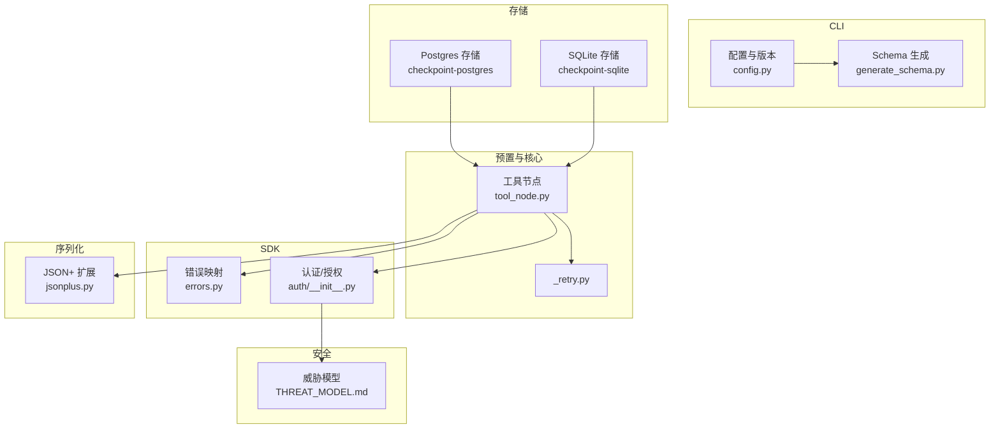
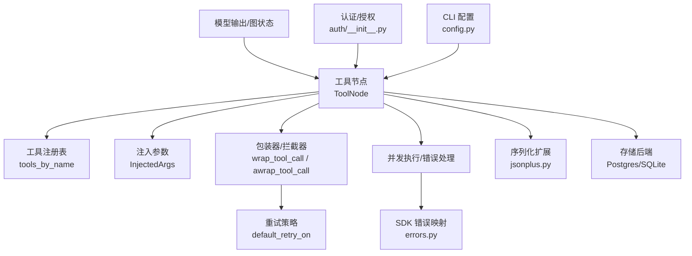
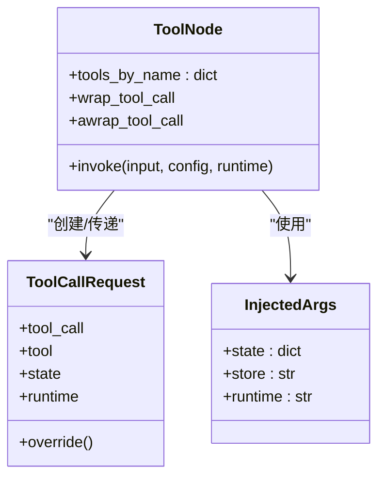
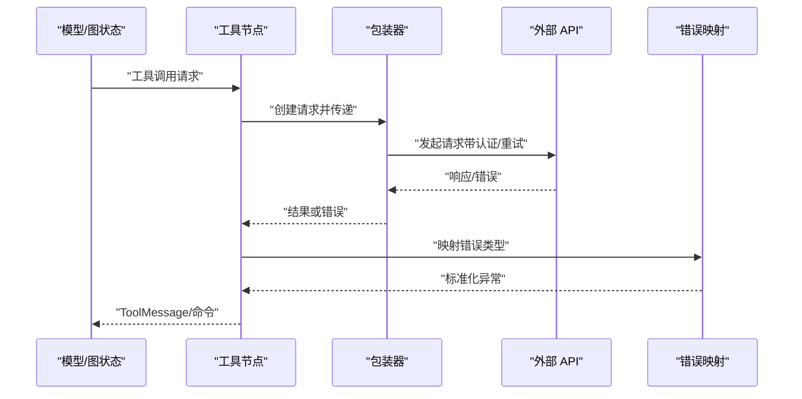
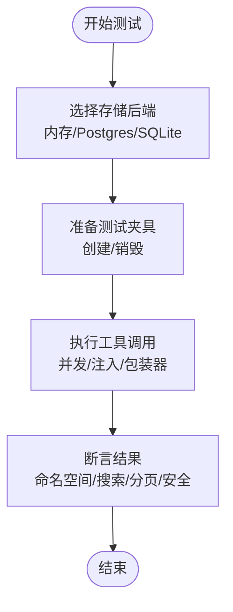
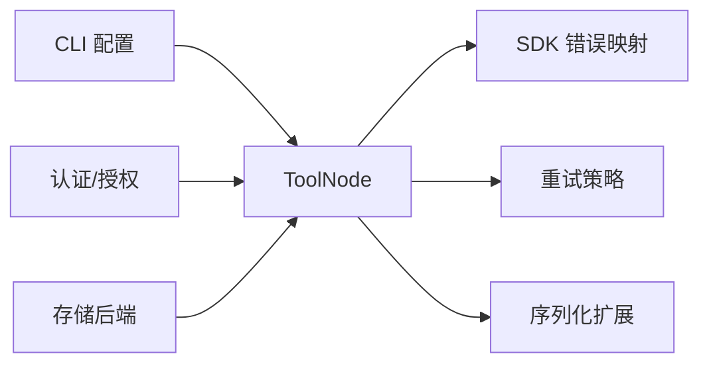

# 插件集成和第三方服务

<cite>
**本文引用的文件**
- [README.md](file://README.md)
- [tool_node.py](file://libs/prebuilt/langgraph/prebuilt/tool_node.py)
- [jsonplus.py](file://libs/checkpoint/langgraph/checkpoint/serde/jsonplus.py)
- [_retry.py](file://libs/langgraph/langgraph/_internal/_retry.py)
- [errors.py](file://libs/sdk-py/langgraph_sdk/errors.py)
- [auth/__init__.py](file://libs/sdk-py/langgraph_sdk/auth/__init__.py)
- [THREAT_MODEL.md](file://.github/THREAT_MODEL.md)
- [config.py](file://libs/cli/langgraph_cli/config.py)
- [generate_schema.py](file://libs/cli/generate_schema.py)
- [test_store.py (checkpoint-postgres)](file://libs/checkpoint-postgres/tests/test_store.py)
- [test_store.py (sqlite)](file://libs/checkpoint-sqlite/tests/test_store.py)
- [conftest.py (langgraph tests)](file://libs/langgraph/tests/conftest.py)
- [conftest_store.py (prebuilt tests)](file://libs/prebuilt/tests/conftest_store.py)
</cite>

## 目录
1. [简介](#简介)
2. [项目结构](#项目结构)
3. [核心组件](#核心组件)
4. [架构总览](#架构总览)
5. [组件详解](#组件详解)
6. [依赖关系分析](#依赖关系分析)
7. [性能考量](#性能考量)
8. [故障排查指南](#故障排查指南)
9. [结论](#结论)
10. [附录](#附录)

## 简介
本指南聚焦于 LangGraph 的插件与第三方服务集成能力，围绕以下目标展开：
- 解释 LangGraph 插件系统的架构与扩展机制（以工具调用节点为核心）。
- 提供工具调用插件的开发与集成方法。
- 总结第三方服务适配模式与接口封装技术。
- 给出外部 API 集成的完整示例思路：认证、错误处理、重试策略。
- 说明插件配置管理、动态加载与卸载机制的实现路径。
- 讨论插件间依赖管理与版本兼容性处理。
- 提供插件测试、模拟与隔离的最佳实践。
- 汇总常见第三方服务集成案例（数据库、消息队列、文件存储等）。
- 强化安全与权限控制机制。

LangGraph 在本仓库中提供了可直接使用的工具执行节点与运行时基础设施，为构建状态化代理与工作流提供了基础能力；同时 SDK 与 CLI 提供了认证、错误映射、重试策略与配置管理等支撑模块。

**章节来源**
- [README.md:1-83](file://README.md#L1-L83)

## 项目结构
仓库采用多库分层组织，核心与预置组件位于 libs 下，示例与文档在 examples 与 docs 中。与插件与第三方服务集成相关的关键模块如下：
- 工具执行与拦截：libs/prebuilt/langgraph/prebuilt/tool_node.py
- 序列化与反序列化扩展：libs/checkpoint/langgraph/checkpoint/serde/jsonplus.py
- 重试策略：libs/langgraph/langgraph/_internal/_retry.py
- SDK 错误类型与映射：libs/sdk-py/langgraph_sdk/errors.py
- SDK 认证与授权框架：libs/sdk-py/langgraph_sdk/auth/__init__.py
- CLI 配置与版本约束：libs/cli/langgraph_cli/config.py、libs/cli/generate_schema.py
- 存储与持久化（数据库/SQLite）：libs/checkpoint-postgres、libs/checkpoint-sqlite 及其 tests
- 安全威胁模型：.github/THREAT_MODEL.md

**图表来源**
- [tool_node.py:1-800](file://libs/prebuilt/langgraph/prebuilt/tool_node.py#L1-L800)
- [_retry.py:1-29](file://libs/langgraph/langgraph/_internal/_retry.py#L1-L29)
- [errors.py:82-231](file://libs/sdk-py/langgraph_sdk/errors.py#L82-L231)
- [auth/__init__.py:204-813](file://libs/sdk-py/langgraph_sdk/auth/__init__.py#L204-L813)
- [jsonplus.py:583-773](file://libs/checkpoint/langgraph/checkpoint/serde/jsonplus.py#L583-L773)
- [config.py:255-1340](file://libs/cli/langgraph_cli/config.py#L255-L1340)
- [generate_schema.py:147-178](file://libs/cli/generate_schema.py#L147-L178)
- [THREAT_MODEL.md:229-442](file://.github/THREAT_MODEL.md#L229-L442)

**章节来源**
- [README.md:1-83](file://README.md#L1-L83)
- [tool_node.py:1-800](file://libs/prebuilt/langgraph/prebuilt/tool_node.py#L1-L800)
- [config.py:255-1340](file://libs/cli/langgraph_cli/config.py#L255-L1340)
- [generate_schema.py:147-178](file://libs/cli/generate_schema.py#L147-L178)

## 核心组件
- 工具节点与拦截器：提供工具注册、参数注入（状态、存储、运行时）、并发执行、错误处理与包装器（同步/异步）。
- 序列化扩展：支持构造器、方法、Pydantic 对象等的扩展钩子，便于跨进程/持久化传输复杂对象。
- 重试策略：默认对连接错误与 5xx 类 HTTP 错误进行重试，避免对编程类错误进行无意义重试。
- SDK 错误映射：按状态码映射到具体异常类型，并提取请求 ID 等上下文信息。
- 认证与授权：通过装饰器注册处理器，支持全局与资源/动作级细粒度控制。
- CLI 配置：约束 Python/Node 版本、依赖声明与容器镜像打包路径，保障部署一致性。
- 存储后端：提供内存、PostgreSQL、SQLite 等多种存储实现，支持命名空间、搜索、分页与安全过滤。

**章节来源**
- [tool_node.py:619-799](file://libs/prebuilt/langgraph/prebuilt/tool_node.py#L619-L799)
- [jsonplus.py:583-773](file://libs/checkpoint/langgraph/checkpoint/serde/jsonplus.py#L583-L773)
- [_retry.py:1-29](file://libs/langgraph/langgraph/_internal/_retry.py#L1-L29)
- [errors.py:82-231](file://libs/sdk-py/langgraph_sdk/errors.py#L82-L231)
- [auth/__init__.py:204-813](file://libs/sdk-py/langgraph_sdk/auth/__init__.py#L204-L813)
- [config.py:255-1340](file://libs/cli/langgraph_cli/config.py#L255-L1340)
- [test_store.py (checkpoint-postgres):281-368](file://libs/checkpoint-postgres/tests/test_store.py#L281-L368)
- [test_store.py (sqlite):397-433](file://libs/checkpoint-sqlite/tests/test_store.py#L397-L433)

## 架构总览
LangGraph 插件体系围绕“工具节点”展开，工具节点负责解析输入、并行执行工具调用、注入状态/存储/运行时上下文、错误处理与命令式状态更新。SDK 提供认证、错误映射与加密扩展；CLI 负责配置与版本约束；存储后端提供持久化能力。

**图表来源**
- [tool_node.py:619-799](file://libs/prebuilt/langgraph/prebuilt/tool_node.py#L619-L799)
- [_retry.py:1-29](file://libs/langgraph/langgraph/_internal/_retry.py#L1-L29)
- [errors.py:82-231](file://libs/sdk-py/langgraph_sdk/errors.py#L82-L231)
- [jsonplus.py:583-773](file://libs/checkpoint/langgraph/checkpoint/serde/jsonplus.py#L583-L773)
- [auth/__init__.py:204-813](file://libs/sdk-py/langgraph_sdk/auth/__init__.py#L204-L813)
- [config.py:255-1340](file://libs/cli/langgraph_cli/config.py#L255-L1340)

## 组件详解

### 工具节点与工具调用插件
- 工具注册与注入：工具节点维护名称到工具实例的映射，并在初始化时分析签名与注解，建立注入参数映射（状态字段、存储、运行时）。
- 包装器与拦截器：支持同步/异步包装器，允许在执行前修改请求、执行多次以实现重试、缓存短路或条件重试。
- 并发执行与错误处理：根据输入解析工具调用列表，按配置并发执行；提供灵活的错误处理策略（布尔、字符串、类型、元组、可调用）。
- 命令式状态更新：工具可返回命令以更新状态、导航或发送消息。

**图表来源**
- [tool_node.py:619-799](file://libs/prebuilt/langgraph/prebuilt/tool_node.py#L619-L799)
- [tool_node.py:130-198](file://libs/prebuilt/langgraph/prebuilt/tool_node.py#L130-L198)
- [tool_node.py:564-617](file://libs/prebuilt/langgraph/prebuilt/tool_node.py#L564-L617)

**章节来源**
- [tool_node.py:619-799](file://libs/prebuilt/langgraph/prebuilt/tool_node.py#L619-L799)
- [tool_node.py:1007-1336](file://libs/prebuilt/langgraph/prebuilt/tool_node.py#L1007-L1336)

### 第三方服务适配与接口封装
- 适配模式：将外部服务封装为工具函数或工具类，利用工具节点的注入能力访问状态与存储；通过包装器实现认证、重试、缓存与可观测性。
- 接口封装：对外部 API 的调用应统一在工具内部完成，暴露简洁的参数与返回值；必要时在工具内实现幂等与去重逻辑。
- 数据安全：使用 SDK 加密扩展时，遵循 SDK 的处理器注册与校验流程，确保加密/解密逻辑正确且仅在服务端执行。

**章节来源**
- [auth/__init__.py:204-813](file://libs/sdk-py/langgraph_sdk/auth/__init__.py#L204-L813)
- [THREAT_MODEL.md:229-442](file://.github/THREAT_MODEL.md#L229-L442)

### 外部 API 集成示例（思路）
- 认证：在包装器中读取凭据并设置请求头；或通过 SDK 认证处理器集中处理。
- 错误处理：使用 SDK 错误映射，区分业务错误与网络错误；对可恢复错误进行重试。
- 重试机制：基于默认重试策略对连接错误与 5xx 进行指数退避重试；对业务错误不重试。
- 序列化：若需要跨进程/持久化传输复杂对象，使用序列化扩展钩子进行构造器/方法/Pydantic 对象的重建。

**图表来源**
- [tool_node.py:790-800](file://libs/prebuilt/langgraph/prebuilt/tool_node.py#L790-L800)
- [_retry.py:1-29](file://libs/langgraph/langgraph/_internal/_retry.py#L1-L29)
- [errors.py:82-231](file://libs/sdk-py/langgraph_sdk/errors.py#L82-L231)

### 配置管理、动态加载与卸载
- 配置管理：CLI 配置文件用于约束语言版本、依赖与打包路径，保证运行时一致性。
- 动态加载：工具节点支持在运行时注册新工具（例如通过中间件包装器），并在执行时按需计算注入参数。
- 卸载与清理：存储后端提供连接池/管道的生命周期管理，测试夹具展示了创建与销毁流程。

**章节来源**
- [config.py:255-1340](file://libs/cli/langgraph_cli/config.py#L255-L1340)
- [tool_node.py:1007-1336](file://libs/prebuilt/langgraph/prebuilt/tool_node.py#L1007-L1336)
- [conftest.py (langgraph tests):92-141](file://libs/langgraph/tests/conftest.py#L92-L141)
- [conftest_store.py (prebuilt tests):116-145](file://libs/prebuilt/tests/conftest_store.py#L116-L145)

### 插件间依赖管理与版本兼容
- 版本约束：CLI 生成 Schema 与配置文件对 Python/Node 版本进行约束，避免运行时差异。
- 兼容性：通过 SDK 错误映射与重试策略提升对不同服务版本的兼容性；序列化扩展支持对象重建，降低接口变更影响。

**章节来源**
- [generate_schema.py:147-178](file://libs/cli/generate_schema.py#L147-L178)
- [config.py:255-278](file://libs/cli/langgraph_cli/config.py#L255-L278)
- [jsonplus.py:583-773](file://libs/checkpoint/langgraph/checkpoint/serde/jsonplus.py#L583-L773)

### 测试、模拟与隔离最佳实践
- 存储测试：使用内存、PostgreSQL、SQLite 等多种后端进行测试，覆盖命名空间、搜索、分页与安全过滤。
- 并发与注入：验证工具节点的并发执行与注入参数行为。
- 错误映射：验证不同状态码映射到对应异常类型，以及请求 ID 提取。

**图表来源**
- [test_store.py (checkpoint-postgres):281-368](file://libs/checkpoint-postgres/tests/test_store.py#L281-L368)
- [test_store.py (sqlite):397-433](file://libs/checkpoint-sqlite/tests/test_store.py#L397-L433)
- [conftest.py (langgraph tests):92-141](file://libs/langgraph/tests/conftest.py#L92-L141)

**章节来源**
- [test_store.py (checkpoint-postgres):281-368](file://libs/checkpoint-postgres/tests/test_store.py#L281-L368)
- [test_store.py (sqlite):397-433](file://libs/checkpoint-sqlite/tests/test_store.py#L397-L433)
- [conftest.py (langgraph tests):92-141](file://libs/langgraph/tests/conftest.py#L92-L141)
- [conftest_store.py (prebuilt tests):116-145](file://libs/prebuilt/tests/conftest_store.py#L116-L145)

### 常见第三方服务集成案例
- 数据库：使用 Postgres/SQLite 存储后端进行数据读写、命名空间管理与搜索；注意安全过滤与 SQL 注入防护。
- 消息队列：通过工具封装消息发送/接收逻辑，结合包装器实现重试与幂等。
- 文件存储：封装上传/下载接口，结合状态注入记录元数据，使用包装器实现鉴权与重试。

**章节来源**
- [test_store.py (checkpoint-postgres):281-368](file://libs/checkpoint-postgres/tests/test_store.py#L281-L368)
- [test_store.py (sqlite):397-433](file://libs/checkpoint-sqlite/tests/test_store.py#L397-L433)
- [test_store.py (sqlite):1085-1111](file://libs/checkpoint-sqlite/tests/test_store.py#L1085-L1111)

### 安全与权限控制
- 认证与授权：通过装饰器注册处理器，支持全局与资源/动作级控制；默认拒绝策略配合特定允许处理器实现最小权限。
- 加密扩展：SDK 提供加密处理器注册框架，需严格校验处理器形状与行为。
- 威胁模型：明确加密处理器边界与信任模型，防止恶意处理器造成风险。

**章节来源**
- [auth/__init__.py:204-813](file://libs/sdk-py/langgraph_sdk/auth/__init__.py#L204-L813)
- [THREAT_MODEL.md:229-442](file://.github/THREAT_MODEL.md#L229-L442)

## 依赖关系分析
- 工具节点依赖 SDK 错误映射与重试策略，以实现稳健的外部服务交互。
- 序列化扩展为跨进程/持久化传输提供支持，降低对象重建成本。
- CLI 配置与 Schema 生成确保运行时环境一致，减少版本漂移带来的问题。
- 存储后端为状态化代理提供持久化能力，测试夹具展示生命周期管理。

**图表来源**
- [tool_node.py:619-799](file://libs/prebuilt/langgraph/prebuilt/tool_node.py#L619-L799)
- [errors.py:82-231](file://libs/sdk-py/langgraph_sdk/errors.py#L82-L231)
- [_retry.py:1-29](file://libs/langgraph/langgraph/_internal/_retry.py#L1-L29)
- [jsonplus.py:583-773](file://libs/checkpoint/langgraph/checkpoint/serde/jsonplus.py#L583-L773)
- [config.py:255-1340](file://libs/cli/langgraph_cli/config.py#L255-L1340)
- [auth/__init__.py:204-813](file://libs/sdk-py/langgraph_sdk/auth/__init__.py#L204-L813)

**章节来源**
- [tool_node.py:619-799](file://libs/prebuilt/langgraph/prebuilt/tool_node.py#L619-L799)
- [errors.py:82-231](file://libs/sdk-py/langgraph_sdk/errors.py#L82-L231)
- [_retry.py:1-29](file://libs/langgraph/langgraph/_internal/_retry.py#L1-L29)
- [jsonplus.py:583-773](file://libs/checkpoint/langgraph/checkpoint/serde/jsonplus.py#L583-L773)
- [config.py:255-1340](file://libs/cli/langgraph_cli/config.py#L255-L1340)
- [auth/__init__.py:204-813](file://libs/sdk-py/langgraph_sdk/auth/__init__.py#L204-L813)

## 性能考量
- 并发执行：工具节点支持并行执行多个工具调用，提高吞吐量。
- 注入优化：在初始化阶段一次性分析注入参数，避免重复反射开销。
- 序列化与重建：合理使用序列化扩展，减少不必要的对象重建成本。
- 存储性能：根据场景选择内存/Postgres/SQLite，结合命名空间与搜索索引优化查询。

[本节为通用指导，无需列出具体文件来源]

## 故障排查指南
- 错误映射：确认状态码映射是否正确，检查请求 ID 是否被提取。
- 重试策略：区分网络错误与业务错误，避免对编程类错误进行重试。
- 存储安全：验证 SQL 注入防护与参数化查询，确保搜索过滤生效。
- 认证授权：检查处理器注册与调用顺序，确保默认拒绝策略与允许处理器协同工作。

**章节来源**
- [errors.py:82-231](file://libs/sdk-py/langgraph_sdk/errors.py#L82-L231)
- [_retry.py:1-29](file://libs/langgraph/langgraph/_internal/_retry.py#L1-L29)
- [test_store.py (sqlite):1085-1111](file://libs/checkpoint-sqlite/tests/test_store.py#L1085-L1111)
- [auth/__init__.py:204-813](file://libs/sdk-py/langgraph_sdk/auth/__init__.py#L204-L813)

## 结论
LangGraph 的插件体系以工具节点为核心，结合 SDK 的认证、错误映射与加密扩展，以及 CLI 的配置与版本约束，形成了从开发、测试到部署的一体化能力。通过包装器与拦截器实现重试、缓存与可观测性；通过存储后端提供持久化；通过安全框架与威胁模型保障运行时安全。该体系既适合快速原型开发，也适合生产级部署与演进。

[本节为总结性内容，无需列出具体文件来源]

## 附录
- 示例与文档入口：参阅根目录 README 中的文档链接与示例说明。
- 工具调用示例：参考 examples 目录中的相关示例笔记本（如工具调用示例）。

**章节来源**
- [README.md:61-83](file://README.md#L61-L83)