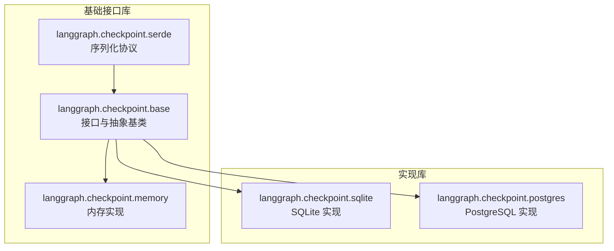
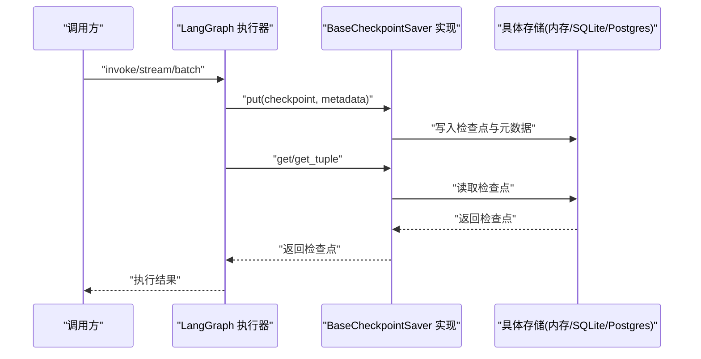
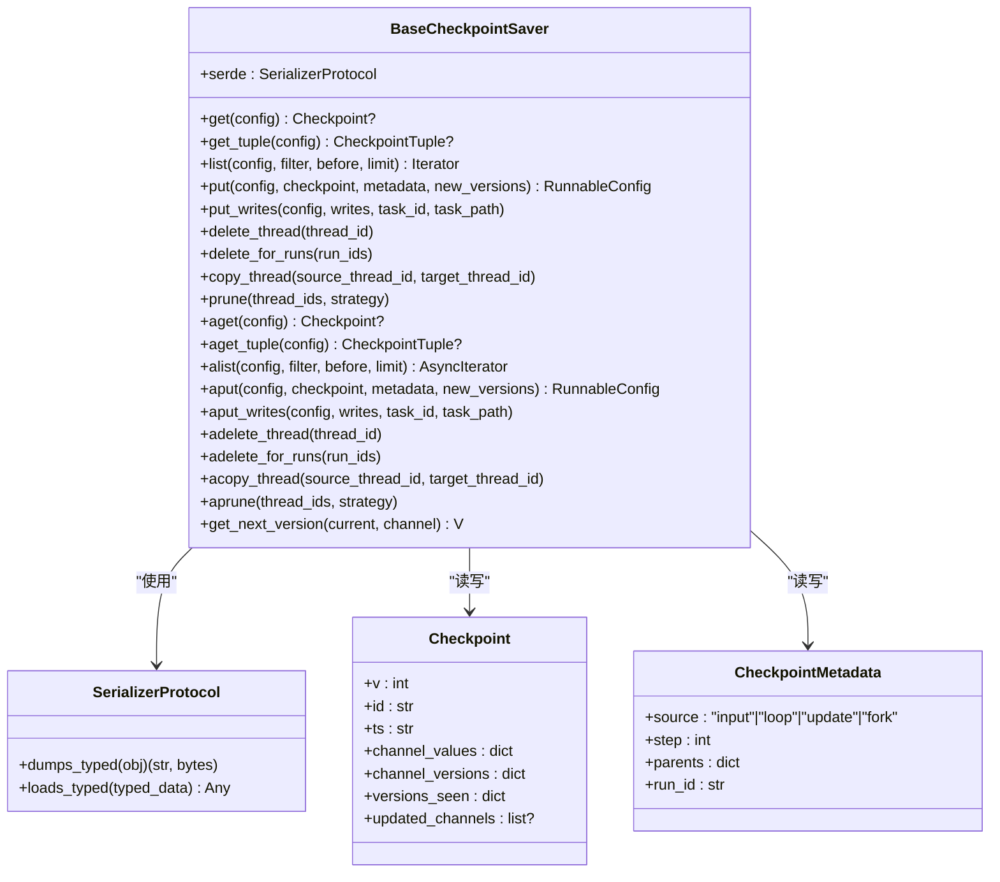
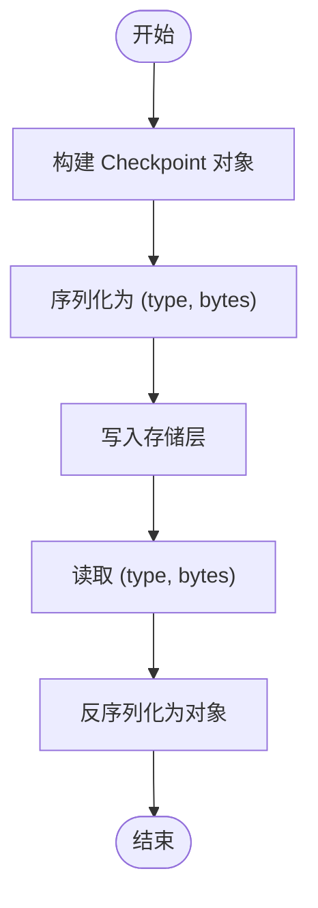
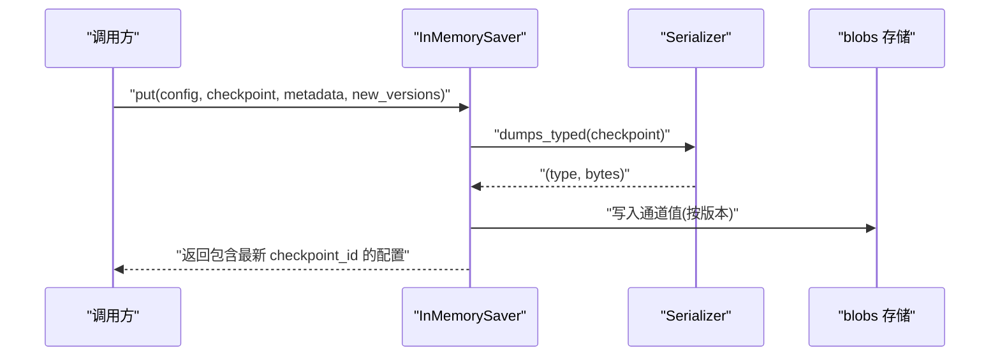
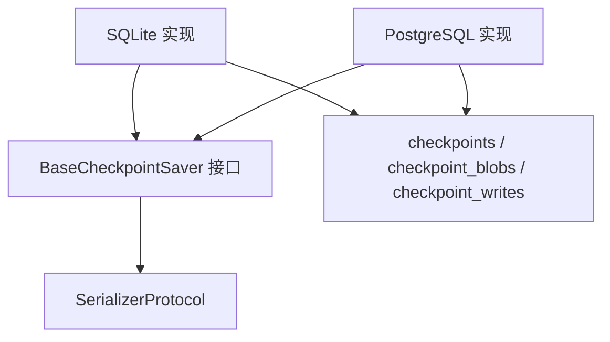
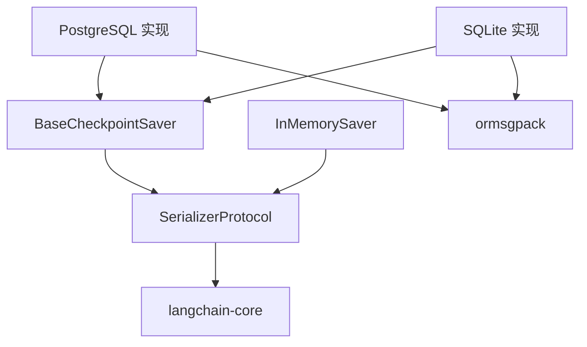

# 自定义检查点实现

<cite>
**本文引用的文件**
- [libs/checkpoint/langgraph/checkpoint/base/__init__.py](file://libs/checkpoint/langgraph/checkpoint/base/__init__.py)
- [libs/checkpoint/langgraph/checkpoint/memory/__init__.py](file://libs/checkpoint/langgraph/checkpoint/memory/__init__.py)
- [libs/checkpoint/langgraph/checkpoint/serde/base.py](file://libs/checkpoint/langgraph/checkpoint/serde/base.py)
- [libs/checkpoint/README.md](file://libs/checkpoint/README.md)
- [libs/checkpoint/pyproject.toml](file://libs/checkpoint/pyproject.toml)
- [libs/checkpoint-postgres/langgraph/checkpoint/postgres/shallow.py](file://libs/checkpoint-postgres/langgraph/checkpoint/postgres/shallow.py)
- [libs/checkpoint-sqlite/langgraph/checkpoint/sqlite/__init__.py](file://libs/checkpoint-sqlite/langgraph/checkpoint/sqlite/__init__.py)
- [libs/langgraph/langgraph/pregel/_checkpoint.py](file://libs/langgraph/langgraph/pregel/_checkpoint.py)
</cite>

## 目录
1. [简介](#简介)
2. [项目结构](#项目结构)
3. [核心组件](#核心组件)
4. [架构总览](#架构总览)
5. [详细组件分析](#详细组件分析)
6. [依赖分析](#依赖分析)
7. [性能考虑](#性能考虑)
8. [故障排查指南](#故障排查指南)
9. [结论](#结论)
10. [附录](#附录)

## 简介
本指南面向希望基于 BaseCheckpointSaver 抽象基类实现自定义检查点持久化的工程师与架构师。内容涵盖：
- 检查点接口设计原则与实现要求
- 检查点数据结构与序列化机制
- 核心方法 save_checkpoint（put）、load_checkpoint（get/get_tuple）、list_checkpoints（list）的实现要点
- SQLite 与 PostgreSQL 实现示例及不同存储后端的适配方法
- 版本管理、迁移策略与向后兼容性处理
- 并发访问控制、事务管理与错误恢复机制
- 性能优化、索引设计与查询优化建议
- 检查点测试与验证流程

## 项目结构
本仓库中与检查点相关的关键模块位于 libs/checkpoint 及其子模块，以及 libs/checkpoint-sqlite、libs/checkpoint-postgres 等实现库。核心抽象与接口定义在 checkpoint 基础库中，具体数据库实现分别在 sqlite 与 postgres 子库中。

图表来源
- [libs/checkpoint/langgraph/checkpoint/base/__init__.py:122-458](file://libs/checkpoint/langgraph/checkpoint/base/__init__.py#L122-L458)
- [libs/checkpoint/langgraph/checkpoint/serde/base.py:14-65](file://libs/checkpoint/langgraph/checkpoint/serde/base.py#L14-L65)
- [libs/checkpoint/langgraph/checkpoint/memory/__init__.py:31-122](file://libs/checkpoint/langgraph/checkpoint/memory/__init__.py#L31-L122)
- [libs/checkpoint-sqlite/langgraph/checkpoint/sqlite/__init__.py](file://libs/checkpoint-sqlite/langgraph/checkpoint/sqlite/__init__.py)
- [libs/checkpoint-postgres/langgraph/checkpoint/postgres/shallow.py:39-82](file://libs/checkpoint-postgres/langgraph/checkpoint/postgres/shallow.py#L39-L82)

章节来源
- [libs/checkpoint/README.md:1-89](file://libs/checkpoint/README.md#L1-L89)
- [libs/checkpoint/pyproject.toml:1-82](file://libs/checkpoint/pyproject.toml#L1-L82)

## 核心组件
- BaseCheckpointSaver：定义检查点存取的统一接口，包括同步与异步方法族，以及版本号生成策略。
- Checkpoint 与 CheckpointMetadata：检查点数据模型与元数据模型，用于描述通道值、版本、父检查点等。
- SerializerProtocol：序列化协议，支持 typed 序列化以携带类型信息，便于跨语言或跨版本兼容。
- InMemorySaver：内存实现示例，展示如何组织存储结构与处理 pending writes。
- SQLite/PostgreSQL 实现：基于关系型数据库的生产级实现，包含迁移脚本与索引设计。

章节来源
- [libs/checkpoint/langgraph/checkpoint/base/__init__.py:65-121](file://libs/checkpoint/langgraph/checkpoint/base/__init__.py#L65-L121)
- [libs/checkpoint/langgraph/checkpoint/base/__init__.py:122-458](file://libs/checkpoint/langgraph/checkpoint/base/__init__.py#L122-L458)
- [libs/checkpoint/langgraph/checkpoint/serde/base.py:14-65](file://libs/checkpoint/langgraph/checkpoint/serde/base.py#L14-L65)
- [libs/checkpoint/langgraph/checkpoint/memory/__init__.py:31-122](file://libs/checkpoint/langgraph/checkpoint/memory/__init__.py#L31-L122)

## 架构总览
下图展示了从调用方到检查点接口再到具体存储实现的整体交互：

图表来源
- [libs/checkpoint/langgraph/checkpoint/base/__init__.py:223-244](file://libs/checkpoint/langgraph/checkpoint/base/__init__.py#L223-L244)
- [libs/checkpoint/langgraph/checkpoint/base/__init__.py:173-197](file://libs/checkpoint/langgraph/checkpoint/base/__init__.py#L173-L197)
- [libs/checkpoint/langgraph/checkpoint/memory/__init__.py:326-371](file://libs/checkpoint/langgraph/checkpoint/memory/__init__.py#L326-L371)
- [libs/checkpoint-postgres/langgraph/checkpoint/postgres/shallow.py:468-484](file://libs/checkpoint-postgres/langgraph/checkpoint/postgres/shallow.py#L468-L484)

## 详细组件分析

### BaseCheckpointSaver 接口与实现要求
- 必须实现的方法族：
  - 同步：get_tuple、list、put、put_writes、delete_thread、delete_for_runs、copy_thread、prune
  - 异步：aget_tuple、alist、aput、aput_writes、adelete_thread、adelete_for_runs、acopy_thread、aprune
- 版本号生成：get_next_version 支持整数、浮点或字符串单调递增版本；默认整数从 1 开始。
- 序列化：serde 属性需满足 SerializerProtocol，支持 dumps_typed/loads_typed 以携带类型信息。
- 元数据：CheckpointMetadata 包含 source、step、parents、run_id 等字段，用于追踪检查点来源与父子关系。
- 数据模型：Checkpoint 包含 v、id、ts、channel_values、channel_versions、versions_seen、updated_channels 等字段。

图表来源
- [libs/checkpoint/langgraph/checkpoint/base/__init__.py:122-458](file://libs/checkpoint/langgraph/checkpoint/base/__init__.py#L122-L458)
- [libs/checkpoint/langgraph/checkpoint/serde/base.py:14-65](file://libs/checkpoint/langgraph/checkpoint/serde/base.py#L14-L65)
- [libs/checkpoint/langgraph/checkpoint/base/__init__.py:65-97](file://libs/checkpoint/langgraph/checkpoint/base/__init__.py#L65-L97)
- [libs/checkpoint/langgraph/checkpoint/base/__init__.py:35-60](file://libs/checkpoint/langgraph/checkpoint/base/__init__.py#L35-L60)

章节来源
- [libs/checkpoint/langgraph/checkpoint/base/__init__.py:122-458](file://libs/checkpoint/langgraph/checkpoint/base/__init__.py#L122-L458)
- [libs/checkpoint/langgraph/checkpoint/base/__init__.py:65-121](file://libs/checkpoint/langgraph/checkpoint/base/__init__.py#L65-L121)

### 检查点数据结构与序列化机制
- Checkpoint 字段语义：
  - v：格式版本
  - id：唯一且单调递增的检查点 ID
  - ts：ISO 时间戳
  - channel_values：通道快照值映射
  - channel_versions：通道版本映射（单调递增）
  - versions_seen：节点到通道版本的“已见”映射
  - updated_channels：本次更新的通道列表
- CheckpointMetadata：
  - source：输入/循环/更新/分叉来源
  - step：步骤编号
  - parents：父检查点命名空间到 ID 的映射
  - run_id：触发该检查点的运行 ID
- 序列化：
  - SerializerProtocol 要求 dumps_typed/loads_typed，便于携带类型信息
  - 默认 JsonPlusSerializer，可选 EncryptedSerializer 进行加密包装
  - InMemorySaver 将通道值按版本拆分为“blobs”，通过 serde.loads_typed 解码

图表来源
- [libs/checkpoint/langgraph/checkpoint/serde/base.py:14-65](file://libs/checkpoint/langgraph/checkpoint/serde/base.py#L14-L65)
- [libs/checkpoint/langgraph/checkpoint/memory/__init__.py:123-134](file://libs/checkpoint/langgraph/checkpoint/memory/__init__.py#L123-L134)
- [libs/checkpoint/langgraph/checkpoint/base/__init__.py:65-97](file://libs/checkpoint/langgraph/checkpoint/base/__init__.py#L65-L97)

章节来源
- [libs/checkpoint/langgraph/checkpoint/base/__init__.py:65-97](file://libs/checkpoint/langgraph/checkpoint/base/__init__.py#L65-L97)
- [libs/checkpoint/langgraph/checkpoint/base/__init__.py:35-60](file://libs/checkpoint/langgraph/checkpoint/base/__init__.py#L35-L60)
- [libs/checkpoint/langgraph/checkpoint/serde/base.py:14-65](file://libs/checkpoint/langgraph/checkpoint/serde/base.py#L14-L65)

### 核心方法实现细节
- save_checkpoint（put）
  - InMemorySaver：将 Checkpoint 与元数据序列化后写入 storage；将通道值按版本写入 blobs；返回包含最新 checkpoint_id 的配置
  - PostgreSQL：使用 upsert 或 insert 写入 checkpoints 表；对 blob 与 writes 使用批量写入
  - SQLite：采用类似策略，结合事务与批量插入
- load_checkpoint（get/get_tuple）
  - InMemorySaver：根据 thread_id/checkpoint_ns/checkpoint_id 定位；合并 pending_writes；从 blobs 按版本还原通道值
  - PostgreSQL/SQLite：按主键或索引查询，合并元数据与 pending_writes
- list_checkpoints（list）
  - 支持 filter、before、limit 参数；按 checkpoint_id 降序返回 CheckpointTuple

图表来源
- [libs/checkpoint/langgraph/checkpoint/memory/__init__.py:326-371](file://libs/checkpoint/langgraph/checkpoint/memory/__init__.py#L326-L371)
- [libs/checkpoint/langgraph/checkpoint/serde/base.py:24-26](file://libs/checkpoint/langgraph/checkpoint/serde/base.py#L24-L26)

章节来源
- [libs/checkpoint/langgraph/checkpoint/memory/__init__.py:326-371](file://libs/checkpoint/langgraph/checkpoint/memory/__init__.py#L326-L371)
- [libs/checkpoint-postgres/langgraph/checkpoint/postgres/shallow.py:468-484](file://libs/checkpoint-postgres/langgraph/checkpoint/postgres/shallow.py#L468-L484)

### SQLite 与 PostgreSQL 实现示例与适配
- SQLite 实现要点
  - 使用 checkpoints、checkpoint_blobs、checkpoint_writes 三张表
  - 通过事务批量写入，减少锁竞争
  - 在高并发场景下建议使用 WAL 模式与合适的连接池
- PostgreSQL 实现要点
  - 使用 JSONB/bytea 存储结构化数据与二进制 blob
  - 提供迁移列表 MIGRATIONS，包含建表、索引与列变更
  - 使用并发索引与 upsert 写入策略提升吞吐
- 适配方法
  - 统一实现 BaseCheckpointSaver 的同步/异步方法
  - 遵循 serde 协议进行 typed 序列化
  - 为 list 方法提供高效的过滤与排序逻辑（如按 thread_id、checkpoint_ns、时间戳）

图表来源
- [libs/checkpoint-sqlite/langgraph/checkpoint/sqlite/__init__.py](file://libs/checkpoint-sqlite/langgraph/checkpoint/sqlite/__init__.py)
- [libs/checkpoint-postgres/langgraph/checkpoint/postgres/shallow.py:39-82](file://libs/checkpoint-postgres/langgraph/checkpoint/postgres/shallow.py#L39-L82)
- [libs/checkpoint/langgraph/checkpoint/base/__init__.py:122-458](file://libs/checkpoint/langgraph/checkpoint/base/__init__.py#L122-L458)

章节来源
- [libs/checkpoint-postgres/langgraph/checkpoint/postgres/shallow.py:39-82](file://libs/checkpoint-postgres/langgraph/checkpoint/postgres/shallow.py#L39-L82)
- [libs/checkpoint-sqlite/langgraph/checkpoint/sqlite/__init__.py](file://libs/checkpoint-sqlite/langgraph/checkpoint/sqlite/__init__.py)

### 版本管理、迁移策略与向后兼容
- 版本号生成
  - 默认整数版本从 1 开始递增；可通过 get_next_version 自定义（如字符串版本）
  - InMemorySaver 示例中提供字符串版本生成策略
- 迁移策略
  - PostgreSQL 实现维护 MIGRATIONS 列表，按顺序执行建表、索引与列扩展
  - 迁移时注意幂等性与并发安全（如使用并发索引）
- 向后兼容
  - 通过 SerializerProtocol 的 typed 序列化保留类型信息
  - 元数据中排除敏感键（如 thread_id、checkpoint_id），避免冲突

章节来源
- [libs/checkpoint/langgraph/checkpoint/base/__init__.py:460-479](file://libs/checkpoint/langgraph/checkpoint/base/__init__.py#L460-L479)
- [libs/checkpoint/langgraph/checkpoint/memory/__init__.py:518-528](file://libs/checkpoint/langgraph/checkpoint/memory/__init__.py#L518-L528)
- [libs/checkpoint-postgres/langgraph/checkpoint/postgres/shallow.py:39-82](file://libs/checkpoint-postgres/langgraph/checkpoint/postgres/shallow.py#L39-L82)
- [libs/checkpoint/langgraph/checkpoint/base/__init__.py:565-575](file://libs/checkpoint/langgraph/checkpoint/base/__init__.py#L565-L575)

### 并发访问控制、事务管理与错误恢复
- 并发控制
  - 使用主键与复合索引保证唯一性与查询效率
  - PostgreSQL 提供并发索引与 upsert 写入，降低锁冲突
- 事务管理
  - SQLite/PostgreSQL 实现均采用事务包裹批量写入，确保一致性
- 错误恢复
  - 序列化失败时应捕获异常并回滚事务
  - 对于部分写入成功的情况，利用 pending_writes 机制实现重放与去重

章节来源
- [libs/checkpoint-postgres/langgraph/checkpoint/postgres/shallow.py:468-484](file://libs/checkpoint-postgres/langgraph/checkpoint/postgres/shallow.py#L468-L484)
- [libs/checkpoint/langgraph/checkpoint/memory/__init__.py:372-409](file://libs/checkpoint/langgraph/checkpoint/memory/__init__.py#L372-L409)

### 性能优化、索引设计与查询优化
- 索引设计
  - 按 thread_id 建立索引，加速按线程检索
  - 按 checkpoint_ns 与时间戳建立复合索引，支持高效分页与过滤
- 查询优化
  - list 方法优先使用索引扫描与 limit 控制结果集大小
  - put_writes 使用 upsert 或条件插入，避免重复写入
- 存储优化
  - 将大体积通道值拆分为 blobs，按版本读取，减少主表膨胀

章节来源
- [libs/checkpoint-postgres/langgraph/checkpoint/postgres/shallow.py:70-82](file://libs/checkpoint-postgres/langgraph/checkpoint/postgres/shallow.py#L70-L82)
- [libs/checkpoint/langgraph/checkpoint/memory/__init__.py:123-134](file://libs/checkpoint/langgraph/checkpoint/memory/__init__.py#L123-L134)

### 检查点测试与验证流程
- 单元测试
  - 使用 pytest 与 pytest-asyncio 验证同步/异步接口行为
  - 针对 list、get、put、put_writes、delete_thread 等方法编写覆盖用例
- 集成测试
  - 在真实数据库（PostgreSQL/SQLite）上执行迁移与写入，验证版本兼容性
- 回归测试
  - 验证迁移前后数据读写一致性与性能指标

章节来源
- [libs/checkpoint/pyproject.toml:26-46](file://libs/checkpoint/pyproject.toml#L26-L46)

## 依赖分析
- 外部依赖
  - langchain-core：运行时配置与通道协议
  - ormsgpack：高性能消息包序列化
- 内部依赖
  - BaseCheckpointSaver 依赖 SerializerProtocol
  - InMemorySaver 依赖 serde.loads_typed/loads
  - PostgreSQL/SQLite 实现依赖各自数据库驱动与连接管理

图表来源
- [libs/checkpoint/langgraph/checkpoint/base/__init__.py:155-162](file://libs/checkpoint/langgraph/checkpoint/base/__init__.py#L155-L162)
- [libs/checkpoint/langgraph/checkpoint/serde/base.py:14-65](file://libs/checkpoint/langgraph/checkpoint/serde/base.py#L14-L65)
- [libs/checkpoint/pyproject.toml:14-17](file://libs/checkpoint/pyproject.toml#L14-L17)

章节来源
- [libs/checkpoint/pyproject.toml:14-17](file://libs/checkpoint/pyproject.toml#L14-L17)

## 性能考虑
- 序列化开销
  - 优先使用 typed 序列化，减少反射成本
  - 对频繁写入的通道值启用压缩或分片存储
- I/O 优化
  - 使用批量写入与事务合并请求
  - 为高频查询字段建立合适索引
- 并发与锁
  - 在高并发场景下选择 WAL 模式与连接池
  - 使用 upsert 与幂等写入策略降低锁竞争

## 故障排查指南
- 常见问题
  - 序列化失败：检查 serde 类型与版本兼容性
  - 并发写入冲突：确认索引与事务边界
  - 迁移失败：核对 MIGRATIONS 顺序与数据库权限
- 排查步骤
  - 启用日志记录 put/get/list 的参数与返回值
  - 对比不同版本的 Checkpoint 结构差异
  - 使用最小复现用例定位问题范围

章节来源
- [libs/checkpoint/langgraph/checkpoint/memory/__init__.py:372-409](file://libs/checkpoint/langgraph/checkpoint/memory/__init__.py#L372-L409)
- [libs/checkpoint-postgres/langgraph/checkpoint/postgres/shallow.py:39-82](file://libs/checkpoint-postgres/langgraph/checkpoint/postgres/shallow.py#L39-L82)

## 结论
通过遵循 BaseCheckpointSaver 接口规范与数据模型约定，结合 typed 序列化与事务化写入策略，可以在 SQLite 与 PostgreSQL 等多种存储后端上实现高性能、可迁移、可扩展的检查点持久化方案。建议在生产环境中配合完善的测试体系与监控告警，持续优化索引与查询路径，并关注版本演进与向后兼容性。

## 附录
- 关键实现参考路径
  - [BaseCheckpointSaver 接口定义:122-458](file://libs/checkpoint/langgraph/checkpoint/base/__init__.py#L122-L458)
  - [Checkpoint 数据模型:65-97](file://libs/checkpoint/langgraph/checkpoint/base/__init__.py#L65-L97)
  - [SerializerProtocol 协议:14-65](file://libs/checkpoint/langgraph/checkpoint/serde/base.py#L14-L65)
  - [InMemorySaver 实现:31-122](file://libs/checkpoint/langgraph/checkpoint/memory/__init__.py#L31-L122)
  - [PostgreSQL 迁移与索引:39-82](file://libs/checkpoint-postgres/langgraph/checkpoint/postgres/shallow.py#L39-L82)
  - [SQLite 检查点实现入口](file://libs/checkpoint-sqlite/langgraph/checkpoint/sqlite/__init__.py)
  - [LangGraph 检查点工具函数:16-89](file://libs/langgraph/langgraph/pregel/_checkpoint.py#L16-L89)