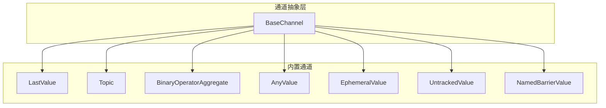
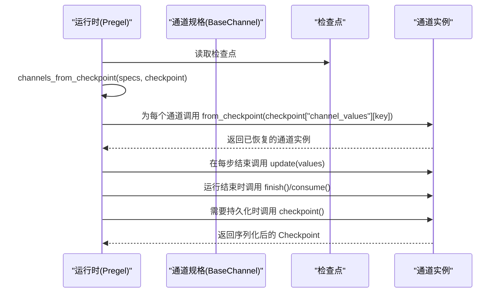
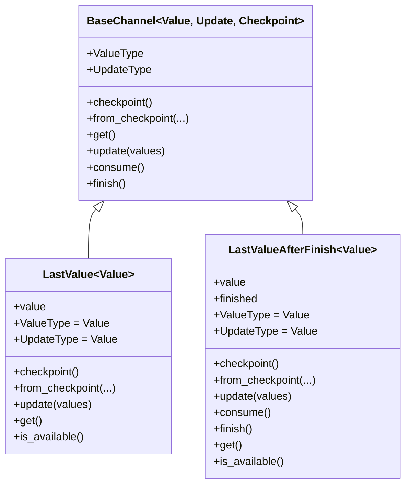
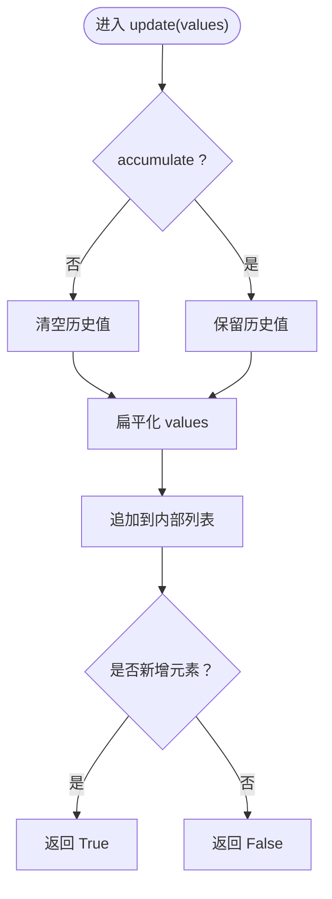
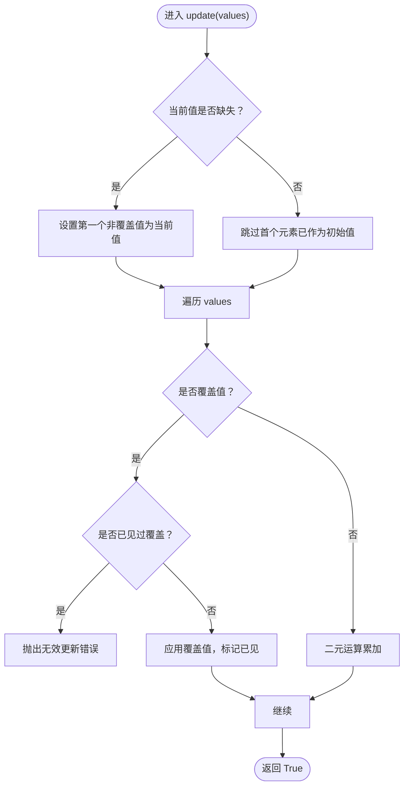
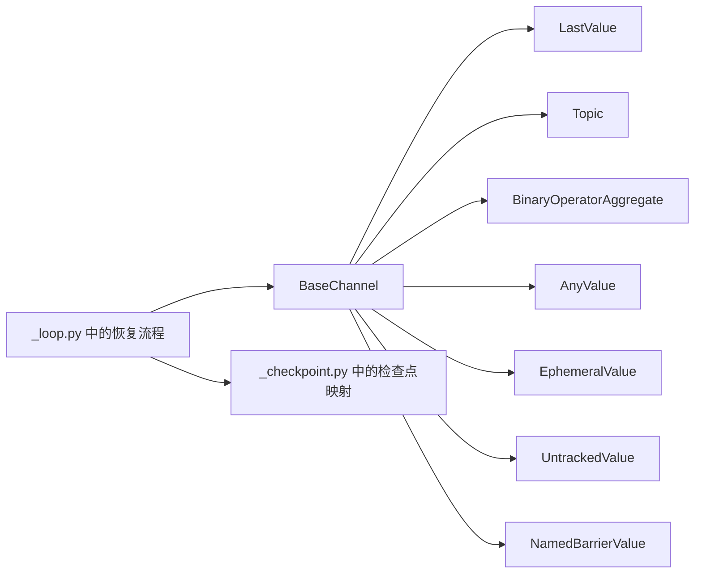

# 自定义通道开发

<cite>
**本文引用的文件**
- [libs/langgraph/langgraph/channels/base.py](file://libs/langgraph/langgraph/channels/base.py)
- [libs/langgraph/langgraph/channels/last_value.py](file://libs/langgraph/langgraph/channels/last_value.py)
- [libs/langgraph/langgraph/channels/topic.py](file://libs/langgraph/langgraph/channels/topic.py)
- [libs/langgraph/langgraph/channels/binop.py](file://libs/langgraph/langgraph/channels/binop.py)
- [libs/langgraph/langgraph/channels/any_value.py](file://libs/langgraph/langgraph/channels/any_value.py)
- [libs/langgraph/langgraph/channels/ephemeral_value.py](file://libs/langgraph/langgraph/channels/ephemeral_value.py)
- [libs/langgraph/langgraph/channels/untracked_value.py](file://libs/langgraph/langgraph/channels/untracked_value.py)
- [libs/langgraph/langgraph/channels/named_barrier_value.py](file://libs/langgraph/langgraph/channels/named_barrier_value.py)
- [libs/langgraph/langgraph/channels/__init__.py](file://libs/langgraph/langgraph/channels/__init__.py)
- [libs/langgraph/tests/test_channels.py](file://libs/langgraph/tests/test_channels.py)
- [libs/langgraph/langgraph/errors.py](file://libs/langgraph/langgraph/errors.py)
- [libs/langgraph/langgraph/types.py](file://libs/langgraph/langgraph/types.py)
- [libs/langgraph/langgraph/pregel/_checkpoint.py](file://libs/langgraph/langgraph/pregel/_checkpoint.py)
- [libs/langgraph/langgraph/pregel/_loop.py](file://libs/langgraph/langgraph/pregel/_loop.py)
</cite>

## 目录
1. [简介](#简介)
2. [项目结构](#项目结构)
3. [核心组件](#核心组件)
4. [架构总览](#架构总览)
5. [详细组件分析](#详细组件分析)
6. [依赖分析](#依赖分析)
7. [性能考量](#性能考量)
8. [故障排查指南](#故障排查指南)
9. [结论](#结论)
10. [附录](#附录)

## 简介
本指南面向希望基于 BaseChannel 抽象基类开发“自定义通道”的工程师，系统讲解通道接口设计与实现方法，明确 ValueType 与 UpdateType 的类型约束与泛型参数含义；详解 checkpoint 与 from_checkpoint 的序列化机制；并给出 get、update、consume、finish 等核心方法的实现要求。文档还提供 LastValue、Topic、BinaryOperatorAggregate 等内置通道的实现模式作为参考，并覆盖通道组合、复杂状态管理、错误处理、性能优化与并发安全等主题，最后总结测试与调试最佳实践。

## 项目结构
LangGraph 的通道体系位于 langgraph/channels 子模块，围绕 BaseChannel 抽象基类构建多种内置通道类型，同时通过统一的检查点协议与运行时（Pregel）集成，实现可序列化、可恢复的状态管理。

图表来源
- [libs/langgraph/langgraph/channels/base.py:19-122](file://libs/langgraph/langgraph/channels/base.py#L19-L122)
- [libs/langgraph/langgraph/channels/last_value.py:20-151](file://libs/langgraph/langgraph/channels/last_value.py#L20-L151)
- [libs/langgraph/langgraph/channels/topic.py:23-95](file://libs/langgraph/langgraph/channels/topic.py#L23-L95)
- [libs/langgraph/langgraph/channels/binop.py:41-135](file://libs/langgraph/langgraph/channels/binop.py#L41-L135)
- [libs/langgraph/langgraph/channels/any_value.py:15-73](file://libs/langgraph/langgraph/channels/any_value.py#L15-L73)
- [libs/langgraph/langgraph/channels/ephemeral_value.py:15-80](file://libs/langgraph/langgraph/channels/ephemeral_value.py#L15-L80)
- [libs/langgraph/langgraph/channels/untracked_value.py:15-74](file://libs/langgraph/langgraph/channels/untracked_value.py#L15-L74)
- [libs/langgraph/langgraph/channels/named_barrier_value.py:13-168](file://libs/langgraph/langgraph/channels/named_barrier_value.py#L13-L168)

章节来源
- [libs/langgraph/langgraph/channels/__init__.py:1-28](file://libs/langgraph/langgraph/channels/__init__.py#L1-L28)

## 核心组件
- BaseChannel 抽象基类：定义通道的泛型参数 Value（存储值类型）、Update（更新值类型）、Checkpoint（检查点序列化类型），并提供 ValueType、UpdateType 属性、checkpoint/from_checkpoint 序列化接口、get/is_available 读取接口，以及 update/consume/finish 写入与生命周期通知接口。
- 典型实现模式：
  - 值通道：LastValue、AnyValue、EphemeralValue、UntrackedValue、BinaryOperatorAggregate
  - 发布订阅通道：Topic
  - 同步屏障通道：NamedBarrierValue

章节来源
- [libs/langgraph/langgraph/channels/base.py:19-122](file://libs/langgraph/langgraph/channels/base.py#L19-L122)
- [libs/langgraph/langgraph/channels/last_value.py:20-151](file://libs/langgraph/langgraph/channels/last_value.py#L20-L151)
- [libs/langgraph/langgraph/channels/topic.py:23-95](file://libs/langgraph/langgraph/channels/topic.py#L23-L95)
- [libs/langgraph/langgraph/channels/binop.py:41-135](file://libs/langgraph/langgraph/channels/binop.py#L41-L135)
- [libs/langgraph/langgraph/channels/any_value.py:15-73](file://libs/langgraph/langgraph/channels/any_value.py#L15-L73)
- [libs/langgraph/langgraph/channels/ephemeral_value.py:15-80](file://libs/langgraph/langgraph/channels/ephemeral_value.py#L15-L80)
- [libs/langgraph/langgraph/channels/untracked_value.py:15-74](file://libs/langgraph/langgraph/channels/untracked_value.py#L15-L74)
- [libs/langgraph/langgraph/channels/named_barrier_value.py:13-168](file://libs/langgraph/langgraph/channels/named_barrier_value.py#L13-L168)

## 架构总览
通道与运行时（Pregel）通过检查点协议进行集成：运行时在启动或恢复时调用 channels_from_checkpoint，将检查点中的通道值映射到具体通道实例；通道通过 checkpoint/from_checkpoint 实现序列化与反序列化。

图表来源
- [libs/langgraph/langgraph/pregel/_checkpoint.py:58-76](file://libs/langgraph/langgraph/pregel/_checkpoint.py#L58-L76)
- [libs/langgraph/langgraph/pregel/_loop.py:1189-1191](file://libs/langgraph/langgraph/pregel/_loop.py#L1189-L1191)
- [libs/langgraph/langgraph/pregel/_loop.py:1390-1392](file://libs/langgraph/langgraph/pregel/_loop.py#L1390-L1392)

## 详细组件分析

### BaseChannel 抽象基类与泛型约束
- 泛型参数
  - Value：通道中实际存储的值类型，用于 get() 返回与 ValueType 暴露
  - Update：节点写入通道的更新值类型，用于 update() 接收
  - Checkpoint：检查点序列化类型，用于 checkpoint()/from_checkpoint()
- 关键属性与方法
  - ValueType/UpdateType：声明存储值类型与更新类型
  - checkpoint()/from_checkpoint()：默认委托 get()/构造函数，支持空通道返回特殊标记
  - get()/is_available()：读取当前值与可用性判断
  - update()：接收更新序列，顺序任意；返回是否更新
  - consume()/finish()：生命周期通知，可重写以实现消费/完成后的副作用
- 默认行为
  - copy() 默认通过 checkpoint()+from_checkpoint() 实现深拷贝
  - is_available() 默认通过捕获 EmptyChannelError 判断

章节来源
- [libs/langgraph/langgraph/channels/base.py:19-122](file://libs/langgraph/langgraph/channels/base.py#L19-L122)

### LastValue 与 LastValueAfterFinish
- 设计要点
  - LastValue：每步仅允许一个更新，否则抛出无效更新错误；支持从检查点恢复
  - LastValueAfterFinish：值在 finish() 后才可用，consume() 后清空，适合“完成后一次性输出”
- 类型约束
  - ValueType/UpdateType 均为 Value
  - Checkpoint 类型在 AfterFinish 模式下为二元组（值, 是否完成）

图表来源
- [libs/langgraph/langgraph/channels/base.py:19-122](file://libs/langgraph/langgraph/channels/base.py#L19-L122)
- [libs/langgraph/langgraph/channels/last_value.py:20-151](file://libs/langgraph/langgraph/channels/last_value.py#L20-L151)

章节来源
- [libs/langgraph/langgraph/channels/last_value.py:20-151](file://libs/langgraph/langgraph/channels/last_value.py#L20-L151)

### Topic（发布订阅）
- 设计要点
  - 支持 accumulate 标志：是否跨步骤累积消息
  - update() 对传入的值进行扁平化处理（列表展开）
  - get() 返回当前队列副本；为空则抛出 EmptyChannelError
- 类型约束
  - ValueType 为 Sequence[Value]
  - UpdateType 为 Value 或 list[Value]
  - Checkpoint 为 list[Value]

图表来源
- [libs/langgraph/langgraph/channels/topic.py:77-85](file://libs/langgraph/langgraph/channels/topic.py#L77-L85)

章节来源
- [libs/langgraph/langgraph/channels/topic.py:23-95](file://libs/langgraph/langgraph/channels/topic.py#L23-L95)

### BinaryOperatorAggregate（二元运算聚合）
- 设计要点
  - 使用二元运算符对新值与当前值进行聚合
  - 支持“覆盖”语义（Overwrite），同一超步内最多一次覆盖
  - 初始化时尝试构造 typ 的空实例作为初始值
- 类型约束
  - ValueType/UpdateType 均为 Value
  - Checkpoint 为 Value

图表来源
- [libs/langgraph/langgraph/channels/binop.py:102-123](file://libs/langgraph/langgraph/channels/binop.py#L102-L123)

章节来源
- [libs/langgraph/langgraph/channels/binop.py:41-135](file://libs/langgraph/langgraph/channels/binop.py#L41-L135)

### 其他常用通道模式
- AnyValue：假设多值相等，支持清空语义（空更新清空）
- EphemeralValue：仅保留一步的值，通常用于临时状态
- UntrackedValue：不参与检查点序列化（checkpoint 返回特殊标记）
- NamedBarrierValue：等待一组命名值全部到达后才可用，支持 AfterFinish 变体

章节来源
- [libs/langgraph/langgraph/channels/any_value.py:15-73](file://libs/langgraph/langgraph/channels/any_value.py#L15-L73)
- [libs/langgraph/langgraph/channels/ephemeral_value.py:15-80](file://libs/langgraph/langgraph/channels/ephemeral_value.py#L15-L80)
- [libs/langgraph/langgraph/channels/untracked_value.py:15-74](file://libs/langgraph/langgraph/channels/untracked_value.py#L15-L74)
- [libs/langgraph/langgraph/channels/named_barrier_value.py:13-168](file://libs/langgraph/langgraph/channels/named_barrier_value.py#L13-L168)

## 依赖分析
- BaseChannel 是所有通道的共同父类，定义了统一的接口契约
- 内置通道均遵循相同的泛型与序列化约定，便于运行时统一调度
- 运行时通过 channels_from_checkpoint 将检查点映射到通道实例，实现恢复与持久化

图表来源
- [libs/langgraph/langgraph/channels/base.py:19-122](file://libs/langgraph/langgraph/channels/base.py#L19-L122)
- [libs/langgraph/langgraph/pregel/_checkpoint.py:58-76](file://libs/langgraph/langgraph/pregel/_checkpoint.py#L58-L76)
- [libs/langgraph/langgraph/pregel/_loop.py:1189-1191](file://libs/langgraph/langgraph/pregel/_loop.py#L1189-L1191)

章节来源
- [libs/langgraph/langgraph/channels/__init__.py:1-28](file://libs/langgraph/langgraph/channels/__init__.py#L1-L28)

## 性能考量
- 优先实现 is_available() 的高效版本，避免每次调用 get() 并捕获异常
- 对于 Topic 等可能累积大量数据的通道，合理使用 accumulate 标志，必要时在运行时控制步长
- BinaryOperatorAggregate 的 operator 应尽量为 O(1) 或低开销操作，避免在热路径上执行高复杂度逻辑
- 复制与序列化
  - copy() 默认委托 checkpoint()+from_checkpoint()，若状态较大可重写以减少拷贝成本
  - checkpoint() 返回轻量级序列化对象；对复杂结构建议浅拷贝或惰性序列化

## 故障排查指南
- EmptyChannelError：当通道未初始化或被清空时 get() 抛出；请确保先 update() 或从有效检查点恢复
- InvalidUpdateError：常见于违反单步更新约束（如 LastValue 接收多个值）、覆盖值过多（同一超步内多次覆盖）或 NamedBarrierValue 写入了不在名单中的值
- 调试建议
  - 使用测试用例验证边界行为（空值、覆盖、完成态等）
  - 在运行时开启调试流模式，观察事件与中间状态
  - 对复杂通道组合，分步断言中间结果

章节来源
- [libs/langgraph/langgraph/errors.py:68-77](file://libs/langgraph/langgraph/errors.py#L68-L77)
- [libs/langgraph/tests/test_channels.py:16-120](file://libs/langgraph/tests/test_channels.py#L16-L120)

## 结论
通过 BaseChannel 统一抽象，LangGraph 提供了可扩展、可序列化的通道体系。开发者只需遵循 ValueType/UpdateType 的类型约束与序列化协议，即可实现自定义通道并融入运行时。内置通道提供了丰富的实现范式，可作为设计与测试的参考模板。

## 附录

### 自定义通道实现清单
- 明确三类泛型
  - Value：通道存储值类型
  - Update：节点写入的更新类型
  - Checkpoint：检查点序列化类型
- 实现必需成员
  - ValueType/UpdateType 属性
  - get()/is_available() 读取接口
  - update(values) 更新接口（注意空序列与覆盖语义）
  - checkpoint()/from_checkpoint() 序列化接口
- 可选增强
  - consume()/finish() 生命周期钩子
  - copy() 高效复制实现
  - 针对复杂状态的增量序列化策略

### 通道组合与复杂状态管理
- 组合模式
  - 将多个通道按功能拆分（如 Topic 聚合输入、LastValue 缓存最新值、BinaryOperatorAggregate 聚合统计）
  - 使用 NamedBarrierValue 实现多源汇聚的同步
- 状态一致性
  - 在 finish() 中统一产出最终值，避免中间态暴露
  - 对易变结构采用不可变快照或深拷贝策略

### 错误处理与并发安全
- 错误处理
  - 严格区分 EmptyChannelError 与 InvalidUpdateError
  - 对非法输入快速失败并提供清晰的错误码与指引
- 并发安全
  - 通道实现应保持线程安全；运行时在单任务粒度调度，避免跨任务共享可变状态
  - 对共享资源（如外部存储）使用检查点与幂等写入

### 测试与调试最佳实践
- 单元测试
  - 覆盖空通道、单步多值、覆盖冲突、完成态、检查点恢复等场景
- 集成测试
  - 在运行时中以最小图验证通道行为与序列化一致性
- 调试技巧
  - 使用运行时调试流模式输出事件与中间状态
  - 对复杂通道组合，逐步简化至最小可复现用例

章节来源
- [libs/langgraph/tests/test_channels.py:16-120](file://libs/langgraph/tests/test_channels.py#L16-L120)
- [libs/langgraph/langgraph/types.py:705-800](file://libs/langgraph/langgraph/types.py#L705-L800)