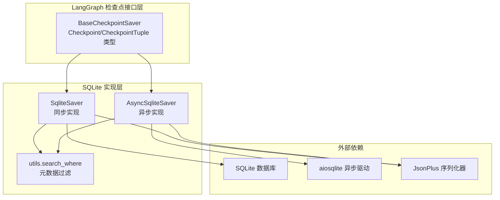
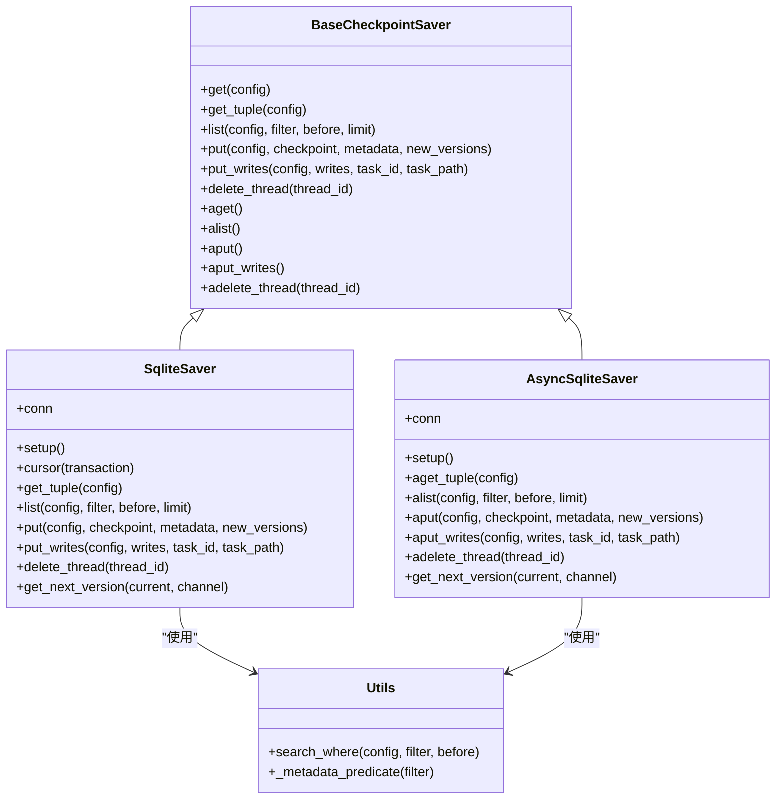
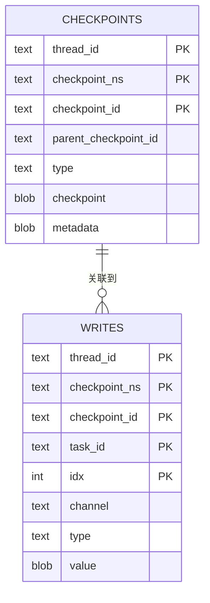
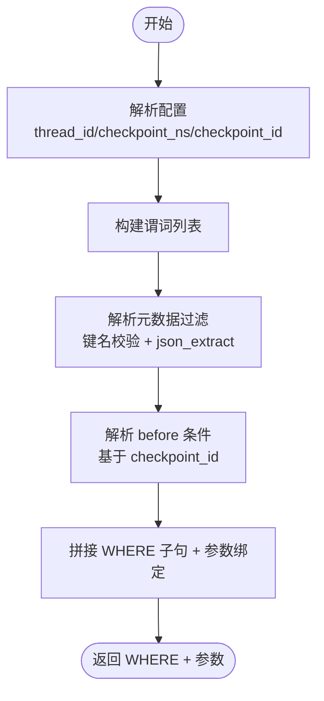
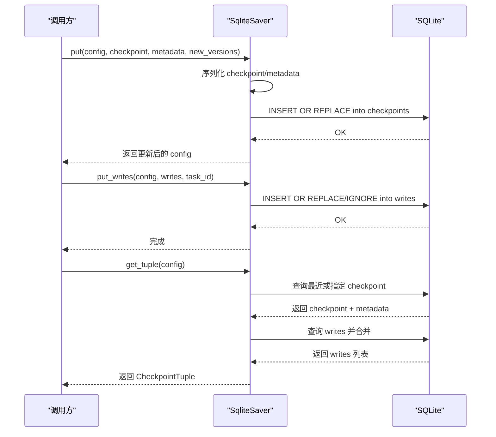
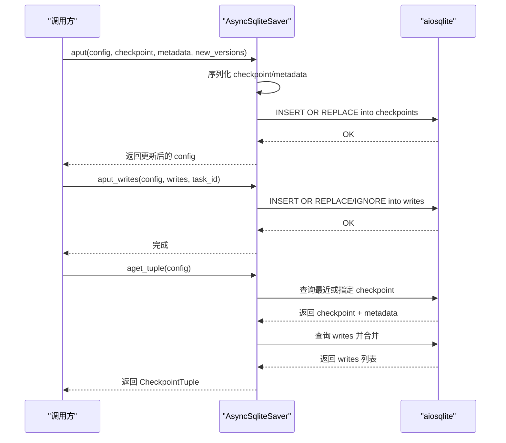
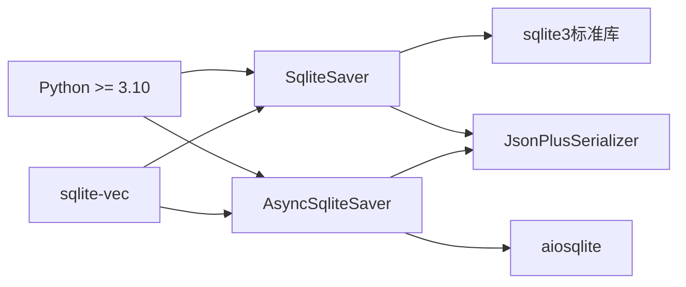

# SQLite 存储后端

<cite>
**本文引用的文件**
- [libs/checkpoint-sqlite/README.md](file://libs/checkpoint-sqlite/README.md)
- [libs/checkpoint-sqlite/pyproject.toml](file://libs/checkpoint-sqlite/pyproject.toml)
- [libs/checkpoint-sqlite/langgraph/checkpoint/sqlite/__init__.py](file://libs/checkpoint-sqlite/langgraph/checkpoint/sqlite/__init__.py)
- [libs/checkpoint-sqlite/langgraph/checkpoint/sqlite/aio.py](file://libs/checkpoint-sqlite/langgraph/checkpoint/sqlite/aio.py)
- [libs/checkpoint-sqlite/langgraph/checkpoint/sqlite/utils.py](file://libs/checkpoint-sqlite/langgraph/checkpoint/sqlite/utils.py)
- [libs/checkpoint/langgraph/checkpoint/base/__init__.py](file://libs/checkpoint/langgraph/checkpoint/base/__init__.py)
- [libs/checkpoint-sqlite/tests/test_sqlite.py](file://libs/checkpoint-sqlite/tests/test_sqlite.py)
- [libs/checkpoint-sqlite/tests/test_aiosqlite.py](file://libs/checkpoint-sqlite/tests/test_aiosqlite.py)
- [libs/checkpoint-sqlite/Makefile](file://libs/checkpoint-sqlite/Makefile)
</cite>

## 目录
1. [简介](#简介)
2. [项目结构](#项目结构)
3. [核心组件](#核心组件)
4. [架构总览](#架构总览)
5. [详细组件分析](#详细组件分析)
6. [依赖关系分析](#依赖关系分析)
7. [性能考量](#性能考量)
8. [故障排查指南](#故障排查指南)
9. [结论](#结论)
10. [附录](#附录)

## 简介
本文件系统化阐述 SQLite 存储后端在 LangGraph 中的实现与使用，覆盖技术架构、数据模型、安装配置、查询优化、性能与容量规划、维护最佳实践以及常见问题排查。该后端同时提供同步与异步两种实现，满足不同运行时需求，并通过 WAL 日志模式提升并发写入稳定性。

## 项目结构
- 同步实现：langgraph/checkpoint/sqlite/__init__.py（SqliteSaver）
- 异步实现：langgraph/checkpoint/sqlite/aio.py（AsyncSqliteSaver）
- 查询工具：langgraph/checkpoint/sqlite/utils.py（search_where、元数据过滤）
- 基类与类型定义：libs/checkpoint/langgraph/checkpoint/base/__init__.py
- 测试用例：tests/test_sqlite.py、tests/test_aiosqlite.py
- 文档与构建：README.md、pyproject.toml、Makefile

图表来源
- [libs/checkpoint-sqlite/langgraph/checkpoint/sqlite/__init__.py:38-557](file://libs/checkpoint-sqlite/langgraph/checkpoint/sqlite/__init__.py#L38-L557)
- [libs/checkpoint-sqlite/langgraph/checkpoint/sqlite/aio.py:31-632](file://libs/checkpoint-sqlite/langgraph/checkpoint/sqlite/aio.py#L31-L632)
- [libs/checkpoint-sqlite/langgraph/checkpoint/sqlite/utils.py:76-117](file://libs/checkpoint-sqlite/langgraph/checkpoint/sqlite/utils.py#L76-L117)
- [libs/checkpoint/langgraph/checkpoint/base/__init__.py:122-629](file://libs/checkpoint/langgraph/checkpoint/base/__init__.py#L122-L629)

章节来源
- [libs/checkpoint-sqlite/README.md:1-89](file://libs/checkpoint-sqlite/README.md#L1-L89)
- [libs/checkpoint-sqlite/pyproject.toml:1-85](file://libs/checkpoint-sqlite/pyproject.toml#L1-L85)

## 核心组件
- SqliteSaver（同步）：基于 sqlite3 的同步实现，提供 get_tuple/list/put/put_writes/delete_thread 等方法；内部使用锁保证线程安全；自动设置 WAL 模式与表结构。
- AsyncSqliteSaver（异步）：基于 aiosqlite 的异步实现，提供 aget_tuple/alist/aput/aput_writes/adelete_thread 等方法；同样自动设置 WAL 模式与表结构。
- 元数据过滤工具：search_where 将配置、过滤条件与“before”参数转换为参数化 WHERE 子句，支持 JSON 路径查询。
- 基类与类型：BaseCheckpointSaver 定义统一接口；Checkpoint/CheckpointTuple/CheckpointMetadata 等类型定义检查点的数据结构。

章节来源
- [libs/checkpoint-sqlite/langgraph/checkpoint/sqlite/__init__.py:38-557](file://libs/checkpoint-sqlite/langgraph/checkpoint/sqlite/__init__.py#L38-L557)
- [libs/checkpoint-sqlite/langgraph/checkpoint/sqlite/aio.py:31-632](file://libs/checkpoint-sqlite/langgraph/checkpoint/sqlite/aio.py#L31-L632)
- [libs/checkpoint-sqlite/langgraph/checkpoint/sqlite/utils.py:76-117](file://libs/checkpoint-sqlite/langgraph/checkpoint/sqlite/utils.py#L76-L117)
- [libs/checkpoint/langgraph/checkpoint/base/__init__.py:122-629](file://libs/checkpoint/langgraph/checkpoint/base/__init__.py#L122-L629)

## 架构总览
同步与异步实现均继承自 BaseCheckpointSaver，遵循统一的接口契约。两者均在首次访问时自动执行数据库初始化（PRAGMA、建表），采用 WAL 模式提升并发写入能力。检查点数据以二进制形式存储于 checkpoints 表，中间写入记录于 writes 表，二者通过 (thread_id, checkpoint_ns, checkpoint_id) 关联。

图表来源
- [libs/checkpoint/langgraph/checkpoint/base/__init__.py:122-480](file://libs/checkpoint/langgraph/checkpoint/base/__init__.py#L122-L480)
- [libs/checkpoint-sqlite/langgraph/checkpoint/sqlite/__init__.py:38-557](file://libs/checkpoint-sqlite/langgraph/checkpoint/sqlite/__init__.py#L38-L557)
- [libs/checkpoint-sqlite/langgraph/checkpoint/sqlite/aio.py:31-632](file://libs/checkpoint-sqlite/langgraph/checkpoint/sqlite/aio.py#L31-L632)
- [libs/checkpoint-sqlite/langgraph/checkpoint/sqlite/utils.py:76-117](file://libs/checkpoint-sqlite/langgraph/checkpoint/sqlite/utils.py#L76-L117)

## 详细组件分析

### 数据模型与表结构
- checkpoints 表
  - 主键：(thread_id, checkpoint_ns, checkpoint_id)
  - 字段：checkpoint_id、parent_checkpoint_id、type、checkpoint（二进制）、metadata（JSON 文本）
  - 用途：持久化检查点快照及其元数据
- writes 表
  - 主键：(thread_id, checkpoint_ns, checkpoint_id, task_id, idx)
  - 字段：task_id、idx、channel、type、value（二进制）
  - 用途：持久化中间写入，按任务与顺序索引
- 索引策略
  - 主键索引已覆盖常用查询路径
  - 可选：对 thread_id、checkpoint_ns、checkpoint_id 组合建立复合索引以优化 list/search 性能（当前实现通过主键与 WHERE 条件组合可满足大多数场景）

图表来源
- [libs/checkpoint-sqlite/langgraph/checkpoint/sqlite/__init__.py:132-157](file://libs/checkpoint-sqlite/langgraph/checkpoint/sqlite/__init__.py#L132-L157)
- [libs/checkpoint-sqlite/langgraph/checkpoint/sqlite/aio.py:286-312](file://libs/checkpoint-sqlite/langgraph/checkpoint/sqlite/aio.py#L286-L312)

章节来源
- [libs/checkpoint-sqlite/langgraph/checkpoint/sqlite/__init__.py:132-157](file://libs/checkpoint-sqlite/langgraph/checkpoint/sqlite/__init__.py#L132-L157)
- [libs/checkpoint-sqlite/langgraph/checkpoint/sqlite/aio.py:286-312](file://libs/checkpoint-sqlite/langgraph/checkpoint/sqlite/aio.py#L286-L312)

### 查询与过滤机制
- search_where 将以下输入转换为参数化 WHERE 子句：
  - config：thread_id、checkpoint_ns、checkpoint_id
  - filter：元数据键值过滤（支持嵌套键 via “.” 路径，如 user.name）
  - before：基于 checkpoint_id 的范围过滤
- 元数据过滤安全
  - 过滤键仅允许字母数字及“._-”，防止注入
  - 使用 json_extract 对 JSON 文本进行路径提取与比较

图表来源
- [libs/checkpoint-sqlite/langgraph/checkpoint/sqlite/utils.py:76-117](file://libs/checkpoint-sqlite/langgraph/checkpoint/sqlite/utils.py#L76-L117)

章节来源
- [libs/checkpoint-sqlite/langgraph/checkpoint/sqlite/utils.py:14-117](file://libs/checkpoint-sqlite/langgraph/checkpoint/sqlite/utils.py#L14-L117)

### 同步流程（SqliteSaver）
- 初始化：setup 自动执行 PRAGMA 与建表
- 事务封装：cursor 上下文确保提交与关闭
- 读取：get_tuple 支持按 checkpoint_id 或最新记录；合并 pending writes
- 列表：list 支持 filter/before/limit，逐条加载 writes
- 写入：put/put_writes 使用 INSERT OR REPLACE/INSERT OR IGNORE 控制幂等性
- 删除：delete_thread 清理指定 thread_id 的所有记录

图表来源
- [libs/checkpoint-sqlite/langgraph/checkpoint/sqlite/__init__.py:380-476](file://libs/checkpoint-sqlite/langgraph/checkpoint/sqlite/__init__.py#L380-L476)

章节来源
- [libs/checkpoint-sqlite/langgraph/checkpoint/sqlite/__init__.py:122-183](file://libs/checkpoint-sqlite/langgraph/checkpoint/sqlite/__init__.py#L122-L183)
- [libs/checkpoint-sqlite/langgraph/checkpoint/sqlite/__init__.py:184-378](file://libs/checkpoint-sqlite/langgraph/checkpoint/sqlite/__init__.py#L184-L378)
- [libs/checkpoint-sqlite/langgraph/checkpoint/sqlite/__init__.py:380-476](file://libs/checkpoint-sqlite/langgraph/checkpoint/sqlite/__init__.py#L380-L476)

### 异步流程（AsyncSqliteSaver）
- 初始化：setup 在首次访问时执行 PRAGMA 与建表
- 并发控制：使用 asyncio.Lock 保护关键路径
- 读取/列表/写入：与同步版本一致的语义，但全部为异步接口
- 错误提示：同步调用异步实现会抛出明确错误信息，引导用户使用异步接口

图表来源
- [libs/checkpoint-sqlite/langgraph/checkpoint/sqlite/aio.py:479-570](file://libs/checkpoint-sqlite/langgraph/checkpoint/sqlite/aio.py#L479-L570)

章节来源
- [libs/checkpoint-sqlite/langgraph/checkpoint/sqlite/aio.py:275-314](file://libs/checkpoint-sqlite/langgraph/checkpoint/sqlite/aio.py#L275-L314)
- [libs/checkpoint-sqlite/langgraph/checkpoint/sqlite/aio.py:316-398](file://libs/checkpoint-sqlite/langgraph/checkpoint/sqlite/aio.py#L316-L398)
- [libs/checkpoint-sqlite/langgraph/checkpoint/sqlite/aio.py:479-570](file://libs/checkpoint-sqlite/langgraph/checkpoint/sqlite/aio.py#L479-L570)

### 版本号生成
- get_next_version 为通道版本生成单调递增标识，避免并发冲突与回溯问题。

章节来源
- [libs/checkpoint-sqlite/langgraph/checkpoint/sqlite/__init__.py:537-557](file://libs/checkpoint-sqlite/langgraph/checkpoint/sqlite/__init__.py#L537-L557)
- [libs/checkpoint-sqlite/langgraph/checkpoint/sqlite/aio.py:592-612](file://libs/checkpoint-sqlite/langgraph/checkpoint/sqlite/aio.py#L592-L612)

## 依赖关系分析
- 语言与运行时
  - Python >= 3.10
  - 同步：sqlite3（标准库）
  - 异步：aiosqlite
- 序列化
  - JsonPlusSerializer（用于检查点与中间写入的序列化）
- 外部库
  - sqlite-vec（向量检索扩展，随包提供）

图表来源
- [libs/checkpoint-sqlite/pyproject.toml:14-18](file://libs/checkpoint-sqlite/pyproject.toml#L14-L18)
- [libs/checkpoint-sqlite/langgraph/checkpoint/sqlite/__init__.py:84-85](file://libs/checkpoint-sqlite/langgraph/checkpoint/sqlite/__init__.py#L84-L85)
- [libs/checkpoint-sqlite/langgraph/checkpoint/sqlite/aio.py:117-122](file://libs/checkpoint-sqlite/langgraph/checkpoint/sqlite/aio.py#L117-L122)

章节来源
- [libs/checkpoint-sqlite/pyproject.toml:14-18](file://libs/checkpoint-sqlite/pyproject.toml#L14-L18)

## 性能考量
- WAL 模式
  - 默认启用 PRAGMA journal_mode=WAL，提升并发写入与读写并行度。
- 事务与锁
  - 同步实现使用线程锁包裹关键操作；异步实现使用 asyncio.Lock。
- 查询优化建议
  - 针对高频查询（按 thread_id + checkpoint_ns + checkpoint_id）可考虑添加复合索引（当前主键已覆盖）。
  - 元数据过滤使用 json_extract，建议尽量缩小过滤范围，避免全表扫描。
- 写入策略
  - put_writes 使用 INSERT OR REPLACE/INSERT OR IGNORE 控制幂等性，减少重复写入成本。
- 异步适用场景
  - 异步实现更适合 I/O 密集型场景；生产环境仍建议使用更稳健的关系型数据库（如 PostgreSQL）。

章节来源
- [libs/checkpoint-sqlite/langgraph/checkpoint/sqlite/__init__.py:129-157](file://libs/checkpoint-sqlite/langgraph/checkpoint/sqlite/__init__.py#L129-L157)
- [libs/checkpoint-sqlite/langgraph/checkpoint/sqlite/aio.py:282-314](file://libs/checkpoint-sqlite/langgraph/checkpoint/sqlite/aio.py#L282-L314)
- [libs/checkpoint-sqlite/langgraph/checkpoint/sqlite/utils.py:64-73](file://libs/checkpoint-sqlite/langgraph/checkpoint/sqlite/utils.py#L64-L73)

## 故障排查指南
- 异步接口错误
  - 同步实现不支持异步方法，会抛出明确错误并提示使用 AsyncSqliteSaver。
- SQL 注入防护
  - 元数据过滤键名严格校验，非法字符将触发异常；列表/搜索接口均使用参数化查询。
- 连接与生命周期
  - 异步实现需正确管理连接生命周期，确保异步上下文结束时连接被释放，避免程序无法退出。
- 常见问题定位
  - 检查是否正确传入 thread_id、checkpoint_ns、checkpoint_id
  - 确认数据库文件权限与磁盘空间
  - 使用测试用例验证过滤与分页行为

章节来源
- [libs/checkpoint-sqlite/langgraph/checkpoint/sqlite/__init__.py:27-35](file://libs/checkpoint-sqlite/langgraph/checkpoint/sqlite/__init__.py#L27-L35)
- [libs/checkpoint-sqlite/tests/test_sqlite.py:175-185](file://libs/checkpoint-sqlite/tests/test_sqlite.py#L175-L185)
- [libs/checkpoint-sqlite/tests/test_aiosqlite.py:133-191](file://libs/checkpoint-sqlite/tests/test_aiosqlite.py#L133-L191)

## 结论
SQLite 存储后端为 LangGraph 提供了轻量、易用且零配置的检查点持久化方案。同步与异步实现均遵循统一接口，具备良好的安全性与可维护性。对于小规模应用与开发测试场景尤为友好；生产环境建议结合业务规模评估，必要时迁移到更健壮的关系型数据库。

## 附录

### 安装与配置
- 依赖安装
  - Python >= 3.10
  - 同步：无需额外依赖（sqlite3 标准库）
  - 异步：aiosqlite
  - 序列化：JsonPlusSerializer（随包提供）
  - 向量检索：sqlite-vec（随包提供）
- 连接参数
  - 同步：SqliteSaver.from_conn_string 支持内存数据库（:memory:）与文件数据库
  - 异步：AsyncSqliteSaver.from_conn_string 同理
- 初始化
  - 首次访问自动执行 PRAGMA 与建表，无需手动迁移脚本

章节来源
- [libs/checkpoint-sqlite/pyproject.toml:14-18](file://libs/checkpoint-sqlite/pyproject.toml#L14-L18)
- [libs/checkpoint-sqlite/README.md:5-89](file://libs/checkpoint-sqlite/README.md#L5-L89)
- [libs/checkpoint-sqlite/langgraph/checkpoint/sqlite/__init__.py:90-121](file://libs/checkpoint-sqlite/langgraph/checkpoint/sqlite/__init__.py#L90-L121)
- [libs/checkpoint-sqlite/langgraph/checkpoint/sqlite/aio.py:124-138](file://libs/checkpoint-sqlite/langgraph/checkpoint/sqlite/aio.py#L124-L138)

### 使用示例（路径参考）
- 同步示例：参见 README 中的 from_conn_string 与 put/get/list 示例
- 异步示例：参见 README 中 AsyncSqliteSaver 的 from_conn_string 与 aput/aget/alist 示例

章节来源
- [libs/checkpoint-sqlite/README.md:7-88](file://libs/checkpoint-sqlite/README.md#L7-L88)

### 测试与质量保障
- 测试命令
  - make test：运行全部测试
  - make test_watch：监听文件变化自动重跑
- 质量工具
  - Ruff（格式与检查）、MyPy（类型检查）、pytest（测试框架）

章节来源
- [libs/checkpoint-sqlite/Makefile:9-41](file://libs/checkpoint-sqlite/Makefile#L9-L41)
- [libs/checkpoint-sqlite/pyproject.toml:54-85](file://libs/checkpoint-sqlite/pyproject.toml#L54-L85)