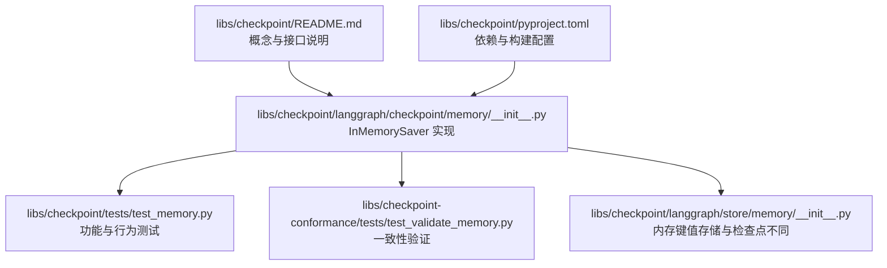
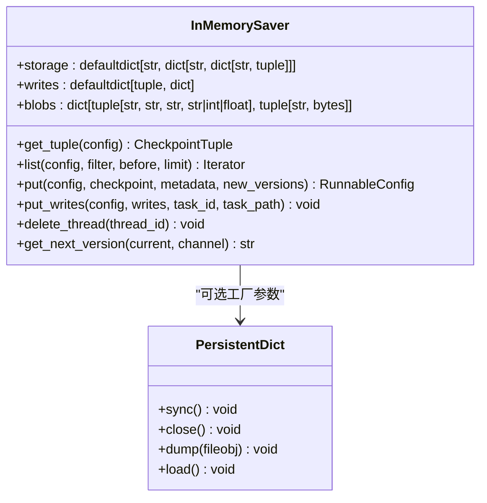
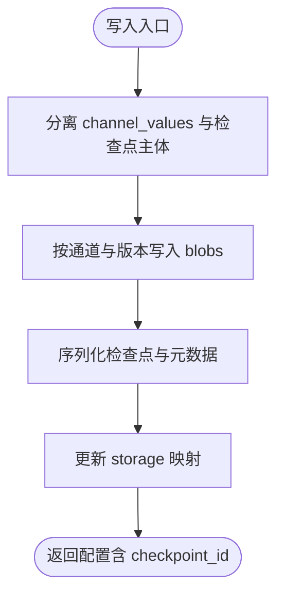
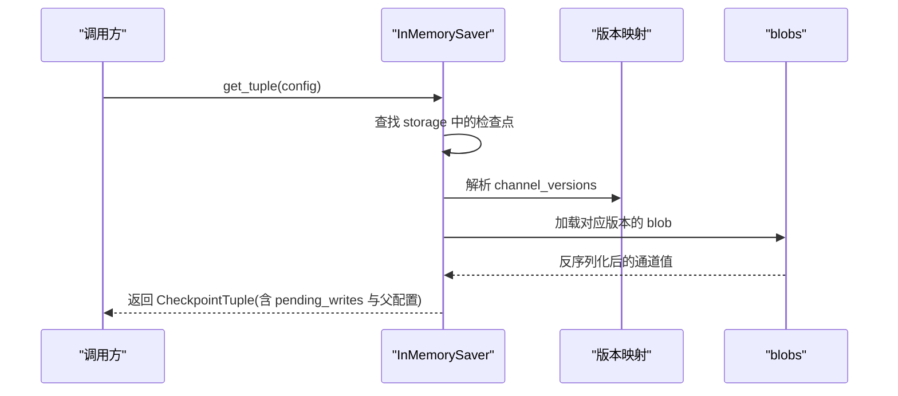
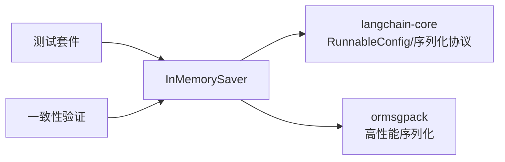

# 内存存储后端

<cite>
**本文引用的文件**
- [libs/checkpoint/langgraph/checkpoint/memory/__init__.py](file://libs/checkpoint/langgraph/checkpoint/memory/__init__.py)
- [libs/checkpoint/tests/test_memory.py](file://libs/checkpoint/tests/test_memory.py)
- [libs/checkpoint-conformance/tests/test_validate_memory.py](file://libs/checkpoint-conformance/tests/test_validate_memory.py)
- [libs/checkpoint/README.md](file://libs/checkpoint/README.md)
- [libs/checkpoint/langgraph/store/memory/__init__.py](file://libs/checkpoint/langgraph/store/memory/__init__.py)
- [libs/checkpoint/pyproject.toml](file://libs/checkpoint/pyproject.toml)
</cite>

## 目录
1. [简介](#简介)
2. [项目结构](#项目结构)
3. [核心组件](#核心组件)
4. [架构总览](#架构总览)
5. [详细组件分析](#详细组件分析)
6. [依赖关系分析](#依赖关系分析)
7. [性能考量](#性能考量)
8. [故障排除指南](#故障排除指南)
9. [结论](#结论)
10. [附录：配置与使用指南](#附录配置与使用指南)

## 简介
本文件面向使用者与工程师，系统性介绍 LangGraph 内存检查点（InMemorySaver）的实现与用法，覆盖以下主题：
- 特点与适用场景：开发测试、临时部署、调试与快速原型
- 数据结构设计与内存管理策略：多层嵌套字典、写入缓冲、二进制 blob 存储
- 配置与使用指南：序列化器选择、版本号生成、上下文管理与异步支持
- 局限性与注意事项：进程重启即丢失、无自动清理机制
- 性能优化建议、监控指标与故障排除
- 与其他存储后端的对比与选型建议

## 项目结构
内存检查点位于 checkpoint 子模块中，核心实现为 InMemorySaver；配套有测试与一致性验证用例。

**图示来源**
- [libs/checkpoint/README.md:1-89](file://libs/checkpoint/README.md#L1-L89)
- [libs/checkpoint/langgraph/checkpoint/memory/__init__.py:1-604](file://libs/checkpoint/langgraph/checkpoint/memory/__init__.py#L1-L604)
- [libs/checkpoint/tests/test_memory.py:1-311](file://libs/checkpoint/tests/test_memory.py#L1-L311)
- [libs/checkpoint-conformance/tests/test_validate_memory.py:1-22](file://libs/checkpoint-conformance/tests/test_validate_memory.py#L1-L22)
- [libs/checkpoint/langgraph/store/memory/__init__.py:1-593](file://libs/checkpoint/langgraph/store/memory/__init__.py#L1-L593)
- [libs/checkpoint/pyproject.toml:1-82](file://libs/checkpoint/pyproject.toml#L1-L82)

**章节来源**
- [libs/checkpoint/README.md:1-89](file://libs/checkpoint/README.md#L1-L89)
- [libs/checkpoint/langgraph/checkpoint/memory/__init__.py:1-604](file://libs/checkpoint/langgraph/checkpoint/memory/__init__.py#L1-L604)
- [libs/checkpoint/tests/test_memory.py:1-311](file://libs/checkpoint/tests/test_memory.py#L1-L311)
- [libs/checkpoint-conformance/tests/test_validate_memory.py:1-22](file://libs/checkpoint-conformance/tests/test_validate_memory.py#L1-L22)
- [libs/checkpoint/langgraph/store/memory/__init__.py:1-593](file://libs/checkpoint/langgraph/store/memory/__init__.py#L1-L593)
- [libs/checkpoint/pyproject.toml:1-82](file://libs/checkpoint/pyproject.toml#L1-L82)

## 核心组件
- InMemorySaver：基于内存的检查点存储器，提供同步与异步接口，支持按线程与命名空间组织检查点，并维护“待写入”缓冲与二进制 blob。
- PersistentDict：可选的持久化字典包装器，将内存中的字典延迟落盘，便于在进程退出时保留状态（仍非生产级持久化）。
- 一致性与测试：通过 conformance 测试确保行为符合规范；单元测试覆盖检索、列表、过滤、元数据合并等关键路径。

**章节来源**
- [libs/checkpoint/langgraph/checkpoint/memory/__init__.py:31-121](file://libs/checkpoint/langgraph/checkpoint/memory/__init__.py#L31-L121)
- [libs/checkpoint-conformance/tests/test_validate_memory.py:11-22](file://libs/checkpoint-conformance/tests/test_validate_memory.py#L11-L22)
- [libs/checkpoint/tests/test_memory.py:87-143](file://libs/checkpoint/tests/test_memory.py#L87-L143)

## 架构总览
内存检查点的运行时由三类结构组成：
- storage：三层嵌套字典，键为 (thread_id, checkpoint_ns, checkpoint_id)，值为序列化后的检查点、元数据与父检查点 ID
- writes：以 (thread_id, checkpoint_ns, checkpoint_id) 为外键，映射到该检查点的“待写入”任务与通道
- blobs：以 (thread_id, checkpoint_ns, channel, version) 为键，存储通道值的二进制 blob

**图示来源**
- [libs/checkpoint/langgraph/checkpoint/memory/__init__.py:66-81](file://libs/checkpoint/langgraph/checkpoint/memory/__init__.py#L66-L81)
- [libs/checkpoint/langgraph/checkpoint/memory/__init__.py:533-603](file://libs/checkpoint/langgraph/checkpoint/memory/__init__.py#L533-L603)

## 详细组件分析

### InMemorySaver 数据结构与内存管理
- 结构设计
  - storage：按线程与命名空间分组，保存每个检查点的序列化体、元数据与父检查点 ID
  - writes：按检查点聚合“待写入”，避免重复写入，支持任务路径记录
  - blobs：按通道与版本号保存二进制 blob，读取时按版本映射还原通道值
- 内存管理策略
  - 默认使用内存字典，适合短期运行与测试
  - 提供工厂参数，可注入自定义容器（如 PersistentDict），实现延迟落盘
  - 未内置过期清理或容量上限控制，需用户自行管理生命周期

**图示来源**
- [libs/checkpoint/langgraph/checkpoint/memory/__init__.py:326-370](file://libs/checkpoint/langgraph/checkpoint/memory/__init__.py#L326-L370)

**章节来源**
- [libs/checkpoint/langgraph/checkpoint/memory/__init__.py:66-81](file://libs/checkpoint/langgraph/checkpoint/memory/__init__.py#L66-L81)
- [libs/checkpoint/langgraph/checkpoint/memory/__init__.py:326-370](file://libs/checkpoint/langgraph/checkpoint/memory/__init__.py#L326-L370)

### 检索与列表查询
- get_tuple：根据线程与可选检查点 ID 获取最新或指定检查点，合并 pending_writes 与按版本加载的 blob
- list：支持按线程、命名空间、检查点 ID、时间边界与元数据过滤，支持 limit 与 before 条件

**图示来源**
- [libs/checkpoint/langgraph/checkpoint/memory/__init__.py:135-216](file://libs/checkpoint/langgraph/checkpoint/memory/__init__.py#L135-L216)
- [libs/checkpoint/langgraph/checkpoint/memory/__init__.py:123-133](file://libs/checkpoint/langgraph/checkpoint/memory/__init__.py#L123-L133)

**章节来源**
- [libs/checkpoint/langgraph/checkpoint/memory/__init__.py:135-216](file://libs/checkpoint/langgraph/checkpoint/memory/__init__.py#L135-L216)
- [libs/checkpoint/langgraph/checkpoint/memory/__init__.py:217-324](file://libs/checkpoint/langgraph/checkpoint/memory/__init__.py#L217-L324)

### 异步与上下文管理
- 支持同步与异步接口，默认异步实现直接委托给同步方法
- 实现了上下文管理协议，便于 with/as 或 async with 使用

**章节来源**
- [libs/checkpoint/langgraph/checkpoint/memory/__init__.py:83-121](file://libs/checkpoint/langgraph/checkpoint/memory/__init__.py#L83-L121)
- [libs/checkpoint/langgraph/checkpoint/memory/__init__.py:428-516](file://libs/checkpoint/langgraph/checkpoint/memory/__init__.py#L428-L516)

### 序列化与类型安全
- 通过 serde 接口进行序列化/反序列化，支持多种类型与版本化通道
- 当遇到未注册类型时，JsonPlusSerializer 会发出警告或阻断，可通过白名单或代理方式隔离影响

**章节来源**
- [libs/checkpoint/tests/test_memory.py:211-284](file://libs/checkpoint/tests/test_memory.py#L211-L284)

### 与内存键值存储的区别
- 内存检查点（本文件主题）：按线程/命名空间/检查点组织，支持通道版本与待写入合并
- 内存键值存储（store.memory.InMemoryStore）：通用键值存储，支持向量索引与搜索，同样仅驻留内存

**章节来源**
- [libs/checkpoint/langgraph/store/memory/__init__.py:1-100](file://libs/checkpoint/langgraph/store/memory/__init__.py#L1-L100)

## 依赖关系分析
- 依赖 langchain-core 的 RunnableConfig 与序列化协议
- 使用 ormsgpack 进行高性能序列化
- 测试依赖 pytest、pytest-asyncio 等生态工具

**图示来源**
- [libs/checkpoint/pyproject.toml:14-17](file://libs/checkpoint/pyproject.toml#L14-L17)
- [libs/checkpoint/README.md:25-44](file://libs/checkpoint/README.md#L25-L44)

**章节来源**
- [libs/checkpoint/pyproject.toml:14-17](file://libs/checkpoint/pyproject.toml#L14-L17)
- [libs/checkpoint/README.md:25-44](file://libs/checkpoint/README.md#L25-L44)

## 性能考量
- 时间复杂度
  - get_tuple：O(N) 遍历待写入，N 为该检查点已完成节点数
  - list：O(M log M) 排序 + O(M) 过滤，M 为该线程/命名空间下检查点数量
- 空间复杂度
  - storage 与 writes 与检查点数量线性相关；blobs 与通道版本数线性相关
- 优化建议
  - 控制通道数量与大小，避免在单个检查点内写入超大对象
  - 合理使用命名空间隔离不同业务域，减少 list 查询范围
  - 对频繁访问的通道值进行缓存（应用层）
  - 在高并发场景下，考虑将 InMemorySaver 限定于单实例或多线程安全的轻量封装
- 监控指标
  - 检查点数量、存储占用估算（结合通道值大小）
  - list 查询耗时、命中率（按过滤条件）
  - 序列化/反序列化失败次数与类型注册告警

[本节为通用指导，不直接分析具体文件]

## 故障排除指南
- 常见问题
  - 进程重启后检查点丢失：这是预期行为，内存后端不提供持久化
  - 未注册类型导致警告或阻断：通过 serde 白名单或代理方式解决
  - 列表查询结果为空：确认线程/命名空间/检查点 ID 是否正确
- 定位手段
  - 使用 list + filter 精确定位目标检查点
  - 检查 pending_writes 是否过多导致恢复时重放成本高
  - 关注 serde 日志，识别类型注册问题
- 修复建议
  - 在测试与开发阶段启用 InMemorySaver；生产使用数据库后端
  - 对大对象采用外部存储（如对象存储）并仅在检查点中保存引用

**章节来源**
- [libs/checkpoint/tests/test_memory.py:211-284](file://libs/checkpoint/tests/test_memory.py#L211-L284)
- [libs/checkpoint/langgraph/checkpoint/memory/__init__.py:217-324](file://libs/checkpoint/langgraph/checkpoint/memory/__init__.py#L217-L324)

## 结论
InMemorySaver 是一个轻量、易用且高效的内存检查点实现，适用于开发测试与临时部署场景。其简洁的数据结构与完善的异步/上下文支持降低了使用门槛。但请务必注意其内存特性：进程重启即丢失，不提供过期清理与容量上限，不适合生产使用。生产环境应优先选择数据库后端（如 Postgres/SQLite），并在需要时引入备份与监控策略。

[本节为总结，不直接分析具体文件]

## 附录：配置与使用指南

### 适用场景
- 开发与本地调试：快速迭代、无需外部依赖
- 临时部署：短期实验、沙箱环境
- 单进程内短生命周期任务：如批处理、一次性计算

### 不适用场景
- 生产服务：存在数据丢失风险
- 需要跨进程/跨实例共享状态
- 需要长期持久化与审计日志

### 配置要点
- 基本用法
  - 将 InMemorySaver 注入编译后的图作为 checkpointer
  - 调用时提供包含 thread_id 的配置；可选传入 checkpoint_id 从指定检查点恢复
- 序列化器
  - 默认使用 JsonPlusSerializer；对自定义类型需注册或使用代理
- 版本号生成
  - get_next_version 生成带随机散列的字符串版本号，保证并发安全
- 上下文与异步
  - 支持 with/as 与 async with；异步方法默认委托同步实现

**章节来源**
- [libs/checkpoint/README.md:46-88](file://libs/checkpoint/README.md#L46-L88)
- [libs/checkpoint/langgraph/checkpoint/memory/__init__.py:31-64](file://libs/checkpoint/langgraph/checkpoint/memory/__init__.py#L31-L64)
- [libs/checkpoint/langgraph/checkpoint/memory/__init__.py:518-527](file://libs/checkpoint/langgraph/checkpoint/memory/__init__.py#L518-L527)

### 与其他存储后端的对比与选型建议
- 与数据库后端（如 Postgres/SQLite）对比
  - 可靠性：数据库后端具备持久化、事务与崩溃恢复能力
  - 性能：内存后端读写极快；数据库后端在高并发与大数据量下需评估索引与连接池
  - 维护：数据库后端需要迁移、备份与容量规划
- 选型建议
  - 开发/测试：InMemorySaver
  - 生产：优先 Postgres/SQLite；若对延迟敏感且数据体量可控，可评估 Redis 缓存层（需额外实现）

[本节为通用指导，不直接分析具体文件]