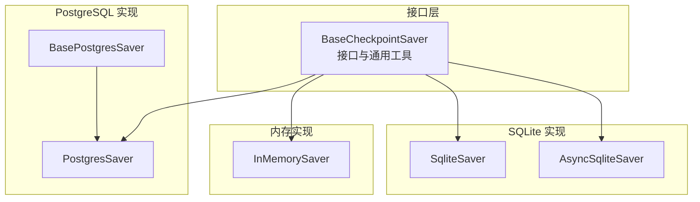
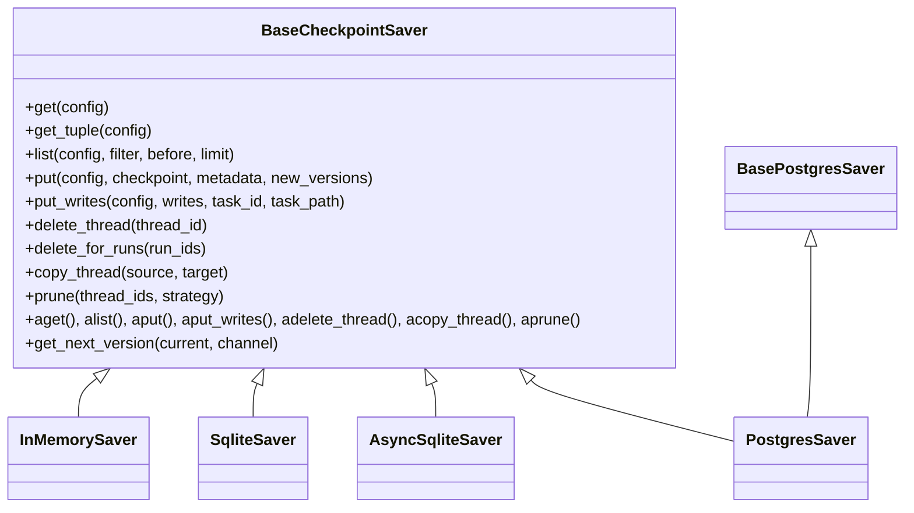
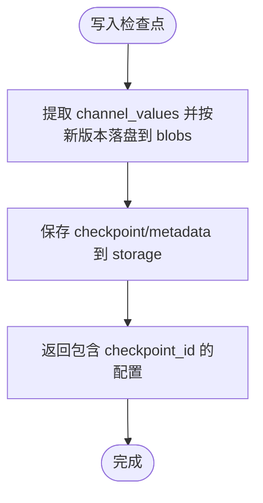
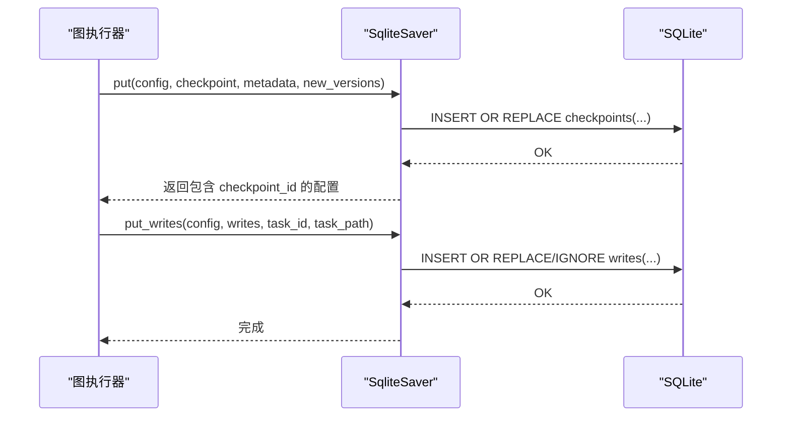
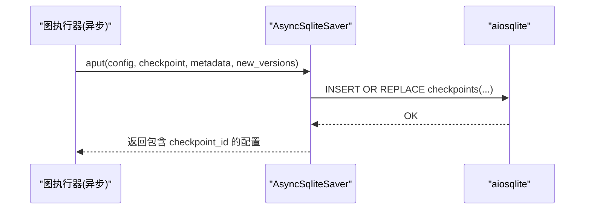
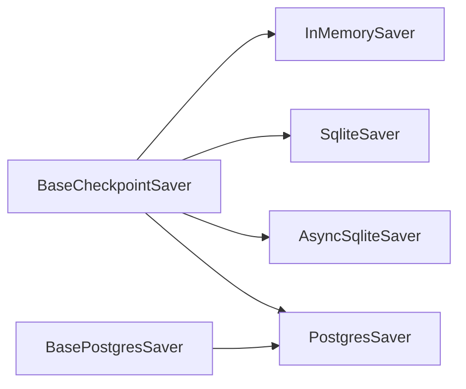

# 持久化系统

<cite>
**本文引用的文件**
- [libs/checkpoint/langgraph/checkpoint/base/__init__.py](file://libs/checkpoint/langgraph/checkpoint/base/__init__.py)
- [libs/checkpoint/langgraph/checkpoint/memory/__init__.py](file://libs/checkpoint/langgraph/checkpoint/memory/__init__.py)
- [libs/checkpoint-sqlite/langgraph/checkpoint/sqlite/__init__.py](file://libs/checkpoint-sqlite/langgraph/checkpoint/sqlite/__init__.py)
- [libs/checkpoint-sqlite/langgraph/checkpoint/sqlite/aio.py](file://libs/checkpoint-sqlite/langgraph/checkpoint/sqlite/aio.py)
- [libs/checkpoint-postgres/langgraph/checkpoint/postgres/__init__.py](file://libs/checkpoint-postgres/langgraph/checkpoint/postgres/__init__.py)
- [libs/checkpoint-postgres/langgraph/checkpoint/postgres/base.py](file://libs/checkpoint-postgres/langgraph/checkpoint/postgres/base.py)
- [libs/checkpoint-postgres/langgraph/checkpoint/postgres/_internal.py](file://libs/checkpoint-postgres/langgraph/checkpoint/postgres/_internal.py)
</cite>

## 目录
1. [简介](#简介)
2. [项目结构](#项目结构)
3. [核心组件](#核心组件)
4. [架构总览](#架构总览)
5. [详细组件分析](#详细组件分析)
6. [依赖分析](#依赖分析)
7. [性能考量](#性能考量)
8. [故障排除指南](#故障排除指南)
9. [结论](#结论)
10. [附录](#附录)

## 简介
本文件系统性梳理 LangGraph 的持久化系统，重点覆盖以下方面：
- 检查点机制的设计与实现：状态快照、版本管理、元数据与恢复策略
- 多后端实现：SQLite（同步/异步）、PostgreSQL、内存实现的特性与适用场景
- 接口设计模式与扩展机制：如何基于 BaseCheckpointSaver 扩展自定义后端
- 配置指南、性能调优与故障排除
- 实战部署的最佳实践与安全注意事项

## 项目结构
LangGraph 的持久化系统由“接口层 + 多后端实现”组成，核心接口位于基础模块，具体数据库实现分别在 SQLite、PostgreSQL 与内存模块中。



图表来源
- [libs/checkpoint/langgraph/checkpoint/base/__init__.py:122-490](file://libs/checkpoint/langgraph/checkpoint/base/__init__.py#L122-L490)
- [libs/checkpoint/langgraph/checkpoint/memory/__init__.py:31-120](file://libs/checkpoint/langgraph/checkpoint/memory/__init__.py#L31-L120)
- [libs/checkpoint-sqlite/langgraph/checkpoint/sqlite/__init__.py:38-120](file://libs/checkpoint-sqlite/langgraph/checkpoint/sqlite/__init__.py#L38-L120)
- [libs/checkpoint-sqlite/langgraph/checkpoint/sqlite/aio.py:31-120](file://libs/checkpoint-sqlite/langgraph/checkpoint/sqlite/aio.py#L31-L120)
- [libs/checkpoint-postgres/langgraph/checkpoint/postgres/__init__.py:32-76](file://libs/checkpoint-postgres/langgraph/checkpoint/postgres/__init__.py#L32-L76)
- [libs/checkpoint-postgres/langgraph/checkpoint/postgres/base.py:156-316](file://libs/checkpoint-postgres/langgraph/checkpoint/postgres/base.py#L156-L316)

章节来源
- [libs/checkpoint/langgraph/checkpoint/base/__init__.py:122-490](file://libs/checkpoint/langgraph/checkpoint/base/__init__.py#L122-L490)
- [libs/checkpoint/langgraph/checkpoint/memory/__init__.py:31-120](file://libs/checkpoint/langgraph/checkpoint/memory/__init__.py#L31-L120)
- [libs/checkpoint-sqlite/langgraph/checkpoint/sqlite/__init__.py:38-120](file://libs/checkpoint-sqlite/langgraph/checkpoint/sqlite/__init__.py#L38-L120)
- [libs/checkpoint-sqlite/langgraph/checkpoint/sqlite/aio.py:31-120](file://libs/checkpoint-sqlite/langgraph/checkpoint/sqlite/aio.py#L31-L120)
- [libs/checkpoint-postgres/langgraph/checkpoint/postgres/__init__.py:32-76](file://libs/checkpoint-postgres/langgraph/checkpoint/postgres/__init__.py#L32-L76)
- [libs/checkpoint-postgres/langgraph/checkpoint/postgres/base.py:156-316](file://libs/checkpoint-postgres/langgraph/checkpoint/postgres/base.py#L156-L316)

## 核心组件
- 基础接口与数据模型
  - Checkpoint 元数据结构：包含版本号、时间戳、通道值、通道版本、节点可见版本映射、更新通道等字段
  - CheckpointMetadata：记录来源类型、步骤、父检查点映射、运行 ID 等
  - BaseCheckpointSaver：统一的存取接口，支持同步与异步方法族，以及版本生成、序列化器注入、批量写入、线程复制/清理等能力
- 版本管理
  - 默认整数递增；字符串/浮点版本通过自定义 get_next_version 支持
  - 通道版本用于确定节点下次执行范围，确保幂等与增量处理
- 序列化与安全
  - 可插拔 SerializerProtocol，默认 JsonPlusSerializer；支持加密包装器 EncryptedSerializer
  - 支持 msgpack 白名单以限制反序列化类型（通过 with_allowlist）

章节来源
- [libs/checkpoint/langgraph/checkpoint/base/__init__.py:35-120](file://libs/checkpoint/langgraph/checkpoint/base/__init__.py#L35-L120)
- [libs/checkpoint/langgraph/checkpoint/base/__init__.py:122-490](file://libs/checkpoint/langgraph/checkpoint/base/__init__.py#L122-L490)
- [libs/checkpoint/langgraph/checkpoint/base/__init__.py:460-490](file://libs/checkpoint/langgraph/checkpoint/base/__init__.py#L460-L490)

## 架构总览
持久化系统围绕 BaseCheckpointSaver 展开，不同后端实现遵循同一契约，保证上层图执行引擎无需关心底层存储细节。



图表来源
- [libs/checkpoint/langgraph/checkpoint/base/__init__.py:122-490](file://libs/checkpoint/langgraph/checkpoint/base/__init__.py#L122-L490)
- [libs/checkpoint/langgraph/checkpoint/memory/__init__.py:31-120](file://libs/checkpoint/langgraph/checkpoint/memory/__init__.py#L31-L120)
- [libs/checkpoint-sqlite/langgraph/checkpoint/sqlite/__init__.py:38-120](file://libs/checkpoint-sqlite/langgraph/checkpoint/sqlite/__init__.py#L38-L120)
- [libs/checkpoint-sqlite/langgraph/checkpoint/sqlite/aio.py:31-120](file://libs/checkpoint-sqlite/langgraph/checkpoint/sqlite/aio.py#L31-L120)
- [libs/checkpoint-postgres/langgraph/checkpoint/postgres/__init__.py:32-76](file://libs/checkpoint-postgres/langgraph/checkpoint/postgres/__init__.py#L32-L76)
- [libs/checkpoint-postgres/langgraph/checkpoint/postgres/base.py:156-316](file://libs/checkpoint-postgres/langgraph/checkpoint/postgres/base.py#L156-L316)

## 详细组件分析

### 基础接口与数据模型
- 数据模型
  - Checkpoint：v/ts/id/channel_values/channel_versions/versions_seen/pending_sends/updated_channels
  - CheckpointMetadata：source/step/parents/run_id 及其他可选键
- 关键方法族
  - get/get_tuple/list：查询最近或指定检查点、按条件过滤、分页
  - put/put_writes：写入检查点与中间写入，支持父检查点关联
  - delete_thread/delete_for_runs/copy_thread/prune：生命周期与清理
  - 异步同名方法：aget/aget_tuple/alist/aput/aput_writes/adelete_thread/acopy_thread/aprune
- 版本生成
  - 默认整数递增；字符串/浮点版本可通过子类重写 get_next_version
- 序列化
  - serde 注入与类型化序列化/反序列化；支持 msgpack 白名单与加密包装

章节来源
- [libs/checkpoint/langgraph/checkpoint/base/__init__.py:35-120](file://libs/checkpoint/langgraph/checkpoint/base/__init__.py#L35-L120)
- [libs/checkpoint/langgraph/checkpoint/base/__init__.py:122-490](file://libs/checkpoint/langgraph/checkpoint/base/__init__.py#L122-L490)
- [libs/checkpoint/langgraph/checkpoint/base/__init__.py:460-490](file://libs/checkpoint/langgraph/checkpoint/base/__init__.py#L460-L490)

### 内存实现（InMemorySaver）
- 存储结构
  - storage：thread_id -> checkpoint_ns -> checkpoint_id -> (checkpoint, metadata, parent_id)
  - writes：(thread_id, checkpoint_ns, checkpoint_id) -> (task_id, idx) -> (task_id, channel, typed_value, task_path)
  - blobs：(thread_id, checkpoint_ns, channel, version) -> (type, bytes)
- 特点
  - 仅适用于调试/测试；不支持并发写入；重启即丢失
  - 提供工厂构造器以替换默认容器类型（如 PersistentDict）
- 版本策略
  - 字符串版本：形如 "N.hhhh..."，N 递增，hhhh... 为随机片段，保证单调递增



图表来源
- [libs/checkpoint/langgraph/checkpoint/memory/__init__.py:326-370](file://libs/checkpoint/langgraph/checkpoint/memory/__init__.py#L326-L370)

章节来源
- [libs/checkpoint/langgraph/checkpoint/memory/__init__.py:31-120](file://libs/checkpoint/langgraph/checkpoint/memory/__init__.py#L31-L120)
- [libs/checkpoint/langgraph/checkpoint/memory/__init__.py:123-427](file://libs/checkpoint/langgraph/checkpoint/memory/__init__.py#L123-L427)
- [libs/checkpoint/langgraph/checkpoint/memory/__init__.py:518-528](file://libs/checkpoint/langgraph/checkpoint/memory/__init__.py#L518-L528)

### SQLite 同步实现（SqliteSaver）
- 表结构
  - checkpoints：主键 (thread_id, checkpoint_ns, checkpoint_id)，包含序列化后的 checkpoint 与 metadata
  - writes：主键 (thread_id, checkpoint_ns, checkpoint_id, task_id, idx)，记录中间写入
- 连接与事务
  - 使用 threading.Lock 保证线程安全；PRAGMA WAL；自动建表
  - 提供 from_conn_string 工厂方法
- 查询与写入
  - get_tuple/list 支持按 checkpoint_id 或最新记录检索；支持 metadata 过滤与 limit
  - put/put_writes 使用 INSERT OR REPLACE 或 INSERT OR IGNORE 控制重复写入
- 版本策略
  - 字符串版本：形如 "N.hhhh..."，N 递增，hhhh... 为随机片段



图表来源
- [libs/checkpoint-sqlite/langgraph/checkpoint/sqlite/__init__.py:380-476](file://libs/checkpoint-sqlite/langgraph/checkpoint/sqlite/__init__.py#L380-L476)

章节来源
- [libs/checkpoint-sqlite/langgraph/checkpoint/sqlite/__init__.py:38-120](file://libs/checkpoint-sqlite/langgraph/checkpoint/sqlite/__init__.py#L38-L120)
- [libs/checkpoint-sqlite/langgraph/checkpoint/sqlite/__init__.py:122-183](file://libs/checkpoint-sqlite/langgraph/checkpoint/sqlite/__init__.py#L122-L183)
- [libs/checkpoint-sqlite/langgraph/checkpoint/sqlite/__init__.py:184-378](file://libs/checkpoint-sqlite/langgraph/checkpoint/sqlite/__init__.py#L184-L378)
- [libs/checkpoint-sqlite/langgraph/checkpoint/sqlite/__init__.py:380-476](file://libs/checkpoint-sqlite/langgraph/checkpoint/sqlite/__init__.py#L380-L476)
- [libs/checkpoint-sqlite/langgraph/checkpoint/sqlite/__init__.py:537-557](file://libs/checkpoint-sqlite/langgraph/checkpoint/sqlite/__init__.py#L537-L557)

### SQLite 异步实现（AsyncSqliteSaver）
- 设计要点
  - 基于 aiosqlite，提供完整的异步接口；内部使用 asyncio.Lock
  - 不推荐生产使用，主要面向异步场景的轻量替代
- 与同步版对比
  - get/list/put/put_writes/delete_thread 均有异步对应方法
  - 提供 from_conn_string 上下文管理器



图表来源
- [libs/checkpoint-sqlite/langgraph/checkpoint/sqlite/aio.py:479-529](file://libs/checkpoint-sqlite/langgraph/checkpoint/sqlite/aio.py#L479-L529)

章节来源
- [libs/checkpoint-sqlite/langgraph/checkpoint/sqlite/aio.py:31-120](file://libs/checkpoint-sqlite/langgraph/checkpoint/sqlite/aio.py#L31-L120)
- [libs/checkpoint-sqlite/langgraph/checkpoint/sqlite/aio.py:275-315](file://libs/checkpoint-sqlite/langgraph/checkpoint/sqlite/aio.py#L275-L315)
- [libs/checkpoint-sqlite/langgraph/checkpoint/sqlite/aio.py:316-477](file://libs/checkpoint-sqlite/langgraph/checkpoint/sqlite/aio.py#L316-L477)
- [libs/checkpoint-sqlite/langgraph/checkpoint/sqlite/aio.py:479-611](file://libs/checkpoint-sqlite/langgraph/checkpoint/sqlite/aio.py#L479-L611)

### PostgreSQL 实现（PostgresSaver）
- 表结构与迁移
  - checkpoints：JSONB 存储 checkpoint 与 metadata
  - checkpoint_blobs：按 (thread_id, checkpoint_ns, channel, version) 存放大对象或复杂值
  - checkpoint_writes：按 (thread_id, checkpoint_ns, checkpoint_id, task_id, idx) 存放中间写入
  - 迁移列表 MIGRATIONS：含索引、列扩展等演进
- 查询与写入
  - list/get_tuple：通过 SQL 聚合查询一次性返回 channel_values 与 pending_writes
  - put：将简单值内联至 checkpoints，复杂值写入 checkpoint_blobs，并通过 UPSERT 更新
  - put_writes：根据是否为特殊写入选择 UPSERT 或 INSERT OR IGNORE
- 并发与管线
  - 支持连接池与事务/管线模式；内部加锁避免竞争
  - _cursor 上下文管理器支持 pipeline 参数动态切换

```mermaid
erDiagram
CHECKPOINTS {
text thread_id
text checkpoint_ns
text checkpoint_id PK
text parent_checkpoint_id
bytea type
jsonb checkpoint
jsonb metadata
}
CHECKPOINT_BLOBS {
text thread_id
text checkpoint_ns
text channel
text version
text type
bytea blob
PRIMARY KEY(thread_id, checkpoint_ns, channel, version)
}
CHECKPOINT_WRITES {
text thread_id
text checkpoint_ns
text checkpoint_id
text task_id
int idx
text channel
text type
bytea blob
PRIMARY KEY(thread_id, checkpoint_ns, checkpoint_id, task_id, idx)
}
CHECKPOINTS ||--o{ CHECKPOINT_BLOBS : "按通道+版本关联"
CHECKPOINTS ||--o{ CHECKPOINT_WRITES : "按任务+索引关联"
```

图表来源
- [libs/checkpoint-postgres/langgraph/checkpoint/postgres/base.py:37-85](file://libs/checkpoint-postgres/langgraph/checkpoint/postgres/base.py#L37-L85)
- [libs/checkpoint-postgres/langgraph/checkpoint/postgres/base.py:125-153](file://libs/checkpoint-postgres/langgraph/checkpoint/postgres/base.py#L125-L153)

章节来源
- [libs/checkpoint-postgres/langgraph/checkpoint/postgres/base.py:37-85](file://libs/checkpoint-postgres/langgraph/checkpoint/postgres/base.py#L37-L85)
- [libs/checkpoint-postgres/langgraph/checkpoint/postgres/base.py:156-316](file://libs/checkpoint-postgres/langgraph/checkpoint/postgres/base.py#L156-L316)
- [libs/checkpoint-postgres/langgraph/checkpoint/postgres/__init__.py:32-76](file://libs/checkpoint-postgres/langgraph/checkpoint/postgres/__init__.py#L32-L76)
- [libs/checkpoint-postgres/langgraph/checkpoint/postgres/__init__.py:104-183](file://libs/checkpoint-postgres/langgraph/checkpoint/postgres/__init__.py#L104-L183)
- [libs/checkpoint-postgres/langgraph/checkpoint/postgres/__init__.py:184-253](file://libs/checkpoint-postgres/langgraph/checkpoint/postgres/__init__.py#L184-L253)
- [libs/checkpoint-postgres/langgraph/checkpoint/postgres/__init__.py:255-334](file://libs/checkpoint-postgres/langgraph/checkpoint/postgres/__init__.py#L255-L334)
- [libs/checkpoint-postgres/langgraph/checkpoint/postgres/__init__.py:336-368](file://libs/checkpoint-postgres/langgraph/checkpoint/postgres/__init__.py#L336-L368)
- [libs/checkpoint-postgres/langgraph/checkpoint/postgres/__init__.py:370-392](file://libs/checkpoint-postgres/langgraph/checkpoint/postgres/__init__.py#L370-L392)
- [libs/checkpoint-postgres/langgraph/checkpoint/postgres/_internal.py:13-22](file://libs/checkpoint-postgres/langgraph/checkpoint/postgres/_internal.py#L13-L22)

## 依赖分析
- 组件耦合
  - 所有后端均继承 BaseCheckpointSaver，保持统一契约，降低上层耦合
  - PostgreSQL 实现进一步抽象出 BasePostgresSaver，复用 SQL 与迁移逻辑
- 外部依赖
  - SQLite：sqlite3（同步）/ aiosqlite（异步）
  - PostgreSQL：psycopg/psycopg_pool，JSONB/BYTEA 类型
- 循环依赖
  - 未发现循环导入；模块职责清晰



图表来源
- [libs/checkpoint/langgraph/checkpoint/base/__init__.py:122-490](file://libs/checkpoint/langgraph/checkpoint/base/__init__.py#L122-L490)
- [libs/checkpoint-postgres/langgraph/checkpoint/postgres/base.py:156-316](file://libs/checkpoint-postgres/langgraph/checkpoint/postgres/base.py#L156-L316)

章节来源
- [libs/checkpoint/langgraph/checkpoint/base/__init__.py:122-490](file://libs/checkpoint/langgraph/checkpoint/base/__init__.py#L122-L490)
- [libs/checkpoint-postgres/langgraph/checkpoint/postgres/base.py:156-316](file://libs/checkpoint-postgres/langgraph/checkpoint/postgres/base.py#L156-L316)

## 性能考量
- 写入路径
  - SQLite：WAL 模式提升并发读写；批量写入时尽量合并事务
  - PostgreSQL：复杂值走 checkpoint_blobs，减少 JSONB 体积；合理使用索引（按 thread_id）
- 查询路径
  - list/get_tuple：优先使用 metadata JSONB 匹配与索引；必要时限制 limit
  - 内存实现：适合小规模测试，不适合高并发
- 版本策略
  - 字符串版本保证单调递增且可排序；整数版本更紧凑
- 异步与并发
  - AsyncSqliteSaver 仅限异步使用；生产建议 PostgreSQL
- 序列化
  - 选择合适的 SerializerProtocol；对敏感数据使用 EncryptedSerializer

## 故障排除指南
- 常见问题
  - 未设置 thread_id：无法保存/恢复状态；请在 config 中提供 "configurable": {"thread_id": "..."}
  - 版本冲突/重复写入：使用 WRITES_IDX_MAP 控制特殊写入的 UPSERT 行为
  - SQLite 异步错误：SqliteSaver 不支持异步方法，请改用 AsyncSqliteSaver
  - PostgreSQL 连接问题：确认连接字符串、权限与网络；必要时启用连接池
- 定位手段
  - 使用 list/filter/before/limit 精确定位检查点
  - 检查 metadata 中的 source/step/parents/run_id 辅助回溯
- 清理与维护
  - delete_thread/delete_for_runs：删除特定线程/运行的所有数据
  - prune：保留最新或全删策略，控制存储增长

章节来源
- [libs/checkpoint-sqlite/langgraph/checkpoint/sqlite/__init__.py:27-35](file://libs/checkpoint-sqlite/langgraph/checkpoint/sqlite/__init__.py#L27-L35)
- [libs/checkpoint-sqlite/langgraph/checkpoint/sqlite/__init__.py:496-520](file://libs/checkpoint-sqlite/langgraph/checkpoint/sqlite/__init__.py#L496-L520)
- [libs/checkpoint-postgres/langgraph/checkpoint/postgres/__init__.py:370-392](file://libs/checkpoint-postgres/langgraph/checkpoint/postgres/__init__.py#L370-L392)

## 结论
LangGraph 的持久化系统以 BaseCheckpointSaver 为核心，提供统一的检查点存取接口与版本管理机制。内存实现适合开发测试，SQLite 在轻量场景可用，PostgreSQL 则满足生产级可靠性、可扩展性与运维需求。通过合理的配置、版本策略与序列化方案，可在安全性与性能之间取得平衡。

## 附录

### 配置指南（示例要点）
- thread_id 与命名空间
  - 在 RunnableConfig 的 "configurable" 中设置 "thread_id" 与 "checkpoint_ns"
- 选择后端
  - 内存：InMemorySaver（仅测试）
  - SQLite：SqliteSaver（同步）或 AsyncSqliteSaver（异步）
  - PostgreSQL：PostgresSaver（支持连接池与管线）
- 序列化与安全
  - serde：JsonPlusSerializer 或 EncryptedSerializer
  - msgpack 白名单：with_allowlist

章节来源
- [libs/checkpoint/langgraph/checkpoint/base/__init__.py:155-163](file://libs/checkpoint/langgraph/checkpoint/base/__init__.py#L155-L163)
- [libs/checkpoint/langgraph/checkpoint/memory/__init__.py:31-64](file://libs/checkpoint/langgraph/checkpoint/memory/__init__.py#L31-L64)
- [libs/checkpoint-sqlite/langgraph/checkpoint/sqlite/__init__.py:38-73](file://libs/checkpoint-sqlite/langgraph/checkpoint/sqlite/__init__.py#L38-L73)
- [libs/checkpoint-sqlite/langgraph/checkpoint/sqlite/aio.py:31-57](file://libs/checkpoint-sqlite/langgraph/checkpoint/sqlite/aio.py#L31-L57)
- [libs/checkpoint-postgres/langgraph/checkpoint/postgres/__init__.py:32-76](file://libs/checkpoint-postgres/langgraph/checkpoint/postgres/__init__.py#L32-L76)