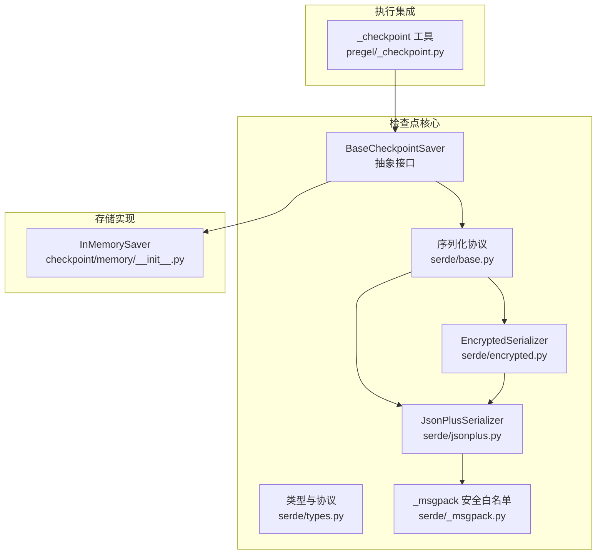
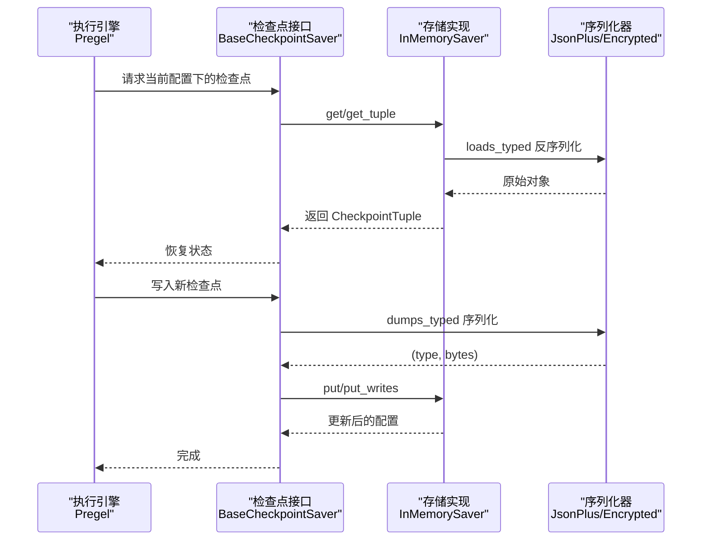
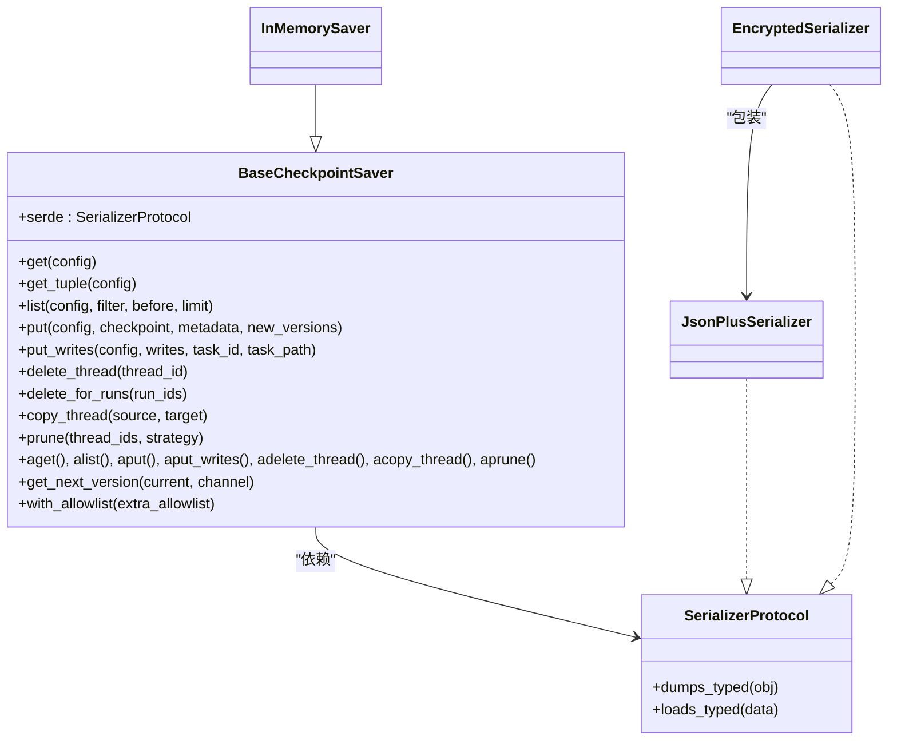
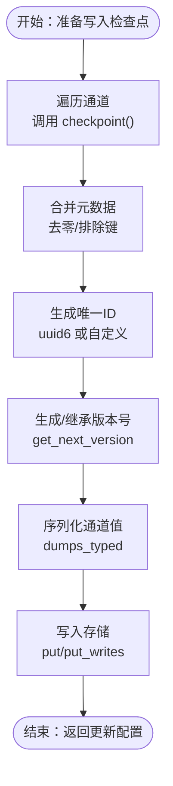
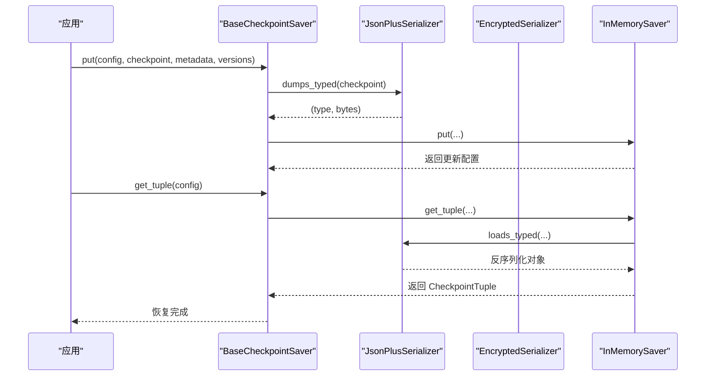
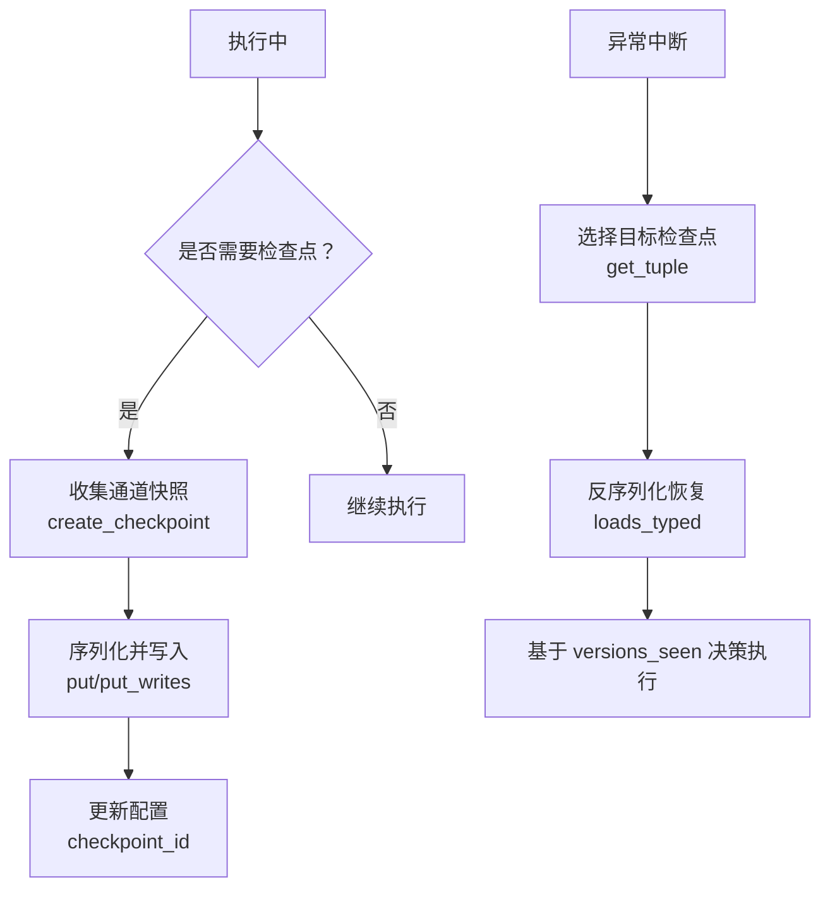
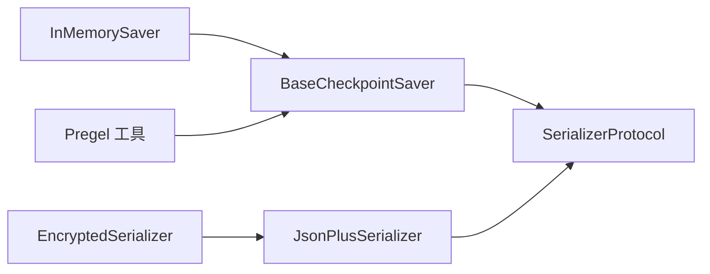

# 检查点机制原理

<cite>
**本文档引用的文件**
- [libs/checkpoint/langgraph/checkpoint/base/__init__.py](file://libs/checkpoint/langgraph/checkpoint/base/__init__.py)
- [libs/checkpoint/langgraph/checkpoint/memory/__init__.py](file://libs/checkpoint/langgraph/checkpoint/memory/__init__.py)
- [libs/checkpoint/langgraph/checkpoint/serde/base.py](file://libs/checkpoint/langgraph/checkpoint/serde/base.py)
- [libs/checkpoint/langgraph/checkpoint/serde/types.py](file://libs/checkpoint/langgraph/checkpoint/serde/types.py)
- [libs/checkpoint/langgraph/checkpoint/serde/jsonplus.py](file://libs/checkpoint/langgraph/checkpoint/serde/jsonplus.py)
- [libs/checkpoint/langgraph/checkpoint/serde/encrypted.py](file://libs/checkpoint/langgraph/checkpoint/serde/encrypted.py)
- [libs/checkpoint/langgraph/checkpoint/serde/_msgpack.py](file://libs/checkpoint/langgraph/checkpoint/serde/_msgpack.py)
- [libs/langgraph/langgraph/pregel/_checkpoint.py](file://libs/langgraph/langgraph/pregel/_checkpoint.py)
</cite>

## 目录
1. [引言](#引言)
2. [项目结构](#项目结构)
3. [核心组件](#核心组件)
4. [架构总览](#架构总览)
5. [详细组件分析](#详细组件分析)
6. [依赖分析](#依赖分析)
7. [性能考虑](#性能考虑)
8. [故障排查指南](#故障排查指南)
9. [结论](#结论)

## 引言
本文件系统性阐述 LangGraph 检查点机制的原理与实现，覆盖以下关键主题：
- 检查点的核心概念：状态快照、版本管理、元数据与父链
- 设计哲学：可插拔序列化器、异步接口、线程隔离与命名空间
- 实现原理：状态捕获时机、序列化与反序列化、版本生成策略
- 在代理执行中的作用：故障恢复、状态回滚、并发控制
- 接口设计模式：BaseCheckpointSaver 抽象类与扩展机制
- 生命周期管理最佳实践与性能优化建议

## 项目结构
检查点子系统位于 libs/checkpoint，围绕“抽象接口 + 多种序列化器 + 内存实现”组织；与 Pregel 执行引擎协作，负责状态快照与恢复。

**图表来源**
- [libs/checkpoint/langgraph/checkpoint/base/__init__.py:122-315](file://libs/checkpoint/langgraph/checkpoint/base/__init__.py#L122-L315)
- [libs/checkpoint/langgraph/checkpoint/serde/base.py:14-48](file://libs/checkpoint/langgraph/checkpoint/serde/base.py#L14-L48)
- [libs/checkpoint/langgraph/checkpoint/serde/jsonplus.py:50-261](file://libs/checkpoint/langgraph/checkpoint/serde/jsonplus.py#L50-L261)
- [libs/checkpoint/langgraph/checkpoint/serde/encrypted.py:8-37](file://libs/checkpoint/langgraph/checkpoint/serde/encrypted.py#L8-L37)
- [libs/checkpoint/langgraph/checkpoint/serde/_msgpack.py:14-86](file://libs/checkpoint/langgraph/checkpoint/serde/_msgpack.py#L14-L86)
- [libs/checkpoint/langgraph/checkpoint/memory/__init__.py:31-122](file://libs/checkpoint/langgraph/checkpoint/memory/__init__.py#L31-L122)
- [libs/langgraph/langgraph/pregel/_checkpoint.py:16-55](file://libs/langgraph/langgraph/pregel/_checkpoint.py#L16-L55)

**章节来源**
- [libs/checkpoint/langgraph/checkpoint/base/__init__.py:122-315](file://libs/checkpoint/langgraph/checkpoint/base/__init__.py#L122-L315)
- [libs/checkpoint/langgraph/checkpoint/memory/__init__.py:31-122](file://libs/checkpoint/langgraph/checkpoint/memory/__init__.py#L31-L122)
- [libs/checkpoint/langgraph/checkpoint/serde/base.py:14-48](file://libs/checkpoint/langgraph/checkpoint/serde/base.py#L14-L48)
- [libs/checkpoint/langgraph/checkpoint/serde/jsonplus.py:50-261](file://libs/checkpoint/langgraph/checkpoint/serde/jsonplus.py#L50-L261)
- [libs/checkpoint/langgraph/checkpoint/serde/encrypted.py:8-37](file://libs/checkpoint/langgraph/checkpoint/serde/encrypted.py#L8-L37)
- [libs/checkpoint/langgraph/checkpoint/serde/_msgpack.py:14-86](file://libs/checkpoint/langgraph/checkpoint/serde/_msgpack.py#L14-L86)
- [libs/langgraph/langgraph/pregel/_checkpoint.py:16-55](file://libs/langgraph/langgraph/pregel/_checkpoint.py#L16-L55)

## 核心组件
- 抽象接口 BaseCheckpointSaver：定义检查点的获取、列举、写入、中间写入、删除、复制、修剪等操作，并提供异步对应方法。支持自定义序列化器注入与消息包（msgpack）白名单增强。
- 状态模型 Checkpoint 与元数据 CheckpointMetadata：描述快照格式版本、时间戳、通道值、通道版本、节点可见版本映射、更新通道列表等。
- 序列化体系：SerializerProtocol 提供 typed dumps/loads；JsonPlusSerializer 支持 msgpack/json/fallback；EncryptedSerializer 对内层序列化结果进行加密包装；_msgpack 白名单保障安全反序列化。
- 存储实现 InMemorySaver：基于内存的默认实现，演示如何组织存储结构（按 thread_id → checkpoint_ns → checkpoint_id），并处理中间写入与 blob 分离存储。

**章节来源**
- [libs/checkpoint/langgraph/checkpoint/base/__init__.py:65-120](file://libs/checkpoint/langgraph/checkpoint/base/__init__.py#L65-L120)
- [libs/checkpoint/langgraph/checkpoint/base/__init__.py:122-315](file://libs/checkpoint/langgraph/checkpoint/base/__init__.py#L122-L315)
- [libs/checkpoint/langgraph/checkpoint/serde/base.py:14-48](file://libs/checkpoint/langgraph/checkpoint/serde/base.py#L14-L48)
- [libs/checkpoint/langgraph/checkpoint/serde/jsonplus.py:50-261](file://libs/checkpoint/langgraph/checkpoint/serde/jsonplus.py#L50-L261)
- [libs/checkpoint/langgraph/checkpoint/serde/encrypted.py:8-37](file://libs/checkpoint/langgraph/checkpoint/serde/encrypted.py#L8-L37)
- [libs/checkpoint/langgraph/checkpoint/serde/_msgpack.py:14-86](file://libs/checkpoint/langgraph/checkpoint/serde/_msgpack.py#L14-L86)
- [libs/checkpoint/langgraph/checkpoint/memory/__init__.py:66-98](file://libs/checkpoint/langgraph/checkpoint/memory/__init__.py#L66-L98)

## 架构总览
检查点在代理执行中的位置与交互如下：

**图表来源**
- [libs/langgraph/langgraph/pregel/_checkpoint.py:16-55](file://libs/langgraph/langgraph/pregel/_checkpoint.py#L16-L55)
- [libs/checkpoint/langgraph/checkpoint/base/__init__.py:173-244](file://libs/checkpoint/langgraph/checkpoint/base/__init__.py#L173-L244)
- [libs/checkpoint/langgraph/checkpoint/memory/__init__.py:135-215](file://libs/checkpoint/langgraph/checkpoint/memory/__init__.py#L135-L215)
- [libs/checkpoint/langgraph/checkpoint/serde/base.py:14-48](file://libs/checkpoint/langgraph/checkpoint/serde/base.py#L14-L48)

## 详细组件分析

### 抽象接口与扩展模式：BaseCheckpointSaver
- 职责边界清晰：仅定义契约，不强制具体存储细节；通过 serde 注入序列化策略，便于替换或加密。
- 方法族覆盖完整：同步/异步 get/list/put/put_writes/delete/copy/prune，以及 get_next_version 版本生成策略钩子。
- 元数据与过滤：提供 metadata 合并与清洗、过滤器参数、分页限制等能力。
- 扩展机制：允许通过 with_allowlist 动态为 JsonPlusSerializer 增强 msgpack 白名单；支持自定义 serde 包装以兼容旧实现。

**图表来源**
- [libs/checkpoint/langgraph/checkpoint/base/__init__.py:122-315](file://libs/checkpoint/langgraph/checkpoint/base/__init__.py#L122-L315)
- [libs/checkpoint/langgraph/checkpoint/serde/base.py:14-48](file://libs/checkpoint/langgraph/checkpoint/serde/base.py#L14-L48)
- [libs/checkpoint/langgraph/checkpoint/serde/jsonplus.py:50-261](file://libs/checkpoint/langgraph/checkpoint/serde/jsonplus.py#L50-L261)
- [libs/checkpoint/langgraph/checkpoint/serde/encrypted.py:8-37](file://libs/checkpoint/langgraph/checkpoint/serde/encrypted.py#L8-L37)
- [libs/checkpoint/langgraph/checkpoint/memory/__init__.py:31-122](file://libs/checkpoint/langgraph/checkpoint/memory/__init__.py#L31-L122)

**章节来源**
- [libs/checkpoint/langgraph/checkpoint/base/__init__.py:122-315](file://libs/checkpoint/langgraph/checkpoint/base/__init__.py#L122-L315)
- [libs/checkpoint/langgraph/checkpoint/serde/base.py:14-48](file://libs/checkpoint/langgraph/checkpoint/serde/base.py#L14-L48)
- [libs/checkpoint/langgraph/checkpoint/serde/encrypted.py:8-37](file://libs/checkpoint/langgraph/checkpoint/serde/encrypted.py#L8-L37)

### 状态快照与版本管理
- 快照字段：包含格式版本 v、唯一递增 ID、ISO 时间戳、通道值、通道版本、节点可见版本映射、更新通道列表等。
- 版本生成：默认整数递增；InMemorySaver 可用字符串版本并引入随机后缀以保证全局单调性。
- 通道协议：ChannelProtocol 描述通道的 checkpoint/from_checkpoint/update/get/consume 等能力，确保可序列化与可恢复。

**图表来源**
- [libs/checkpoint/langgraph/checkpoint/base/__init__.py:597-629](file://libs/checkpoint/langgraph/checkpoint/base/__init__.py#L597-L629)
- [libs/checkpoint/langgraph/checkpoint/base/__init__.py:525-543](file://libs/checkpoint/langgraph/checkpoint/base/__init__.py#L525-L543)
- [libs/checkpoint/langgraph/checkpoint/base/__init__.py:460-479](file://libs/checkpoint/langgraph/checkpoint/base/__init__.py#L460-L479)
- [libs/checkpoint/langgraph/checkpoint/serde/base.py:14-48](file://libs/checkpoint/langgraph/checkpoint/serde/base.py#L14-L48)

**章节来源**
- [libs/checkpoint/langgraph/checkpoint/base/__init__.py:65-120](file://libs/checkpoint/langgraph/checkpoint/base/__init__.py#L65-L120)
- [libs/checkpoint/langgraph/checkpoint/base/__init__.py:460-479](file://libs/checkpoint/langgraph/checkpoint/base/__init__.py#L460-L479)
- [libs/checkpoint/langgraph/checkpoint/serde/types.py:22-40](file://libs/checkpoint/langgraph/checkpoint/serde/types.py#L22-L40)

### 序列化机制与安全策略
- JsonPlusSerializer：优先使用 ormsgpack（带扩展编码器），失败时可回退到 pickle；支持 JSON 构造器反序列化白名单与 msgpack 类型白名单。
- 加密包装：EncryptedSerializer 将内层 serde 的 (type, bytes) 结果加密，保存时附加 cipher 名称，加载时解密再反序列化。
- 安全白名单：_msgpack 维护 SAFE_MSGPACK_TYPES 与 SAFE_MSGPACK_METHODS，严格控制可反序列化的类型与方法调用；可通过环境变量启用严格模式。

**图表来源**
- [libs/checkpoint/langgraph/checkpoint/serde/jsonplus.py:228-261](file://libs/checkpoint/langgraph/checkpoint/serde/jsonplus.py#L228-L261)
- [libs/checkpoint/langgraph/checkpoint/serde/encrypted.py:17-36](file://libs/checkpoint/langgraph/checkpoint/serde/encrypted.py#L17-L36)
- [libs/checkpoint/langgraph/checkpoint/memory/__init__.py:326-370](file://libs/checkpoint/langgraph/checkpoint/memory/__init__.py#L326-L370)

**章节来源**
- [libs/checkpoint/langgraph/checkpoint/serde/jsonplus.py:50-261](file://libs/checkpoint/langgraph/checkpoint/serde/jsonplus.py#L50-L261)
- [libs/checkpoint/langgraph/checkpoint/serde/encrypted.py:8-37](file://libs/checkpoint/langgraph/checkpoint/serde/encrypted.py#L8-L37)
- [libs/checkpoint/langgraph/checkpoint/serde/_msgpack.py:14-86](file://libs/checkpoint/langgraph/checkpoint/serde/_msgpack.py#L14-L86)

### 存储实现：InMemorySaver
- 存储布局：三层嵌套字典 + 中间写入表 + blob 表，分别存放检查点、元数据、父检查点 ID、中间写入与通道值二进制。
- 查询与过滤：支持按 thread_id、checkpoint_ns、checkpoint_id、before 配置与 metadata 过滤、limit 限制。
- 并发与异步：提供同步/异步上下文管理器与对应异步方法，便于在不同运行环境中使用。

**章节来源**
- [libs/checkpoint/langgraph/checkpoint/memory/__init__.py:66-98](file://libs/checkpoint/langgraph/checkpoint/memory/__init__.py#L66-L98)
- [libs/checkpoint/langgraph/checkpoint/memory/__init__.py:135-215](file://libs/checkpoint/langgraph/checkpoint/memory/__init__.py#L135-L215)
- [libs/checkpoint/langgraph/checkpoint/memory/__init__.py:217-324](file://libs/checkpoint/langgraph/checkpoint/memory/__init__.py#L217-L324)
- [libs/checkpoint/langgraph/checkpoint/memory/__init__.py:326-370](file://libs/checkpoint/langgraph/checkpoint/memory/__init__.py#L326-L370)
- [libs/checkpoint/langgraph/checkpoint/memory/__init__.py:372-409](file://libs/checkpoint/langgraph/checkpoint/memory/__init__.py#L372-L409)
- [libs/checkpoint/langgraph/checkpoint/memory/__init__.py:410-427](file://libs/checkpoint/langgraph/checkpoint/memory/__init__.py#L410-L427)

### 在代理执行中的作用
- 故障恢复：从最近检查点恢复通道值与版本信息，结合 versions_seen 决定下次执行节点。
- 状态回滚：通过指定 checkpoint_id 或 before 条件筛选历史快照，实现可控回溯。
- 并发控制：通过 thread_id 与 checkpoint_ns 隔离不同会话/子图；put_writes 支持任务级中间写入合并。

**图表来源**
- [libs/langgraph/langgraph/pregel/_checkpoint.py:27-55](file://libs/langgraph/langgraph/pregel/_checkpoint.py#L27-L55)
- [libs/checkpoint/langgraph/checkpoint/base/__init__.py:597-629](file://libs/checkpoint/langgraph/checkpoint/base/__init__.py#L597-L629)
- [libs/checkpoint/langgraph/checkpoint/memory/__init__.py:135-215](file://libs/checkpoint/langgraph/checkpoint/memory/__init__.py#L135-L215)

**章节来源**
- [libs/langgraph/langgraph/pregel/_checkpoint.py:16-55](file://libs/langgraph/langgraph/pregel/_checkpoint.py#L16-L55)
- [libs/checkpoint/langgraph/checkpoint/memory/__init__.py:135-215](file://libs/checkpoint/langgraph/checkpoint/memory/__init__.py#L135-L215)

## 依赖分析
- 组件耦合：BaseCheckpointSaver 仅依赖 SerializerProtocol，耦合度低；InMemorySaver 依赖 BaseCheckpointSaver 与 serde。
- 外部依赖：ormsgpack 用于高性能 msgpack 编解码；可选 pycryptodome 用于 EncryptedSerializer；_msgpack 白名单维护安全集合。
- 循环依赖：未发现循环导入；各模块职责清晰。

**图表来源**
- [libs/checkpoint/langgraph/checkpoint/base/__init__.py:122-315](file://libs/checkpoint/langgraph/checkpoint/base/__init__.py#L122-L315)
- [libs/checkpoint/langgraph/checkpoint/serde/base.py:14-48](file://libs/checkpoint/langgraph/checkpoint/serde/base.py#L14-L48)
- [libs/checkpoint/langgraph/checkpoint/serde/jsonplus.py:50-261](file://libs/checkpoint/langgraph/checkpoint/serde/jsonplus.py#L50-L261)
- [libs/checkpoint/langgraph/checkpoint/serde/encrypted.py:8-37](file://libs/checkpoint/langgraph/checkpoint/serde/encrypted.py#L8-L37)
- [libs/checkpoint/langgraph/checkpoint/memory/__init__.py:31-122](file://libs/checkpoint/langgraph/checkpoint/memory/__init__.py#L31-L122)
- [libs/langgraph/langgraph/pregel/_checkpoint.py:16-55](file://libs/langgraph/langgraph/pregel/_checkpoint.py#L16-L55)

**章节来源**
- [libs/checkpoint/langgraph/checkpoint/base/__init__.py:122-315](file://libs/checkpoint/langgraph/checkpoint/base/__init__.py#L122-L315)
- [libs/checkpoint/langgraph/checkpoint/serde/base.py:14-48](file://libs/checkpoint/langgraph/checkpoint/serde/base.py#L14-L48)
- [libs/checkpoint/langgraph/checkpoint/serde/jsonplus.py:50-261](file://libs/checkpoint/langgraph/checkpoint/serde/jsonplus.py#L50-L261)
- [libs/checkpoint/langgraph/checkpoint/serde/encrypted.py:8-37](file://libs/checkpoint/langgraph/checkpoint/serde/encrypted.py#L8-L37)
- [libs/checkpoint/langgraph/checkpoint/memory/__init__.py:31-122](file://libs/checkpoint/langgraph/checkpoint/memory/__init__.py#L31-L122)
- [libs/langgraph/langgraph/pregel/_checkpoint.py:16-55](file://libs/langgraph/langgraph/pregel/_checkpoint.py#L16-L55)

## 性能考虑
- 序列化性能：优先使用 ormsgpack；对大对象采用 blob 分离存储（InMemorySaver 中按通道版本存储二进制），减少重复序列化开销。
- 版本生成：整数版本简单高效；字符串版本（如 InMemorySaver）引入随机后缀以避免冲突但增加长度。
- 并发与异步：在高并发场景建议使用异步接口与持久化存储（如数据库实现），避免内存实现的进程内局限。
- 白名单与安全：严格模式下仅允许白名单类型，降低反序列化风险；生产环境建议显式配置 allowlist，避免回退到宽松模式。

[本节为通用指导，无需特定文件来源]

## 故障排查指南
- 反序列化失败：检查 JsonPlusSerializer 的 allowed_json_modules 与 allowed_msgpack_modules 配置；确认对象类型在白名单内。
- 加密相关错误：确认 LANGGRAPH_AES_KEY 设置正确且长度符合要求；核对加密/解密流程是否一致。
- 检查点缺失：确认 thread_id 与 checkpoint_ns 是否匹配；使用 list 接口配合 filter/limit/ before 条件定位历史快照。
- 版本冲突：若使用自定义版本生成策略，需确保单调性与全局唯一性；必要时清理或迁移历史版本。

**章节来源**
- [libs/checkpoint/langgraph/checkpoint/serde/jsonplus.py:192-227](file://libs/checkpoint/langgraph/checkpoint/serde/jsonplus.py#L192-L227)
- [libs/checkpoint/langgraph/checkpoint/serde/encrypted.py:50-80](file://libs/checkpoint/langgraph/checkpoint/serde/encrypted.py#L50-L80)
- [libs/checkpoint/langgraph/checkpoint/memory/__init__.py:217-324](file://libs/checkpoint/langgraph/checkpoint/memory/__init__.py#L217-L324)

## 结论
LangGraph 检查点机制通过抽象接口与可插拔序列化器实现了高内聚、低耦合的状态持久化框架。其设计兼顾安全性（白名单）、可扩展性（异步接口、自定义 serde）、与易用性（默认内存实现）。在代理执行中，检查点支撑了故障恢复、状态回滚与并发隔离；通过合理的生命周期管理与性能优化，可在复杂应用场景中稳定运行。