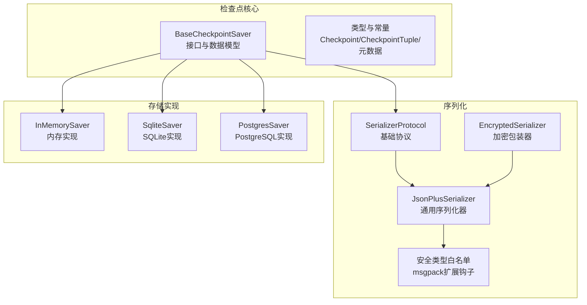
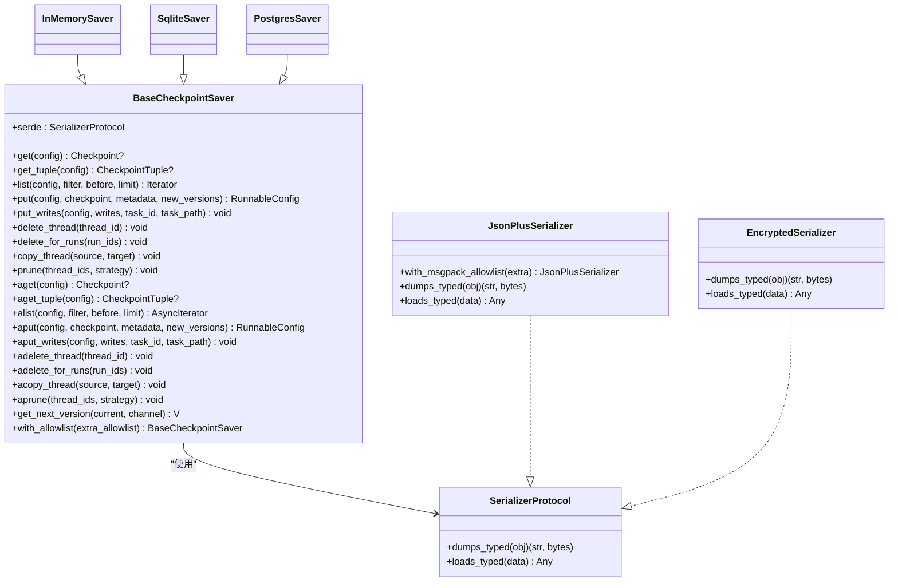
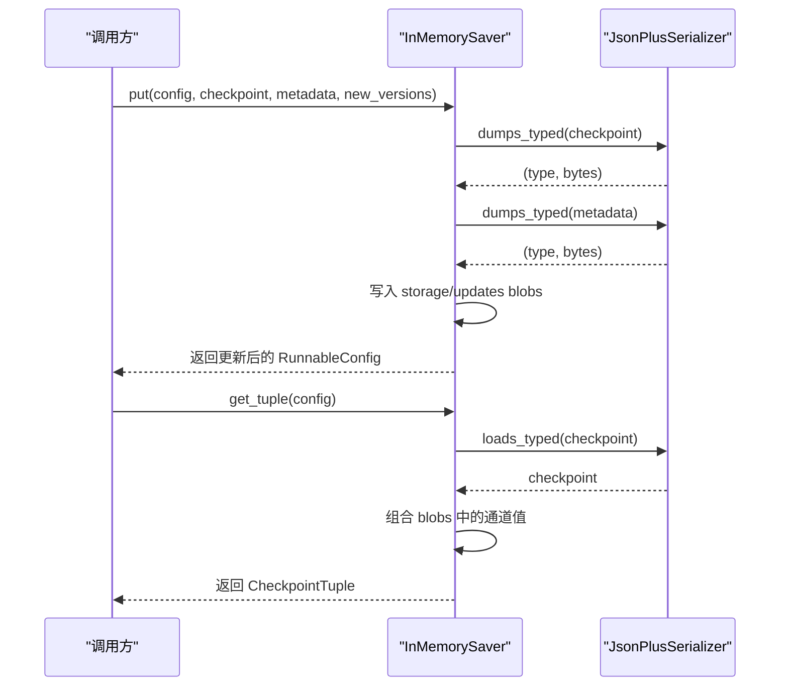
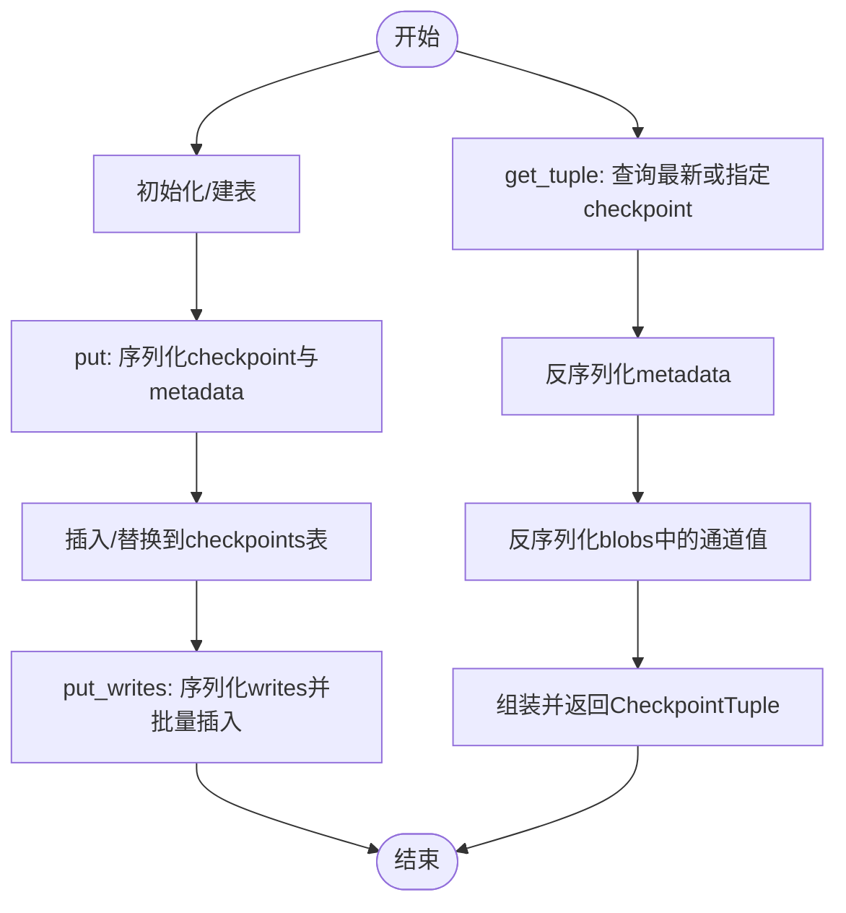
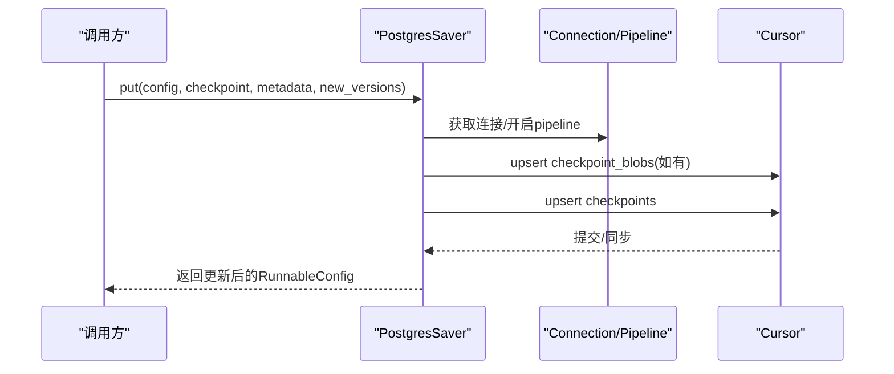
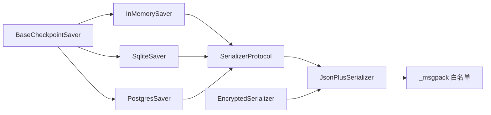

# 自定义检查点实现

<cite>
**本文档引用的文件**
- [libs/checkpoint/langgraph/checkpoint/base/__init__.py](file://libs/checkpoint/langgraph/checkpoint/base/__init__.py)
- [libs/checkpoint/langgraph/checkpoint/memory/__init__.py](file://libs/checkpoint/langgraph/checkpoint/memory/__init__.py)
- [libs/checkpoint/langgraph/checkpoint/serde/base.py](file://libs/checkpoint/langgraph/checkpoint/serde/base.py)
- [libs/checkpoint/langgraph/checkpoint/serde/jsonplus.py](file://libs/checkpoint/langgraph/checkpoint/serde/jsonplus.py)
- [libs/checkpoint/langgraph/checkpoint/serde/encrypted.py](file://libs/checkpoint/langgraph/checkpoint/serde/encrypted.py)
- [libs/checkpoint/langgraph/checkpoint/serde/_msgpack.py](file://libs/checkpoint/langgraph/checkpoint/serde/_msgpack.py)
- [libs/checkpoint-postgres/langgraph/checkpoint/postgres/__init__.py](file://libs/checkpoint-postgres/langgraph/checkpoint/postgres/__init__.py)
- [libs/checkpoint-sqlite/langgraph/checkpoint/sqlite/__init__.py](file://libs/checkpoint-sqlite/langgraph/checkpoint/sqlite/__init__.py)
</cite>

## 目录
1. [简介](#简介)
2. [项目结构](#项目结构)
3. [核心组件](#核心组件)
4. [架构总览](#架构总览)
5. [详细组件分析](#详细组件分析)
6. [依赖关系分析](#依赖关系分析)
7. [性能考量](#性能考量)
8. [故障排查指南](#故障排查指南)
9. [结论](#结论)
10. [附录](#附录)

## 简介
本指南面向需要基于 BaseCheckpointSaver 接口开发自定义检查点存储后端的工程师。文档从接口方法签名、参数与返回值规范入手，结合内存与数据库实现示例，系统讲解自定义实现的开发步骤、序列化处理、并发控制与性能优化，并提供测试策略、调试技巧与部署注意事项。

## 项目结构
LangGraph 检查点子模块位于 libs/checkpoint 及其周边扩展（如 postgres/sqlite）。核心接口与数据模型在 base 模块中定义；具体存储实现分别在 memory、sqlite、postgres 等模块中提供；序列化体系由 serde 子模块统一管理。

图表来源
- [libs/checkpoint/langgraph/checkpoint/base/__init__.py:122-480](file://libs/checkpoint/langgraph/checkpoint/base/__init__.py#L122-L480)
- [libs/checkpoint/langgraph/checkpoint/memory/__init__.py:31-122](file://libs/checkpoint/langgraph/checkpoint/memory/__init__.py#L31-L122)
- [libs/checkpoint/langgraph/checkpoint/serde/base.py:6-65](file://libs/checkpoint/langgraph/checkpoint/serde/base.py#L6-L65)
- [libs/checkpoint/langgraph/checkpoint/serde/jsonplus.py:50-261](file://libs/checkpoint/langgraph/checkpoint/serde/jsonplus.py#L50-L261)
- [libs/checkpoint/langgraph/checkpoint/serde/encrypted.py:8-81](file://libs/checkpoint/langgraph/checkpoint/serde/encrypted.py#L8-L81)
- [libs/checkpoint/langgraph/checkpoint/serde/_msgpack.py:14-86](file://libs/checkpoint/langgraph/checkpoint/serde/_msgpack.py#L14-L86)
- [libs/checkpoint-postgres/langgraph/checkpoint/postgres/__init__.py:32-476](file://libs/checkpoint-postgres/langgraph/checkpoint/postgres/__init__.py#L32-L476)
- [libs/checkpoint-sqlite/langgraph/checkpoint/sqlite/__init__.py:38-557](file://libs/checkpoint-sqlite/langgraph/checkpoint/sqlite/__init__.py#L38-L557)

章节来源
- [libs/checkpoint/langgraph/checkpoint/base/__init__.py:122-480](file://libs/checkpoint/langgraph/checkpoint/base/__init__.py#L122-L480)
- [libs/checkpoint/langgraph/checkpoint/memory/__init__.py:31-122](file://libs/checkpoint/langgraph/checkpoint/memory/__init__.py#L31-L122)
- [libs/checkpoint/langgraph/checkpoint/serde/base.py:6-65](file://libs/checkpoint/langgraph/checkpoint/serde/base.py#L6-L65)
- [libs/checkpoint/langgraph/checkpoint/serde/jsonplus.py:50-261](file://libs/checkpoint/langgraph/checkpoint/serde/jsonplus.py#L50-L261)
- [libs/checkpoint/langgraph/checkpoint/serde/encrypted.py:8-81](file://libs/checkpoint/langgraph/checkpoint/serde/encrypted.py#L8-L81)
- [libs/checkpoint/langgraph/checkpoint/serde/_msgpack.py:14-86](file://libs/checkpoint/langgraph/checkpoint/serde/_msgpack.py#L14-L86)
- [libs/checkpoint-postgres/langgraph/checkpoint/postgres/__init__.py:32-476](file://libs/checkpoint-postgres/langgraph/checkpoint/postgres/__init__.py#L32-L476)
- [libs/checkpoint-sqlite/langgraph/checkpoint/sqlite/__init__.py:38-557](file://libs/checkpoint-sqlite/langgraph/checkpoint/sqlite/__init__.py#L38-L557)

## 核心组件
- BaseCheckpointSaver：定义检查点存取的完整接口，包括同步与异步方法族、版本生成、配置扩展等。
- Checkpoint/CheckpointTuple：检查点数据结构与上下文封装。
- SerializerProtocol：统一的序列化协议，支持 typed dumps/loads 与可选加密包装。
- JsonPlusSerializer：基于 ormsgpack 的高性能序列化器，内置安全白名单与回退机制。
- InMemorySaver：最小可用内存实现，便于理解接口契约与数据流转。
- SqliteSaver/PostgresSaver：生产级持久化实现，展示并发控制、事务与批量写入策略。

章节来源
- [libs/checkpoint/langgraph/checkpoint/base/__init__.py:122-480](file://libs/checkpoint/langgraph/checkpoint/base/__init__.py#L122-L480)
- [libs/checkpoint/langgraph/checkpoint/serde/base.py:6-65](file://libs/checkpoint/langgraph/checkpoint/serde/base.py#L6-L65)
- [libs/checkpoint/langgraph/checkpoint/serde/jsonplus.py:50-261](file://libs/checkpoint/langgraph/checkpoint/serde/jsonplus.py#L50-L261)
- [libs/checkpoint/langgraph/checkpoint/memory/__init__.py:31-122](file://libs/checkpoint/langgraph/checkpoint/memory/__init__.py#L31-L122)
- [libs/checkpoint-sqlite/langgraph/checkpoint/sqlite/__init__.py:38-557](file://libs/checkpoint-sqlite/langgraph/checkpoint/sqlite/__init__.py#L38-L557)
- [libs/checkpoint-postgres/langgraph/checkpoint/postgres/__init__.py:32-476](file://libs/checkpoint-postgres/langgraph/checkpoint/postgres/__init__.py#L32-L476)

## 架构总览
下图展示了检查点接口与实现之间的交互关系，以及序列化层在其中的作用。

图表来源
- [libs/checkpoint/langgraph/checkpoint/base/__init__.py:122-480](file://libs/checkpoint/langgraph/checkpoint/base/__init__.py#L122-L480)
- [libs/checkpoint/langgraph/checkpoint/serde/base.py:6-65](file://libs/checkpoint/langgraph/checkpoint/serde/base.py#L6-L65)
- [libs/checkpoint/langgraph/checkpoint/serde/jsonplus.py:50-261](file://libs/checkpoint/langgraph/checkpoint/serde/jsonplus.py#L50-L261)
- [libs/checkpoint/langgraph/checkpoint/serde/encrypted.py:8-81](file://libs/checkpoint/langgraph/checkpoint/serde/encrypted.py#L8-L81)
- [libs/checkpoint/langgraph/checkpoint/memory/__init__.py:31-122](file://libs/checkpoint/langgraph/checkpoint/memory/__init__.py#L31-L122)
- [libs/checkpoint-sqlite/langgraph/checkpoint/sqlite/__init__.py:38-557](file://libs/checkpoint-sqlite/langgraph/checkpoint/sqlite/__init__.py#L38-L557)
- [libs/checkpoint-postgres/langgraph/checkpoint/postgres/__init__.py:32-476](file://libs/checkpoint-postgres/langgraph/checkpoint/postgres/__init__.py#L32-L476)

## 详细组件分析

### 接口方法与数据模型
- 方法族概览
  - 同步：get/get_tuple/list/put/put_writes/delete_thread/delete_for_runs/copy_thread/prune
  - 异步：aget/aget_tuple/alist/aput/aput_writes/adelete_thread/adelete_for_runs/acopy_thread/aprune
  - 版本生成：get_next_version
  - 配置扩展：config_specs
  - 序列化增强：with_allowlist
- 关键参数与返回值
  - config: RunnableConfig，包含 thread_id、checkpoint_ns、checkpoint_id 等
  - checkpoint: Checkpoint，包含版本号、时间戳、通道值、通道版本、节点可见版本映射等
  - metadata: CheckpointMetadata，包含来源、步数、父检查点映射、运行ID等
  - new_versions: ChannelVersions，记录本次写入涉及的通道新版本
  - 返回值：get 返回 Checkpoint 或 None；put 返回更新后的 RunnableConfig；list 返回迭代器；异步版本对应返回异步迭代器或协程结果

章节来源
- [libs/checkpoint/langgraph/checkpoint/base/__init__.py:173-480](file://libs/checkpoint/langgraph/checkpoint/base/__init__.py#L173-L480)

### 序列化与安全
- SerializerProtocol：要求实现 dumps_typed/loads_typed，支持带类型的序列化以提升兼容性与安全性
- JsonPlusSerializer：默认序列化器，优先使用 ormsgpack，失败时可回退 pickle；支持构造器反序列化白名单与 msgpack 扩展钩子
- EncryptedSerializer：对任意 SerializerProtocol 进行加密包装，按需启用
- 安全白名单：通过 msgpack 扩展类型与允许的方法集合限制反序列化对象范围

章节来源
- [libs/checkpoint/langgraph/checkpoint/serde/base.py:6-65](file://libs/checkpoint/langgraph/checkpoint/serde/base.py#L6-L65)
- [libs/checkpoint/langgraph/checkpoint/serde/jsonplus.py:50-261](file://libs/checkpoint/langgraph/checkpoint/serde/jsonplus.py#L50-L261)
- [libs/checkpoint/langgraph/checkpoint/serde/encrypted.py:8-81](file://libs/checkpoint/langgraph/checkpoint/serde/encrypted.py#L8-L81)
- [libs/checkpoint/langgraph/checkpoint/serde/_msgpack.py:14-86](file://libs/checkpoint/langgraph/checkpoint/serde/_msgpack.py#L14-L86)

### 内存实现（InMemorySaver）
- 数据结构
  - storage：线程ID -> 命名空间 -> 检查点ID -> (checkpoint, metadata, parent_checkpoint_id)
  - writes：(线程ID, 命名空间, 检查点ID) -> (task_id, idx) -> (task_id, channel, value, path)
  - blobs：(线程ID, 命名空间, 通道, 版本) -> (type, bytes)
- 并发控制：使用线程锁与上下文管理器确保多线程安全
- 版本生成：字符串版本，保证单调递增
- 典型流程：put 将 checkpoint 与 metadata 序列化后写入 storage，同时将非内联的通道值写入 blobs；get_tuple 从 storage 与 blobs 组合出完整 CheckpointTuple

图表来源
- [libs/checkpoint/langgraph/checkpoint/memory/__init__.py:135-215](file://libs/checkpoint/langgraph/checkpoint/memory/__init__.py#L135-L215)
- [libs/checkpoint/langgraph/checkpoint/memory/__init__.py:326-370](file://libs/checkpoint/langgraph/checkpoint/memory/__init__.py#L326-L370)
- [libs/checkpoint/langgraph/checkpoint/serde/jsonplus.py:228-261](file://libs/checkpoint/langgraph/checkpoint/serde/jsonplus.py#L228-L261)

章节来源
- [libs/checkpoint/langgraph/checkpoint/memory/__init__.py:31-122](file://libs/checkpoint/langgraph/checkpoint/memory/__init__.py#L31-L122)
- [libs/checkpoint/langgraph/checkpoint/memory/__init__.py:135-215](file://libs/checkpoint/langgraph/checkpoint/memory/__init__.py#L135-L215)
- [libs/checkpoint/langgraph/checkpoint/memory/__init__.py:326-370](file://libs/checkpoint/langgraph/checkpoint/memory/__init__.py#L326-L370)

### SQLite 实现（SqliteSaver）
- 并发控制：使用线程锁包裹连接与事务，确保多线程安全
- 表结构：checkpoints（主键：thread_id, checkpoint_ns, checkpoint_id），writes（主键：thread_id, checkpoint_ns, checkpoint_id, task_id, idx）
- 写入策略：put 将 checkpoint 与 metadata 以 typed 字节写入；put_writes 支持批量插入，区分常规写入与特殊写入索引
- 查询策略：get_tuple/list 支持过滤、分页与“早于某检查点ID”的条件

图表来源
- [libs/checkpoint-sqlite/langgraph/checkpoint/sqlite/__init__.py:122-160](file://libs/checkpoint-sqlite/langgraph/checkpoint/sqlite/__init__.py#L122-L160)
- [libs/checkpoint-sqlite/langgraph/checkpoint/sqlite/__init__.py:380-436](file://libs/checkpoint-sqlite/langgraph/checkpoint/sqlite/__init__.py#L380-L436)
- [libs/checkpoint-sqlite/langgraph/checkpoint/sqlite/__init__.py:438-475](file://libs/checkpoint-sqlite/langgraph/checkpoint/sqlite/__init__.py#L438-L475)

章节来源
- [libs/checkpoint-sqlite/langgraph/checkpoint/sqlite/__init__.py:38-557](file://libs/checkpoint-sqlite/langgraph/checkpoint/sqlite/__init__.py#L38-L557)

### PostgreSQL 实现（PostgresSaver）
- 并发控制：使用线程锁保护连接与游标；支持 Pipeline 与事务模式，提升吞吐
- 表结构：checkpoints、checkpoint_blobs、checkpoint_writes；通过 Jsonb 存储 checkpoint 与 metadata
- 写入策略：put 将内联简单值直接写入 checkpoints，复杂值写入 checkpoint_blobs；put_writes 支持批量 upsert/insert
- 查询策略：list/get_tuple 支持过滤、分页与迁移 pending_sends 字段

图表来源
- [libs/checkpoint-postgres/langgraph/checkpoint/postgres/__init__.py:32-476](file://libs/checkpoint-postgres/langgraph/checkpoint/postgres/__init__.py#L32-L476)
- [libs/checkpoint-postgres/langgraph/checkpoint/postgres/__init__.py:255-334](file://libs/checkpoint-postgres/langgraph/checkpoint/postgres/__init__.py#L255-L334)

章节来源
- [libs/checkpoint-postgres/langgraph/checkpoint/postgres/__init__.py:32-476](file://libs/checkpoint-postgres/langgraph/checkpoint/postgres/__init__.py#L32-L476)

### 开发步骤与最佳实践
- 继承与职责
  - 继承 BaseCheckpointSaver，至少实现 get_tuple、list、put、put_writes、delete_thread、delete_for_runs、copy_thread、prune 等核心方法
  - 若需要异步支持，实现对应的 aget_* / alist / aput_* / adelete_* / acopy_* / aprune_* 方法
- 序列化处理
  - 使用 serde.dumps_typed/loads_typed 处理所有持久化对象，避免直接序列化用户数据
  - 对于复杂对象，优先使用 JsonPlusSerializer；必要时通过 with_allowlist 控制允许的类型
  - 如需加密，使用 EncryptedSerializer 包装底层 serde
- 并发控制
  - 在多线程环境中使用锁或连接池隔离；参考 SqliteSaver/PostgresSaver 的锁与事务模式
  - 对批量写入使用事务或管道（Pipeline）提升一致性与性能
- 性能优化
  - 仅序列化必要的通道值；将大对象或非内联对象放入独立 blobs 表/分区
  - 使用批量操作（executemany/管道）减少往返次数
  - 合理设置分页与过滤条件，避免全表扫描
- 错误处理
  - 明确区分 NotImplmentedError 与业务异常；对序列化失败、连接异常进行分类处理
  - 对外暴露清晰的错误信息，避免泄露内部实现细节

章节来源
- [libs/checkpoint/langgraph/checkpoint/base/__init__.py:173-480](file://libs/checkpoint/langgraph/checkpoint/base/__init__.py#L173-L480)
- [libs/checkpoint/langgraph/checkpoint/serde/jsonplus.py:89-119](file://libs/checkpoint/langgraph/checkpoint/serde/jsonplus.py#L89-L119)
- [libs/checkpoint/langgraph/checkpoint/serde/encrypted.py:8-81](file://libs/checkpoint/langgraph/checkpoint/serde/encrypted.py#L8-L81)
- [libs/checkpoint-sqlite/langgraph/checkpoint/sqlite/__init__.py:161-182](file://libs/checkpoint-sqlite/langgraph/checkpoint/sqlite/__init__.py#L161-L182)
- [libs/checkpoint-postgres/langgraph/checkpoint/postgres/__init__.py:393-431](file://libs/checkpoint-postgres/langgraph/checkpoint/postgres/__init__.py#L393-L431)

## 依赖关系分析
- 接口与实现解耦：BaseCheckpointSaver 与具体存储实现通过 SerializerProtocol 解耦
- 序列化层复用：JsonPlusSerializer/EncryptedSerializer 可被多种存储实现共享
- 外部依赖：SQLite 使用 sqlite3，PostgreSQL 使用 psycopg/psycopg_pool，内存实现无外部依赖

图表来源
- [libs/checkpoint/langgraph/checkpoint/base/__init__.py:122-480](file://libs/checkpoint/langgraph/checkpoint/base/__init__.py#L122-L480)
- [libs/checkpoint/langgraph/checkpoint/serde/base.py:6-65](file://libs/checkpoint/langgraph/checkpoint/serde/base.py#L6-L65)
- [libs/checkpoint/langgraph/checkpoint/serde/jsonplus.py:50-261](file://libs/checkpoint/langgraph/checkpoint/serde/jsonplus.py#L50-L261)
- [libs/checkpoint/langgraph/checkpoint/serde/_msgpack.py:14-86](file://libs/checkpoint/langgraph/checkpoint/serde/_msgpack.py#L14-L86)
- [libs/checkpoint/langgraph/checkpoint/serde/encrypted.py:8-81](file://libs/checkpoint/langgraph/checkpoint/serde/encrypted.py#L8-L81)
- [libs/checkpoint/langgraph/checkpoint/memory/__init__.py:31-122](file://libs/checkpoint/langgraph/checkpoint/memory/__init__.py#L31-L122)
- [libs/checkpoint-sqlite/langgraph/checkpoint/sqlite/__init__.py:38-557](file://libs/checkpoint-sqlite/langgraph/checkpoint/sqlite/__init__.py#L38-L557)
- [libs/checkpoint-postgres/langgraph/checkpoint/postgres/__init__.py:32-476](file://libs/checkpoint-postgres/langgraph/checkpoint/postgres/__init__.py#L32-L476)

章节来源
- [libs/checkpoint/langgraph/checkpoint/base/__init__.py:122-480](file://libs/checkpoint/langgraph/checkpoint/base/__init__.py#L122-L480)
- [libs/checkpoint/langgraph/checkpoint/serde/base.py:6-65](file://libs/checkpoint/langgraph/checkpoint/serde/base.py#L6-L65)
- [libs/checkpoint/langgraph/checkpoint/serde/jsonplus.py:50-261](file://libs/checkpoint/langgraph/checkpoint/serde/jsonplus.py#L50-L261)
- [libs/checkpoint/langgraph/checkpoint/serde/_msgpack.py:14-86](file://libs/checkpoint/langgraph/checkpoint/serde/_msgpack.py#L14-L86)
- [libs/checkpoint/langgraph/checkpoint/serde/encrypted.py:8-81](file://libs/checkpoint/langgraph/checkpoint/serde/encrypted.py#L8-L81)
- [libs/checkpoint/langgraph/checkpoint/memory/__init__.py:31-122](file://libs/checkpoint/langgraph/checkpoint/memory/__init__.py#L31-L122)
- [libs/checkpoint-sqlite/langgraph/checkpoint/sqlite/__init__.py:38-557](file://libs/checkpoint-sqlite/langgraph/checkpoint/sqlite/__init__.py#L38-L557)
- [libs/checkpoint-postgres/langgraph/checkpoint/postgres/__init__.py:32-476](file://libs/checkpoint-postgres/langgraph/checkpoint/postgres/__init__.py#L32-L476)

## 性能考量
- 序列化成本：优先使用 ormsgpack；对频繁写入的简单类型避免不必要的复杂序列化
- I/O 批量化：批量写入 checkpoints/writes/blobs，减少网络/磁盘往返
- 并发与锁粒度：尽量缩小临界区；对只读查询避免持有全局锁
- 索引与查询：为 thread_id、checkpoint_ns、checkpoint_id 建立合适索引；限制返回条目数量
- 版本管理：合理设计版本号生成策略，避免热点冲突

## 故障排查指南
- 常见问题
  - 序列化失败：检查 serde 配置与 allowlist；确认对象是否在白名单内
  - 并发冲突：确认锁使用是否正确；避免跨连接共享游标
  - 数据不一致：检查事务边界与批量提交时机
- 调试技巧
  - 打印序列化前后的字节长度与类型，定位异常对象
  - 在 put_writes 中记录 task_id 与 idx，便于回溯中间状态
  - 使用最小化配置复现问题，逐步排除环境因素
- 部署注意事项
  - 生产环境优先选择 PostgreSQL/MySQL 等持久化存储
  - 配置连接池与超时参数，监控慢查询
  - 对敏感数据启用 EncryptedSerializer 并妥善管理密钥

章节来源
- [libs/checkpoint/langgraph/checkpoint/serde/jsonplus.py:192-226](file://libs/checkpoint/langgraph/checkpoint/serde/jsonplus.py#L192-L226)
- [libs/checkpoint/langgraph/checkpoint/serde/encrypted.py:8-81](file://libs/checkpoint/langgraph/checkpoint/serde/encrypted.py#L8-L81)
- [libs/checkpoint-postgres/langgraph/checkpoint/postgres/__init__.py:393-431](file://libs/checkpoint-postgres/langgraph/checkpoint/postgres/__init__.py#L393-L431)
- [libs/checkpoint-sqlite/langgraph/checkpoint/sqlite/__init__.py:161-182](file://libs/checkpoint-sqlite/langgraph/checkpoint/sqlite/__init__.py#L161-L182)

## 结论
通过遵循 BaseCheckpointSaver 接口契约、采用安全可靠的序列化策略、实施合理的并发与性能优化，可以快速构建稳定高效的自定义检查点存储后端。建议以内存实现作为原型，再逐步迁移到 SQLite/PostgreSQL 等持久化存储，并配套完善的测试与监控体系。

## 附录
- 测试策略
  - 单元测试：覆盖 get/get_tuple/put/put_writes/list/delete_thread/copy_thread/prune 等方法
  - 并发测试：多线程/多协程并发写入与读取，验证锁与事务正确性
  - 序列化测试：覆盖复杂对象、嵌套结构、异常对象与白名单边界
  - 回归测试：版本升级与迁移逻辑验证
- 集成与兼容性
  - 保持与 RunnableConfig 的字段兼容（thread_id/checkpoint_ns/checkpoint_id）
  - 与现有 serde 体系无缝对接，支持 JsonPlusSerializer/EncryptedSerializer
  - 对外暴露一致的异常与日志，便于运维与排障