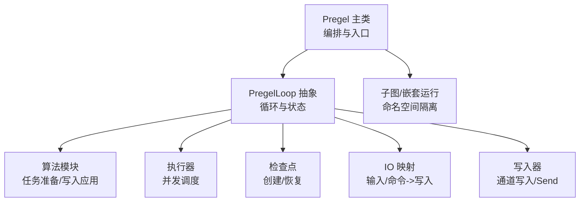
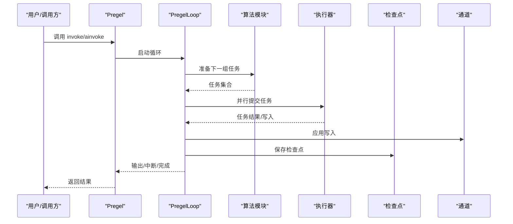
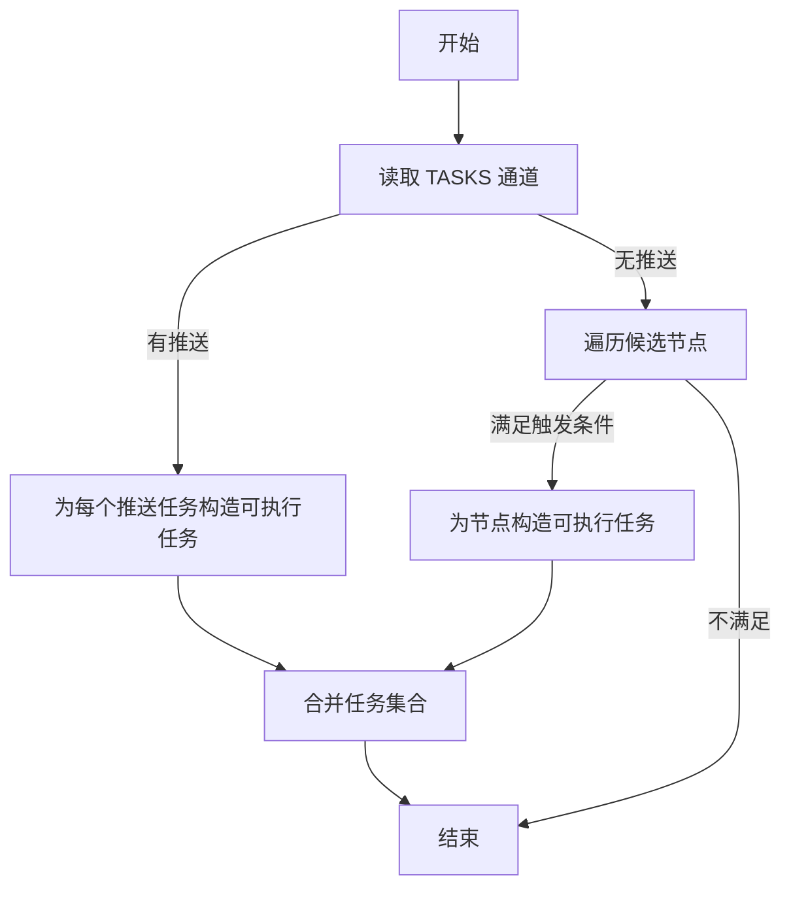
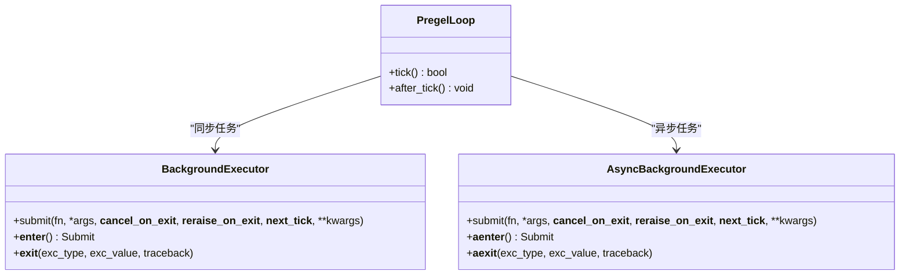
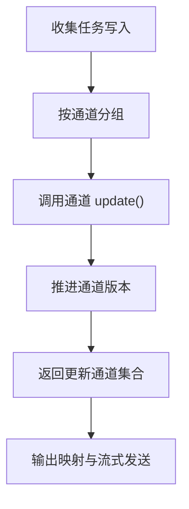
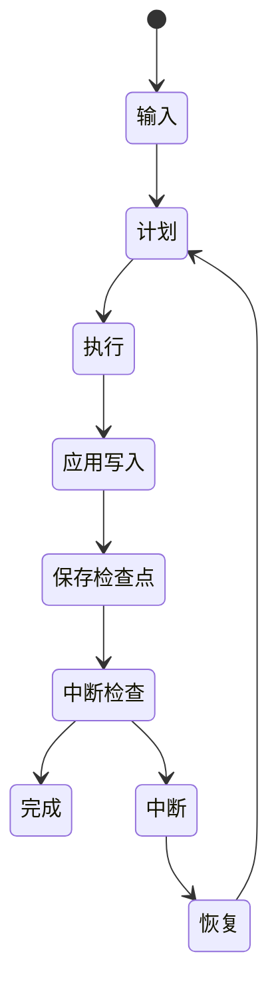
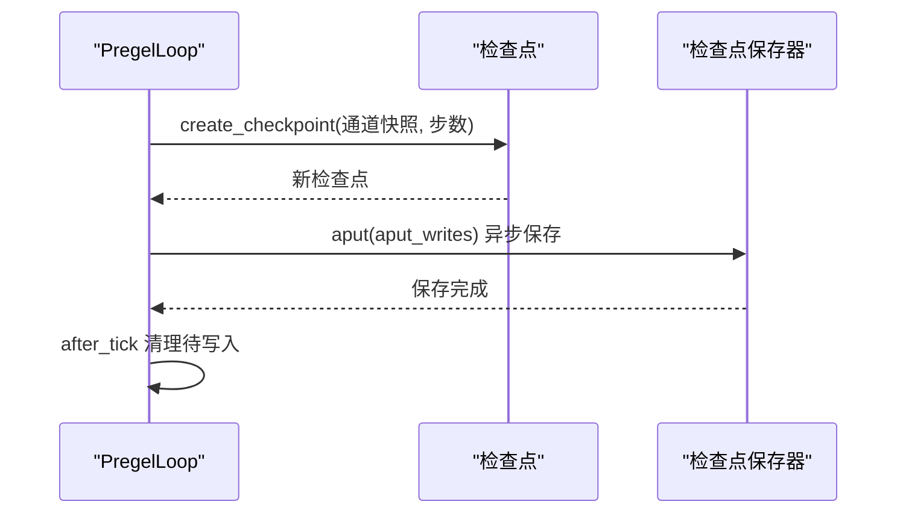
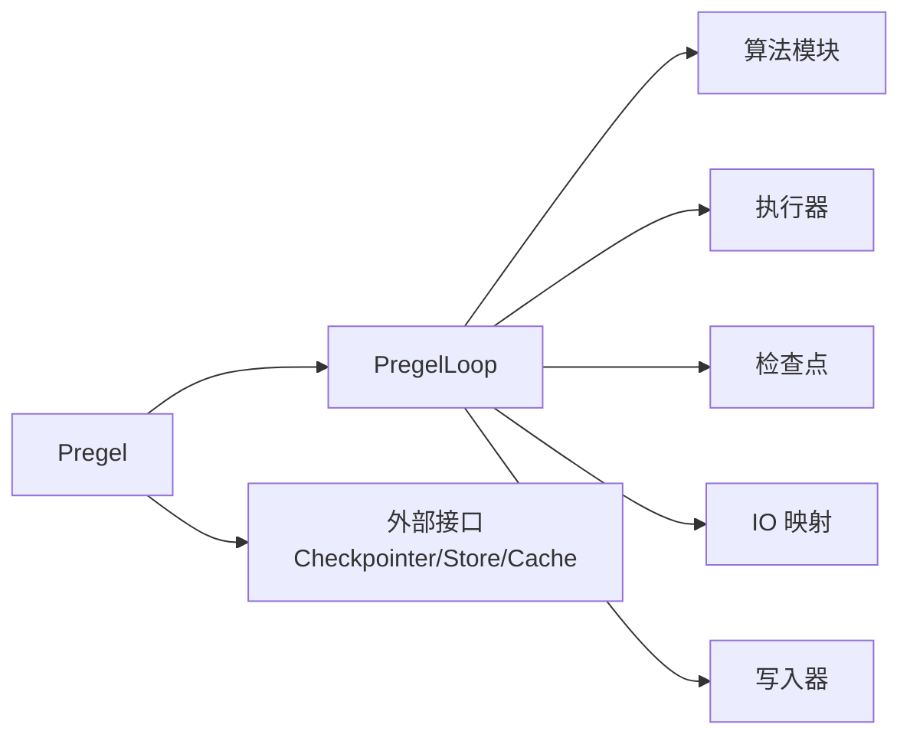

# Pregel 执行引擎

<cite>
**本文档引用的文件**
- [libs/langgraph/langgraph/pregel/main.py](file://libs/langgraph/langgraph/pregel/main.py)
- [libs/langgraph/langgraph/pregel/_loop.py](file://libs/langgraph/langgraph/pregel/_loop.py)
- [libs/langgraph/langgraph/pregel/_algo.py](file://libs/langgraph/langgraph/pregel/_algo.py)
- [libs/langgraph/langgraph/pregel/_checkpoint.py](file://libs/langgraph/langgraph/pregel/_checkpoint.py)
- [libs/langgraph/langgraph/pregel/_executor.py](file://libs/langgraph/langgraph/pregel/_executor.py)
- [libs/langgraph/langgraph/pregel/_write.py](file://libs/langgraph/langgraph/pregel/_write.py)
- [libs/langgraph/langgraph/pregel/_io.py](file://libs/langgraph/langgraph/pregel/_io.py)
- [libs/langgraph/langgraph/pregel/_runner.py](file://libs/langgraph/langgraph/pregel/_runner.py)
- [libs/langgraph/langgraph/pregel/__init__.py](file://libs/langgraph/langgraph/pregel/__init__.py)
- [libs/langgraph/tests/test_pregel_async.py](file://libs/langgraph/tests/test_pregel_async.py)
- [libs/langgraph/tests/test_pregel.py](file://libs/langgraph/tests/test_pregel.py)
</cite>

## 目录
1. [简介](#简介)
2. [项目结构](#项目结构)
3. [核心组件](#核心组件)
4. [架构总览](#架构总览)
5. [详细组件分析](#详细组件分析)
6. [依赖分析](#依赖分析)
7. [性能考虑](#性能考虑)
8. [故障排查指南](#故障排查指南)
9. [结论](#结论)
10. [附录](#附录)

## 简介
本文件系统性阐述 LangGraph 中 Pregel 执行引擎的设计与实现，覆盖任务调度机制、并行执行策略、状态更新协调、循环处理逻辑、检查点机制及其在执行过程中的作用（状态保存、恢复点设置、故障恢复），并提供完整的执行流程图与状态转换图，帮助读者从高层到代码级全面理解 Pregel 的工作机制。

## 项目结构
Pregel 执行引擎位于 langgraph 的 pregel 子模块中，主要由以下层次构成：
- 入口与编排：Pregel 类负责构建与编排执行循环，暴露同步/异步调用接口，并协调检查点、缓存、存储等基础设施。
- 循环与调度：SyncPregelLoop/AsyncPregelLoop 实现每步的计划、执行、更新三阶段循环，维护任务集合、状态与中断点。
- 算法与任务：prepare_next_tasks/prepare_single_task 等函数负责工作队列管理、任务分配、触发节点选择与版本控制。
- 写入与通道：ChannelWrite/ChannelWriteEntry 将节点输出写入通道或发送子任务；apply_writes 统一应用写入并推进版本。
- 检查点：empty_checkpoint/create_checkpoint/channels_from_checkpoint 提供检查点的创建、复制与恢复。
- 并发与执行：BackgroundExecutor/AsyncBackgroundExecutor 提供线程池与事件循环并发调度，支持信号量限流与异常传播。
- 输入/命令映射：map_input/map_command 将外部输入与命令映射为待写入序列，驱动状态变更。

图表来源
- [libs/langgraph/langgraph/pregel/main.py](file://libs/langgraph/langgraph/pregel/main.py)
- [libs/langgraph/langgraph/pregel/_loop.py](file://libs/langgraph/langgraph/pregel/_loop.py)
- [libs/langgraph/langgraph/pregel/_algo.py](file://libs/langgraph/langgraph/pregel/_algo.py)
- [libs/langgraph/langgraph/pregel/_checkpoint.py](file://libs/langgraph/langgraph/pregel/_checkpoint.py)
- [libs/langgraph/langgraph/pregel/_executor.py](file://libs/langgraph/langgraph/pregel/_executor.py)
- [libs/langgraph/langgraph/pregel/_io.py](file://libs/langgraph/langgraph/pregel/_io.py)
- [libs/langgraph/langgraph/pregel/_write.py](file://libs/langgraph/langgraph/pregel/_write.py)

章节来源
- [libs/langgraph/langgraph/pregel/main.py](file://libs/langgraph/langgraph/pregel/main.py)
- [libs/langgraph/langgraph/pregel/_loop.py](file://libs/langgraph/langgraph/pregel/_loop.py)

## 核心组件
- Pregel：高层编排器，负责节点定义、通道规格、输入/输出通道、检查点、缓存、重试策略、流模式等配置，并在同步/异步路径下启动循环。
- PregelLoop（抽象）：封装单步循环的生命周期，包括准备任务、执行、应用写入、输出、检查点保存与中断判定。
- 算法模块：prepare_next_tasks/prepare_single_task 负责根据当前版本与触发映射确定下一步要执行的任务集；apply_writes 统一将任务写入应用到通道与检查点。
- 写入器：ChannelWrite/ChannelWriteEntry 将节点输出转换为写入元组，支持跳过空值、映射器、直接发送子任务（Send）。
- 检查点：empty_checkpoint/create_checkpoint/channels_from_checkpoint 提供检查点的生成、复制与从检查点重建通道。
- 执行器：BackgroundExecutor/AsyncBackgroundExecutor 提供线程池与事件循环的后台任务提交、取消、异常聚合与并发限制。
- IO 映射：map_input/map_command 将用户输入与命令转换为待写入序列，驱动状态推进。

章节来源
- [libs/langgraph/langgraph/pregel/main.py](file://libs/langgraph/langgraph/pregel/main.py)
- [libs/langgraph/langgraph/pregel/_algo.py](file://libs/langgraph/langgraph/pregel/_algo.py)
- [libs/langgraph/langgraph/pregel/_write.py](file://libs/langgraph/langgraph/pregel/_write.py)
- [libs/langgraph/langgraph/pregel/_checkpoint.py](file://libs/langgraph/langgraph/pregel/_checkpoint.py)
- [libs/langgraph/langgraph/pregel/_executor.py](file://libs/langgraph/langgraph/pregel/_executor.py)
- [libs/langgraph/langgraph/pregel/_io.py](file://libs/langgraph/langgraph/pregel/_io.py)

## 架构总览
Pregel 的执行遵循 Bulk Synchronous Parallel（BSP）范式，每步分为三个阶段：
- 计划（Plan）：基于当前通道版本与触发映射，确定下一步可执行的节点与推送任务（Send）。
- 执行（Execute）：并行执行选定任务，期间通道更新对本轮之外的任务不可见。
- 更新（Update）：将本轮任务写入统一应用到通道与检查点，推进版本号，生成输出并保存检查点。

图表来源
- [libs/langgraph/langgraph/pregel/main.py](file://libs/langgraph/langgraph/pregel/main.py)
- [libs/langgraph/langgraph/pregel/_loop.py](file://libs/langgraph/langgraph/pregel/_loop.py)
- [libs/langgraph/langgraph/pregel/_algo.py](file://libs/langgraph/langgraph/pregel/_algo.py)
- [libs/langgraph/langgraph/pregel/_executor.py](file://libs/langgraph/langgraph/pregel/_executor.py)
- [libs/langgraph/langgraph/pregel/_checkpoint.py](file://libs/langgraph/langgraph/pregel/_checkpoint.py)

## 详细组件分析

### 任务调度与工作队列管理
- 任务准备
  - prepare_next_tasks 基于当前检查点版本与触发映射，优先消费 TASKS 通道上的推送任务（Send），再按候选节点集合决定拉取任务（PULL）。
  - prepare_single_task 为每个任务计算任务 ID、注入配置（回调、缓存键、检查点命名空间）、构造可执行任务对象。
- 触发优化
  - 若提供 updated_channels 与 trigger_to_nodes，则仅扫描被更新通道所触发的节点，避免全图遍历，提升大规模图的调度效率。
- 版本与幂等
  - 使用 checkpoint["channel_versions"] 与 next_version 推进通道版本，确保写入幂等与可见性边界。

图表来源
- [libs/langgraph/langgraph/pregel/_algo.py](file://libs/langgraph/langgraph/pregel/_algo.py)

章节来源
- [libs/langgraph/langgraph/pregel/_algo.py](file://libs/langgraph/langgraph/pregel/_algo.py)

### 并行执行策略与并发控制
- 同步执行器：BackgroundExecutor 使用线程池提交任务，支持在退出时取消未开始任务、等待完成、按需重新抛出异常。
- 异步执行器：AsyncBackgroundExecutor 使用事件循环与 asyncio.Semaphore 控制最大并发度，支持惰性调度到下一 tick，保证本轮写入先提交。
- 回调与上下文：执行器通过 copy_context/run_coroutine_threadsafe 传递上下文，确保回调链路正确。

图表来源
- [libs/langgraph/langgraph/pregel/_executor.py](file://libs/langgraph/langgraph/pregel/_executor.py)
- [libs/langgraph/langgraph/pregel/_loop.py](file://libs/langgraph/langgraph/pregel/_loop.py)

章节来源
- [libs/langgraph/langgraph/pregel/_executor.py](file://libs/langgraph/langgraph/pregel/_executor.py)
- [libs/langgraph/langgraph/pregel/_loop.py](file://libs/langgraph/langgraph/pregel/_loop.py)

### 状态更新协调与写入应用
- 写入装配：ChannelWrite 将节点输出转换为 (channel, value) 元组，支持 PASSTHROUGH、skip_none、mapper 等策略；Send 被转换为向 TASKS 通道写入。
- 写入应用：apply_writes 将本轮所有任务的写入按通道分组，调用通道 update/consume 推进版本，返回本轮实际更新的通道集合，用于下一轮的触发优化。
- 输出映射：map_output_values/map_output_updates 将写入映射为输出事件，支持多通道聚合与缓存标记。

图表来源
- [libs/langgraph/langgraph/pregel/_write.py](file://libs/langgraph/langgraph/pregel/_write.py)
- [libs/langgraph/langgraph/pregel/_algo.py](file://libs/langgraph/langgraph/pregel/_algo.py)
- [libs/langgraph/langgraph/pregel/_io.py](file://libs/langgraph/langgraph/pregel/_io.py)

章节来源
- [libs/langgraph/langgraph/pregel/_write.py](file://libs/langgraph/langgraph/pregel/_write.py)
- [libs/langgraph/langgraph/pregel/_algo.py](file://libs/langgraph/langgraph/pregel/_algo.py)
- [libs/langgraph/langgraph/pregel/_io.py](file://libs/langgraph/langgraph/pregel/_io.py)

### 循环处理逻辑与中断
- 单步循环：tick() 完成计划、执行前中断检查、执行、应用写入、输出、保存检查点与执行后中断检查。
- 中断判定：should_interrupt 基于“自上次中断以来是否有通道更新”与“触发节点列表”判断是否中断。
- 恢复与重放：当存在检查点且输入为 None/Command 或同 run_id 重连时，进入恢复模式，丢弃旧的 RESUME 写入以避免陈旧值。

图表来源
- [libs/langgraph/langgraph/pregel/_loop.py](file://libs/langgraph/langgraph/pregel/_loop.py)
- [libs/langgraph/langgraph/pregel/_algo.py](file://libs/langgraph/langgraph/pregel/_algo.py)

章节来源
- [libs/langgraph/langgraph/pregel/_loop.py](file://libs/langgraph/langgraph/pregel/_loop.py)
- [libs/langgraph/langgraph/pregel/_algo.py](file://libs/langgraph/langgraph/pregel/_algo.py)

### 检查点机制与故障恢复
- 检查点结构：包含版本号、时间戳、通道值、通道版本、已见版本、更新通道列表等字段。
- 创建与复制：create_checkpoint 基于当前通道快照创建新检查点；copy_checkpoint 深拷贝检查点。
- 恢复与重放：channels_from_checkpoint 从检查点重建通道；循环在恢复模式下丢弃陈旧 RESUME 写入，确保中断后能重新触发。
- 写入持久化：put_writes 将写入异步提交给检查点保存器，支持带任务路径的写入；after_tick 清理待写入并保存检查点。

图表来源
- [libs/langgraph/langgraph/pregel/_checkpoint.py](file://libs/langgraph/langgraph/pregel/_checkpoint.py)
- [libs/langgraph/langgraph/pregel/_loop.py](file://libs/langgraph/langgraph/pregel/_loop.py)

章节来源
- [libs/langgraph/langgraph/pregel/_checkpoint.py](file://libs/langgraph/langgraph/pregel/_checkpoint.py)
- [libs/langgraph/langgraph/pregel/_loop.py](file://libs/langgraph/langgraph/pregel/_loop.py)

### 错误处理与重试策略
- 重试策略：PregelNode 支持节点级与全局 RetryPolicy，执行器在任务完成后按需重新抛出异常，保证错误可见性。
- 异常传播：GraphBubbleUp 作为中断信号不向上游重新抛出，避免干扰循环退出。
- 测试验证：测试用例覆盖了重试失败后不重复调用成功节点、恢复后写入合并等场景。

章节来源
- [libs/langgraph/langgraph/pregel/_executor.py](file://libs/langgraph/langgraph/pregel/_executor.py)
- [libs/langgraph/tests/test_pregel_async.py](file://libs/langgraph/tests/test_pregel_async.py)
- [libs/langgraph/tests/test_pregel.py](file://libs/langgraph/tests/test_pregel.py)

## 依赖分析
- 组件耦合
  - Pregel 依赖 Loop、算法、执行器、检查点、IO、写入器等模块，形成清晰的职责分离。
  - Loop 对算法与执行器强依赖，对检查点与通道弱依赖（通过配置注入）。
- 外部依赖
  - 通过 BaseCheckpointSaver、BaseStore、BaseCache 等接口解耦具体实现。
  - 使用 langchain_core 的回调管理与运行时配置。

图表来源
- [libs/langgraph/langgraph/pregel/main.py](file://libs/langgraph/langgraph/pregel/main.py)
- [libs/langgraph/langgraph/pregel/_loop.py](file://libs/langgraph/langgraph/pregel/_loop.py)
- [libs/langgraph/langgraph/pregel/_algo.py](file://libs/langgraph/langgraph/pregel/_algo.py)
- [libs/langgraph/langgraph/pregel/_executor.py](file://libs/langgraph/langgraph/pregel/_executor.py)
- [libs/langgraph/langgraph/pregel/_checkpoint.py](file://libs/langgraph/langgraph/pregel/_checkpoint.py)
- [libs/langgraph/langgraph/pregel/_io.py](file://libs/langgraph/langgraph/pregel/_io.py)
- [libs/langgraph/langgraph/pregel/_write.py](file://libs/langgraph/langgraph/pregel/_write.py)

## 性能考虑
- 触发优化：利用 updated_channels 与 trigger_to_nodes 缩小候选节点集合，降低大规模图的调度开销。
- 并发限制：通过 AsyncBackgroundExecutor 的信号量限制最大并发，避免资源争用；同步版本支持在退出时取消未开始任务。
- 写入批量化：put_writes 将待写入按任务聚合后批量提交，减少检查点写入次数。
- 缓存策略：节点级与全局 CachePolicy 可选，结合缓存键生成减少重复计算。
- 输出惰性：异步执行器支持将新任务调度到下一 tick，确保本轮写入先提交，降低输出延迟抖动。

## 故障排查指南
- 无输入错误：当输入为空且非恢复模式时抛出 EmptyInputError，检查输入通道与 Command 参数。
- 中断与恢复：多中断场景需显式指定中断 ID；恢复时若检查点映射存在，需确保 RESUME 写入被正确处理。
- 重试行为：确认 RetryPolicy 配置与节点级策略；注意 GraphBubbleUp 不会再次抛出，避免误判为成功。
- 写入冲突：避免向保留通道 TASKS 直接写入；使用 ChannelWriteEntry/Send 进行规范写入。
- 并发问题：在高并发下关注 Semaphore 设置与线程池大小，防止阻塞与饥饿。

章节来源
- [libs/langgraph/langgraph/pregel/_loop.py](file://libs/langgraph/langgraph/pregel/_loop.py)
- [libs/langgraph/langgraph/pregel/_write.py](file://libs/langgraph/langgraph/pregel/_write.py)
- [libs/langgraph/tests/test_pregel_async.py](file://libs/langgraph/tests/test_pregel_async.py)
- [libs/langgraph/tests/test_pregel.py](file://libs/langgraph/tests/test_pregel.py)

## 结论
Pregel 执行引擎通过清晰的循环三阶段模型、高效的触发优化、可靠的检查点机制与灵活的并发控制，实现了可扩展、可观测、可恢复的状态化执行。其设计既满足大规模图的性能需求，又提供了丰富的中断与恢复能力，适合构建长期运行、状态敏感的智能体与工作流系统。

## 附录
- 公开接口导出：Pregel 与 NodeBuilder 通过 __all__ 暴露，便于上层 API 使用。
- 示例参考：README 展示了 Pregel 的基本用法与特性，可作为入门示例。

章节来源
- [libs/langgraph/langgraph/pregel/__init__.py](file://libs/langgraph/langgraph/pregel/__init__.py)
- [README.md](file://README.md)