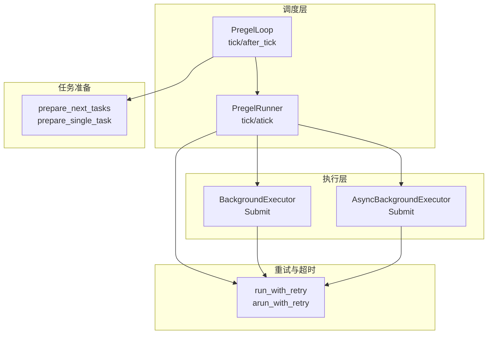
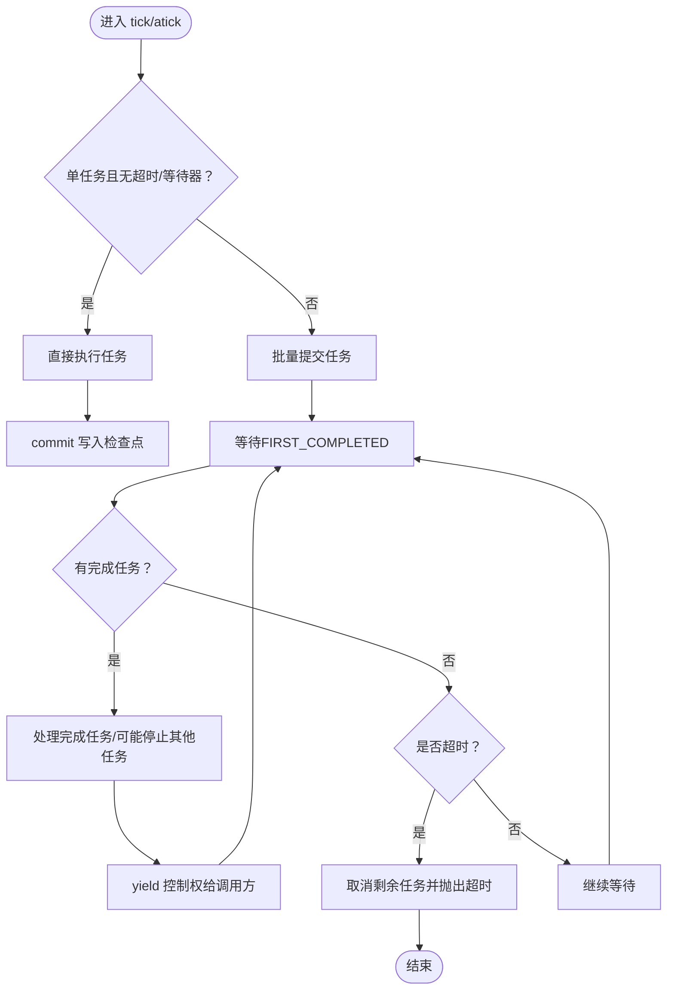
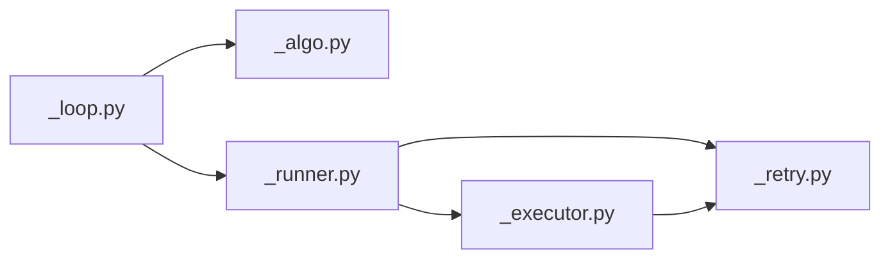

# 任务调度

<cite>
**本文引用的文件**
- [libs/langgraph/langgraph/pregel/_runner.py](file://libs/langgraph/langgraph/pregel/_runner.py)
- [libs/langgraph/langgraph/pregel/_loop.py](file://libs/langgraph/langgraph/pregel/_loop.py)
- [libs/langgraph/langgraph/pregel/_algo.py](file://libs/langgraph/langgraph/pregel/_algo.py)
- [libs/langgraph/langgraph/pregel/_executor.py](file://libs/langgraph/langgraph/pregel/_executor.py)
- [libs/langgraph/langgraph/pregel/_retry.py](file://libs/langgraph/langgraph/pregel/_retry.py)
- [libs/langgraph/tests/test_pregel_async.py](file://libs/langgraph/tests/test_pregel_async.py)
</cite>

## 目录
1. [引言](#引言)
2. [项目结构](#项目结构)
3. [核心组件](#核心组件)
4. [架构总览](#架构总览)
5. [详细组件分析](#详细组件分析)
6. [依赖分析](#依赖分析)
7. [性能考虑](#性能考虑)
8. [故障排查指南](#故障排查指南)
9. [结论](#结论)
10. [附录](#附录)

## 引言
本文件系统性阐述 LangGraph 中 Pregel 任务调度机制，覆盖任务队列管理、优先级与并发策略、PregelRunner 的实现原理（任务提交、执行监控、结果收集）、资源分配与负载均衡、死锁避免、超时处理、错误传播与异常恢复，并提供调度流程图与并发控制示例，帮助读者深入理解复杂任务管理逻辑。

## 项目结构
围绕 Pregel 调度的关键模块如下：
- 任务准备与生成：prepare_next_tasks / prepare_single_task
- 任务执行器：BackgroundExecutor / AsyncBackgroundExecutor
- 重试与超时：run_with_retry / arun_with_retry
- 调度器：PregelRunner（同步）与 PregelRunner.atick（异步）
- 主循环：PregelLoop.tick / after_tick
- 并发与限流：线程池/事件循环与信号量



图表来源
- [libs/langgraph/langgraph/pregel/_runner.py:122-271](file://libs/langgraph/langgraph/pregel/_runner.py#L122-L271)
- [libs/langgraph/langgraph/pregel/_loop.py:461-538](file://libs/langgraph/langgraph/pregel/_loop.py#L461-L538)
- [libs/langgraph/langgraph/pregel/_algo.py:326-491](file://libs/langgraph/langgraph/pregel/_algo.py#L326-L491)
- [libs/langgraph/langgraph/pregel/_executor.py:40-224](file://libs/langgraph/langgraph/pregel/_executor.py#L40-L224)
- [libs/langgraph/langgraph/pregel/_retry.py:86-319](file://libs/langgraph/langgraph/pregel/_retry.py#L86-L319)

章节来源
- [libs/langgraph/langgraph/pregel/_runner.py:122-271](file://libs/langgraph/langgraph/pregel/_runner.py#L122-L271)
- [libs/langgraph/langgraph/pregel/_loop.py:461-538](file://libs/langgraph/langgraph/pregel/_loop.py#L461-L538)
- [libs/langgraph/langgraph/pregel/_algo.py:326-491](file://libs/langgraph/langgraph/pregel/_algo.py#L326-L491)
- [libs/langgraph/langgraph/pregel/_executor.py:40-224](file://libs/langgraph/langgraph/pregel/_executor.py#L40-L224)
- [libs/langgraph/langgraph/pregel/_retry.py:86-319](file://libs/langgraph/langgraph/pregel/_retry.py#L86-L319)

## 核心组件
- PregelRunner（同步）与 PregelRunner.atick（异步）：负责并发调度、等待完成、异常聚合与超时处理；通过 FuturesDict 管理任务生命周期回调。
- BackgroundExecutor / AsyncBackgroundExecutor：封装线程池与事件循环，支持取消、重试策略、并发上限（信号量）。
- run_with_retry / arun_with_retry：为单个任务提供带策略的重试、写入清理、父命令处理与执行信息注入。
- PregelLoop：每步迭代准备任务、应用写入、中断判定、检查点保存与输出发射。
- prepare_next_tasks / prepare_single_task：根据通道状态与触发关系生成待执行任务，区分 PUSH（发送）与 PULL（节点触发）两类任务。

章节来源
- [libs/langgraph/langgraph/pregel/_runner.py:122-271](file://libs/langgraph/langgraph/pregel/_runner.py#L122-L271)
- [libs/langgraph/langgraph/pregel/_executor.py:40-224](file://libs/langgraph/langgraph/pregel/_executor.py#L40-L224)
- [libs/langgraph/langgraph/pregel/_retry.py:86-319](file://libs/langgraph/langgraph/pregel/_retry.py#L86-L319)
- [libs/langgraph/langgraph/pregel/_loop.py:461-538](file://libs/langgraph/langgraph/pregel/_loop.py#L461-L538)
- [libs/langgraph/langgraph/pregel/_algo.py:326-491](file://libs/langgraph/langgraph/pregel/_algo.py#L326-L491)

## 架构总览
下图展示一次完整调度周期：主循环生成任务 → Runner 提交执行 → 执行器调度到线程池/事件循环 → 重试与异常处理 → 写入提交与中断/超时聚合。

```mermaid
sequenceDiagram
participant Loop as "PregelLoop"
participant Algo as "prepare_next_tasks"
participant Runner as "PregelRunner/tick"
participant Exec as "BackgroundExecutor"
participant Retry as "run_with_retry"
participant Task as "PregelExecutableTask"
Loop->>Algo : 准备下一迭代任务
Algo-->>Loop : 返回待执行任务集合
Loop->>Runner : 传入任务集合
Runner->>Exec : submit(run_with_retry, 任务)
Exec->>Retry : 包装并执行
Retry->>Task : invoke/astream 执行
Task-->>Runner : 写入writes/RETURN/ERROR
Runner->>Runner : commit(写入持久化/中断标记)
alt 任一任务失败或超时
Runner->>Runner : _panic_or_proceed(取消其他任务/抛出异常)
end
```

图表来源
- [libs/langgraph/langgraph/pregel/_loop.py:461-538](file://libs/langgraph/langgraph/pregel/_loop.py#L461-L538)
- [libs/langgraph/langgraph/pregel/_algo.py:326-491](file://libs/langgraph/langgraph/pregel/_algo.py#L326-L491)
- [libs/langgraph/langgraph/pregel/_runner.py:140-271](file://libs/langgraph/langgraph/pregel/_runner.py#L140-L271)
- [libs/langgraph/langgraph/pregel/_executor.py:40-224](file://libs/langgraph/langgraph/pregel/_executor.py#L40-L224)
- [libs/langgraph/langgraph/pregel/_retry.py:86-319](file://libs/langgraph/langgraph/pregel/_retry.py#L86-L319)

## 详细组件分析

### PregelRunner：并发调度与结果收集
- 并发模型
  - 同步：使用线程池执行器，每个任务提交为 Future；通过 FuturesDict 统一回调 commit。
  - 异步：使用事件循环，支持信号量限流与取消。
- 关键流程
  - 快路径：单任务且无超时/等待器时直接运行，减少上下文切换。
  - 多任务：批量提交，等待 FIRST_COMPLETED，逐批处理完成项，必要时停止其他任务。
  - 结果收集：commit 将 writes 写入检查点，处理中断与空写标记。
- 死锁避免
  - 通过“先提交再返回”的顺序确保写入在下游消费前落盘。
  - 对 PUSH 任务的子任务复用已运行结果，避免重复执行。
- 超时与异常
  - 支持 timeout 参数；超时后取消剩余任务并抛出 TimeoutError。
  - 异常聚合：任一任务失败（非中断）即取消其余任务并抛出。



图表来源
- [libs/langgraph/langgraph/pregel/_runner.py:140-271](file://libs/langgraph/langgraph/pregel/_runner.py#L140-L271)

章节来源
- [libs/langgraph/langgraph/pregel/_runner.py:122-271](file://libs/langgraph/langgraph/pregel/_runner.py#L122-L271)

### BackgroundExecutor / AsyncBackgroundExecutor：资源分配与负载均衡
- 线程池/事件循环
  - 同步：基于线程池，支持任务取消与退出时异常聚合。
  - 异步：基于事件循环，支持信号量限流（max_concurrency），避免过载。
- 行为特征
  - 取消策略：未开始的任务可取消；进行中任务在退出时统一等待。
  - 重试策略：通过参数控制是否在退出时重新抛出异常。
  - 限流：异步模式下通过信号量限制并发数，保障资源均衡。

章节来源
- [libs/langgraph/langgraph/pregel/_executor.py:40-224](file://libs/langgraph/langgraph/pregel/_executor.py#L40-L224)

### run_with_retry / arun_with_retry：重试与异常传播
- 重试策略
  - 基于配置的 RetryPolicy，支持指数退避、抖动、最大尝试次数。
  - 每次重试更新执行信息（node_attempt、node_first_attempt_time）。
- 异常处理
  - ParentCommand：根据命名空间路由到父图或当前图。
  - GraphBubbleUp：作为中断信号，不作为失败处理。
  - 其他异常：按策略决定是否重试或直接抛出。
- 缓存与恢复
  - 异步模式支持缓存命中快速返回。
  - 重试时设置 CONFIG_KEY_RESUMING 标记，驱动子图恢复。

章节来源
- [libs/langgraph/langgraph/pregel/_retry.py:86-319](file://libs/langgraph/langgraph/pregel/_retry.py#L86-L319)

### PregelLoop：任务队列管理与步骤推进
- 任务生成
  - 从 TASKS 通道消费发送包（PUSH）与按触发关系生成节点任务（PULL）。
  - 使用 updated_channels + trigger_to_nodes 优化候选节点选择。
- 写入应用与输出
  - after_tick 阶段应用所有任务写入，更新通道版本，保存检查点，触发中断判定。
- 中断与恢复
  - 支持 interrupt_before/interrupt_after；恢复时清理/保留 RESUME 写入。

章节来源
- [libs/langgraph/langgraph/pregel/_loop.py:461-574](file://libs/langgraph/langgraph/pregel/_loop.py#L461-L574)
- [libs/langgraph/langgraph/pregel/_algo.py:326-491](file://libs/langgraph/langgraph/pregel/_algo.py#L326-L491)

### 任务准备算法：prepare_next_tasks / prepare_single_task
- PUSH 任务
  - 来自发送包（Send）或函数式调用（Call），生成子任务并注入 CONFIG_KEY_SEND/CONFIG_KEY_READ。
- PULL 任务
  - 基于通道可用性与触发关系判断是否激活，生成任务并注入执行信息。
- 缓存与校验
  - 支持缓存键生成与缓存命中快速返回。
  - 任务 ID 生成采用哈希策略，保证确定性。

章节来源
- [libs/langgraph/langgraph/pregel/_algo.py:502-738](file://libs/langgraph/langgraph/pregel/_algo.py#L502-L738)
- [libs/langgraph/langgraph/pregel/_algo.py:741-875](file://libs/langgraph/langgraph/pregel/_algo.py#L741-L875)

## 依赖分析
- PregelRunner 依赖 BackgroundExecutor/AsyncBackgroundExecutor 提供执行环境。
- PregelRunner 依赖 run_with_retry/arun_with_retry 提供重试与异常处理。
- PregelLoop 依赖 prepare_next_tasks 生成任务，依赖 PregelRunner 进行并发执行。
- 重试模块依赖执行信息注入与父命令路由。



图表来源
- [libs/langgraph/langgraph/pregel/_loop.py:461-538](file://libs/langgraph/langgraph/pregel/_loop.py#L461-L538)
- [libs/langgraph/langgraph/pregel/_runner.py:122-271](file://libs/langgraph/langgraph/pregel/_runner.py#L122-L271)
- [libs/langgraph/langgraph/pregel/_executor.py:40-224](file://libs/langgraph/langgraph/pregel/_executor.py#L40-L224)
- [libs/langgraph/langgraph/pregel/_retry.py:86-319](file://libs/langgraph/langgraph/pregel/_retry.py#L86-L319)
- [libs/langgraph/langgraph/pregel/_algo.py:326-491](file://libs/langgraph/langgraph/pregel/_algo.py#L326-L491)

章节来源
- [libs/langgraph/langgraph/pregel/_loop.py:461-538](file://libs/langgraph/langgraph/pregel/_loop.py#L461-L538)
- [libs/langgraph/langgraph/pregel/_runner.py:122-271](file://libs/langgraph/langgraph/pregel/_runner.py#L122-L271)
- [libs/langgraph/langgraph/pregel/_executor.py:40-224](file://libs/langgraph/langgraph/pregel/_executor.py#L40-L224)
- [libs/langgraph/langgraph/pregel/_retry.py:86-319](file://libs/langgraph/langgraph/pregel/_retry.py#L86-L319)
- [libs/langgraph/langgraph/pregel/_algo.py:326-491](file://libs/langgraph/langgraph/pregel/_algo.py#L326-L491)

## 性能考虑
- 并发上限
  - 异步模式通过信号量限制并发（max_concurrency），避免事件循环过载。
  - 线程池由配置提供，具体大小取决于底层执行器。
- 写入与检查点
  - 写入去重与延迟提交，减少频繁 IO。
  - 仅在 after_tick 阶段统一应用写入，降低竞争。
- 任务生成优化
  - 利用 updated_channels + trigger_to_nodes 缩小候选集，提升准备效率。
- 流式输出
  - 支持流式异步执行，边执行边输出，改善端到端延迟。

章节来源
- [libs/langgraph/langgraph/pregel/_executor.py:135-140](file://libs/langgraph/langgraph/pregel/_executor.py#L135-L140)
- [libs/langgraph/langgraph/pregel/_loop.py:453-464](file://libs/langgraph/langgraph/pregel/_loop.py#L453-L464)
- [libs/langgraph/langgraph/pregel/_runner.py:227-233](file://libs/langgraph/langgraph/pregel/_runner.py#L227-L233)

## 故障排查指南
- 超时问题
  - 现象：任务未完成即抛出超时。
  - 排查：确认 timeout 设置、事件循环繁忙度、是否存在阻塞操作。
  - 处置：适当增大超时或优化任务耗时。
- 异常聚合
  - 现象：任一任务失败导致其他任务被取消并抛出异常。
  - 排查：查看 _panic_or_proceed 的异常类型与来源。
  - 处置：修复失败任务或调整重试策略。
- 死锁/卡住
  - 现象：任务无法推进。
  - 排查：检查通道可用性、触发关系、PUSH/PULL 是否正确生成。
  - 处置：确保通道更新与版本推进正常。
- 中断与恢复
  - 现象：中断后无法继续。
  - 排查：确认 RESUME 写入是否正确保留与匹配。
  - 处置：使用 Command(resume=...) 或恢复映射。

章节来源
- [libs/langgraph/langgraph/pregel/_runner.py:490-531](file://libs/langgraph/langgraph/pregel/_runner.py#L490-L531)
- [libs/langgraph/langgraph/pregel/_loop.py:566-571](file://libs/langgraph/langgraph/pregel/_loop.py#L566-L571)

## 结论
Pregel 任务调度通过“准备-提交-执行-写入-中断/超时聚合”的闭环实现高并发、可恢复、可观测的任务管理。其关键在于：
- 明确的队列生成与触发优化；
- 可插拔的执行器与重试策略；
- 严格的写入提交顺序与异常聚合；
- 通过信号量与配置实现资源与负载控制。

## 附录

### 并发控制示例（来自测试）
- 异步并发上限测试：通过 max_concurrency 控制同时执行的节点数量，验证并发上限生效与资源占用稳定。

章节来源
- [libs/langgraph/tests/test_pregel_async.py:3511-3529](file://libs/langgraph/tests/test_pregel_async.py#L3511-L3529)