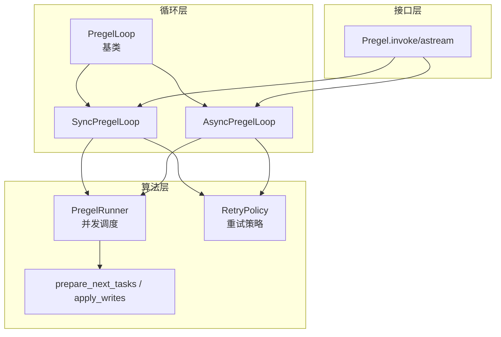
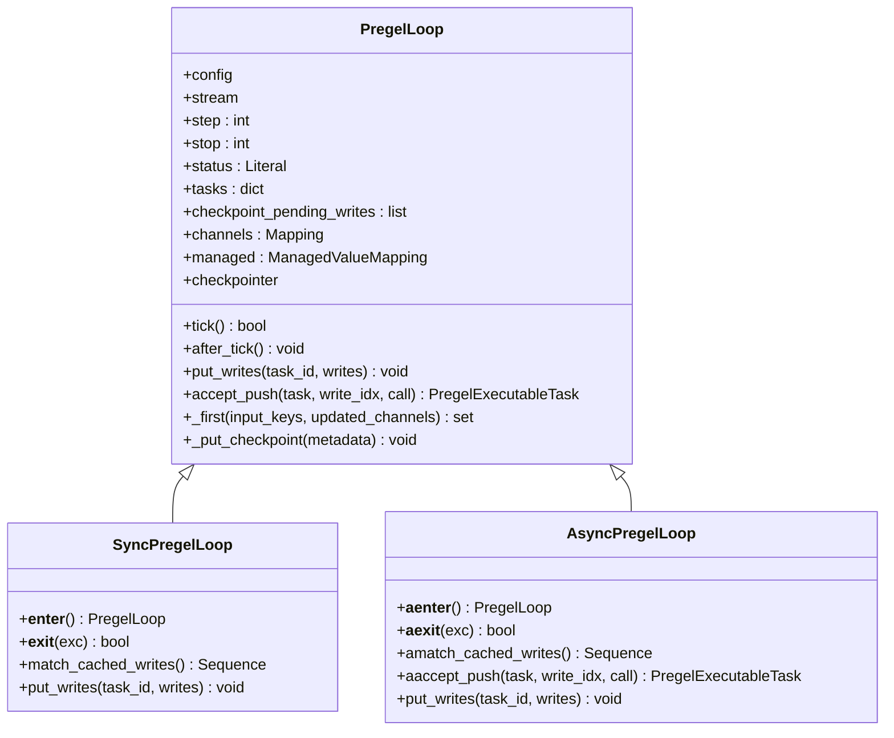
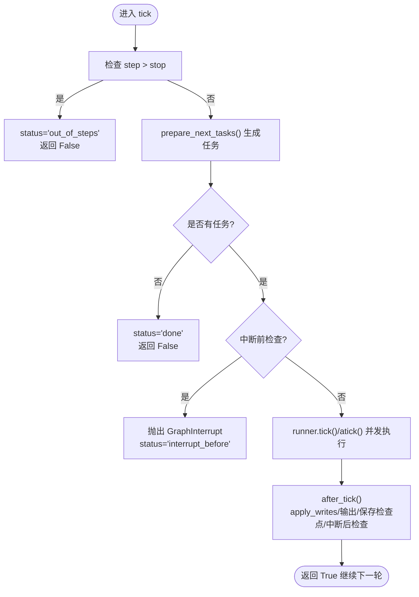
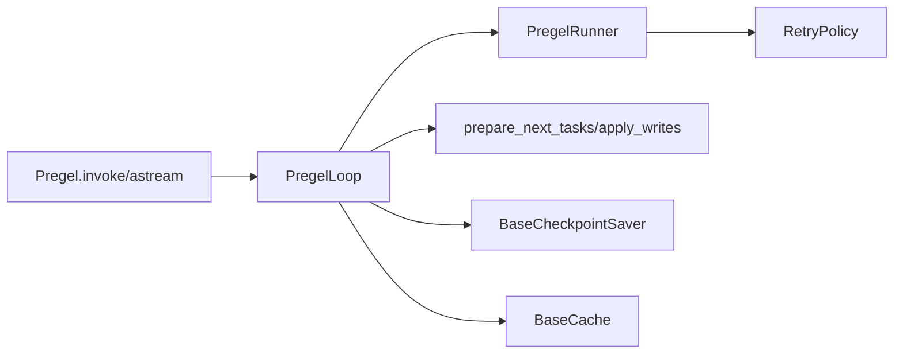

# 循环管理

<cite>
**本文档引用的文件**
- [libs/langgraph/langgraph/pregel/_loop.py](file://libs/langgraph/langgraph/pregel/_loop.py)
- [libs/langgraph/langgraph/pregel/main.py](file://libs/langgraph/langgraph/pregel/main.py)
- [libs/langgraph/langgraph/pregel/_algo.py](file://libs/langgraph/langgraph/pregel/_algo.py)
- [libs/langgraph/langgraph/pregel/_runner.py](file://libs/langgraph/langgraph/pregel/_runner.py)
- [libs/langgraph/langgraph/pregel/_retry.py](file://libs/langgraph/langgraph/pregel/_retry.py)
- [libs/langgraph/tests/test_pregel.py](file://libs/langgraph/tests/test_pregel.py)
- [libs/langgraph/tests/test_pregel_async.py](file://libs/langgraph/tests/test_pregel_async.py)
</cite>

## 目录
1. [简介](#简介)
2. [项目结构](#项目结构)
3. [核心组件](#核心组件)
4. [架构总览](#架构总览)
5. [详细组件分析](#详细组件分析)
6. [依赖关系分析](#依赖关系分析)
7. [性能考量](#性能考量)
8. [故障排查指南](#故障排查指南)
9. [结论](#结论)
10. [附录](#附录)

## 简介
本文件系统性阐述 LangGraph 中的循环管理机制，重点覆盖 Pregel 循环（Bulk Synchronous Parallel 模型）的同步与异步实现、循环终止条件与状态检查点管理、错误处理与重试机制、以及循环状态的维护与监控。文档旨在帮助读者理解 SyncPregelLoop 与 AsyncPregelLoop 的差异与适用场景，并掌握循环在节点中断、检查点保存与恢复、超时与资源清理方面的策略。

## 项目结构
围绕循环管理的关键模块与职责如下：
- pregel/_loop.py：定义 PregelLoop 基类及 SyncPregelLoop、AsyncPregelLoop 实现，负责循环生命周期、任务准备、写入应用、检查点持久化与中断控制。
- pregel/main.py：对外 API（invoke/astream）中集成循环执行，设置流模式、持久化策略（durability）、并发执行器与等待器。
- pregel/_algo.py：提供任务准备、写入应用、版本号推进等算法能力，支撑循环的每一步执行。
- pregel/_runner.py：并发调度器，驱动任务在单步内并行执行，支持超时与取消。
- pregel/_retry.py：重试策略与异常处理，包含指数退避、抖动、最大尝试次数等。
- 测试用例：验证中断、检查点、错误与重试行为。



图表来源
- [libs/langgraph/langgraph/pregel/_loop.py:142-1424](file://libs/langgraph/langgraph/pregel/_loop.py#L142-L1424)
- [libs/langgraph/langgraph/pregel/main.py:2672-3182](file://libs/langgraph/langgraph/pregel/main.py#L2672-L3182)
- [libs/langgraph/langgraph/pregel/_algo.py:326-400](file://libs/langgraph/langgraph/pregel/_algo.py#L326-L400)
- [libs/langgraph/langgraph/pregel/_runner.py:369-768](file://libs/langgraph/langgraph/pregel/_runner.py#L369-L768)
- [libs/langgraph/langgraph/pregel/_retry.py:150-294](file://libs/langgraph/langgraph/pregel/_retry.py#L150-L294)

章节来源
- [libs/langgraph/langgraph/pregel/_loop.py:142-1424](file://libs/langgraph/langgraph/pregel/_loop.py#L142-L1424)
- [libs/langgraph/langgraph/pregel/main.py:2672-3182](file://libs/langgraph/langgraph/pregel/main.py#L2672-L3182)

## 核心组件
- PregelLoop（基类）
  - 维护循环状态（step、stop、status）、任务集合（tasks）、通道与受管值映射、检查点及其待写入列表、缓存与持久化配置。
  - 提供 tick/after_tick 生命周期钩子，负责准备任务、执行任务、应用写入、输出值、保存检查点与中断判定。
- SyncPregelLoop
  - 同步上下文管理器，使用同步执行器提交任务与写入；支持“同步”持久化（durability="sync"）等待检查点完成。
- AsyncPregelLoop
  - 异步上下文管理器，使用异步执行器与等待器；支持“同步”持久化等待 Future 完成。
- PregelRunner
  - 单步内并发调度任务，支持超时、取消、等待器复用与失败聚合。
- 算法与工具
  - prepare_next_tasks：基于当前检查点与待写入，生成下一步可执行任务集合。
  - apply_writes：将任务写入应用到通道与检查点，推进版本号，触发下游节点。
  - should_interrupt：根据通道版本变化与中断配置判断是否中断。

章节来源
- [libs/langgraph/langgraph/pregel/_loop.py:142-870](file://libs/langgraph/langgraph/pregel/_loop.py#L142-L870)
- [libs/langgraph/langgraph/pregel/_algo.py:326-400](file://libs/langgraph/langgraph/pregel/_algo.py#L326-L400)
- [libs/langgraph/langgraph/pregel/_runner.py:369-768](file://libs/langgraph/langgraph/pregel/_runner.py#L369-L768)

## 架构总览
下图展示从 API 调用到循环执行、并发调度与检查点持久化的整体流程。

```mermaid
sequenceDiagram
participant User as "调用方"
participant API as "Pregel.invoke/astream"
participant Loop as "SyncPregelLoop/AsyncPregelLoop"
participant Runner as "PregelRunner"
participant Algo as "prepare_next_tasks/apply_writes"
participant CP as "检查点存储"
User->>API : 发起执行输入/命令/配置
API->>Loop : 创建循环实例上下文管理器
Loop->>Loop : 初始化状态/加载检查点
loop 每个循环步
Loop->>Algo : prepare_next_tasks()
Algo-->>Loop : 返回待执行任务集合
alt 存在待执行任务
Loop->>Runner : runner.tick()/atick()
Runner->>Runner : 并发执行任务含超时/取消
Runner-->>Loop : 产出写入/结果
Loop->>Algo : apply_writes()
Algo-->>Loop : 更新通道/版本
Loop->>Loop : 输出值/事件
Loop->>CP : _put_checkpoint()按durability策略
else 无任务或达到停止条件
Loop-->>API : 结束done/out_of_steps/interrupt_*
end
end
Loop-->>API : 返回最终输出/状态
```

图表来源
- [libs/langgraph/langgraph/pregel/main.py:2733-2753](file://libs/langgraph/langgraph/pregel/main.py#L2733-L2753)
- [libs/langgraph/langgraph/pregel/main.py:3124-3153](file://libs/langgraph/langgraph/pregel/main.py#L3124-L3153)
- [libs/langgraph/langgraph/pregel/_loop.py:461-574](file://libs/langgraph/langgraph/pregel/_loop.py#L461-L574)
- [libs/langgraph/langgraph/pregel/_runner.py:369-768](file://libs/langgraph/langgraph/pregel/_runner.py#L369-L768)
- [libs/langgraph/langgraph/pregel/_algo.py:218-323](file://libs/langgraph/langgraph/pregel/_algo.py#L218-L323)

## 详细组件分析

### PregelLoop 类与生命周期
- 关键字段与职责
  - 状态与计数：step、stop、status（"input"/"pending"/"done"/"interrupt_before"/"interrupt_after"/"out_of_steps"）
  - 任务与写入：tasks、checkpoint_pending_writes、updated_channels
  - 检查点与通道：checkpoint、channels、managed、checkpointer
  - 中断与重试：interrupt_before/after、retry_policy、cache_policy
- 生命周期方法
  - tick：准备任务、中断前检查、输出调试信息、返回是否继续
  - after_tick：应用写入、输出值、清空待写入、保存检查点、中断后检查、清理恢复标记
  - _first：处理输入/命令、恢复/重放、设置状态为"pending"
  - _put_checkpoint：创建/更新检查点、按需持久化、推进 step
- 写入与缓存
  - put_writes：去重特殊通道写入、过滤未跟踪值、持久化写入、输出写入
  - _match_writes：将检查点待写入匹配到新任务
  - 缓存命中：match_cached_writes/amatch_cached_writes 将缓存结果注入任务



图表来源
- [libs/langgraph/langgraph/pregel/_loop.py:142-1424](file://libs/langgraph/langgraph/pregel/_loop.py#L142-L1424)

章节来源
- [libs/langgraph/langgraph/pregel/_loop.py:142-870](file://libs/langgraph/langgraph/pregel/_loop.py#L142-L870)

### SyncPregelLoop 与 AsyncPregelLoop 的区别与使用场景
- 共同点
  - 都继承自 PregelLoop，共享 tick/after_tick 生命周期与写入应用逻辑。
  - 都通过 prepare_next_tasks 生成任务，apply_writes 应用写入，_put_checkpoint 持久化。
- 差异点
  - 执行器与等待器
    - SyncPregelLoop 使用同步执行器（BackgroundExecutor），durability="sync" 时阻塞等待检查点完成。
    - AsyncPregelLoop 使用异步执行器（AsyncBackgroundExecutor），durability="sync" 时等待 Future 完成。
  - 缓存与写入
    - SyncPregelLoop 在 put_writes 中直接提交缓存写入；AsyncPregelLoop 对 ERROR/INTERRUPT 不缓存成功结果。
  - 上下文退出
    - AsyncPregelLoop 在退出时对等待器进行清理，避免悬挂任务。
- 使用场景
  - 同步执行：适合 CLI/批处理/需要严格顺序与阻塞确认的场景（durability="sync"）。
  - 异步执行：适合高并发/长连接/流式响应场景（durability="async"/"exit"）。

章节来源
- [libs/langgraph/langgraph/pregel/_loop.py:1020-1214](file://libs/langgraph/langgraph/pregel/_loop.py#L1020-L1214)
- [libs/langgraph/langgraph/pregel/_loop.py:1216-1424](file://libs/langgraph/langgraph/pregel/_loop.py#L1216-L1424)
- [libs/langgraph/langgraph/pregel/main.py:2733-2753](file://libs/langgraph/langgraph/pregel/main.py#L2733-L2753)
- [libs/langgraph/langgraph/pregel/main.py:3124-3153](file://libs/langgraph/langgraph/pregel/main.py#L3124-L3153)

### 循环终止条件与状态检查点管理
- 终止条件
  - 递归限制：step > stop 时设置 status="out_of_steps"，循环结束。
  - 无任务：tick 中若无任务则设置 status="done"，循环结束。
  - 中断：before/after 中断检查通过时抛出 GraphInterrupt，设置对应状态。
- 状态管理
  - status 字段反映当前循环阶段与原因。
  - _first 中根据输入/命令/恢复标志设置 CONFIG_KEY_RESUMING 与 CONFIG_KEY_REPLAY_STATE，传递给子图。
  - after_tick 清理 pending_writes、保存检查点、清除 CONFIG_KEY_RESUMING。
- 检查点
  - _put_checkpoint：创建/更新检查点，推进 step，按 durability 决定是否持久化。
  - _put_pending_writes：批量提交待写入，支持 task_path 参数（由 checkpointer.put_writes 签名决定）。
  - 版本推进：apply_writes 根据通道消费/更新情况推进 channel_versions，用于触发下游节点。



图表来源
- [libs/langgraph/langgraph/pregel/_loop.py:461-574](file://libs/langgraph/langgraph/pregel/_loop.py#L461-L574)
- [libs/langgraph/langgraph/pregel/_algo.py:218-323](file://libs/langgraph/langgraph/pregel/_algo.py#L218-L323)

章节来源
- [libs/langgraph/langgraph/pregel/_loop.py:461-574](file://libs/langgraph/langgraph/pregel/_loop.py#L461-L574)
- [libs/langgraph/langgraph/pregel/_algo.py:218-323](file://libs/langgraph/langgraph/pregel/_algo.py#L218-L323)

### 错误处理与重试机制
- 重试策略
  - RetryPolicy 支持最大尝试次数、初始间隔、退避因子、抖动、异常类型匹配。
  - 同步/异步路径分别在 run_with_retry 中处理，失败时按策略指数退避并记录日志。
- 异常传播与冒泡
  - 任务执行异常被捕获并根据策略决定是否重试；超过最大尝试次数后抛出。
  - GraphBubbleUp 与 GraphInterrupt 用于控制中断与冒泡。
- 循环内的错误处理
  - PregelLoop._suppress_interrupt：在嵌套图或 exit 模式下确保检查点与待写入持久化后再抑制中断。
  - after_tick 中对 ERROR/INTERRUPT/RESUME 的特殊通道写入进行过滤与匹配。

章节来源
- [libs/langgraph/langgraph/pregel/_retry.py:150-294](file://libs/langgraph/langgraph/pregel/_retry.py#L150-L294)
- [libs/langgraph/langgraph/pregel/_loop.py:870-890](file://libs/langgraph/langgraph/pregel/_loop.py#L870-L890)

### 循环状态的维护与监控
- 状态字段
  - status：反映循环阶段与原因（"input"/"pending"/"done"/"interrupt_before"/"interrupt_after"/"out_of_steps"）。
  - step/stop：循环步数与停止阈值。
  - updated_channels：本步更新的通道集合，用于触发下游节点。
- 监控与调试
  - tick/after_tick 中 emit 调试事件（"tasks"/"values"/"checkpoints"），便于观察任务与检查点。
  - should_interrupt 基于通道版本变化与中断配置判断是否中断。
- 恢复与重放
  - _first 中处理 CONFIG_KEY_RESUMING 与 replay_state，必要时清除 RESUME 写入以重新触发中断。
  - _pending_interrupts 计算悬挂中断 ID，支持多中断场景下的精确恢复。

章节来源
- [libs/langgraph/langgraph/pregel/_loop.py:540-574](file://libs/langgraph/langgraph/pregel/_loop.py#L540-L574)
- [libs/langgraph/langgraph/pregel/_loop.py:590-618](file://libs/langgraph/langgraph/pregel/_loop.py#L590-L618)
- [libs/langgraph/langgraph/pregel/_algo.py:141-171](file://libs/langgraph/langgraph/pregel/_algo.py#L141-L171)

### 节点中断、检查点保存与恢复
- 中断
  - ask_human/中断节点产生 INTERRUPT 写入；should_interrupt 判断是否触发中断。
  - 多中断场景：_pending_interrupts 计算悬挂中断 ID，支持通过 Command(resume={id: value}) 精确恢复。
- 检查点保存与恢复
  - SyncPregelLoop/AsyncPregelLoop 在 __enter__/__aenter__ 中加载最近检查点或指定检查点。
  - after_tick 中保存检查点，durability 控制保存时机（"sync"/"async"/"exit"）。
- 流与事件
  - 循环中通过 StreamProtocol 输出事件（values/tasks/checkpoints/debug），支持多模式组合。

章节来源
- [libs/langgraph/langgraph/pregel/_loop.py:620-788](file://libs/langgraph/langgraph/pregel/_loop.py#L620-L788)
- [libs/langgraph/langgraph/pregel/_loop.py:790-870](file://libs/langgraph/langgraph/pregel/_loop.py#L790-L870)
- [libs/langgraph/langgraph/pregel/_algo.py:141-171](file://libs/langgraph/langgraph/pregel/_algo.py#L141-L171)
- [libs/langgraph/tests/test_pregel.py:893-927](file://libs/langgraph/tests/test_pregel.py#L893-L927)
- [libs/langgraph/tests/test_pregel_async.py:996-1044](file://libs/langgraph/tests/test_pregel_async.py#L996-L1044)

### 循环超时与资源清理策略
- 超时
  - runner.tick()/atick() 接收 step_timeout，到达超时后停止等待并抛出异常。
- 资源清理
  - AsyncPregelLoop.__aexit__：在取消时保留退出任务以便上层等待，避免悬挂。
  - main.py 中的等待器清理：Sync/Async 分别通过释放信号量或取消等待任务，防止挂起。
- 调度与并发
  - PregelRunner 使用 Future/Task 并发执行任务，支持取消与失败聚合，确保资源及时回收。

章节来源
- [libs/langgraph/langgraph/pregel/main.py:2738-2756](file://libs/langgraph/langgraph/pregel/main.py#L2738-L2756)
- [libs/langgraph/langgraph/pregel/main.py:3148-3153](file://libs/langgraph/langgraph/pregel/main.py#L3148-L3153)
- [libs/langgraph/langgraph/pregel/_runner.py:369-423](file://libs/langgraph/langgraph/pregel/_runner.py#L369-L423)

## 依赖关系分析
- 组件耦合
  - PregelLoop 与 PregelRunner 解耦：前者专注循环与检查点，后者专注并发调度。
  - PregelLoop 与算法模块解耦：prepare_next_tasks/apply_writes 作为纯函数被调用，便于测试与替换。
- 外部依赖
  - 检查点存储：BaseCheckpointSaver 的同步/异步接口（put/put_writes/aput/aput_writes）。
  - 缓存：BaseCache 的同步/异步接口（get/set/aget/aset）。
  - 回调与运行时：ParentRunManager/AsyncParentRunManager、Runtime、ExecutionInfo。



图表来源
- [libs/langgraph/langgraph/pregel/_loop.py:142-1424](file://libs/langgraph/langgraph/pregel/_loop.py#L142-L1424)
- [libs/langgraph/langgraph/pregel/_runner.py:369-768](file://libs/langgraph/langgraph/pregel/_runner.py#L369-L768)
- [libs/langgraph/langgraph/pregel/_algo.py:326-400](file://libs/langgraph/langgraph/pregel/_algo.py#L326-L400)

章节来源
- [libs/langgraph/langgraph/pregel/_loop.py:142-1424](file://libs/langgraph/langgraph/pregel/_loop.py#L142-L1424)
- [libs/langgraph/langgraph/pregel/_runner.py:369-768](file://libs/langgraph/langgraph/pregel/_runner.py#L369-L768)

## 性能考量
- 并发执行
  - PregelRunner 在单步内并行执行任务，减少总体延迟；通过超时与取消控制资源占用。
- 检查点持久化
  - durability="sync" 会阻塞等待检查点完成，保证一致性但可能增加延迟；"async"/"exit" 可提升吞吐。
- 写入与缓存
  - put_writes 过滤未跟踪值与重复写入，减少无效持久化；缓存命中可显著降低重复计算成本。
- 版本推进
  - apply_writes 基于通道消费/更新推进版本，避免不必要的触发，提高稳定性。

## 故障排查指南
- 常见问题与定位
  - 递归限制：status="out_of_steps"，检查 recursion_limit 与图结构是否存在环。
  - 中断未恢复：确认 pending_writes 中是否存在 RESUME；多中断场景需指定中断 ID。
  - 检查点未保存：durability="sync" 时等待 _put_checkpoint_fut；检查 checkpointer 是否可用。
  - 超时与悬挂：查看 runner 超时与等待器清理逻辑；异步场景注意取消后的退出任务。
- 关键断点
  - tick/after_tick 中的调试事件（"tasks"/"values"/"checkpoints"）。
  - should_interrupt 的通道版本比较与中断节点匹配。
  - _suppress_interrupt 的错误/中断抑制与持久化时机。

章节来源
- [libs/langgraph/langgraph/pregel/_loop.py:461-574](file://libs/langgraph/langgraph/pregel/_loop.py#L461-L574)
- [libs/langgraph/langgraph/pregel/_algo.py:141-171](file://libs/langgraph/langgraph/pregel/_algo.py#L141-L171)
- [libs/langgraph/tests/test_pregel.py:893-927](file://libs/langgraph/tests/test_pregel.py#L893-L927)
- [libs/langgraph/tests/test_pregel_async.py:996-1044](file://libs/langgraph/tests/test_pregel_async.py#L996-L1044)

## 结论
LangGraph 的循环管理以 PregelLoop 为核心，通过同步与异步两种实现适配不同执行环境；借助 prepare_next_tasks/apply_writes 等算法模块，实现了稳定的 Bulk Synchronous Parallel 执行模型。结合检查点持久化、中断与重试机制，循环能够在复杂场景下保持一致性与可观测性。合理选择 durability、优化任务并发与写入策略，可进一步提升性能与可靠性。

## 附录
- 关键流程图与示例
  - 循环执行流程：见“架构总览”与“详细组件分析”中的序列图与流程图。
  - 中断与恢复示例：参考测试用例中对 pending_writes 与 resume 的断言。