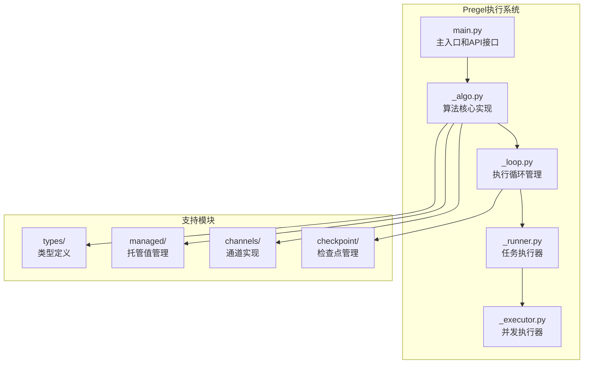
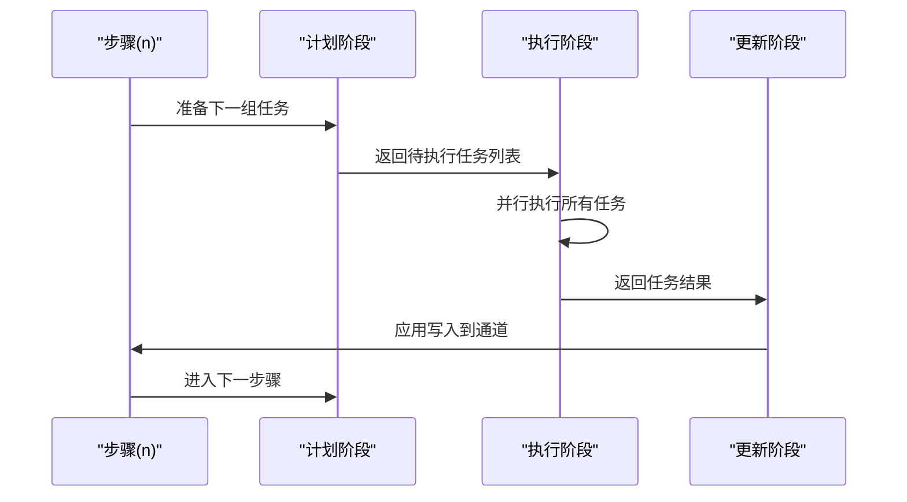
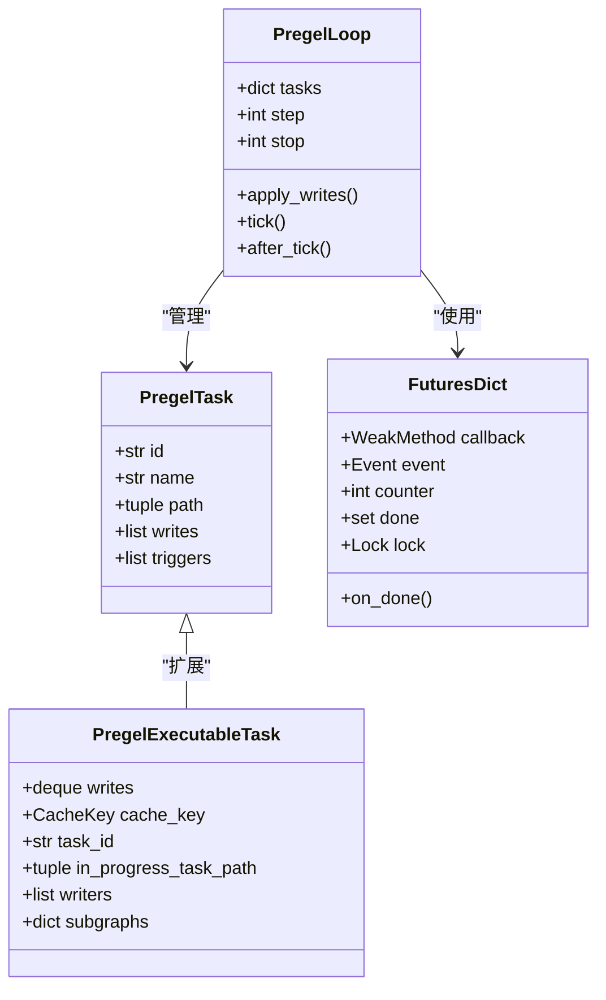
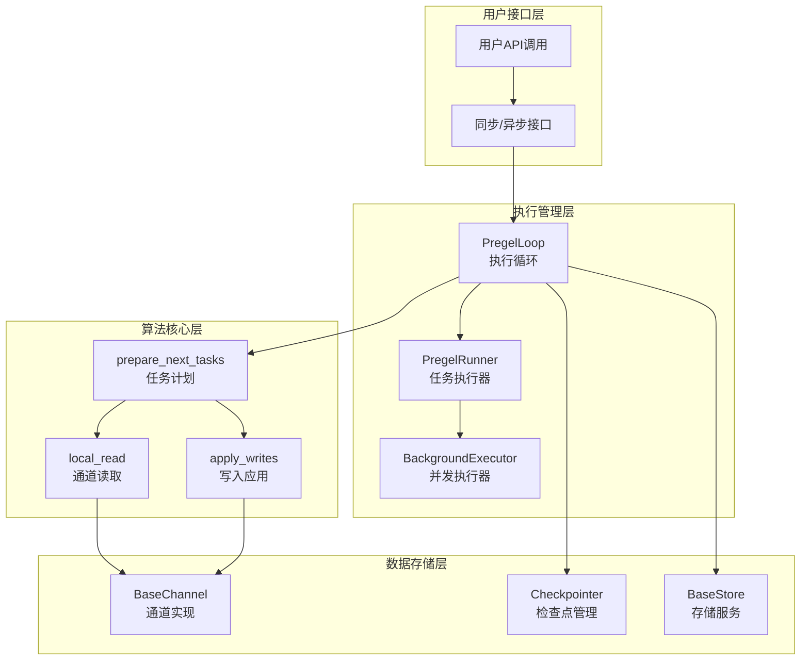
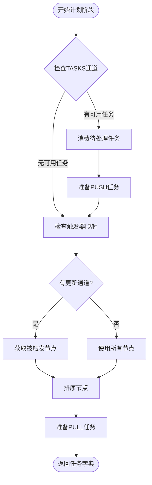
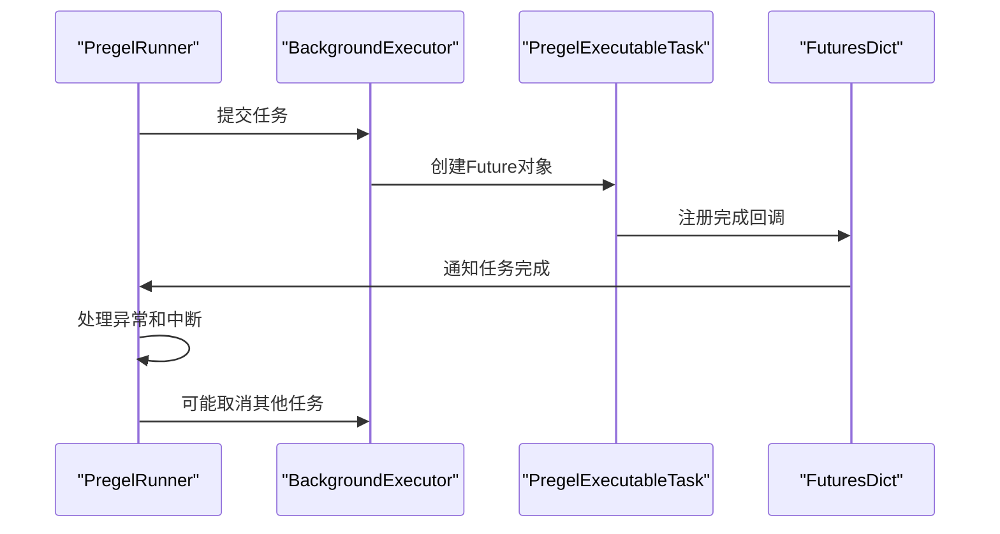
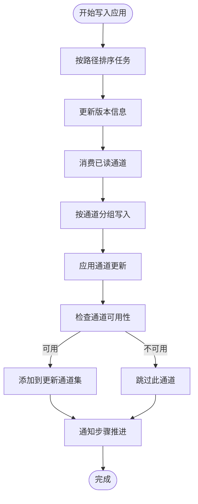
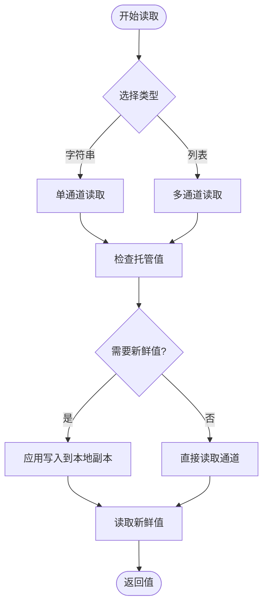
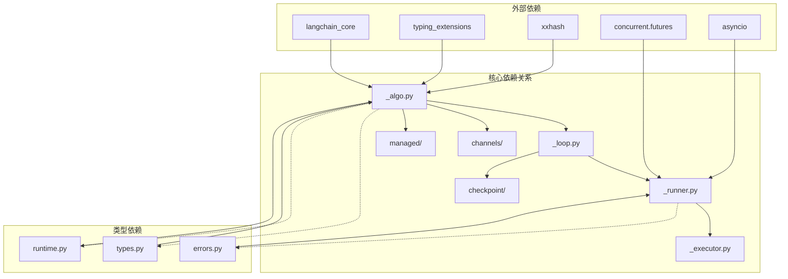

# 执行算法

<cite>
**本文档引用的文件**
- [_algo.py](file://libs/langgraph/langgraph/pregel/_algo.py)
- [_loop.py](file://libs/langgraph/langgraph/pregel/_loop.py)
- [_runner.py](file://libs/langgraph/langgraph/pregel/_runner.py)
- [_executor.py](file://libs/langgraph/langgraph/pregel/_executor.py)
- [main.py](file://libs/langgraph/langgraph/pregel/main.py)
</cite>

## 目录
1. [简介](#简介)
2. [项目结构](#项目结构)
3. [核心组件](#核心组件)
4. [架构概览](#架构概览)
5. [详细组件分析](#详细组件分析)
6. [依赖关系分析](#依赖关系分析)
7. [性能考虑](#性能考虑)
8. [故障排除指南](#故障排除指南)
9. [结论](#结论)

## 简介

本文档深入解析LangGraph中Pregel算法的核心实现，这是一个基于Bulk Synchronous Parallel（BSP）模型的分布式执行框架。Pregel算法将计算过程划分为三个明确阶段：计划（Plan）、执行（Execute）和更新（Update），通过工作队列管理和并发控制机制实现高效的异步执行。

该算法的核心创新在于将传统的图计算模型与现代的异步编程范式相结合，通过通道（Channels）作为数据交换媒介，实现了节点间的松耦合通信和可扩展的并发执行。

## 项目结构

LangGraph的Pregel执行系统由多个精心设计的模块组成，每个模块负责特定的功能职责：

**图表来源**
- [main.py:1-800](file://libs/langgraph/langgraph/pregel/main.py#L1-L800)
- [_algo.py:1-1259](file://libs/langgraph/langgraph/pregel/_algo.py#L1-L1259)
- [_loop.py:1-1424](file://libs/langgraph/langgraph/pregel/_loop.py#L1-L1424)

**章节来源**
- [main.py:337-620](file://libs/langgraph/langgraph/pregel/main.py#L337-L620)
- [_algo.py:1-80](file://libs/langgraph/langgraph/pregel/_algo.py#L1-L80)

## 核心组件

### Pregel算法三阶段执行模型

Pregel算法采用经典的BSP模型，将每次迭代划分为三个明确阶段：

1. **计划阶段（Plan）**：确定当前步骤需要执行的任务集合
2. **执行阶段（Execute）**：并行执行所有计划任务
3. **更新阶段（Update）**：将任务输出应用到通道中

**图表来源**
- [_loop.py:461-574](file://libs/langgraph/langgraph/pregel/_loop.py#L461-L574)
- [_algo.py:370-491](file://libs/langgraph/langgraph/pregel/_algo.py#L370-L491)

### 工作队列管理系统

工作队列是Pregel算法的核心数据结构，负责管理待执行的任务：

**图表来源**
- [_loop.py:142-205](file://libs/langgraph/langgraph/pregel/_loop.py#L142-L205)
- [_runner.py:71-120](file://libs/langgraph/langgraph/pregel/_runner.py#L71-L120)

**章节来源**
- [_loop.py:203-205](file://libs/langgraph/langgraph/pregel/_loop.py#L203-L205)
- [_runner.py:71-120](file://libs/langgraph/langgraph/pregel/_runner.py#L71-L120)

## 架构概览

Pregel执行系统的整体架构体现了清晰的关注点分离和模块化设计：

**图表来源**
- [main.py:337-620](file://libs/langgraph/langgraph/pregel/main.py#L337-L620)
- [_loop.py:142-250](file://libs/langgraph/langgraph/pregel/_loop.py#L142-L250)
- [_runner.py:122-139](file://libs/langgraph/langgraph/pregel/_runner.py#L122-L139)

## 详细组件分析

### 计划阶段：prepare_next_tasks函数

prepare_next_tasks是Pregel算法的核心，负责确定每个步骤要执行的任务集合：

#### 任务发现机制

**图表来源**
- [_algo.py:370-491](file://libs/langgraph/langgraph/pregel/_algo.py#L370-L491)

#### 任务准备策略

prepare_single_task根据任务类型（PUSH/PULL）采用不同的准备策略：

**PUSH任务准备**：
- 处理来自其他节点的调用请求
- 验证目标节点存在性
- 创建任务配置和缓存键
- 设置回调函数和检查点参数

**PULL任务准备**：
- 基于通道版本比较确定触发条件
- 检查节点的触发通道是否更新
- 生成任务ID和命名空间
- 创建输入值和运行时配置

**章节来源**
- [_algo.py:502-738](file://libs/langgraph/langgraph/pregel/_algo.py#L502-L738)
- [_algo.py:741-1046](file://libs/langgraph/langgraph/pregel/_algo.py#L741-L1046)

### 执行阶段：并发控制与任务调度

#### 并发执行器设计

PregelRunner负责协调多个任务的并发执行，采用灵活的执行策略：

**图表来源**
- [_runner.py:140-271](file://libs/langgraph/langgraph/pregel/_runner.py#L140-L271)

#### 资源调度策略

系统实现了多层次的资源调度机制：

**线程池调度**：
- 使用BackgroundExecutor管理线程池
- 支持任务取消和异常传播
- 实现优雅的资源清理

**异步调度**：
- AsyncBackgroundExecutor处理异步任务
- 基于信号量实现并发限制
- 支持事件循环集成

**章节来源**
- [_runner.py:122-139](file://libs/langgraph/langgraph/pregel/_runner.py#L122-L139)
- [_executor.py:40-121](file://libs/langgraph/langgraph/pregel/_executor.py#L40-L121)

### 更新阶段：apply_writes函数

apply_writes负责将任务的输出应用到系统状态中，确保数据一致性：

#### 写入应用流程

**图表来源**
- [_algo.py:218-323](file://libs/langgraph/langgraph/pregel/_algo.py#L218-L323)

#### 版本控制机制

系统采用版本化的通道更新策略：

**版本递增**：
- 默认使用increment函数递增版本号
- 支持自定义版本控制策略
- 确保写入顺序的正确性

**冲突检测**：
- 比较通道的当前版本和已见版本
- 检测并处理并发写入冲突
- 维护最终一致性

**章节来源**
- [_algo.py:213-323](file://libs/langgraph/langgraph/pregel/_algo.py#L213-L323)

### 通道读取：local_read函数

local_read提供了条件边的通道读取功能，允许节点读取反映其写入状态的通道值：

#### 读取策略

**图表来源**
- [_algo.py:174-210](file://libs/langgraph/langgraph/pregel/_algo.py#L174-L210)

#### 新鲜值机制

fresh参数控制读取行为：

**非新鲜读取**：
- 直接从当前通道读取
- 性能最优，但不反映当前任务的写入

**新鲜读取**：
- 创建通道的本地副本
- 应用当前任务的写入
- 提供一致的读取视图

**章节来源**
- [_algo.py:174-210](file://libs/langgraph/langgraph/pregel/_algo.py#L174-L210)

## 依赖关系分析

Pregel执行系统展现了良好的模块化设计，各组件间的关系清晰且职责明确：

**图表来源**
- [_algo.py:1-84](file://libs/langgraph/langgraph/pregel/_algo.py#L1-L84)
- [_loop.py:1-125](file://libs/langgraph/langgraph/pregel/_loop.py#L1-L125)
- [_runner.py:1-49](file://libs/langgraph/langgraph/pregel/_runner.py#L1-L49)

### 组件耦合度分析

系统在设计上实现了适当的解耦：

**低耦合特性**：
- 算法核心与执行细节分离
- 通道抽象屏蔽具体实现
- 异步/同步接口统一

**高内聚特性**：
- 相关功能集中在单一模块
- 明确的职责边界
- 清晰的接口契约

**潜在循环依赖**：
- 通过延迟导入避免循环引用
- 接口定义独立于实现
- 类型提示减少运行时依赖

**章节来源**
- [_algo.py:1-1259](file://libs/langgraph/langgraph/pregel/_algo.py#L1-L1259)
- [_loop.py:1-1424](file://libs/langgraph/langgraph/pregel/_loop.py#L1-L1424)

## 性能考虑

### 并发控制策略

系统实现了多层次的并发控制机制以确保性能和稳定性：

**最大并发限制**：
- 通过max_concurrency配置限制同时执行的任务数
- 在异步环境中使用信号量进行资源控制
- 避免过度并发导致的资源争用

**任务调度优化**：
- 优先级队列确保关键任务及时执行
- 批量提交减少线程切换开销
- 智能重试机制提高失败任务恢复率

**内存管理**：
- 任务结果缓存减少重复计算
- 及时清理已完成任务的引用
- 监控内存使用防止泄漏

### 缓存策略

系统采用多级缓存机制提升性能：

**任务结果缓存**：
- 基于任务参数生成缓存键
- 支持TTL过期机制
- 异步缓存写入避免阻塞

**输入值缓存**：
- 避免重复的通道读取
- 支持浅拷贝减少内存占用
- 按需失效确保数据一致性

### 错误处理与恢复

**渐进式错误处理**：
- 单个任务失败不影响整体执行
- 自动重试机制处理临时故障
- 中断信号优雅处理异常情况

**资源清理**：
- 上下文管理器确保资源释放
- 取消机制避免僵尸任务
- 异常传播保持执行语义

## 故障排除指南

### 常见问题诊断

**任务超时问题**：
- 检查step_timeout配置
- 监控任务执行时间
- 分析阻塞操作位置

**内存泄漏排查**：
- 监控任务数量增长
- 检查未完成的Future对象
- 验证回调函数注册

**并发冲突解决**：
- 分析版本冲突日志
- 检查通道更新频率
- 优化任务粒度划分

### 调试工具使用

**调试模式启用**：
- 启用debug配置获取详细日志
- 使用流模式监控执行过程
- 分析检查点状态变化

**性能分析**：
- 监控并发度指标
- 分析任务执行时间分布
- 识别瓶颈环节

**章节来源**
- [_loop.py:931-1018](file://libs/langgraph/langgraph/pregel/_loop.py#L931-L1018)
- [_runner.py:490-531](file://libs/langgraph/langgraph/pregel/_runner.py#L490-L531)

## 结论

LangGraph的Pregel算法实现代表了现代分布式执行系统的设计典范。通过将经典的BSP模型与异步编程范式相结合，系统实现了高效、可扩展且易于使用的执行框架。

**主要优势**：
- 清晰的三阶段执行模型便于理解和维护
- 灵活的并发控制机制适应不同场景需求
- 完善的错误处理和恢复机制确保系统稳定性
- 模块化设计支持功能扩展和定制

**技术特色**：
- 基于通道的松耦合通信架构
- 版本化的状态管理保证一致性
- 多层次的缓存策略提升性能
- 统一的异步/同步接口设计

该实现为构建复杂的数据处理管道和AI工作流提供了坚实的基础，通过合理的架构设计和性能优化，能够满足从简单应用到大规模生产环境的各种需求。