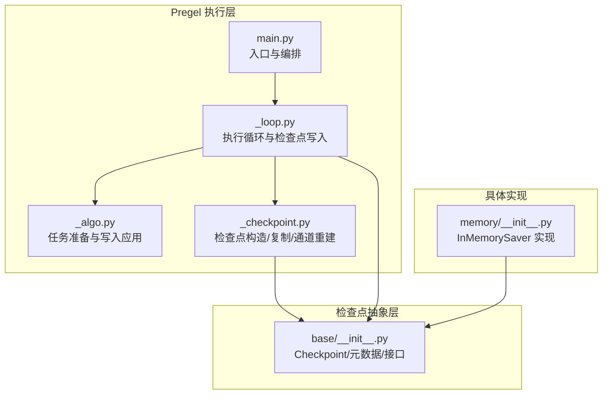
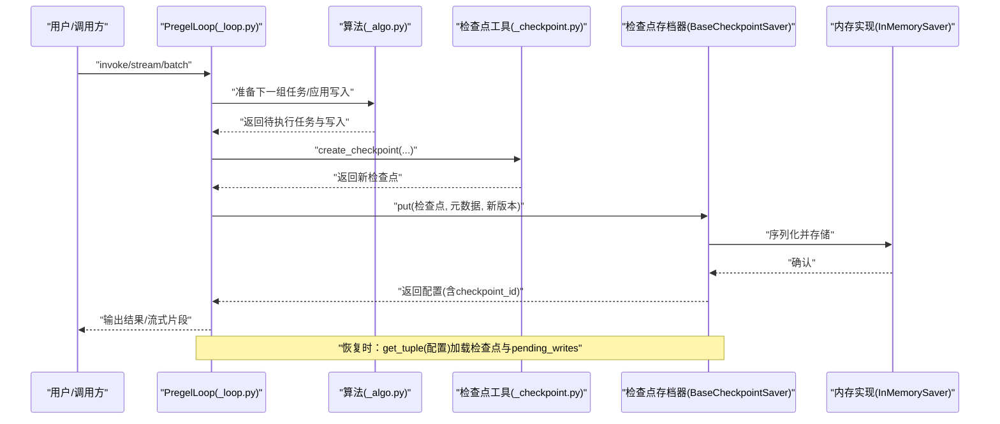
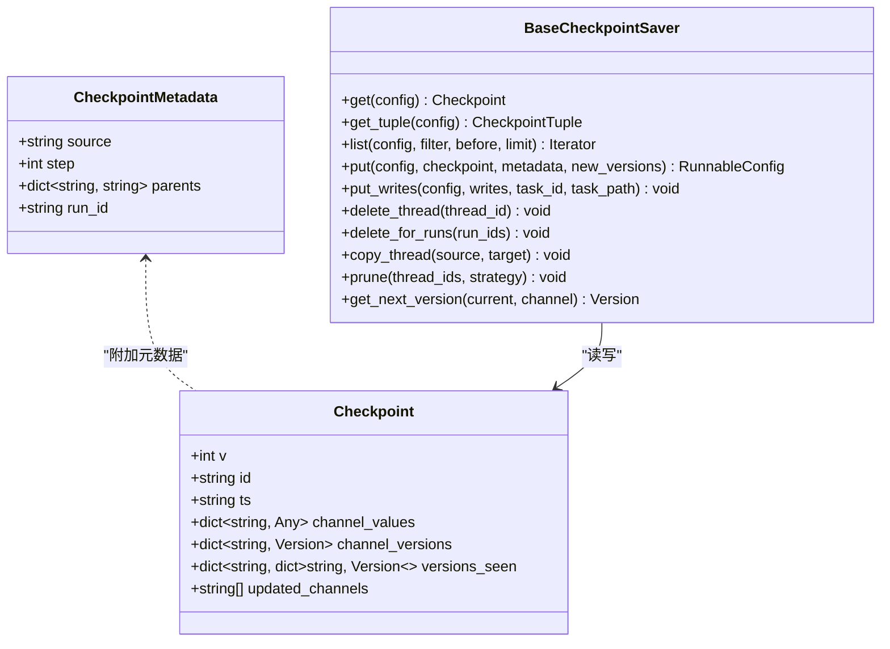
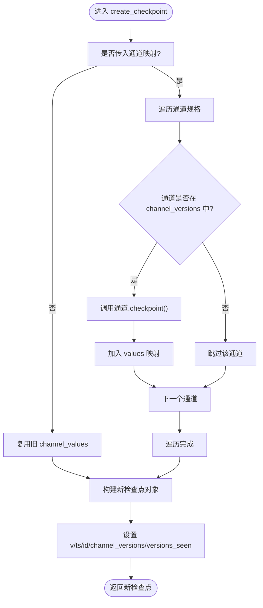
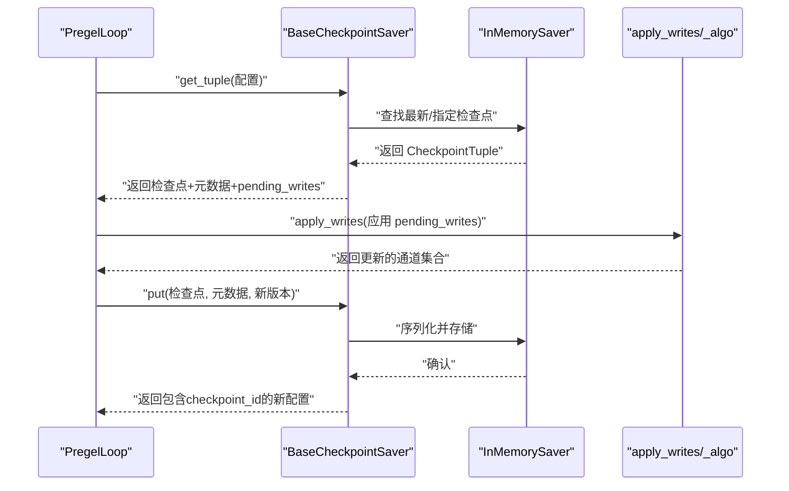
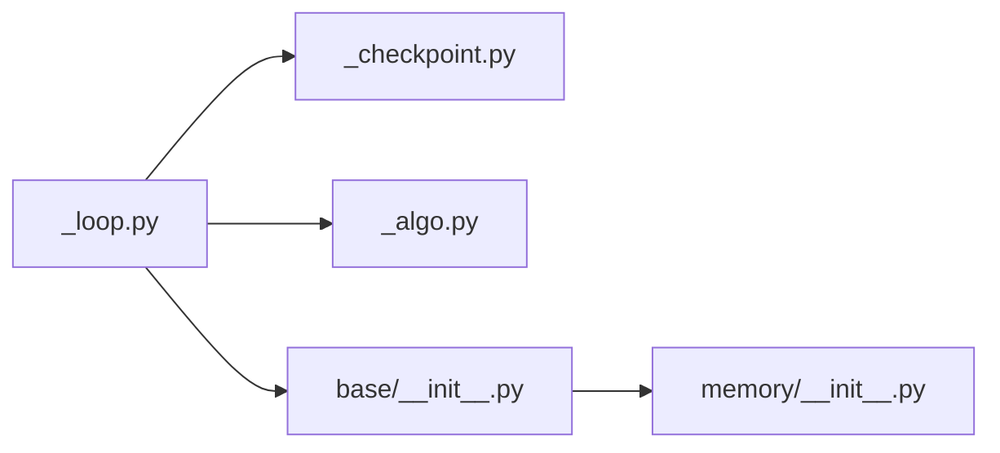

# 检查点集成

<cite>
**本文引用的文件**   
- [libs/langgraph/langgraph/pregel/_checkpoint.py](file://libs/langgraph/langgraph/pregel/_checkpoint.py)
- [libs/checkpoint/langgraph/checkpoint/base/__init__.py](file://libs/checkpoint/langgraph/checkpoint/base/__init__.py)
- [libs/checkpoint/langgraph/checkpoint/memory/__init__.py](file://libs/checkpoint/langgraph/checkpoint/memory/__init__.py)
- [libs/langgraph/langgraph/pregel/_loop.py](file://libs/langgraph/langgraph/pregel/_loop.py)
- [libs/langgraph/langgraph/pregel/_algo.py](file://libs/langgraph/langgraph/pregel/_algo.py)
- [libs/langgraph/langgraph/pregel/main.py](file://libs/langgraph/langgraph/pregel/main.py)
- [libs/langgraph/tests/test_pregel_async.py](file://libs/langgraph/tests/test_pregel_async.py)
- [libs/langgraph/tests/test_pregel.py](file://libs/langgraph/tests/test_pregel.py)
- [libs/langgraph/tests/test_time_travel_async.py](file://libs/langgraph/tests/test_time_travel_async.py)
- [libs/langgraph/tests/test_time_travel.py](file://libs/langgraph/tests/test_time_travel.py)
</cite>

## 目录
1. [简介](#简介)
2. [项目结构](#项目结构)
3. [核心组件](#核心组件)
4. [架构总览](#架构总览)
5. [详细组件分析](#详细组件分析)
6. [依赖关系分析](#依赖关系分析)
7. [性能考量](#性能考量)
8. [故障排查指南](#故障排查指南)
9. [结论](#结论)
10. [附录](#附录)

## 简介
本文件系统性阐述检查点机制在 Pregel 执行过程中的集成方式，覆盖检查点的创建、保存、加载与恢复策略；详解 create_checkpoint、copy_checkpoint、channels_from_checkpoint 等关键函数的实现原理与使用场景；说明检查点在循环管理中的作用（状态快照的时机选择、版本管理与故障恢复）；并提供检查点数据结构图与恢复流程示例，帮助读者全面理解检查点在整个执行过程中的关键地位。

## 项目结构
围绕检查点的代码主要分布在以下模块：
- Pregel 内核：负责在执行循环中生成、应用与持久化检查点，并在中断/恢复时进行状态回放。
- 检查点基类与接口：定义检查点数据结构、元数据、版本管理与存取协议。
- 具体存档器：如内存存档器，实现具体的 get/put/list/delete 等操作。
- 测试用例：验证检查点在中断、恢复、时间旅行等场景的行为。

**图表来源**
- [libs/langgraph/langgraph/pregel/_loop.py:560-759](file://libs/langgraph/langgraph/pregel/_loop.py#L560-L759)
- [libs/langgraph/langgraph/pregel/_algo.py:410-691](file://libs/langgraph/langgraph/pregel/_algo.py#L410-L691)
- [libs/langgraph/langgraph/pregel/_checkpoint.py:16-89](file://libs/langgraph/langgraph/pregel/_checkpoint.py#L16-L89)
- [libs/langgraph/langgraph/pregel/main.py:1-200](file://libs/langgraph/langgraph/pregel/main.py#L1-L200)
- [libs/checkpoint/langgraph/checkpoint/base/__init__.py:65-120](file://libs/checkpoint/langgraph/checkpoint/base/__init__.py#L65-L120)
- [libs/checkpoint/langgraph/checkpoint/memory/__init__.py:135-215](file://libs/checkpoint/langgraph/checkpoint/memory/__init__.py#L135-L215)

**章节来源**
- [libs/langgraph/langgraph/pregel/main.py:1-200](file://libs/langgraph/langgraph/pregel/main.py#L1-L200)
- [libs/checkpoint/langgraph/checkpoint/base/__init__.py:65-120](file://libs/checkpoint/langgraph/checkpoint/base/__init__.py#L65-L120)

## 核心组件
- 检查点数据结构（Checkpoint）
  - 字段：格式版本 v、唯一标识 id、时间戳 ts、通道值 channel_values、通道版本 channel_versions、节点已见版本 versions_seen、更新通道 updated_channels 等。
  - 用途：记录某一时刻的完整状态快照，用于后续恢复、重放与调试。
- 检查点存取接口（BaseCheckpointSaver）
  - 提供 get/get_tuple、list、put、put_writes、delete_thread/delete_for_runs、copy_thread、prune 等方法，支持同步与异步实现。
  - 版本生成：get_next_version 默认按整数递增，也可自定义为字符串/浮点单调递增。
- 具体内存存档器（InMemorySaver）
  - 基于内存存储检查点与中间写入，支持序列化与反序列化，提供 list/put/put_writes/delete 等能力。
- Pregel 循环中的检查点
  - 在每次 tick 结束后保存“loop”源检查点；在输入到达时保存“input”源检查点；在恢复时根据 pending_writes 应用写入并推进版本。

**章节来源**
- [libs/checkpoint/langgraph/checkpoint/base/__init__.py:65-120](file://libs/checkpoint/langgraph/checkpoint/base/__init__.py#L65-L120)
- [libs/checkpoint/langgraph/checkpoint/base/__init__.py:122-458](file://libs/checkpoint/langgraph/checkpoint/base/__init__.py#L122-L458)
- [libs/checkpoint/langgraph/checkpoint/memory/__init__.py:135-215](file://libs/checkpoint/langgraph/checkpoint/memory/__init__.py#L135-L215)
- [libs/langgraph/langgraph/pregel/_loop.py:560-759](file://libs/langgraph/langgraph/pregel/_loop.py#L560-L759)

## 架构总览
下图展示 Pregel 在执行循环中如何与检查点子系统协作：循环在关键节点生成检查点，通过 checkpointer 将检查点与中间写入持久化；在恢复时从最近检查点或指定检查点加载状态并回放未完成的任务。

**图表来源**
- [libs/langgraph/langgraph/pregel/_loop.py:560-759](file://libs/langgraph/langgraph/pregel/_loop.py#L560-L759)
- [libs/langgraph/langgraph/pregel/_algo.py:410-691](file://libs/langgraph/langgraph/pregel/_algo.py#L410-L691)
- [libs/langgraph/langgraph/pregel/_checkpoint.py:27-55](file://libs/langgraph/langgraph/pregel/_checkpoint.py#L27-L55)
- [libs/checkpoint/langgraph/checkpoint/base/__init__.py:122-458](file://libs/checkpoint/langgraph/checkpoint/base/__init__.py#L122-L458)
- [libs/checkpoint/langgraph/checkpoint/memory/__init__.py:135-215](file://libs/checkpoint/langgraph/checkpoint/memory/__init__.py#L135-L215)

## 详细组件分析

### 检查点数据结构与版本管理
- 数据结构要点
  - channel_values：当前通道的快照值集合。
  - channel_versions：各通道的单调递增版本号，用于决定节点触发条件。
  - versions_seen：每个节点已见过的通道版本，用于去重与调度决策。
  - updated_channels：本次检查点更新的通道列表（可选）。
- 版本生成策略
  - 默认整数递增；也可自定义为字符串/浮点单调递增，确保全局有序。
- 元数据与来源
  - source：input/loop/update/fork 等来源标记；step：步骤编号；parents：父检查点映射；run_id：运行标识。

**图表来源**
- [libs/checkpoint/langgraph/checkpoint/base/__init__.py:65-120](file://libs/checkpoint/langgraph/checkpoint/base/__init__.py#L65-L120)
- [libs/checkpoint/langgraph/checkpoint/base/__init__.py:122-458](file://libs/checkpoint/langgraph/checkpoint/base/__init__.py#L122-L458)

**章节来源**
- [libs/checkpoint/langgraph/checkpoint/base/__init__.py:35-96](file://libs/checkpoint/langgraph/checkpoint/base/__init__.py#L35-L96)
- [libs/checkpoint/langgraph/checkpoint/base/__init__.py:460-480](file://libs/checkpoint/langgraph/checkpoint/base/__init__.py#L460-L480)

### 关键函数：create_checkpoint、copy_checkpoint、channels_from_checkpoint
- create_checkpoint
  - 输入：当前检查点、通道映射、当前步骤、可选检查点 id、已更新通道集合。
  - 行为：遍历通道，调用通道的 checkpoint() 收集快照值，构建新的检查点对象，保留 channel_versions 与 versions_seen，设置时间戳与 id。
  - 使用场景：在循环结束或输入到达时生成新的检查点。
- copy_checkpoint
  - 输入：现有检查点。
  - 行为：深拷贝 channel_values 与 versions_seen，浅拷贝其他字段，返回新检查点对象。
  - 使用场景：在需要修改检查点但不污染原对象时。
- channels_from_checkpoint
  - 输入：通道规格映射（通道或受管值）、检查点。
  - 行为：将检查点中的通道值还原为通道实例，分离出受管值规格，返回通道映射与受管值映射。
  - 使用场景：从检查点重建执行环境的通道与受管值。

**图表来源**
- [libs/langgraph/langgraph/pregel/_checkpoint.py:27-55](file://libs/langgraph/langgraph/pregel/_checkpoint.py#L27-L55)

**章节来源**
- [libs/langgraph/langgraph/pregel/_checkpoint.py:16-89](file://libs/langgraph/langgraph/pregel/_checkpoint.py#L16-L89)

### Pregel 循环中的检查点保存与恢复
- 保存时机
  - 每次 tick 结束后保存“loop”源检查点，记录已完成任务的写入与当前通道状态。
  - 当收到输入时保存“input”源检查点，以便后续恢复。
- 恢复逻辑
  - 从 checkpointer 加载最近检查点或指定检查点，重建通道与受管值。
  - 应用 pending_writes（忽略错误/中断/恢复类型），并根据 versions_seen 与 channel_versions 决定节点触发。
  - 对于多中断场景，支持按 map 指定恢复目标，避免重复触发已解决的中断。
- 中间写入持久化
  - put_writes 将任务产生的写入与索引映射持久化，便于恢复时重放。

**图表来源**
- [libs/langgraph/langgraph/pregel/_loop.py:1137-1161](file://libs/langgraph/langgraph/pregel/_loop.py#L1137-L1161)
- [libs/checkpoint/langgraph/checkpoint/memory/__init__.py:135-215](file://libs/checkpoint/langgraph/checkpoint/memory/__init__.py#L135-L215)
- [libs/langgraph/langgraph/pregel/_algo.py:410-691](file://libs/langgraph/langgraph/pregel/_algo.py#L410-L691)

**章节来源**
- [libs/langgraph/langgraph/pregel/_loop.py:560-759](file://libs/langgraph/langgraph/pregel/_loop.py#L560-L759)
- [libs/langgraph/langgraph/pregel/_loop.py:1137-1161](file://libs/langgraph/langgraph/pregel/_loop.py#L1137-L1161)
- [libs/checkpoint/langgraph/checkpoint/memory/__init__.py:372-409](file://libs/checkpoint/langgraph/checkpoint/memory/__init__.py#L372-L409)

### 检查点在循环管理中的作用
- 状态快照时机
  - loop 源：每轮执行完成后保存，确保可从任意节点中断后恢复。
  - input 源：接收输入时保存，支持从上次输入继续执行。
- 版本管理
  - channel_versions 与 versions_seen 协同工作，保证节点仅在通道版本变化时被触发，避免重复执行。
- 故障恢复
  - 通过 get_tuple 获取检查点与 pending_writes，应用写入并推进版本，再重新计算待执行任务。
  - 对于中断/恢复命令，按 RESUME 类型处理，支持单个或多中断场景下的精确恢复。

**章节来源**
- [libs/langgraph/langgraph/pregel/_loop.py:693-754](file://libs/langgraph/langgraph/pregel/_loop.py#L693-L754)
- [libs/checkpoint/langgraph/checkpoint/base/__init__.py:556-575](file://libs/checkpoint/langgraph/checkpoint/base/__init__.py#L556-L575)

## 依赖关系分析
- Pregel 循环依赖检查点工具与存档器：
  - _loop.py 调用 create_checkpoint、copy_checkpoint、channels_from_checkpoint。
  - _loop.py 通过 BaseCheckpointSaver 接口与具体实现交互。
- 存档器实现依赖序列化器与内部存储结构：
  - InMemorySaver 维护 storage/writes/blobs 三类映射，分别存储检查点、中间写入与通道 blob。

**图表来源**
- [libs/langgraph/langgraph/pregel/_loop.py:142-200](file://libs/langgraph/langgraph/pregel/_loop.py#L142-L200)
- [libs/langgraph/langgraph/pregel/_checkpoint.py:16-89](file://libs/langgraph/langgraph/pregel/_checkpoint.py#L16-L89)
- [libs/checkpoint/langgraph/checkpoint/base/__init__.py:122-458](file://libs/checkpoint/langgraph/checkpoint/base/__init__.py#L122-L458)
- [libs/checkpoint/langgraph/checkpoint/memory/__init__.py:66-98](file://libs/checkpoint/langgraph/checkpoint/memory/__init__.py#L66-L98)

**章节来源**
- [libs/langgraph/langgraph/pregel/main.py:110-135](file://libs/langgraph/langgraph/pregel/main.py#L110-L135)

## 性能考量
- 检查点大小控制
  - 仅对参与版本比较的通道进行快照，避免不必要的大对象存储。
  - 使用 channel_versions 与 versions_seen 减少冗余写入与重复触发。
- 序列化成本
  - InMemorySaver 使用序列化器对检查点与写入进行编码，注意大对象带来的 CPU 与内存开销。
- 并发与异步
  - BaseCheckpointSaver 提供异步接口，建议在高并发场景使用异步实现以避免阻塞主线程。
- 版本生成策略
  - 自定义版本号需保证单调递增且尽量紧凑，减少存储与比较开销。

## 故障排查指南
- 常见问题
  - 恢复时找不到检查点：确认 thread_id 与 checkpoint_ns 配置一致，必要时指定 checkpoint_id。
  - 多中断恢复报错：当存在多个挂起中断时，必须显式指定中断 id 或使用 map 指定恢复目标。
  - 写入冲突：检查 pending_writes 的索引映射，确保错误/中断/恢复类型写入不会与常规写入冲突。
- 定位手段
  - 使用 list 过滤与 before 参数定位特定时间窗口内的检查点。
  - 通过 get_tuple 获取检查点与 pending_writes，核对 versions_seen 与 channel_versions 是否符合预期。
- 测试参考
  - 中断与恢复测试用例展示了从第一次中断到恢复执行、再次中断与恢复的完整流程。

**章节来源**
- [libs/langgraph/tests/test_pregel_async.py:2536-2574](file://libs/langgraph/tests/test_pregel_async.py#L2536-L2574)
- [libs/langgraph/tests/test_pregel.py:1393-1422](file://libs/langgraph/tests/test_pregel.py#L1393-L1422)
- [libs/langgraph/tests/test_time_travel_async.py:447-482](file://libs/langgraph/tests/test_time_travel_async.py#L447-L482)
- [libs/langgraph/tests/test_time_travel.py:437-477](file://libs/langgraph/tests/test_time_travel.py#L437-L477)

## 结论
检查点机制是 Pregel 可靠执行与可恢复性的基石。通过在循环关键节点保存检查点、在恢复时加载并重放写入、结合版本管理与元数据，系统实现了对中断、恢复、时间旅行与调试的完整支持。合理选择保存时机、优化序列化与版本策略，可显著提升性能与稳定性。

## 附录
- 关键 API 速查
  - create_checkpoint：生成新检查点。
  - copy_checkpoint：复制检查点。
  - channels_from_checkpoint：从检查点重建通道。
  - BaseCheckpointSaver.put/get/get_tuple/list/put_writes/delete_thread/copy_thread/prune：检查点存取与管理。
- 使用建议
  - 在生产环境优先使用异步存档器实现，避免阻塞。
  - 对大对象通道谨慎启用快照，必要时采用分片或外部存储。
  - 明确中断/恢复语义，避免多中断场景下的歧义。