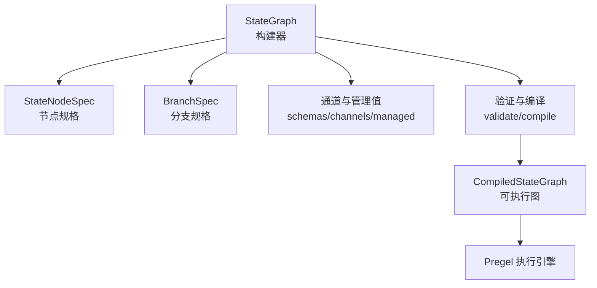
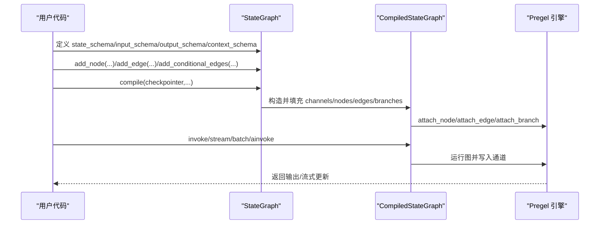
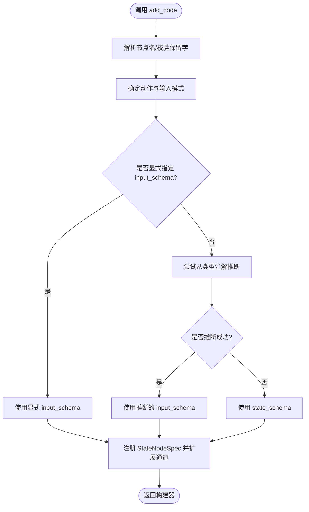
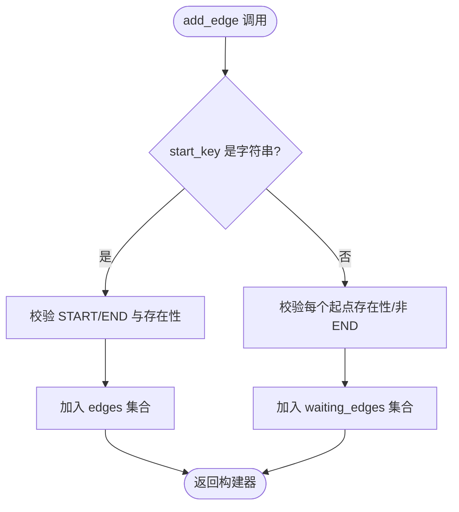
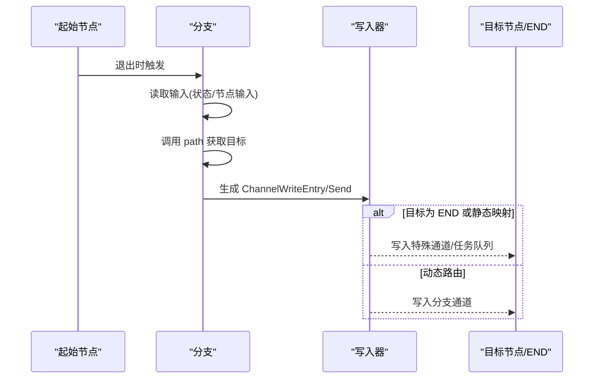
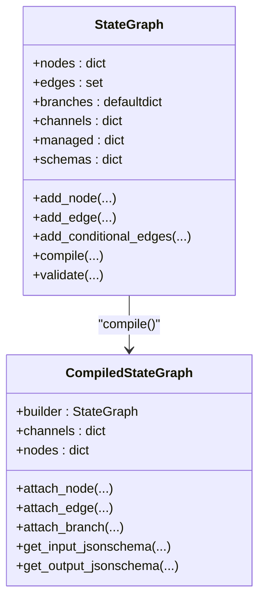
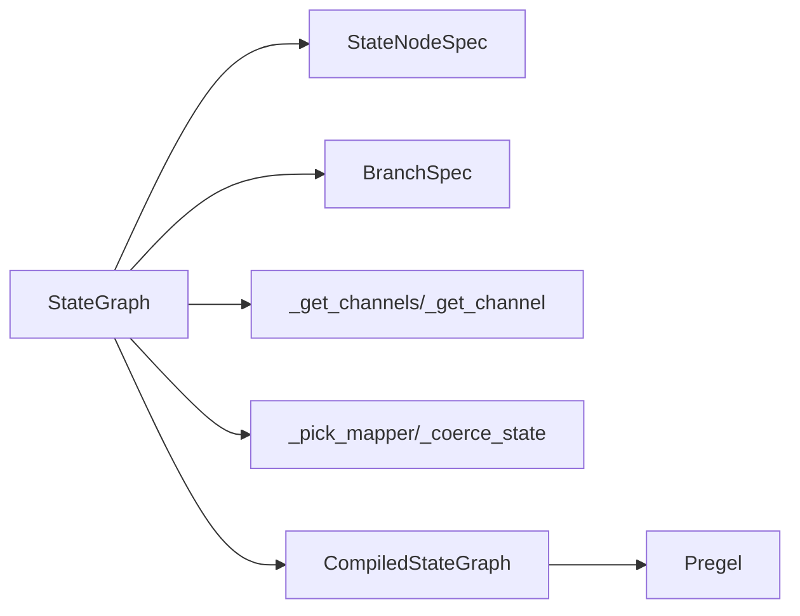

# StateGraph 构建器

<cite>
**本文引用的文件**
- [libs/langgraph/langgraph/graph/state.py](file://libs/langgraph/langgraph/graph/state.py)
- [libs/langgraph/langgraph/graph/_node.py](file://libs/langgraph/langgraph/graph/_node.py)
- [libs/langgraph/langgraph/graph/_branch.py](file://libs/langgraph/langgraph/graph/_branch.py)
- [libs/langgraph/tests/test_state.py](file://libs/langgraph/tests/test_state.py)
- [libs/cli/examples/graphs/agent.py](file://libs/cli/examples/graphs/agent.py)
</cite>

## 目录
1. [简介](#简介)
2. [项目结构](#项目结构)
3. [核心组件](#核心组件)
4. [架构总览](#架构总览)
5. [详细组件分析](#详细组件分析)
6. [依赖关系分析](#依赖关系分析)
7. [性能考量](#性能考量)
8. [故障排查指南](#故障排查指南)
9. [结论](#结论)
10. [附录：API 参考与最佳实践](#附录api-参考与最佳实践)

## 简介
本文件系统性阐述 StateGraph 构建器的设计与实现，覆盖以下关键主题：
- 节点添加机制：add_node 的多种重载形式、节点属性配置（元数据、重试策略、缓存策略、延迟执行、目的地提示）、输入输出模式推断。
- 边与路由系统：add_edge 单起点到单终点、多起点汇聚等待；条件边 add_conditional_edges 与动态路由；序列化便捷方法 add_sequence。
- 状态模式定义：通过 state_schema、input_schema、output_schema、context_schema 声明式定义状态键、通道与管理值，并自动推导通道布局。
- 编译过程：validate 校验图结构与中断点；compile 将构建器转换为可执行的 CompiledStateGraph，挂接节点、边、分支，准备通道与映射器。

## 项目结构
StateGraph 的核心实现位于 langgraph/graph/state.py，配套的节点规格与分支规范分别在 _node.py 与 _branch.py 中定义。测试与示例展示了典型用法与约束。

图表来源
- [libs/langgraph/langgraph/graph/state.py:115-184](file://libs/langgraph/langgraph/graph/state.py#L115-L184)
- [libs/langgraph/langgraph/graph/_node.py:84-93](file://libs/langgraph/langgraph/graph/_node.py#L84-L93)
- [libs/langgraph/langgraph/graph/_branch.py:83-121](file://libs/langgraph/langgraph/graph/_branch.py#L83-L121)

章节来源
- [libs/langgraph/langgraph/graph/state.py:115-184](file://libs/langgraph/langgraph/graph/state.py#L115-L184)

## 核心组件
- StateGraph：构建器类，负责节点、边、分支、通道与管理值的注册与校验，最终编译为可执行图。
- StateNodeSpec：封装单个节点的可运行体、输入模式、元数据、重试/缓存策略、静态/动态目的地提示等。
- BranchSpec：封装条件路径函数及其映射表、输入模式推断结果。
- CompiledStateGraph：编译产物，继承自 Pregel，承载通道、节点、边与分支的实际执行逻辑。

章节来源
- [libs/langgraph/langgraph/graph/state.py:115-184](file://libs/langgraph/langgraph/graph/state.py#L115-L184)
- [libs/langgraph/langgraph/graph/_node.py:84-93](file://libs/langgraph/langgraph/graph/_node.py#L84-L93)
- [libs/langgraph/langgraph/graph/_branch.py:83-121](file://libs/langgraph/langgraph/graph/_branch.py#L83-L121)

## 架构总览
StateGraph 在构建期将用户声明的状态模式与节点行为映射为通道与节点，编译期生成可执行的 Pregel 图。下图展示从构建到执行的关键交互：

图表来源
- [libs/langgraph/langgraph/graph/state.py:1038-1193](file://libs/langgraph/langgraph/graph/state.py#L1038-L1193)

## 详细组件分析

### 节点管理：add_node 与输入输出模式推断
- 多种重载形式支持：
  - 仅传入可运行体或函数，自动推断名称；
  - 显式传入节点名与动作；
  - 指定 input_schema 时按该模式注册；
  - 未指定时优先从类型注解推断，否则回退到 state_schema。
- 属性配置：
  - 元数据 metadata、重试策略 retry_policy、缓存策略 cache_policy；
  - defer 控制是否延迟执行；
  - destinations 提供可视化/渲染目的节点提示（不影响执行）。
- 输入输出模式推断：
  - 从动作签名的首个参数类型与返回值类型推断输入/命令返回的目的地集合；
  - 若返回值为命令类型且携带字面量目的地，将作为静态目的地集；
  - 注册节点时会将 input_schema 对应的通道加入全局通道表。
- 名称与保留字检查：
  - 不允许节点名为 START/END；
  - 不允许包含命名分隔符等保留字符。

图表来源
- [libs/langgraph/langgraph/graph/state.py:572-786](file://libs/langgraph/langgraph/graph/state.py#L572-L786)

章节来源
- [libs/langgraph/langgraph/graph/state.py:292-571](file://libs/langgraph/langgraph/graph/state.py#L292-L571)
- [libs/langgraph/langgraph/graph/state.py:572-786](file://libs/langgraph/langgraph/graph/state.py#L572-L786)

### 边与汇聚：add_edge 与等待边
- 单起点到单终点：直接建立边，等待起点完成后触发终点。
- 多起点汇聚：传入起点列表，内部记录等待边；当所有起点完成时，汇聚到终点。
- 关键约束：
  - 起点不能为 END，终点不能为 START；
  - 非 StateGraph 场景下，同一起点仅允许一条出边（可通过带注解的状态键实现多路输出）；
  - 已编译图上再加边不会反映到已编译实例中，仅影响后续编译。

图表来源
- [libs/langgraph/langgraph/graph/state.py:788-840](file://libs/langgraph/langgraph/graph/state.py#L788-L840)

章节来源
- [libs/langgraph/langgraph/graph/state.py:788-840](file://libs/langgraph/langgraph/graph/state.py#L788-L840)

### 条件边与动态路由：add_conditional_edges
- 支持两种模式：
  - 无 path_map：path 返回节点名或发送包（Send），直接路由；
  - 有 path_map：path 返回路径键，映射到具体节点名。
- 输入模式推断：
  - 从 path 的第一个参数类型注解推断输入模式；
  - 将分支输入模式加入全局模式表。
- 执行时序：
  - 分支在节点退出后触发；
  - 读取当前状态（或合并节点输入）作为分支输入；
  - 调用 path 得到目标集合，写入对应通道或发送包。

图表来源
- [libs/langgraph/langgraph/graph/state.py:842-890](file://libs/langgraph/langgraph/graph/state.py#L842-L890)
- [libs/langgraph/langgraph/graph/_branch.py:122-226](file://libs/langgraph/langgraph/graph/_branch.py#L122-L226)

章节来源
- [libs/langgraph/langgraph/graph/state.py:842-890](file://libs/langgraph/langgraph/graph/state.py#L842-L890)
- [libs/langgraph/langgraph/graph/_branch.py:83-121](file://libs/langgraph/langgraph/graph/_branch.py#L83-L121)

### 序列化便捷方法：add_sequence
- 接收有序节点序列，自动为每个节点命名并依次连接；
- 重复命名会报错；
- 适合线性流水线场景。

章节来源
- [libs/langgraph/langgraph/graph/state.py:892-937](file://libs/langgraph/langgraph/graph/state.py#L892-L937)

### 入口与结束点：set_entry_point 与 set_finish_point
- set_entry_point 等价于 add_edge(START, key)；
- set_finish_point 等价于 add_edge(key, END)；
- set_conditional_entry_point 为入口设置条件边。

章节来源
- [libs/langgraph/langgraph/graph/state.py:939-987](file://libs/langgraph/langgraph/graph/state.py#L939-L987)

### 状态模式定义与通道推导
- 通过 state_schema、input_schema、output_schema、context_schema 声明状态键与模式；
- _get_channels/_get_channel 解析 TypedDict/Pydantic/Dataclass 的字段，识别：
  - 普通通道（LastValue、BinaryOperatorAggregate 等）；
  - 管理值（受控不可写入通道）；
  - 可选键与 Required/NotRequired 包装；
- _add_schema 将通道与管理值注册到全局表，避免重复与冲突。

章节来源
- [libs/langgraph/langgraph/graph/state.py:260-291](file://libs/langgraph/langgraph/graph/state.py#L260-L291)
- [libs/langgraph/langgraph/graph/state.py:1603-1661](file://libs/langgraph/langgraph/graph/state.py#L1603-L1661)
- [libs/langgraph/langgraph/graph/state.py:1664-1715](file://libs/langgraph/langgraph/graph/state.py#L1664-L1715)

### 编译过程：validate 与 compile
- validate：
  - 校验所有边的源/汇节点存在；
  - 确保至少有一个从 START 出发的边；
  - 校验分支与节点的 ends 目标合法性；
  - 校验中断点列表。
- compile：
  - 构建 CompiledStateGraph，填充 channels（含 START/EphemeralValue/ManagedValue）、nodes；
  - 计算输出通道与流式通道；
  - attach_node/attach_edge/attach_branch；
  - 生成 JSON Schema（输入/输出）；
  - 返回可执行图。

图表来源
- [libs/langgraph/langgraph/graph/state.py:119-184](file://libs/langgraph/langgraph/graph/state.py#L119-L184)
- [libs/langgraph/langgraph/graph/state.py:1038-1193](file://libs/langgraph/langgraph/graph/state.py#L1038-L1193)

章节来源
- [libs/langgraph/langgraph/graph/state.py:989-1036](file://libs/langgraph/langgraph/graph/state.py#L989-L1036)
- [libs/langgraph/langgraph/graph/state.py:1038-1193](file://libs/langgraph/langgraph/graph/state.py#L1038-L1193)

## 依赖关系分析
- StateGraph 依赖：
  - _node.StateNodeSpec：节点规格；
  - _branch.BranchSpec：分支规格；
  - 内部工具：_get_channels/_get_channel、_pick_mapper、_coerce_state、_control_branch 等；
  - 执行引擎：Pregel（CompiledStateGraph 继承自 Pregel）。
- 关键耦合点：
  - 节点输入模式与通道布局强关联；
  - 分支输入模式与节点输入模式可不同，需独立推断；
  - 编译期将构建期的节点/边/分支映射为 Pregel 的节点/通道/写入器。

图表来源
- [libs/langgraph/langgraph/graph/state.py:1603-1753](file://libs/langgraph/langgraph/graph/state.py#L1603-L1753)
- [libs/langgraph/langgraph/graph/_node.py:84-93](file://libs/langgraph/langgraph/graph/_node.py#L84-L93)
- [libs/langgraph/langgraph/graph/_branch.py:83-121](file://libs/langgraph/langgraph/graph/_branch.py#L83-L121)

章节来源
- [libs/langgraph/langgraph/graph/state.py:1603-1753](file://libs/langgraph/langgraph/graph/state.py#L1603-L1753)
- [libs/langgraph/langgraph/graph/_node.py:84-93](file://libs/langgraph/langgraph/graph/_node.py#L84-L93)
- [libs/langgraph/langgraph/graph/_branch.py:83-121](file://libs/langgraph/langgraph/graph/_branch.py#L83-L121)

## 性能考量
- 节点输入模式与通道布局在编译期一次性确定，运行期避免重复反射开销；
- 单键根模式（__root__）可减少映射与序列化成本；
- 延迟执行（defer）配合屏障通道，避免不必要的状态写入；
- 分支与边的写入器在编译期绑定，运行期仅做轻量判断与写入。

## 故障排查指南
- “节点名必须提供”：当传入的动作既非字符串也无可用名称时会报错；
- “节点名保留”：节点名使用 START/END 或包含保留字符会报错；
- “重复节点”：同名节点重复添加会报错；
- “边起点/终点非法”：起点为 END、终点为 START，或多起点未先 add_node 会报错；
- “分支目标无效”：分支返回 START 或 END（Send 包含 END）会报错；
- “已编译后再变更”：对已编译图追加节点/边不会生效，仅影响后续编译；
- “输入/输出模式不匹配”：确保节点/分支的输入模式与 state_schema/input_schema/output_schema 一致或显式指定。

章节来源
- [libs/langgraph/langgraph/graph/state.py:676-700](file://libs/langgraph/langgraph/graph/state.py#L676-L700)
- [libs/langgraph/langgraph/graph/state.py:811-840](file://libs/langgraph/langgraph/graph/state.py#L811-L840)
- [libs/langgraph/langgraph/graph/state.py:200-253](file://libs/langgraph/langgraph/graph/state.py#L200-L253)
- [libs/langgraph/langgraph/graph/_branch.py:192-225](file://libs/langgraph/langgraph/graph/_branch.py#L192-L225)

## 结论
StateGraph 通过声明式状态模式与构建期严格校验，将复杂的状态流转与条件路由抽象为可编译、可调试、可持久化的执行图。其 add_node/add_edge/add_conditional_edges 的组合提供了强大的图构建能力，结合编译期优化与运行期 Pregel 引擎，能够高效支撑长生命周期、高可靠性的状态化工作流与智能体。

## 附录：API 参考与最佳实践

### API 参考

- 构造函数
  - 参数
    - state_schema：状态模式（必需）
    - context_schema：运行时上下文模式（可选）
    - input_schema：输入模式（可选，默认等于 state_schema）
    - output_schema：输出模式（可选，默认等于 state_schema）
  - 返回：StateGraph 实例
  - 异常：若 input/output/context 的旧参数被使用，将发出弃用警告

- add_node
  - 重载形式
    - 仅动作：自动推断名称
    - (name, 动作)
    - (动作, input_schema)
    - (name, 动作, input_schema)
  - 关键参数
    - defer：延迟执行
    - metadata：节点元数据
    - retry_policy/cache_policy：重试/缓存策略
    - destinations：可视化/渲染目的提示（不影响执行）
  - 返回：Self（支持链式调用）
  - 异常：节点名非法、重复、已编译后再添加

- add_edge
  - 参数
    - start_key：字符串或字符串列表
    - end_key：字符串
  - 行为：单起点直接边；多起点汇聚等待
  - 返回：Self
  - 异常：START/END 使用错误、节点不存在

- add_conditional_edges
  - 参数
    - source：起始节点
    - path：返回目标的可运行体/可调用
    - path_map：可选映射（字典或节点名列表）
  - 返回：Self
  - 异常：分支名重复、目标非法

- add_sequence
  - 参数
    - nodes：节点或(name, 节点)元组序列
  - 返回：Self
  - 异常：空序列、重复命名

- set_entry_point/set_finish_point/set_conditional_entry_point
  - 行为：便捷设置入口/结束/条件入口
  - 返回：Self

- validate
  - 行为：校验图结构、中断点、分支与节点目标
  - 返回：Self

- compile
  - 参数
    - checkpointer：检查点保存器或标志
    - interrupt_before/interrupt_after：中断点
    - debug/name/store/cache：调试与命名
  - 返回：CompiledStateGraph

- JSON Schema 查询
  - get_input_jsonschema/get_output_jsonschema：基于模式与通道生成 JSON Schema

章节来源
- [libs/langgraph/langgraph/graph/state.py:200-253](file://libs/langgraph/langgraph/graph/state.py#L200-L253)
- [libs/langgraph/langgraph/graph/state.py:292-571](file://libs/langgraph/langgraph/graph/state.py#L292-L571)
- [libs/langgraph/langgraph/graph/state.py:572-786](file://libs/langgraph/langgraph/graph/state.py#L572-L786)
- [libs/langgraph/langgraph/graph/state.py:788-840](file://libs/langgraph/langgraph/graph/state.py#L788-L840)
- [libs/langgraph/langgraph/graph/state.py:842-890](file://libs/langgraph/langgraph/graph/state.py#L842-L890)
- [libs/langgraph/langgraph/graph/state.py:892-987](file://libs/langgraph/langgraph/graph/state.py#L892-L987)
- [libs/langgraph/langgraph/graph/state.py:989-1036](file://libs/langgraph/langgraph/graph/state.py#L989-L1036)
- [libs/langgraph/langgraph/graph/state.py:1038-1193](file://libs/langgraph/langgraph/graph/state.py#L1038-L1193)
- [libs/langgraph/langgraph/graph/state.py:1216-1234](file://libs/langgraph/langgraph/graph/state.py#L1216-L1234)

### 最佳实践
- 明确声明 input_schema/output_schema，避免运行期类型推断带来的不确定性；
- 使用 TypedDict/Pydantic/Dataclass 的 Required/NotRequired 精准表达必填/可选键；
- 对多路输出使用带注解的状态键，而非在非 StateGraph 场景下重复出边；
- 条件边尽量提供 path_map 或明确返回字面量类型，便于可视化与静态分析；
- 对长流程使用 add_sequence 简化线性编排；
- 合理使用 defer 与屏障通道，减少不必要的状态写入；
- 对需要人类干预的节点设置中断点，便于调试与治理。

### 使用示例（路径）
- 基础循环与条件边示例：[libs/cli/examples/graphs/agent.py:58-96](file://libs/cli/examples/graphs/agent.py#L58-L96)
- 多模式输入/输出与 JSON Schema 示例：[libs/langgraph/tests/test_state.py:102-136](file://libs/langgraph/tests/test_state.py#L102-L136)