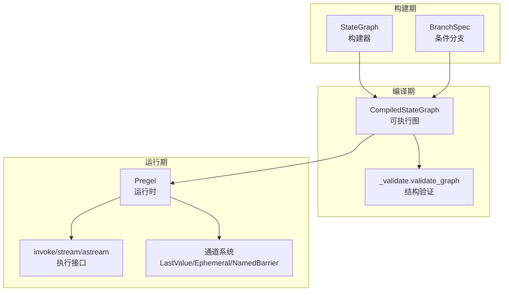
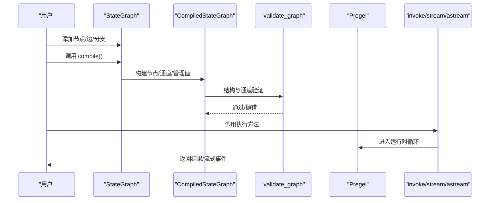
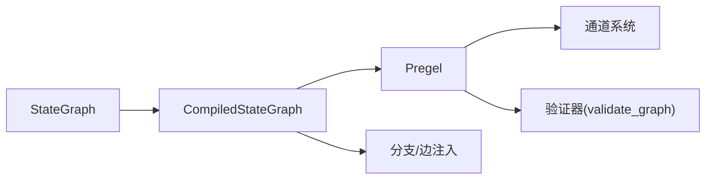

# 图编译过程

<cite>
**本文引用的文件**
- [libs/langgraph/langgraph/graph/state.py](file://libs/langgraph/langgraph/graph/state.py)
- [libs/langgraph/langgraph/pregel/_validate.py](file://libs/langgraph/langgraph/pregel/_validate.py)
- [libs/langgraph/langgraph/pregel/main.py](file://libs/langgraph/langgraph/pregel/main.py)
- [libs/langgraph/langgraph/pregel/protocol.py](file://libs/langgraph/langgraph/pregel/protocol.py)
- [libs/langgraph/langgraph/pregel/_draw.py](file://libs/langgraph/langgraph/pregel/_draw.py)
- [libs/langgraph/langgraph/channels/named_barrier_value.py](file://libs/langgraph/langgraph/channels/named_barrier_value.py)
- [libs/langgraph/tests/test_stream_v2.py](file://libs/langgraph/tests/test_stream_v2.py)
</cite>

## 目录
1. [简介](#简介)
2. [项目结构](#项目结构)
3. [核心组件](#核心组件)
4. [架构总览](#架构总览)
5. [详细组件分析](#详细组件分析)
6. [依赖分析](#依赖分析)
7. [性能考量](#性能考量)
8. [故障排查指南](#故障排查指南)
9. [结论](#结论)
10. [附录：API 参考](#附录api-参考)

## 简介
本文件系统化阐述 LangGraph 中“图编译过程”的实现原理与执行细节，围绕 StateGraph 的 compile 方法展开，覆盖以下主题：
- 编译步骤：从构建器到可执行图的完整流程
- 图结构验证：节点、边、分支、中断点的合法性校验
- 节点连接性检查：输入/输出通道订阅关系
- 边路由验证：条件分支与静态边的正确性
- 通道系统初始化：状态键、管理值、Ephemeral/LastValue 等通道类型
- 错误处理与警告：保留名冲突、非法通道引用、递归限制等
- 优化策略：序列化白名单、延迟执行、并发流式
- 执行接口：invoke、stream、astream 的行为与参数
- 调试技巧与最佳实践：断点、调试模式、子图流式

## 项目结构
与图编译直接相关的模块与职责如下：
- graph/state.py：定义 StateGraph 构建器与编译入口，负责节点/边/分支注册、模式推断、通道与管理值收集、编译为可执行图
- pregel/_validate.py：对编译后的图进行结构与通道一致性验证
- pregel/main.py：Pregel 运行时实现，包含 invoke/stream/astream 等执行方法、流式输出与检查点逻辑
- pregel/protocol.py：运行时协议与方法签名（invoke/astream）
- pregel/_draw.py：图绘制与子图替换逻辑
- channels/named_barrier_value.py：命名屏障通道的更新/消费/完成语义
- tests/test_stream_v2.py：子图编译与流式集成测试用例

图表来源
- [libs/langgraph/langgraph/graph/state.py](file://libs/langgraph/langgraph/graph/state.py)
- [libs/langgraph/langgraph/pregel/_validate.py](file://libs/langgraph/langgraph/pregel/_validate.py)
- [libs/langgraph/langgraph/pregel/main.py](file://libs/langgraph/langgraph/pregel/main.py)

章节来源
- [libs/langgraph/langgraph/graph/state.py](file://libs/langgraph/langgraph/graph/state.py)
- [libs/langgraph/langgraph/pregel/_validate.py](file://libs/langgraph/langgraph/pregel/_validate.py)
- [libs/langgraph/langgraph/pregel/main.py](file://libs/langgraph/langgraph/pregel/main.py)

## 核心组件
- StateGraph：图构建器，负责节点、边、分支、模式与通道的注册与收集；提供 compile 方法生成可执行图
- CompiledStateGraph：编译产物，继承自 Pregel，封装节点、通道、管理值、中断配置与输出/流式通道
- Pregel：运行时内核，实现 invoke/stream/astream 的主循环、任务调度、写入应用、检查点与流式事件
- 验证器：validate_graph 检查保留名、通道存在性、输入/输出订阅关系、中断节点合法性
- 通道系统：LastValue、EphemeralValue、NamedBarrierValue 等，支撑状态聚合、一次性触发与多路汇聚

章节来源
- [libs/langgraph/langgraph/graph/state.py](file://libs/langgraph/langgraph/graph/state.py)
- [libs/langgraph/langgraph/pregel/_validate.py](file://libs/langgraph/langgraph/pregel/_validate.py)
- [libs/langgraph/langgraph/pregel/main.py](file://libs/langgraph/langgraph/pregel/main.py)

## 架构总览
下图展示从构建器到可执行图再到运行时的端到端流程。

图表来源
- [libs/langgraph/langgraph/graph/state.py](file://libs/langgraph/langgraph/graph/state.py)
- [libs/langgraph/langgraph/pregel/_validate.py](file://libs/langgraph/langgraph/pregel/_validate.py)
- [libs/langgraph/langgraph/pregel/main.py](file://libs/langgraph/langgraph/pregel/main.py)

## 详细组件分析

### 1) 编译入口与编译步骤
- 入口：StateGraph.compile
  - 参数：checkpointer、cache、store、interrupt_before/after、debug、name
  - 行为：校验图结构（validate）、推导输出/流式通道、构造 CompiledStateGraph、填充节点/边/分支、调用 validate
- 关键步骤：
  - 输出通道与流式通道推导：基于输出/状态模式的键集合
  - START 节点注入：作为隐式入口，绑定输入模式
  - 节点注入：attach_node 将每个 StateNodeSpec 包装为 PregelNode，并建立触发/写入通道
  - 边注入：attach_edge 建立汇聚/分发通道（NamedBarrierValue 等）
  - 分支注入：attach_branch 注册条件分支写入器
  - 序列化白名单：在严格消息编码模式下收集允许的类型，用于检查点序列化

章节来源
- [libs/langgraph/langgraph/graph/state.py](file://libs/langgraph/langgraph/graph/state.py)

### 2) 图结构验证
- validate_graph 校验：
  - 保留名冲突：通道/管理值/节点名不得使用保留标识
  - 节点订阅：节点读取的通道必须存在于已知通道或管理值中
  - 输入通道：必须存在且至少被一个节点订阅
  - 输出通道：必须存在（输出/流式通道集合）
  - 中断节点：仅允许存在于节点集合中
- StateGraph.validate 补充：
  - 边源/目标合法性：起止节点必须存在（除 START/END 外）
  - 条件分支目标：若 ends 显式指定则必须有效，否则默认可通向所有节点或 END
  - 入口约束：必须存在从 START 出发的边

章节来源
- [libs/langgraph/langgraph/pregel/_validate.py](file://libs/langgraph/langgraph/pregel/_validate.py)
- [libs/langgraph/langgraph/graph/state.py](file://libs/langgraph/langgraph/graph/state.py)

### 3) 节点连接性检查
- 输入订阅：节点 channels 必须指向已声明通道或管理值
- 触发链路：节点 triggers 必须对应已存在的通道
- START 特例：START 通道由输入模式注入，作为初始触发源
- 单/多输入：单键 __root__ 与多键模式分别映射不同读取路径

章节来源
- [libs/langgraph/langgraph/graph/state.py](file://libs/langgraph/langgraph/graph/state.py)
- [libs/langgraph/langgraph/pregel/_validate.py](file://libs/langgraph/langgraph/pregel/_validate.py)

### 4) 边路由验证
- 静态边：add_edge 支持单源或多源汇聚，多源时自动插入命名屏障通道
- 条件分支：attach_branch 注册分支写入器，分支目标可显式 ends 或动态 Command
- 命名屏障：NamedBarrierValue/AfterFinish 保证多路汇聚的完成语义
- 子图替换：_draw.replace_subgraphs 在绘制阶段将子图节点替换为扩展后的子图

章节来源
- [libs/langgraph/langgraph/graph/state.py](file://libs/langgraph/langgraph/graph/state.py)
- [libs/langgraph/langgraph/pregel/_draw.py](file://libs/langgraph/langgraph/pregel/_draw.py)
- [libs/langgraph/langgraph/channels/named_barrier_value.py](file://libs/langgraph/langgraph/channels/named_barrier_value.py)

### 5) 通道系统初始化
- 输入通道：START 使用 EphemeralValue 绑定输入模式
- 状态通道：从 state/input/output 模式推导的键集合，按需注册 LastValue/EphemeralValue
- 管理值：从模式中提取的管理值注册到 managed 字典
- 分支通道：每个节点注入 branch:to:{node} 通道，控制分支发布
- 汇聚通道：多源边注入 join:{starts}:{end} 命名屏障通道

章节来源
- [libs/langgraph/langgraph/graph/state.py](file://libs/langgraph/langgraph/graph/state.py)

### 6) 错误处理与警告机制
- 保留名冲突：通道/管理值/节点名使用保留标识时抛出异常
- 通道缺失：节点引用不存在的通道或管理值时抛出异常
- 输入未订阅：输入通道未被任何节点订阅时抛出异常
- 输出通道缺失：输出/流式通道不存在时抛出异常
- 中断节点无效：中断列表中的节点不在节点集合时抛出异常
- 递归限制：运行时达到 recursion_limit 未停止时抛出 GraphRecursionError
- 警告：过时参数与模式（如 config_schema/input/output）发出弃用警告

章节来源
- [libs/langgraph/langgraph/pregel/_validate.py](file://libs/langgraph/langgraph/pregel/_validate.py)
- [libs/langgraph/langgraph/pregel/main.py](file://libs/langgraph/langgraph/pregel/main.py)
- [libs/langgraph/langgraph/graph/state.py](file://libs/langgraph/langgraph/graph/state.py)

### 7) 优化策略
- 序列化白名单：在严格消息编码模式下收集允许的类型，减少检查点序列化开销
- 延迟执行：defer 标记的节点使用 LastValueAfterFinish，避免提前触发
- 并发流式：根据流式模式与子图开启并发等待器，提升吞吐
- 缓存与存储：通过 cache/store 参数注入缓存与持久化存储

章节来源
- [libs/langgraph/langgraph/graph/state.py](file://libs/langgraph/langgraph/graph/state.py)
- [libs/langgraph/langgraph/pregel/main.py](file://libs/langgraph/langgraph/pregel/main.py)

### 8) 执行方法：invoke、stream、astream
- 同步执行（invoke）：进入同步运行循环，应用写入，生成最终输出
- 流式执行（stream/astream）：按步骤产生事件，支持多种模式（values/updates/custom/messages/checkpoints/tasks/debug），可选择子图事件与打印模式
- 断点与调试：通过 interrupt_before/interrupt_after 控制中断，debug 模式输出更详细信息
- 子图流式：当 subgraphs=True 时，嵌套子图事件以命名空间形式输出

章节来源
- [libs/langgraph/langgraph/pregel/main.py](file://libs/langgraph/langgraph/pregel/main.py)
- [libs/langgraph/langgraph/pregel/protocol.py](file://libs/langgraph/langgraph/pregel/protocol.py)

### 9) 子图编译与集成
- 子图编译：在父图中添加子图为节点，子图自身 compile 后作为复合图的一部分
- 子图流式：父图在流式时可选择是否透传子图事件
- 测试用例：test_stream_v2 展示了内外层图的组合与编译

章节来源
- [libs/langgraph/tests/test_stream_v2.py](file://libs/langgraph/tests/test_stream_v2.py)
- [libs/langgraph/langgraph/graph/state.py](file://libs/langgraph/langgraph/graph/state.py)

## 依赖分析
- 构建器依赖：StateGraph 依赖通道与管理值解析、模式推断、分支规格
- 编译产物：CompiledStateGraph 依赖 Pregel 运行时、通道系统、写入器/读取器
- 运行时依赖：Pregel 依赖检查点、队列、回调、流式处理器、算法与写入应用
- 验证器：validate_graph 依赖常量与保留名集合

图表来源
- [libs/langgraph/langgraph/graph/state.py](file://libs/langgraph/langgraph/graph/state.py)
- [libs/langgraph/langgraph/pregel/_validate.py](file://libs/langgraph/langgraph/pregel/_validate.py)
- [libs/langgraph/langgraph/pregel/main.py](file://libs/langgraph/langgraph/pregel/main.py)

章节来源
- [libs/langgraph/langgraph/graph/state.py](file://libs/langgraph/langgraph/graph/state.py)
- [libs/langgraph/langgraph/pregel/_validate.py](file://libs/langgraph/langgraph/pregel/_validate.py)
- [libs/langgraph/langgraph/pregel/main.py](file://libs/langgraph/langgraph/pregel/main.py)

## 性能考量
- 编译性能：大规模节点/边/分支会增加编译时间，建议在开发阶段减少不必要的复杂度
- 流式性能：启用并发等待器与 eager 流式可降低首事件延迟，但会增加上下文切换成本
- 检查点：频繁写入检查点会带来 I/O 开销，合理设置 durability 与线程池大小
- 序列化：严格消息编码下的 serde 白名单可减少序列化开销，但需要维护类型集合

## 故障排查指南
- 保留名冲突：检查通道/管理值/节点名是否使用了保留标识
- 通道缺失：确认节点 channels 与 triggers 引用的通道是否已在模式中注册
- 输入未订阅：确保输入通道至少被一个节点订阅
- 输出通道缺失：确认输出/流式通道集合中的键均存在
- 中断节点无效：确认中断列表中的节点名称存在于节点集合
- 递归限制：适当提高 recursion_limit 或修复导致无限循环的逻辑
- 子图问题：确认子图编译成功且事件流式开关配置正确

章节来源
- [libs/langgraph/langgraph/pregel/_validate.py](file://libs/langgraph/langgraph/pregel/_validate.py)
- [libs/langgraph/langgraph/pregel/main.py](file://libs/langgraph/langgraph/pregel/main.py)

## 结论
LangGraph 的图编译过程将构建器阶段的声明式图转换为运行时高效的可执行图，通过严格的结构验证、通道系统初始化与优化策略，确保图在执行期具备良好的性能与可维护性。结合丰富的流式模式与子图能力，开发者可以灵活地构建复杂的多节点协作流程。

## 附录：API 参考

### StateGraph.compile
- 功能：将 StateGraph 编译为可执行图
- 参数
  - checkpointer：检查点保存器或标志
  - cache：缓存实例
  - store：持久化存储实例
  - interrupt_before：执行前中断的节点列表
  - interrupt_after：执行后中断的节点列表
  - debug：是否启用调试模式
  - name：编译后图的名称
- 返回：CompiledStateGraph
- 异常：结构或通道不合法时抛出异常
- 示例：见测试用例中子图编译与流式调用

章节来源
- [libs/langgraph/langgraph/graph/state.py](file://libs/langgraph/langgraph/graph/state.py)
- [libs/langgraph/tests/test_stream_v2.py](file://libs/langgraph/tests/test_stream_v2.py)

### Pregel.invoke
- 功能：同步执行一次完整推理
- 参数：input、config、context、interrupt_before、interrupt_after、version
- 返回：最终输出
- 异常：递归限制、节点错误等

章节来源
- [libs/langgraph/langgraph/pregel/protocol.py](file://libs/langgraph/langgraph/pregel/protocol.py)
- [libs/langgraph/langgraph/pregel/main.py](file://libs/langgraph/langgraph/pregel/main.py)

### Pregel.stream / astream
- 功能：流式输出中间结果
- 参数
  - input、config、context
  - stream_mode：values/updates/custom/messages/checkpoints/tasks/debug 或其组合
  - print_mode：仅打印调试信息
  - output_keys：限定输出键
  - interrupt_before/interrupt_after：中断控制
  - durability：sync/async/exit
  - subgraphs：是否包含子图事件
  - version：v1/v2
- 返回：迭代器（同步/异步）
- 异常：同上

章节来源
- [libs/langgraph/langgraph/pregel/main.py](file://libs/langgraph/langgraph/pregel/main.py)
- [libs/langgraph/langgraph/pregel/protocol.py](file://libs/langgraph/langgraph/pregel/protocol.py)

### 验证器 validate_graph
- 功能：编译后结构与通道一致性检查
- 校验项：保留名、节点订阅、输入/输出通道、中断节点

章节来源
- [libs/langgraph/langgraph/pregel/_validate.py](file://libs/langgraph/langgraph/pregel/_validate.py)