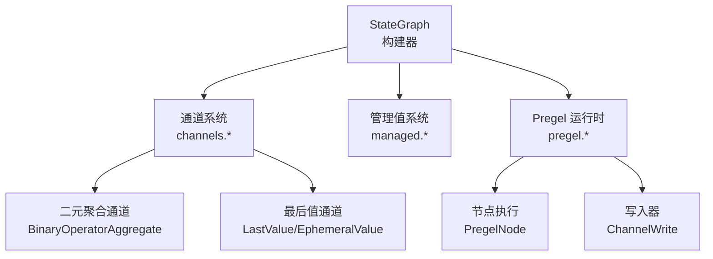
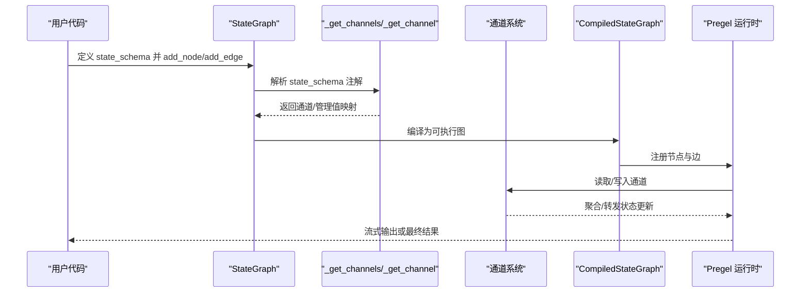
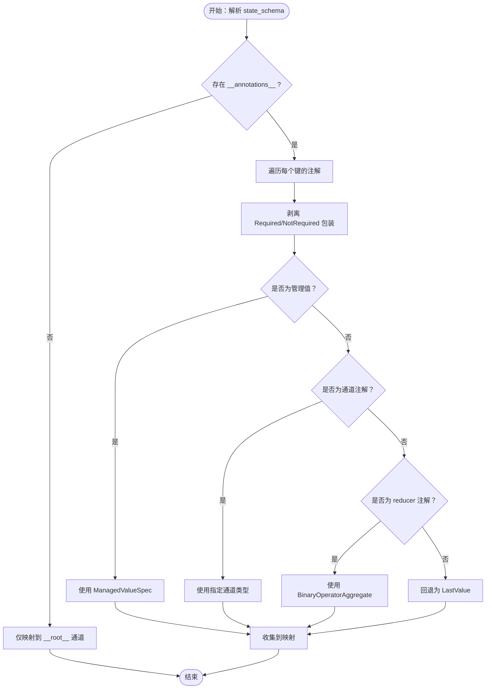
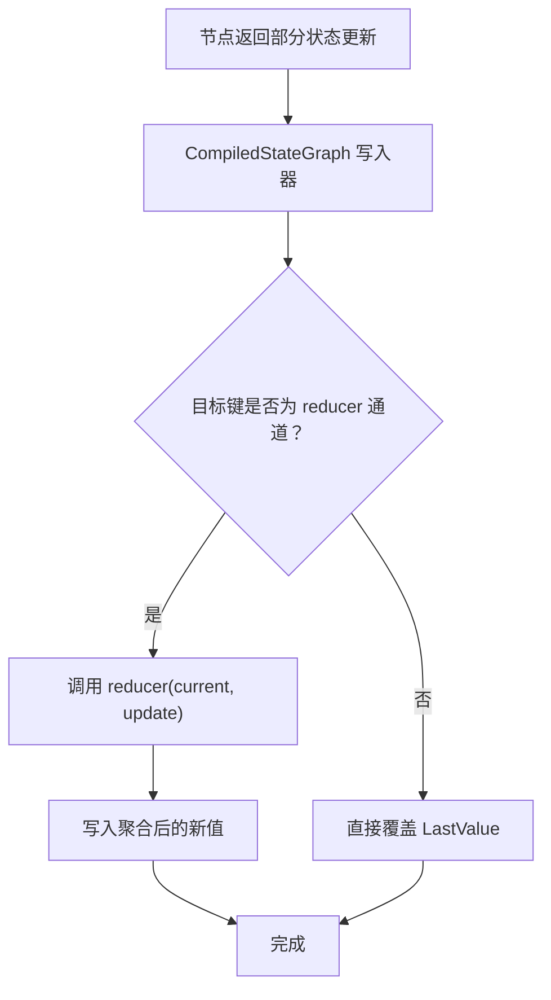
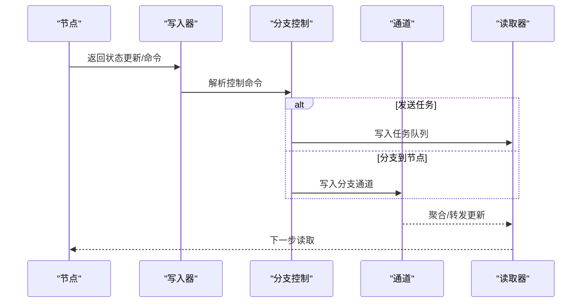
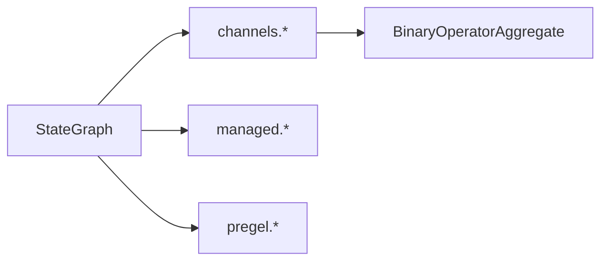

# 状态模式定义

<cite>
**本文引用的文件**
- [libs/langgraph/langgraph/graph/state.py](file://libs/langgraph/langgraph/graph/state.py)
- [libs/langgraph/tests/test_state.py](file://libs/langgraph/tests/test_state.py)
- [libs/langgraph/langgraph/pregel/_validate.py](file://libs/langgraph/langgraph/pregel/_validate.py)
- [libs/langgraph/langgraph/channels/binop.py](file://libs/langgraph/langgraph/channels/binop.py)
- [libs/langgraph/langgraph/channels/__init__.py](file://libs/langgraph/langgraph/channels/__init__.py)
- [libs/langgraph/langgraph/_internal/_fields.py](file://libs/langgraph/langgraph/_internal/_fields.py)
- [libs/langgraph/tests/test_channels.py](file://libs/langgraph/tests/test_channels.py)
</cite>

## 目录
1. [简介](#简介)
2. [项目结构](#项目结构)
3. [核心组件](#核心组件)
4. [架构总览](#架构总览)
5. [详细组件分析](#详细组件分析)
6. [依赖分析](#依赖分析)
7. [性能考虑](#性能考虑)
8. [故障排查指南](#故障排查指南)
9. [结论](#结论)
10. [附录：API 参考](#附录api-参考)

## 简介
本文件系统性阐述 langgraph 中“状态模式”的设计与实现，重点围绕 state_schema 的定义方式、reducer 函数的作用机制、类型注解（TypedDict/Annotated）的使用、状态模式验证、通道系统集成、管理值处理、以及状态与通道的映射关系。文档同时给出数据流处理与状态更新机制的流程图与序列图，并提供 API 参考、最佳实践与常见模式。

## 项目结构
与状态模式相关的核心代码位于 langgraph/graph/state.py，配套的通道系统在 langgraph/channels 下，运行时验证逻辑在 pregel/_validate.py，字段默认值与 Required/NotRequired 解析在_langgraph/_internal/_fields.py。测试用例覆盖了状态模式的多种使用场景与边界条件。

图表来源
- [libs/langgraph/langgraph/graph/state.py:115-250](file://libs/langgraph/langgraph/graph/state.py#L115-L250)
- [libs/langgraph/langgraph/channels/__init__.py:1-27](file://libs/langgraph/langgraph/channels/__init__.py#L1-L27)

章节来源
- [libs/langgraph/langgraph/graph/state.py:115-250](file://libs/langgraph/langgraph/graph/state.py#L115-L250)

## 核心组件
- StateGraph：状态图构建器，负责将 state_schema 映射为通道与管理值，生成可执行的 CompiledStateGraph。
- 通道系统：LastValue、EphemeralValue、BinaryOperatorAggregate、Topic 等，用于承载状态键的读写与聚合。
- 管理值系统：通过 Annotated 的 ManagedValueSpec 标注，声明运行期可注入的不可直接写入的状态片段。
- Pregel 运行时：将节点、通道、分支连接成可执行的流式图，支持中断、检查点、批量等能力。

章节来源
- [libs/langgraph/langgraph/graph/state.py:115-250](file://libs/langgraph/langgraph/graph/state.py#L115-L250)
- [libs/langgraph/langgraph/channels/__init__.py:1-27](file://libs/langgraph/langgraph/channels/__init__.py#L1-L27)

## 架构总览
下图展示从 state_schema 到通道映射、再到运行时节点写入与聚合的全链路：

图表来源
- [libs/langgraph/langgraph/graph/state.py:1603-1661](file://libs/langgraph/langgraph/graph/state.py#L1603-L1661)
- [libs/langgraph/langgraph/graph/state.py:1196-1203](file://libs/langgraph/langgraph/graph/state.py#L1196-L1203)
- [libs/langgraph/langgraph/pregel/_validate.py:13-121](file://libs/langgraph/langgraph/pregel/_validate.py#L13-L121)

## 详细组件分析

### 1) state_schema 设计与解析
- TypedDict 支持：通过类型注解定义状态键；支持 Required/NotRequired、Annotated 元数据、嵌套父类等。
- Annotated reducer：当某键标注为 Annotated[Type, reducer_func]，该键将被映射为 BinaryOperatorAggregate 通道，reducer 作为二元聚合操作。
- 通道推断：未显式标注的键默认映射为 LastValue 通道；若标注为 EphemeralValue 或其他通道类，则按通道类型处理。
- 管理值：通过 ManagedValueSpec 标注的键不参与输入/输出 schema 的直接写入，仅在运行时注入。

图表来源
- [libs/langgraph/langgraph/graph/state.py:1603-1661](file://libs/langgraph/langgraph/graph/state.py#L1603-L1661)
- [libs/langgraph/langgraph/graph/state.py:1664-1715](file://libs/langgraph/langgraph/graph/state.py#L1664-L1715)

章节来源
- [libs/langgraph/langgraph/graph/state.py:1603-1715](file://libs/langgraph/langgraph/graph/state.py#L1603-L1715)
- [libs/langgraph/langgraph/_internal/_fields.py:40-80](file://libs/langgraph/langgraph/_internal/_fields.py#L40-L80)

### 2) reducer 函数的作用机制
- reducer 必须满足二元签名 (a, b) -> c，且类型兼容。
- 当某键标注为 Annotated[Type, reducer]，该键对应的通道为 BinaryOperatorAggregate，新值到来时通过 reducer 聚合至当前值。
- 若 reducer 签名不合法，将抛出错误提示。

图表来源
- [libs/langgraph/langgraph/graph/state.py:1286-1297](file://libs/langgraph/langgraph/graph/state.py#L1286-L1297)
- [libs/langgraph/langgraph/channels/binop.py:53-86](file://libs/langgraph/langgraph/channels/binop.py#L53-L86)

章节来源
- [libs/langgraph/langgraph/channels/binop.py:53-86](file://libs/langgraph/langgraph/channels/binop.py#L53-L86)
- [libs/langgraph/langgraph/graph/state.py:1678-1696](file://libs/langgraph/langgraph/graph/state.py#L1678-L1696)

### 3) 类型注解与 JSON Schema 生成
- 对于 Pydantic 模型与 TypedDict，分别采用 model_json_schema 与 TypeAdapter.json_schema 生成输入/输出 JSON Schema。
- 非 Pydantic/TypedDict 的自定义 schema：根据通道的 UpdateType 与默认值生成字段定义。
- Required/NotRequired 与 Annotated 元数据影响 required 字段集合与可选字段集合。

章节来源
- [libs/langgraph/langgraph/graph/state.py:1718-1753](file://libs/langgraph/langgraph/graph/state.py#L1718-L1753)
- [libs/langgraph/tests/test_state.py:138-203](file://libs/langgraph/tests/test_state.py#L138-L203)

### 4) 状态模式验证与通道系统集成
- 编译阶段对通道名称、节点名称、订阅关系进行校验，确保输入/输出通道存在且被订阅。
- 不允许使用保留名；节点必须在已知通道中读取；订阅通道必须存在于通道表中。
- 输出通道集合由输出 schema 的通道键决定；流式通道集合由状态 schema 的通道键决定。

章节来源
- [libs/langgraph/langgraph/pregel/_validate.py:13-121](file://libs/langgraph/langgraph/pregel/_validate.py#L13-L121)

### 5) 管理值处理
- 管理值通过 ManagedValueSpec 标注，不参与输入/输出 schema 的直接写入，但可在运行时注入。
- 在输入 schema 中不允许出现管理值；在状态/输出 schema 中允许。
- 管理值与通道键冲突时会触发错误。

章节来源
- [libs/langgraph/langgraph/graph/state.py:260-290](file://libs/langgraph/langgraph/graph/state.py#L260-L290)
- [libs/langgraph/langgraph/graph/state.py:1699-1715](file://libs/langgraph/langgraph/graph/state.py#L1699-L1715)

### 6) 数据流处理与状态更新机制
- 节点返回值会被转换为更新项序列：字典键值对、Command、或符合 Annotated 键集的结构。
- 单键根模式（__root__）时，直接写入根值；多键模式时按键过滤后写入对应通道。
- 控制分支：支持 Command.goto、Command.parent 等控制指令，将任务发送到任务队列或跳转到指定节点。

图表来源
- [libs/langgraph/langgraph/graph/state.py:1248-1297](file://libs/langgraph/langgraph/graph/state.py#L1248-L1297)
- [libs/langgraph/langgraph/graph/state.py:1537-1577](file://libs/langgraph/langgraph/graph/state.py#L1537-L1577)

章节来源
- [libs/langgraph/langgraph/graph/state.py:1248-1297](file://libs/langgraph/langgraph/graph/state.py#L1248-L1297)
- [libs/langgraph/langgraph/graph/state.py:1537-1577](file://libs/langgraph/langgraph/graph/state.py#L1537-L1577)

### 7) 边缘与约束
- 输入 schema 不允许包含管理值；输出/状态 schema 可包含。
- reducer 必须为二元签名；否则报错。
- 通道名与节点名不得使用保留字符；节点名不得为 START/END。
- 条件边与序列边的组合需满足唯一节点名与可达性约束。

章节来源
- [libs/langgraph/langgraph/graph/state.py:260-290](file://libs/langgraph/langgraph/graph/state.py#L260-L290)
- [libs/langgraph/langgraph/graph/state.py:1678-1696](file://libs/langgraph/langgraph/graph/state.py#L1678-L1696)
- [libs/langgraph/langgraph/pregel/_validate.py:23-59](file://libs/langgraph/langgraph/pregel/_validate.py#L23-L59)

## 依赖分析
- StateGraph 依赖通道系统与管理值系统，编译时将 schema 转换为通道与管理值映射。
- 运行时依赖 Pregel 将节点、通道、分支连接为可执行图。
- reducer 依赖通道系统中的 BinaryOperatorAggregate 实现二元聚合。

图表来源
- [libs/langgraph/langgraph/graph/state.py:115-250](file://libs/langgraph/langgraph/graph/state.py#L115-L250)
- [libs/langgraph/langgraph/channels/binop.py:53-86](file://libs/langgraph/langgraph/channels/binop.py#L53-L86)

章节来源
- [libs/langgraph/langgraph/graph/state.py:115-250](file://libs/langgraph/langgraph/graph/state.py#L115-L250)

## 性能考虑
- 使用 BinaryOperatorAggregate 时，reducer 的计算复杂度直接影响聚合成本；建议保持 reducer 纯函数且尽量轻量。
- 多输入汇聚（NamedBarrierValue）在等待所有上游完成后才触发下游，可能带来延迟；可通过合理的图拓扑减少等待。
- 流式输出与检查点的启用会增加序列化/反序列化开销；在严格模式下启用 serde 白名单可提升安全性与性能。

## 故障排查指南
- “无效 reducer 签名”：检查 reducer 是否为二元签名，且类型兼容。
- “通道名/节点名保留”：避免使用保留字符与保留名。
- “输入通道未订阅”：确认输入通道至少被一个节点订阅。
- “节点返回值类型不匹配”：确保节点返回值为字典、命令或符合 Annotated 键集的结构。

章节来源
- [libs/langgraph/langgraph/graph/state.py:1678-1696](file://libs/langgraph/langgraph/graph/state.py#L1678-L1696)
- [libs/langgraph/langgraph/pregel/_validate.py:23-98](file://libs/langgraph/langgraph/pregel/_validate.py#L23-L98)

## 结论
langgraph 的状态模式通过 state_schema 将状态键与通道/管理值绑定，reducer 提供可组合的聚合能力，配合 Pregel 的流式执行模型，实现了高扩展性的状态驱动图。合理使用 TypedDict/Annotated、遵循 reducer 签名规范、正确划分输入/输出 schema 与管理值，是构建稳定、可维护状态图的关键。

## 附录：API 参考

- StateGraph(state_schema, context_schema=None, input_schema=None, output_schema=None)
  - 参数
    - state_schema：状态模式定义，通常为 TypedDict 或 Pydantic 模型
    - context_schema：运行时上下文模式（只读）
    - input_schema/output_schema：输入/输出模式，默认与 state_schema 相同
  - 返回：StateGraph 实例
  - 异常：当 schema 不合法或包含不允许的管理值时抛出

- add_node(node|name, action=None, *, input_schema=None, retry_policy=None, cache_policy=None, destinations=None)
  - 功能：添加节点，自动推断输入 schema（优先显式，其次类型注解，再回退到 state_schema）
  - 返回：Self

- add_edge(start_key, end_key)
  - 功能：添加有向边；支持单源或多源汇聚
  - 返回：Self

- add_conditional_edges(source, path, path_map=None)
  - 功能：添加条件边，根据 path 返回值路由到目标节点
  - 返回：Self

- set_entry_point/set_finish_point(key)
  - 功能：设置入口/终点节点
  - 返回：Self

- compile(checkpointer=None, interrupt_before=None, interrupt_after=None, debug=False, name=None)
  - 功能：编译为可执行图，返回 CompiledStateGraph
  - 返回：CompiledStateGraph

- CompiledStateGraph.get_input_jsonschema()/get_output_jsonschema()
  - 功能：生成输入/输出 JSON Schema
  - 返回：dict

- 通道与聚合
  - BinaryOperatorAggregate：二元聚合通道，用于 reducer 聚合
  - LastValue/EphemeralValue：最后值/瞬态值通道
  - Topic：主题通道，支持累积/广播
  - NamedBarrierValue：命名屏障通道，用于汇聚

章节来源
- [libs/langgraph/langgraph/graph/state.py:115-250](file://libs/langgraph/langgraph/graph/state.py#L115-L250)
- [libs/langgraph/langgraph/graph/state.py:292-786](file://libs/langgraph/langgraph/graph/state.py#L292-L786)
- [libs/langgraph/langgraph/graph/state.py:788-840](file://libs/langgraph/langgraph/graph/state.py#L788-L840)
- [libs/langgraph/langgraph/graph/state.py:842-890](file://libs/langgraph/langgraph/graph/state.py#L842-L890)
- [libs/langgraph/langgraph/graph/state.py:939-987](file://libs/langgraph/langgraph/graph/state.py#L939-L987)
- [libs/langgraph/langgraph/graph/state.py:1038-1193](file://libs/langgraph/langgraph/graph/state.py#L1038-L1193)
- [libs/langgraph/langgraph/graph/state.py:1216-1234](file://libs/langgraph/langgraph/graph/state.py#L1216-L1234)
- [libs/langgraph/langgraph/channels/binop.py:53-86](file://libs/langgraph/langgraph/channels/binop.py#L53-L86)
- [libs/langgraph/tests/test_channels.py:77-91](file://libs/langgraph/tests/test_channels.py#L77-L91)