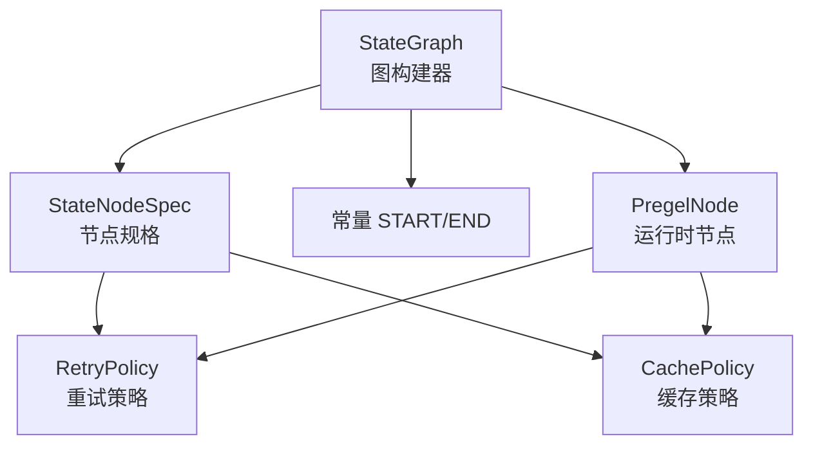
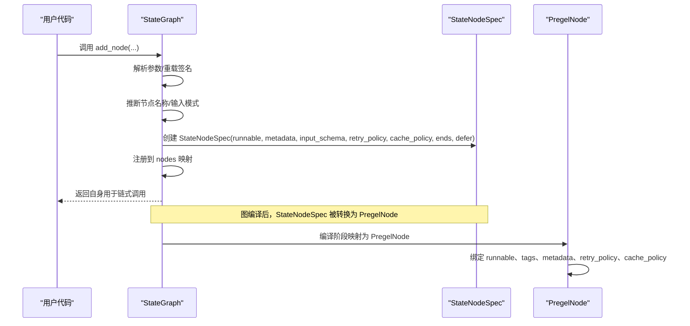
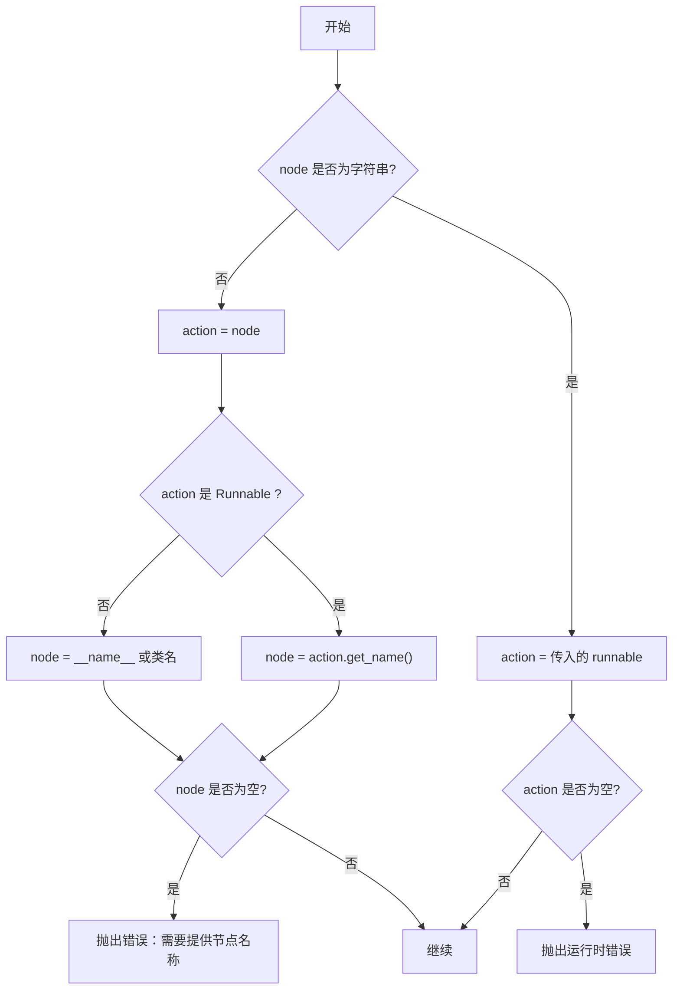
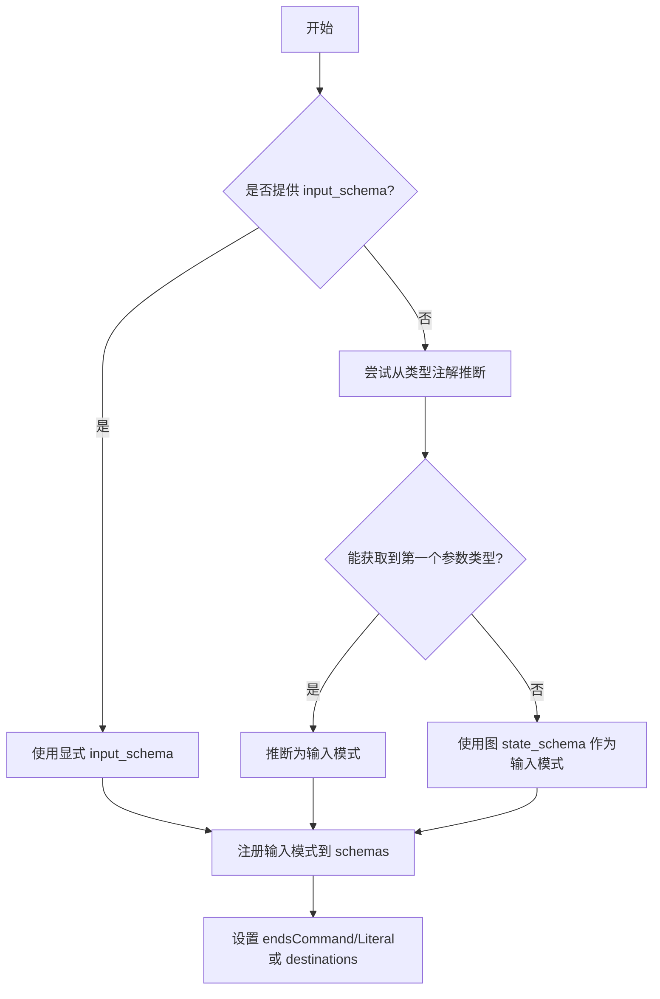
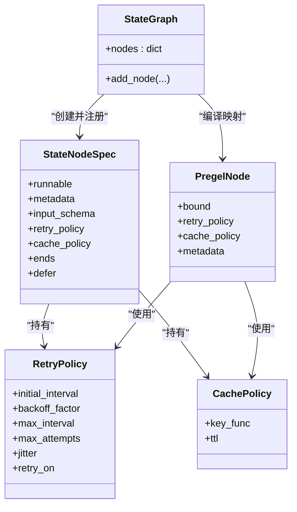

# 节点管理

<cite>
**本文引用的文件**
- [libs/langgraph/langgraph/graph/state.py](file://libs/langgraph/langgraph/graph/state.py)
- [libs/langgraph/langgraph/graph/_node.py](file://libs/langgraph/langgraph/graph/_node.py)
- [libs/langgraph/langgraph/types.py](file://libs/langgraph/langgraph/types.py)
- [libs/langgraph/langgraph/constants.py](file://libs/langgraph/langgraph/constants.py)
- [libs/langgraph/langgraph/pregel/_read.py](file://libs/langgraph/langgraph/pregel/_read.py)
- [libs/langgraph/tests/test_retry.py](file://libs/langgraph/tests/test_retry.py)
</cite>

## 目录
1. [简介](#简介)
2. [项目结构](#项目结构)
3. [核心组件](#核心组件)
4. [架构总览](#架构总览)
5. [详细组件分析](#详细组件分析)
6. [依赖分析](#依赖分析)
7. [性能考虑](#性能考虑)
8. [故障排查指南](#故障排查指南)
9. [结论](#结论)
10. [附录](#附录)

## 简介
本文件系统性阐述 LangGraph 中“节点管理”的完整能力与实现细节，重点围绕 StateGraph 的 add_node 方法的多种重载形式与内部实现，覆盖以下主题：
- 节点名称推断机制（函数名、Runnable 名称、类名）
- 输入输出模式推断（基于类型注解的输入/返回类型）
- 节点属性配置（defer、metadata、input_schema、retry_policy、cache_policy、destinations）
- 参数处理流程与约束校验（保留字、重复节点、已编译图警告）
- 完整 API 参考（参数说明、返回值、异常、示例路径）
- 命名规则、保留字检查、类型推断逻辑与最佳实践

## 项目结构
与节点管理直接相关的核心模块如下：
- 图构建器：StateGraph（负责节点注册、边与分支管理）
- 节点规格：StateNodeSpec（封装节点可执行体、元数据、策略与路由目标）
- 类型与策略：RetryPolicy、CachePolicy（重试与缓存配置）
- 常量：START、END（保留节点名）
- 运行时读取：PregelNode（在运行时承载节点的可执行体、重试与缓存策略）

图表来源
- [libs/langgraph/langgraph/graph/state.py](file://libs/langgraph/langgraph/graph/state.py)
- [libs/langgraph/langgraph/graph/_node.py](file://libs/langgraph/langgraph/graph/_node.py)
- [libs/langgraph/langgraph/types.py](file://libs/langgraph/langgraph/types.py)
- [libs/langgraph/langgraph/pregel/_read.py](file://libs/langgraph/langgraph/pregel/_read.py)

章节来源
- [libs/langgraph/langgraph/graph/state.py](file://libs/langgraph/langgraph/graph/state.py)
- [libs/langgraph/langgraph/graph/_node.py](file://libs/langgraph/langgraph/graph/_node.py)
- [libs/langgraph/langgraph/types.py](file://libs/langgraph/langgraph/types.py)
- [libs/langgraph/langgraph/constants.py](file://libs/langgraph/langgraph/constants.py)
- [libs/langgraph/langgraph/pregel/_read.py](file://libs/langgraph/langgraph/pregel/_read.py)

## 核心组件
- StateGraph.add_node：多重重载，支持自动/显式命名、显式输入模式、策略与路由目标配置
- StateNodeSpec：节点的最终存储形态，包含 runnable、metadata、input_schema、retry_policy、cache_policy、ends、defer
- RetryPolicy：重试策略配置（初始间隔、退避因子、最大间隔、最大尝试次数、抖动、触发异常类型）
- CachePolicy：缓存策略配置（键生成函数、TTL）
- PregelNode：运行时节点对象，承载 runnable、tags、metadata、retry_policy、cache_policy 等

章节来源
- [libs/langgraph/langgraph/graph/state.py](file://libs/langgraph/langgraph/graph/state.py)
- [libs/langgraph/langgraph/graph/_node.py](file://libs/langgraph/langgraph/graph/_node.py)
- [libs/langgraph/langgraph/types.py](file://libs/langgraph/langgraph/types.py)
- [libs/langgraph/langgraph/pregel/_read.py](file://libs/langgraph/langgraph/pregel/_read.py)

## 架构总览
下图展示从调用 add_node 到节点规格写入、再到运行时节点使用的端到端流程。

图表来源
- [libs/langgraph/langgraph/graph/state.py](file://libs/langgraph/langgraph/graph/state.py)
- [libs/langgraph/langgraph/graph/_node.py](file://libs/langgraph/langgraph/graph/_node.py)
- [libs/langgraph/langgraph/pregel/_read.py](file://libs/langgraph/langgraph/pregel/_read.py)

## 详细组件分析

### add_node 方法重载与实现要点
- 多重重载签名支持：
  - 仅传入 runnable 或函数（自动推断名称）
  - 显式传入 node 名称 + runnable
  - 指定 input_schema 的变体
  - 同时指定 input_schema 与 node 名称
- 关键参数说明：
  - node：字符串或可执行体（函数/Runnable）
  - action：当 node 为字符串时，action 为该节点的可执行体
  - defer：是否延迟到运行结束再执行
  - metadata：附加元数据（用于追踪/可视化）
  - input_schema：显式输入模式；未提供时尝试从类型注解推断
  - retry_policy：重试策略（单个或序列）
  - cache_policy：缓存策略
  - destinations：节点路由目的地（渲染用途，不影响执行）
- 名称推断逻辑：
  - 若传入 Runnable：优先使用其名称
  - 否则：取函数名或类名；若均不可得则报错
- 输入模式推断：
  - 通过 inspect.signature 与 get_type_hints 获取第一个参数类型作为输入模式
  - 若返回类型为 Command，则解析其 Literal 目标集合作为 ends
- 保留字与约束：
  - 不允许节点名为 START/END
  - 节点名中不允许包含命名空间分隔符与结束标记字符
  - 已编译图再次添加节点会发出警告（不会反映到已编译图）
  - 重复节点名会抛出异常
- 注册与 schema 协调：
  - 将 StateNodeSpec 写入 nodes 映射
  - 若存在 input_schema，则调用 _add_schema 进行通道/管理值注册

章节来源
- [libs/langgraph/langgraph/graph/state.py](file://libs/langgraph/langgraph/graph/state.py)

### 节点名称推断机制
- 优先级：
  1) Runnable.get_name()
  2) 函数名（__name__）
  3) 类名（__class__.__name__）
- 异常场景：
  - 当 action 非函数且无法推断名称时，抛出错误

图表来源
- [libs/langgraph/langgraph/graph/state.py](file://libs/langgraph/langgraph/graph/state.py)

章节来源
- [libs/langgraph/langgraph/graph/state.py](file://libs/langgraph/langgraph/graph/state.py)

### 输入输出模式推断
- 输入模式推断：
  - 通过类型注解获取第一个参数的类型作为输入模式
  - 若显式提供了 input_schema，则优先使用
- 输出模式与路由：
  - 若返回类型为 Command，解析其 Literal 目标集合作为 ends
  - 若显式提供了 destinations，则覆盖推断结果

图表来源
- [libs/langgraph/langgraph/graph/state.py](file://libs/langgraph/langgraph/graph/state.py)

章节来源
- [libs/langgraph/langgraph/graph/state.py](file://libs/langgraph/langgraph/graph/state.py)

### 节点属性配置
- defer：延迟执行标记
- metadata：节点元数据（用于追踪/可视化）
- input_schema：输入模式（显式或推断）
- retry_policy：重试策略（单个或序列）
- cache_policy：缓存策略
- destinations：路由目的地（渲染用途）

章节来源
- [libs/langgraph/langgraph/graph/state.py](file://libs/langgraph/langgraph/graph/state.py)
- [libs/langgraph/langgraph/graph/_node.py](file://libs/langgraph/langgraph/graph/_node.py)
- [libs/langgraph/langgraph/types.py](file://libs/langgraph/langgraph/types.py)
- [libs/langgraph/langgraph/pregel/_read.py](file://libs/langgraph/langgraph/pregel/_read.py)

### API 参考（add_node）
- 重载一：仅传入 runnable 或函数
  - 参数：node（Runnable/函数）、defer、metadata、input_schema（默认从类型注解推断）、retry_policy、cache_policy、destinations
  - 返回：Self（支持链式调用）
  - 异常：节点名冲突、保留字、已编译图警告、无法推断名称
  - 示例路径：[示例一](file://libs/langgraph/langgraph/graph/state.py)
- 重载二：显式传入 node 名称 + runnable
  - 参数：node（字符串）、action（Runnable/函数）、defer、metadata、input_schema（默认从类型注解推断）、retry_policy、cache_policy、destinations
  - 返回：Self
  - 异常：同上
  - 示例路径：[示例二](file://libs/langgraph/langgraph/graph/state.py)
- 重载三：显式 input_schema（不指定 node 名称）
  - 参数：node（Runnable/函数）、input_schema、defer、metadata、retry_policy、cache_policy、destinations
  - 返回：Self
  - 异常：同上
  - 示例路径：[示例三](file://libs/langgraph/langgraph/graph/state.py)
- 重载四：显式 input_schema 与 node 名称
  - 参数：node（字符串）、action（Runnable/函数）、input_schema、defer、metadata、retry_policy、cache_policy、destinations
  - 返回：Self
  - 异常：同上
  - 示例路径：[示例四](file://libs/langgraph/langgraph/graph/state.py)

章节来源
- [libs/langgraph/langgraph/graph/state.py](file://libs/langgraph/langgraph/graph/state.py)

### 命名规则与保留字检查
- 保留节点名：START、END
- 节点名字符限制：不得包含命名空间分隔符与结束标记字符
- 重复节点名：抛出异常
- 已编译图再次添加节点：发出警告（不会反映到已编译图）

章节来源
- [libs/langgraph/langgraph/constants.py](file://libs/langgraph/langgraph/constants.py)
- [libs/langgraph/langgraph/graph/state.py](file://libs/langgraph/langgraph/graph/state.py)

### 类型推断逻辑与最佳实践
- 推断输入模式：优先使用显式 input_schema；否则从类型注解推断；最后回退到图 state_schema
- 推断路由目标：若返回类型为 Command，解析其 Literal 目标集合；否则使用显式 destinations
- 最佳实践：
  - 显式提供 input_schema 以确保类型安全与文档化
  - 使用 destinations 仅用于可视化/渲染目的
  - 对易失败节点配置 retry_policy；对昂贵计算节点配置 cache_policy
  - 避免使用 START/END 作为节点名，避免包含保留字符

章节来源
- [libs/langgraph/langgraph/graph/state.py](file://libs/langgraph/langgraph/graph/state.py)
- [libs/langgraph/langgraph/types.py](file://libs/langgraph/langgraph/types.py)

## 依赖分析
- StateGraph.add_node 依赖：
  - StateNodeSpec 存储节点规格
  - RetryPolicy/CachePolicy 提供策略
  - 常量 START/END 用于保留字检查
  - PregelNode 在编译阶段承载 runnable、策略等
- 运行时依赖：
  - PregelNode 保存 runnable、tags、metadata、retry_policy、cache_policy
  - 运行时根据 ends 决定路由（若为 Command）

图表来源
- [libs/langgraph/langgraph/graph/state.py](file://libs/langgraph/langgraph/graph/state.py)
- [libs/langgraph/langgraph/graph/_node.py](file://libs/langgraph/langgraph/graph/_node.py)
- [libs/langgraph/langgraph/types.py](file://libs/langgraph/langgraph/types.py)
- [libs/langgraph/langgraph/pregel/_read.py](file://libs/langgraph/langgraph/pregel/_read.py)

章节来源
- [libs/langgraph/langgraph/graph/state.py](file://libs/langgraph/langgraph/graph/state.py)
- [libs/langgraph/langgraph/graph/_node.py](file://libs/langgraph/langgraph/graph/_node.py)
- [libs/langgraph/langgraph/types.py](file://libs/langgraph/langgraph/types.py)
- [libs/langgraph/langgraph/pregel/_read.py](file://libs/langgraph/langgraph/pregel/_read.py)

## 性能考虑
- 重试策略：
  - 退避与抖动可降低热点竞争与雪崩效应
  - 合理设置最大尝试次数与最大间隔，避免长时间阻塞
- 缓存策略：
  - 为昂贵节点配置 TTL，平衡一致性与性能
  - 自定义 key_func 时注意哈希成本与唯一性
- 延迟执行（defer）：
  - 适用于收尾统计/汇总任务，减少中间状态写入

## 故障排查指南
- 常见异常与定位
  - “需要提供节点名称”：action 非函数且无法推断名称
  - “节点已存在”：重复添加相同名称节点
  - “保留节点名”：使用了 START/END
  - “包含保留字符”：节点名包含命名空间分隔符或结束标记字符
  - “已编译图再次添加节点”：发出警告，需重新编译
- 重试行为验证
  - 可参考测试用例对重试策略的断言与行为验证
  - 示例路径：[重试测试](file://libs/langgraph/tests/test_retry.py)

章节来源
- [libs/langgraph/langgraph/graph/state.py](file://libs/langgraph/langgraph/graph/state.py)
- [libs/langgraph/tests/test_retry.py](file://libs/langgraph/tests/test_retry.py)

## 结论
add_node 提供了灵活而强大的节点注册能力，结合类型推断、策略配置与路由目标，既能满足快速原型开发，也能支撑复杂生产场景。遵循命名规范、显式输入模式与合理配置策略，是构建稳定可维护图的关键。

## 附录
- 相关常量：START、END
- 相关类型：RetryPolicy、CachePolicy、StateNodeSpec、PregelNode
- 示例路径：各重载示例位于 StateGraph.add_node 文档字符串中

章节来源
- [libs/langgraph/langgraph/constants.py](file://libs/langgraph/langgraph/constants.py)
- [libs/langgraph/langgraph/types.py](file://libs/langgraph/langgraph/types.py)
- [libs/langgraph/langgraph/graph/_node.py](file://libs/langgraph/langgraph/graph/_node.py)
- [libs/langgraph/langgraph/pregel/_read.py](file://libs/langgraph/langgraph/pregel/_read.py)