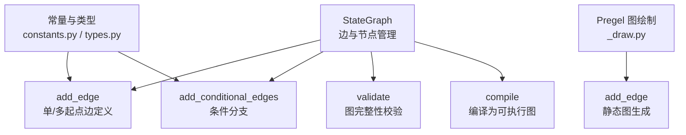
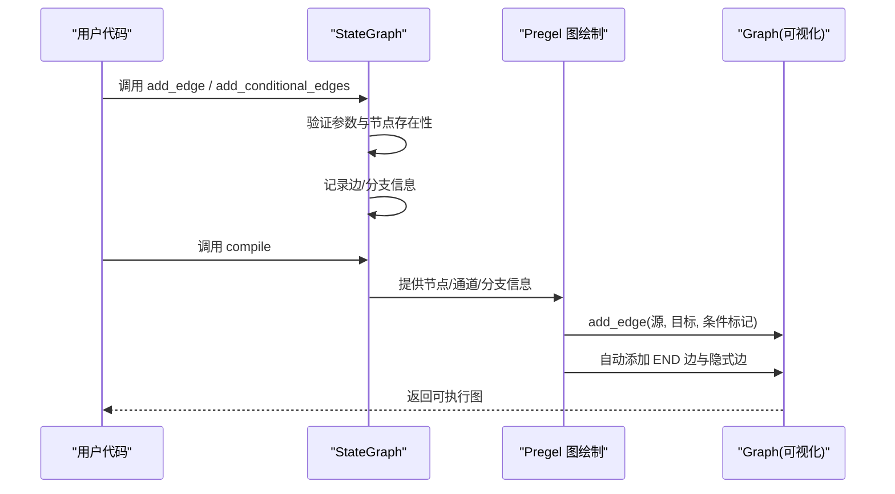
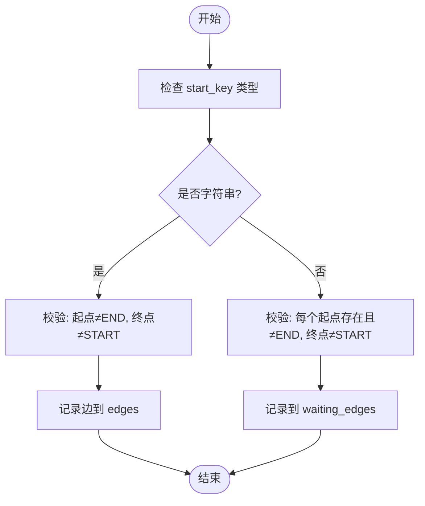
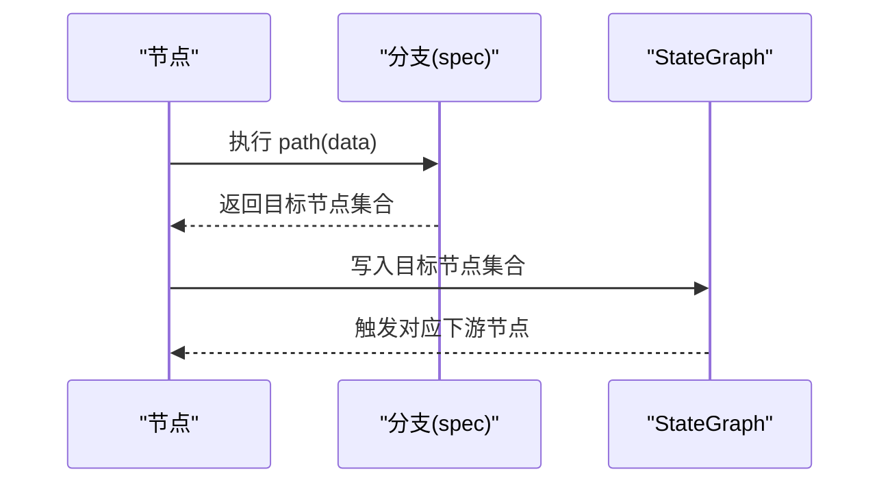
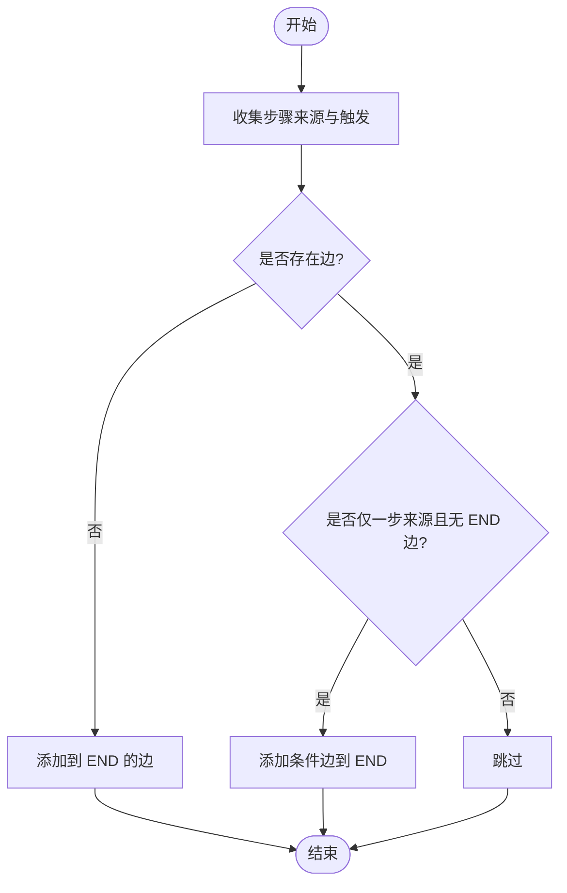
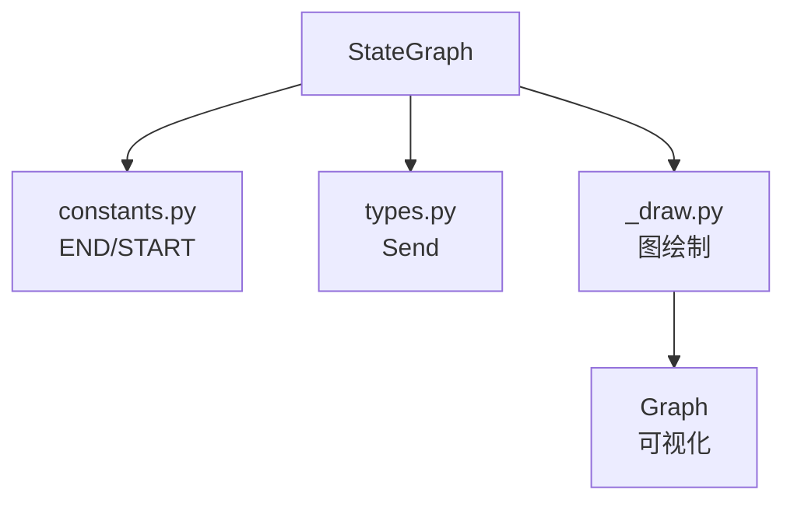

# 边路由系统

<cite>
**本文档引用的文件**
- [libs/langgraph/langgraph/graph/state.py](file://libs/langgraph/langgraph/graph/state.py)
- [libs/langgraph/langgraph/pregel/_draw.py](file://libs/langgraph/langgraph/pregel/_draw.py)
- [libs/langgraph/langgraph/constants.py](file://libs/langgraph/langgraph/constants.py)
- [libs/langgraph/langgraph/types.py](file://libs/langgraph/langgraph/types.py)
- [libs/langgraph/tests/test_pregel.py](file://libs/langgraph/tests/test_pregel.py)
</cite>

## 目录
1. [简介](#简介)
2. [项目结构](#项目结构)
3. [核心组件](#核心组件)
4. [架构总览](#架构总览)
5. [详细组件分析](#详细组件分析)
6. [依赖分析](#依赖分析)
7. [性能考虑](#性能考虑)
8. [故障排除指南](#故障排除指南)
9. [结论](#结论)
10. [附录](#附录)

## 简介
本文件系统性阐述 LangGraph 中“边路由系统”的设计与实现，重点围绕 StateGraph 的 add_edge 方法展开，涵盖以下主题：
- 单节点到多节点的边定义与等待机制
- 条件分支与动态路由（add_conditional_edges）
- 边添加过程中的参数处理、类型推断与验证逻辑
- 执行顺序与多起点汇聚（汇聚屏障）行为
- 完整 API 参考（参数、返回值、异常）
- 使用示例、最佳实践、常见错误与解决方案

## 项目结构
边路由系统主要由以下模块构成：
- StateGraph：状态图构建器，负责节点与边的声明、校验与编译
- Pregel 图绘制工具：在运行时根据任务写入与触发关系生成可视化图
- 常量与类型：END/START 等特殊节点标识，以及 Send 等类型支持

图表来源
- [libs/langgraph/langgraph/graph/state.py:788-840](file://libs/langgraph/langgraph/graph/state.py#L788-L840)
- [libs/langgraph/langgraph/pregel/_draw.py:280-294](file://libs/langgraph/langgraph/pregel/_draw.py#L280-L294)
- [libs/langgraph/langgraph/constants.py](file://libs/langgraph/langgraph/constants.py)
- [libs/langgraph/langgraph/types.py:576-620](file://libs/langgraph/langgraph/types.py#L576-L620)

章节来源
- [libs/langgraph/langgraph/graph/state.py:788-840](file://libs/langgraph/langgraph/graph/state.py#L788-L840)
- [libs/langgraph/langgraph/pregel/_draw.py:280-294](file://libs/langgraph/langgraph/pregel/_draw.py#L280-L294)

## 核心组件
- StateGraph.add_edge：用于声明从一个或多个起始节点到目标节点的有向边；支持单起点（串行）与多起点（汇聚）两种模式
- StateGraph.add_conditional_edges：为某个源节点注册条件分支，运行时根据路径函数动态选择下一个节点或节点集合
- Pregel 图绘制工具：在运行时扫描任务写入与触发，自动生成边并处理隐式边与 END 终止边
- 常量与类型：END/START 表示特殊节点；Send 类型用于条件分支中显式发送消息

章节来源
- [libs/langgraph/langgraph/graph/state.py:788-840](file://libs/langgraph/langgraph/graph/state.py#L788-L840)
- [libs/langgraph/langgraph/graph/state.py:842-890](file://libs/langgraph/langgraph/graph/state.py#L842-L890)
- [libs/langgraph/langgraph/pregel/_draw.py:280-294](file://libs/langgraph/langgraph/pregel/_draw.py#L280-L294)
- [libs/langgraph/langgraph/constants.py](file://libs/langgraph/langgraph/constants.py)
- [libs/langgraph/langgraph/types.py:576-620](file://libs/langgraph/langgraph/types.py#L576-L620)

## 架构总览
下图展示了边路由系统在构建期与运行期的关键交互：

图表来源
- [libs/langgraph/langgraph/graph/state.py:788-840](file://libs/langgraph/langgraph/graph/state.py#L788-L840)
- [libs/langgraph/langgraph/pregel/_draw.py:235-256](file://libs/langgraph/langgraph/pregel/_draw.py#L235-L256)
- [libs/langgraph/langgraph/pregel/_draw.py:280-294](file://libs/langgraph/langgraph/pregel/_draw.py#L280-L294)

## 详细组件分析

### add_edge 方法：单节点到多节点的边定义与等待机制
- 功能概述
  - 支持单起点边：从单一节点到目标节点，按序执行
  - 支持多起点边：从多个节点汇聚到目标节点，需要所有起点完成才会触发目标节点
- 参数与返回
  - start_key：字符串或字符串列表；字符串表示单起点，列表表示多起点
  - end_key：目标节点名；允许为特殊常量 END
  - 返回：Self，支持链式调用
- 关键行为
  - 单起点：直接记录边，无需额外等待
  - 多起点：记录到 waiting_edges，待所有起点完成后才触发目标节点
- 验证逻辑
  - 不允许 END 作为起点
  - 不允许 START 作为终点
  - 对于多起点，要求每个起点节点已添加
  - 若目标非 END，则必须是已添加的节点
- 执行顺序
  - 单起点：前一节点完成后立即进入下一节点
  - 多起点：通过汇聚屏障（NamedBarrierValue）等待所有起点完成后再进入目标节点

图表来源
- [libs/langgraph/langgraph/graph/state.py:811-840](file://libs/langgraph/langgraph/graph/state.py#L811-L840)

章节来源
- [libs/langgraph/langgraph/graph/state.py:788-840](file://libs/langgraph/langgraph/graph/state.py#L788-L840)

### 条件分支与动态路由：add_conditional_edges
- 功能概述
  - 为源节点注册条件分支，运行时根据 path 函数返回的目标节点决定下一步
  - 支持返回单个节点或多个节点（形成 fan-out）
  - 可选 path_map 将路径映射到节点名
- 参数与返回
  - source：源节点
  - path：可调用对象（函数/Runnable），返回节点名或节点名序列
  - path_map：可选映射表
  - 返回：Self
- 类型推断与验证
  - 会将 path 强制为 Runnable 并进行名称推断
  - 若未提供 path_map 或返回类型提示，可视化可能假设可连接到图中任意节点
- 执行顺序
  - 条件分支在节点退出时触发，根据返回结果决定后续节点集合
  - 若返回 END，流程终止

图表来源
- [libs/langgraph/langgraph/graph/state.py:842-890](file://libs/langgraph/langgraph/graph/state.py#L842-L890)

章节来源
- [libs/langgraph/langgraph/graph/state.py:842-890](file://libs/langgraph/langgraph/graph/state.py#L842-L890)

### 运行期边生成：Pregel 图绘制中的 add_edge
- 功能概述
  - 在运行时扫描任务写入与触发，自动构建可视化图
  - 自动处理隐式边与 END 终止边
- 关键逻辑
  - 若存在孤立节点且无 END 边，自动添加到 END 的边
  - 若仅有一个步骤来源且不存在 END 边，添加条件边到 END
  - 对子图进行替换与边重写

图表来源
- [libs/langgraph/langgraph/pregel/_draw.py:235-256](file://libs/langgraph/langgraph/pregel/_draw.py#L235-L256)

章节来源
- [libs/langgraph/langgraph/pregel/_draw.py:235-256](file://libs/langgraph/langgraph/pregel/_draw.py#L235-L256)
- [libs/langgraph/langgraph/pregel/_draw.py:280-294](file://libs/langgraph/langgraph/pregel/_draw.py#L280-L294)

### 边定义的最佳实践
- 明确区分单起点与多起点
  - 单起点：简单串行，适合线性流程
  - 多起点：使用列表形式，确保所有起点完成后才进入目标节点
- 合理使用 END
  - 将最终节点设置为 END，避免手动拼接大量 END 边
- 条件分支
  - 优先提供 path_map 或返回类型提示，提升可视化准确性
  - 避免在条件分支中遗漏 END 分支，导致流程无法终止
- 节点命名
  - 避免使用保留字符，不要与 START/END 冲突
- 编译后添加边
  - 已编译的图不会反映新增边，需重新编译

章节来源
- [libs/langgraph/langgraph/graph/state.py:788-840](file://libs/langgraph/langgraph/graph/state.py#L788-L840)
- [libs/langgraph/langgraph/graph/state.py:842-890](file://libs/langgraph/langgraph/graph/state.py#L842-L890)

## 依赖分析
- StateGraph 依赖常量 END/START 与类型 Send
- Pregel 图绘制依赖通道与任务写入信息，动态生成边
- 条件分支依赖 Runnable 包装与分支规范

图表来源
- [libs/langgraph/langgraph/graph/state.py:788-840](file://libs/langgraph/langgraph/graph/state.py#L788-L840)
- [libs/langgraph/langgraph/pregel/_draw.py:280-294](file://libs/langgraph/langgraph/pregel/_draw.py#L280-L294)
- [libs/langgraph/langgraph/constants.py](file://libs/langgraph/langgraph/constants.py)
- [libs/langgraph/langgraph/types.py:576-620](file://libs/langgraph/langgraph/types.py#L576-L620)

章节来源
- [libs/langgraph/langgraph/graph/state.py:788-840](file://libs/langgraph/langgraph/graph/state.py#L788-L840)
- [libs/langgraph/langgraph/pregel/_draw.py:280-294](file://libs/langgraph/langgraph/pregel/_draw.py#L280-L294)

## 性能考虑
- 多起点汇聚使用 NamedBarrierValue，等待所有上游完成，可能引入同步开销
- 条件分支在每次节点退出时计算，建议保持 path 函数轻量
- 大规模 fan-out 场景下，注意下游节点的并发与资源限制

## 故障排除指南
- 常见错误与原因
  - “起点不能为 END”：在 add_edge 中传入 END 作为 start_key
  - “终点不能为 START”：在 add_edge 中传入 START 作为 end_key
  - “节点未添加”：多起点场景中某个起点未先 add_node
  - “图缺少入口”：未添加从 START 出发的边
  - “未知节点”：边指向不存在的节点
- 解决方案
  - 确保所有节点先 add_node，再添加边
  - 使用 set_entry_point 或 add_edge(START, key) 设置入口
  - 对多起点使用列表形式，并保证所有节点存在
  - 对条件分支提供 path_map 或返回类型提示，减少歧义

章节来源
- [libs/langgraph/langgraph/graph/state.py:811-840](file://libs/langgraph/langgraph/graph/state.py#L811-L840)
- [libs/langgraph/langgraph/graph/state.py:989-1036](file://libs/langgraph/langgraph/graph/state.py#L989-L1036)

## 结论
边路由系统通过 add_edge 与 add_conditional_edges 实现了从简单串行到复杂汇聚与动态分支的全面覆盖。其验证逻辑与执行语义清晰，配合 Pregel 的运行期图绘制能力，既保证了构建期的严谨性，也提供了灵活的运行期动态路由能力。遵循本文的最佳实践与排错建议，可有效避免常见陷阱，构建稳定高效的流程图。

## 附录

### API 参考：add_edge
- 方法签名
  - add_edge(start_key: str | list[str], end_key: str) -> Self
- 参数
  - start_key：起始节点名或节点名列表
  - end_key：目标节点名或特殊常量 END
- 返回值
  - Self，支持链式调用
- 异常
  - ValueError：当参数不合法或节点缺失时抛出
- 使用示例
  - 单起点：参考测试用例中的线性边定义
  - 多起点：参考测试用例中的汇聚边定义
  - 终止：参考测试用例中的 set_finish_point 或 add_edge(key, END)

章节来源
- [libs/langgraph/langgraph/graph/state.py:788-840](file://libs/langgraph/langgraph/graph/state.py#L788-L840)
- [libs/langgraph/tests/test_pregel.py:1913-1978](file://libs/langgraph/tests/test_pregel.py#L1913-L1978)
- [libs/langgraph/tests/test_pregel.py:2781-2883](file://libs/langgraph/tests/test_pregel.py#L2781-L2883)

### API 参考：add_conditional_edges
- 方法签名
  - add_conditional_edges(source: str, path: Callable | Runnable, path_map: dict | list | None = None) -> Self
- 参数
  - source：源节点
  - path：返回节点名或节点名序列的可调用对象
  - path_map：可选映射表
- 返回值
  - Self
- 异常
  - ValueError：分支名称冲突或编译后添加边警告
- 使用示例
  - 函数/可调用对象：参考测试用例中的条件分支定义
  - 无 path_map：建议提供返回类型提示以提升可视化准确性

章节来源
- [libs/langgraph/langgraph/graph/state.py:842-890](file://libs/langgraph/langgraph/graph/state.py#L842-L890)
- [libs/langgraph/tests/test_pregel.py:2898-2947](file://libs/langgraph/tests/test_pregel.py#L2898-L2947)

### 常用辅助方法
- set_entry_point(key: str) -> Self：等价于 add_edge(START, key)
- set_finish_point(key: str) -> Self：等价于 add_edge(key, END)
- add_sequence(nodes: Sequence) -> Self：按顺序添加节点并连接相邻节点

章节来源
- [libs/langgraph/langgraph/graph/state.py:939-950](file://libs/langgraph/langgraph/graph/state.py#L939-L950)
- [libs/langgraph/langgraph/graph/state.py:976-987](file://libs/langgraph/langgraph/graph/state.py#L976-L987)
- [libs/langgraph/langgraph/graph/state.py:892-937](file://libs/langgraph/langgraph/graph/state.py#L892-L937)