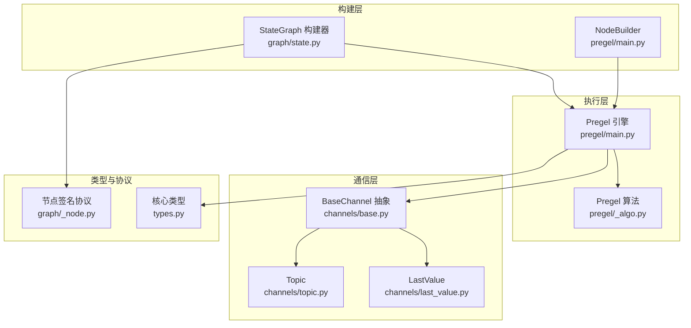
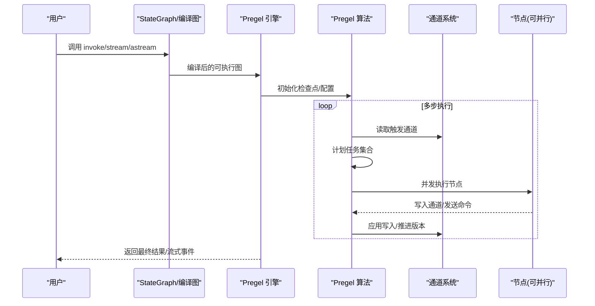
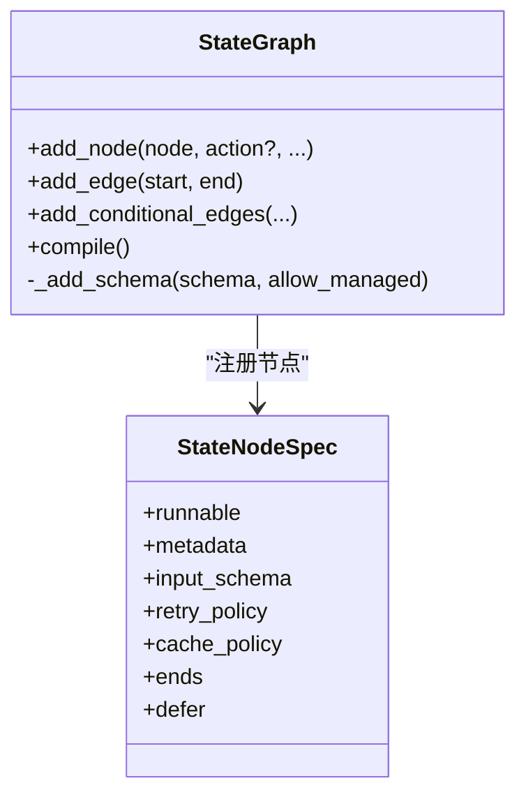
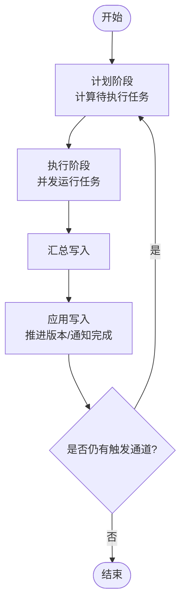
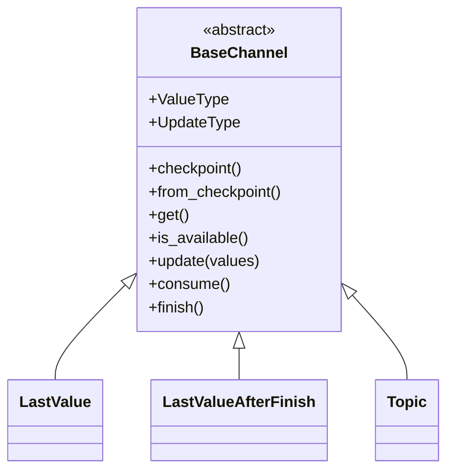
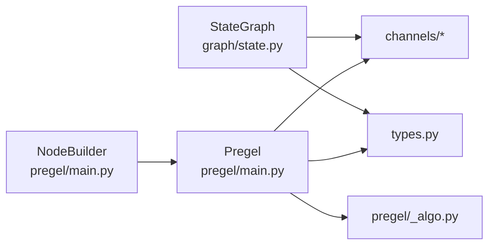

# 核心框架

<cite>
**本文引用的文件**
- [README.md](file://README.md)
- [state.py](file://libs/langgraph/langgraph/graph/state.py)
- [main.py](file://libs/langgraph/langgraph/pregel/main.py)
- [_algo.py](file://libs/langgraph/langgraph/pregel/_algo.py)
- [base.py](file://libs/langgraph/langgraph/channels/base.py)
- [last_value.py](file://libs/langgraph/langgraph/channels/last_value.py)
- [topic.py](file://libs/langgraph/langgraph/channels/topic.py)
- [_node.py](file://libs/langgraph/langgraph/graph/_node.py)
- [types.py](file://libs/langgraph/langgraph/types.py)
- [test_state.py](file://libs/langgraph/tests/test_state.py)
- [test_pregel.py](file://libs/langgraph/tests/test_pregel.py)
</cite>

## 目录
1. [简介](#简介)
2. [项目结构](#项目结构)
3. [核心组件](#核心组件)
4. [架构总览](#架构总览)
5. [详细组件分析](#详细组件分析)
6. [依赖分析](#依赖分析)
7. [性能考量](#性能考量)
8. [故障排查指南](#故障排查指南)
9. [结论](#结论)
10. [附录：API 参考与使用示例](#附录api-参考与使用示例)

## 简介
本文件面向 LangGraph 核心框架，系统化阐述以下主题：
- StateGraph 构建器：节点添加、边与路由、状态模式定义、输入/输出/上下文模式
- Pregel 执行引擎：任务调度、并行执行策略、错误与重试、检查点与中断
- 通道系统：基础通道接口与内置通道类型（LastValue、Topic 等）的特性与适用场景
- 完整 API 参考与使用示例：参数说明、返回值、异常处理
- 性能优化建议与最佳实践

LangGraph 基于“演员 + 通道”的 Bulk Synchronous Parallel 模型，通过 Pregel 算法在多步中组织执行：计划（Plan）、执行（Execution）、更新（Update），并在每步结束前对通道进行原子性写入。

章节来源
- [README.md:1-83](file://README.md#L1-L83)

## 项目结构
LangGraph 核心位于 libs/langgraph，主要子模块如下：
- graph/state.py：StateGraph 构建器与状态图编译逻辑
- pregel/*：Pregel 执行引擎、算法、IO、循环、写入/读取、校验等
- channels/*：通道抽象与内置实现（LastValue、Topic、BinaryOperatorAggregate 等）
- types.py：核心类型（Send、Command、Interrupt、StreamMode 等）
- tests/*：覆盖状态图、Pregel 执行、通道行为、错误处理等

图表来源
- [state.py:115-786](file://libs/langgraph/langgraph/graph/state.py#L115-L786)
- [main.py:337-800](file://libs/langgraph/langgraph/pregel/main.py#L337-L800)
- [base.py:19-122](file://libs/langgraph/langgraph/channels/base.py#L19-L122)
- [last_value.py:20-152](file://libs/langgraph/langgraph/channels/last_value.py#L20-L152)
- [topic.py:23-95](file://libs/langgraph/langgraph/channels/topic.py#L23-L95)
- [_node.py:84-93](file://libs/langgraph/langgraph/graph/_node.py#L84-L93)
- [types.py:574-800](file://libs/langgraph/langgraph/types.py#L574-L800)

章节来源
- [state.py:115-786](file://libs/langgraph/langgraph/graph/state.py#L115-L786)
- [main.py:337-800](file://libs/langgraph/langgraph/pregel/main.py#L337-L800)
- [base.py:19-122](file://libs/langgraph/langgraph/channels/base.py#L19-L122)
- [last_value.py:20-152](file://libs/langgraph/langgraph/channels/last_value.py#L20-L152)
- [topic.py:23-95](file://libs/langgraph/langgraph/channels/topic.py#L23-L95)
- [_node.py:84-93](file://libs/langgraph/langgraph/graph/_node.py#L84-L93)
- [types.py:574-800](file://libs/langgraph/langgraph/types.py#L574-L800)

## 核心组件
- StateGraph：声明式构建状态图，支持节点、边、条件边、入口/终点、输入/输出/上下文模式、Schema 校验与通道推导
- Pregel：执行引擎，封装 Bulk Synchronous Parallel 步骤；负责任务计划、并发执行、通道写入、检查点与中断
- 通道系统：BaseChannel 抽象及内置实现（LastValue、Topic 等），用于节点间通信与状态持久化
- 类型与协议：Send/Command/Interrupt/StreamMode/RetryPolicy/CachePolicy 等

章节来源
- [state.py:115-786](file://libs/langgraph/langgraph/graph/state.py#L115-L786)
- [main.py:337-800](file://libs/langgraph/langgraph/pregel/main.py#L337-L800)
- [base.py:19-122](file://libs/langgraph/langgraph/channels/base.py#L19-L122)
- [types.py:574-800](file://libs/langgraph/langgraph/types.py#L574-L800)

## 架构总览
LangGraph 的执行遵循 Pregel 算法三阶段：
- 计划：根据触发通道与版本信息确定下一步可执行的任务集合
- 执行：并发运行任务，注入读写钩子、回调、缓存键、运行时上下文
- 更新：应用写入、推进版本、通知完成、触发后续节点

图表来源
- [main.py:337-800](file://libs/langgraph/langgraph/pregel/main.py#L337-L800)
- [_algo.py:326-491](file://libs/langgraph/langgraph/pregel/_algo.py#L326-L491)

章节来源
- [main.py:337-800](file://libs/langgraph/langgraph/pregel/main.py#L337-L800)
- [_algo.py:326-491](file://libs/langgraph/langgraph/pregel/_algo.py#L326-L491)

## 详细组件分析

### StateGraph 构建器
- 节点添加
  - 支持函数/Runnable/带签名的可调用对象；自动推断输入/输出 Schema；支持元数据、重试策略、缓存策略、延迟执行、目的地提示
  - 名称推断规则：函数名、Runnable 名称或类名；保留字校验（如 START/END）
- 边与路由
  - add_edge：单起点/多起点汇聚；多起点需全部完成才触发
  - 条件边：基于节点返回的 Command 或 Send 动态路由；支持字典/元组形式的目的地标签
- 状态模式
  - state_schema/input_schema/output_schema/context_schema：定义状态、输入、输出、运行时上下文的类型约束
  - Schema 推导：从 TypedDict/Annotated/reducer 中提取通道与管理值
- 编译与校验
  - 编译后生成可执行图；校验节点/边/通道一致性；警告无效 Schema

图表来源
- [state.py:292-786](file://libs/langgraph/langgraph/graph/state.py#L292-L786)
- [_node.py:84-93](file://libs/langgraph/langgraph/graph/_node.py#L84-L93)

章节来源
- [state.py:292-786](file://libs/langgraph/langgraph/graph/state.py#L292-L786)
- [_node.py:84-93](file://libs/langgraph/langgraph/graph/_node.py#L84-L93)

### Pregel 执行引擎
- 任务计划
  - 基于触发通道与版本信息判断是否满足执行条件；支持优化：仅扫描上一步更新过的通道所触发的节点
  - 支持 PUSH（Send）与 PULL（边触发）两类任务
- 并行执行
  - 为每个任务注入读写钩子（CONFIG_KEY_READ/CONFIG_KEY_SEND）、回调、缓存键、运行时上下文
  - 支持重试策略与缓存策略
- 写入与更新
  - 汇总各任务写入，按通道分组，调用通道 update；推进版本号；必要时通知 finish
- 中断与检查点
  - 中断时机：通道版本变化且命中中断节点；支持“前置/后置”中断
  - 检查点：保存通道值、版本、任务、中断等；支持异步/同步/退出持久化模式

图表来源
- [_algo.py:218-323](file://libs/langgraph/langgraph/pregel/_algo.py#L218-L323)
- [_algo.py:326-491](file://libs/langgraph/langgraph/pregel/_algo.py#L326-L491)

章节来源
- [_algo.py:218-323](file://libs/langgraph/langgraph/pregel/_algo.py#L218-L323)
- [_algo.py:326-491](file://libs/langgraph/langgraph/pregel/_algo.py#L326-L491)

### 通道系统
- BaseChannel 抽象
  - 定义 ValueType/UpdateType、checkpoint/from_checkpoint、get/is_available、update/consume/finish 等接口
- 内置通道
  - LastValue：每步最多一个值；LastValueAfterFinish：完成后才可用并清空
  - Topic：发布/订阅主题，可配置累积与去重；适合广播/聚合输出
  - BinaryOperatorAggregate/UntrackedValue/EphemeralValue 等（由其他文件提供）

图表来源
- [base.py:19-122](file://libs/langgraph/langgraph/channels/base.py#L19-L122)
- [last_value.py:20-152](file://libs/langgraph/langgraph/channels/last_value.py#L20-L152)
- [topic.py:23-95](file://libs/langgraph/langgraph/channels/topic.py#L23-L95)

章节来源
- [base.py:19-122](file://libs/langgraph/langgraph/channels/base.py#L19-L122)
- [last_value.py:20-152](file://libs/langgraph/langgraph/channels/last_value.py#L20-L152)
- [topic.py:23-95](file://libs/langgraph/langgraph/channels/topic.py#L23-L95)

### 关键类型与协议
- Send/Command：动态发送消息到指定节点、更新状态、跳转下一节点
- Interrupt：可恢复的中断，携带值与 ID
- StreamMode：values/updates/messages/custom/checkpoints/tasks/debug
- RetryPolicy/CachePolicy：重试与缓存策略
- PregelTask/PregelExecutableTask：任务模型与可执行任务

章节来源
- [types.py:574-800](file://libs/langgraph/langgraph/types.py#L574-L800)

## 依赖分析
- StateGraph 依赖通道系统与类型系统，编译时推导 Schema 与通道映射
- Pregel 依赖通道系统进行读写，依赖算法模块进行任务计划与写入应用
- NodeBuilder 作为低级构建器，最终被 Pregel 接纳为可执行节点

图表来源
- [state.py:115-786](file://libs/langgraph/langgraph/graph/state.py#L115-L786)
- [main.py:337-800](file://libs/langgraph/langgraph/pregel/main.py#L337-L800)
- [_algo.py:326-491](file://libs/langgraph/langgraph/pregel/_algo.py#L326-L491)

章节来源
- [state.py:115-786](file://libs/langgraph/langgraph/graph/state.py#L115-L786)
- [main.py:337-800](file://libs/langgraph/langgraph/pregel/main.py#L337-L800)
- [_algo.py:326-491](file://libs/langgraph/langgraph/pregel/_algo.py#L326-L491)

## 性能考量
- 并发执行
  - 使用并发池与异步回调管理器，最大化吞吐；注意避免阻塞 IO
- 通道选择
  - 高频广播使用 Topic；单值传递使用 LastValue；需要跨步累积使用 BinaryOperatorAggregate
- 写入批量化
  - 合理合并写入，减少通道 update 次数；利用 consume/finish 语义降低重复消费
- 缓存与重试
  - 对昂贵节点启用 CachePolicy；对易失败节点配置 RetryPolicy，设置合理的退避与上限
- 检查点策略
  - 根据 durability 需求选择 sync/async/exit；大图建议开启检查点以支持断点续跑

[本节为通用指导，不直接分析具体文件]

## 故障排查指南
- 常见错误
  - 无效 reducer/通道冲突：检查 Annotated reducer 与通道类型一致性
  - 通道为空：确保触发通道在上一步已写入；使用 is_available 判断
  - 无效节点名/保留字：避免使用 START/END 作为节点名
  - 检查点异常：确认 checkpointer 实现正确、版本函数可用
- 调试手段
  - 使用 stream_mode="debug" 获取任务与检查点事件
  - 设置 debug=True 输出内部日志
  - 在节点中使用 interrupt 触发人工介入

章节来源
- [test_state.py:87-121](file://libs/langgraph/tests/test_state.py#L87-L121)
- [test_pregel.py:158-200](file://libs/langgraph/tests/test_pregel.py#L158-L200)

## 结论
LangGraph 通过 StateGraph 的声明式构建与 Pregel 的并行执行模型，提供了高扩展、可观测、可恢复的状态图执行能力。合理设计状态 Schema、选择合适通道、配置重试与缓存策略，是获得稳定性能的关键。

[本节为总结，不直接分析具体文件]

## 附录：API 参考与使用示例

### StateGraph API
- 构造
  - 参数：state_schema、context_schema、input_schema、output_schema
  - 行为：记录节点、边、分支、通道与管理值；编译后生成可执行图
- 方法
  - add_node：注册节点，支持元数据、重试、缓存、延迟、目的地提示
  - add_edge：添加边（支持多起点汇聚）
  - add_conditional_edges：条件边（返回 Send/Command 或字典/元组形式的目的地）
  - compile：编译为可执行图
- 示例路径
  - [state.py:143-184](file://libs/langgraph/langgraph/graph/state.py#L143-L184)
  - [test_state.py:102-136](file://libs/langgraph/tests/test_state.py#L102-L136)

章节来源
- [state.py:143-184](file://libs/langgraph/langgraph/graph/state.py#L143-L184)
- [test_state.py:102-136](file://libs/langgraph/tests/test_state.py#L102-L136)

### Pregel API
- 构造
  - 参数：nodes、channels、auto_validate、stream_mode、output_channels、input_channels、checkpointer、cache、retry_policy、cache_policy、context_schema 等
  - 行为：校验通道与节点；初始化 TASKS 通道；准备触发映射
- 方法
  - get_graph/aget_graph：渲染可绘制图
  - invoke/stream/astream：执行与流式输出
- 示例路径
  - [main.py:414-590](file://libs/langgraph/langgraph/pregel/main.py#L414-L590)
  - [test_pregel.py:87-121](file://libs/langgraph/tests/test_pregel.py#L87-L121)

章节来源
- [main.py:414-590](file://libs/langgraph/langgraph/pregel/main.py#L414-L590)
- [test_pregel.py:87-121](file://libs/langgraph/tests/test_pregel.py#L87-L121)

### 通道 API
- BaseChannel
  - ValueType/UpdateType/checkpoint/from_checkpoint/get/is_available/update/consume/finish
- LastValue/LastValueAfterFinish
  - 每步单值存储；AfterFinish 在 finish 后才可用
- Topic
  - 发布/订阅主题，支持累积与去重
- 示例路径
  - [base.py:19-122](file://libs/langgraph/langgraph/channels/base.py#L19-L122)
  - [last_value.py:20-152](file://libs/langgraph/langgraph/channels/last_value.py#L20-L152)
  - [topic.py:23-95](file://libs/langgraph/langgraph/channels/topic.py#L23-L95)

章节来源
- [base.py:19-122](file://libs/langgraph/langgraph/channels/base.py#L19-L122)
- [last_value.py:20-152](file://libs/langgraph/langgraph/channels/last_value.py#L20-L152)
- [topic.py:23-95](file://libs/langgraph/langgraph/channels/topic.py#L23-L95)

### 类型与协议
- Send/Command/Interrupt/StreamMode/RetryPolicy/CachePolicy/PregelTask/PregelExecutableTask
- 示例路径
  - [types.py:574-800](file://libs/langgraph/langgraph/types.py#L574-L800)

章节来源
- [types.py:574-800](file://libs/langgraph/langgraph/types.py#L574-L800)