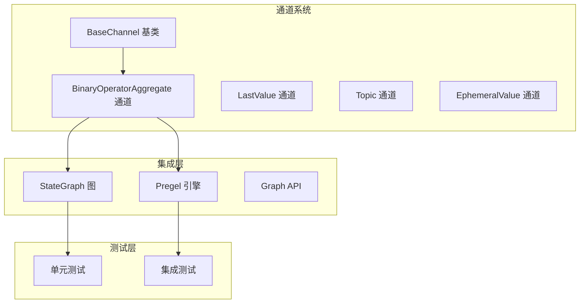
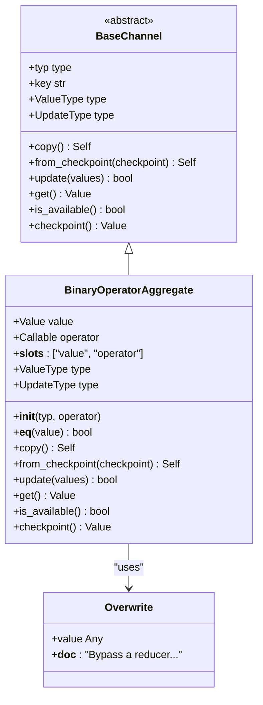
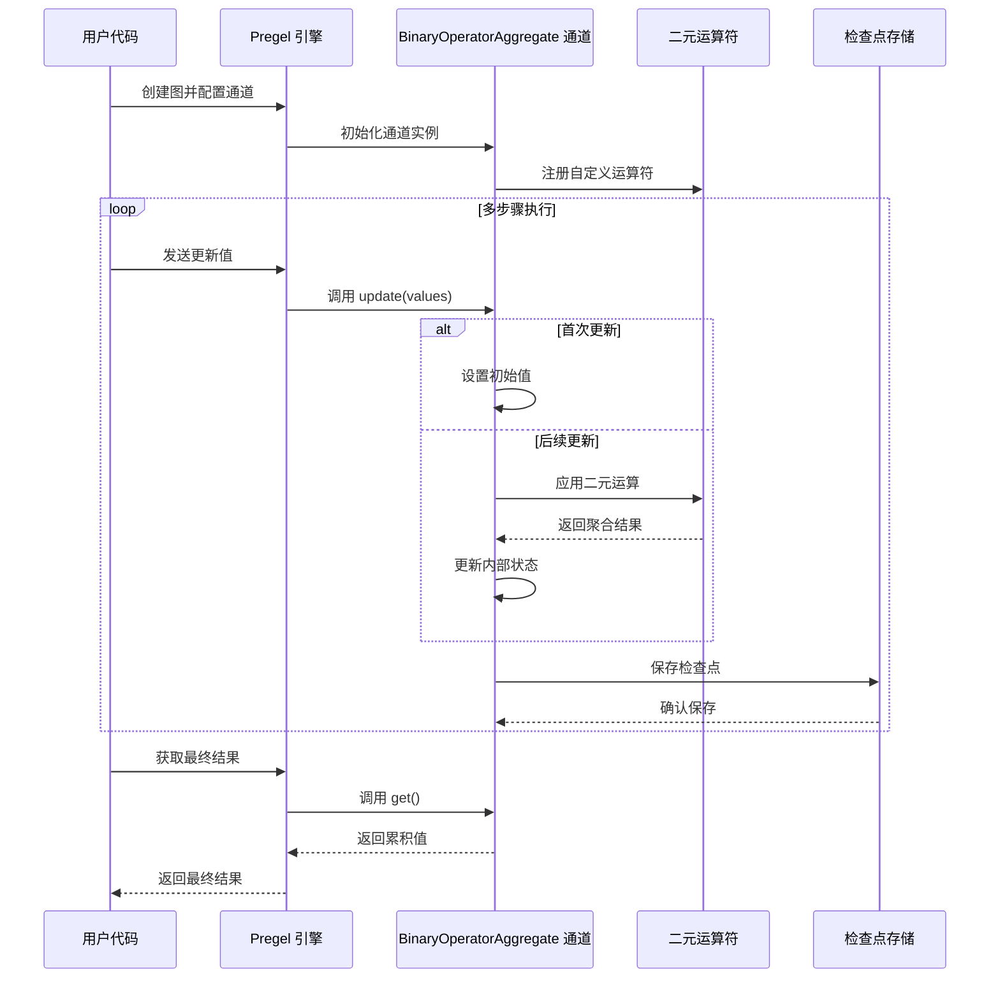
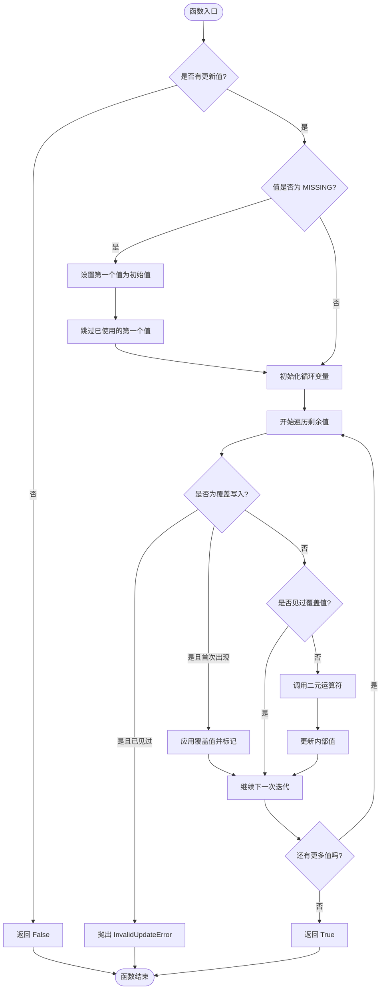
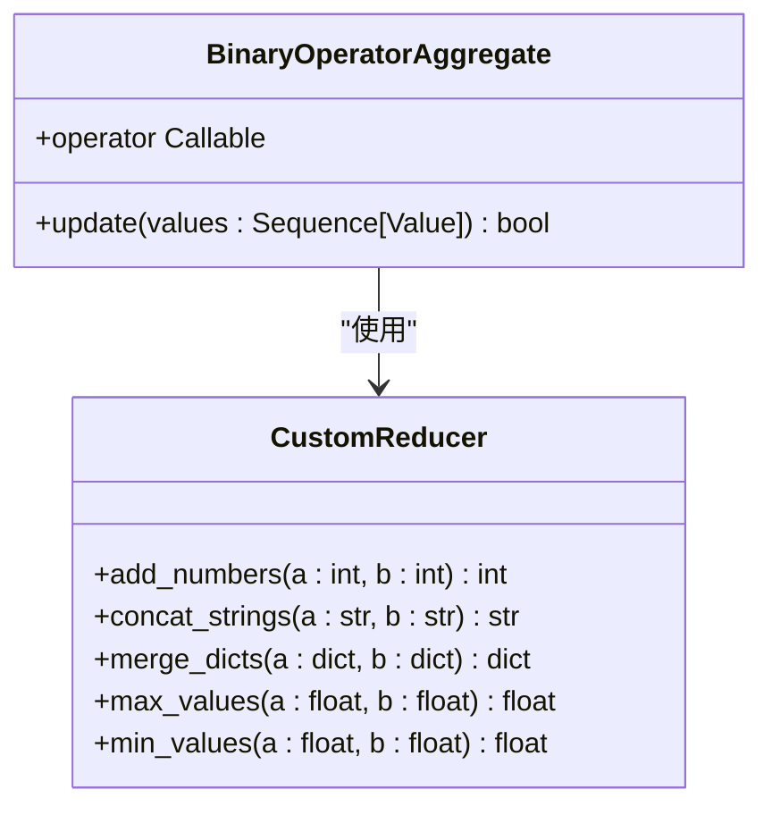
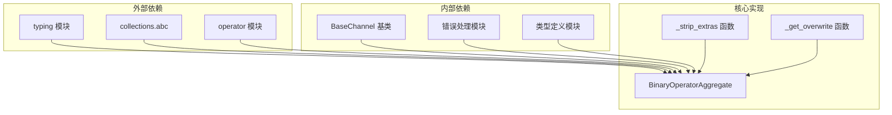

# BinaryOperatorAggregate 通道

<cite>
**本文档引用的文件**
- [binop.py](file://libs/langgraph/langgraph/channels/binop.py)
- [__init__.py](file://libs/langgraph/langgraph/channels/__init__.py)
- [state.py](file://libs/langgraph/langgraph/graph/state.py)
- [main.py](file://libs/langgraph/langgraph/pregel/main.py)
- [test_channels.py](file://libs/langgraph/tests/test_channels.py)
- [test_pregel.py](file://libs/langgraph/tests/test_pregel.py)
- [test_pregel_async.py](file://libs/langgraph/tests/test_pregel_async.py)
- [types.py](file://libs/langgraph/langgraph/types.py)
- [errors.py](file://libs/langgraph/langgraph/errors.py)
</cite>

## 目录
1. [简介](#简介)
2. [项目结构](#项目结构)
3. [核心组件](#核心组件)
4. [架构概览](#架构概览)
5. [详细组件分析](#详细组件分析)
6. [依赖关系分析](#依赖关系分析)
7. [性能考虑](#性能考虑)
8. [故障排除指南](#故障排除指南)
9. [结论](#结论)
10. [附录](#附录)

## 简介

BinaryOperatorAggregate 通道是 LangGraph 框架中的一个高级通道类型，专门设计用于在多步骤执行过程中累积计算结果。该通道的核心设计理念是通过二元运算符对当前值和新值进行连续聚合，从而实现状态的持久化累积。

该通道的主要特点包括：
- 支持自定义二元运算符，允许用户定义特定的聚合逻辑
- 提供类型安全机制，确保运算符签名符合预期
- 实现了检查点持久化功能，支持从中间状态恢复执行
- 包含错误处理策略，处理并发更新和无效操作
- 支持覆盖写入模式，允许绕过聚合直接设置值

## 项目结构

BinaryOperatorAggregate 通道位于 LangGraph 的通道系统中，作为高级通道类型之一与其他通道类型共同工作：



**图表来源**
- [binop.py:41-135](file://libs/langgraph/langgraph/channels/binop.py#L41-L135)
- [__init__.py:1-28](file://libs/langgraph/langgraph/channels/__init__.py#L1-L28)

**章节来源**
- [binop.py:1-135](file://libs/langgraph/langgraph/channels/binop.py#L1-L135)
- [__init__.py:1-28](file://libs/langgraph/langgraph/channels/__init__.py#L1-L28)

## 核心组件

BinaryOperatorAggregate 通道的核心实现包含以下关键组件：

### 主要数据结构



**图表来源**
- [binop.py:41-135](file://libs/langgraph/langgraph/channels/binop.py#L41-L135)
- [types.py:832-873](file://libs/langgraph/langgraph/types.py#L832-L873)

### 类型安全机制

通道实现了严格的类型安全检查，确保运算符签名符合二元运算的要求：

- **泛型约束**: 使用 `Generic[Value]` 确保类型一致性
- **运算符验证**: 通过 `signature()` 验证运算符必须接受恰好两个参数
- **类型擦除处理**: 使用 `_strip_extras()` 处理 `typing` 和 `collections.abc` 类型
- **初始化保护**: 对不可实例化的类型使用 `MISSING` 占位符

**章节来源**
- [binop.py:41-86](file://libs/langgraph/langgraph/channels/binop.py#L41-L86)
- [state.py:1678-1696](file://libs/langgraph/langgraph/graph/state.py#L1678-L1696)

## 架构概览

BinaryOperatorAggregate 通道在整个 LangGraph 架构中扮演着重要的角色，作为状态累积的核心组件：



**图表来源**
- [binop.py:102-134](file://libs/langgraph/langgraph/channels/binop.py#L102-L134)
- [main.py:390-589](file://libs/langgraph/langgraph/pregel/main.py#L390-L589)

## 详细组件分析

### 聚合算法实现

BinaryOperatorAggregate 通道的聚合算法遵循以下流程：



**图表来源**
- [binop.py:102-123](file://libs/langgraph/langgraph/channels/binop.py#L102-L123)

### 初始值设置策略

通道的初始值设置遵循以下策略：

1. **类型推导**: 通过 `_strip_extras()` 处理 `typing` 和 `collections.abc` 类型
2. **具体类型映射**: 将抽象类型映射到具体实现（如 `Sequence → list`）
3. **安全初始化**: 尝试调用类型的无参构造函数，失败时使用 `MISSING`
4. **懒加载机制**: 只有在收到第一个更新值时才真正初始化

### 运算符应用机制

二元运算符的应用过程包含以下步骤：

1. **覆盖写入检测**: 使用 `_get_overwrite()` 检查是否为覆盖写入
2. **并发控制**: 确保每个超级步骤只能有一个覆盖写入
3. **运算符调用**: 对未被覆盖的值调用二元运算符
4. **结果更新**: 将运算结果存储到通道中

### 结果合并过程

结果的合并采用累积式更新策略：

- **顺序性保证**: 按照更新值的顺序依次应用运算符
- **不可变性**: 运算符应保持输入不变，返回新的结果
- **类型一致性**: 确保运算结果与期望类型兼容

**章节来源**
- [binop.py:53-68](file://libs/langgraph/langgraph/channels/binop.py#L53-L68)
- [binop.py:102-123](file://libs/langgraph/langgraph/channels/binop.py#L102-L123)

### 自定义运算符实现指南

实现自定义二元运算符需要满足以下要求：

#### 基本要求
- **签名**: 必须接受恰好两个参数 `(a, b) → c`
- **类型**: 参数和返回值类型必须与通道类型一致
- **幂等性**: 运算结果不应改变输入参数的状态

#### 实现示例



**图表来源**
- [main.py:514-556](file://libs/langgraph/langgraph/pregel/main.py#L514-L556)

### 类型安全机制详解

通道实现了多层次的类型安全保障：

#### 编译时类型检查
- **泛型约束**: 使用 `Generic[Value]` 确保类型一致性
- **运算符签名验证**: 通过 `signature()` 验证参数数量和类型
- **类型擦除处理**: 使用 `_strip_extras()` 处理复杂类型

#### 运行时类型验证
- **空值检查**: 使用 `EmptyChannelError` 处理未初始化状态
- **并发更新检查**: 防止同一步骤内的多重覆盖写入
- **异常传播**: 将底层错误转换为语义化的异常信息

**章节来源**
- [binop.py:70-76](file://libs/langgraph/langgraph/channels/binop.py#L70-L76)
- [errors.py:68-77](file://libs/langgraph/langgraph/errors.py#L68-L77)

### 错误处理策略

BinaryOperatorAggregate 通道实现了完善的错误处理机制：

#### 已知错误类型
- **EmptyChannelError**: 当尝试获取未初始化的通道值时抛出
- **InvalidUpdateError**: 当违反更新规则时抛出（如多重覆盖写入）

#### 错误传播机制
- **语义化消息**: 使用 `create_error_message()` 生成可诊断的错误信息
- **错误码关联**: 将错误与特定的故障排除指南关联
- **异常链**: 保持原始异常信息以便调试

**章节来源**
- [binop.py:125-128](file://libs/langgraph/langgraph/channels/binop.py#L125-L128)
- [binop.py:112-118](file://libs/langgraph/langgraph/channels/binop.py#L112-L118)
- [errors.py:37-42](file://libs/langgraph/langgraph/errors.py#L37-L42)

## 依赖关系分析

BinaryOperatorAggregate 通道的依赖关系相对简洁，主要依赖于基础通道框架和类型系统：



**图表来源**
- [binop.py:1-16](file://libs/langgraph/langgraph/channels/binop.py#L1-L16)
- [binop.py:22-38](file://libs/langgraph/langgraph/channels/binop.py#L22-L38)

**章节来源**
- [binop.py:1-16](file://libs/langgraph/langgraph/channels/binop.py#L1-L16)
- [binop.py:22-38](file://libs/langgraph/langgraph/channels/binop.py#L22-L38)

## 性能考虑

BinaryOperatorAggregate 通道在设计时充分考虑了性能优化：

### 时间复杂度
- **单次更新**: O(n)，其中 n 是传入值的数量
- **空间复杂度**: O(1)，只存储单一累积值
- **检查点操作**: O(1)，直接序列化当前值

### 内存优化策略
- **惰性初始化**: 只在需要时创建初始值
- **不可变对象**: 鼓励使用不可变运算符避免意外修改
- **类型优化**: 使用 `__slots__` 减少内存占用

### 并发处理
- **原子更新**: 单个通道的更新是原子性的
- **无锁设计**: 避免使用锁机制提高并发性能
- **错误隔离**: 单个通道的错误不影响其他通道

## 故障排除指南

### 常见问题及解决方案

#### 问题1: "无法接收多个覆盖写入"
**症状**: 在同一超级步骤内多次发送覆盖写入导致错误
**解决方案**: 
- 确保每个步骤只发送一次覆盖写入
- 使用 `Overwrite` 包装器正确传递覆盖值

#### 问题2: "通道为空"
**症状**: 调用 `get()` 时抛出 `EmptyChannelError`
**解决方案**:
- 确保至少有一个更新值到达通道
- 检查通道是否正确初始化
- 验证检查点恢复是否成功

#### 问题3: "运算符签名无效"
**症状**: 创建通道时抛出 `ValueError`
**解决方案**:
- 确保运算符接受恰好两个参数
- 验证参数和返回值类型兼容

**章节来源**
- [binop.py:112-118](file://libs/langgraph/langgraph/channels/binop.py#L112-L118)
- [binop.py:125-128](file://libs/langgraph/langgraph/channels/binop.py#L125-L128)
- [state.py:1693-1695](file://libs/langgraph/langgraph/graph/state.py#L1693-L1695)

## 结论

BinaryOperatorAggregate 通道是 LangGraph 框架中一个精心设计的高级通道类型，它提供了强大的状态累积能力。通过支持自定义二元运算符，该通道能够适应各种聚合场景，从简单的数值求和到复杂的复合数据结构合并。

该通道的主要优势包括：
- **灵活性**: 支持任意二元运算符，适应不同业务需求
- **可靠性**: 完善的类型安全和错误处理机制
- **性能**: 优化的内存使用和快速的更新操作
- **可扩展性**: 易于集成到现有的 LangGraph 生态系统中

对于开发者而言，理解该通道的设计理念和实现细节有助于更好地利用其功能，构建更加健壮和高效的多步骤处理流程。

## 附录

### 实际使用示例

#### 数值求和示例
```python
# 使用 operator.add 进行整数求和
total = Channels.BinaryOperatorAggregate(int, operator.add)
```

#### 字符串连接示例
```python
# 自定义字符串连接运算符
def concat_with_separator(current, update):
    if current:
        return current + " | " + update
    else:
        return update

channel = BinaryOperatorAggregate(str, concat_with_separator)
```

#### 最大值查找示例
```python
# 查找数值序列中的最大值
max_value = BinaryOperatorAggregate(float, lambda a, b: max(a, b))
```

#### 字典合并示例
```python
# 合并字典内容
merged_dict = BinaryOperatorAggregate(dict, lambda a, b: {**a, **b})
```

**章节来源**
- [main.py:514-556](file://libs/langgraph/langgraph/pregel/main.py#L514-L556)
- [test_channels.py:77-91](file://libs/langgraph/tests/test_channels.py#L77-L91)

### 测试验证

通道的功能通过多种测试场景得到验证：

- **基本功能测试**: 验证求和、检查点恢复等核心功能
- **并发更新测试**: 确保覆盖写入的正确处理
- **错误处理测试**: 验证异常情况下的行为
- **集成测试**: 在完整 Pregel 工作流中的表现

这些测试确保了 BinaryOperatorAggregate 通道在实际使用中的可靠性和稳定性。