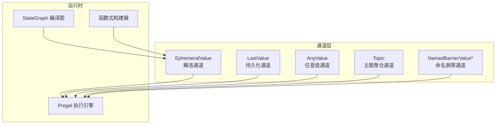
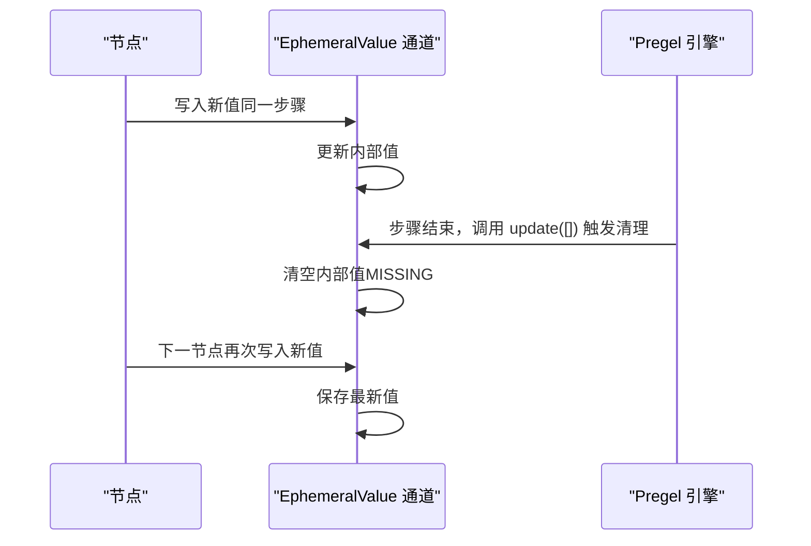
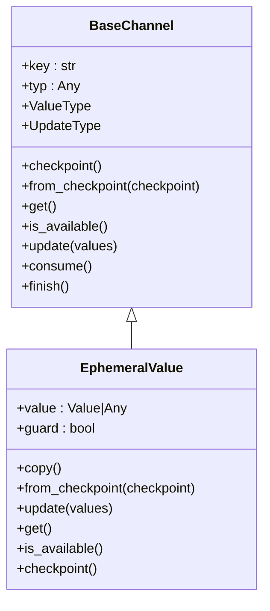
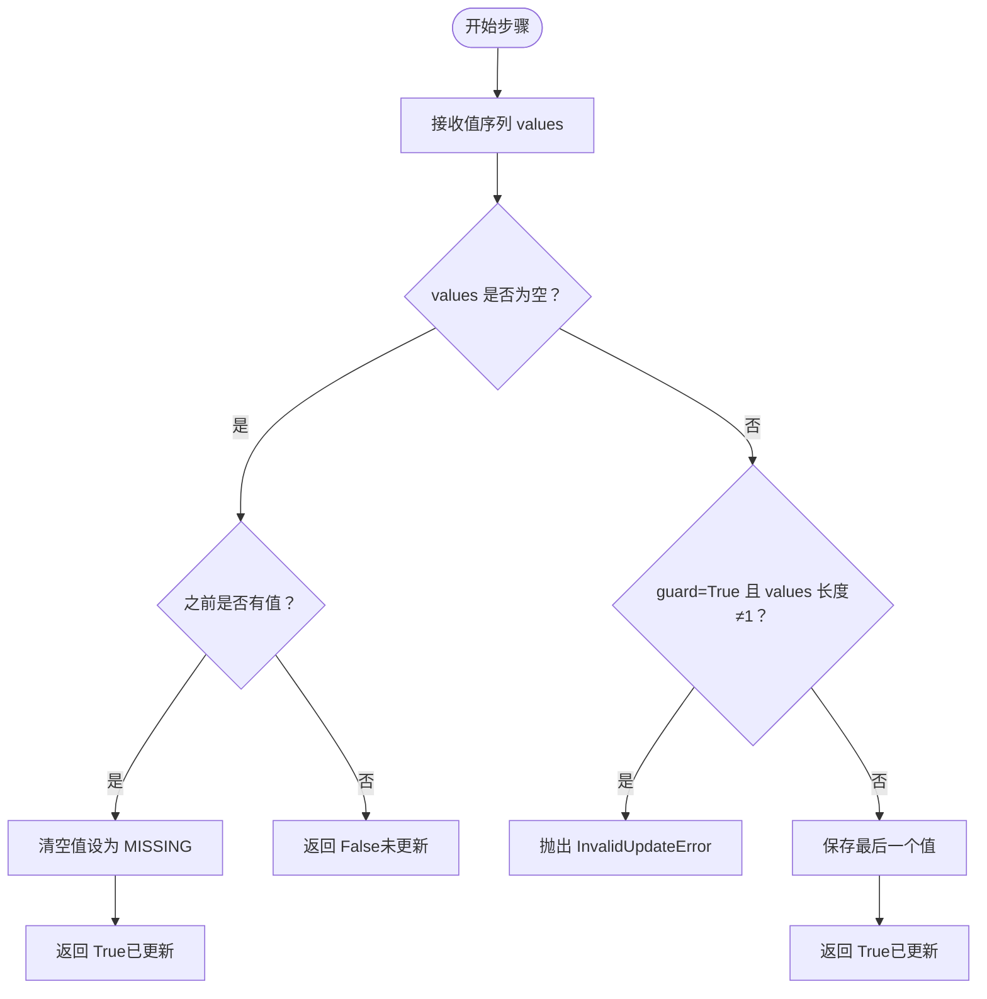
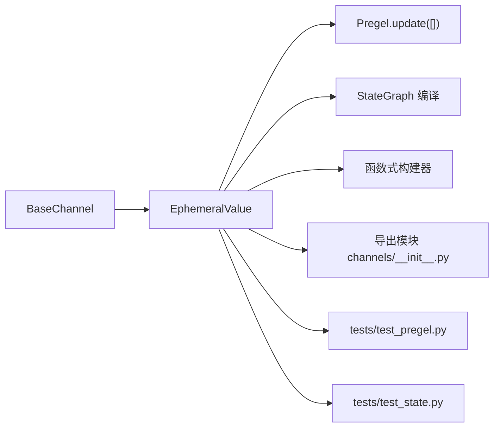

# EphemeralValue 通道

<cite>
**本文引用的文件**
- [ephemeral_value.py](file://libs/langgraph/langgraph/channels/ephemeral_value.py)
- [base.py](file://libs/langgraph/langgraph/channels/base.py)
- [state.py](file://libs/langgraph/langgraph/graph/state.py)
- [main.py](file://libs/langgraph/langgraph/pregel/main.py)
- [__init__.py（channels 导出）](file://libs/langgraph/langgraph/channels/__init__.py)
- [__init__.py（func 构建器）](file://libs/langgraph/langgraph/func/__init__.py)
- [test_pregel.py](file://libs/langgraph/tests/test_pregel.py)
- [test_state.py](file://libs/langgraph/tests/test_state.py)
</cite>

## 目录
1. [简介](#简介)
2. [项目结构](#项目结构)
3. [核心组件](#核心组件)
4. [架构总览](#架构总览)
5. [详细组件分析](#详细组件分析)
6. [依赖分析](#依赖分析)
7. [性能考量](#性能考量)
8. [故障排查指南](#故障排查指南)
9. [结论](#结论)
10. [附录：常见应用场景与最佳实践](#附录常见应用场景与最佳实践)

## 简介
EphemeralValue 是 LangGraph 中的一种“瞬态通道”，用于在单次执行步骤内暂存数据，并在该步骤结束后自动清理。它非常适合临时状态标记、一次性数据传递以及调试信息记录等场景。与持久化通道不同，EphemeralValue 不会将值写入检查点或跨步骤保留，从而避免了状态膨胀和副作用扩散。

## 项目结构
本节聚焦于与 EphemeralValue 直接相关的模块与使用位置：
- 通道定义与基类：channels/ephemeral_value.py、channels/base.py
- 使用入口与示例：pregel/main.py
- 图构建与状态图集成：graph/state.py、func/__init__.py
- 导出与测试：channels/__init__.py、tests/test_pregel.py、tests/test_state.py

图表来源
- [ephemeral_value.py:15-79](file://libs/langgraph/langgraph/channels/ephemeral_value.py#L15-L79)
- [base.py:19-122](file://libs/langgraph/langgraph/channels/base.py#L19-L122)
- [main.py:415-590](file://libs/langgraph/langgraph/pregel/main.py#L415-L590)
- [state.py:1147](file://libs/langgraph/langgraph/graph/state.py#L1147)
- [__init__.py（channels 导出）:3-27](file://libs/langgraph/langgraph/channels/__init__.py#L3-L27)

章节来源
- [ephemeral_value.py:15-79](file://libs/langgraph/langgraph/channels/ephemeral_value.py#L15-L79)
- [base.py:19-122](file://libs/langgraph/langgraph/channels/base.py#L19-L122)
- [main.py:415-590](file://libs/langgraph/langgraph/pregel/main.py#L415-L590)
- [state.py:1147](file://libs/langgraph/langgraph/graph/state.py#L1147)
- [__init__.py（channels 导出）:3-27](file://libs/langgraph/langgraph/channels/__init__.py#L3-L27)

## 核心组件
- EphemeralValue：瞬态通道，仅在当前步骤有效；步骤结束即清空。
- BaseChannel：所有通道的抽象基类，定义统一接口（读写、可用性、检查点、从检查点恢复等）。
- Pregel：执行引擎，负责在每步结束调用各通道的 update（空序列），以触发清理逻辑。
- StateGraph/函数式构建器：在编译图中注入 EphemeralValue，用于输入、分支条件等瞬态场景。

章节来源
- [ephemeral_value.py:15-79](file://libs/langgraph/langgraph/channels/ephemeral_value.py#L15-L79)
- [base.py:19-122](file://libs/langgraph/langgraph/channels/base.py#L19-L122)
- [state.py:1147](file://libs/langgraph/langgraph/graph/state.py#L1147)
- [__init__.py（func 构建器）:548](file://libs/langgraph/langgraph/func/__init__.py#L548)

## 架构总览
下图展示了 EphemeralValue 在执行流程中的角色：在节点执行后，Pregel 调用通道的 update 并传入空序列，从而触发 EphemeralValue 清理内部值；若在同一步骤收到新值，则保存最新值供后续读取。

图表来源
- [ephemeral_value.py:55-68](file://libs/langgraph/langgraph/channels/ephemeral_value.py#L55-L68)
- [base.py:89-100](file://libs/langgraph/langgraph/channels/base.py#L89-L100)

## 详细组件分析

### 类关系与职责

图表来源
- [base.py:19-122](file://libs/langgraph/langgraph/channels/base.py#L19-L122)
- [ephemeral_value.py:15-79](file://libs/langgraph/langgraph/channels/ephemeral_value.py#L15-L79)

章节来源
- [base.py:19-122](file://libs/langgraph/langgraph/channels/base.py#L19-L122)
- [ephemeral_value.py:15-79](file://libs/langgraph/langgraph/channels/ephemeral_value.py#L15-L79)

### 生命周期与清理机制
- 初始化：value 设为 MISSING，表示未赋值。
- 写入：当同一步骤收到非空值序列时，保存最后一个值；若 guard=True 且收到多个值则抛出异常。
- 读取：若当前值为 MISSING，读取时抛出 EmptyChannelError。
- 可用性：is_available 返回是否持有有效值。
- 步骤结束清理：Pregel 在每步末调用 update([])，若之前有值则清空并返回更新成功；否则不更新。
- 检查点：checkpoint 返回当前值（可能为 MISSING），用于序列化；from_checkpoint 支持从检查点恢复。

图表来源
- [ephemeral_value.py:55-68](file://libs/langgraph/langgraph/channels/ephemeral_value.py#L55-L68)

章节来源
- [ephemeral_value.py:55-79](file://libs/langgraph/langgraph/channels/ephemeral_value.py#L55-L79)

### 与其他通道类型的对比
- 与 LastValue 对比：LastValue 会持久化值并在 finish 后才可读取；EphemeralValue 仅在当前步骤有效，步骤结束即清空。
- 与 AnyValue 对比：AnyValue 行为类似但无 guard 限制；EphemeralValue 提供 guard 保护与明确的瞬态语义。
- 与 Topic 对比：Topic 用于多写入聚合；EphemeralValue 适合一次性瞬时数据。
- 与 NamedBarrierValue* 对比：后者等待一组命名来源全部到达；EphemeralValue 不关心来源数量，仅保存最新值。

章节来源
- [ephemeral_value.py:55-79](file://libs/langgraph/langgraph/channels/ephemeral_value.py#L55-L79)
- [base.py:49-87](file://libs/langgraph/langgraph/channels/base.py#L49-L87)

### 在图构建与执行中的应用
- 输入通道：在 StateGraph 编译时，将 START 通道设置为 EphemeralValue，以便在首次进入时携带输入数据，随后被清理。
- 分支条件：在节点编译时，分支触发通道使用 EphemeralValue(Any, guard=False)，确保分支条件在步骤内可用且不会残留。
- 函数式构建器：在函数式图构建中，START 通道同样采用 EphemeralValue，便于一次性输入传递。

章节来源
- [state.py:1147](file://libs/langgraph/langgraph/graph/state.py#L1147)
- [state.py:1318-1322](file://libs/langgraph/langgraph/graph/state.py#L1318-L1322)
- [__init__.py（func 构建器）:548](file://libs/langgraph/langgraph/func/__init__.py#L548)

## 依赖分析
- EphemeralValue 继承自 BaseChannel，遵循统一的通道接口契约。
- Pregel 在每步结束调用通道 update([]) 触发清理。
- StateGraph/函数式构建器在编译阶段注入 EphemeralValue，用于输入与分支控制。
- 导出模块将 EphemeralValue 暴露给用户，测试模块验证其行为。

图表来源
- [base.py:19-122](file://libs/langgraph/langgraph/channels/base.py#L19-L122)
- [ephemeral_value.py:15-79](file://libs/langgraph/langgraph/channels/ephemeral_value.py#L15-L79)
- [main.py:415-590](file://libs/langgraph/langgraph/pregel/main.py#L415-L590)
- [state.py:1147](file://libs/langgraph/langgraph/graph/state.py#L1147)
- [__init__.py（channels 导出）:3-27](file://libs/langgraph/langgraph/channels/__init__.py#L3-L27)
- [test_pregel.py:225](file://libs/langgraph/tests/test_pregel.py#L225)
- [test_state.py:361](file://libs/langgraph/tests/test_state.py#L361)

章节来源
- [base.py:19-122](file://libs/langgraph/langgraph/channels/base.py#L19-L122)
- [ephemeral_value.py:15-79](file://libs/langgraph/langgraph/channels/ephemeral_value.py#L15-L79)
- [main.py:415-590](file://libs/langgraph/langgraph/pregel/main.py#L415-L590)
- [state.py:1147](file://libs/langgraph/langgraph/graph/state.py#L1147)
- [__init__.py（channels 导出）:3-27](file://libs/langgraph/langgraph/channels/__init__.py#L3-L27)
- [test_pregel.py:225](file://libs/langgraph/tests/test_pregel.py#L225)
- [test_state.py:361](file://libs/langgraph/tests/test_state.py#L361)

## 性能考量
- 内存效率：EphemeralValue 仅保存一次值，步骤结束即清空，避免长期占用内存；适合大流量或高频步骤场景。
- 计算开销：读写均为 O(1)，checkpoint 返回当前值或 MISSING，序列化成本低。
- 并发安全：通道实例在单次步骤内使用，不存在跨线程共享问题；guard 模式可防止意外的多值写入导致的歧义。

## 故障排查指南
- 读取空通道：若在步骤未写入或已被清理，get 将抛出 EmptyChannelError。请确认写入时机与 guard 设置。
- 多值写入异常：当 guard=True 且同一步骤收到多个值时，抛出 InvalidUpdateError。请改为 guard=False 或合并写入。
- 未清理残留：若发现值在步骤间残留，检查是否在自定义通道中覆盖了清理逻辑；默认情况下 Pregel 会在每步结束调用 update([]) 触发清理。

章节来源
- [ephemeral_value.py:70-73](file://libs/langgraph/langgraph/channels/ephemeral_value.py#L70-L73)
- [ephemeral_value.py:62-65](file://libs/langgraph/langgraph/channels/ephemeral_value.py#L62-L65)
- [base.py:89-100](file://libs/langgraph/langgraph/channels/base.py#L89-L100)

## 结论
EphemeralValue 通过“仅在当前步骤有效”的设计，提供了轻量级、可预测的瞬态数据承载能力。它与 Pregel 的清理机制协同工作，在保证正确性的前提下显著降低状态管理复杂度与内存占用。结合 StateGraph 与函数式构建器，EphemeralValue 成为输入传递、分支条件与调试信息记录的理想选择。

## 附录：常见应用场景与最佳实践

### 应用场景
- 临时状态标记：在步骤内标记中间状态，完成后自动失效。
- 一次性数据传递：如将输入一次性注入到图中，随后立即清理。
- 调试信息记录：在步骤内记录日志或指标，避免污染持久状态。

### 最佳实践
- 明确 guard 设置：默认 guard=True，确保每步只有一个值；需要接收多个值时显式设置 guard=False。
- 与持久化通道搭配：对需要跨步骤保留的数据使用 LastValue/Topic 等通道，对瞬时数据使用 EphemeralValue。
- 与分支控制结合：在节点编译时使用 EphemeralValue(Any, guard=False) 作为分支触发通道，确保条件在步骤内可用。
- 避免跨步骤依赖：不要期望 EphemeralValue 的值在步骤之间延续；如需持久化，请改用 LastValue 或 Topic。

### 示例参考路径
- 基础用法与多节点组合示例：[pregel/main.py:415-590](file://libs/langgraph/langgraph/pregel/main.py#L415-L590)
- 输入通道注入（StateGraph）：[graph/state.py:1147](file://libs/langgraph/langgraph/graph/state.py#L1147)
- 分支触发通道注入（StateGraph）：[graph/state.py:1318-1322](file://libs/langgraph/langgraph/graph/state.py#L1318-L1322)
- 函数式构建器中的 START 注入：[func/__init__.py:548](file://libs/langgraph/langgraph/func/__init__.py#L548)
- 测试用例（瞬态通道行为）：[tests/test_pregel.py:225](file://libs/langgraph/tests/test_pregel.py#L225)、[tests/test_state.py:361](file://libs/langgraph/tests/test_state.py#L361)