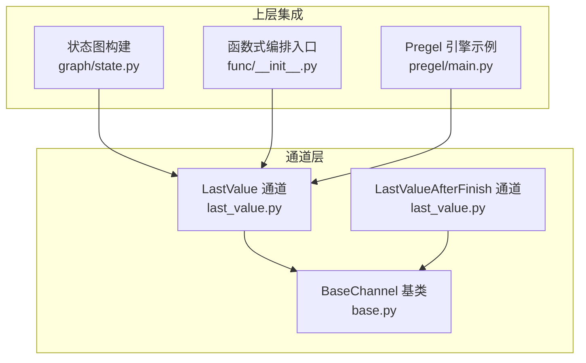
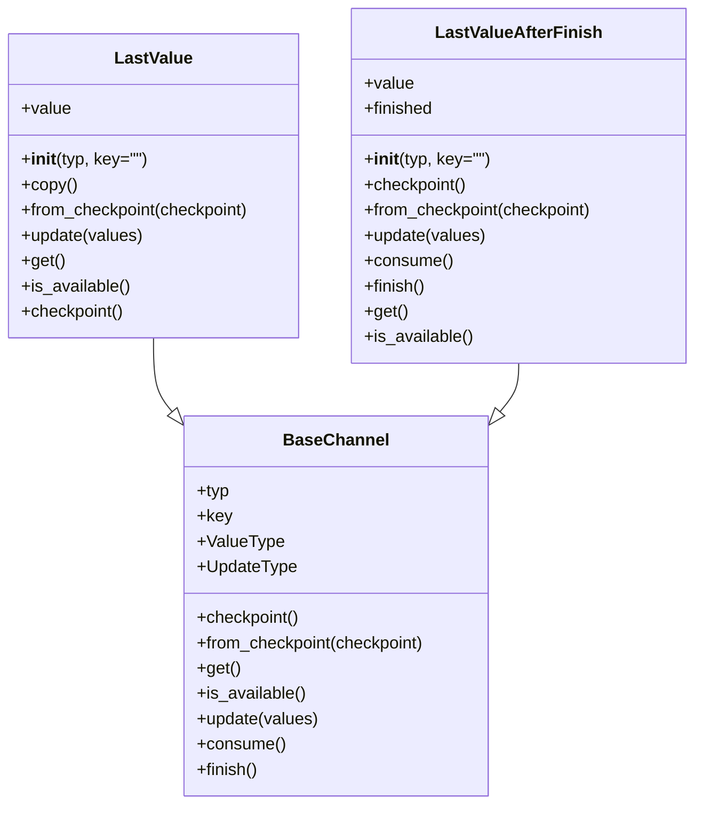
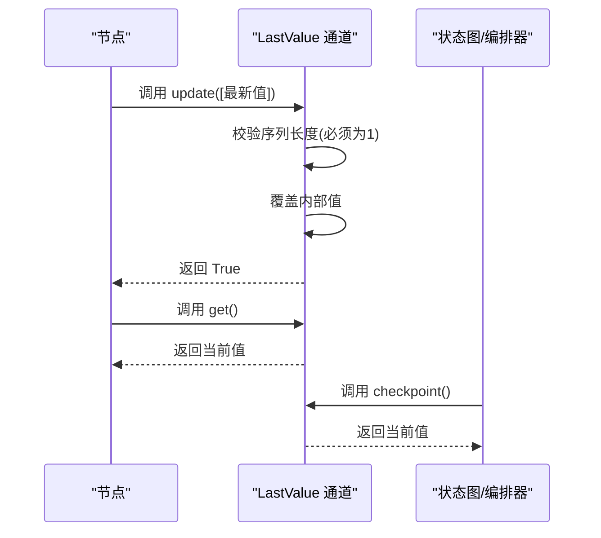
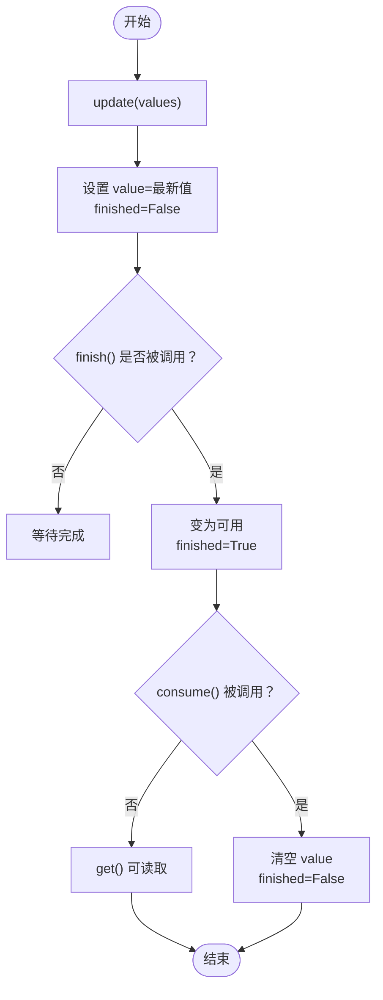
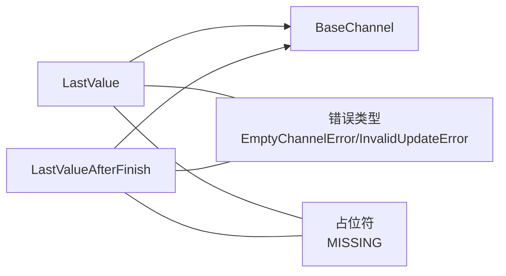

# LastValue 通道

<cite>
**本文引用的文件**
- [libs/langgraph/langgraph/channels/last_value.py](file://libs/langgraph/langgraph/channels/last_value.py)
- [libs/langgraph/langgraph/channels/base.py](file://libs/langgraph/langgraph/channels/base.py)
- [libs/langgraph/tests/test_channels.py](file://libs/langgraph/tests/test_channels.py)
- [libs/langgraph/langgraph/graph/state.py](file://libs/langgraph/langgraph/graph/state.py)
- [libs/langgraph/langgraph/func/__init__.py](file://libs/langgraph/langgraph/func/__init__.py)
- [libs/langgraph/langgraph/pregel/main.py](file://libs/langgraph/langgraph/pregel/main.py)
</cite>

## 目录
1. [简介](#简介)
2. [项目结构](#项目结构)
3. [核心组件](#核心组件)
4. [架构总览](#架构总览)
5. [详细组件分析](#详细组件分析)
6. [依赖分析](#依赖分析)
7. [性能考虑](#性能考虑)
8. [故障排查指南](#故障排查指南)
9. [结论](#结论)
10. [附录：API 参考](#附录api-参考)

## 简介
本文件系统性阐述 LastValue 通道的设计与实现，重点说明其“仅保留最新值”的特性、内部状态管理、更新与读取策略，以及在状态化代理中的典型用法。同时给出与其它通道类型（如 Topic、BinaryOperatorAggregate、UntrackedValue）的对比与选型建议，并提供基于仓库源码的完整 API 参考与流程图。

## 项目结构
与 LastValue 通道直接相关的代码主要位于以下模块：
- 通道实现：langgraph/channels/last_value.py
- 通道基类：langgraph/channels/base.py
- 使用示例与集成点：langgraph/graph/state.py、langgraph/func/__init__.py、langgraph/pregel/main.py
- 单元测试：tests/test_channels.py

图表来源
- [libs/langgraph/langgraph/channels/last_value.py:19-80](file://libs/langgraph/langgraph/channels/last_value.py#L19-L80)
- [libs/langgraph/langgraph/channels/base.py:19-122](file://libs/langgraph/langgraph/channels/base.py#L19-L122)
- [libs/langgraph/langgraph/graph/state.py:1658](file://libs/langgraph/langgraph/graph/state.py#L1658)
- [libs/langgraph/langgraph/func/__init__.py:548-552](file://libs/langgraph/langgraph/func/__init__.py#L548-L552)
- [libs/langgraph/langgraph/pregel/main.py:460-470](file://libs/langgraph/langgraph/pregel/main.py#L460-L470)

章节来源
- [libs/langgraph/langgraph/channels/last_value.py:19-80](file://libs/langgraph/langgraph/channels/last_value.py#L19-L80)
- [libs/langgraph/langgraph/channels/base.py:19-122](file://libs/langgraph/langgraph/channels/base.py#L19-L122)
- [libs/langgraph/langgraph/graph/state.py:1658](file://libs/langgraph/langgraph/graph/state.py#L1658)
- [libs/langgraph/langgraph/func/__init__.py:548-552](file://libs/langgraph/langgraph/func/__init__.py#L548-L552)
- [libs/langgraph/langgraph/pregel/main.py:460-470](file://libs/langgraph/langgraph/pregel/main.py#L460-L470)

## 核心组件
- LastValue：每步仅接收一个值，保存最新值；未初始化或为空时读取会抛出 EmptyChannelError。
- LastValueAfterFinish：与 LastValue 类似，但值仅在 finish() 后可用，且首次可用后会清空值，配合 consume() 实现一次性消费语义。
- BaseChannel：定义通道通用接口（类型、读写、检查点、可用性等），为具体通道提供统一契约。

章节来源
- [libs/langgraph/langgraph/channels/last_value.py:20-80](file://libs/langgraph/langgraph/channels/last_value.py#L20-L80)
- [libs/langgraph/langgraph/channels/last_value.py:81-152](file://libs/langgraph/langgraph/channels/last_value.py#L81-L152)
- [libs/langgraph/langgraph/channels/base.py:19-122](file://libs/langgraph/langgraph/channels/base.py#L19-L122)

## 架构总览
下图展示了 LastValue 与其基类、以及在状态图与函数式编排中的位置关系。

图表来源
- [libs/langgraph/langgraph/channels/last_value.py:20-80](file://libs/langgraph/langgraph/channels/last_value.py#L20-L80)
- [libs/langgraph/langgraph/channels/last_value.py:81-152](file://libs/langgraph/langgraph/channels/last_value.py#L81-L152)
- [libs/langgraph/langgraph/channels/base.py:19-122](file://libs/langgraph/langgraph/channels/base.py#L19-L122)

## 详细组件分析

### LastValue 组件分析
- 设计要点
  - 每步最多接收一个更新值；若传入多个值将触发 InvalidUpdateError。
  - 内部以单值存储最新值，支持 checkpoint/from_checkpoint 序列化。
  - 未初始化或为空时调用 get() 将抛出 EmptyChannelError。
- 关键方法
  - 构造：接收类型与可选键名，初始化内部值为 MISSING。
  - 更新：update(values) 仅允许非空序列且长度为 1，否则抛错；成功则覆盖最新值。
  - 读取：get() 返回当前值；若为空则抛错；is_available() 提供高效可用性判断。
  - 检查点：checkpoint() 返回当前值；from_checkpoint() 支持从检查点恢复。
  - 复制：copy() 返回相同类型的新实例并复制当前值。
- 典型使用场景
  - 作为状态图字段的默认通道，当字段未显式声明通道时自动回退为 LastValue。
  - 在函数式编排中用于保存返回值与中间保存值。

图表来源
- [libs/langgraph/langgraph/channels/last_value.py:56-78](file://libs/langgraph/langgraph/channels/last_value.py#L56-L78)
- [libs/langgraph/langgraph/channels/base.py:49-58](file://libs/langgraph/langgraph/channels/base.py#L49-L58)

章节来源
- [libs/langgraph/langgraph/channels/last_value.py:27-78](file://libs/langgraph/langgraph/channels/last_value.py#L27-L78)
- [libs/langgraph/tests/test_channels.py:16-33](file://libs/langgraph/tests/test_channels.py#L16-L33)
- [libs/langgraph/langgraph/graph/state.py:1658](file://libs/langgraph/langgraph/graph/state.py#L1658)
- [libs/langgraph/langgraph/func/__init__.py:548-552](file://libs/langgraph/langgraph/func/__init__.py#L548-L552)

### LastValueAfterFinish 组件分析
- 设计要点
  - 与 LastValue 类似，但值仅在 finish() 后变为可用；首次可用后会清空值，配合 consume() 实现一次性消费。
  - checkpoint() 返回 (value, finished) 元组；from_checkpoint() 支持从该格式恢复。
- 关键方法
  - 更新：update(values) 设置 finished=False 并覆盖最新值。
  - 完成：finish() 在有值时标记 finished=True。
  - 消费：consume() 在 finished=True 时清空值并重置 finished。
  - 读取：get() 要求值非空且 finished=True，否则抛 EmptyChannelError。
  - 可用性：is_available() 要求值非空且 finished=True。
- 典型使用场景
  - 需要“最终态”才可见的输出通道，避免提前读取中间结果。
  - 一次性消费模式下的输出通道。

图表来源
- [libs/langgraph/langgraph/channels/last_value.py:122-151](file://libs/langgraph/langgraph/channels/last_value.py#L122-L151)

章节来源
- [libs/langgraph/langgraph/channels/last_value.py:81-152](file://libs/langgraph/langgraph/channels/last_value.py#L81-L152)

### 与其它通道类型的对比
- LastValue vs Topic
  - LastValue：每步仅一个值，适合“最终态”输入/输出；Topic：累积多值，适合广播/聚合。
- LastValue vs BinaryOperatorAggregate
  - LastValue：简单覆盖；BinaryOperatorAggregate：对新值与旧值进行二元运算合并，适合累加/拼接等。
- LastValue vs UntrackedValue
  - LastValue：受检查点影响；UntrackedValue：checkpoint() 返回 MISSING，不参与持久化。
- 性能特征
  - LastValue：常数时间读写，内存占用最小；适合高频更新但只需最新值的场景。
  - Topic：按追加策略维护列表，空间随事件增长；适合需要历史记录的场景。
  - BinaryOperatorAggregate：每次更新执行一次二元运算，CPU 成本与运算复杂度相关。
  - UntrackedValue：checkpoint() 不保存状态，适合临时值。

章节来源
- [libs/langgraph/langgraph/channels/last_value.py:56-78](file://libs/langgraph/langgraph/channels/last_value.py#L56-L78)
- [libs/langgraph/langgraph/channels/topic.py:77-94](file://libs/langgraph/langgraph/channels/topic.py#L77-L94)
- [libs/langgraph/langgraph/channels/binop.py:53-86](file://libs/langgraph/langgraph/channels/binop.py#L53-L86)
- [libs/langgraph/langgraph/channels/any_value.py:52-72](file://libs/langgraph/langgraph/channels/any_value.py#L52-L72)

## 依赖分析
- 继承关系
  - LastValue 与 LastValueAfterFinish 均继承自 BaseChannel，遵循统一的通道接口契约。
- 运行期依赖
  - 错误类型：EmptyChannelError、InvalidUpdateError。
  - 类型占位：MISSING 表示未初始化状态。
- 集成点
  - 状态图字段解析：当字段未显式指定通道时，默认回退为 LastValue。
  - 函数式编排：在返回值与保存值通道中使用 LastValue。
  - Pregel 示例：在简单节点间传递字符串时使用 LastValue。

图表来源
- [libs/langgraph/langgraph/channels/last_value.py:10-15](file://libs/langgraph/langgraph/channels/last_value.py#L10-L15)
- [libs/langgraph/langgraph/channels/last_value.py:27-29](file://libs/langgraph/langgraph/channels/last_value.py#L27-L29)
- [libs/langgraph/langgraph/channels/last_value.py:92-95](file://libs/langgraph/langgraph/channels/last_value.py#L92-L95)

章节来源
- [libs/langgraph/langgraph/channels/last_value.py:10-15](file://libs/langgraph/langgraph/channels/last_value.py#L10-L15)
- [libs/langgraph/langgraph/graph/state.py:1658](file://libs/langgraph/langgraph/graph/state.py#L1658)
- [libs/langgraph/langgraph/func/__init__.py:548-552](file://libs/langgraph/langgraph/func/__init__.py#L548-L552)
- [libs/langgraph/langgraph/pregel/main.py:460-470](file://libs/langgraph/langgraph/pregel/main.py#L460-L470)

## 性能考虑
- 时间复杂度
  - LastValue：update/get/is_available 均为 O(1)。
  - Topic：update 取决于扁平化与追加操作；get 为 O(n)（n 为累积数量）。
  - BinaryOperatorAggregate：update 为 O(k)（k 为累积数量），取决于二元运算成本。
- 空间复杂度
  - LastValue：O(1)。
  - Topic：O(n)。
  - BinaryOperatorAggregate：O(1)（仅保存聚合值）。
- 适用建议
  - 需要“最终态”可见且一次性消费：优先 LastValueAfterFinish。
  - 需要最新值且简单高效：优先 LastValue。
  - 需要历史累积或广播：选择 Topic。
  - 需要合并运算（如累加、拼接）：选择 BinaryOperatorAggregate。
  - 临时值不希望持久化：选择 UntrackedValue。

## 故障排查指南
- EmptyChannelError
  - 触发条件：读取尚未初始化或已清空的通道。
  - 排查要点：确认是否已调用 update；确认是否在合适阶段调用 get。
- InvalidUpdateError
  - 触发条件：每步传入多个值（LastValue 要求每步仅一个值）。
  - 排查要点：拆分多次更新或改用 Topic/BinaryOperatorAggregate。
- LastValueAfterFinish 未读取到值
  - 触发条件：finish() 未被调用或 consume() 已消费。
  - 排查要点：确保在运行结束前调用 finish()；确认 consume() 的调用时机。

章节来源
- [libs/langgraph/langgraph/channels/last_value.py:69-72](file://libs/langgraph/langgraph/channels/last_value.py#L69-L72)
- [libs/langgraph/langgraph/channels/last_value.py:59-64](file://libs/langgraph/langgraph/channels/last_value.py#L59-L64)
- [libs/langgraph/langgraph/channels/last_value.py:145-148](file://libs/langgraph/langgraph/channels/last_value.py#L145-L148)

## 结论
LastValue 通道以极简设计实现了“每步仅一值”的存储模型，具备常数时间复杂度与最小内存占用，适合大多数“最终态”输入/输出场景。结合 LastValueAfterFinish 的完成态与一次性消费能力，可满足更严格的同步与一致性需求。在多通道类型中，应根据是否需要历史累积、是否需要合并运算、是否需要持久化等因素进行选择。

## 附录：API 参考

- LastValue
  - 构造函数
    - 参数
      - typ：值类型
      - key：通道键名（可选）
    - 返回：实例
  - 方法
    - copy() → Self：复制当前通道
    - from_checkpoint(checkpoint) → Self：从检查点恢复
    - update(values: Sequence[Value]) → bool：更新值（每步仅允许一个值）
    - get() → Value：读取当前值（未初始化则抛错）
    - is_available() → bool：判断是否可用
    - checkpoint() → Value：返回当前值
  - 异常
    - EmptyChannelError：读取未初始化值
    - InvalidUpdateError：每步传入多个值
  - 示例路径
    - [libs/langgraph/tests/test_channels.py:16-33](file://libs/langgraph/tests/test_channels.py#L16-L33)
    - [libs/langgraph/langgraph/pregel/main.py:460-470](file://libs/langgraph/langgraph/pregel/main.py#L460-L470)

- LastValueAfterFinish
  - 构造函数
    - 参数
      - typ：值类型
      - key：通道键名（可选）
    - 返回：实例
  - 方法
    - checkpoint() → tuple[Value, bool] | Any：返回 (值, 是否完成)
    - from_checkpoint(checkpoint) → Self：从 (值, 是否完成) 恢复
    - update(values: Sequence[Value]) → bool：更新值并重置完成态
    - consume() → bool：在完成态时清空值并重置完成态
    - finish() → bool：标记完成
    - get() → Value：在完成态且有值时返回，否则抛错
    - is_available() → bool：要求值非空且完成
  - 异常
    - EmptyChannelError：未完成或无值时读取
  - 示例路径
    - [libs/langgraph/langgraph/channels/last_value.py:122-151](file://libs/langgraph/langgraph/channels/last_value.py#L122-L151)

- BaseChannel（通用接口）
  - 属性
    - ValueType：存储值类型
    - UpdateType：更新值类型
  - 方法
    - checkpoint()：返回可序列化状态
    - from_checkpoint(checkpoint)：从检查点创建新实例
    - get()：读取当前值
    - is_available()：判断是否可用
    - update(values)：更新值（由子类实现）
    - consume()：通知任务已运行（可选）
    - finish()：通知运行结束（可选）
  - 示例路径
    - [libs/langgraph/langgraph/channels/base.py:19-122](file://libs/langgraph/langgraph/channels/base.py#L19-L122)

- 在状态化代理中的典型应用
  - 字段默认通道回退
    - 当字段未显式声明通道时，自动回退为 LastValue
    - 示例路径：[libs/langgraph/langgraph/graph/state.py:1658](file://libs/langgraph/langgraph/graph/state.py#L1658)
  - 函数式编排中的返回值与保存值
    - 使用 LastValue 保存返回值与中间保存值
    - 示例路径：[libs/langgraph/langgraph/func/__init__.py:548-552](file://libs/langgraph/langgraph/func/__init__.py#L548-L552)
  - Pregel 示例
    - 在节点间传递字符串时使用 LastValue
    - 示例路径：[libs/langgraph/langgraph/pregel/main.py:460-470](file://libs/langgraph/langgraph/pregel/main.py#L460-L470)