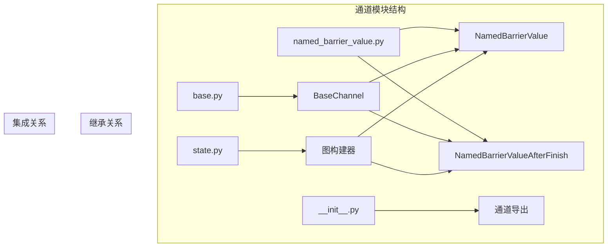
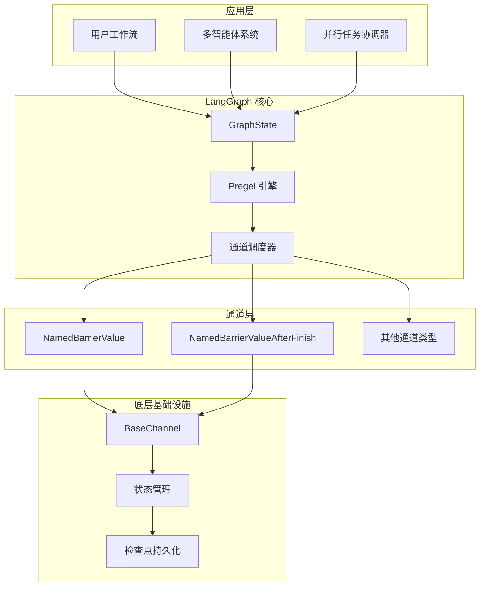
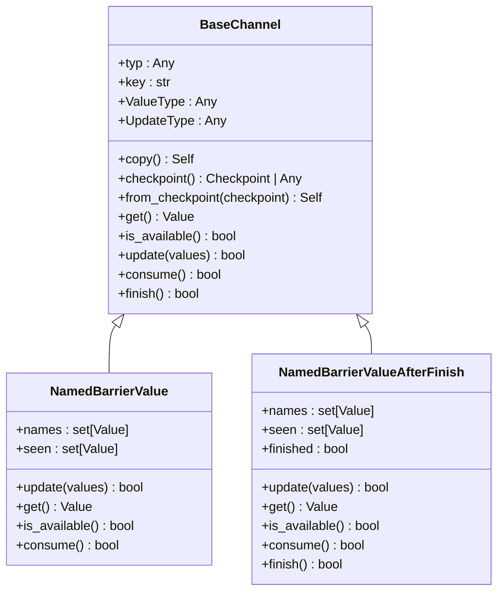
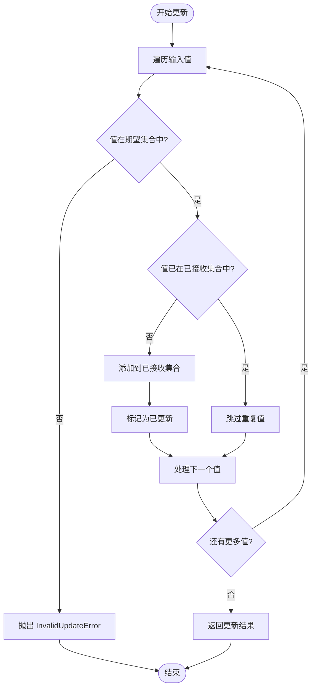
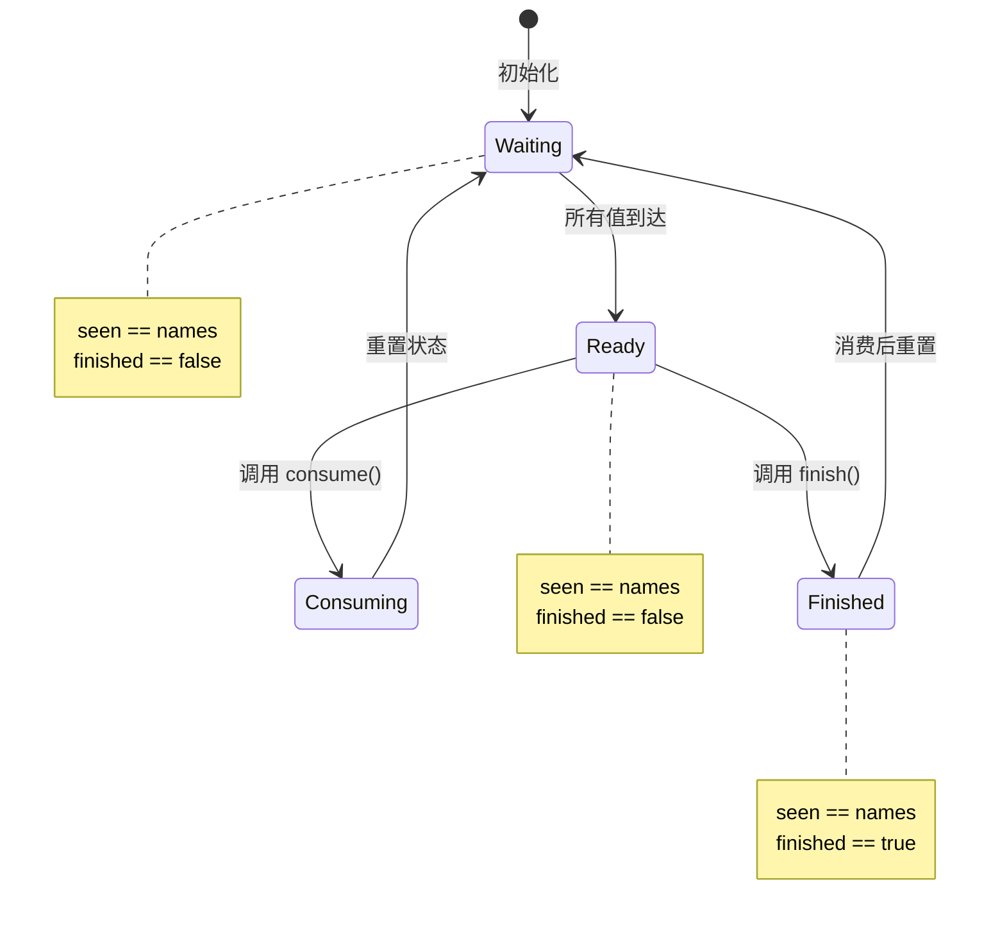
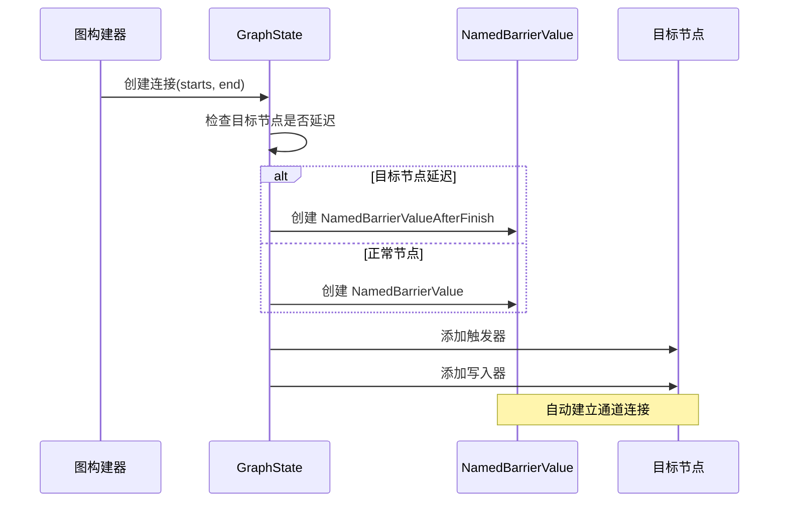
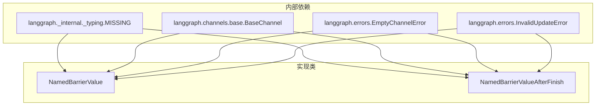
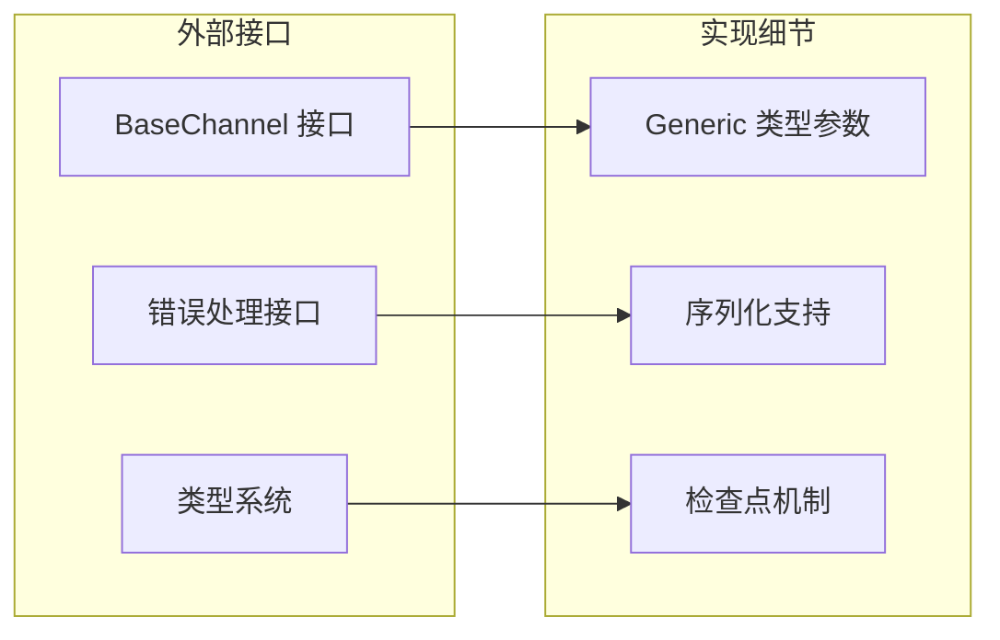
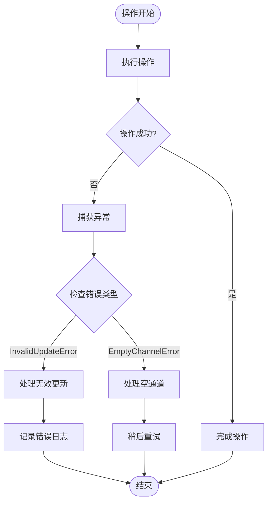

# NamedBarrierValue 通道

<cite>
**本文档引用的文件**
- [named_barrier_value.py](file://libs/langgraph/langgraph/channels/named_barrier_value.py)
- [base.py](file://libs/langgraph/langgraph/channels/base.py)
- [state.py](file://libs/langgraph/langgraph/graph/state.py)
- [__init__.py](file://libs/langgraph/langgraph/channels/__init__.py)
</cite>

## 目录
1. [简介](#简介)
2. [项目结构](#项目结构)
3. [核心组件](#核心组件)
4. [架构概览](#架构概览)
5. [详细组件分析](#详细组件分析)
6. [依赖关系分析](#依赖关系分析)
7. [性能考虑](#性能考虑)
8. [故障排除指南](#故障排除指南)
9. [结论](#结论)
10. [附录](#附录)

## 简介

NamedBarrierValue 通道是 LangGraph 框架中的一个关键同步原语，用于协调多个并发任务或条件的满足。该通道的核心功能是在所有指定的命名值都到达之前保持阻塞状态，只有当所有期望的条件都满足时才释放数据流。

这种屏障机制在复杂的多智能体系统、并行任务协调和条件同步场景中发挥着重要作用。通过 NamedBarrierValue，开发者可以构建更加灵活和强大的工作流，实现精确的执行时机控制和状态同步。

## 项目结构

NamedBarrierValue 通道位于 LangGraph 的通道模块中，与其它通道类型共同构成了完整的数据流基础设施：

**图表来源**
- [named_barrier_value.py:13-82](file://libs/langgraph/langgraph/channels/named_barrier_value.py#L13-L82)
- [base.py:19-122](file://libs/langgraph/langgraph/channels/base.py#L19-L122)
- [state.py:1340-1364](file://libs/langgraph/langgraph/graph/state.py#L1340-L1364)

**章节来源**
- [named_barrier_value.py:1-168](file://libs/langgraph/langgraph/channels/named_barrier_value.py#L1-L168)
- [base.py:1-122](file://libs/langgraph/langgraph/channels/base.py#L1-L122)
- [__init__.py:1-28](file://libs/langgraph/langgraph/channels/__init__.py#L1-L28)

## 核心组件

### NamedBarrierValue 类

NamedBarrierValue 是基础的命名屏障通道实现，它维护一个预定义的名称集合，并跟踪已接收的值集合。只有当接收到的值集合与预定义集合完全相等时，通道才被视为可用。

**核心特性：**
- **屏障计数**：通过 `names` 集合定义期望的值集合
- **状态跟踪**：使用 `seen` 集合记录已接收的值
- **同步机制**：等待所有命名值到达后才释放
- **幂等性**：重复接收相同值不会改变状态

### NamedBarrierValueAfterFinish 类

NamedBarrierValueAfterFinish 是 NamedBarrierValue 的增强版本，增加了完成标志（finish）机制。这个变体要求在所有命名值到达后，还需要显式调用 `finish()` 方法才能使通道变为可用状态。

**核心特性：**
- **双重条件**：需要满足屏障计数 AND 完成标志
- **延迟激活**：即使所有值都已到达，也需要手动完成
- **重置机制**：消费后会自动重置状态

**章节来源**
- [named_barrier_value.py:13-82](file://libs/langgraph/langgraph/channels/named_barrier_value.py#L13-L82)
- [named_barrier_value.py:84-168](file://libs/langgraph/langgraph/channels/named_barrier_value.py#L84-L168)

## 架构概览

NamedBarrierValue 通道在整个 LangGraph 架构中扮演着关键的协调角色：

**图表来源**
- [state.py:1340-1364](file://libs/langgraph/langgraph/graph/state.py#L1340-L1364)
- [base.py:19-122](file://libs/langgraph/langgraph/channels/base.py#L19-L122)

## 详细组件分析

### 基础通道接口

所有通道类型都必须实现 BaseChannel 接口定义的标准方法：

**图表来源**
- [base.py:19-122](file://libs/langgraph/langgraph/channels/base.py#L19-L122)
- [named_barrier_value.py:13-82](file://libs/langgraph/langgraph/channels/named_barrier_value.py#L13-L82)
- [named_barrier_value.py:84-168](file://libs/langgraph/langgraph/channels/named_barrier_value.py#L84-L168)

### 屏障管理逻辑

NamedBarrierValue 的核心同步机制基于以下算法：

**图表来源**
- [named_barrier_value.py:56-67](file://libs/langgraph/langgraph/channels/named_barrier_value.py#L56-L67)

### 状态转换机制

NamedBarrierValueAfterFinish 的状态转换遵循以下流程：

**图表来源**
- [named_barrier_value.py:147-168](file://libs/langgraph/langgraph/channels/named_barrier_value.py#L147-L168)

### 图构建器集成

NamedBarrierValue 在图构建过程中自动配置：

**图表来源**
- [state.py:1340-1364](file://libs/langgraph/langgraph/graph/state.py#L1340-L1364)

**章节来源**
- [named_barrier_value.py:13-82](file://libs/langgraph/langgraph/channels/named_barrier_value.py#L13-L82)
- [named_barrier_value.py:84-168](file://libs/langgraph/langgraph/channels/named_barrier_value.py#L84-L168)
- [state.py:1340-1364](file://libs/langgraph/langgraph/graph/state.py#L1340-L1364)

## 依赖关系分析

### 内部依赖关系

**图表来源**
- [named_barrier_value.py:1-10](file://libs/langgraph/langgraph/channels/named_barrier_value.py#L1-L10)

### 外部接口依赖

NamedBarrierValue 通过标准接口与其他组件交互：

**图表来源**
- [base.py:19-122](file://libs/langgraph/langgraph/channels/base.py#L19-L122)

**章节来源**
- [named_barrier_value.py:1-10](file://libs/langgraph/langgraph/channels/named_barrier_value.py#L1-L10)
- [base.py:1-122](file://libs/langgraph/langgraph/channels/base.py#L1-L122)

## 性能考虑

### 时间复杂度分析

- **更新操作**：O(n)，其中 n 是输入值的数量
- **查询操作**：O(1)，直接比较集合相等性
- **内存使用**：O(m)，其中 m 是期望值的总数

### 优化策略

1. **批量更新**：将多个值合并到单个 update 调用中
2. **早期退出**：重复值不进行额外处理
3. **集合操作优化**：利用集合的哈希特性和快速比较

### 内存管理

- 使用集合数据结构确保 O(1) 查找时间
- 及时清理已消费的状态
- 支持检查点持久化避免状态丢失

## 故障排除指南

### 常见错误类型

1. **InvalidUpdateError**：当尝试更新不在期望集合中的值时抛出
2. **EmptyChannelError**：当尝试获取未满足条件的值时抛出

### 错误处理策略

**图表来源**
- [named_barrier_value.py:64-72](file://libs/langgraph/langgraph/channels/named_barrier_value.py#L64-L72)

### 调试技巧

1. **状态监控**：定期检查 `seen` 和 `names` 集合的差异
2. **日志记录**：记录每次更新的详细信息
3. **超时检测**：实现适当的超时机制防止无限等待

**章节来源**
- [named_barrier_value.py:64-72](file://libs/langgraph/langgraph/channels/named_barrier_value.py#L64-L72)

## 结论

NamedBarrierValue 通道为 LangGraph 提供了强大而灵活的同步机制。通过精确的屏障计数和状态管理，它能够有效协调复杂的并行任务和条件同步场景。

其设计特点包括：
- **类型安全**：完整的泛型支持确保编译时类型检查
- **状态持久化**：完整的检查点机制保证状态可靠性
- **扩展性**：清晰的接口设计便于功能扩展
- **性能优化**：高效的集合操作和内存管理

这些特性使得 NamedBarrierValue 成为构建高级工作流和多智能体系统的理想选择。

## 附录

### 实际应用场景

1. **多智能体协作**：等待所有代理完成任务后再继续下一步
2. **并行数据处理**：确保所有数据源都准备好后再进行聚合
3. **条件触发**：基于多个条件的组合触发特定操作
4. **工作流编排**：协调复杂的业务流程步骤

### 设计模式建议

1. **屏障模式**：使用 NamedBarrierValueAfterFinish 实现延迟激活
2. **条件模式**：结合 Topic 通道实现动态条件判断
3. **聚合模式**：与 BinaryOperatorAggregate 协同处理聚合计算
4. **流水线模式**：在多级处理中使用多个屏障通道

### 最佳实践

1. **明确命名约定**：使用清晰的值标识符提高可维护性
2. **合理设置超时**：避免无限期等待导致的死锁
3. **错误处理**：实现完善的异常处理和恢复机制
4. **性能监控**：定期检查通道性能和资源使用情况