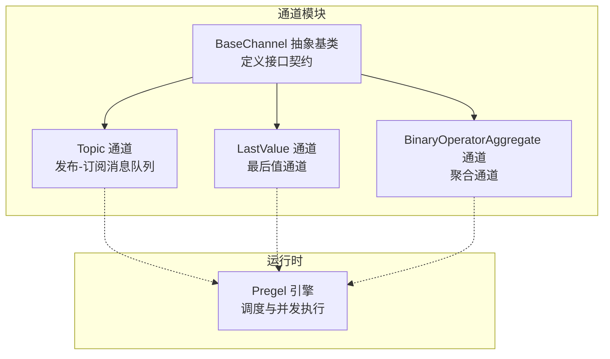
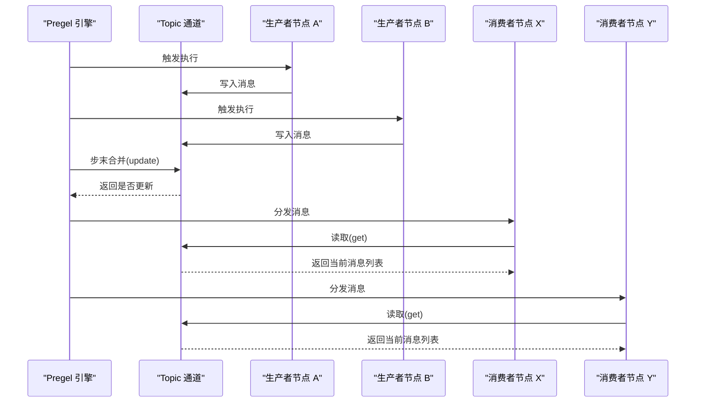
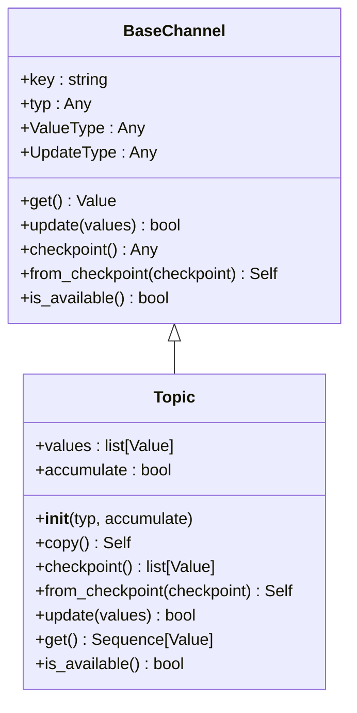
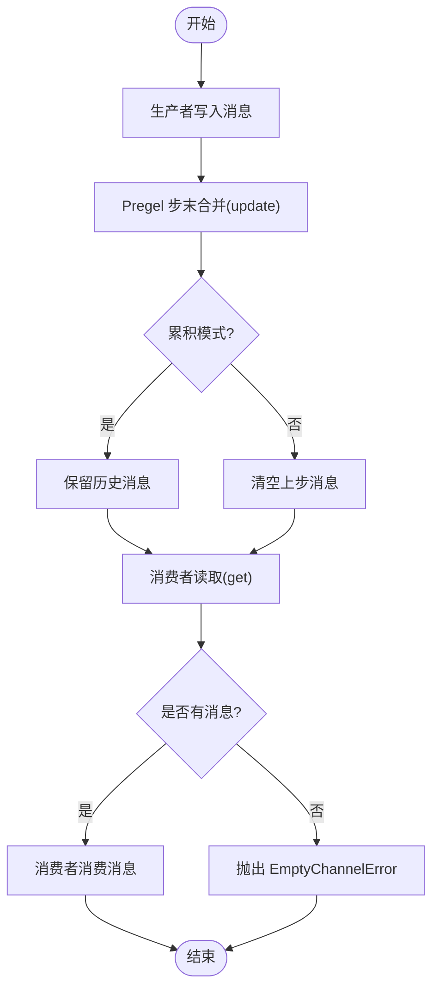
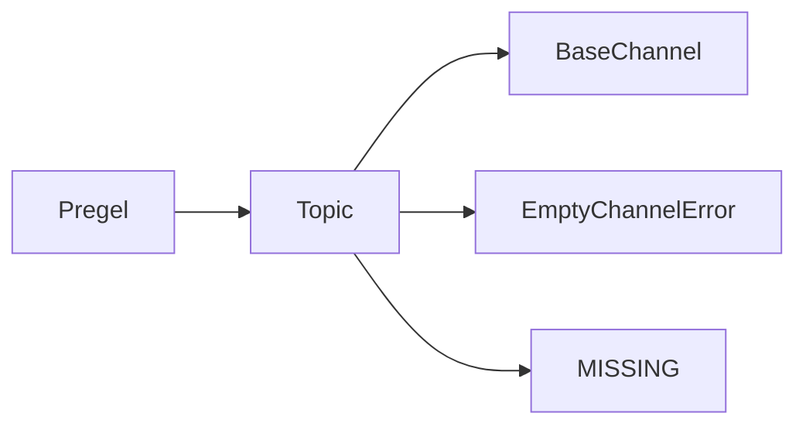

# Topic 通道

<cite>
**本文引用的文件**
- [topic.py](file://libs/langgraph/langgraph/channels/topic.py)
- [base.py](file://libs/langgraph/langgraph/channels/base.py)
- [test_channels.py](file://libs/langgraph/tests/test_channels.py)
- [main.py](file://libs/langgraph/langgraph/pregel/main.py)
- [errors.py](file://libs/langgraph/langgraph/errors.py)
- [_typing.py](file://libs/langgraph/langgraph/_internal/_typing.py)
- [test_pregel_async.py](file://libs/langgraph/tests/test_pregel_async.py)
</cite>

## 目录
1. [简介](#简介)
2. [项目结构](#项目结构)
3. [核心组件](#核心组件)
4. [架构总览](#架构总览)
5. [详细组件分析](#详细组件分析)
6. [依赖关系分析](#依赖关系分析)
7. [性能考量](#性能考量)
8. [故障排查指南](#故障排查指南)
9. [结论](#结论)
10. [附录：使用示例与最佳实践](#附录使用示例与最佳实践)

## 简介
本文件系统化阐述 Topic 通道的设计与用法，重点覆盖以下方面：
- 发布-订阅模式与消息队列机制
- 多生产者多消费者的特性
- 数据结构设计：消息缓冲区管理、FIFO 策略、内存限制
- 完整使用示例：并行执行与广播通信
- 性能特征、内存使用模式与扩展性
- 与其他通道类型的组合使用模式与最佳实践

## 项目结构
Topic 通道位于 LangGraph 的通道子系统中，作为内置通道之一，与 LastValue、BinaryOperatorAggregate、EphemeralValue 等共同构成 Pregel 并行执行框架的消息传递层。

图表来源
- [base.py:19-122](file://libs/langgraph/langgraph/channels/base.py#L19-L122)
- [topic.py:23-95](file://libs/langgraph/langgraph/channels/topic.py#L23-L95)
- [main.py:374-493](file://libs/langgraph/langgraph/pregel/main.py#L374-L493)

章节来源
- [base.py:19-122](file://libs/langgraph/langgraph/channels/base.py#L19-L122)
- [topic.py:23-95](file://libs/langgraph/langgraph/channels/topic.py#L23-L95)
- [main.py:374-493](file://libs/langgraph/langgraph/pregel/main.py#L374-L493)

## 核心组件
- Topic 通道：可配置的发布-订阅主题，支持多生产者写入、多消费者读取；可选择“累积”模式以跨步骤保留历史消息。
- BaseChannel 抽象基类：统一定义通道的类型、更新与读取接口、检查点序列化/反序列化、可用性判断等通用能力。
- Pregel 引擎：负责节点间的消息路由、并发调度、以及在每步结束时调用各通道的 update 方法进行状态合并。

章节来源
- [topic.py:23-95](file://libs/langgraph/langgraph/channels/topic.py#L23-L95)
- [base.py:19-122](file://libs/langgraph/langgraph/channels/base.py#L19-L122)
- [main.py:374-493](file://libs/langgraph/langgraph/pregel/main.py#L374-L493)

## 架构总览
Topic 通道在 Pregel 中扮演“广播/队列”的角色：多个生产者节点可将消息写入同一 Topic，多个消费者节点可订阅该 Topic 获取全部或累积的消息集合。在每步结束时，Pregel 调用通道的 update 合并来自所有生产者的更新，并通过 get 提供给订阅者消费。

图表来源
- [topic.py:77-95](file://libs/langgraph/langgraph/channels/topic.py#L77-L95)
- [base.py:89-100](file://libs/langgraph/langgraph/channels/base.py#L89-L100)
- [main.py:374-493](file://libs/langgraph/langgraph/pregel/main.py#L374-L493)

## 详细组件分析

### Topic 类设计与数据结构
- 基类继承：Topic 继承自 BaseChannel，遵循统一的类型标注与接口契约。
- 关键属性
  - values：消息缓冲区，采用 list 存储，天然满足 FIFO 行为（追加到尾部，按顺序读取）。
  - accumulate：布尔标志，控制是否在每步之间保留历史消息。
- 更新策略
  - flatten：将输入序列中的列表元素扁平化为单个值流，保证统一的入队行为。
  - 非累积模式：每步开始前清空缓冲区，仅保留本步新增消息。
  - 累积模式：保留历史消息，新消息追加至末尾。
- 可用性与读取
  - is_available：基于缓冲区是否为空快速判断。
  - get：返回当前消息列表；若为空则抛出 EmptyChannelError。
- 检查点
  - checkpoint/from_checkpoint：序列化/反序列化当前 values，支持运行时持久化与恢复。

图表来源
- [base.py:19-122](file://libs/langgraph/langgraph/channels/base.py#L19-L122)
- [topic.py:23-95](file://libs/langgraph/langgraph/channels/topic.py#L23-L95)

章节来源
- [topic.py:23-95](file://libs/langgraph/langgraph/channels/topic.py#L23-L95)
- [base.py:19-122](file://libs/langgraph/langgraph/channels/base.py#L19-L122)

### 发布-订阅与多生产者多消费者
- 多生产者：多个节点可向同一 Topic 写入消息，Pregel 在每步结束调用 update 合并所有写入。
- 多消费者：订阅该 Topic 的多个节点可各自读取完整消息列表，实现广播通信。
- 流程要点
  - 写入：节点调用 write_to 将消息写入目标 Topic。
  - 合并：Pregel 在步骤末调用 Topic.update，按 accumulate 策略决定清空或累积。
  - 读取：订阅节点调用 get 获取当前消息列表；若为空则抛出 EmptyChannelError。

章节来源
- [topic.py:77-95](file://libs/langgraph/langgraph/channels/topic.py#L77-L95)
- [base.py:89-100](file://libs/langgraph/langgraph/channels/base.py#L89-L100)
- [test_channels.py:35-74](file://libs/langgraph/tests/test_channels.py#L35-L74)

### FIFO 与内存管理
- FIFO 策略
  - 追加到尾部：values.extend 扩展消息序列。
  - 读取顺序：按插入顺序返回，天然满足 FIFO。
- 内存限制
  - 当前实现未内置容量上限；消息会持续累积（在累积模式下）。
  - 若需内存控制，可在上层逻辑中对消息进行裁剪或使用外部检查点清理策略。

章节来源
- [topic.py:77-95](file://libs/langgraph/langgraph/channels/topic.py#L77-L95)

### 错误处理与边界条件
- EmptyChannelError：当 Topic 为空且被读取时抛出，用于指示通道尚未有可用值。
- 检查点缺失：checkpoint 返回 MISSING 表示通道为空，from_checkpoint 接收 MISSING 时初始化为空状态。

章节来源
- [topic.py:87-95](file://libs/langgraph/langgraph/channels/topic.py#L87-L95)
- [base.py:49-58](file://libs/langgraph/langgraph/channels/base.py#L49-L58)
- [errors.py:16](file://libs/langgraph/langgraph/errors.py#L16)

### 使用流程与典型场景
- 广播通信：多个消费者同时从 Topic 读取消息，实现一对多广播。
- 并行执行：多个生产者节点并行写入，Pregel 在每步结束统一合并，确保一致性。
- 累积输出：在累积模式下，Topic 可作为“消息日志”，供后续节点逐步消费。

图表来源
- [topic.py:77-95](file://libs/langgraph/langgraph/channels/topic.py#L77-L95)
- [base.py:89-100](file://libs/langgraph/langgraph/channels/base.py#L89-L100)

## 依赖关系分析
- Topic 依赖 BaseChannel 提供统一接口与检查点机制。
- Topic 依赖 EmptyChannelError 进行读取失败的错误传播。
- Topic 依赖 _typing.MISSING 作为检查点与空状态的哨兵值。
- Pregel 在运行时通过调用 Topic.update/get 实现消息合并与分发。

图表来源
- [topic.py:8-10](file://libs/langgraph/langgraph/channels/topic.py#L8-L10)
- [base.py:49-58](file://libs/langgraph/langgraph/channels/base.py#L49-L58)
- [_typing.py:45](file://libs/langgraph/langgraph/_internal/_typing.py#L45)
- [main.py:374-493](file://libs/langgraph/langgraph/pregel/main.py#L374-L493)

章节来源
- [topic.py:8-10](file://libs/langgraph/langgraph/channels/topic.py#L8-L10)
- [base.py:49-58](file://libs/langgraph/langgraph/channels/base.py#L49-L58)
- [_typing.py:45](file://libs/langgraph/langgraph/_internal/_typing.py#L45)
- [main.py:374-493](file://libs/langgraph/langgraph/pregel/main.py#L374-L493)

## 性能考量
- 时间复杂度
  - update：摊销 O(n)，其中 n 为扁平化后的消息数量；非累积模式会在更新前清空，清空为 O(k)，k 为历史消息数。
  - get/is_available：O(k)，取决于当前消息数。
- 空间复杂度
  - O(k)，k 为当前消息总数；累积模式下随时间线性增长。
- 并发与调度
  - Pregel 在每步结束统一调用 update，避免了通道层面的锁竞争，适合高并发场景。
- 内存优化建议
  - 对于长运行任务，建议结合外部存储或定期清理策略，避免无限增长。
  - 在不需要累积的历史场景，优先使用非累积模式以减少内存占用。

## 故障排查指南
- 读取时报错 EmptyChannelError
  - 可能原因：通道从未写入或在累积模式下被清空。
  - 排查方法：确认生产者节点是否正确写入；检查 accumulate 设置；验证 Pregel 是否在步骤末调用了 update。
- 更新无效
  - 可能原因：传入空序列导致 update 返回 False。
  - 排查方法：检查写入路径与参数；确认节点写入逻辑。
- 消息丢失或重复
  - 非累积模式下，上步消息会在步末清空，若消费者未及时消费可能导致“丢失”。
  - 累积模式下，消息会持续累积，需注意去重或裁剪策略。

章节来源
- [topic.py:77-95](file://libs/langgraph/langgraph/channels/topic.py#L77-L95)
- [base.py:75-85](file://libs/langgraph/langgraph/channels/base.py#L75-L85)
- [errors.py:16](file://libs/langgraph/langgraph/errors.py#L16)

## 结论
Topic 通道通过简洁的发布-订阅模型与 FIFO 缓冲区，为多生产者多消费者的并行执行提供了高效的消息承载能力。其可配置的累积模式使其既能满足广播通信，也能作为累积日志使用。在实际工程中，应根据业务需求选择累积/非累积策略，并结合外部存储与清理策略控制内存增长。

## 附录：使用示例与最佳实践

### 示例一：基础 Topic 广播
- 场景：两个生产者节点分别写入 Topic，一个消费者节点读取并处理。
- 关键点：使用 accumulate=True 可累积历史消息；否则每步结束后会清空。

章节来源
- [main.py:478-512](file://libs/langgraph/langgraph/pregel/main.py#L478-L512)
- [test_channels.py:35-74](file://libs/langgraph/tests/test_channels.py#L35-L74)

### 示例二：累积模式下的累积输出
- 场景：多步累积消息，消费者逐步消费。
- 关键点：累积模式下消息不会自动清空，适合构建“消息流水”。

章节来源
- [test_channels.py:59-74](file://libs/langgraph/tests/test_channels.py#L59-L74)

### 示例三：异步并发调用中的 Topic 行为
- 场景：并发调用 Pregel 应用，Topic 保证所有生产者完成后再统一处理。
- 关键点：异步环境下，Pregel 仍按同步语义合并消息，确保一致性。

章节来源
- [test_pregel_async.py:3726-3770](file://libs/langgraph/tests/test_pregel_async.py#L3726-L3770)

### 最佳实践
- 选择累积模式的时机
  - 需要保留历史消息供后续步骤消费时启用累积。
  - 需要严格“每步一次”的场景使用非累积模式。
- 广播通信
  - 多消费者订阅同一 Topic 时，注意消费者内部的幂等性与去重。
- 内存与性能
  - 长运行任务中定期清理或限制消息数量，避免内存膨胀。
- 与其他通道组合
  - Topic + LastValue：Topic 负责广播/累积，LastValue 负责“最终值”输出。
  - Topic + BinaryOperatorAggregate：前者负责消息广播，后者负责聚合计算。

章节来源
- [main.py:374-493](file://libs/langgraph/langgraph/pregel/main.py#L374-L493)
- [topic.py:23-95](file://libs/langgraph/langgraph/channels/topic.py#L23-L95)