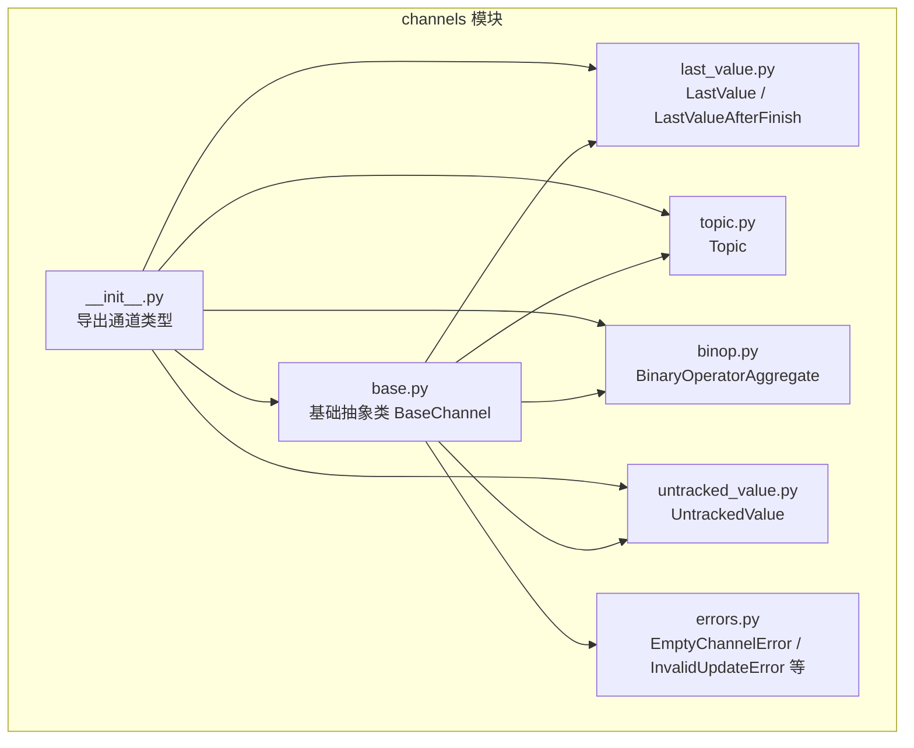
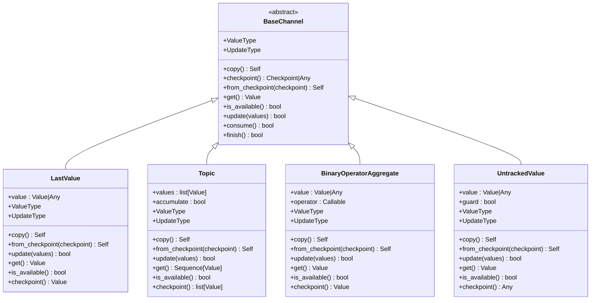
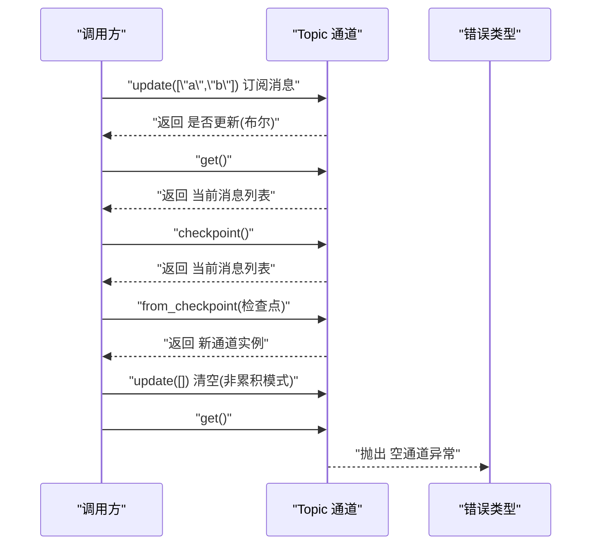

# 基础通道接口

<cite>
**本文引用的文件**
- [libs/langgraph/langgraph/channels/base.py](file://libs/langgraph/langgraph/channels/base.py)
- [libs/langgraph/langgraph/channels/last_value.py](file://libs/langgraph/langgraph/channels/last_value.py)
- [libs/langgraph/langgraph/channels/topic.py](file://libs/langgraph/langgraph/channels/topic.py)
- [libs/langgraph/langgraph/channels/binop.py](file://libs/langgraph/langgraph/channels/binop.py)
- [libs/langgraph/langgraph/channels/untracked_value.py](file://libs/langgraph/langgraph/channels/untracked_value.py)
- [libs/langgraph/tests/test_channels.py](file://libs/langgraph/tests/test_channels.py)
- [libs/langgraph/langgraph/errors.py](file://libs/langgraph/langgraph/errors.py)
- [libs/langgraph/langgraph/channels/__init__.py](file://libs/langgraph/langgraph/channels/__init__.py)
</cite>

## 目录
1. [简介](#简介)
2. [项目结构](#项目结构)
3. [核心组件](#核心组件)
4. [架构总览](#架构总览)
5. [详细组件分析](#详细组件分析)
6. [依赖分析](#依赖分析)
7. [性能考虑](#性能考虑)
8. [故障排查指南](#故障排查指南)
9. [结论](#结论)
10. [附录](#附录)

## 简介
本文件系统性阐述基础通道接口 BaseChannel 的设计理念与核心接口规范，覆盖泛型类型参数（Value、Update、Checkpoint）的语义与约束，通道基本操作（get、update、checkpoint、from_checkpoint 等）的行为与异常处理，生命周期管理（初始化、可用性检查、序列化与恢复），以及自定义通道实现的完整指南与最佳实践。同时给出通道接口的继承关系与扩展模式，帮助读者在不深入源码细节的前提下快速掌握通道系统的使用与扩展。

## 项目结构
本主题涉及的通道相关代码主要位于 langgraph 的 channels 子模块中，包含基础抽象类与若干内置实现。下图展示了与“基础通道接口”直接相关的文件组织与导出关系：

图表来源
- [libs/langgraph/langgraph/channels/base.py:1-122](file://libs/langgraph/langgraph/channels/base.py#L1-L122)
- [libs/langgraph/langgraph/channels/last_value.py:1-152](file://libs/langgraph/langgraph/channels/last_value.py#L1-L152)
- [libs/langgraph/langgraph/channels/topic.py:1-95](file://libs/langgraph/langgraph/channels/topic.py#L1-L95)
- [libs/langgraph/langgraph/channels/binop.py:1-135](file://libs/langgraph/langgraph/channels/binop.py#L1-L135)
- [libs/langgraph/langgraph/channels/untracked_value.py:1-74](file://libs/langgraph/langgraph/channels/untracked_value.py#L1-L74)
- [libs/langgraph/langgraph/errors.py:1-128](file://libs/langgraph/langgraph/errors.py#L1-L128)
- [libs/langgraph/langgraph/channels/__init__.py:1-28](file://libs/langgraph/langgraph/channels/__init__.py#L1-L28)

章节来源
- [libs/langgraph/langgraph/channels/__init__.py:1-28](file://libs/langgraph/langgraph/channels/__init__.py#L1-L28)

## 核心组件
本节聚焦 BaseChannel 抽象基类的设计理念与接口契约，明确各方法的职责、参数、返回值与异常行为，并结合具体实现说明其在不同通道中的体现。

- 泛型类型参数
  - Value：通道存储的值类型，用于 get 返回与 ValueType 约束。
  - Update：通道接收的更新类型，用于 update 的输入序列元素类型，对应 UpdateType 约束。
  - Checkpoint：通道可序列化的检查点类型，用于 checkpoint 返回与 from_checkpoint 的输入类型。
- 关键属性
  - ValueType：通道存储值的类型约束。
  - UpdateType：通道接收更新的类型约束。
- 序列化与复制
  - copy：默认通过 checkpoint + from_checkpoint 实现；子类可重写以提升效率。
  - checkpoint：返回当前状态的可序列化表示；若通道为空或不支持检查点则返回特殊标记。
  - from_checkpoint：从检查点构造一个等价的新通道实例，复杂数据应进行深拷贝。
- 读取与可用性
  - get：返回当前值；若通道为空则抛出空通道异常。
  - is_available：高效判断通道是否可用（非空）；默认实现通过调用 get 并捕获异常实现。
- 写入与生命周期事件
  - update：以任意顺序接收更新序列；当无更新时传入空序列；可能抛出无效更新异常；返回是否实际更新。
  - consume：订阅任务运行通知；默认空操作；可用于防止重复消费。
  - finish：Pregel 运行结束通知；默认空操作；可用于延迟暴露值或清理。

章节来源
- [libs/langgraph/langgraph/channels/base.py:19-122](file://libs/langgraph/langgraph/channels/base.py#L19-L122)

## 架构总览
下图展示了 BaseChannel 与其典型实现之间的继承与使用关系，以及与错误类型的交互：

图表来源
- [libs/langgraph/langgraph/channels/base.py:19-122](file://libs/langgraph/langgraph/channels/base.py#L19-L122)
- [libs/langgraph/langgraph/channels/last_value.py:20-152](file://libs/langgraph/langgraph/channels/last_value.py#L20-L152)
- [libs/langgraph/langgraph/channels/topic.py:23-95](file://libs/langgraph/langgraph/channels/topic.py#L23-L95)
- [libs/langgraph/langgraph/channels/binop.py:41-135](file://libs/langgraph/langgraph/channels/binop.py#L41-L135)
- [libs/langgraph/langgraph/channels/untracked_value.py:15-74](file://libs/langgraph/langgraph/channels/untracked_value.py#L15-L74)

## 详细组件分析

### BaseChannel 抽象基类
- 设计要点
  - 通过泛型参数明确三类类型边界，确保编译期类型安全与运行期一致性。
  - 将序列化与恢复解耦为 checkpoint/from_checkpoint，便于不同持久化策略接入。
  - 将读写分离，读取方法统一抛出空通道异常，写入方法统一抛出无效更新异常，便于上层流程控制。
- 生命周期事件
  - consume：适合实现“一次性消费”语义，避免重复处理。
  - finish：适合实现“完成后才可见”的通道（如 LastValueAfterFinish）。
- 默认实现与可重写点
  - is_available 默认实现通过 get 包装异常，子类应提供更高效的实现。
  - copy 默认委托 checkpoint + from_checkpoint，子类可直接浅拷贝内部状态以提升性能。

章节来源
- [libs/langgraph/langgraph/channels/base.py:19-122](file://libs/langgraph/langgraph/channels/base.py#L19-L122)

### LastValue 与 LastValueAfterFinish
- 行为特征
  - LastValue：每步仅允许接收一个更新；空通道时 get 抛出异常；checkpoint 返回当前值。
  - LastValueAfterFinish：值仅在 finish 后可用，consume 可清空已暴露的值，实现“一次性消费”。
- 异常处理
  - 当收到多个更新时抛出无效更新异常；空通道时 get 抛出空通道异常。
- 检查点语义
  - LastValueAfterFinish 的检查点包含值与完成标志，恢复后可继续消费。

章节来源
- [libs/langgraph/langgraph/channels/last_value.py:20-152](file://libs/langgraph/langgraph/channels/last_value.py#L20-L152)

### Topic
- 行为特征
  - 支持累积与非累积两种模式；update 接收标量或列表，自动展平；空通道时 get 抛出异常。
  - 非累积模式每步结束后清空消息队列。
- 类型约束
  - ValueType 为 Value 的序列类型；UpdateType 为 Value 或 Value 列表的联合类型。
- 检查点语义
  - checkpoint 返回当前累积的消息列表；from_checkpoint 支持历史格式兼容。

章节来源
- [libs/langgraph/langgraph/channels/topic.py:23-95](file://libs/langgraph/langgraph/channels/topic.py#L23-L95)

### BinaryOperatorAggregate
- 行为特征
  - 对新值与当前值应用二元运算符聚合；支持覆盖写入（Overwrite）语义，但每超步仅允许一次覆盖。
- 类型约束
  - ValueType 与 UpdateType 为同一类型；初始值由类型构造函数生成。
- 异常处理
  - 多次覆盖写入会触发无效更新异常；空通道时 get 抛出空通道异常。

章节来源
- [libs/langgraph/langgraph/channels/binop.py:41-135](file://libs/langgraph/langgraph/channels/binop.py#L41-L135)

### UntrackedValue
- 行为特征
  - 存储最新值，但从 checkpoint 永远返回不可跟踪标记；适合临时状态或不参与持久化的值。
  - guard=True 时每步仅允许一个更新，否则抛出无效更新异常。
- 检查点语义
  - checkpoint 返回不可跟踪标记；from_checkpoint 不恢复任何状态。

章节来源
- [libs/langgraph/langgraph/channels/untracked_value.py:15-74](file://libs/langgraph/langgraph/channels/untracked_value.py#L15-L74)

### 典型调用序列（以 Topic 为例）

图表来源
- [libs/langgraph/langgraph/channels/topic.py:77-95](file://libs/langgraph/langgraph/channels/topic.py#L77-L95)
- [libs/langgraph/langgraph/errors.py:68-77](file://libs/langgraph/langgraph/errors.py#L68-L77)

## 依赖分析
- 继承关系
  - 所有内置通道均直接继承自 BaseChannel，并按需实现 ValueType、UpdateType 与具体逻辑。
- 错误类型依赖
  - get 在空通道时抛出 EmptyChannelError；update 在非法输入时抛出 InvalidUpdateError。
- 导出与使用
  - channels/__init__.py 统一导出 BaseChannel 与其他通道类型，便于外部直接引用。

章节来源
- [libs/langgraph/langgraph/channels/__init__.py:1-28](file://libs/langgraph/langgraph/channels/__init__.py#L1-L28)
- [libs/langgraph/langgraph/errors.py:68-77](file://libs/langgraph/langgraph/errors.py#L68-L77)

## 性能考虑
- is_available 的高效实现
  - 建议子类维护内部“是否可用”标志位，避免每次调用 get 并捕获异常。
- copy 的优化
  - 若内部状态可直接浅拷贝，建议重写 copy 以减少序列化开销；仅在必要时使用默认的 checkpoint + from_checkpoint。
- update 的批处理
  - update 接收任意顺序的更新序列，子类应尽量在单次调用内完成聚合，减少多次序列化与状态切换。
- finish/consume 的幂等性
  - consume/finish 应保证幂等，避免重复消费或重复暴露。

## 故障排查指南
- 常见异常与定位
  - EmptyChannelError：通道为空时调用 get；检查是否正确更新或是否使用了不累积的 Topic。
  - InvalidUpdateError：更新序列不符合通道约束（如 LastValue 的多值、UntrackedValue 的 guard 限制、BinaryOperatorAggregate 的多重覆盖）。
- 检查点与恢复
  - 若从检查点恢复后行为异常，确认 checkpoint 返回值与 from_checkpoint 的兼容性；对于不支持检查点的通道，checkpoint 应返回不可跟踪标记。
- 单元测试参考
  - 测试用例覆盖了各通道的 get、update、checkpoint、from_checkpoint 与异常场景，可作为实现对照与回归验证的依据。

章节来源
- [libs/langgraph/tests/test_channels.py:16-120](file://libs/langgraph/tests/test_channels.py#L16-L120)
- [libs/langgraph/langgraph/errors.py:68-77](file://libs/langgraph/langgraph/errors.py#L68-L77)

## 结论
BaseChannel 通过清晰的泛型约束与分层接口，为通道系统提供了统一的抽象与一致的生命周期管理。内置实现展示了多种典型模式：最近值、聚合、主题发布订阅与一次性消费等。遵循本文的接口契约与最佳实践，开发者可以快速实现自定义通道并无缝融入现有框架。

## 附录

### 自定义通道实现指南
- 必须实现的方法
  - ValueType：声明存储值的类型。
  - UpdateType：声明更新的类型。
  - get：返回当前值；空通道时抛出空通道异常。
  - update：处理更新序列；非法输入时抛出无效更新异常；返回是否实际更新。
  - from_checkpoint：从检查点构造新实例；复杂对象应深拷贝。
- 可选优化
  - is_available：提供 O(1) 级别的可用性判断。
  - copy：重写以避免序列化开销。
  - consume/finish：根据业务需要实现一次性消费或延迟暴露。
- 类型参数约束
  - Value：与 ValueType 一致。
  - Update：与 UpdateType 一致。
  - Checkpoint：与 checkpoint/from_checkpoint 的输入输出类型一致。
- 异常约定
  - 空通道：get 抛出空通道异常。
  - 无效更新：update 抛出无效更新异常。
- 示例参考
  - 最近值：LastValue、LastValueAfterFinish
  - 聚合：BinaryOperatorAggregate
  - 主题：Topic
  - 不跟踪：UntrackedValue

章节来源
- [libs/langgraph/langgraph/channels/base.py:19-122](file://libs/langgraph/langgraph/channels/base.py#L19-L122)
- [libs/langgraph/langgraph/channels/last_value.py:20-152](file://libs/langgraph/langgraph/channels/last_value.py#L20-L152)
- [libs/langgraph/langgraph/channels/topic.py:23-95](file://libs/langgraph/langgraph/channels/topic.py#L23-L95)
- [libs/langgraph/langgraph/channels/binop.py:41-135](file://libs/langgraph/langgraph/channels/binop.py#L41-L135)
- [libs/langgraph/langgraph/channels/untracked_value.py:15-74](file://libs/langgraph/langgraph/channels/untracked_value.py#L15-L74)