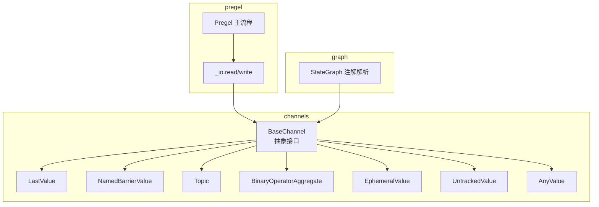
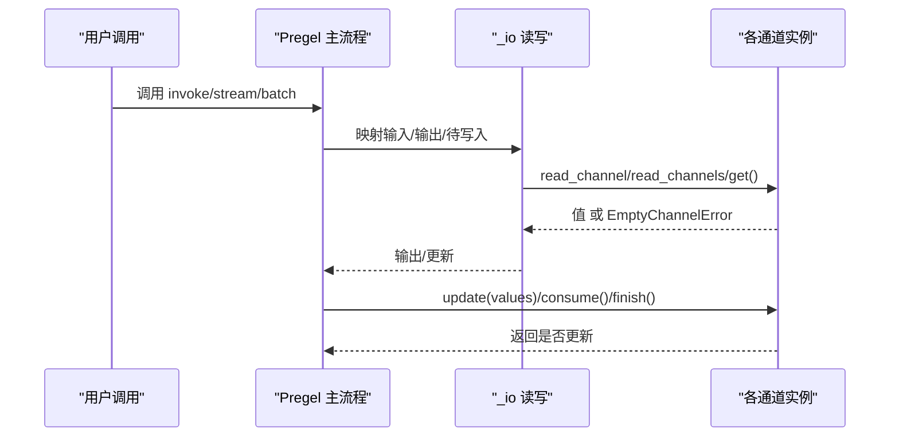
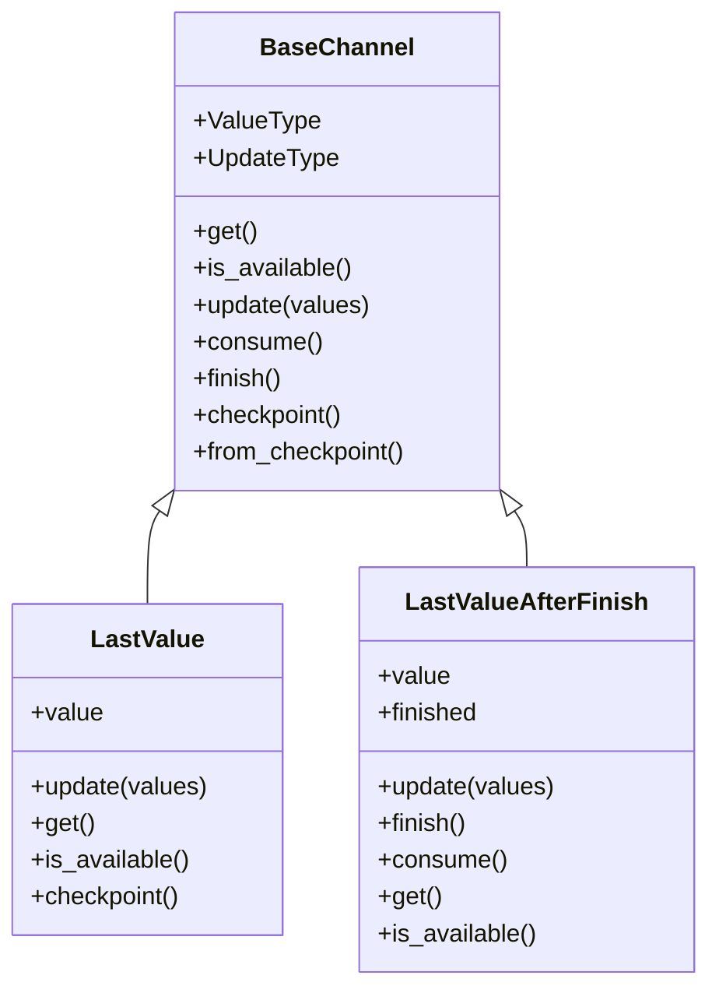
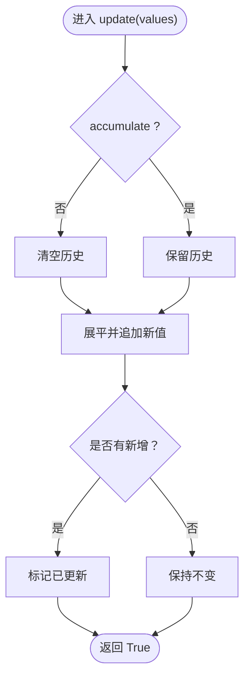
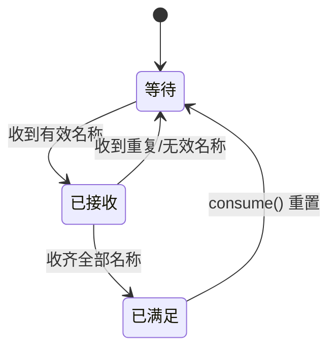
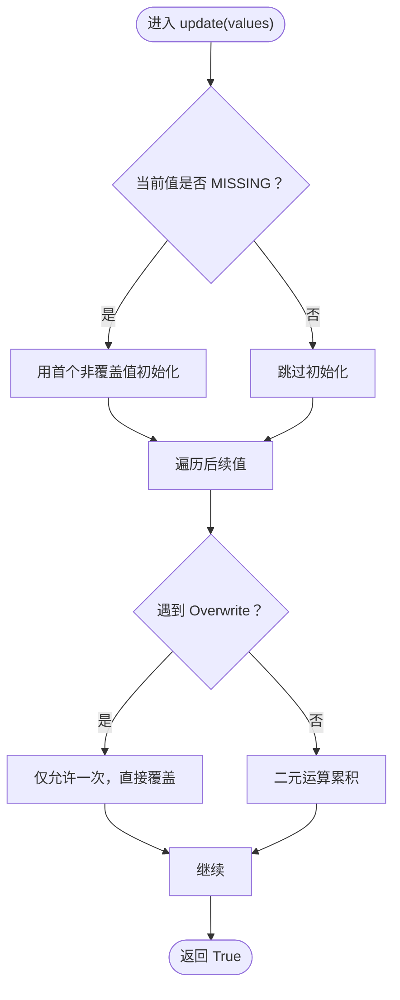
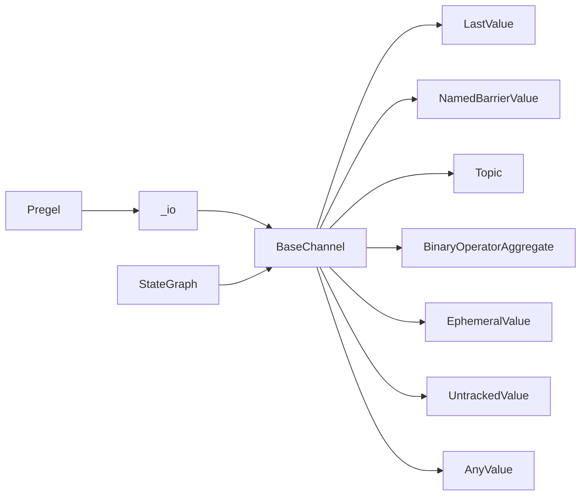

# 通道系统

<cite>
**本文引用的文件**
- [libs/langgraph/langgraph/channels/base.py](file://libs/langgraph/langgraph/channels/base.py)
- [libs/langgraph/langgraph/channels/__init__.py](file://libs/langgraph/langgraph/channels/__init__.py)
- [libs/langgraph/langgraph/channels/last_value.py](file://libs/langgraph/langgraph/channels/last_value.py)
- [libs/langgraph/langgraph/channels/topic.py](file://libs/langgraph/langgraph/channels/topic.py)
- [libs/langgraph/langgraph/channels/named_barrier_value.py](file://libs/langgraph/langgraph/channels/named_barrier_value.py)
- [libs/langgraph/langgraph/channels/binop.py](file://libs/langgraph/langgraph/channels/binop.py)
- [libs/langgraph/langgraph/channels/ephemeral_value.py](file://libs/langgraph/langgraph/channels/ephemeral_value.py)
- [libs/langgraph/langgraph/channels/untracked_value.py](file://libs/langgraph/langgraph/channels/untracked_value.py)
- [libs/langgraph/langgraph/channels/any_value.py](file://libs/langgraph/langgraph/channels/any_value.py)
- [libs/langgraph/tests/test_channels.py](file://libs/langgraph/tests/test_channels.py)
- [libs/langgraph/langgraph/pregel/_io.py](file://libs/langgraph/langgraph/pregel/_io.py)
- [libs/langgraph/langgraph/pregel/main.py](file://libs/langgraph/langgraph/pregel/main.py)
- [libs/langgraph/langgraph/graph/state.py](file://libs/langgraph/langgraph/graph/state.py)
</cite>

## 目录
1. [简介](#简介)
2. [项目结构](#项目结构)
3. [核心组件](#核心组件)
4. [架构总览](#架构总览)
5. [详细组件分析](#详细组件分析)
6. [依赖分析](#依赖分析)
7. [性能考量](#性能考量)
8. [故障排查指南](#故障排查指南)
9. [结论](#结论)
10. [附录：通道 API 参考](#附录通道-api-参考)

## 简介
本文件系统性阐述 LangGraph 通道（Channel）系统的设计理念、架构原理与实现细节，覆盖通道接口定义、数据传递机制、状态同步策略，并对内置通道类型进行特性与场景解析，包括 LastValue、Topic、NamedBarrierValue、BinaryOperatorAggregate、EphemeralValue 等。同时给出组合模式、高级用法、自定义通道开发指南与最佳实践，提供完整的通道 API 参考与性能与内存管理建议。

## 项目结构
通道系统位于 langgraph 的 channels 子模块中，围绕统一的 BaseChannel 抽象构建，提供多种内置通道类型以满足不同数据流需求。Pregel 运行时通过 _io 模块读写通道，Graph 层在状态图中识别通道注解。

图表来源
- [libs/langgraph/langgraph/channels/base.py:19-122](file://libs/langgraph/langgraph/channels/base.py#L19-L122)
- [libs/langgraph/langgraph/channels/__init__.py:1-28](file://libs/langgraph/langgraph/channels/__init__.py#L1-L28)
- [libs/langgraph/langgraph/pregel/_io.py:23-175](file://libs/langgraph/langgraph/pregel/_io.py#L23-L175)
- [libs/langgraph/langgraph/pregel/main.py:401-590](file://libs/langgraph/langgraph/pregel/main.py#L401-L590)
- [libs/langgraph/langgraph/graph/state.py:1659-1696](file://libs/langgraph/langgraph/graph/state.py#L1659-L1696)

章节来源
- [libs/langgraph/langgraph/channels/__init__.py:1-28](file://libs/langgraph/langgraph/channels/__init__.py#L1-L28)
- [libs/langgraph/langgraph/channels/base.py:19-122](file://libs/langgraph/langgraph/channels/base.py#L19-L122)

## 核心组件
- BaseChannel：所有通道的抽象基类，定义了统一的读写接口、可用性判断、检查点序列化与恢复、完成通知等生命周期方法。其泛型参数为<Value, Update, Checkpoint>，分别表示存储值类型、更新输入类型与检查点类型。
- 读写接口
  - get()：获取当前值；空通道抛出 EmptyChannelError。
  - is_available()：高效判断是否可读，避免捕获异常。
  - update(values: Sequence[Update])：批量更新，顺序任意；返回是否发生状态变化。
  - consume()：订阅任务执行后的消费通知，用于一次性通道或屏障通道清空/重置。
  - finish()：运行结束通知，用于 AfterFinish 类通道延迟暴露值。
  - checkpoint()/from_checkpoint()：序列化/反序列化通道状态；未支持检查点或空通道返回 MISSING。
- 组合与扩展：子类可覆盖 copy()/is_available()/consume()/finish() 等以优化性能或改变语义。

章节来源
- [libs/langgraph/langgraph/channels/base.py:19-122](file://libs/langgraph/langgraph/channels/base.py#L19-L122)

## 架构总览
通道系统与 Pregel 运行时的交互路径如下：

图表来源
- [libs/langgraph/langgraph/pregel/_io.py:23-175](file://libs/langgraph/langgraph/pregel/_io.py#L23-L175)
- [libs/langgraph/langgraph/channels/base.py:69-122](file://libs/langgraph/langgraph/channels/base.py#L69-L122)

## 详细组件分析

### BaseChannel 抽象与生命周期
- 设计要点
  - 统一接口：所有通道共享相同的读写契约，便于 Pregel 编排。
  - 泛型约束：明确 ValueType/UpdateType/CheckpointType，提升静态类型安全。
  - 错误模型：EmptyChannelError 表示“尚未初始化”，InvalidUpdateError 表示“非法并发更新”。
  - 生命周期：finish()/consume() 提供运行期控制，checkpoint()/from_checkpoint() 支持持久化。
- 性能建议
  - is_available() 默认实现会调用 get() 并捕获异常，子类应覆盖以 O(1) 判断。
  - 复杂对象检查点应深拷贝，避免外部状态被修改。

章节来源
- [libs/langgraph/langgraph/channels/base.py:19-122](file://libs/langgraph/langgraph/channels/base.py#L19-L122)

### LastValue 与 LastValueAfterFinish
- LastValue
  - 语义：每步仅接收一个值，存储最近一次更新。
  - 并发限制：update 接收长度为 1 的序列，否则抛 InvalidUpdateError。
  - 可用性：非 MISSING 即可用。
  - 检查点：保存当前值；空通道返回 MISSING。
- LastValueAfterFinish
  - 语义：值仅在 finish() 后可用，消费后清空，适合“最终产物”一次性输出。
  - 方法行为：finish() 标记完成；consume() 清理并允许再次产出。
- 使用场景
  - LastValue：中间态结果、状态字段。
  - LastValueAfterFinish：最终结果、只读一次的汇总值。

图表来源
- [libs/langgraph/langgraph/channels/base.py:19-122](file://libs/langgraph/langgraph/channels/base.py#L19-L122)
- [libs/langgraph/langgraph/channels/last_value.py:20-152](file://libs/langgraph/langgraph/channels/last_value.py#L20-L152)

章节来源
- [libs/langgraph/langgraph/channels/last_value.py:20-152](file://libs/langgraph/langgraph/channels/last_value.py#L20-L152)
- [libs/langgraph/tests/test_channels.py:16-33](file://libs/langgraph/tests/test_channels.py#L16-L33)

### Topic
- 语义：发布/订阅主题，累积或非累积模式下收集多条消息。
- 关键点
  - 更新合并：_flatten 将单值与列表值展平后追加到内部列表。
  - 累积模式：accumulate=True 时保留历史；否则每步清空。
  - 可用性：内部有值即可用。
  - 检查点：保存当前值列表；兼容旧版元组格式。
- 使用场景：广播消息、日志聚合、多路输出收集。

图表来源
- [libs/langgraph/langgraph/channels/topic.py:77-85](file://libs/langgraph/langgraph/channels/topic.py#L77-L85)

章节来源
- [libs/langgraph/langgraph/channels/topic.py:23-95](file://libs/langgraph/langgraph/channels/topic.py#L23-L95)
- [libs/langgraph/tests/test_channels.py:35-75](file://libs/langgraph/tests/test_channels.py#L35-L75)

### NamedBarrierValue 与 NamedBarrierValueAfterFinish
- 语义：等待一组命名信号全部到达后才可用；AfterFinish 版本需 finish() 后才可用。
- 关键点
  - 输入校验：仅接受预定义名称集合中的值，否则抛 InvalidUpdateError。
  - 状态机：seen 集合跟踪已收到的名称；全齐后可用；consume() 重置。
  - AfterFinish：finish() 后 get() 才可用；consume() 清理并允许下次循环。
- 使用场景：多源汇聚、并行分支同步、条件放行。

图表来源
- [libs/langgraph/langgraph/channels/named_barrier_value.py:56-81](file://libs/langgraph/langgraph/channels/named_barrier_value.py#L56-L81)

章节来源
- [libs/langgraph/langgraph/channels/named_barrier_value.py:13-168](file://libs/langgraph/langgraph/channels/named_barrier_value.py#L13-L168)

### BinaryOperatorAggregate
- 语义：以二元运算符聚合新值，支持 Overwrite 重写。
- 关键点
  - 初始化：根据类型构造空容器（序列/集合/映射），否则为 MISSING。
  - 聚合：若当前值为 MISSING，则取第一个值作为种子；随后按序应用二元操作。
  - Overwrite：在同一步内仅允许一次 Overwrite，出现冲突抛 InvalidUpdateError。
  - 可用性：非 MISSING 即可用。
- 使用场景：累加器、拼接器、合并器。

图表来源
- [libs/langgraph/langgraph/channels/binop.py:102-123](file://libs/langgraph/langgraph/channels/binop.py#L102-L123)

章节来源
- [libs/langgraph/langgraph/channels/binop.py:41-135](file://libs/langgraph/langgraph/channels/binop.py#L41-L135)
- [libs/langgraph/tests/test_channels.py:77-91](file://libs/langgraph/tests/test_channels.py#L77-L91)

### EphemeralValue
- 语义：仅在“前一步”有效的临时值，一旦新值到来或显式清空即失效。
- 关键点
  - guard=True 时，每步仅允许一个值；否则抛 InvalidUpdateError。
  - get() 为空则抛 EmptyChannelError。
  - 检查点：保存当前值；适合短期状态。
- 使用场景：临时缓存、一次性令牌、中间态标志。

章节来源
- [libs/langgraph/langgraph/channels/ephemeral_value.py:15-80](file://libs/langgraph/langgraph/channels/ephemeral_value.py#L15-L80)

### UntrackedValue
- 语义：存储最新值但不参与检查点。
- 关键点
  - checkpoint() 总是返回 MISSING，from_checkpoint(MISSING) 创建空通道。
  - 其他行为与 LastValue 类似。
- 使用场景：瞬时数据、调试信息、不希望持久化的中间值。

章节来源
- [libs/langgraph/langgraph/channels/untracked_value.py:15-74](file://libs/langgraph/langgraph/channels/untracked_value.py#L15-L74)

### AnyValue
- 语义：存储最新值，假设多值相等。
- 关键点
  - update([]) 可用于显式清空。
  - 检查点：保存当前值。
- 使用场景：占位/测试、简化逻辑。

章节来源
- [libs/langgraph/langgraph/channels/any_value.py:15-73](file://libs/langgraph/langgraph/channels/any_value.py#L15-L73)

### 在 Graph 中的通道注解与解析
- StateGraph 通过注解识别通道：若标注类型为 BaseChannel 实例或子类，将作为通道使用。
- 对 BinaryOperatorAggregate 的识别要求二元签名，以便作为聚合通道注入。

章节来源
- [libs/langgraph/langgraph/graph/state.py:1659-1696](file://libs/langgraph/langgraph/graph/state.py#L1659-L1696)

## 依赖分析
- 内部耦合
  - 所有通道均继承 BaseChannel，保证统一契约。
  - Pregel 通过 _io 间接依赖通道的 get/is_available/update 等方法。
- 外部依赖
  - 错误类型：EmptyChannelError、InvalidUpdateError。
  - 类型工具：泛型、typing_extensions、collections.abc。
- 可能的循环依赖
  - 通道与 Pregel 解耦良好，无直接循环；Graph 层仅做注解识别，不直接依赖通道实现。

图表来源
- [libs/langgraph/langgraph/channels/base.py:19-122](file://libs/langgraph/langgraph/channels/base.py#L19-L122)
- [libs/langgraph/langgraph/pregel/_io.py:23-175](file://libs/langgraph/langgraph/pregel/_io.py#L23-L175)
- [libs/langgraph/langgraph/pregel/main.py:401-590](file://libs/langgraph/langgraph/pregel/main.py#L401-L590)
- [libs/langgraph/langgraph/graph/state.py:1659-1696](file://libs/langgraph/langgraph/graph/state.py#L1659-L1696)

## 性能考量
- 读写效率
  - is_available() 应避免调用 get() 并捕获异常，优先使用布尔/计数器字段。
  - Topic 在非累积模式下频繁清空，注意列表重置成本。
- 聚合成本
  - BinaryOperatorAggregate 的二元操作复杂度取决于操作本身；尽量选择 O(1) 操作。
- 内存管理
  - Topic/UntrackedValue/AnyValue 等可能持有较大对象，及时清空或复用实例。
  - NamedBarrierValue 的 seen 集合大小受命名集合规模影响，命名集合应合理设计。
- 检查点
  - 复杂对象建议浅拷贝或自定义深拷贝策略，避免共享引用导致竞态。
  - UntrackedValue 不参与检查点，减少持久化开销。

## 故障排查指南
- EmptyChannelError
  - 现象：get() 在空通道上触发。
  - 排查：确认 update 是否正确调用；检查 is_available()；确认通道类型是否符合预期。
- InvalidUpdateError
  - LastValue/EphemeralValue/UntrackedValue：guard=True 且每步多值。
  - NamedBarrierValue：更新值不在预定义名称集合。
  - BinaryOperatorAggregate：同一步内多次 Overwrite。
- 消费与完成
  - LastValueAfterFinish/NBValueAfterFinish：未调用 finish() 导致 get() 失败；consume() 未调用导致值无法再次产出。
- Pregel 读写
  - read_channels 在跳过空值时可能返回空字典，确认 catch/skip_empty 参数设置。

章节来源
- [libs/langgraph/langgraph/pregel/_io.py:23-53](file://libs/langgraph/langgraph/pregel/_io.py#L23-L53)
- [libs/langgraph/tests/test_channels.py:16-119](file://libs/langgraph/tests/test_channels.py#L16-L119)

## 结论
通道系统以 BaseChannel 为核心，提供了从简单存储到复杂聚合、从一次性到持久化的丰富能力。通过统一的生命周期与错误模型，配合 Pregel 的编排能力，可在多节点、多分支、多输出的复杂图中实现稳定可靠的数据流控制。合理选择通道类型、遵循并发约束与检查点策略，是构建高性能、可维护的 LangGraph 应用的关键。

## 附录：通道 API 参考

- BaseChannel
  - 方法
    - get() -> Value：获取当前值；空通道抛 EmptyChannelError。
    - is_available() -> bool：高效判断是否可用。
    - update(values: Sequence[Update]) -> bool：批量更新，顺序任意；返回是否更新。
    - consume() -> bool：通知订阅任务已执行；部分通道用于一次性消费。
    - finish() -> bool：通知运行结束；部分通道用于延迟暴露值。
    - checkpoint() -> Checkpoint | MISSING：序列化当前状态。
    - from_checkpoint(checkpoint: Checkpoint | MISSING) -> Self：从检查点恢复。
    - copy() -> Self：复制通道实例。
  - 属性
    - ValueType: 当前存储值类型
    - UpdateType: 更新输入类型
    - key: 通道键名
    - typ: 基础类型

- LastValue
  - 构造：LastValue(typ, key="")
  - 行为：每步仅一个值；空通道不可读；检查点保存当前值。

- LastValueAfterFinish
  - 构造：LastValueAfterFinish(typ, key="")
  - 行为：finish() 后可用；consume() 清理并允许再次产出。

- Topic
  - 构造：Topic(typ, accumulate=False)
  - 行为：累积/非累积模式；update 支持单值与列表混合；检查点保存当前列表。

- NamedBarrierValue / NamedBarrierValueAfterFinish
  - 构造：NamedBarrierValue(typ, names: set[Value]) / AfterFinish(...)
  - 行为：等待 names 全到；AfterFinish 需 finish() 后可用；consume() 重置。

- BinaryOperatorAggregate
  - 构造：BinaryOperatorAggregate(typ, operator)
  - 行为：二元聚合；支持 Overwrite；空值初始化；检查点保存聚合结果。

- EphemeralValue
  - 构造：EphemeralValue(typ, guard=True)
  - 行为：仅前一步有效；guard=True 时每步仅一值；检查点保存当前值。

- UntrackedValue
  - 构造：UntrackedValue(typ, guard=True)
  - 行为：不参与检查点；其余与 LastValue 类似。

- AnyValue
  - 构造：AnyValue(typ, key="")
  - 行为：存储最新值；update([]) 可清空；检查点保存当前值。

章节来源
- [libs/langgraph/langgraph/channels/base.py:19-122](file://libs/langgraph/langgraph/channels/base.py#L19-L122)
- [libs/langgraph/langgraph/channels/last_value.py:20-152](file://libs/langgraph/langgraph/channels/last_value.py#L20-L152)
- [libs/langgraph/langgraph/channels/topic.py:23-95](file://libs/langgraph/langgraph/channels/topic.py#L23-L95)
- [libs/langgraph/langgraph/channels/named_barrier_value.py:13-168](file://libs/langgraph/langgraph/channels/named_barrier_value.py#L13-L168)
- [libs/langgraph/langgraph/channels/binop.py:41-135](file://libs/langgraph/langgraph/channels/binop.py#L41-L135)
- [libs/langgraph/langgraph/channels/ephemeral_value.py:15-80](file://libs/langgraph/langgraph/channels/ephemeral_value.py#L15-L80)
- [libs/langgraph/langgraph/channels/untracked_value.py:15-74](file://libs/langgraph/langgraph/channels/untracked_value.py#L15-L74)
- [libs/langgraph/langgraph/channels/any_value.py:15-73](file://libs/langgraph/langgraph/channels/any_value.py#L15-L73)