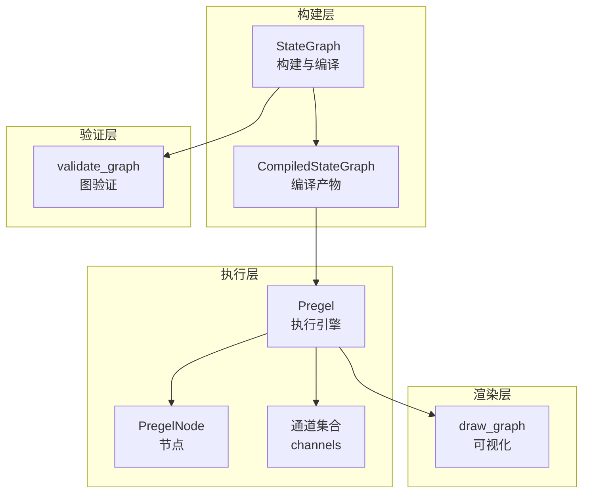
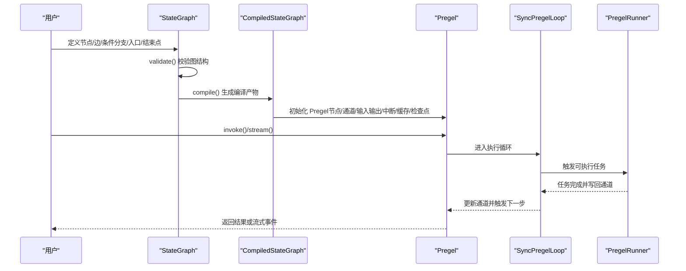
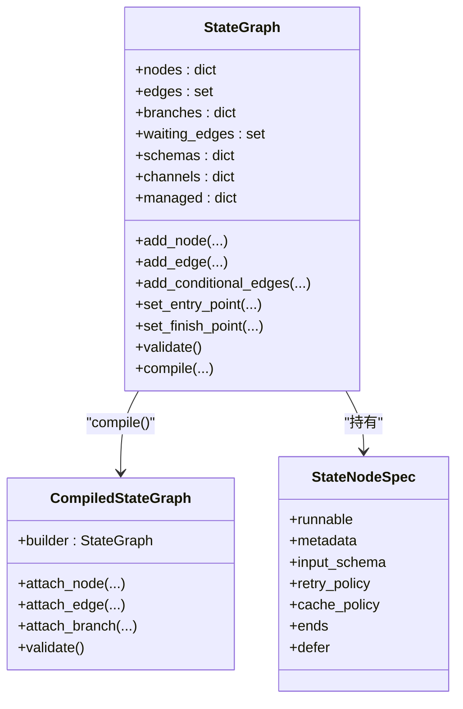
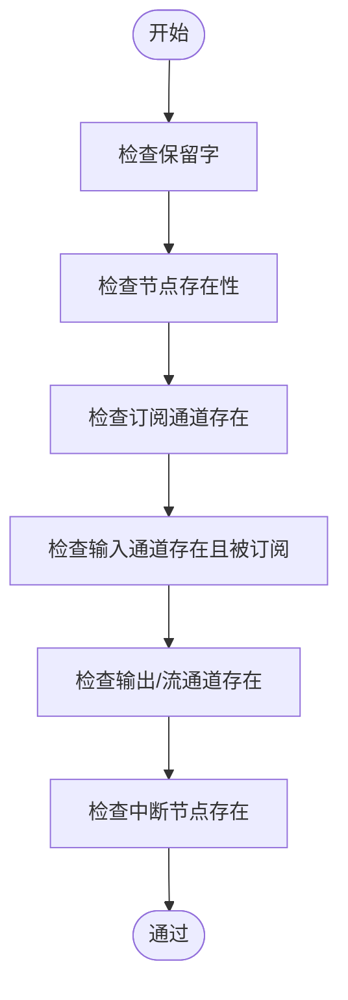
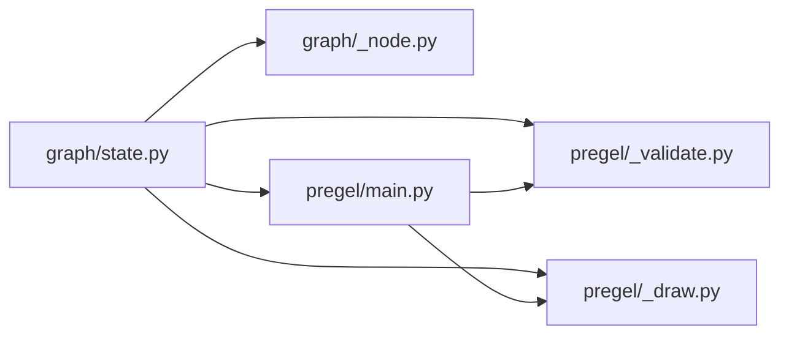

# 图构建与编译

<cite>
**本文引用的文件**
- [libs/langgraph/langgraph/graph/state.py](file://libs/langgraph/langgraph/graph/state.py)
- [libs/langgraph/langgraph/pregel/main.py](file://libs/langgraph/langgraph/pregel/main.py)
- [libs/langgraph/langgraph/pregel/_validate.py](file://libs/langgraph/langgraph/pregel/_validate.py)
- [libs/langgraph/langgraph/graph/_node.py](file://libs/langgraph/langgraph/graph/_node.py)
- [libs/langgraph/langgraph/pregel/_draw.py](file://libs/langgraph/langgraph/pregel/_draw.py)
- [libs/langgraph/tests/test_pregel.py](file://libs/langgraph/tests/test_pregel.py)
</cite>

## 目录
1. [简介](#简介)
2. [项目结构](#项目结构)
3. [核心组件](#核心组件)
4. [架构总览](#架构总览)
5. [详细组件分析](#详细组件分析)
6. [依赖关系分析](#依赖关系分析)
7. [性能考量](#性能考量)
8. [故障排查指南](#故障排查指南)
9. [结论](#结论)
10. [附录：完整图构建示例](#附录完整图构建示例)

## 简介
本篇文档围绕 StateGraph 的“图构建与编译”展开，系统阐述如下主题：
- 如何将用户定义的节点与边转化为可执行的 Pregel 图
- 节点注册、边定义、条件分支、状态模式配置的构建流程
- 图验证机制（循环检测、通道验证、类型检查等）
- 编译后的图结构如何映射到 Pregel 执行引擎
- 提供从简单线性图到分支合并、循环图的完整构建示例

## 项目结构
本仓库中与“图构建与编译”直接相关的模块主要位于 langgraph/graph 与 langgraph/pregel 两个子包：
- graph/state.py：定义 StateGraph 与 CompiledStateGraph，负责图的构建、校验与编译
- pregel/main.py：定义 Pregel 执行引擎，承载节点、通道、输入输出通道、中断、缓存、检查点等运行时能力
- pregel/_validate.py：提供图级验证逻辑（通道/节点/输入/输出/中断等）
- graph/_node.py：定义节点签名与规格（StateNodeSpec）等类型
- pregel/_draw.py：将图渲染为可可视化图形
- tests/test_pregel.py：包含大量图构建与行为验证的测试用例，是理解使用方式的重要参考

图表来源
- [libs/langgraph/langgraph/graph/state.py](file://libs/langgraph/langgraph/graph/state.py)
- [libs/langgraph/langgraph/pregel/main.py](file://libs/langgraph/langgraph/pregel/main.py)
- [libs/langgraph/langgraph/pregel/_validate.py](file://libs/langgraph/langgraph/pregel/_validate.py)
- [libs/langgraph/langgraph/pregel/_draw.py](file://libs/langgraph/langgraph/pregel/_draw.py)

章节来源
- [libs/langgraph/langgraph/graph/state.py](file://libs/langgraph/langgraph/graph/state.py)
- [libs/langgraph/langgraph/pregel/main.py](file://libs/langgraph/langgraph/pregel/main.py)
- [libs/langgraph/langgraph/pregel/_validate.py](file://libs/langgraph/langgraph/pregel/_validate.py)
- [libs/langgraph/langgraph/pregel/_draw.py](file://libs/langgraph/langgraph/pregel/_draw.py)

## 核心组件
- StateGraph：构建期图对象，支持节点注册、边与条件分支添加、入口/结束点设置、图验证与编译
- CompiledStateGraph：编译期产物，继承自 Pregel，承载最终可执行图的节点、通道、输入输出通道、中断策略等
- Pregel：执行引擎，管理节点、通道、输入输出通道、流式模式、检查点、缓存、重试策略等
- 验证器：validate_graph 对节点、通道、输入/输出/流通道、中断节点进行一致性检查
- 渲染器：draw_graph 将图结构转为可绘制的 Graph 对象

章节来源
- [libs/langgraph/langgraph/graph/state.py](file://libs/langgraph/langgraph/graph/state.py)
- [libs/langgraph/langgraph/pregel/main.py](file://libs/langgraph/langgraph/pregel/main.py)
- [libs/langgraph/langgraph/pregel/_validate.py](file://libs/langgraph/langgraph/pregel/_validate.py)
- [libs/langgraph/langgraph/pregel/_draw.py](file://libs/langgraph/langgraph/pregel/_draw.py)

## 架构总览
StateGraph 在构建阶段解析状态模式（TypedDict/Annotated/reducer）、节点签名与输入输出 Schema，并将节点与边映射为 Pregel 的节点与通道。编译后，图以 Pregel 的形式在执行阶段按“步骤（step）”推进，每步包含计划、执行、更新三个阶段。

图表来源
- [libs/langgraph/langgraph/graph/state.py](file://libs/langgraph/langgraph/graph/state.py)
- [libs/langgraph/langgraph/pregel/main.py](file://libs/langgraph/langgraph/pregel/main.py)

## 详细组件分析

### StateGraph 构建与编译
- 节点注册
  - 支持函数/Runnable/带签名的可调用对象；自动推断输入 Schema；支持显式 input_schema
  - 名称冲突、保留字（START/END 及命名分隔符）校验
  - 支持 defer（延迟执行）、metadata、retry_policy、cache_policy、destinations（仅用于渲染）
- 边定义
  - add_edge：单源或多源汇聚；多源时通过 NamedBarrierValue/NamedBarrierValueAfterFinish 实现汇聚
  - waiting_edges：延迟边（等待多源汇聚）在编译时统一 attach_edge
  - set_entry_point/set_finish_point：便捷入口/结束点设置
- 条件分支
  - add_conditional_edges：基于路径函数返回值路由；支持 path_map 或类型提示限定返回值
  - 分支在编译时 attach_branch，生成分支读取器与发布器
- 状态模式配置
  - 通过 state_schema/input_schema/output_schema/context_schema 描述状态、输入、输出与上下文
  - _add_schema 解析 TypedDict/Annotated/reducer，生成通道与受管值映射
- 图验证
  - validate：校验所有源/目标节点存在、入口存在、中断节点合法、命令/发送目标有效
- 编译
  - compile：构建 CompiledStateGraph，attach_node/attach_edge/attach_branch，设置输出/流通道，调用 validate

图表来源
- [libs/langgraph/langgraph/graph/state.py](file://libs/langgraph/langgraph/graph/state.py)
- [libs/langgraph/langgraph/graph/_node.py](file://libs/langgraph/langgraph/graph/_node.py)

章节来源
- [libs/langgraph/langgraph/graph/state.py](file://libs/langgraph/langgraph/graph/state.py)
- [libs/langgraph/langgraph/graph/_node.py](file://libs/langgraph/langgraph/graph/_node.py)

### Pregel 执行引擎
- 节点与通道
  - nodes：PregelNode 列表；每个节点声明订阅的通道（triggers）与写入的通道（writers）
  - channels：通道规范与实例；内置 LastValue、Topic、EphemeralValue、NamedBarrierValue 等
- 输入/输出/流通道
  - input_channels/output_channels/stream_channels：分别指定输入、输出与流通道集合
  - START 通道作为特殊输入通道，包装输入 Schema
- 中断与持久化
  - interrupt_before_nodes/interrupt_after_nodes：在节点前/后插入中断
  - checkpointer：检查点保存器，支持版本化状态与恢复
- 流式与调试
  - stream_mode：values/updates/custom/messages/checkpoints/tasks/debug 等
  - debug：开启调试输出
- 循环与步骤推进
  - 按 Bulk Synchronous Parallel 模型推进，每步包含计划、执行、更新三阶段
  - 通过 TASKS 通道与 NamedBarrierValue 实现任务调度与汇聚

章节来源
- [libs/langgraph/langgraph/pregel/main.py](file://libs/langgraph/langgraph/pregel/main.py)

### 图验证机制
- 通道与节点名称保留字校验
- 节点订阅通道必须存在于已声明通道或受管值中
- 输入通道必须被至少一个节点订阅
- 输出/流通道必须存在于已声明通道
- 中断节点必须存在于节点集合
- 关键键值校验（validate_keys）

图表来源
- [libs/langgraph/langgraph/pregel/_validate.py](file://libs/langgraph/langgraph/pregel/_validate.py)

章节来源
- [libs/langgraph/langgraph/pregel/_validate.py](file://libs/langgraph/langgraph/pregel/_validate.py)

### 编译后映射到 Pregel 执行引擎
- START 节点：将输入 Schema 写入 START 通道，触发后续节点
- 普通节点：根据节点 input_schema 选择读取通道；写回 state_schema 对应通道
- 边映射：
  - 单源边：节点写入“分支到目标”的临时通道
  - 多源边：编译时创建 join:源1+...+源n:目标 的 NamedBarrierValue/AfterFinish，汇聚后触发目标节点
- 条件分支：编译时生成分支读取器与发布器，将返回的目标节点或 Send 任务写入 TASKS 通道
- 输出/流通道：根据 output_schema 与 channels 计算输出/流通道集合

章节来源
- [libs/langgraph/langgraph/graph/state.py](file://libs/langgraph/langgraph/graph/state.py)
- [libs/langgraph/langgraph/pregel/main.py](file://libs/langgraph/langgraph/pregel/main.py)

## 依赖关系分析
- StateGraph 依赖 graph/_node.py 的 StateNodeSpec 类型定义
- CompiledStateGraph 继承 Pregel 并在其基础上扩展 attach_node/attach_edge/attach_branch
- Pregel 依赖 pregel/_validate.py 进行图级验证
- Pregel 依赖 pregel/_draw.py 进行图可视化
- 测试用例覆盖了多种图构建场景（线性、分支、条件、循环、子图等）

图表来源
- [libs/langgraph/langgraph/graph/state.py](file://libs/langgraph/langgraph/graph/state.py)
- [libs/langgraph/langgraph/graph/_node.py](file://libs/langgraph/langgraph/graph/_node.py)
- [libs/langgraph/langgraph/pregel/_validate.py](file://libs/langgraph/langgraph/pregel/_validate.py)
- [libs/langgraph/langgraph/pregel/_draw.py](file://libs/langgraph/langgraph/pregel/_draw.py)
- [libs/langgraph/langgraph/pregel/main.py](file://libs/langgraph/langgraph/pregel/main.py)

章节来源
- [libs/langgraph/langgraph/graph/state.py](file://libs/langgraph/langgraph/graph/state.py)
- [libs/langgraph/langgraph/graph/_node.py](file://libs/langgraph/langgraph/graph/_node.py)
- [libs/langgraph/langgraph/pregel/_validate.py](file://libs/langgraph/langgraph/pregel/_validate.py)
- [libs/langgraph/langgraph/pregel/_draw.py](file://libs/langgraph/langgraph/pregel/_draw.py)
- [libs/langgraph/langgraph/pregel/main.py](file://libs/langgraph/langgraph/pregel/main.py)

## 性能考量
- 通道聚合与写入
  - 使用 Topic/LastValue/NamedBarrierValue 等通道类型影响并发与内存占用
  - 多源汇聚的 NamedBarrierValue/AfterFinish 增加一次同步等待，需权衡吞吐与一致性
- 缓存与检查点
  - 合理配置 cache_policy 与 checkpointer 可减少重复计算与提升恢复效率
- 流式模式
  - 不同 stream_mode（如 values vs updates）对事件数量与序列化开销有显著影响
- 节点重试
  - retry_policy 应结合超时与最大重试次数，避免无限重试导致资源耗尽

## 故障排查指南
- 常见错误与定位
  - “找不到节点/边起点/终点”：检查 validate 报错中的未知源/目标节点
  - “输入通道未被订阅”：确认 input_channels 是否在 nodes 的 triggers 中
  - “输出/流通道不存在”：确认 output_channels/stream_channels 是否在 channels 中
  - “节点名称冲突/保留字”：避免使用 START/END 与命名分隔符
  - “命令/发送目标非法”：确保 Command.goto/SEND 的目标节点存在或为 END
- 调试建议
  - 开启 debug 模式观察每步事件
  - 使用 get_graph/绘图工具查看图结构
  - 逐步缩小问题范围：先验证最小线性图，再加入分支/循环

章节来源
- [libs/langgraph/langgraph/pregel/_validate.py](file://libs/langgraph/langgraph/pregel/_validate.py)
- [libs/langgraph/tests/test_pregel.py](file://libs/langgraph/tests/test_pregel.py)

## 结论
StateGraph 将“状态模式 + 节点 + 边 + 条件分支”的高层描述，通过编译映射为 Pregel 的节点与通道模型。编译阶段完成图结构与通道布局的确定，执行阶段遵循 Bulk Synchronous Parallel 模型推进。借助完善的验证与可视化能力，开发者可以快速构建从线性到复杂分支/循环的图，并在生产环境中稳定运行。

## 附录：完整图构建示例

以下示例均来自测试用例与官方文档风格，展示不同复杂度的图构建方法：

- 线性图（简单链路）
  - 步骤：定义状态 Schema → 注册节点 → 添加 START→A→B→END → compile → invoke
  - 参考路径：[libs/langgraph/tests/test_pregel.py](file://libs/langgraph/tests/test_pregel.py)

- 分支合并图（多源汇聚）
  - 步骤：定义状态 Schema → 注册节点 A/B → 添加 START→A 与 START→B → 添加 A→C 与 B→C → C→END → compile
  - 编译时会为汇聚边创建 NamedBarrierValue/AfterFinish
  - 参考路径：[libs/langgraph/langgraph/graph/state.py](file://libs/langgraph/langgraph/graph/state.py)

- 条件分支图（动态路由）
  - 步骤：定义状态 Schema → 注册节点 A → 添加 START→A → A 上添加条件分支（返回目标节点或 END）→ compile
  - 参考路径：[libs/langgraph/langgraph/graph/state.py](file://libs/langgraph/langgraph/graph/state.py)

- 循环图（自依赖）
  - 步骤：定义状态 Schema → 注册节点 A → A 写回自身订阅通道 → compile
  - 执行会持续直到写入 None 或满足停止条件
  - 参考路径：[libs/langgraph/langgraph/pregel/main.py](file://libs/langgraph/langgraph/pregel/main.py)

- 子图嵌套（复合图）
  - 步骤：内层构建 InnerGraph → 外层构建 OuterGraph（含 InnerGraph 作为节点）→ compile
  - 参考路径：[libs/langgraph/tests/test_pregel.py](file://libs/langgraph/tests/test_pregel.py)

- 可视化与导出
  - 使用 get_graph/绘图工具查看图结构，便于调试与分享
  - 参考路径：[libs/langgraph/langgraph/pregel/_draw.py](file://libs/langgraph/langgraph/pregel/_draw.py)

章节来源
- [libs/langgraph/tests/test_pregel.py](file://libs/langgraph/tests/test_pregel.py)
- [libs/langgraph/langgraph/graph/state.py](file://libs/langgraph/langgraph/graph/state.py)
- [libs/langgraph/langgraph/pregel/main.py](file://libs/langgraph/langgraph/pregel/main.py)
- [libs/langgraph/langgraph/pregel/_draw.py](file://libs/langgraph/langgraph/pregel/_draw.py)